# Chapter 1: Software Development Essentials

## Chapter Purpose

Modern networked applications are distributed systems. Even a seemingly simple web application may contain browser code, mobile clients, API gateways, load balancers, application services, message brokers, caches, databases, monitoring systems, and third-party APIs. A developer working at the CCNP level must understand not only how to write code, but also how architecture affects scale, availability, security, performance, operations, and failure recovery.

This chapter covers the following objectives:

- Describe distributed applications involving front-end, back-end, and load-balancing concepts.
- Evaluate application designs for scalability and modularity.
- Design highly available and resilient applications for on-premises, hybrid, and cloud environments.
- Account for latency and bandwidth limitations.
- Design and deploy applications for maintainability and observability.
- Diagnose application failures using event-related logs.
- Select an appropriate relational, document, graph, column-family, or time-series database.
- Explain monolithic, service-oriented, microservices, and event-driven architectures.
- Use advanced Git version-control operations.
- Explain release packaging and base-library management.
- Build sequence diagrams that include API calls.
- Explain how AI assists application development and how AI-enabled automation should be governed.

---

## 1. Distributed Application Fundamentals

A distributed application consists of components that run in separate processes or systems and communicate over a network. Distribution enables independent scaling, geographic placement, fault isolation, and specialization, but it also introduces partial failures, network delay, data-consistency challenges, and operational complexity.

A typical application request follows this path:

1. A user interacts with a front-end application.
2. The front end sends an HTTPS request to an application endpoint.
3. DNS resolves the application name to a public or private entry point.
4. A load balancer, reverse proxy, or API gateway accepts the request.
5. The request is routed to a healthy back-end service.
6. The service validates identity and authorization.
7. The service reads or modifies data through a database, cache, or downstream API.
8. The back end returns a response to the front end.
9. Logs, metrics, and traces record the transaction for operational visibility.

The following network-automation example shows these roles in one system. The dashboard is the front end; the API, inventory, validation, and job workers form the back end. The load balancer presents one stable entry point while distributing requests across API instances.

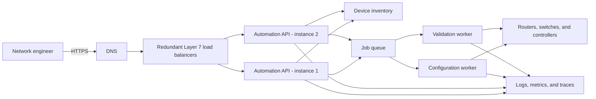

For example, when an engineer requests an access-list update for 500 branch routers, the API should not keep one browser request open while every router is changed. It can validate the request, create a job, place device-specific tasks on a queue, and immediately return a job identifier. Workers then execute tasks at a controlled rate so they do not overwhelm WAN links, controllers, or device management planes.

### 1.1 Front-End Components

The front end is the user-facing portion of an application. It may be a web interface, mobile application, desktop client, command-line tool, or another software system acting as an API consumer.

Front-end responsibilities commonly include:

- Rendering data and controls
- Validating input before transmission
- Maintaining user-interface state
- Managing authentication tokens securely
- Calling back-end APIs
- Handling errors, timeouts, and retryable operations
- Providing accessibility and localization
- Collecting client-side performance and error telemetry

Client-side validation improves usability but must never replace server-side validation. A user can modify browser requests, bypass the graphical interface, or call an API directly. The back end therefore remains responsible for enforcing trust boundaries.

Front ends should also be designed for unreliable networks. A robust client distinguishes among validation errors, authentication failures, authorization failures, rate limits, server errors, and connection timeouts. Repeating every failed request is dangerous because a retry can duplicate a non-idempotent operation such as creating an order.

### 1.2 Back-End Components

The back end implements business logic and protects access to data and privileged operations. It may consist of one application or many independently deployed services.

Typical back-end responsibilities include:

- Authenticating callers and enforcing authorization
- Validating and normalizing request data
- Applying business rules
- Reading and writing data
- Calling internal or third-party services
- Publishing and consuming events
- Protecting secrets and credentials
- Returning consistent API responses
- Producing logs, metrics, and traces

Back-end APIs commonly use HTTP with REST or GraphQL, but applications may also use gRPC, WebSocket connections, message queues, or proprietary protocols. Interface contracts should define methods, resource paths, request and response schemas, authentication, error formats, rate limits, and versioning behavior.

### 1.3 Stateless and Stateful Services

A **stateless service** does not depend on locally stored session information between requests. Any healthy instance can process the next request because shared state is stored externally, such as in a database or distributed cache. Stateless services are generally easier to scale horizontally and replace after failure.

A **stateful service** retains information locally across interactions. Databases, message brokers, and applications with in-memory sessions are stateful. They require careful replication, backup, failover, and data-consistency design.

Where practical, application tiers should be stateless while dedicated data platforms manage state. If session affinity is required, the design must account for the failure of the selected server. Storing critical session state only in a local process creates a single-instance dependency.

### 1.4 Load Balancing

A load balancer distributes traffic across multiple service instances. It can improve scale, availability, and maintenance flexibility by preventing clients from depending on a single server.

Common algorithms include:

- **Round robin:** Sends requests to servers in sequence.
- **Weighted round robin:** Sends more traffic to instances with greater capacity.
- **Least connections:** Selects the server with the fewest active connections.
- **Least response time:** Considers both connection count and observed response time.
- **Hash-based selection:** Uses a property such as source address or session identifier to select a server consistently.

Load balancing can occur at different layers:

- A **Layer 4 load balancer** makes forwarding decisions using transport information such as IP addresses and TCP or UDP ports. It is efficient and protocol-agnostic but has limited awareness of application content.
- A **Layer 7 load balancer** understands application protocols such as HTTP. It can route according to hostnames, paths, headers, cookies, or methods and may terminate TLS.

Health checks are essential. A basic TCP check proves only that a port accepts connections. An application-level readiness check should verify that the instance can safely process traffic. Liveness checks answer a different question: whether the process should be restarted. Combining these concepts incorrectly can create cascading restarts during a dependency outage.

Load balancers may also provide TLS termination, connection reuse, request buffering, web application firewall integration, rate limiting, and access logging. Because the load balancer becomes part of the critical path, it must itself be redundant.

#### Example: Choosing a Load-Balancing Method

Suppose an automation service has three API instances. Two run on newer servers and can process twice as many requests as the third. Plain round robin sends one-third of the traffic to every server and may overload the slower instance. Weighted round robin can assign weights of `2:2:1`, while a least-response-time algorithm can react to current conditions. If the API is stateless, no session affinity is required, and failed requests can be sent to another healthy instance.

---

## 2. Evaluating Scalability and Modularity

### 2.1 Scalability

Scalability is the ability of an application to maintain acceptable service as workload increases. Workload can mean concurrent users, requests per second, stored records, events per second, geographic regions, or computational complexity.

#### Vertical Scaling

Vertical scaling adds CPU, memory, storage, or network capacity to an existing system. It is simple and may require few application changes, but it has hardware limits, can be expensive, and may preserve a single point of failure.

#### Horizontal Scaling

Horizontal scaling adds more service instances. It can provide greater capacity and fault tolerance, especially for stateless components. However, it requires load distribution, shared-state management, distributed coordination, and operational automation.

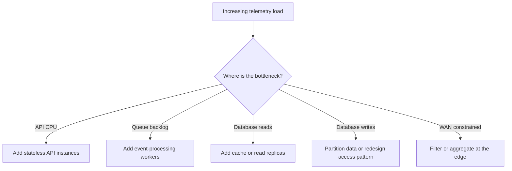

**Network automation example:** A telemetry platform receives 10,000 measurements per second during normal operation and 80,000 after a major routing event. Scaling only the web API does not help if ingestion workers or database partitions are saturated. Queue depth, consumer lag, write latency, and partition distribution identify where capacity is actually needed.

#### Scaling Bottlenecks

An application is only as scalable as its constrained dependency. Adding API instances will not help if all instances wait on one database, serialized lock, third-party API, or undersized network link.

Important indicators include:

- Request throughput and concurrency
- Response-time percentiles, particularly p95 and p99
- CPU, memory, disk, and network saturation
- Database connection and query latency
- Cache hit ratio
- Queue depth and event-processing lag
- Rate-limit consumption
- Error and timeout rate

Capacity planning should use realistic load tests and traffic patterns. An average of 500 requests per second can hide brief peaks of 5,000 requests per second. Average latency can likewise hide a poor experience for the slowest users.

#### Techniques for Improving Scale

- Keep application services stateless.
- Cache frequently read and slowly changing data.
- Use asynchronous processing for work that does not need an immediate result.
- Partition large datasets by a stable key.
- Add read replicas for read-heavy workloads.
- Pool and limit database connections.
- Apply backpressure rather than accepting unlimited work.
- Use rate limits and quotas to protect shared capacity.
- Avoid synchronized retries by using exponential backoff and jitter.

### 2.2 Modularity

Modularity divides software into components with clear responsibilities and interfaces. A well-designed module hides its internal implementation and exposes only the behavior other modules need.

Good modularity aims for:

- **High cohesion:** Closely related behavior is contained in the same module.
- **Low coupling:** A module has few assumptions about other modules.
- **Explicit interfaces:** Inputs, outputs, errors, and dependencies are documented.
- **Replaceability:** Internal implementation can change without breaking consumers.
- **Independent testability:** A module can be validated in isolation.

Modularity does not require microservices. A modular monolith can have strong internal boundaries while remaining one deployable unit. Conversely, a microservices environment can be poorly modular if services share databases, depend on each other's internal schemas, or require coordinated releases.

**Example:** A network controller application can remain one deployable program while separating device inventory, credential access, configuration rendering, compliance validation, and job scheduling into internal modules. The rendering module receives a device model and desired state but does not directly query the inventory database. This boundary makes the renderer easy to unit-test and later extract into a service if independent scale becomes necessary.

### 2.3 Evaluating a Design

When reviewing scalability and modularity, ask:

1. Which components are stateful?
2. Can an application instance be replaced without losing user data?
3. What resource fails first as load increases?
4. Can high-demand functions scale independently?
5. Are service boundaries aligned with business capabilities?
6. Does one module access another module's private data?
7. Are interfaces versioned and backward compatible?
8. Does a local failure remain local, or can it cascade?
9. Can each module be tested, deployed, and observed effectively?
10. Is the operational complexity justified by the expected scale?

---

## 3. High Availability and Resilience

**High availability (HA)** is the ability to remain accessible with minimal interruption. **Resilience** is the ability to absorb failure, recover, and continue delivering an acceptable level of service. HA reduces downtime; resilience assumes failures will happen and plans for their effects.

Availability is commonly expressed as:

```text
Availability = Uptime / (Uptime + Downtime)
```

A service-level objective (SLO) turns a broad goal into a measurable target, such as 99.9 percent successful requests per month with p95 latency below 400 ms.

### 3.1 Eliminating Single Points of Failure

Critical components should have redundancy across failure domains. Examples include:

- Multiple application instances
- Redundant load balancers
- Replicated databases
- Multiple network paths and power sources
- More than one availability zone or data center
- Redundant DNS and identity services
- Backups stored outside the primary failure domain

Redundancy alone is insufficient. The system must detect failure, redirect work, and verify data integrity. An untested standby is an assumption, not a recovery strategy.

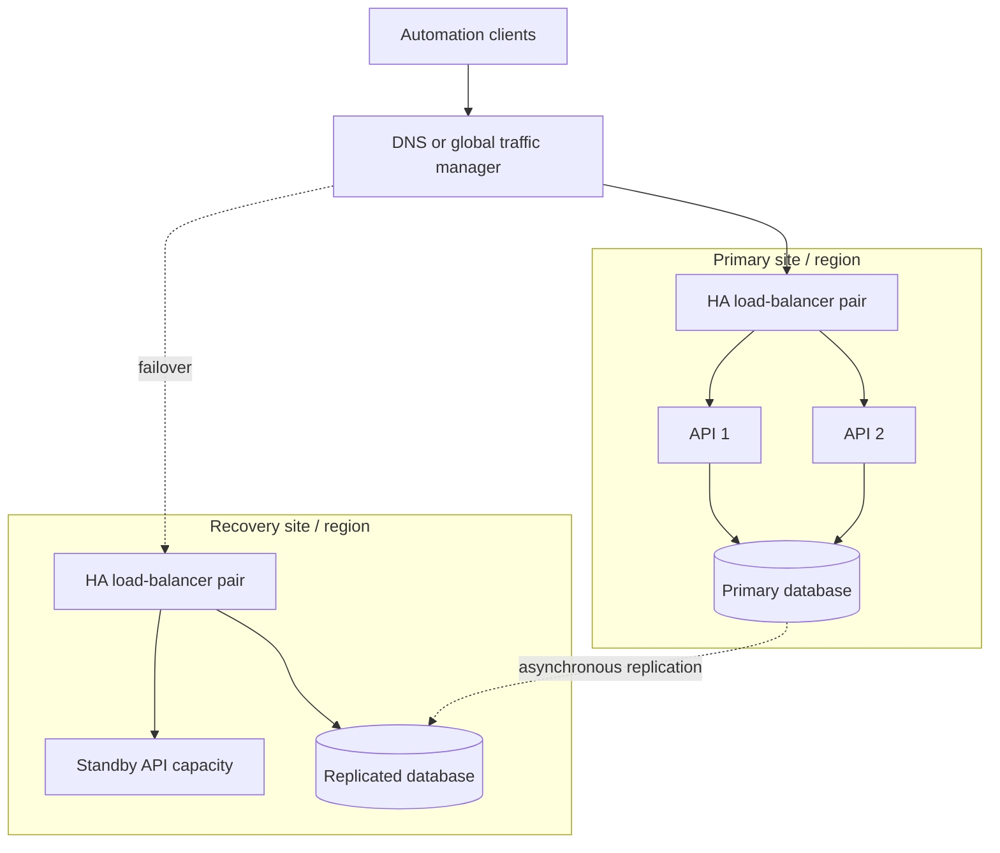

This design can survive an API-instance failure without leaving the primary site. A site failure requires traffic redirection and database promotion. Because replication is asynchronous, the recovery point may be behind the primary database. The RPO must state whether losing the last few seconds of submitted automation jobs is acceptable.

### 3.2 Resilience Patterns

#### Timeouts

Every network call should have a bounded timeout. Without one, threads, connections, or workers may remain blocked indefinitely. Timeout values must reflect expected service behavior and the caller's total latency budget.

#### Retries

Retries can recover from transient failures, but they increase load. Use retries only for errors likely to be temporary and for operations that are idempotent or protected by an idempotency key. Apply exponential backoff and random jitter.

#### Circuit Breakers

A circuit breaker stops calls to a failing dependency after an error threshold is reached. This protects resources and gives the dependency time to recover. After a waiting period, limited test requests determine whether normal traffic should resume.

#### Bulkheads

Bulkheads isolate resource pools so one overloaded function cannot consume every thread, connection, or worker. For example, report generation and interactive API traffic can use separate worker pools.

#### Graceful Degradation

An application may preserve essential behavior when a secondary feature fails. If a recommendation engine is unavailable, a retail site can still display products and process orders.

#### Queue-Based Load Leveling

A message queue separates request arrival from work execution. Producers can continue submitting work during a short processing slowdown, while consumers process at a controlled rate. Queue capacity, retention, ordering, duplication, and poison-message handling must be designed explicitly.

### 3.3 Data Resilience

Data platforms may use synchronous or asynchronous replication:

- **Synchronous replication** waits for multiple copies before acknowledging a write, improving consistency but increasing latency.
- **Asynchronous replication** acknowledges earlier and copies data afterward, improving response time but creating potential data loss or stale reads during failure.

Recovery objectives should be defined:

- **Recovery Time Objective (RTO):** Maximum acceptable time to restore service.
- **Recovery Point Objective (RPO):** Maximum acceptable amount of data loss measured in time.

Backups support recovery from deletion, corruption, ransomware, and software defects. Replication does not replace backups because a bad write can be replicated immediately.

### 3.4 On-Premises Design

On-premises deployments provide direct control over hardware, networks, and data location. HA may use redundant data centers, clustered services, load balancers, storage replication, and dynamic routing.

Challenges include hardware procurement time, fixed capacity, facility dependencies, and the need to operate every layer. Failure domains should include racks, power feeds, switches, storage systems, and sites.

### 3.5 Cloud Design

Cloud platforms provide elastic compute, managed databases, object storage, queues, and regional services. Applications can distribute instances across availability zones and sometimes across regions.

Cloud resilience still follows a shared-responsibility model. A service being managed does not guarantee that the customer's configuration is resilient. Engineers must configure backups, replication, autoscaling boundaries, network paths, identity policies, quotas, and recovery procedures.

Multi-region deployment can improve disaster tolerance and user latency, but it complicates data consistency, traffic routing, cost, testing, and regulatory compliance.

### 3.6 Hybrid Design

A hybrid application spans on-premises and cloud environments. It may keep regulated data on-premises while using cloud services for user interfaces, analytics, backup, or burst capacity.

Hybrid designs must account for:

- WAN latency and bandwidth
- Redundant private or VPN connectivity
- Routing convergence and DNS behavior
- Identity federation
- Certificate and secret management
- Data synchronization and conflict handling
- Consistent logging and monitoring
- Operation during loss of the interconnection

A hybrid design should define which functions continue locally if the WAN fails. If every on-premises transaction synchronously calls a cloud service, the cloud connection is part of the application's availability dependency chain.

#### Example: Hybrid Network Compliance

An on-premises collector polls device state and stores events in a local durable queue. A cloud analytics service evaluates long-term compliance and produces dashboards. During WAN failure, polling and local safety checks continue, while the queue retains events. After recovery, the collector uploads the backlog in bounded batches. Unique event identifiers prevent duplicates, and original timestamps preserve the operational timeline.

---

## 4. Designing for Latency and Bandwidth Constraints

Latency measures delay; bandwidth measures how much data can be transferred per unit of time. They are related but not interchangeable. A high-bandwidth satellite connection can still have substantial latency, while a low-latency local connection may have limited capacity.

Application response time can include:

- DNS lookup
- TCP and TLS connection establishment
- Load-balancer processing
- Authentication
- Application processing
- Database and downstream API calls
- Serialization and transmission
- Front-end rendering

### 4.1 Latency Budgets

An end-to-end target should be divided among components. If an API must respond within 500 ms, allowing three sequential downstream calls to each consume 400 ms makes the objective impossible.

Reduce latency by:

- Placing services near users or dependent data
- Reusing connections with pooling and keepalive
- Caching at the client, CDN, gateway, service, or database layer
- Calling independent dependencies in parallel
- Replacing synchronous work with asynchronous processing
- Reducing the number of network round trips
- Selecting compact payload formats where appropriate
- Indexing databases and optimizing queries

Parallel calls reduce total time but increase simultaneous load. They should be bounded and observed.

### 4.2 Bandwidth-Efficient Design

Bandwidth-conscious techniques include:

- Pagination and bounded query results
- Field selection rather than returning entire records
- Compression for appropriate content types
- Delta synchronization instead of full dataset transfer
- Client and intermediary caching with validation tokens
- Streaming large content rather than buffering it fully
- Deduplication of repeated data
- Image and media optimization
- Batch APIs when many small calls create excessive overhead

Compression trades CPU for network capacity and may not help data that is already compressed. Very small payloads may become larger after protocol overhead.

### 4.3 Disconnected and Intermittent Operation

Mobile, branch, industrial, and edge applications may lose connectivity. An offline-capable design can maintain a local cache or transaction journal and synchronize later. It must define conflict resolution, ordering, data freshness, and the user experience when authoritative data is unavailable.

### 4.4 Example: Automation Across a High-Latency WAN

Assume a central controller manages 1,000 branch devices over links with 180 ms round-trip latency. A workflow that performs 20 sequential API calls per device spends at least 3.6 seconds per device in network delay alone, before processing time.

A stronger design can:

- Retrieve required device state in one bounded request.
- Render candidate configurations centrally.
- Process independent branches concurrently with a safe concurrency limit.
- Compress large configuration transfers.
- Deploy a regional worker near remote devices.
- Return job status asynchronously instead of holding a client connection.

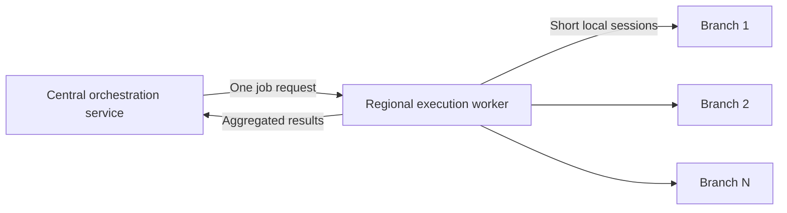

The regional worker reduces repeated long-distance round trips. It also creates another trust and failure boundary, so its credentials, upgrade process, local queue, and observability must be managed.

---

## 5. Maintainability

Maintainability is the ease with which software can be understood, corrected, tested, upgraded, and adapted. It is an architectural quality, not a cleanup activity performed after deployment.

### 5.1 Design Practices

- Separate business logic from transport, storage, and user-interface code.
- Prefer clear interfaces and dependency injection over hidden global dependencies.
- Keep functions and modules focused on one responsibility.
- Use consistent naming, formatting, and error handling.
- Document architectural decisions and important trade-offs.
- Validate configuration at startup and fail with an actionable message.
- Keep secrets outside source code and release artifacts.
- Use feature flags carefully to separate deployment from feature activation.
- Remove obsolete flags and dead code.

### 5.2 API Maintainability

APIs are contracts. Removing fields, changing meanings, or altering error behavior can break consumers. Prefer additive, backward-compatible changes. When a breaking change is necessary, provide a versioning and deprecation policy.

Contract specifications, such as OpenAPI documents, can support documentation, code generation, mock services, and automated compatibility tests.

### 5.3 Deployment Maintainability

Deployments should be repeatable and reversible. Infrastructure and configuration should be represented as version-controlled definitions where possible.

Common deployment strategies include:

- **Rolling deployment:** Replace instances gradually.
- **Blue-green deployment:** Maintain old and new environments and switch traffic between them.
- **Canary deployment:** Send a small percentage of traffic to the new version before expanding.
- **Feature-flag release:** Deploy code while controlling which users can activate the feature.

Database changes require special care because code rollback may not reverse a schema migration. An expand-and-contract approach first adds compatible structures, then migrates usage, and removes old structures only after all consumers have changed.

### 5.4 Documentation and Ownership

Maintainable services should have:

- A clear owner
- Build and deployment instructions
- Architecture and dependency documentation
- API contracts
- Runbooks for common incidents
- Backup and restoration procedures
- Defined service-level indicators and objectives
- A support and deprecation policy

---

## 6. Observability

Monitoring answers known questions, such as whether CPU usage exceeds a threshold. Observability is the ability to infer a system's internal state from its outputs, including conditions that were not predicted in advance.

The three primary telemetry signals are logs, metrics, and traces.

### 6.1 Logs

Logs record discrete events. Structured logs, commonly encoded as JSON, are easier to search and correlate than inconsistent text messages.

Useful fields include:

- Timestamp with timezone
- Severity
- Service and version
- Environment and region
- Host, container, or instance identifier
- Request, trace, and correlation identifiers
- Event name
- Outcome and duration
- Error type and stack information

Logs must not expose passwords, tokens, private keys, or unnecessarily sensitive personal data. Retention and access should follow security and compliance requirements.

### 6.2 Metrics

Metrics are numeric measurements aggregated over time. They are efficient for dashboards, trends, and alerts.

For request-driven services, the RED method focuses on:

- **Rate:** Requests per unit of time
- **Errors:** Failed requests
- **Duration:** Request latency distribution

For infrastructure resources, the USE method considers:

- **Utilization:** Percentage of capacity in use
- **Saturation:** Work waiting for capacity
- **Errors:** Resource-related failures

Percentiles are more informative than averages for user-facing latency. A low average can coexist with severe p99 delays.

### 6.3 Distributed Tracing

A trace follows a request across service boundaries. Each operation is represented by a span containing timing, status, and contextual attributes. Trace identifiers propagated through headers allow events from the gateway, service, database client, and downstream services to be connected.

Tracing helps identify where time was spent and which dependency failed. Sampling controls telemetry cost, but important errors and slow traces should be retained at a higher rate.

### 6.4 Health and Service-Level Indicators

Health endpoints should distinguish among:

- **Liveness:** Is the process running, or should it be restarted?
- **Readiness:** Can the instance safely receive traffic?
- **Dependency health:** Are required downstream services usable?

Useful service-level indicators include successful-request ratio, latency, freshness, durability, and job completion. Alerts should focus on user impact and SLO risk rather than every low-level fluctuation.

Observability must be designed into interfaces and workflows. Adding logs after an incident cannot reconstruct missing correlation identifiers or timing data.

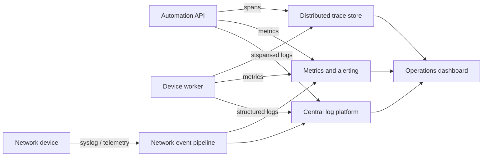

**Example:** A configuration job takes 45 seconds instead of the normal 5 seconds. Metrics show normal API latency but growing worker duration. A trace identifies a slow NETCONF operation, and correlated device logs show repeated authentication negotiation. Together, the signals isolate the delay to device access rather than the API or job queue.

---

## 7. Diagnosing Failures from Event-Related Logs

Troubleshooting should move from observed impact to the relevant component while preserving a timeline.

### 7.1 A Structured Investigation Process

1. **Confirm the symptom.** Identify affected users, operations, regions, versions, and time range.
2. **Check recent changes.** Review deployments, feature flags, schema changes, certificate updates, network policies, and dependency releases.
3. **Find a correlation identifier.** Use a request ID, trace ID, job ID, session ID, or message ID.
4. **Build the event timeline.** Normalize timestamps and order events across services.
5. **Locate the first meaningful failure.** Later errors may be consequences rather than causes.
6. **Compare healthy and failed requests.** Look for differences in input, route, instance, dependency, or execution time.
7. **Correlate with metrics and traces.** Confirm whether resource saturation, latency, or downstream failures match the log evidence.
8. **Mitigate safely.** Roll back, disable a feature, isolate a dependency, or shift traffic.
9. **Verify recovery.** Confirm user-facing indicators and queued work, not only process health.
10. **Record the cause and prevention.** Improve tests, alerts, runbooks, or architecture.

### 7.2 Interpreting Common Events

| Log or event pattern | Possible meaning | Follow-up evidence |
|---|---|---|
| Repeated connection timeout | Dependency unavailable, routing issue, firewall drop, or exhausted connection pool | Network path, dependency health, pool metrics |
| HTTP 401 | Missing, expired, or invalid authentication | Token issuer, clock synchronization, authentication logs |
| HTTP 403 | Authenticated caller lacks permission | Authorization policy and identity claims |
| HTTP 429 | Rate limit or capacity protection | Quota, request rate, retry behavior |
| HTTP 500 | Unhandled application failure | Exception and trace context |
| HTTP 502/503/504 | Upstream failure, no healthy targets, or gateway timeout | Load-balancer health, upstream latency, readiness |
| Database deadlock | Transactions acquired conflicting locks | Query and transaction logs |
| Duplicate message | At-least-once delivery or producer retry | Message ID and idempotency handling |
| Out-of-memory restart | Memory leak, excessive concurrency, or insufficient limit | Heap, container events, request load |

### 7.3 Event Time and Causality

Distributed logs may have clock differences. Systems should use synchronized time and record timestamps with timezone information. Even with synchronization, timestamps alone may not prove causality. Trace parent-child relationships and message identifiers provide stronger evidence.

Logs should distinguish between the original failure and propagated errors. For example, a database timeout may cause an API error, which causes a gateway error, which causes a client retry. Counting all four as independent incidents obscures the root cause.

### 7.4 Worked Example: Failed Configuration Deployment

An engineer reports that job `chg-4821` failed for 40 switches. The API log shows successful job creation, so the investigation moves to the queue and worker logs. All failed devices were processed by one worker instance. Its logs contain `SSH host key verification failed` immediately after a base-image update. Metrics confirm that only the new worker version has failures.

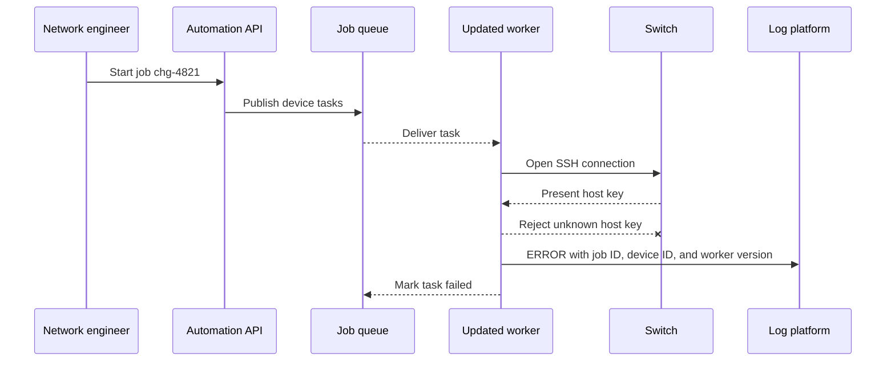

The immediate mitigation is to stop routing jobs to the affected worker version and restore the approved host-key data. The long-term fix is to include host-key validation data in release testing and add an alert grouped by worker version. Disabling host-key verification would hide the symptom by weakening security and is not an acceptable fix.

---

## 8. Selecting a Database

Database selection should begin with access patterns and correctness requirements, not product popularity. Consider data shape, relationships, query types, transaction boundaries, write rate, retention, consistency, scale, latency, availability, and operational skill.

### 8.1 Relational Databases

Relational databases organize data into tables with defined columns and relationships. SQL supports filtering, aggregation, joins, and transactions.

Best suited for:

- Structured data with stable relationships
- Transactions requiring strong consistency
- Financial, inventory, order, and identity systems
- Queries involving joins and aggregations
- Environments requiring mature constraints and reporting

Strengths include ACID transactions, schema enforcement, indexes, constraints, and flexible querying. Challenges can include horizontal write scaling and mapping highly variable or deeply nested data into tables.

### 8.2 Document Databases

Document databases store self-contained documents, often in a JSON-like form. Related attributes can be nested and retrieved together.

Best suited for:

- Content management
- Product catalogs with varying attributes
- User profiles
- Rapidly evolving application schemas
- Data commonly read and written as one aggregate

Document databases offer flexible schemas and natural application-object mapping. However, duplication, cross-document joins, and multi-document consistency require careful design. A flexible schema does not eliminate the need for governance or validation.

### 8.3 Graph Databases

Graph databases represent entities as vertices or nodes and relationships as edges. They are optimized for traversing connected data.

Best suited for:

- Network topology
- Social relationships
- Fraud detection
- Recommendation engines
- Identity and access relationships
- Dependency and path analysis

Graph databases make multi-hop relationship queries natural and efficient. They are less compelling when the workload consists mainly of simple key lookups or tabular reporting.

### 8.4 Column-Family Databases

Column-family databases distribute data by row key and organize related values into column families. They are designed for large-scale, sparse datasets and high write throughput.

Best suited for:

- Very large distributed datasets
- High-volume writes
- Predictable key-based access
- Event, activity, and operational datasets
- Workloads that can tolerate limited joins and denormalized storage

The data model must be designed around queries. Poor partition-key selection can create hot partitions, uneven storage, or queries that require expensive scans.

### 8.5 Time-Series Databases

Time-series databases optimize timestamped measurements and events. They commonly support retention policies, downsampling, compression, and time-window aggregation.

Best suited for:

- Network telemetry
- Application and infrastructure metrics
- Sensor readings
- Financial ticks
- Capacity and performance analysis

Important design factors include label or tag cardinality, sampling frequency, retention, aggregation resolution, and late-arriving data. Unbounded high-cardinality dimensions can consume excessive memory and degrade query performance.

### 8.6 Comparison

| Database type | Primary strength | Typical use | Main design caution |
|---|---|---|---|
| Relational | Transactions and structured relationships | Orders, billing, identity | Scaling writes and rigid schema evolution |
| Document | Flexible aggregate storage | Profiles, catalogs, content | Duplication and cross-document consistency |
| Graph | Relationship traversal | Topology, fraud, recommendations | Operational specialization and fit for simple queries |
| Column-family | Distributed scale and high write rate | Large event or activity datasets | Partition-key and query-driven modeling |
| Time series | Timestamped ingestion and analysis | Metrics, telemetry, sensors | Cardinality and retention management |

An application may use multiple database types, a practice called polyglot persistence. This should be driven by meaningful requirements because every additional platform increases backup, security, monitoring, patching, and skills overhead.

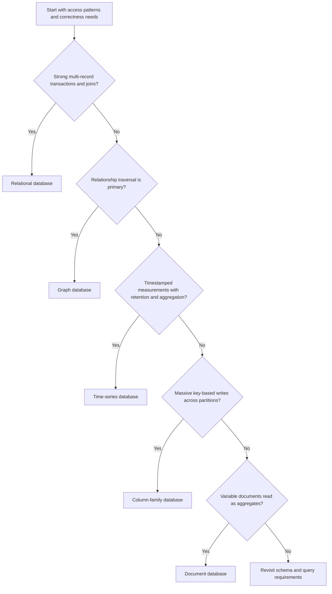

#### Network Automation Data Example

A single automation platform may use a relational database for change approvals and user roles, a graph database for topology paths and dependencies, and a time-series database for interface utilization. Configuration snapshots may fit a document or object store. This is justified only if the topology and telemetry workloads materially benefit from specialized query models; otherwise, one well-operated relational platform may be simpler and safer.

---

## 9. Architectural Models

### 9.1 Monolithic Architecture

A monolith packages the application's major functions into one deployable unit. Modules may still be cleanly separated internally.

Advantages:

- Simple development and local testing
- Straightforward deployment
- Low network overhead between modules
- Easier transactions and debugging in small systems

Limitations:

- The whole application is scaled and deployed together.
- A defect can affect the entire process.
- Large codebases can slow builds and ownership decisions.
- Technology changes may require broad modification.

A modular monolith is often a sensible starting point when service boundaries are uncertain or operational capacity is limited.

### 9.2 Service-Oriented Architecture

Service-oriented architecture (SOA) organizes business functions as reusable services accessed through defined contracts. Services may be integrated through an enterprise service bus, registry, broker, or other middleware.

SOA promotes reuse and interoperability across different platforms. Central integration can enforce transformation, routing, and policy. However, heavily centralized middleware can become complex, slow organizational change, and create a critical dependency.

### 9.3 Microservices Architecture

Microservices divide an application into small services aligned with business capabilities. Each service is independently owned and deployable and should control its own implementation and data.

Advantages:

- Independent scaling and deployment
- Fault isolation
- Team autonomy
- Technology choices appropriate to a service

Costs:

- Network latency and partial failure
- Distributed data consistency
- API versioning
- More deployment and security surfaces
- Greater observability and automation needs
- Difficult end-to-end testing

Microservices should not share a database schema as an informal integration interface. Doing so tightly couples releases and bypasses service contracts.

Cross-service transactions often require eventual consistency and compensating actions. A saga coordinates multiple local transactions and handles failure by reversing or correcting previously completed steps.

### 9.4 Event-Driven Architecture

In an event-driven architecture, producers publish state-change notifications and consumers react asynchronously. Producers do not need direct knowledge of consumers.

Common models include:

- **Publish/subscribe:** Each subscriber receives relevant events.
- **Competing consumers:** Multiple workers share work from a queue.
- **Event streaming:** Consumers read an ordered, retained event stream.

Advantages include loose coupling, load buffering, and easy addition of consumers. Challenges include eventual consistency, duplicate or out-of-order delivery, schema evolution, troubleshooting, and replay behavior.

Consumers should normally be idempotent. A dead-letter queue can isolate messages that repeatedly fail, but operations teams need a documented process to inspect and replay them safely.

### 9.5 Model Selection

| Model | Best fit | Important trade-off |
|---|---|---|
| Monolithic | Small teams, cohesive applications, simple operations | Limited independent deployment and scaling |
| SOA | Enterprise integration and reusable cross-system capabilities | Middleware and governance complexity |
| Microservices | Independent teams and components with different scaling needs | Distributed-system and operational complexity |
| Event-driven | Asynchronous workflows, high-volume events, loose coupling | Eventual consistency and harder diagnosis |

Architectures are often combined. A modular monolith may publish events, and a microservices platform may use synchronous APIs for queries and asynchronous events for state changes.

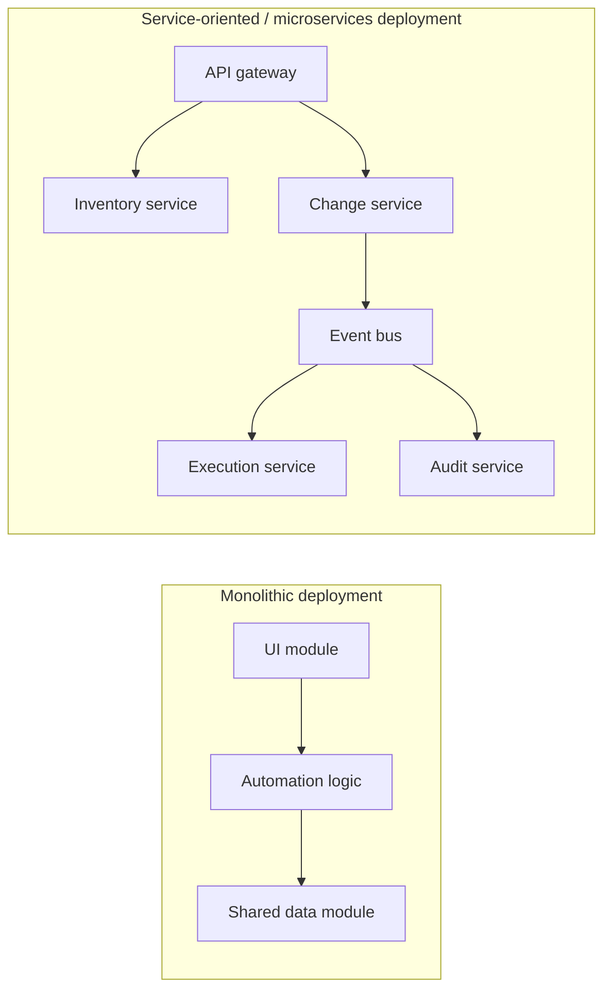

The diagram is intentionally not a claim that the right side is always better. For a small internal automation tool, the monolith may be easier to secure, test, and operate. The distributed model becomes attractive when inventory, execution, and audit functions need independent ownership, scaling, or release cycles.

---

## 10. Advanced Git Operations

Git is a distributed version-control system. Each clone normally contains project history, branches, and the ability to create commits without continuous access to a central server.

### 10.1 Branching and Integration

Create a focused branch for a change:

```bash
git switch -c feature/device-inventory
```

Update remote references and inspect divergence:

```bash
git fetch origin
git log --oneline --graph --decorate --all
```

#### Merge

A merge combines histories and may create a merge commit:

```bash
git switch main
git merge feature/device-inventory
```

Merging preserves the branch relationship and is useful when that context matters.

#### Rebase

A rebase replays commits onto a new base:

```bash
git switch feature/device-inventory
git rebase origin/main
```

Rebase creates new commit identities. Do not rebase shared history unless the team has explicitly coordinated it.

Interactive rebase can reorder, combine, edit, or remove local commits:

```bash
git rebase -i HEAD~4
```

### 10.2 Resolving Conflicts

When Git reports a conflict:

1. Inspect the conflicted files with `git status`.
2. Edit the conflict markers and preserve the intended behavior.
3. Test the result.
4. Stage the resolved files with `git add`.
5. Continue with `git rebase --continue` or complete the merge commit.

Use `git rebase --abort` or `git merge --abort` to return to the pre-operation state when necessary.

### 10.3 Cherry-Pick

Cherry-pick applies the change introduced by a selected commit to the current branch:

```bash
git cherry-pick <commit-id>
```

It is useful for applying a targeted fix to a release branch. It creates a new commit and can complicate history if used as a substitute for a clear integration strategy.

### 10.4 Revert and Reset

`git revert` creates a new commit that reverses an earlier commit:

```bash
git revert <commit-id>
```

It is appropriate for shared branches because it preserves history.

`git reset` moves a branch reference and can also modify the index and working tree. It is useful for correcting local history but can destroy uncommitted work or disrupt collaborators. Use it cautiously and avoid rewriting shared branches.

### 10.5 Stash

Temporarily store uncommitted changes:

```bash
git stash push -m "partial inventory work"
git stash list
git stash pop
```

Stashes are local and should not replace commits for important work.

### 10.6 Bisect

`git bisect` performs a binary search to identify the commit that introduced a defect:

```bash
git bisect start
git bisect bad
git bisect good <known-good-commit>
```

After testing each selected revision, mark it good or bad. Finish with:

```bash
git bisect reset
```

The process can be automated when a script or test reliably returns success or failure.

### 10.7 Tags and Releases

Annotated tags identify important versions and include metadata:

```bash
git tag -a v2.3.0 -m "Release 2.3.0"
git push origin v2.3.0
```

Tags should follow the project's release policy and should not be silently moved after publication.

---

## 11. Release Packaging and Base Libraries

A release package is the deployable representation of a tested software version. It may be a language package, archive, executable, container image, machine image, or deployment bundle.

### 11.1 Reproducible Builds

A build should produce the same functional artifact from the same source and dependency definitions. Important practices include:

- Pin direct and transitive dependency versions with a lock file.
- Build in a controlled environment.
- Keep build scripts in version control.
- Separate build-time and runtime dependencies.
- Record source revision and build metadata.
- Generate a software bill of materials (SBOM).
- Sign artifacts and verify checksums or provenance.
- Store immutable artifacts in a controlled registry.

Do not rebuild the same release differently for each environment. Build once, then promote the identical artifact through test, staging, and production while supplying environment-specific configuration externally.

### 11.2 Semantic Versioning

Semantic versioning commonly uses `MAJOR.MINOR.PATCH`:

- **MAJOR:** Incompatible API change
- **MINOR:** Backward-compatible feature
- **PATCH:** Backward-compatible fix

Pre-release and build identifiers can provide additional context. Version numbers communicate intent but do not replace compatibility tests.

### 11.3 Base Libraries

Base libraries provide common capabilities such as logging, authentication, configuration, error handling, API clients, and telemetry. Shared libraries can improve consistency, but they also create organizational coupling.

Manage base libraries by:

- Keeping their public interfaces small and stable
- Following semantic versioning
- Publishing migration and deprecation guidance
- Pinning application dependencies
- Testing applications against planned upgrades
- Scanning dependencies for vulnerabilities and license issues
- Avoiding deep dependency trees where practical
- Defining ownership and support expectations

A security update may require rapid adoption, but an uncontrolled upgrade can break applications. Automated dependency proposals, continuous integration tests, and staged deployment help balance speed and safety.

Container base images are also dependencies. Pin them by immutable digest where appropriate, rebuild regularly for patched operating-system packages, minimize installed tools, and scan the final image rather than only the application source.

### 11.4 Release Promotion and Rollback

A mature release pipeline typically performs:

1. Source and policy validation
2. Unit and integration testing
3. Static and dependency security analysis
4. Artifact creation
5. Signing and registry publication
6. Deployment to a test environment
7. Acceptance and performance testing
8. Controlled production rollout
9. Health and SLO verification
10. Promotion, pause, or rollback

Rollback must account for persistent state. A previous application version may not understand a newly modified database schema or event format.

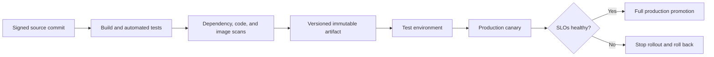

**Example:** Version `2.4.0` of a network-compliance service introduces support for a new device family. The pipeline builds one container image, records its Git commit, generates an SBOM, runs configuration-parser tests, scans the final image, and deploys it to a test environment with simulated device responses. A canary then processes five percent of production jobs. If parse-error rate or job duration exceeds its threshold, promotion stops automatically.

---

## 12. AI in Modern Application Development

Artificial intelligence now affects both how software is developed and what modern applications can do. AI coding assistants can explain unfamiliar code, propose tests, generate documentation, translate between APIs, and suggest implementations. AI-enabled applications can classify incidents, summarize logs, detect anomalies, generate configurations, or provide natural-language interfaces.

AI output is probabilistic rather than guaranteed. A generated answer can be plausible and still be incorrect, insecure, or incompatible with the target environment. Human review, deterministic validation, and operational guardrails remain necessary.

### 12.1 AI-Assisted Development

Useful development activities include:

- Generating an initial implementation or test scaffold
- Explaining a library or unfamiliar code path
- Identifying possible edge cases
- Drafting documentation and release notes
- Suggesting refactoring opportunities
- Converting a structured requirement into an API schema

Generated code should pass the same reviews, tests, security checks, and licensing controls as human-written code. Sensitive source, customer data, private configurations, secrets, and incident details must not be sent to an unapproved external model.

An engineer remains accountable for the change. AI does not know the full production context, approved device commands, maintenance policy, or business risk unless those constraints are explicitly and correctly supplied.

### 12.2 AI in Network Automation

AI can help operators translate intent into candidate actions. For example, an engineer may ask, “Identify interfaces with recurring errors after the last software upgrade and propose a remediation plan.” An AI-enabled workflow can retrieve telemetry and change records, summarize likely correlations, and create a proposed plan.

The model should not directly push configuration to production. A safer architecture separates probabilistic reasoning from deterministic execution:

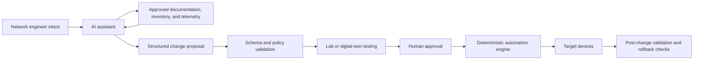

The AI produces a proposal, not an unrestricted command stream. The proposal is validated against a schema, checked by policy, tested, approved, and executed by a conventional automation engine with known behavior.

### 12.3 Retrieval-Augmented Generation and Tool Use

Retrieval-augmented generation (RAG) supplies a model with selected enterprise knowledge at request time. In network operations, retrieval sources might include approved design standards, current inventory, vendor documentation, previous incidents, and change policy.

Tool-using AI agents can call inventory APIs, query telemetry, or create a draft change request. Each tool should have a narrow permission scope, validated input, output limits, audit logging, and explicit rules for actions requiring approval. Read-only diagnostic tools should be separated from mutation tools.

### 12.4 AI Risks and Controls

| Risk | Example | Control |
|---|---|---|
| Hallucination | Model invents an unsupported device command | Allowlisted schemas, lab validation, vendor-source retrieval |
| Prompt injection | Untrusted ticket text instructs the model to expose secrets | Treat retrieved content as data, isolate instructions, restrict tools |
| Data leakage | Private configuration is sent to an unapproved service | Data classification, approved models, redaction, access controls |
| Excessive agency | Model changes production without review | Least privilege, approval gates, deterministic execution |
| Non-repeatability | Same prompt produces different plans | Store inputs and model metadata; validate structured output |
| Model drift | Behavior changes after a model update | Version pinning where available, evaluation suites, staged rollout |
| Bias or weak evidence | Incident summary overweights one signal | Require references to telemetry and human review |

### 12.5 Operating AI-Enabled Applications

Traditional metrics such as latency, errors, and availability still apply, but AI systems need additional evaluation:

- Task success and factual accuracy
- Groundedness in approved source material
- Unsafe or policy-violating output rate
- Tool-call success and rejection rate
- Token usage, model cost, and response time
- Retrieval quality
- Human correction and override rate

Prompts, retrieval indexes, model versions, and evaluation datasets are application dependencies. They should be versioned, tested, reviewed, and released through controlled pipelines. Logs should retain enough metadata for diagnosis without storing sensitive prompts or model responses unnecessarily.

---

## 13. Sequence Diagrams with API Calls

A sequence diagram shows interactions in time order. Participants appear from left to right, and time flows downward. Sequence diagrams help teams analyze API boundaries, authentication, dependencies, error paths, and latency.

### 13.1 Elements of a Sequence Diagram

- **Actor:** A user or external system initiating behavior
- **Participant:** A client, service, database, queue, or other component
- **Message:** A request, response, or event
- **Activation:** Time during which a participant performs work
- **Alternative path:** Conditional success or failure behavior
- **Loop:** Repeated interaction
- **Asynchronous message:** A message that does not block for immediate completion

API messages should include the method and resource when useful, such as `POST /v1/orders`. Responses should include status codes or significant result data.

### 13.2 Example: Synchronous API Request

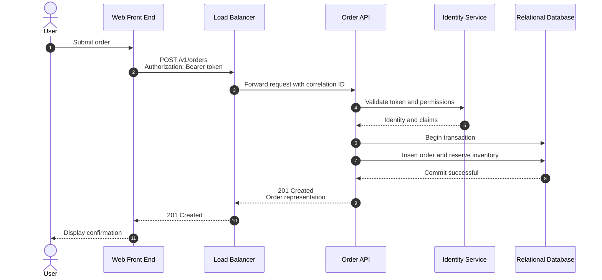

This diagram exposes several design questions:

- What timeout applies to identity and database calls?
- Is token validation local or remote?
- Is the order operation idempotent?
- What happens if the client times out after the database commits?
- Is inventory managed in the same transaction boundary?
- Which participant creates and propagates the correlation ID?

### 13.3 Example: Asynchronous Event Processing

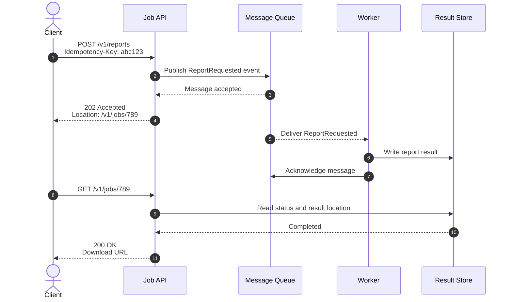

The `202 Accepted` response means processing has begun but is not complete. A job resource allows the client to check progress. The idempotency key protects against duplicate job creation when the client retries.

### 13.4 Modeling Failure Paths

A useful sequence diagram should show important alternative behavior, not only the successful path.

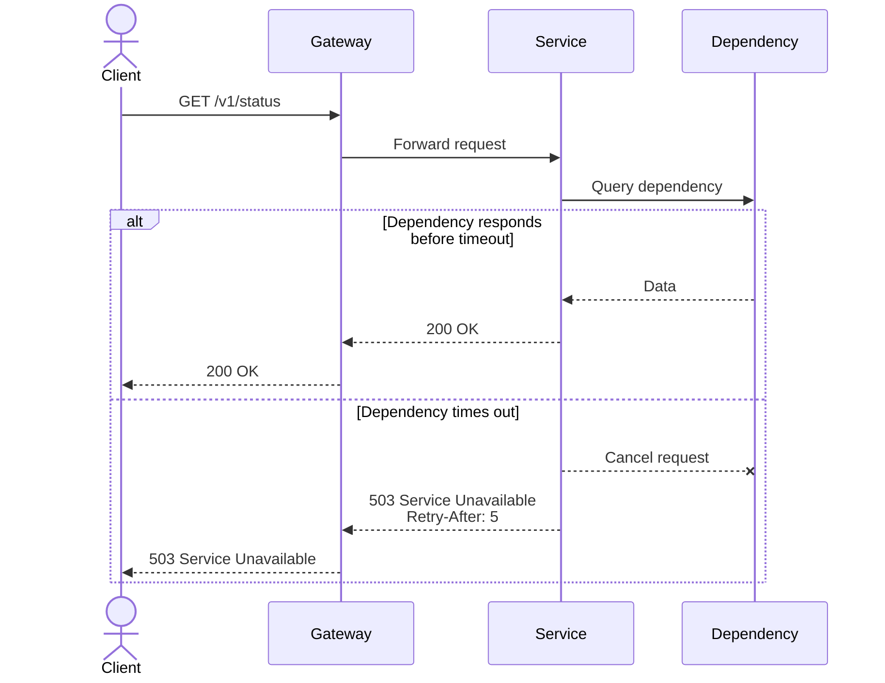

When building a sequence diagram, verify that it captures trust boundaries, timeouts, retries, asynchronous transitions, data ownership, error responses, and observability context.

---

## 14. Integrated Design Example

Consider a network-configuration compliance platform. Devices send telemetry and configuration events to collectors. Engineers use a web interface to view compliance status and request remediation.

A suitable design might include:

- A static web front end served through a content delivery network
- An API gateway for TLS termination, authentication, routing, and rate limits
- Stateless inventory and compliance APIs behind load balancers
- A message broker for telemetry and remediation jobs
- Horizontally scaled workers for policy evaluation
- A relational database for users, policies, approvals, and job state
- A graph database for network topology and path relationships
- A time-series database for device measurements
- Object storage for reports and large configuration snapshots
- Centralized logs, metrics, and distributed traces

Scalability comes from separating interactive APIs from event-processing workers and scaling each independently. Modularity comes from clear ownership of inventory, policy, topology, and remediation behavior. Resilience comes from replicated data, redundant service instances, bounded retries, idempotent consumers, dead-letter queues, and tested recovery procedures.

For a hybrid deployment, collectors may remain on-premises near managed devices, while analysis and reporting run in the cloud. Local buffering allows collectors to continue accepting telemetry when WAN connectivity is lost. When connectivity returns, events are uploaded with original timestamps and unique identifiers. The design must limit backlog growth, preserve event ordering where required, and prevent duplicate processing.

Operational teams can diagnose a failed remediation by searching the job ID across the API, queue, worker, and device-connection logs. A trace reveals request timing, while queue metrics show whether the delay occurred before or during processing. Release packages are built once, signed, scanned, and promoted through environments. Git tags identify the deployed source revision, enabling a precise comparison with the previous release.

---

## Chapter Summary

Distributed applications combine front-end clients, network entry points, back-end services, and data platforms. Load balancers distribute traffic and remove direct dependence on individual instances, while health checks prevent traffic from reaching services that are not ready.

Scalability requires identifying the actual bottleneck, managing state, and selecting appropriate vertical or horizontal strategies. Modularity requires cohesive components, low coupling, stable interfaces, and clear data ownership.

Availability and resilience depend on redundancy, failure detection, timeouts, controlled retries, circuit breakers, isolation, backups, and tested recovery. On-premises, cloud, and hybrid environments expose different failure domains, but none eliminates the need for deliberate design.

Latency and bandwidth must be treated as architectural constraints. Caching, connection reuse, pagination, asynchronous processing, data placement, and payload optimization can improve performance, but every optimization has consistency, complexity, or resource trade-offs.

Maintainability and observability must be designed from the beginning. Versioned interfaces, repeatable deployments, structured logs, meaningful metrics, distributed traces, and runbooks make systems safer to change and easier to diagnose.

Database selection should match data relationships and access patterns. Relational, document, graph, column-family, and time-series databases each optimize different workloads. Architectural models likewise involve trade-offs: monoliths simplify operations, SOA supports enterprise integration, microservices enable independent ownership and scale, and event-driven systems enable asynchronous decoupling.

Advanced Git operations support controlled collaboration and recovery. Reproducible release packaging, dependency governance, signed artifacts, and staged promotion connect source control to reliable delivery. Finally, sequence diagrams make distributed behavior visible by showing API calls, events, timing, dependencies, and failure paths.

AI assists developers with coding, tests, documentation, diagnosis, and natural-language interaction, while AI-enabled applications can analyze telemetry and propose actions. Because model output is probabilistic, production automation should combine AI reasoning with trusted data, structured output, deterministic validation, least-privilege tools, human approval, and complete auditing.
