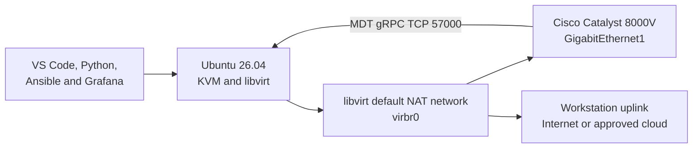

# Optional Workstation Extension: Install Cisco Catalyst 8000V on KVM

## Introduction

The standard course uses reservable Cisco DevNet Sandbox routers because they provide a predictable IOS XE environment without consuming workstation resources. However, a locally hosted Cisco Catalyst 8000V gives a learner a router that remains available outside a sandbox reservation. It is especially useful for repeating NETCONF, RESTCONF, model-driven telemetry, and CI/CD exercises at an individual pace.

This optional guide installs KVM and libvirt on the Ubuntu 26.04 workstation prepared in Lab 1, imports an authorized Cisco Catalyst 8000V `qcow2` image, and places its first interface on libvirt's default NAT network. The resulting design lets the workstation manage the router directly while the router reaches external services through the workstation.



## Scope and Support Position

This guide is intended for an x86-64 lab workstation. Confirm that the following command reports `amd64`:

```bash
dpkg --print-architecture
```

Cisco Catalyst 8000V KVM images target x86-64. Do not attempt this procedure on an ARM64 workstation. Software emulation would be extremely slow and is not a supported replacement for the required architecture.

Run the router on a bare-metal KVM host whenever possible. Cisco states that running Catalyst 8000V inside another virtual machine is not tested or recommended. Nested virtualization might appear to work in a demonstration environment, but it can introduce unpredictable timing, packet-processing, and hardware-instruction behavior.

Cisco publishes the KVM combinations it validates against supported Red Hat Enterprise Linux releases. Ubuntu KVM is used here as a practical course lab platform and can fall under Cisco's non-certified support model. Do not treat this workstation procedure as a substitute for the Cisco support matrix when designing a production deployment.

The learner must obtain the image through an authorized Cisco account and comply with the applicable Cisco licensing and export requirements. This course does not distribute Cisco software images, license files, or entitlements.

## Resource Requirements

The router shares the workstation with NetBox, Vault, Grafana, InfluxDB, Telegraf, VS Code, and possibly a GitLab Runner. Allocate resources conservatively:

| Resource | Practical lab allocation |
|---|---:|
| Architecture | x86-64 with Intel VT-x or AMD-V |
| Catalyst 8000V vCPU | 4 |
| Catalyst 8000V memory | 8 GB |
| Workstation memory | 32 GB recommended |
| Free storage | At least 30 GB before downloading and importing the image |
| Network adapters | One VirtIO adapter for management; additional adapters only when required |

Cisco examples can boot smaller profiles, but Cisco recommends 8 GB for feature-rich use. Avoid oversubscribing the host CPU while collecting telemetry or testing forwarding. Catalyst 8000V is sensitive to delayed vCPU scheduling.

## Task 1: Verify Hardware Virtualization

Install the hardware-check utility:

```bash
sudo apt update
sudo apt install -y cpu-checker
```

Run:

```bash
kvm-ok
```

The expected result states that KVM acceleration can be used. If it cannot, enable Intel VT-x, Intel VT-d, AMD-V, or SVM in the workstation firmware as appropriate. After changing firmware settings, power the workstation off completely and start it again.

Also confirm that the KVM device exists:

```bash
ls -l /dev/kvm
```

Do not continue with software-only emulation. Correct the hardware, firmware, or host-virtualization problem first.

## Task 2: Install KVM, libvirt, and the Management Tools

Install the Ubuntu virtualization packages:

```bash
sudo apt update
sudo apt install -y \
  qemu-kvm \
  qemu-utils \
  libvirt-daemon-system \
  libvirt-clients \
  virtinst \
  virt-manager \
  bridge-utils
```

Enable and start libvirt:

```bash
sudo systemctl enable --now libvirtd
sudo systemctl status libvirtd --no-pager
```

Add the learner account to the groups that manage system libvirt guests and KVM acceleration:

```bash
sudo usermod -aG libvirt,kvm "$USER"
```

Log out of the Ubuntu desktop and log in again so the new group membership takes effect. Then verify:

```bash
id
virsh --connect qemu:///system list --all
```

This guide uses `qemu:///system`. System scope provides the shared libvirt network and predictable service management required for a router that must communicate with the workstation.

## Task 3: Prepare the Default NAT Network

List the libvirt networks:

```bash
virsh --connect qemu:///system net-list --all
```

When the `default` network exists but is inactive, start it and configure it to start with the host:

```bash
virsh --connect qemu:///system net-start default
virsh --connect qemu:///system net-autostart default
```

Inspect its addressing:

```bash
virsh --connect qemu:///system net-dumpxml default
```

A typical installation uses `192.168.122.1/24` on `virbr0`, but the XML on the learner's workstation is authoritative. Record:

- The bridge gateway address
- The subnet mask
- The DHCP range

Choose an unused router address in the subnet and outside the DHCP range. The examples below use:

```text
Host/libvirt gateway: 192.168.122.1
Catalyst 8000V:        192.168.122.10/24
```

Change these values when the local network is different.

The default network is suitable for this course because the workstation can initiate SSH, NETCONF, RESTCONF, and gNMI sessions to the router. The router can also reach the workstation's Telegraf receiver and can make outbound connections through NAT. Other physical systems cannot initiate sessions to the VM unless the learner deliberately adds routing, port forwarding, or a bridged network.

## Task 4: Obtain and Protect the Cisco Image

Sign in to the [Cisco Software Download](https://software.cisco.com/download/home) site, search for **Cisco Catalyst 8000V**, select an IOS XE release approved by the instructor, and download a KVM `qcow2` image. Cisco provides different console and secure-boot image variants. A serial-capable `qcow2` image is convenient for `virsh console`; a standard image can be managed through the graphical console in Virtual Machine Manager.

Use the checksum published by Cisco to verify the completed download. Do not rename or modify the downloaded source image until its checksum has been verified.

Create a learner-controlled image directory:

```bash
mkdir -p "$HOME/lab-services/c8000v/images"
```

Using the VS Code Explorer, copy and paste the verified Cisco `qcow2` file from the download location into `~/lab-services/c8000v/images/`. Keep this file as the clean source image.

Display its metadata:

```bash
qemu-img info "$HOME/lab-services/c8000v/images/"*.qcow2
```

Create the writable VM disk under libvirt storage. Replace `<SOURCE_QCOW2>` with the complete verified filename:

```bash
sudo install -d -m 0755 /var/lib/libvirt/images/c8000v

sudo qemu-img convert \
  -p \
  -O qcow2 \
  "$HOME/lab-services/c8000v/images/<SOURCE_QCOW2>" \
  /var/lib/libvirt/images/c8000v/c8000v-lab.qcow2

sudo chown libvirt-qemu:kvm \
  /var/lib/libvirt/images/c8000v/c8000v-lab.qcow2
sudo chmod 0660 \
  /var/lib/libvirt/images/c8000v/c8000v-lab.qcow2
```

The conversion preserves the downloaded image as a reusable source and gives this VM its own writable disk.

## Task 5: Create the Virtual Machine

### Option A: Use Virtual Machine Manager

Cisco recommends a graphical deployment for administrators who are new to KVM:

1. Run `virt-manager`.
2. Connect to **QEMU/KVM - System** rather than the per-user session.
3. Select **Create a new virtual machine**.
4. Choose **Import existing disk image**.
5. Browse to `/var/lib/libvirt/images/c8000v/c8000v-lab.qcow2`.
6. Select a generic Linux operating system when automatic detection does not identify the image.
7. Allocate four vCPUs and 8192 MiB of memory.
8. Name the VM `c8000v-lab`.
9. Select **Customize configuration before install**.
10. Confirm that the disk uses the IDE bus, following Cisco's KVM deployment guidance.
11. Confirm that the first NIC uses the libvirt `default` network and the VirtIO device model.
12. Retain the graphical console. When a serial-capable Cisco image was downloaded, also add a PTY serial device.
13. Select **Begin Installation**.

Watch the console during the first boot. The image variant determines whether the initial output appears on the graphical or serial console.

### Option B: Use `virt-install`

The same VM can be created reproducibly from the terminal:

```bash
sudo virt-install \
  --connect qemu:///system \
  --name c8000v-lab \
  --arch x86_64 \
  --cpu host \
  --vcpus 4 \
  --memory 8192 \
  --hvm \
  --import \
  --osinfo detect=on,require=off \
  --disk path=/var/lib/libvirt/images/c8000v/c8000v-lab.qcow2,bus=ide,format=qcow2 \
  --network network=default,model=virtio \
  --graphics spice \
  --serial pty \
  --noautoconsole
```

Confirm that libvirt created and started the domain:

```bash
virsh --connect qemu:///system list --all
virsh --connect qemu:///system dominfo c8000v-lab
virsh --connect qemu:///system domiflist c8000v-lab
```

Open the graphical console with Virtual Machine Manager. For a serial-capable image, try:

```bash
virsh --connect qemu:///system console c8000v-lab
```

Press `Enter` after connecting. Leave a serial console with `Ctrl+]`.

## Task 6: Complete the First Boot

The first boot can take several minutes while IOS XE initializes storage and platform services. Do not force-reset the VM merely because the console pauses.

When prompted to enter the initial configuration dialog, answer `no` and configure the router manually. If the selected release asks for a deployment mode, choose the autonomous IOS XE mode appropriate for this course rather than controller-managed onboarding.

At the IOS XE CLI, first inspect the interfaces:

```text
enable
show ip interface brief
```

Recent Catalyst 8000V releases do not provide a special `GigabitEthernet0` management interface. The first VirtIO NIC normally appears as `GigabitEthernet1`, but the command output is authoritative.

Configure the management address using values recorded from the libvirt network:

```text
configure terminal
hostname C8KV-LAB
no ip domain-lookup
ip domain name lab.local

username cisco privilege 15 secret <STRONG-LAB-PASSWORD>
enable secret <DIFFERENT-STRONG-LAB-PASSWORD>

interface GigabitEthernet1
 description KVM-MANAGEMENT
 ip address 192.168.122.10 255.255.255.0
 no shutdown
 exit

ip route 0.0.0.0 0.0.0.0 192.168.122.1

crypto key generate rsa modulus 2048
ip ssh version 2

line vty 0 4
 login local
 transport input ssh
 exit

netconf-yang
restconf
end
write memory
```

Replace the example addresses and passwords. Do not reuse Cisco DevNet Sandbox credentials or commit the local credentials to a course repository.

Verify the result:

```text
show ip interface brief
show ip route
show platform software yang-management process
show running-config | include netconf-yang|restconf
show version
```

From the Ubuntu workstation, establish an SSH session:

```bash
ssh -o StrictHostKeyChecking=accept-new \
  cisco@192.168.122.10
```

Use this locally assigned address in the lab `.env` file when a later exercise targets the KVM router.

## Task 7: Connect the Router to the Local TIG Stack

When Lab 10 uses this router, start the local TIG stack from Lab 1. The Telegraf container publishes its Cisco MDT receiver on workstation TCP port `57000`.

On the default libvirt network, the router reaches the workstation through the bridge gateway. With the example addressing, the MDT receiver is:

```text
192.168.122.1:57000
```

Use the actual gateway from `virsh net-dumpxml default`. Do not configure `127.0.0.1`, because loopback on the router refers to the router itself. Restrict TCP `57000` with the workstation firewall so that only the libvirt management subnet can reach it.

## Task 8: Operate the VM Safely

Use graceful lifecycle commands:

```bash
virsh --connect qemu:///system start c8000v-lab
virsh --connect qemu:///system shutdown c8000v-lab
virsh --connect qemu:///system reboot c8000v-lab
virsh --connect qemu:///system list --all
```

Wait for `shutdown` to complete. Use the following command only when IOS XE is unresponsive; it is equivalent to removing power:

```bash
virsh --connect qemu:///system destroy c8000v-lab
```

Do not change vCPU, memory, disks, or network adapters while the VM is running unless the active Cisco release and hypervisor combination explicitly supports that operation.

To remove the VM definition while retaining its disk:

```bash
virsh --connect qemu:///system shutdown c8000v-lab
virsh --connect qemu:///system undefine c8000v-lab
```

Confirm the domain is stopped before undefining it. The disk remains under `/var/lib/libvirt/images/c8000v/` and can be imported again.

## Troubleshooting

| Symptom | Investigation |
|---|---|
| `kvm-ok` reports that acceleration cannot be used | Enable VT-x, AMD-V, or SVM in firmware; avoid an unsupported nested-virtualization host |
| `virsh` reports permission denied | Confirm membership in `libvirt` and `kvm`, then log out and back in |
| `virt-install` cannot read the disk | Confirm the disk resides under `/var/lib/libvirt/images/c8000v/` with ownership `libvirt-qemu:kvm` |
| VM starts but the console is blank | Open the graphical console; confirm whether the downloaded image is a VGA or serial variant |
| `virsh console` connects without output | Use the graphical console or import a serial-capable Cisco image; a PTY alone cannot change the console selected inside the image |
| `GigabitEthernet1` remains down | Confirm `no shutdown`, the VirtIO NIC, and attachment to the active libvirt `default` network |
| Workstation cannot open SSH, NETCONF, or RESTCONF | Verify the address, local username, RSA key, VTY settings, and IOS XE management services |
| Telemetry subscription cannot reach Telegraf | Use the libvirt bridge gateway and TCP `57000`; verify the local TIG stack and workstation firewall |
| Router reports scheduling or packet-processing problems | Stop unneeded lab services, avoid vCPU overcommit, and allocate physical CPU time consistently |

## Key Takeaways

- KVM acceleration and x86-64 hardware are prerequisites, not optional performance enhancements.
- A copied working disk protects the authorized Cisco source image from accidental modification.
- The libvirt default NAT network is sufficient for workstation-to-router automation and router-to-workstation telemetry.
- VirtIO networking, an IDE-backed imported Cisco disk, and the correct console image reduce compatibility problems.
- Local IOS XE credentials, licenses, and software images remain the learner's security and compliance responsibility.
- A locally hosted Catalyst 8000V supplements the Cisco DevNet Sandbox; it does not guarantee identical capabilities or YANG revisions.

## References

- [Cisco Catalyst 8000V installation overview](https://www.cisco.com/c/en/us/td/docs/routers/C8000V/Configuration/c8000v-installation-configuration-guide/installation-overview/overview-of-c8000v-installation.html)
- [Cisco Catalyst 8000V installation in KVM](https://www.cisco.com/c/en/us/td/docs/routers/C8000V/Configuration/c8000v-installation-configuration-guide/install-cisco-catalyst-8000v-in-kvm-environment/installing-in-kvm-environments-overview.html)
- [Create a Catalyst 8000V VM with the KVM CLI](https://www.cisco.com/c/en/us/td/docs/routers/C8000V/Configuration/c8000v-installation-configuration-guide/install-cisco-catalyst-8000v-in-kvm-environment/create-vm-using-cli.html)
- [Cisco Catalyst 8000V Day 0 configuration](https://www.cisco.com/c/en/us/td/docs/routers/C8000V/Configuration/c8000v-installation-configuration-guide/day-0-configuration/performing-day-0-configuration-using--txt-or-xml-files.html)
- [Ubuntu libvirt documentation](https://ubuntu.com/server/docs/how-to/virtualisation/libvirt/)
