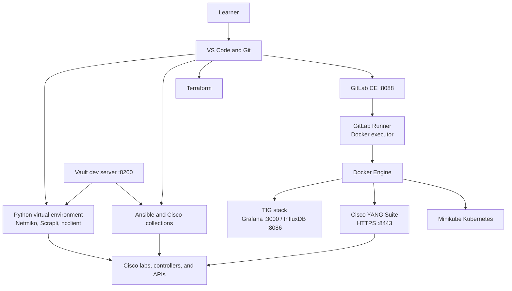

# Lab 1: Preparing the Network Automation Workstation

## Lab Introduction

Every later lab depends on a predictable development environment. In this lab, you will prepare a single Ubuntu 26.04 LTS workstation as a network automation control node, development platform, container host, local Kubernetes cluster, observability server, secrets laboratory, and CI/CD system. By the end of the lab, the workstation will contain Python automation libraries, Ansible, Terraform, Vault, Docker, Minikube, the TIG observability stack, Cisco YANG Suite, Git, Visual Studio Code, GitLab Community Edition, and GitLab Runner.

This is deliberately an **all-in-one learning environment**. It makes the course portable because every learner has the same tools, but it is not a recommended production architecture. GitLab Runner should normally be isolated from the GitLab server; Vault should use persistent encrypted storage and TLS; Kubernetes should run on dedicated nodes; and monitoring should remain available when an application host fails. Those production distinctions are noted throughout the lab.


## Learning Objectives

After completing this lab, you will be able to:

- Prepare an Ubuntu host for repeatable automation development.
- Create an isolated Python environment and install network automation packages.
- Explain why `scrapli`, `xmltodict`, `PyYAML`, and Python's built-in `json` module are installed differently.
- Install and verify Ansible and common Cisco collections.
- Install Docker Engine and use Docker Compose to operate a TIG stack.
- Install `kubectl` and run a local Kubernetes cluster with Minikube.
- Install Terraform and use Vault safely in training development mode.
- Deploy Cisco YANG Suite with Docker.
- Install Git, Visual Studio Code, GitLab CE, and a local GitLab Runner.
- Validate the complete workstation and collect evidence for troubleshooting.

## Estimated Time

Allow **3 to 5 hours**, depending on Internet speed and workstation resources. Container image downloads and the GitLab installation account for much of the time.

## Workstation Requirements

Because all services share one host, the workstation should have at least the following resources:

| Resource | Minimum for the lab | Recommended |
|---|---:|---:|
| CPU | 8 vCPUs | 12 vCPUs |
| RAM | 16 GB | 24–32 GB |
| Free disk | 100 GB | 150 GB SSD |
| Network | Internet access and DNS | Stable broadband |
| User access | Account with `sudo` | Dedicated learner account |

GitLab, Minikube, YANG Suite, and the TIG stack do not need to run simultaneously during ordinary course work. If the host has only 16 GB of RAM, stop services that are not needed before starting Minikube.

## Lab Architecture



### Local Service Ports

| Component | Port or endpoint | Purpose |
|---|---|---|
| Grafana | `http://127.0.0.1:3000` | Dashboards |
| InfluxDB | `http://127.0.0.1:8086` | Time-series storage and API |
| Vault | `http://127.0.0.1:8200` | Training-only secret service |
| YANG Suite | `https://localhost:8443` | YANG, NETCONF, RESTCONF, and telemetry tools |
| GitLab CE | `http://gitlab.lab.local:8088` | Source control and CI/CD |
| SSH | TCP `22` | Host access and Git over SSH |

The TIG services bind to `127.0.0.1` so they are not exposed automatically to the surrounding network. If the learner accesses the workstation remotely, use SSH port forwarding or deliberately configure a firewall and trusted interface instead of changing every service to `0.0.0.0` without review.


## Task 1: Update Ubuntu and Install Foundation Packages

Begin with current package metadata and common development tools. A package upgrade can require a restart, particularly when the kernel or system libraries change.

```bash
sudo apt update
sudo apt -y upgrade
sudo apt install -y \
  apt-transport-https \
  build-essential \
  ca-certificates \
  curl \
  git \
  gnupg \
  jq \
  lsb-release \
  openssh-client \
  openssh-server \
  software-properties-common \
  tree \
  unzip \
  wget
```

Enable SSH and time synchronization. Accurate time is important for TLS certificate validation, Git records, logs, telemetry timestamps, and token expiry.

```bash
sudo systemctl enable --now ssh
sudo timedatectl set-ntp true
systemctl is-active ssh
timedatectl show --property=NTPSynchronized
```

If `/var/run/reboot-required` exists, restart now and return to the lab:

```bash
test -f /var/run/reboot-required && cat /var/run/reboot-required
```

### Checkpoint

```bash
git --version
curl --version | head -n 1
jq --version
systemctl is-active ssh
```

All commands should return versions or `active`.

## Task 2: Install Python, pip, and the Automation Libraries

Ubuntu 26.04 uses a distribution-managed Python installation. Avoid installing course packages into the system interpreter because `apt` owns that environment. A virtual environment gives the course a controlled dependency boundary and makes troubleshooting more predictable.

```bash
sudo apt install -y \
  python3 \
  python3-dev \
  python3-pip \
  python3-venv \
  libffi-dev \
  libssl-dev

python3 --version
python3 -m pip --version
```

Create a course virtual environment in the learner's home directory:

```bash
mkdir -p "$HOME/.venvs"
python3 -m venv "$HOME/.venvs/ccnpauto"
source "$HOME/.venvs/ccnpauto/bin/activate"
python -m pip install --upgrade pip setuptools wheel
```

The shell prompt should now begin with `(ccnpauto)`. Confirm that both executables point into the virtual environment:

```bash
which python
which pip
python --version
pip --version
```

Install the supplied requirements:

```bash
cd <COURSE_ROOT>/CCNPAUTO/LAB/Lab1
python -m pip install -r files/requirements.txt
python -m pip check
```

The package names deserve careful attention:

- **Netmiko** provides a high-level CLI transport for many network platforms.
- **Scrapli**—not “scapli”—provides synchronous and asynchronous device transports with structured platform support.
- **ncclient** implements a Python NETCONF client.
- **xmltodict**—not “xml2dict”—maps XML into Python dictionary-like objects for convenient exploration.
- **PyYAML** supplies the import name `yaml`.
- **requests** is a widely used synchronous HTTP client.
- **json** belongs to the Python standard library and must not be installed from PyPI.

To activate this environment in later labs, run:

```bash
source "$HOME/.venvs/ccnpauto/bin/activate"
```

Do not automatically activate a virtual environment for every terminal unless the learner understands the consequence. Explicit activation makes it clear which Python environment owns a command.

## Task 3: Configure Ansible for Network Automation

Ansible was installed in the course virtual environment through the requirements file. Keeping Ansible and its Python dependencies together prevents the `ansible-playbook` command from using a different interpreter than libraries such as `ncclient` or `jmespath`.

```bash
source "$HOME/.venvs/ccnpauto/bin/activate"
ansible --version
ansible-config dump --only-changed
```

Install collections used with Cisco platforms and common network resources:

```bash
ansible-galaxy collection install \
  ansible.netcommon \
  cisco.ios \
  cisco.iosxr \
  cisco.nxos \
  cisco.dnac \
  cisco.meraki \
  community.general
```

List the installed collections:

```bash
ansible-galaxy collection list
```

Create a small local test. Ansible network modules do not require Python on routers and switches, but this first test verifies the control node itself:

```bash
mkdir -p "$HOME/ccnpauto-workspace/ansible"
cd "$HOME/ccnpauto-workspace/ansible"

cat > inventory.ini <<'EOF'
[workstation]
localhost ansible_connection=local
EOF

ansible all -i inventory.ini -m ansible.builtin.ping
```

The expected result contains `"ping": "pong"`. This verifies Ansible's local execution path; it does not yet test access to a Cisco device.

## Task 4: Configure Git and Install Visual Studio Code

Git is already installed from Ubuntu's package repository. Configure the learner identity with real values because these fields become commit metadata:

```bash
git config --global user.name "YOUR FULL NAME"
git config --global user.email "YOUR_EMAIL@example.com"
git config --global init.defaultBranch main
git config --global pull.ff only
git config --global core.editor "code --wait"
git config --global --list
```

Install Visual Studio Code from Microsoft's signed APT repository:

```bash
wget -qO- https://packages.microsoft.com/keys/microsoft.asc \
  | gpg --dearmor \
  | sudo tee /usr/share/keyrings/packages.microsoft.gpg >/dev/null

echo "deb [arch=amd64,arm64,armhf signed-by=/usr/share/keyrings/packages.microsoft.gpg] https://packages.microsoft.com/repos/code stable main" \
  | sudo tee /etc/apt/sources.list.d/vscode.list

sudo apt update
sudo apt install -y code
code --version
```

Install useful extensions from the terminal:

```bash
code --install-extension ms-python.python
code --install-extension ms-python.vscode-pylance
code --install-extension redhat.ansible
code --install-extension redhat.vscode-yaml
code --install-extension hashicorp.terraform
code --install-extension ms-azuretools.vscode-docker
code --install-extension ms-kubernetes-tools.vscode-kubernetes-tools
code --install-extension gitlab.gitlab-workflow
```

Open the course workspace with `code "$HOME/ccnpauto-workspace"`. In VS Code, select the interpreter at `$HOME/.venvs/ccnpauto/bin/python`. This prevents linting and import warnings caused by VS Code selecting `/usr/bin/python3`.

## Task 5: Install Docker Engine and Docker Compose

Docker will host the observability stack, YANG Suite, CI jobs, and the Minikube node. Install the official Docker packages rather than the older `docker.io` package from Ubuntu.

```bash
sudo install -m 0755 -d /etc/apt/keyrings
sudo curl -fsSL https://download.docker.com/linux/ubuntu/gpg \
  -o /etc/apt/keyrings/docker.asc
sudo chmod a+r /etc/apt/keyrings/docker.asc

echo "deb [arch=$(dpkg --print-architecture) signed-by=/etc/apt/keyrings/docker.asc] https://download.docker.com/linux/ubuntu $(. /etc/os-release && echo "${UBUNTU_CODENAME:-$VERSION_CODENAME}") stable" \
  | sudo tee /etc/apt/sources.list.d/docker.list >/dev/null

sudo apt update
sudo apt install -y \
  docker-ce \
  docker-ce-cli \
  containerd.io \
  docker-buildx-plugin \
  docker-compose-plugin \
  util-linux-extra
```

Enable the service and test it with administrative access:

```bash
sudo systemctl enable --now docker
sudo docker run --rm hello-world
```

For this dedicated lab workstation, add the learner to the `docker` group:

```bash
sudo usermod -aG docker "$USER"
newgrp docker
docker version
docker compose version
docker run --rm hello-world
```

> **Security note:** Membership in the `docker` group is effectively root-level access because a member can mount host filesystems or start privileged containers. Production systems should limit this membership and consider rootless Docker or stronger workload isolation.

Docker-published ports can interact unexpectedly with `ufw`. The lab binds sensitive services to loopback where possible. Do not assume that an `ufw` deny rule always blocks a Docker-published port; review Docker's `DOCKER-USER` chain before exposing containers on a shared network.

## Task 6: Deploy the TIG Observability Stack

TIG refers to **Telegraf, InfluxDB, and Grafana**. Telegraf collects metrics, InfluxDB stores time-series data, and Grafana queries data sources to build dashboards. Docker Compose expresses the three services as one repeatable application.

The supplied Compose file pins explicit application versions rather than using `latest`. This is particularly important for InfluxDB because its maintainers announced that the `latest` image tag would move from InfluxDB 2 to InfluxDB 3 Core. A silent major-version change would invalidate the initialization variables and Flux configuration used in this lab.

Copy the example environment file and replace every placeholder. Do not commit the resulting `.env` file to Git.

```bash
cd <COURSE_ROOT>/CCNPAUTO/LAB/Lab1
cp .env.example .env
chmod 600 .env
nano .env
```

Generate strong training values if necessary:

```bash
openssl rand -base64 24
openssl rand -hex 32
```

Review the resolved Compose model without printing it into a public screenshot or shared log:

```bash
docker compose --env-file .env -f files/compose.yaml config --services
```

Start the stack and inspect its state:

```bash
docker compose --env-file .env -f files/compose.yaml up -d
docker compose --env-file .env -f files/compose.yaml ps
docker compose --env-file .env -f files/compose.yaml logs --tail=50 telegraf
```

Open InfluxDB at `http://127.0.0.1:8086` and sign in with the values from `.env`. Open Grafana at `http://127.0.0.1:3000` and use the Grafana credentials.

In Grafana, add an InfluxDB data source:

1. Select **Connections > Data sources > Add data source**.
2. Choose **InfluxDB**.
3. Set the query language to **Flux**.
4. Use `http://influxdb:8086` if Grafana connects from its container.
5. Enter the organization, bucket, and token from `.env`.
6. Select **Save & test**.

The host metrics shown by Telegraf are container-visible metrics in this starter configuration. Later telemetry labs can add SNMP, gNMI, Cisco model-driven telemetry, HTTP, or external inputs.

Verify that Telegraf is writing:

```bash
docker compose --env-file .env -f files/compose.yaml logs --tail=100 telegraf
curl --silent http://127.0.0.1:8086/health | jq
```

Stop without deleting data:

```bash
docker compose --env-file .env -f files/compose.yaml stop
```

Start it again with `docker compose ... start`. Avoid `down -v` unless the instructor explicitly asks you to erase the InfluxDB and Grafana volumes.

## Task 7: Install kubectl and Minikube

`kubectl` is the Kubernetes client. Minikube creates a local learning cluster and, on Linux, can use Docker as its driver. This avoids installing a full multi-node cluster on the workstation while preserving the Kubernetes API and resource model used in later labs.

Install and verify `kubectl`:

```bash
cd /tmp
ARCH=$(dpkg --print-architecture)
KUBECTL_VERSION=$(curl -L -s https://dl.k8s.io/release/stable.txt)

curl -LO "https://dl.k8s.io/release/${KUBECTL_VERSION}/bin/linux/${ARCH}/kubectl"
curl -LO "https://dl.k8s.io/release/${KUBECTL_VERSION}/bin/linux/${ARCH}/kubectl.sha256"
echo "$(cat kubectl.sha256)  kubectl" | sha256sum --check
sudo install -o root -g root -m 0755 kubectl /usr/local/bin/kubectl
kubectl version --client
```

Install Minikube:

```bash
cd /tmp
ARCH=$(dpkg --print-architecture)
curl -LO "https://github.com/kubernetes/minikube/releases/latest/download/minikube-linux-${ARCH}"
sudo install "minikube-linux-${ARCH}" /usr/local/bin/minikube
minikube version
```

If the workstation has limited memory, stop GitLab, YANG Suite, and TIG before creating the cluster. Then start Minikube as the normal learner account, not as root:

```bash
minikube config set driver docker
minikube start --driver=docker --cpus=4 --memory=6144
kubectl cluster-info
kubectl get nodes -o wide
kubectl get pods --all-namespaces
```

Deploy a small application to prove that scheduling and service access work:

```bash
kubectl create deployment hello-lab --image=nginx:stable
kubectl expose deployment hello-lab --type=NodePort --port=80
kubectl rollout status deployment/hello-lab
kubectl get deployment,pod,service
minikube service hello-lab --url
```

Use the printed URL with `curl`. Then remove the test workload and stop the cluster:

```bash
curl "$(minikube service hello-lab --url)"
kubectl delete service hello-lab
kubectl delete deployment hello-lab
minikube stop
```

`minikube stop` preserves the cluster. `minikube delete` removes it and should be used only when rebuilding the environment.

## Task 8: Install Terraform and HashiCorp Vault

Terraform and Vault are distributed through HashiCorp's signed APT repository. Terraform manages desired infrastructure state through providers. Vault brokers access to secrets and can issue dynamic credentials. They solve different problems and should not be treated as interchangeable configuration stores.

Add the HashiCorp repository once, then install both tools:

```bash
wget -O- https://apt.releases.hashicorp.com/gpg \
  | sudo gpg --dearmor \
  -o /usr/share/keyrings/hashicorp-archive-keyring.gpg

echo "deb [arch=$(dpkg --print-architecture) signed-by=/usr/share/keyrings/hashicorp-archive-keyring.gpg] https://apt.releases.hashicorp.com $(grep -oP '(?<=UBUNTU_CODENAME=).*' /etc/os-release || lsb_release -cs) main" \
  | sudo tee /etc/apt/sources.list.d/hashicorp.list

sudo apt update
sudo apt install -y terraform vault
terraform version
vault version
```

Confirm Terraform with a local, provider-free configuration:

```bash
mkdir -p "$HOME/ccnpauto-workspace/terraform/hello"
cd "$HOME/ccnpauto-workspace/terraform/hello"

cat > main.tf <<'EOF'
terraform {
  required_version = ">= 1.5"
}

output "workstation_ready" {
  value = "Terraform is ready for network automation labs"
}
EOF

terraform fmt -check
terraform init
terraform validate
terraform apply -auto-approve
```

For Vault, use development mode only. Development mode keeps data in memory, starts unsealed, uses a known root token in this lab, and is not secure for production. Open a separate terminal and run:

```bash
vault server -dev -dev-listen-address="127.0.0.1:8200" -dev-root-token-id="lab-root-token"
```

Leave that terminal open. In another terminal, configure the client and write a disposable secret:

```bash
export VAULT_ADDR="http://127.0.0.1:8200"
export VAULT_TOKEN="lab-root-token"

vault status
vault kv put secret/network-lab username=netdev password=temporary-only
vault kv get secret/network-lab
vault kv get -field=username secret/network-lab
vault kv delete secret/network-lab
```

Stop the development server with `Ctrl+C`. Its data disappears by design. Never use development mode, a known root token, or clear-text HTTP for real secrets.

## Task 9: Install Cisco YANG Suite

Cisco YANG Suite helps learners explore YANG modules, build NETCONF and RESTCONF payloads, interact with devices, and work with model-driven telemetry plugins. The Docker installation keeps its application dependencies separate from the course Python environment.

```bash
mkdir -p "$HOME/lab-services"
cd "$HOME/lab-services"
git clone https://github.com/CiscoDevNet/yangsuite.git
cd yangsuite/docker
chmod +x start_yang_suite.sh
./start_yang_suite.sh
```

The script prompts for an administrator username, password, email, allowed host, and test certificate. For local access, answer that remote access is not required. A self-signed certificate is acceptable only in this isolated lab; the browser will warn because it does not trust the training certificate.

The initial build can take several minutes. When the containers are ready, open `https://localhost:8443` and sign in. If the foreground process occupies the terminal, open another terminal for browser and Docker checks:

```bash
cd "$HOME/lab-services/yangsuite/docker"
docker compose ps
docker compose logs --tail=100
```

After the first successful start, press `Ctrl+C` in the foreground terminal and start YANG Suite in the background:

```bash
docker compose up -d
```

Inside YANG Suite, verify that the **Setup**, **Explore**, and **Protocols** areas load. Later labs will create device profiles and retrieve YANG modules from Cisco IOS XE.

Stop YANG Suite when it is not needed:

```bash
cd "$HOME/lab-services/yangsuite/docker"
docker compose stop
```

## Task 10: Install GitLab Community Edition

GitLab CE provides the local Git remote, merge-request workflow, package and artifact functions, and CI/CD control plane. It is the heaviest component in this lab. The Linux package includes GitLab services such as PostgreSQL, Redis, and Sidekiq, so allow the installation time to complete.

Map a training hostname to the workstation's primary address. If learners use only the workstation browser, `127.0.0.1` is sufficient:

```bash
echo "127.0.0.1 gitlab.lab.local" | sudo tee -a /etc/hosts
getent hosts gitlab.lab.local
```

Add the GitLab CE repository. In a security-controlled environment, download and inspect repository bootstrap scripts before running them.

```bash
curl --location \
  "https://packages.gitlab.com/install/repositories/gitlab/gitlab-ce/script.deb.sh" \
  -o /tmp/gitlab-ce-repository.sh
less /tmp/gitlab-ce-repository.sh
sudo bash /tmp/gitlab-ce-repository.sh
```

Install GitLab on port `8088`, leaving ports 80 and 8443 available for YANG Suite:

```bash
sudo EXTERNAL_URL="http://gitlab.lab.local:8088" apt install -y gitlab-ce
sudo gitlab-ctl status
```

Retrieve the one-time initial password promptly; GitLab removes this file after a limited period:

```bash
sudo cat /etc/gitlab/initial_root_password
```

Open `http://gitlab.lab.local:8088`, sign in as `root`, and change the initial password. Create a normal learner account for everyday work instead of using `root` for source changes.

Create a private project named `network-automation-labs`. Then initialize and push a local repository:

```bash
mkdir -p "$HOME/ccnpauto-workspace/network-automation-labs"
cd "$HOME/ccnpauto-workspace/network-automation-labs"
git init

cat > README.md <<'EOF'
# Network Automation Labs

Course repository for tested network automation code.
EOF

git add README.md
git commit -m "Initialize network automation lab repository"
git remote add origin http://gitlab.lab.local:8088/YOUR_USERNAME/network-automation-labs.git
git push -u origin main
```

GitLab normally requires a personal access token rather than the web password for Git over HTTP. Create a narrowly scoped token in the learner account and use it when Git requests a password. Do not place the token in a command, script, screenshot, or repository.

Useful service commands are:

```bash
sudo gitlab-ctl status
sudo gitlab-ctl tail
sudo gitlab-ctl restart
sudo gitlab-ctl stop
sudo gitlab-ctl start
```

## Task 11: Install and Register GitLab Runner

GitLab Runner executes pipeline jobs. Production guidance recommends placing it on a different host because CI jobs process repository-controlled instructions. The same-host arrangement here is accepted only to keep the learner lab self-contained.

Add the official Runner repository and install the package:

```bash
curl --location \
  "https://packages.gitlab.com/install/repositories/runner/gitlab-runner/script.deb.sh" \
  -o /tmp/gitlab-runner-repository.sh
less /tmp/gitlab-runner-repository.sh
sudo bash /tmp/gitlab-runner-repository.sh
sudo apt install -y gitlab-runner
gitlab-runner --version
```

In GitLab, open the project and go to **Settings > CI/CD > Runners**. Create a project runner, assign the tag `docker`, and copy the runner authentication token beginning with `glrt-`. Register it with the Docker executor:

```bash
sudo gitlab-runner register \
  --non-interactive \
  --url "http://gitlab.lab.local:8088" \
  --token "PASTE_TEMPORARY_GLRT_TOKEN_HERE" \
  --executor "docker" \
  --docker-image "python:3.10-slim" \
  --description "ubuntu26-docker-runner" \
  --tag-list "docker" \
  --run-untagged="false" \
  --locked="true"
```

Do not save the registration command with a real token in shell scripts or course notes. Clear the shell line from history if organizational policy requires it.

Ensure the service can reach Docker, then restart it:

```bash
sudo usermod -aG docker gitlab-runner
sudo systemctl restart gitlab-runner
sudo systemctl status gitlab-runner --no-pager
sudo gitlab-runner verify
```

The Runner service can resolve `gitlab.lab.local` through the host's `/etc/hosts`, but containers created by the Docker executor do not automatically inherit that entry. Edit `/etc/gitlab-runner/config.toml` and add `extra_hosts` inside the registered runner's `[runners.docker]` section:

```toml
[[runners]]
  name = "ubuntu26-docker-runner"
  url = "http://gitlab.lab.local:8088"
  executor = "docker"

  [runners.docker]
    image = "python:3.10-slim"
    extra_hosts = ["gitlab.lab.local:host-gateway"]
```

Do not replace the complete file with this abbreviated example because the existing runner token and generated settings must remain. After saving the one added line, restart and verify the runner:

```bash
sudo systemctl restart gitlab-runner
sudo gitlab-runner verify
```

In the GitLab project, add `.gitlab-ci.yml`:

```yaml
stages:
  - test

python-environment:
  stage: test
  tags:
    - docker
  image: python:3.10-slim
  script:
    - python --version
    - python -m pip --version
    - python -c "import json; print('CI runner is ready')"
```

Commit and push the file:

```bash
git add .gitlab-ci.yml
git commit -m "Add workstation validation pipeline"
git push
```

Open **Build > Pipelines** and confirm that the job passes. The test proves that GitLab can schedule a job, the Runner can receive it, Docker can start the requested image, and the job log returns to GitLab.


## Task 12: Run the Final Workstation Validation

The supplied script checks commands and Python imports. It expects the course virtual environment to be active:

```bash
cd <COURSE_ROOT>/CCNPAUTO/LAB/Lab1
chmod +x files/verify_lab1.sh
source "$HOME/.venvs/ccnpauto/bin/activate"
./files/verify_lab1.sh
```

Then collect service evidence:

```bash
docker version --format '{{.Server.Version}}'
docker compose version
minikube status
sudo gitlab-ctl status
sudo systemctl is-active gitlab-runner
curl --silent http://gitlab.lab.local:8088/-/readiness | jq
```

`minikube status` may show `Stopped` if you followed the resource-management instruction. That is acceptable; the cluster was installed and validated earlier. Likewise, TIG and YANG Suite may be stopped while GitLab is running.

### Completion Evidence

Record the following without exposing tokens, passwords, private keys, or full environment files:

- Ubuntu release and architecture
- Python, pip, Ansible, Terraform, Vault, Docker, `kubectl`, Minikube, Git, VS Code, and Runner versions
- Successful Python import validation
- Successful `ansible.builtin.ping` result
- Docker `hello-world` result
- TIG container status and InfluxDB health result
- Kubernetes node and successful NGINX deployment result
- YANG Suite login page
- GitLab project and passed pipeline
- Final validation summary

## Operating the All-in-One Workstation

Resource management is part of the lab design. Use the following patterns rather than leaving every platform active.

### Git and Python Development Session

```bash
source "$HOME/.venvs/ccnpauto/bin/activate"
code "$HOME/ccnpauto-workspace"
```

### Start and Stop TIG

```bash
cd <COURSE_ROOT>/CCNPAUTO/LAB/Lab1
docker compose --env-file .env -f files/compose.yaml start
docker compose --env-file .env -f files/compose.yaml stop
```

### Start and Stop YANG Suite

```bash
cd "$HOME/lab-services/yangsuite/docker"
docker compose up -d
docker compose stop
```

### Start and Stop Kubernetes

```bash
minikube start
minikube stop
```

### Start and Stop GitLab

```bash
sudo gitlab-ctl start
sudo gitlab-ctl stop
```

GitLab Runner can be stopped separately:

```bash
sudo systemctl stop gitlab-runner
sudo systemctl start gitlab-runner
```

## Troubleshooting Guide

### Python imports fail even though pip installed the package

The most common cause is an inactive or incorrect virtual environment:

```bash
which python
python -m pip --version
python -m pip list
source "$HOME/.venvs/ccnpauto/bin/activate"
python -m pip check
```

Both `python` and `pip` should resolve beneath `$HOME/.venvs/ccnpauto`.

### Docker reports permission denied on `/var/run/docker.sock`

Confirm group membership:

```bash
id
getent group docker
```

Log out and back in after `usermod`, or run `newgrp docker`. Do not “solve” the issue with `chmod 777 /var/run/docker.sock`.

### A container cannot bind its port

Identify the process already listening:

```bash
sudo ss -lntp
docker ps --format 'table {{.Names}}\t{{.Ports}}'
```

This lab assigns separate ports, so a conflict often indicates an earlier manual installation or a container from another exercise.

### TIG starts, but Grafana cannot reach InfluxDB

From the Docker network, Grafana must use `http://influxdb:8086`, not `http://127.0.0.1:8086`. Inside the Grafana container, loopback refers to Grafana itself. Inspect logs and the Compose network:

```bash
docker compose --env-file .env -f files/compose.yaml logs influxdb telegraf grafana
docker network ls
```

### Minikube cannot start with the Docker driver

Confirm that Docker works without `sudo`, then inspect Minikube diagnostics:

```bash
docker info
minikube delete
minikube start --driver=docker --alsologtostderr -v=2
```

Delete the cluster only when its previous state is not needed. Low memory and stale Docker group membership are frequent causes.

### YANG Suite does not open

```bash
cd "$HOME/lab-services/yangsuite/docker"
docker compose ps
docker compose logs --tail=200
sudo ss -lntp | grep -E ':80|:443|:8443'
```

Self-signed certificate warnings are expected in the lab. A connection refusal is not a certificate warning; it indicates that the container is not listening or a port is occupied.

### GitLab returns HTTP 502 after installation

GitLab services may still be initializing. Check service state, memory, and logs:

```bash
sudo gitlab-ctl status
sudo gitlab-ctl tail
free -h
df -h /
```

If configuration changed, run `sudo gitlab-ctl reconfigure`. Avoid repeatedly restarting while PostgreSQL migrations are still running.

### A pipeline remains pending

Confirm that the runner is online, assigned to the project, and has the `docker` tag used by the job:

```bash
sudo systemctl status gitlab-runner --no-pager
sudo gitlab-runner verify
sudo journalctl -u gitlab-runner -n 100 --no-pager
```

The job tag and runner tag must match. The runner also needs permission to communicate with Docker.

## Lab Cleanup

Ordinary cleanup should stop services without deleting persistent state:

```bash
cd <COURSE_ROOT>/CCNPAUTO/LAB/Lab1
docker compose --env-file .env -f files/compose.yaml stop

cd "$HOME/lab-services/yangsuite/docker"
docker compose stop

minikube stop
sudo gitlab-ctl stop
sudo systemctl stop gitlab-runner
```

Do not remove Docker volumes, GitLab data, YANG Suite data, the virtual environment, or Minikube unless the instructor asks for a complete rebuild.

## Key Takeaways

- The workstation is an all-in-one training platform; production systems require stronger isolation, availability, and secret management.
- Python virtual environments prevent course packages from interfering with Ubuntu's system Python.
- `json` is built into Python, while `yaml` is supplied by PyYAML and the correct package names are `scrapli` and `xmltodict`.
- Docker provides a common runtime for TIG, YANG Suite, Minikube, and CI jobs, but Docker access carries elevated privilege.
- Minikube supplies a realistic Kubernetes API without requiring a multi-node production cluster.
- Vault development mode is disposable and intentionally insecure; it teaches the client workflow but not production deployment.
- GitLab and GitLab Runner create an end-to-end local CI/CD path, from commit through isolated Docker job execution.
- Version checks, import tests, service health endpoints, and a passing pipeline provide better evidence than assuming that package installation succeeded.

The workstation is now ready for Lab 2, where learners can begin using Python and API clients to interact with a controlled Cisco network environment.

## Further Reading and Official References

- [Python virtual environments](https://docs.python.org/3/library/venv.html)
- [Ansible installation guide](https://docs.ansible.com/projects/ansible/latest/installation_guide/intro_installation.html)
- [Docker Engine on Ubuntu](https://docs.docker.com/engine/install/ubuntu/)
- [Docker post-installation steps](https://docs.docker.com/engine/install/linux-postinstall/)
- [Install kubectl on Linux](https://kubernetes.io/docs/tasks/tools/install-kubectl-linux/)
- [Minikube getting started](https://minikube.sigs.k8s.io/docs/start/)
- [Terraform installation](https://developer.hashicorp.com/terraform/install)
- [Vault installation](https://developer.hashicorp.com/vault/docs/install)
- [InfluxDB Docker Compose installation](https://docs.influxdata.com/influxdb/v2/install/use-docker-compose/)
- [Telegraf installation](https://docs.influxdata.com/telegraf/v1/install/)
- [Grafana installation documentation](https://grafana.com/docs/grafana/latest/setup-grafana/installation/)
- [Cisco YANG Suite documentation](https://developer.cisco.com/docs/yangsuite/)
- [Cisco YANG Suite source repository](https://github.com/CiscoDevNet/yangsuite)
- [Visual Studio Code on Linux](https://code.visualstudio.com/docs/setup/linux)
- [GitLab CE installation on Ubuntu](https://docs.gitlab.com/install/package/ubuntu/)
- [GitLab Runner installation](https://docs.gitlab.com/runner/install/)
- [GitLab Runner Docker executor](https://docs.gitlab.com/runner/executors/docker/)
