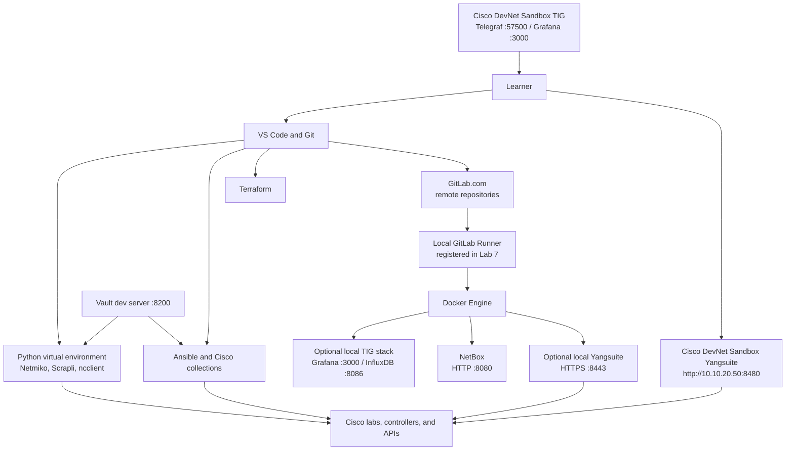

# Lab 1: Preparing the Network Automation Workstation

## Lab Introduction

Every later lab depends on a predictable development environment. In this lab, you will prepare a single Ubuntu 26.04 LTS workstation as a network automation control node, development platform, container host, observability server, source-of-truth server, secrets laboratory, and CI/CD runner. By the end of the lab, the workstation will contain Python automation libraries, Ansible, Terraform, Vault, Docker, `kubectl`, the TIG observability stack, NetBox, Git, Visual Studio Code, and GitLab Runner. Source repositories and pipeline coordination are hosted by GitLab.com. Learners may install Cisco Yangsuite locally or use the Cisco DevNet Sandbox Yangsuite service.

This is deliberately an **all-in-one learning environment** for local tools. It makes the course portable because every learner has the same runtime, but it is not a recommended production architecture. GitLab Runner should be isolated from ordinary user workloads; Vault should use persistent encrypted storage and TLS; and monitoring should remain available when an application host fails. Those production distinctions are noted throughout the lab.


## Learning Objectives

After completing this lab, you will be able to:

- Prepare an Ubuntu host for repeatable automation development.
- Create an isolated Python environment and install network automation packages.
- Explain why `scrapli`, `xmltodict`, `PyYAML`, and Python's built-in `json` module are installed differently.
- Install and verify Ansible and common Cisco collections.
- Install Docker Engine and use Docker Compose to operate a TIG stack.
- Install the `kubectl` client for optional use with an instructor-provided or external Kubernetes cluster.
- Install Terraform and use Vault safely in training development mode.
- Install Cisco Yangsuite locally or verify access to Cisco DevNet Sandbox Yangsuite.
- Deploy NetBox as the source of truth used from Lab 4 onward.
- Install Git, Visual Studio Code, and a local GitLab Runner for GitLab.com projects.
- Validate the complete workstation and collect evidence for troubleshooting.

## Estimated Time

Allow **4 to 6 hours**, depending on Internet speed and workstation resources. Container image downloads and the NetBox and observability deployments account for much of the time.

## Workstation Requirements

Because all services share one host, the workstation should have at least the following resources:

| Resource | Minimum for the lab | Recommended |
|---|---:|---:|
| CPU | 8 vCPUs | 12 vCPUs |
| RAM | 16 GB | 24–32 GB |
| Free disk | 100 GB | 150 GB SSD |
| Network | Internet access and DNS | Stable broadband |
| User access | Account with `sudo` | Dedicated learner account |

The lab supports both common 64-bit Ubuntu architectures. Run the following commands before downloading any architecture-specific binary:

```bash
dpkg --print-architecture
uname -m
```

Ubuntu reports an x86-64 workstation as `amd64` through `dpkg` and usually as `x86_64` through `uname`. An ARM64 workstation is reported as `arm64` and usually as `aarch64`. Package repositories used in this lab select the correct build through `dpkg --print-architecture`; do not download an `arm64` binary on an `amd64` system or an `amd64` binary on an `arm64` system.

NetBox, the TIG stack, and a local Yangsuite installation do not need to run simultaneously during ordinary course work. If the host has limited memory, stop services that are not needed for the current lab. GitLab.com, Cisco DevNet Sandbox TIG, and Cisco DevNet Sandbox Yangsuite do not consume workstation resources; only the lightweight local Runner service remains installed.

## Lab Architecture


```mermaid
flowchart TB
    Learner["Learner"] --> VSCode["VS Code and Git"]
    VSCode --> Python["Python virtual environment<br/>Netmiko, Scrapli, ncclient"]
    VSCode --> Ansible["Ansible and Cisco collections"]
    VSCode --> IaC["Terraform"]
    VSCode --> GitLab["GitLab.com<br/>remote repositories"]
    GitLab --> Runner["Local GitLab Runner<br/>registered in Lab 7"]

    Docker["Docker Engine"] --> TIG["Optional local TIG stack<br/>Grafana :3000 / InfluxDB :8086"]
    Docker --> NetBox["NetBox<br/>HTTP :8080"]
    Docker --> LocalYANG["Optional local Yangsuite<br/>HTTPS :8443"]
    Runner --> Docker
    Python --> Devices["Cisco labs, controllers, and APIs"]
    Ansible --> Devices
    SandboxYANG["Cisco DevNet Sandbox Yangsuite<br/>http://10.10.20.50:8480"] --> Devices
    Learner --> SandboxYANG
    LocalYANG --> Devices
    SandboxTIG["Cisco DevNet Sandbox TIG<br/>Telegraf :57500 / Grafana :3000"] --> Learner
    Vault["Vault dev server :8200"] --> Python
    Vault --> Ansible
```

### Local Service Ports

| Component | Port or endpoint | Purpose |
|---|---|---|
| Grafana | `http://127.0.0.1:3000` | Dashboards |
| Cisco DevNet Sandbox TIG | Telegraf `10.10.20.50:57500`; Grafana `http://10.10.20.50:3000` | Integrated telemetry receiver, time-series database, and dashboards for the Catalyst C8KV sandbox |
| InfluxDB | `http://127.0.0.1:8086` | Time-series storage and API |
| Vault | `http://127.0.0.1:8200` | Training-only secret service |
| Local Yangsuite | `https://localhost:8443` | Learner-operated YANG, NETCONF, RESTCONF, and telemetry tools |
| Cisco DevNet Sandbox Yangsuite | `http://10.10.20.50:8480` | Sandbox YANG, NETCONF, RESTCONF, gNMI, and telemetry tools |
| GitLab.com | `https://gitlab.com` | Hosted source control and CI/CD control plane |
| NetBox | `http://127.0.0.1:8080` | Network source of truth |
| SSH | TCP `22` | Host access and Git over SSH |

The TIG services bind to `127.0.0.1` so they are not exposed automatically to the surrounding network. If the learner accesses the workstation remotely, use SSH port forwarding or deliberately configure a firewall and trusted interface instead of changing every service to `0.0.0.0` without review.


## Task 1: Update Ubuntu and Install Foundation Packages

Begin with current package metadata and common development tools. A package upgrade can require a restart, particularly when the kernel or system libraries change.

```bash
sudo apt update
sudo apt -y upgrade
sudo apt install -y \
  apt-transport-https \
  build-essential \
  ca-certificates \
  curl \
  git \
  gnupg \
  jq \
  lsb-release \
  openssh-client \
  openssh-server \
  software-properties-common \
  tree \
  unzip \
  wget
```

Enable SSH and time synchronization. Accurate time is important for TLS certificate validation, Git records, logs, telemetry timestamps, and token expiry.

```bash
sudo systemctl enable --now ssh
sudo timedatectl set-ntp true
systemctl is-active ssh
timedatectl show --property=NTPSynchronized
```

If `/var/run/reboot-required` exists, restart now and return to the lab:

```bash
test -f /var/run/reboot-required && cat /var/run/reboot-required
```

### Checkpoint

```bash
git --version
jq --version
systemctl is-active ssh
```

All commands should return versions or `active`.

## Task 2: Install Python, pip, and the Automation Libraries

Ubuntu 26.04 uses a distribution-managed Python installation. Avoid installing course packages into the system interpreter because `apt` owns that environment. A virtual environment gives the course a controlled dependency boundary and makes troubleshooting more predictable.

```bash
sudo apt install -y \
  python3 \
  python3-dev \
  python3-pip \
  python3-venv \
  libffi-dev \
  libssl-dev

python3 --version
python3 -m pip --version
```

Create a course virtual environment in the learner's home directory:

```bash
mkdir -p "$HOME/.venvs"
python3 -m venv "$HOME/.venvs/ccnpauto"
source "$HOME/.venvs/ccnpauto/bin/activate"
python -m pip install --upgrade pip setuptools wheel
```

The shell prompt should now begin with `(ccnpauto)`. Confirm that both executables point into the virtual environment:

```bash
which python
which pip
python --version
pip --version
```

Install the supplied requirements:

```bash
cd <COURSE_ROOT>/CCNPAUTO/LAB/Lab1
python -m pip install -r files/requirements.txt
python -m pip check
```

The package names deserve careful attention:

- **Netmiko** provides a high-level CLI transport for many network platforms.
- **Scrapli**—not “scapli”—provides synchronous and asynchronous device transports with structured platform support.
- **ncclient** implements a Python NETCONF client.
- **xmltodict**—not “xml2dict”—maps XML into Python dictionary-like objects for convenient exploration.
- **PyYAML** supplies the import name `yaml`.
- **requests** is a widely used synchronous HTTP client.
- **json** belongs to the Python standard library and must not be installed from PyPI.

To activate this environment in later labs, run:

```bash
source "$HOME/.venvs/ccnpauto/bin/activate"
```

Do not automatically activate a virtual environment for every terminal unless the learner understands the consequence. Explicit activation makes it clear which Python environment owns a command.

## Task 3: Configure Ansible for Network Automation

Ansible was installed in the course virtual environment through the requirements file. Keeping Ansible and its Python dependencies together prevents the `ansible-playbook` command from using a different interpreter than libraries such as `ncclient` or `jmespath`.

```bash
source "$HOME/.venvs/ccnpauto/bin/activate"
ansible --version
ansible-config dump --only-changed
```

Install collections used with Cisco platforms and common network resources:

```bash
ansible-galaxy collection install \
  ansible.netcommon \
  cisco.ios \
  cisco.iosxr \
  cisco.nxos \
  cisco.dnac \
  cisco.meraki \
  community.general
```

List the installed collections:

```bash
ansible-galaxy collection list
```

Create a small local test. Ansible network modules do not require Python on routers and switches, but this first test verifies the control node itself:

```bash
mkdir -p "$HOME/ccnpauto-workspace/ansible"
cd "$HOME/ccnpauto-workspace/ansible"

cat > inventory.ini <<'EOF'
[workstation]
localhost ansible_connection=local
EOF

ansible all -i inventory.ini -m ansible.builtin.ping
```

The expected result contains `"ping": "pong"`. This verifies Ansible's local execution path; it does not yet test access to a Cisco device.

## Task 4: Configure Git and Install Visual Studio Code

Git is already installed from Ubuntu's package repository. Configure the learner identity with real values because these fields become commit metadata:

```bash
git config --global user.name "YOUR FULL NAME"
git config --global user.email "YOUR_EMAIL@example.com"
git config --global init.defaultBranch main
git config --global pull.ff only
git config --global core.editor "code --wait"
git config --global --list
```

Install Visual Studio Code from Microsoft's signed APT repository:

```bash
wget -qO- https://packages.microsoft.com/keys/microsoft.asc \
  | gpg --dearmor \
  | sudo tee /usr/share/keyrings/packages.microsoft.gpg >/dev/null

echo "deb [arch=amd64,arm64,armhf signed-by=/usr/share/keyrings/packages.microsoft.gpg] https://packages.microsoft.com/repos/code stable main" \
  | sudo tee /etc/apt/sources.list.d/vscode.list

sudo apt update
sudo apt install -y code
code --version
```

Install useful extensions from the terminal:

```bash
code --install-extension ms-python.python
code --install-extension ms-python.vscode-pylance
code --install-extension redhat.ansible
code --install-extension redhat.vscode-yaml
code --install-extension hashicorp.terraform
code --install-extension ms-azuretools.vscode-docker
code --install-extension ms-kubernetes-tools.vscode-kubernetes-tools
code --install-extension gitlab.gitlab-workflow
```

Open the course workspace with `code "$HOME/ccnpauto-workspace"`. In VS Code, select the interpreter at `$HOME/.venvs/ccnpauto/bin/python`. This prevents linting and import warnings caused by VS Code selecting `/usr/bin/python3`.

## Task 5: Install Docker Engine and Docker Compose

Docker will host the observability stack, NetBox, and containerized CI jobs. Install the official Docker packages rather than the older `docker.io` package from Ubuntu.

```bash
sudo install -m 0755 -d /etc/apt/keyrings
sudo curl -fsSL https://download.docker.com/linux/ubuntu/gpg \
  -o /etc/apt/keyrings/docker.asc
sudo chmod a+r /etc/apt/keyrings/docker.asc

echo "deb [arch=$(dpkg --print-architecture) signed-by=/etc/apt/keyrings/docker.asc] https://download.docker.com/linux/ubuntu $(. /etc/os-release && echo "${UBUNTU_CODENAME:-$VERSION_CODENAME}") stable" \
  | sudo tee /etc/apt/sources.list.d/docker.list >/dev/null

sudo apt update
sudo apt install -y \
  docker-ce \
  docker-ce-cli \
  containerd.io \
  docker-buildx-plugin \
  docker-compose-plugin \
  util-linux-extra
```

Enable the service and test it with administrative access:

```bash
sudo systemctl enable --now docker
sudo docker run --rm --network host hello-world
```

For this dedicated lab workstation, add the learner to the `docker` group:

```bash
sudo usermod -aG docker "$USER"
newgrp docker
docker version
docker compose version
docker run --rm --network host hello-world
```

> **Security note:** Membership in the `docker` group is effectively root-level access because a member can mount host filesystems or start privileged containers. Production systems should limit this membership and consider rootless Docker or stronger workload isolation.

The local TIG and NetBox stacks use standard Docker Compose bridge networks. Their browser interfaces are published only on the workstation loopback address, while containers communicate with one another through Compose service names. Yangsuite uses its supplied host-network override when it must follow the workstation's DevNet VPN routes. Before starting a service, inspect listening ports, keep host firewall policy enabled, and never expose NetBox, InfluxDB, Grafana, Yangsuite, or telemetry receivers to an untrusted network.

## Task 6: Select a TIG and Grafana Option

TIG refers to **Telegraf, InfluxDB, and Grafana**. Telegraf collects metrics, InfluxDB stores time-series data, and Grafana queries data sources to build dashboards. Learners can deploy the complete stack locally for a locally hosted Catalyst C8KV or use the integrated TIG stack supplied with the Cisco Catalyst C8KV IOS XE sandbox.

Learners who want to host their own IOS XE router can complete the separate [optional Cisco Catalyst 8000V on KVM guide](KVM_Catalyst_8000V.md). It is not required when the course uses the reservable Cisco DevNet Sandbox.

### Option A: Deploy the Complete TIG Stack Locally

This option gives the learner control of Telegraf inputs, the InfluxDB database, and Grafana dashboards. It is the appropriate choice when Lab 10 uses a locally hosted Catalyst C8KV. Docker Compose expresses the three local services as one repeatable application.

The supplied Compose file deliberately pins InfluxDB OSS `1.12.4`. InfluxDB 1.x uses a named database, username, password, and InfluxQL. Grafana provides both a visual query builder and a code editor for InfluxQL, whereas Flux provides only a code editor. This course therefore uses InfluxDB 1.x locally so learners can explore measurements, fields, tags, filters, and aggregation functions through Grafana's visual editor before writing queries manually. Do not replace the pinned image with `latest` because a silent major-version change would alter initialization and query behavior.

The Compose project is explicitly named `ccnpauto-tig`, so Docker resource names remain predictable even when commands are issued from different directories. Nevertheless, learners should operate it from `~/lab-services/tig` throughout the course.

Keep long-running lab platforms under `~/lab-services`. Create a dedicated TIG directory and copy the supplied deployment files into it. This gives TIG the same predictable service layout used by NetBox while keeping runtime data and credentials outside the course-content directory.

Create `~/lab-services/tig`. Using the VS Code Explorer, copy and paste `compose.yaml` and `telegraf.conf` from `CCNPAUTO/LAB/Lab1/files/` into that directory. Open `CCNPAUTO/LAB/Lab1/.env.example`, create a new file named `.env` in `~/lab-services/tig/`, and copy and paste the example content into it. Then modify the new `.env` values.

```bash
cd "$HOME/lab-services/tig"
chmod 600 .env
```

The resulting service directory is:

```text
~/lab-services/tig/
├── .env
├── compose.yaml
└── telegraf.conf
```

Do not commit `.env` or copy it back into the course repository.

Generate strong training values if necessary:

```bash
openssl rand -base64 24
openssl rand -hex 32
```

Review the resolved Compose model without printing it into a public screenshot or shared log:

```bash
cd "$HOME/lab-services/tig"
docker compose --env-file .env -f compose.yaml config --services
```

Start the stack and inspect its state:

```bash
docker compose --env-file .env -f compose.yaml up -d
docker compose --env-file .env -f compose.yaml ps
docker compose --env-file .env -f compose.yaml logs --tail=50 telegraf
```

On first startup, InfluxDB creates the `mdt` database and three accounts from `.env`: an administrator, a write-only Telegraf user, and a read-only Grafana user. This separation prevents the dashboard account from changing stored telemetry. The supplied Telegraf configuration sets `skip_database_creation = true` because the restricted writer can write measurements but must not issue `CREATE DATABASE`. Initialization variables run only when the InfluxDB data volume is empty. The supplied Compose file uses the new volume name `influxdb1-data`, so an older InfluxDB 2 volume from a previous course build is not mounted into InfluxDB 1.x.

Verify the database from the InfluxDB command-line client inside the container:

```bash
docker compose --env-file .env -f compose.yaml exec influxdb sh -c \
  'influx -username "$INFLUXDB_ADMIN_USER" \
  -password "$INFLUXDB_ADMIN_PASSWORD" \
  -execute "SHOW DATABASES"'
```

The result must include `mdt`, or the alternative value assigned to `INFLUXDB_DB` in `.env`. InfluxDB 1.x does not provide the InfluxDB 2 web interface, so use this command-line client for database checks and use Grafana for visual exploration.

Telegraf listens for Cisco model-driven telemetry on TCP port `57000`. Docker publishes that port on all workstation interfaces, so an external router can send a gRPC dial-out stream to `<workstation-reachable-ip>:57000`. Configure the router with an actual workstation address that it can route to; do not configure the Docker container address or `127.0.0.1`. If the workstation firewall is enabled, permit TCP `57000` only from the router management subnet rather than exposing the receiver broadly.

Open Grafana at `http://127.0.0.1:3000` and sign in with the Grafana credentials from `.env`.

If this workstation previously ran the older InfluxDB 2 version of the course stack, update `.env` with every key in the current `.env.example`, recreate the three services, and replace the old Flux data source in Grafana with the InfluxQL data source below. The previous InfluxDB 2 volume remains unused; the course does not delete it automatically.

In Grafana, add an InfluxDB data source:

1. Select **Connections > Data sources > Add data source**.
2. Choose **InfluxDB**.
3. Set **Query language** to **InfluxQL**.
4. Set **URL** to `http://influxdb:8086`. Grafana runs inside the TIG Compose bridge network, so it reaches InfluxDB by its Compose service name. Do not use `127.0.0.1` because loopback inside the Grafana container refers to Grafana itself.
5. Under **InfluxDB details**, enter the database from `INFLUXDB_DB`, the user from `INFLUXDB_READ_USER`, and its password from `INFLUXDB_READ_USER_PASSWORD`. With the supplied example, the database is `mdt` and the user is `grafana`.
6. Set **HTTP method** to **POST** and **Min time interval** to `10s`.
7. Select **Save & test**. A successful result confirms that Grafana can execute InfluxQL against the database.

Confirm that the visual editor is available before moving on:

1. Select **Explore** and choose the InfluxDB data source.
2. Keep the query in **Builder** mode rather than **Code** mode.
3. In **FROM**, select the `cpu` measurement written by the local Telegraf agent.
4. In **SELECT**, choose the `usage_active` field and the `mean()` aggregation.
5. In **WHERE**, select the `cpu` tag and value `cpu-total`.
6. Keep the time filter and group by the Grafana interval, and then run the query.

The visual editor should display CPU data from the Telegraf container. It also shows how a measurement resembles a table, a field stores a measured value, and a tag provides indexed metadata for filtering. Lab 10 repeats this workflow with IOS XE telemetry measurements.

The host metrics shown by Telegraf are container-visible metrics. In addition, the Cisco model-driven telemetry input is ready to accept external gRPC dial-out streams on workstation TCP port `57000`. Later telemetry labs explain how to identify YANG paths, configure IOS XE subscriptions, and build Grafana dashboards from the received measurements.

Verify that Telegraf is writing and that measurements exist:

```bash
cd "$HOME/lab-services/tig"
docker compose --env-file .env -f compose.yaml logs --tail=100 telegraf
docker compose --env-file .env -f compose.yaml exec influxdb sh -c \
  'influx -username "$INFLUXDB_READ_USER" \
  -password "$INFLUXDB_READ_USER_PASSWORD" \
  -database "$INFLUXDB_DB" \
  -execute "SHOW MEASUREMENTS"'
```

Stop without deleting data:

```bash
docker compose --env-file .env -f compose.yaml stop
```

Start it again from `~/lab-services/tig` with `docker compose --env-file .env -f compose.yaml start`. Avoid `down -v` unless the instructor explicitly asks you to erase the InfluxDB and Grafana volumes.

### Option B: Use the Cisco DevNet Sandbox TIG Stack

The Cisco Catalyst C8KV sandbox already integrates Telegraf, InfluxDB, and Grafana. For Lab 10, the sandbox router sends gRPC dial-out telemetry to Telegraf at `10.10.20.50` on TCP port `57500`, while learners inspect the stored data through Grafana:

```text
Telegraf: 10.10.20.50:57500/tcp
Grafana:  http://10.10.20.50:3000
```

After connecting to the sandbox VPN, open Grafana in a browser and sign in with the Cisco DevNet Sandbox credentials. Confirm that the home page and assigned course folder load. The integration among Telegraf, InfluxDB, and Grafana is already prepared, so learners do not install or manage these sandbox services.

## Task 7: Install kubectl

`kubectl` is the Kubernetes command-line client. This course does not create a local Kubernetes cluster on the learner workstation. Keeping the client available allows an instructor to provide an optional external-cluster exercise without adding local-cluster CPU, memory, storage, and operational overhead.

Install and verify `kubectl`:

```bash
cd /tmp
ARCH=$(dpkg --print-architecture)

case "$ARCH" in
  amd64) echo "Installing kubectl for x86-64 (amd64)" ;;
  arm64) echo "Installing kubectl for ARM64 (arm64)" ;;
  *)
    echo "Unsupported kubectl architecture: $ARCH" >&2
    exit 1
    ;;
esac

KUBECTL_VERSION=$(curl -L -s https://dl.k8s.io/release/stable.txt)

curl -LO "https://dl.k8s.io/release/${KUBECTL_VERSION}/bin/linux/${ARCH}/kubectl"
curl -LO "https://dl.k8s.io/release/${KUBECTL_VERSION}/bin/linux/${ARCH}/kubectl.sha256"
echo "$(cat kubectl.sha256)  kubectl" | sha256sum --check
sudo install -o root -g root -m 0755 kubectl /usr/local/bin/kubectl
kubectl version --client
```

On an x86-64 workstation, `ARCH=amd64` selects the official `linux/amd64` binary. On an ARM64 workstation, `ARCH=arm64` selects `linux/arm64`. The checksum URL uses the same architecture value, preventing a checksum from one build being compared with a different binary.

Running `kubectl get nodes` without a configured context will fail, which is expected. Do not create an insecure placeholder context. Configure a context only when an instructor or authorized platform administrator supplies a cluster endpoint and credentials.

## Task 8: Install Terraform and HashiCorp Vault

Terraform and Vault are distributed through HashiCorp's signed APT repository. Terraform manages desired infrastructure state through providers. Vault brokers access to secrets and can issue dynamic credentials. They solve different problems and should not be treated as interchangeable configuration stores.

Add the HashiCorp repository once, then install both tools:

```bash
wget -O- https://apt.releases.hashicorp.com/gpg \
  | sudo gpg --dearmor \
  -o /usr/share/keyrings/hashicorp-archive-keyring.gpg

echo "deb [arch=$(dpkg --print-architecture) signed-by=/usr/share/keyrings/hashicorp-archive-keyring.gpg] https://apt.releases.hashicorp.com $(grep -oP '(?<=UBUNTU_CODENAME=).*' /etc/os-release || lsb_release -cs) main" \
  | sudo tee /etc/apt/sources.list.d/hashicorp.list

sudo apt update
sudo apt install -y terraform vault
terraform version
vault version
```

Confirm Terraform with a local, provider-free configuration:

```bash
mkdir -p "$HOME/ccnpauto-workspace/terraform/hello"
cd "$HOME/ccnpauto-workspace/terraform/hello"

cat > main.tf <<'EOF'
terraform {
  required_version = ">= 1.5"
}

output "workstation_ready" {
  value = "Terraform is ready for network automation labs"
}
EOF

terraform fmt -check
terraform init
terraform validate
terraform apply -auto-approve
```

For Vault, use development mode only. Development mode keeps data in memory, starts unsealed, uses a known root token in this lab, and is not secure for production. Open a separate terminal and run:

```bash
vault server -dev -dev-listen-address="127.0.0.1:8200" -dev-root-token-id="lab-root-token"
```

Leave that terminal open. In another terminal, configure the client and write a disposable secret:

```bash
export VAULT_ADDR="http://127.0.0.1:8200"
export VAULT_TOKEN="lab-root-token"

vault status
vault kv put secret/network-lab username=netdev password=temporary-only
vault kv get secret/network-lab
vault kv get -field=username secret/network-lab
vault kv delete secret/network-lab
```

Stop the development server with `Ctrl+C`. Its data disappears by design. Never use development mode, a known root token, or clear-text HTTP for real secrets.

## Task 9: Select and Verify a Cisco Yangsuite Option

Cisco Yangsuite helps learners explore YANG modules, build NETCONF and RESTCONF payloads, interact with devices, and work with model-driven telemetry plugins. Choose either the local installation or Cisco DevNet Sandbox Yangsuite. Both options support the later labs; the sandbox option saves workstation resources, whereas the local option gives learners control of the service and its device profiles.

### Option A: Install Yangsuite Locally

Install the official Docker-based project under `~/lab-services`:

```bash
docker compose version
mkdir -p "$HOME/lab-services"
cd "$HOME/lab-services"
git clone https://github.com/CiscoDevNet/yangsuite.git
cd yangsuite/docker
chmod +x start_yang_suite.sh
./start_yang_suite.sh
```

Before running the startup script, use the VS Code Explorer to copy and paste `CCNPAUTO/LAB/Lab1/files/yangsuite-compose.override.yml` into `~/lab-services/yangsuite/docker/`, then rename it `docker-compose.override.yml`.

The supplied override uses the Compose `!reset` tag and therefore requires a current Docker Compose v2 plugin. It applies `network_mode: host` to every Yangsuite container and resets published-port mappings, allowing the service to follow the workstation's VPN and cloud routes directly. Before starting, check that its host ports are not already occupied:

```bash
sudo ss -lntp | grep -E ':(80|443|8443|50051|50052|9339|57344|57345)\b' || true
```

The startup script prompts for a local administrator, allowed host, email address, and a training certificate, then runs Docker Compose in the foreground. Leave that terminal running and use a second terminal for the remaining checks. When the containers become ready, open:

```text
https://localhost:8443
```

The generated local certificate may not be trusted by the browser. Review the certificate warning and proceed only when the address and certificate belong to this learner-controlled installation. Confirm that the **Setup**, **Explore**, and **Protocols** areas load.

### Option B: Use Cisco DevNet Sandbox Yangsuite

Open the following address in the workstation browser:

```text
http://10.10.20.50:8480
```

Use the Cisco DevNet Sandbox credentials. Confirm that the **Setup**, **Explore**, and **Protocols** areas load. Later labs will create or refresh device profiles and retrieve the YANG modules advertised by the active Cisco IOS XE sandbox reservation.

If the page does not open, confirm that the learner workstation is connected to the correct sandbox VPN. Do not change the Cisco DevNet Sandbox server configuration beyond the assigned permissions and device profiles. If the service is unavailable, use the local installation or verify the sandbox reservation.

## Task 10: Install NetBox

NetBox will become the source of truth for router loopback interfaces in Lab 4. Install the community Docker Compose deployment outside the course repositories:

```bash
mkdir -p "$HOME/lab-services"
cd "$HOME/lab-services"
git clone --branch release --depth 1 \
  https://github.com/netbox-community/netbox-docker.git
cd netbox-docker
```

Keep the upstream `docker-compose.yml` unchanged. Using the VS Code Explorer, copy and paste `CCNPAUTO/LAB/Lab1/files/netbox-compose.override.yml` into `~/lab-services/netbox-docker/`, then rename the pasted file to `docker-compose.override.yml`.

Docker Compose automatically combines these two files when learners run the normal `docker compose` commands. The supplied file retains the standard Docker bridge network and publishes NetBox only at `127.0.0.1:8080`. PostgreSQL and both Valkey services remain private, while NetBox and its worker can make outbound HTTPS connections to `gitlab.com`.

Check that the web port is free before starting:

```bash
sudo ss -lntp | grep -E ':8080\b' || true
```

Pull and start NetBox:

```bash
docker compose pull
docker compose up -d
docker compose ps
docker compose logs --tail=100 netbox
```

Create the administrator account:

```bash
docker compose exec netbox \
  /opt/netbox/netbox/manage.py createsuperuser
```

Open `http://127.0.0.1:8080`, sign in, and confirm the dashboard loads. Do not delete the PostgreSQL, Valkey, or media volumes during ordinary cleanup because they preserve the source-of-truth data used in later labs.

Stop NetBox when workstation memory is needed elsewhere:

```bash
docker compose stop
```

Restart it before Lab 4:

```bash
docker compose up -d
```

## Task 11: Prepare the GitLab.com Account

GitLab.com provides the remote repositories, merge requests, pipeline control plane, and artifact interface for this course. No GitLab server is installed on the learner workstation.

1. Open `https://gitlab.com` and sign in to the learner account.
2. Verify the email address if GitLab requests verification.
3. Enable multifactor authentication when required by the learner's organization or instructor.
4. Open **Edit profile > Access > SSH keys** and confirm that the workstation SSH key is present. If no key exists, generate and add one:

   ```bash
   ssh-keygen -t ed25519 -C "YOUR_GITLAB_EMAIL"
   cat ~/.ssh/id_ed25519.pub
   ```

5. Test GitLab.com SSH authentication:

   ```bash
   ssh -T git@gitlab.com
   ```

GitLab uses the SSH transport user `git`; the learner's GitLab username appears in repository paths, not before the hostname. Lab 2 will create `lab2_warm_up`, while Lab 3 will create `network_automation_project`.

Learners who use HTTPS instead of SSH must create a narrowly scoped personal access token with `write_repository` permission. Do not place a token in a clone URL, command, source file, screenshot, or repository.

## Task 12: Install GitLab Runner

GitLab Runner executes pipeline jobs. Production guidance recommends placing it on a different host because CI jobs process repository-controlled instructions. The same-host arrangement here is accepted only to keep the learner lab self-contained.

Add the official Runner repository and install the package:

```bash
curl --location \
  "https://packages.gitlab.com/install/repositories/runner/gitlab-runner/script.deb.sh" \
  -o /tmp/gitlab-runner-repository.sh
less /tmp/gitlab-runner-repository.sh
sudo bash /tmp/gitlab-runner-repository.sh
sudo apt install -y gitlab-runner
gitlab-runner --version
```

Installation is the required Lab 1 outcome. Do not register the Runner yet. Lab 7 creates a protected project runner on GitLab.com and registers this workstation with the shell executor after the network-deployment security boundary has been explained.

Confirm only that the binary and service are installed:

```bash
gitlab-runner --version
sudo systemctl status gitlab-runner --no-pager
```


## Task 13: Run the Final Workstation Validation

The supplied script checks commands and Python imports. It expects the course virtual environment to be active:

```bash
cd <COURSE_ROOT>/CCNPAUTO/LAB/Lab1
chmod +x files/verify_lab1.sh
source "$HOME/.venvs/ccnpauto/bin/activate"
./files/verify_lab1.sh
```

Then collect service evidence:

```bash
docker version --format '{{.Server.Version}}'
docker compose version
sudo systemctl is-active gitlab-runner
```

For local TIG:

```bash
cd "$HOME/lab-services/tig"
docker compose --env-file .env -f compose.yaml ps
```

For the Cisco DevNet Sandbox TIG stack:

Open `http://10.10.20.50:3000` in a browser and confirm that the Grafana sign-in page loads.

Local TIG may be stopped when it is not required. Start only the local services needed for the current exercise.

### Completion Evidence

Record the following without exposing tokens, passwords, private keys, or full environment files:

- Ubuntu release and architecture
- Python, pip, Ansible, Terraform, Vault, Docker, `kubectl`, Git, VS Code, and Runner versions
- Successful Python import validation
- Successful `ansible.builtin.ping` result
- Docker `hello-world` result
- Local TIG container status, successful InfluxDB `SHOW DATABASES` result, and Grafana visual-editor result; or access to Cisco DevNet Sandbox Telegraf at `10.10.20.50:57500` and Grafana at `http://10.10.20.50:3000`
- Local Yangsuite page at `https://localhost:8443`, or Cisco DevNet Sandbox Yangsuite at `http://10.10.20.50:8480`
- NetBox login page
- Successful GitLab.com SSH authentication and the installed, unregistered Runner service
- Final validation summary

## Operating the All-in-One Workstation

Resource management is part of the lab design. Use the following patterns rather than leaving every platform active.

### Git and Python Development Session

```bash
source "$HOME/.venvs/ccnpauto/bin/activate"
code "$HOME/ccnpauto-workspace"
```

### Start and Stop TIG

```bash
cd "$HOME/lab-services/tig"
docker compose --env-file .env -f compose.yaml start
docker compose --env-file .env -f compose.yaml stop
```

### Start and Stop Local Yangsuite

If the local option was installed, use the scripts provided by the Yangsuite Docker project:

```bash
cd "$HOME/lab-services/yangsuite/docker"
docker compose up -d
docker compose stop
```

### Start and Stop NetBox

```bash
cd "$HOME/lab-services/netbox-docker"
docker compose up -d
# later
docker compose stop
```

### Start and Stop GitLab Runner

```bash
sudo systemctl stop gitlab-runner
sudo systemctl start gitlab-runner
```

## Troubleshooting Guide

### Python imports fail even though pip installed the package

The most common cause is an inactive or incorrect virtual environment:

```bash
which python
python -m pip --version
python -m pip list
source "$HOME/.venvs/ccnpauto/bin/activate"
python -m pip check
```

Both `python` and `pip` should resolve beneath `$HOME/.venvs/ccnpauto`.

### Docker reports permission denied on `/var/run/docker.sock`

Confirm group membership:

```bash
id
getent group docker
```

Log out and back in after `usermod`, or run `newgrp docker`. Do not “solve” the issue with `chmod 777 /var/run/docker.sock`.

### A container cannot bind its port

Identify the process already listening:

```bash
sudo ss -lntp
docker ps --format 'table {{.Names}}\t{{.Ports}}'
```

This lab assigns separate ports, so a conflict often indicates an earlier manual installation or a container from another exercise.

### TIG starts, but Grafana cannot reach InfluxDB

The TIG containers share a Compose bridge network, so Grafana and Telegraf must use `http://influxdb:8086`. A command-line client running directly on the workstation can use `http://127.0.0.1:8086`, but a container-side URL of `http://127.0.0.1:8086` fails because container loopback refers to that container itself. Inspect the resolved configuration and logs:

```bash
cd "$HOME/lab-services/tig"
docker compose --env-file .env -f compose.yaml logs influxdb telegraf grafana
docker compose --env-file .env -f compose.yaml config
```

For the local InfluxDB 1.x data source, also confirm that the query language is **InfluxQL**, the database matches `INFLUXDB_DB`, and Grafana uses the read account rather than an InfluxDB 2 token. If **Save & test** reports that no measurements exist, wait for two Telegraf collection intervals and run `SHOW MEASUREMENTS` from the InfluxDB CLI as shown in Task 6.

If the Telegraf log reports `database creation failed: 403 Forbidden`, confirm that its active `telegraf.conf` contains the following option inside `[[outputs.influxdb]]`:

```toml
skip_database_creation = true
```

The InfluxDB container creates the database during first initialization. Telegraf then writes through the restricted writer account without attempting an administrative database-creation operation. After correcting the copied configuration, recreate Telegraf and inspect the newest log entries:

```bash
cd "$HOME/lab-services/tig"
docker compose --env-file .env -f compose.yaml up -d --force-recreate telegraf
docker compose --env-file .env -f compose.yaml logs --since=2m telegraf
```

If Grafana does not open from the workstation, confirm that the resolved configuration publishes `127.0.0.1:3000` to container port `3000` and that `GF_SERVER_HTTP_ADDR` is `0.0.0.0`. After changing the Compose file, recreate the services:

```bash
docker compose --env-file .env -f compose.yaml up -d --force-recreate
```

### Yangsuite does not open

For a local installation, first inspect its Docker state and logs from the Yangsuite project directory:

```bash
cd "$HOME/lab-services/yangsuite/docker"
docker compose ps
docker compose logs --tail=100
```

For Cisco DevNet Sandbox Yangsuite, confirm that the workstation is connected to the Cisco DevNet Sandbox network and open `http://10.10.20.50:8480` in a browser. If the page does not load, verify the reservation or use the local option.

### A pipeline remains pending

Open the pending job first and read the status message displayed by GitLab. If the runner is online but the job remains pending, GitLab normally considers the runner ineligible rather than unreachable. In **Project > Settings > CI/CD > Runners**, open the runner and confirm all of the following:

- The runner appears under **Assigned project runners** for this project.
- **Paused** is disabled.
- The runner tag is exactly `network-deploy`, matching the Lab 7 `.gitlab-ci.yml`.
- **Protected** is enabled and the pipeline runs from the protected `main` branch.
- The runner has not been locked or assigned exclusively to a different project.

The job definition must contain the matching tag:

```yaml
validate-netbox:
  tags:
    - network-deploy
```

After correcting a runner setting, select **Retry** on the existing job or run a new pipeline. On the workstation, confirm that the registered runner manager is valid and polling GitLab:

```bash
sudo systemctl status gitlab-runner --no-pager
sudo gitlab-runner list
sudo gitlab-runner verify
sudo journalctl -u gitlab-runner -n 100 --no-pager
```

If the log repeatedly shows successful job polling but no assignment, return to the UI eligibility checks. If the job changes from pending to running and then fails, scheduling is fixed; investigate the shell job, Python environment, VPN, or service named in the job log.

### The Runner cannot reach GitLab.com

Verify DNS, HTTPS, system time, and the Runner service:

```bash
getent hosts gitlab.com
timedatectl status
sudo systemctl status gitlab-runner --no-pager
sudo journalctl -u gitlab-runner -n 100 --no-pager
```

Do not disable TLS verification. Correct DNS, the workstation clock, the trusted CA bundle, or the organization's approved HTTPS-proxy configuration.

## Lab Cleanup

Ordinary cleanup should stop installed local services without deleting persistent state. If local TIG was installed:

```bash
cd "$HOME/lab-services/tig"
docker compose --env-file .env -f compose.yaml stop
```

If local Yangsuite was installed:

```bash
cd "$HOME/lab-services/yangsuite/docker"
docker compose stop
```

Stop NetBox when it is not needed:

```bash
cd "$HOME/lab-services/netbox-docker"
docker compose stop
```

The Runner can also be stopped when later CI/CD labs are not in progress:

```bash
sudo systemctl stop gitlab-runner
```

Do not remove Docker volumes, NetBox data, or the virtual environment unless the instructor asks for a complete rebuild.

## Key Takeaways

- The workstation is an all-in-one training platform; production systems require stronger isolation, availability, and secret management.
- Python virtual environments prevent course packages from interfering with Ubuntu's system Python.
- `json` is built into Python, while `yaml` is supplied by PyYAML and the correct package names are `scrapli` and `xmltodict`.
- Docker provides a common runtime for TIG, NetBox, and containerized CI jobs, but Docker access carries elevated privilege.
- Cisco Yangsuite can run locally or be accessed through Cisco DevNet Sandbox Yangsuite at `http://10.10.20.50:8480`.
- Grafana can run as part of the local TIG stack or through the integrated Cisco DevNet Sandbox TIG environment; the sandbox C8KV sends telemetry to `10.10.20.50:57500`, and learners view it at `http://10.10.20.50:3000`.
- The local TIG stack uses InfluxDB 1.x and InfluxQL so Grafana exposes both its visual query builder and its code editor.
- NetBox provides the API-driven source of truth used by the cumulative automation project.
- `kubectl` remains available for optional authorized external-cluster exercises, but no local Kubernetes cluster is installed.
- Vault development mode is disposable and intentionally insecure; it teaches the client workflow but not production deployment.
- GitLab.com provides hosted repositories and pipeline coordination, while the local Runner executes the network deployment introduced in Lab 7.
- Version checks, import tests, service health endpoints, and a passing pipeline provide better evidence than assuming that package installation succeeded.

The workstation is now ready for Lab 2, where learners can begin using Python and API clients to interact with a controlled Cisco network environment.

## Further Reading and Official References

- [Python virtual environments](https://docs.python.org/3/library/venv.html)
- [Ansible installation guide](https://docs.ansible.com/projects/ansible/latest/installation_guide/intro_installation.html)
- [Docker Engine on Ubuntu](https://docs.docker.com/engine/install/ubuntu/)
- [Docker post-installation steps](https://docs.docker.com/engine/install/linux-postinstall/)
- [Install kubectl on Linux](https://kubernetes.io/docs/tasks/tools/install-kubectl-linux/)
- [Terraform installation](https://developer.hashicorp.com/terraform/install)
- [Vault installation](https://developer.hashicorp.com/vault/docs/install)
- [Run InfluxDB OSS 1.x with Docker](https://docs.influxdata.com/influxdb/v1/introduction/install/docker/)
- [Telegraf installation](https://docs.influxdata.com/telegraf/v1/install/)
- [Grafana installation documentation](https://grafana.com/docs/grafana/latest/setup-grafana/installation/)
- [Grafana InfluxDB query editor](https://grafana.com/docs/grafana/latest/datasources/influxdb/query-editor/)
- [Cisco Yangsuite documentation](https://developer.cisco.com/docs/yangsuite/)
- [Visual Studio Code on Linux](https://code.visualstudio.com/docs/setup/linux)
- [GitLab Runner installation](https://docs.gitlab.com/runner/install/)
- [GitLab Runner shell executor](https://docs.gitlab.com/runner/executors/shell/)
- [GitLab SSH keys](https://docs.gitlab.com/user/ssh/)
- [NetBox Docker](https://github.com/netbox-community/netbox-docker)
