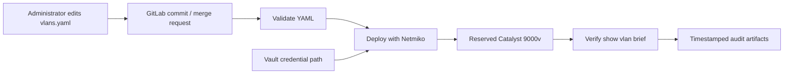

# Lab 11: GitLab CI/CD for VLAN Source of Truth

## Lab Introduction

In this lab, `data/vlans.yaml` is the reviewed source of truth for VLANs on a reservable Catalyst 9000v sandbox. An administrator adds VLAN records and pushes a commit to GitLab. The pipeline validates schema and business rules, deploys VLANs with Netmiko only from the default branch, verifies the resulting device state, and retains timestamped logs as audit artifacts. Device credentials remain in HashiCorp Vault.

## Learning Objectives

- Build validate, deploy, and test CI/CD stages.
- Treat YAML as a constrained source of truth.
- Use a dedicated protected runner for network deployment.
- Retrieve Catalyst credentials from Vault at runtime.
- Configure VLANs idempotently with Netmiko commands.
- Verify state independently after deployment.
- Serialize changes with a GitLab resource group.
- Retain audit logs even when a job fails.

## Architecture



## Prerequisites and Safety

Use a Catalyst 9000v reservable sandbox and confirm that VLANs 310 and 320 are unassigned. Later learner additions must use instructor-approved IDs. Never run this deployment against an Always-On device.

The pipeline uses a dedicated **shell executor** runner tagged `network-deploy`. A shell runner executes repository-controlled commands directly on the workstation, so it must be protected, locked to this project, and used only for trusted reviewed code. This design allows the job to use the host VPN and Vault at `127.0.0.1` without exposing Vault on an external interface.

## Task 1: Create the Project and Vault Secret

Create a blank project named `lab11-vlan-cicd`, copy the supplied files, and push the initial commit.

Start the Lab 1 Vault and create the required path:

```bash
export VAULT_ADDR=http://127.0.0.1:8200
export VAULT_TOKEN='LAB1_DEV_TOKEN'
vault kv put secret/ccnpauto/catalyst9000v \
  host='RESERVED_CATALYST_HOST' \
  port='SSH_PORT' \
  username='SANDBOX_USERNAME' \
  password='SANDBOX_PASSWORD'
vault kv get secret/ccnpauto/catalyst9000v
```

The path contains connectivity and authentication data, while Git contains only VLAN intent.

## Task 2: Register a Dedicated Shell Runner

Protect the `main` branch in GitLab, then create a project runner with tag `network-deploy`, disable untagged jobs, mark it protected, and copy the one-time `glrt-` token. Register it:

```bash
sudo gitlab-runner register \
  --non-interactive \
  --url "http://gitlab.lab.local:8088" \
  --token "glrt-REPLACE" \
  --executor "shell"
sudo systemctl restart gitlab-runner
sudo gitlab-runner verify
```

Create a dedicated virtual environment owned by the runner service account. Do not grant passwordless sudo:

```bash
sudo -u gitlab-runner mkdir -p /home/gitlab-runner/.venvs
sudo -u gitlab-runner python3 -m venv /home/gitlab-runner/.venvs/ccnpauto
sudo -u gitlab-runner /home/gitlab-runner/.venvs/ccnpauto/bin/python \
  -m pip install --upgrade pip
```

## Task 3: Configure Protected CI Variables

In **Settings > CI/CD > Variables**, add:

| Variable | Value | Controls |
|---|---|---|
| `VAULT_ADDR` | `http://127.0.0.1:8200` | Protected |
| `VAULT_TOKEN` | Lab development token | Masked, protected |

For production, use short-lived Vault authentication such as JWT/OIDC rather than a static token. This lab uses the development token only because Lab 1 runs a disposable Vault.

## Task 4: Understand and Extend the Source of Truth

The validator requires exactly `id` and `name`. IDs must be integers from 1 through 4094, unique, and names must contain only uppercase letters, digits, underscores, or hyphens.

Create a feature branch and add VLAN 330:

```yaml
  - id: 330
    name: VOICE_LAB11
```

Run locally:

```bash
source "$HOME/.venvs/ccnpauto/bin/activate"
python -m pip install -r requirements.txt
python -m scripts.validate
```

Commit, push, and open a merge request. Feature-branch pipelines validate data but do not change the device.

## Task 5: Review the Pipeline Controls

The pipeline has three stages:

1. **validate** runs on every branch using the existing Docker runner tagged `docker`.
2. **deploy** runs only on the default branch using the protected shell runner tagged `network-deploy`.
3. **test** runs only after deployment succeeds and uses the same protected shell runner.

`resource_group: catalyst9000v` prevents two pipelines from configuring the same sandbox concurrently. Artifacts use `when: always`, so failure evidence is retained for 30 days.

## Task 6: Merge and Deploy

Review and merge the feature branch into `main`. Observe the pipeline. `deploy.py` retrieves Vault credentials, creates one configuration sequence for every VLAN, connects with Netmiko, and records timestamped results in `artifacts/deployment.log`.

The script does not issue `write memory`; sandbox changes remain temporary. Inspect the deployment artifact rather than relying only on a green job icon.

## Task 7: Verify Device State

The test job runs `show vlan brief` and checks each VLAN ID/name pair with a bounded regular expression. It writes `artifacts/verification.log` and fails when any intended VLAN is missing or incorrectly named.

Verify manually as an independent observation:

```text
show vlan brief
show running-config | section ^vlan
```

Testing after deployment matters because a successful SSH command does not prove the final device state.

## Task 8: Exercise a Failed Validation

On a feature branch, add a duplicate ID or lowercase name. Push and confirm that validation fails before any device connection. Download `validation.log`, correct the source, and push again.

## Task 9: Audit and Rollback

GitLab records commit, author, pipeline, runner, job, and artifact metadata. The log records UTC timestamps and operational actions without intentionally printing credentials.

To remove a VLAN, delete it from the source of truth only after implementing an approved deletion policy. The supplied deployment is additive and intentionally does not delete unlisted VLANs. This prevents an incomplete YAML file from erasing production state. A later enhancement can introduce explicit `state: absent` records and additional approval.

## Task 10: Cleanup

Remove only the lab VLANs manually or with an instructor-approved cleanup change:

```text
configure terminal
no vlan 310
no vlan 320
no vlan 330
end
```

Stop the dedicated runner if it is no longer required and revoke the training token when Vault is reset.

## Key Takeaways

- CI/CD separates validation, controlled deployment, and independent verification.
- Branch rules prevent feature commits from changing devices.
- Vault keeps credentials outside Git and artifacts.
- Protected shell runners are powerful and require strict project trust.
- Resource groups serialize access to shared infrastructure.
- Audit artifacts preserve evidence from successful and failed jobs.
- Additive deployment is safer than implicit deletion from an incomplete source of truth.

## References

- [GitLab CI/CD pipelines](https://docs.gitlab.com/ci/pipelines/)
- [GitLab job artifacts](https://docs.gitlab.com/ci/jobs/job_artifacts/)
- [HashiCorp Vault KV](https://developer.hashicorp.com/vault/docs/secrets/kv)
- [Netmiko documentation](https://ktbyers.github.io/netmiko/)
