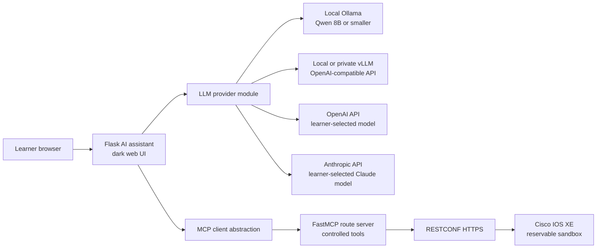
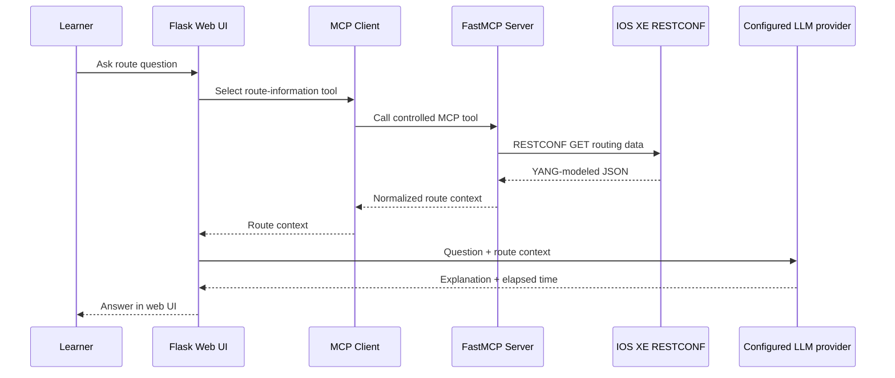

# Lab 11: Build an AI Network Route Assistant

## Lab Introduction

In this lab, learners build a small but realistic AI network assistant. The assistant runs on the learner workstation, displays a professional dark-theme web interface, and asks a FastMCP tool layer for routing information. Learners can use Qwen 8B through Ollama, serve the Hugging Face model through vLLM, or connect the same application to a paid OpenAI or Anthropic API. The FastMCP server is the only component that retrieves live routing information from a Cisco IOS XE reservable sandbox router through RESTCONF.

The important design choice is that neither the language model nor the Flask application connects directly to the router. Instead, Flask asks an MCP client abstraction for route context, the MCP client calls controlled tools exposed by `mcp_server.py`, and the MCP server retrieves the route data through RESTCONF. A small provider module then sends the same question and MCP context to the selected model. This reinforces the Chapter 17 principle that AI should operate through narrow, auditable tools rather than unrestricted device access.

By the end of the lab, learners can ask questions such as:

- How many routes are in the routing table?
- Which routes are static?
- Which routes are connected?
- What are the next hops for the static routes?
- What is the metric for each route?
- Show the details for a specific prefix.

## Learning Objectives

- Run Qwen 8B through Ollama or vLLM, or select an approved OpenAI or Anthropic API model.
- Build a Flask-based AI assistant web UI.
- Retrieve IOS XE routing information through a FastMCP tool layer that uses RESTCONF.
- Normalize route data from YANG-modeled JSON responses.
- Expose route-information tools with Python FastMCP.
- Use an LLM to explain live route data without giving the model direct router access.
- Compare local and cloud models for accuracy, latency, resource use, privacy, and cost.
- Recognize the security boundary between the AI assistant, MCP tools, credentials, and the network device.

## Lab Topology


```mermaid
flowchart LR
    Browser["Learner browser"] --> Flask["Flask AI assistant<br/>dark web UI"]
    Flask --> Gateway["LLM provider module"]
    Gateway --> Ollama["Local Ollama<br/>Qwen 8B or smaller"]
    Gateway --> vLLM["Local or private vLLM<br/>OpenAI-compatible API"]
    Gateway --> OpenAI["OpenAI API<br/>learner-selected model"]
    Gateway --> Claude["Anthropic API<br/>learner-selected Claude model"]
    Flask --> MCPClient["MCP client abstraction"]
    MCPClient --> MCPServer["FastMCP route server<br/>controlled tools"]
    MCPServer --> RESTCONF["RESTCONF HTTPS"]
    RESTCONF --> IOSXE["Cisco IOS XE<br/>reservable sandbox"]
```

The Flask application does not retrieve network data directly. It asks the MCP tool layer for route context, and the MCP server owns the RESTCONF interaction with IOS XE. This separation keeps the AI-facing application simple while preserving a clean operational boundary.

## Prerequisites

Before starting, learners should have:

- Ubuntu workstation prepared from Lab 1.
- Access to a Cisco IOS XE reservable sandbox.
- RESTCONF enabled on the sandbox router.
- Python virtual environment knowledge from earlier labs.
- Basic understanding of Chapter 17 MCP concepts.

The lab assumes the learner works under:

```bash
mkdir -p ~/ccnpauto-workspace
cd ~/ccnpauto-workspace
```

## Task 1: Create the Lab Repository on GitLab.com

Lab 11 is a separate application and does not use NetBox, Vault, TIG, or GitLab Runner. Stop those services before loading the local Qwen model:

```bash
test -d "$HOME/lab-services/netbox-docker" && \
  (cd "$HOME/lab-services/netbox-docker" && docker compose stop)
test -d "$HOME/lab-services/tig" && \
  (cd "$HOME/lab-services/tig" && docker compose stop)
sudo systemctl stop gitlab-runner
```

Start local Yangsuite only when a RESTCONF route URI needs model verification; otherwise use Cisco DevNet Sandbox Yangsuite at `http://10.10.20.50:8480`.

Create a new GitLab.com project named `ai_route_assistant`. Then clone it to the workstation:

```bash
cd ~/ccnpauto-workspace
git clone git@gitlab.com:<your-namespace>/ai_route_assistant.git
cd ai_route_assistant
```

Using the VS Code Explorer, copy and paste the contents of `CCNPAUTO/LAB/Lab11/` into the cloned `ai_route_assistant/` repository. Include `.env.example`, `.gitignore`, `requirements.txt`, all Python files, and the `logs/`, `templates/`, `static/`, and `scripts/` folders. Keep the supplied hierarchy and do not create a second requirements file.

The repository now contains a small web application, an MCP client abstraction, a FastMCP server, and a RESTCONF route backend used only behind the MCP server.

## Task 2: Prepare Python and Environment Variables

Create and activate a virtual environment:

```bash
python3 -m venv .venv
source .venv/bin/activate
python -m pip install --upgrade pip
python -m pip install -r requirements.txt
```

Open `.env.example`, create a new `.env` file in the repository root, and copy and paste the example content into it. Then protect and modify `.env`:

```bash
chmod 600 .env
nano .env
```

Update the IOS XE values based on the reservable sandbox reservation. Select only one LLM provider in Task 3:

```text
IOSXE_HOST=<sandbox-management-ip-or-hostname>
IOSXE_RESTCONF_PORT=443
IOSXE_USERNAME=<sandbox-username>
IOSXE_PASSWORD=<sandbox-password>
IOSXE_VERIFY_TLS=false

LLM_PROVIDER=ollama
LLM_TIMEOUT_SECONDS=120
LLM_MAX_TOKENS=800

OLLAMA_URL=http://127.0.0.1:11434
OLLAMA_MODEL=qwen3:8b

VLLM_BASE_URL=http://127.0.0.1:8000/v1
VLLM_MODEL=Qwen/Qwen3-8B
VLLM_API_KEY=lab11-local-key

OPENAI_API_KEY=
OPENAI_MODEL=

ANTHROPIC_API_KEY=
ANTHROPIC_MODEL=

ENABLE_FILE_LOGGING=false
ENABLE_CONSOLE_LOGGING=true
LOG_LEVEL=DEBUG
LOG_CONSOLE_LEVEL=INFO
LOG_DIR=logs
```

For a lab sandbox, `IOSXE_VERIFY_TLS=false` is commonly required because the device may present a self-signed certificate. In a production design, TLS verification should be enabled with a trusted CA bundle.

Set `ENABLE_FILE_LOGGING=true` while studying or troubleshooting. Each Flask, MCP, readiness-check, or supporting Python process then creates a separate timestamped text file under `logs/`. The logs record request IDs, tool selection, RESTCONF resources and status, route counts, provider name, timing, and exceptions. They intentionally omit authorization headers, API keys, passwords, and complete provider response bodies.

Open the supplied `.gitignore` in VS Code and confirm that `.env`, `.venv/`, Python cache files, and generated contents under `logs/` remain ignored. Do not replace the existing file.

## Task 3: Choose and Configure an LLM Provider

The supplied `llm_providers.py` module gives the application one stable function, `ask_llm()`, while isolating provider-specific URLs, headers, payloads, and response parsing. To change providers, edit `LLM_PROVIDER` and the corresponding variables in `.env`, then restart Flask. No MCP or RESTCONF code changes are required.

### Option A: Run Qwen 8B Locally with Ollama

This is the default option. Route context remains on the learner workstation, there is no per-request API charge, and the exercise continues to work without cloud API access. In return, generation speed and answer quality depend on workstation CPU, memory, and model size.

Install Ollama from the official installer:

```bash
dpkg --print-architecture
uname -m
curl -fsSL https://ollama.com/install.sh -o /tmp/install-ollama.sh
sh /tmp/install-ollama.sh
```

The official installer detects the workstation architecture. On x86-64 Ubuntu, `dpkg --print-architecture` returns `amd64` and the installer selects the x86-64 Ollama build. On ARM64 Ubuntu, it returns `arm64` and selects the ARM64 build. After installation, run `ollama --version`; do not copy an ARM64 binary from another workstation onto an x86-64 learner system.

If the workstation is behind a proxy or TLS inspection device, the download may fail with a certificate error. In that case, install the organization’s trusted CA certificate first, then retry the command. Do not permanently disable TLS verification for software installation.

Start and test Ollama:

```bash
ollama --version
ollama serve
```

Open a second terminal and pull the Qwen 8B model:

```bash
ollama pull qwen3:8b
ollama run qwen3:8b "Explain what a connected route is in one sentence."
```

If `qwen3:8b` is slow, use a smaller Qwen model without changing the application code. `qwen3:4b` provides a useful balance for many CPU-only workstations, while `qwen3:1.7b` uses less memory and starts faster:

```bash
ollama pull qwen3:4b
ollama run qwen3:4b "Explain what a connected route is in one sentence."
```

Then set `OLLAMA_MODEL=qwen3:4b` in `.env` and restart Flask. If necessary, repeat with `qwen3:1.7b`. Smaller models normally improve latency and reduce memory use, but they may miscount routes or omit details more often, so compare every answer with the MCP evidence.

Keep these values in `.env`:

```text
LLM_PROVIDER=ollama
OLLAMA_URL=http://127.0.0.1:11434
OLLAMA_MODEL=qwen3:8b
```

### Option B: Serve Qwen with vLLM

vLLM is useful when the workstation or a private inference server has a supported accelerator and the model must serve multiple requests efficiently. Unlike Ollama, which emphasizes a simple local-model experience, vLLM exposes an OpenAI-compatible API and is commonly used as a higher-throughput serving layer. The Flask application still calls only the provider module; the MCP and RESTCONF design remains unchanged.

For this course, use vLLM only when an NVIDIA GPU with sufficient memory is available. Qwen3-8B has approximately eight billion parameters, so model weights and runtime memory can exceed the capacity of an entry-level GPU. Learners using CPU-only or low-memory workstations should select Ollama with `qwen3:4b` or `qwen3:1.7b` instead.

The Lab 11 Python environment does not need the `vllm` package. vLLM runs as a separate HTTP service, while the existing `requests` dependency calls its OpenAI-compatible API. This separation avoids introducing large GPU libraries into the Flask application's virtual environment.

First confirm that the NVIDIA driver and Docker GPU support are working:

```bash
dpkg --print-architecture
uname -m
nvidia-smi
docker info
```

The standard course path for this option is an x86-64 Ubuntu workstation, shown as `amd64` by `dpkg` and `x86_64` by `uname`, with a supported NVIDIA GPU. Learners on an ARM64 workstation or a system without a working accelerator should use Ollama unless their instructor has supplied a tested vLLM server for that platform.

Start the official vLLM OpenAI-compatible container. The command uses host networking, so the API listens on `http://127.0.0.1:8000` without a Docker port mapping:

```bash
docker run --rm --gpus all \
  --network host \
  --ipc host \
  -v "$HOME/.cache/huggingface:/root/.cache/huggingface" \
  vllm/vllm-openai:latest \
  --model Qwen/Qwen3-8B \
  --host 127.0.0.1 \
  --port 8000 \
  --api-key lab11-local-key
```

The first start downloads the model from Hugging Face and may take several minutes. Leave this terminal running. In another terminal, configure the existing Lab 11 `.env` file:

```text
LLM_PROVIDER=vllm
VLLM_BASE_URL=http://127.0.0.1:8000/v1
VLLM_MODEL=Qwen/Qwen3-8B
VLLM_API_KEY=lab11-local-key
```

The provider sends a Chat Completions request to `/v1/chat/completions`. `VLLM_MODEL` must match the model name used by the vLLM server, and `VLLM_API_KEY` must match the value supplied with `--api-key`. The key protects the local endpoint from unauthenticated callers; it is not a cloud-provider credential.

If vLLM runs on a separate private GPU server, change `VLLM_BASE_URL` to that server's approved HTTPS endpoint. Do not expose an unauthenticated vLLM service to an untrusted network. Keep the API key in `.env`, restrict inbound access with a firewall, and use TLS when traffic leaves the learner workstation.

### Option C: Use the OpenAI API

Create an API key in the OpenAI API platform:

1. Sign in at `https://platform.openai.com/`.
2. Select the project that will own the lab usage.
3. Open **API keys** and select **Create new secret key**.
4. Give it a lab-specific name. If **Restricted** permissions are selected, explicitly allow requests to the Responses API (`POST /v1/responses`). A **Read Only** key cannot generate a model response and will return an authorization error.
5. Copy the key once into `.env`.
6. In the same project, open **Limits** and confirm that the model named by `OPENAI_MODEL` is enabled for the project.
7. Confirm that API billing or project credits are available.

A ChatGPT web subscription does not automatically include API credits because ChatGPT and API billing are managed separately. Never paste the key into source code or commit it to Git.

```text
LLM_PROVIDER=openai
OPENAI_API_KEY=<your-api-key>
OPENAI_MODEL=<model-id-available-to-your-api-account>
OPENAI_BASE_URL=https://api.openai.com/v1
```

The provider module uses the OpenAI Responses API. Because model availability changes, learners should copy the exact model ID shown in their API account instead of assuming that a model available in the ChatGPT web interface is also enabled for API use.

Before starting Flask, verify that all four OpenAI settings refer to the same API project:

```text
LLM_PROVIDER=openai
OPENAI_API_KEY=<project-api-key-with-responses-write-access>
OPENAI_MODEL=<model-enabled-under-project-limits>
OPENAI_BASE_URL=https://api.openai.com/v1
```

After changing `.env`, stop and restart Flask because a running Python process does not automatically reload environment variables.

### Option D: Use the Anthropic API

Create an API key in the Anthropic Console:

1. Sign in at `https://console.anthropic.com/`.
2. Select the appropriate workspace.
3. Open **API Keys**, select **Create Key**, and assign a lab-specific name.
4. Copy the key once into `.env`, then confirm that the workspace has usable credits and an enabled model.

Access to the Claude web application alone is not a substitute for an API key.

```text
LLM_PROVIDER=anthropic
ANTHROPIC_API_KEY=<your-api-key>
ANTHROPIC_MODEL=<model-id-available-to-your-api-account>
ANTHROPIC_BASE_URL=https://api.anthropic.com/v1
ANTHROPIC_VERSION=2023-06-01
```

The provider module uses Anthropic's Messages API. As with OpenAI, use the exact model ID presented by the provider account.

When a cloud provider is selected, the route context returned by the MCP server leaves the workstation and is processed by that provider. Although the code never sends router credentials, routing tables can still reveal internal topology. Use only course sandbox data unless the organization has approved the provider, account, region, retention policy, and data classification.

## Task 4: Validate MCP-to-RESTCONF Reachability

From the project directory, load the environment and run the readiness check:

```bash
source .venv/bin/activate
set -a
source .env
set +a
python scripts/check_lab11.py
```

With file logging enabled, open `logs/` in VS Code and inspect the newest `check_lab11_*.log`. Repeat the command and confirm that a new filename is created. If the check fails, use its component and exception chain to determine whether the problem is configuration, RESTCONF, MCP, Ollama, vLLM, or a cloud provider.

Then test the route path through the MCP client abstraction:

```bash
python - <<'PY'
from pprint import pprint
from mcp_client import call_route_tool

pprint(call_route_tool("get_route_summary"))
PY
```

The output should show a total route count and route counts grouped by protocol. This confirms that the MCP tool path can reach the RESTCONF backend. If the script reports that no supported route endpoint returned data, use either a local Yangsuite installation or Cisco DevNet Sandbox Yangsuite at `http://10.10.20.50:8480` to inspect the routing operational models supported by the current IOS XE sandbox release. IOS XE releases can differ in the exact operational YANG path used for RIB data.

## Task 5: Inspect the MCP and RESTCONF Boundary

Open `mcp_server.py`, `mcp_client.py`, and `restconf_routes.py` together. The Flask app calls `mcp_client.py`; the MCP client calls controlled route tools in `mcp_server.py`; and `mcp_server.py` imports the RESTCONF backend from `restconf_routes.py`. Therefore, the web assistant does not retrieve route data directly from IOS XE.

The MCP server exposes these tools:

```python
get_route_summary()
get_routes_by_protocol("static")
get_routes_by_protocol("connected")
get_route_detail("10.10.10.0/24")
get_all_routes()
```

This design keeps the AI prompt grounded in live data while preserving the right trust boundary. The LLM receives a JSON context produced by the MCP tool layer and is instructed to answer only from that context. The LLM does not receive the router password, does not send RESTCONF requests, and cannot create or change routes.

## Task 6: Start the FastMCP Route Server

Run the FastMCP server:

```bash
source .venv/bin/activate
set -a
source .env
set +a
python mcp_server.py
```

The server exposes four route tools:

| MCP tool | Purpose |
|---|---|
| `get_route_summary` | Returns total route count and counts grouped by protocol |
| `get_routes_by_protocol` | Returns static, connected, local, OSPF, or other matching routes |
| `get_route_detail` | Returns details for one exact destination prefix |
| `get_all_routes` | Returns all normalized routes collected through RESTCONF |

During development, learners can also inspect the server with the MCP SDK tooling:

```bash
mcp dev mcp_server.py
```

The point is not to give the model a generic command tool. The point is to expose controlled route-information tools that return structured data.

## Task 7: Run the Flask AI Assistant

In a separate terminal, start the Flask application:

```bash
source .venv/bin/activate
set -a
source .env
set +a
python app.py
```

Open the web interface:

```text
http://127.0.0.1:5050
```

The page should display a dark professional assistant interface. The left panel shows a live route summary returned by the MCP tool layer. The chat area lets learners ask route-related questions.

The MCP server and Flask application are separate processes and therefore create separate log files. Correlate them by timestamp and nonsecret request context. This boundary helps prove whether a route fact came from RESTCONF and MCP before evaluating the LLM's wording.

Ask:

```text
How many routes are in the routing table?
```

Then ask:

```text
Show me the static routes and next hops.
```

The Flask application selects the appropriate MCP tool, receives route context from the MCP layer, sends that context to the configured provider, and returns a natural-language explanation. The answer header shows the provider, model, and elapsed generation time. If the context does not include the requested detail, the assistant should say what is missing rather than inventing a route.

## Task 8: Understand the Assistant Workflow

The request path is intentionally simple:


```mermaid
sequenceDiagram
    participant U as Learner
    participant W as Flask Web UI
    participant C as MCP Client
    participant M as FastMCP Server
    participant D as IOS XE RESTCONF
    participant L as Configured LLM provider

    U->>W: Ask route question
    W->>C: Select route-information tool
    C->>M: Call controlled MCP tool
    M->>D: RESTCONF GET routing data
    D-->>M: YANG-modeled JSON
    M-->>C: Normalized route context
    C-->>W: Route context
    W->>L: Question + route context
    L-->>W: Explanation + elapsed time
    W-->>U: Answer in web UI
```

This workflow avoids a risky pattern where the LLM directly decides which network endpoint to call. The MCP server is the deterministic software boundary that decides what data can be retrieved, how much data can be returned, and how RESTCONF errors are handled.

## Task 9: Compare Local and Cloud Models

Good AI-assisted operations depend on good questions and good data. Try the following:

```text
List connected routes with their metrics.
```

```text
What next hops are used by the static routes?
```

```text
Show details for 0.0.0.0/0.
```

```text
Which protocols appear in the routing table?
```

If an answer seems vague, inspect the JSON context shown in the left panel. The assistant can only explain the data that was successfully retrieved and normalized from RESTCONF.

Run the same questions against at least two providers when API access is available. For each provider, edit `.env`, restart Flask, and repeat the questions without changing the IOS XE reservation. Record the observations:

| Provider and model | Route count correct | Static next hops correct | Unsupported detail acknowledged | Response time | Operational observation |
|---|---|---|---|---:|---|
| Ollama / `qwen3:8b` |  |  |  |  |  |
| vLLM / `Qwen/Qwen3-8B` |  |  |  |  |  |
| OpenAI / selected model |  |  |  |  |  |
| Anthropic / selected model |  |  |  |  |  |

Accuracy is determined by comparing each answer with the MCP context shown in the left panel, not by choosing the most fluent answer. A model fails the accuracy check if it changes a prefix, invents a next hop, miscounts routes, or presents an absent metric as fact. Performance includes elapsed time as well as local CPU and memory impact. Finally, account for privacy and cost: local inference consumes workstation resources, whereas cloud inference sends route context outside the workstation and may create token charges.

## Task 10: Commit the Lab Project

Commit the working project:

```bash
git status
git add .gitignore requirements.txt logging_config.py app.py llm_providers.py \
  restconf_routes.py mcp_client.py mcp_server.py logs/.gitkeep templates static scripts
git commit -m "Build multi-provider AI route assistant with FastMCP"
git push -u origin main
```

Confirm that `.env` was not committed:

```bash
git ls-files | grep '^.env$' || echo ".env is not tracked"
```

## Troubleshooting

| Symptom | Likely Cause | Action |
|---|---|---|
| `curl` cannot download Ollama | Missing CA certificate or proxy TLS inspection | Install trusted CA certificate and retry |
| `ollama run qwen3:8b` is slow | Workstation memory or CPU is limited | Stop unused services and select `qwen3:4b` or `qwen3:1.7b` in `.env` |
| Flask reports Ollama connection failure | Ollama service is not running | Start `ollama serve` |
| vLLM container cannot access the GPU | NVIDIA driver or Docker GPU runtime is unavailable | Confirm `nvidia-smi` works; otherwise use Ollama or a private vLLM server |
| vLLM returns `401` | `VLLM_API_KEY` does not match the server's `--api-key` | Use the same lab-specific value in the server command and `.env` |
| vLLM fails while loading Qwen3-8B | GPU memory is insufficient | Use Ollama with a smaller Qwen model or use a larger private GPU server |
| Readiness check reports a missing cloud variable | Provider-specific API key or model ID is absent | Complete the selected provider section in `.env` |
| Cloud API returns `401` | API key is invalid, revoked, or belongs to the wrong service | Create a new provider API key and update `.env` |
| OpenAI returns `403` for `/v1/responses` | The key is Read Only, its restricted endpoint permission blocks Responses, the user is not authorized for the project, or the selected model is disabled | Read the detailed provider message, grant the key Responses request/write access, confirm project membership, and enable the exact model under project **Limits** |
| Cloud API returns `429` | Account quota or provider rate limit was reached | Check provider billing and limits, wait, then retry |
| RESTCONF returns `401` or `403` | Wrong sandbox credentials | Check reservation details and `.env` |
| RESTCONF route endpoint returns `404` | IOS XE release uses a different YANG path | Use local Yangsuite or Cisco DevNet Sandbox Yangsuite at `http://10.10.20.50:8480` to inspect routing operational models |
| Assistant invents details | Prompt lacks enough route context or model is too creative | Keep temperature low and verify against JSON context |

## Key Takeaways

- A useful AI network assistant should be grounded in live operational data, not guesses.
- RESTCONF provides structured routing data that can be normalized by the MCP server before being sent to the model.
- FastMCP exposes controlled network-information tools and creates the safety boundary between the AI assistant and the network.
- The model should not receive device credentials or unrestricted access to network commands.
- A provider abstraction allows the same MCP-grounded workflow to use Ollama, vLLM, or cloud models without changing network-access code.
- Model quality must be measured against MCP evidence; latency, privacy, resource use, and API cost also affect provider selection.
- A professional AI workflow still requires validation, least privilege, clear error handling, and human verification.

## References

- [Ollama](https://ollama.com/) - local model runtime.
- [Qwen Models on Ollama](https://ollama.com/library/qwen3) - Qwen model family availability in Ollama.
- [vLLM Installation](https://docs.vllm.ai/en/latest/getting_started/installation/gpu/) - supported accelerator and container installation options.
- [vLLM OpenAI-Compatible Server](https://docs.vllm.ai/en/latest/serving/openai_compatible_server/) - Chat Completions endpoint and server options.
- [Qwen3-8B](https://huggingface.co/Qwen/Qwen3-8B) - official model card and vLLM serving example.
- [OpenAI Responses API](https://platform.openai.com/docs/api-reference/responses) - OpenAI request and response structure.
- [OpenAI API Billing](https://help.openai.com/en/articles/8156019) - distinction between ChatGPT and API billing.
- [Anthropic Messages API](https://platform.claude.com/docs/en/api/messages) - Anthropic request and response structure.
- [Anthropic Models](https://platform.claude.com/docs/en/about-claude/models/overview) - current model IDs and model selection.
- [Model Context Protocol](https://modelcontextprotocol.io/) - MCP concepts and architecture.
- [MCP Python SDK](https://github.com/modelcontextprotocol/python-sdk) - Python SDK and FastMCP examples.
- [Cisco IOS XE RESTCONF Programmability](https://developer.cisco.com/docs/ios-xe/) - IOS XE programmability documentation.
- [Cisco Yangsuite](https://developer.cisco.com/yangsuite/) - YANG model discovery and RESTCONF/NETCONF testing.
