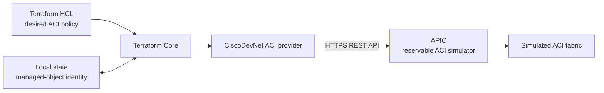
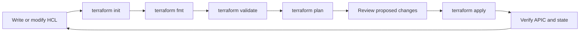
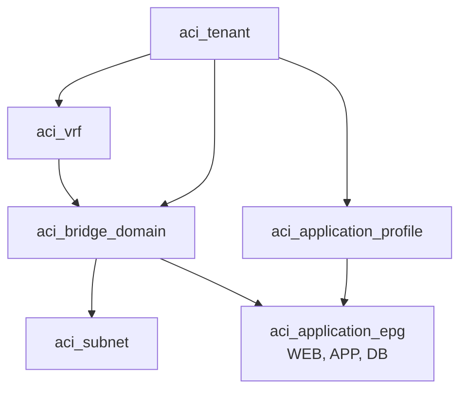

# Optional Lab 12: Provision Cisco ACI with Terraform

## Lab Introduction

An application team needs an isolated three-tier network in Cisco ACI. Creating the tenant, VRF, bridge domain, subnet, application profile, and endpoint groups manually would be repeatable only through an operator's memory. In this optional lab, learners express the same ACI policy as Terraform configuration and deploy it to a Cisco DevNet reservable ACI Simulator sandbox. Because this is the first Terraform-focused lab, the workflow begins with the project directory, HashiCorp Configuration Language (HCL), providers, state, and the Terraform command lifecycle before any ACI object is created.

Terraform is useful here because the configuration describes the intended end state and records the relationships among ACI managed objects. The ACI provider translates Terraform resources into APIC API operations, while the state file records which remote objects Terraform manages. Consequently, learners must review the plan before applying it and must not treat the state file as a disposable log.

Terraform and Ansible overlap, but they approach automation differently. Terraform is primarily declarative infrastructure provisioning: it compares configuration and state, builds a dependency graph, and determines which resources must be created, changed, or removed. Ansible is primarily task-oriented configuration and orchestration: a playbook executes modules in an ordered workflow against inventory. Terraform therefore fits well when the team must manage the lifecycle and identity of controller objects, cloud resources, networks, or virtual infrastructure. Ansible fits well when the team must configure operating systems and network devices, run validations, perform upgrades, or coordinate operational procedures.

In a real deployment, the tools commonly complement one another. A reviewed Terraform plan can create an ACI tenant, VRF, bridge domains, and EPGs; after those objects exist, an Ansible playbook can configure attached network devices, deploy application settings, run pyATS verification, and collect evidence. A CI/CD pipeline can coordinate both tools while keeping each responsible for the part of the lifecycle it handles best. The same resource should not be independently managed by both tools because competing ownership can create drift and unpredictable changes.

| Characteristic | Terraform | Ansible |
|---|---|---|
| Primary strength | Provisioning and lifecycle management of declared resources | Ordered configuration, orchestration, and operational tasks |
| Memory of managed objects | Persistent Terraform state maps resource addresses to remote objects | Normally evaluates inventory and task results during each playbook run |
| Preview workflow | Produces a dependency-aware execution plan before apply | Check mode and module diffs can preview supported tasks |
| Combined use | Creates and owns ACI infrastructure objects | Configures dependent systems and validates the deployed service |

This lab is standalone and does not modify `network_automation_project`.

## Learning Objectives

- Explain how the Terraform provider maps resources to ACI managed objects.
- Read a Terraform project directory and explain the purpose of each file.
- Interpret basic HCL blocks, labels, arguments, references, variables, maps, and `for_each`.
- Explain the Terraform `init`, `fmt`, `validate`, `plan`, `apply`, and state-inspection workflow.
- Compare Terraform with Ansible and identify how they complement one another.
- Authenticate to APIC without placing credentials in HCL files.
- Create an ACI tenant, VRF, bridge domain, subnet, application profile, and EPGs.
- Interpret `terraform plan`, `apply`, `state`, and `destroy`.
- Verify the deployed policy in APIC and through Terraform outputs.
- Explain why Terraform state must be protected and coordinated.

## Architecture



## Prerequisites

- Ubuntu workstation prepared in Lab 1.
- Terraform installed and available in the terminal.
- A GitLab.com account.
- An active **Cisco ACI Simulator reservable sandbox** reservation.
- VPN access and the APIC URL and credentials shown in the reservation.
- Basic understanding of ACI tenants, VRFs, bridge domains, application profiles, and EPGs.

Create a standalone GitLab.com repository named `optional_lab12_aci_terraform`, clone it under `~/ccnpauto-workspace`, and use the VS Code Explorer to copy the files from `CCNPAUTO/LAB/Lab12 - Provision Cisco ACI with Terraform/` into it, including the hidden `.env.example` file.

## Understand the Terraform Project Folder

Terraform evaluates all files ending in `.tf` in the current directory as one configuration. The filenames help people organize the project, but they do not control execution order. Terraform determines order from references and dependencies between resources.

Before initialization, the repository should resemble this structure:

```text
optional_lab12_aci_terraform/
├── .env.example       # Safe template showing required environment variables
├── .gitignore         # Prevents secrets, state, plans, and cache files entering Git
├── Lab12.md           # Lab instructions
├── main.tf            # ACI resources and their relationships
├── outputs.tf         # Values displayed after an apply
├── variables.tf       # Input declarations, types, defaults, and validation
└── versions.tf        # Terraform and provider version requirements
```

After learners create `.env` and run `terraform init`, additional local files appear:

```text
optional_lab12_aci_terraform/
├── .env                    # Real credentials and learner-specific values; never commit
├── .terraform/             # Downloaded provider plug-ins and initialization metadata
└── .terraform.lock.hcl     # Selected provider versions and checksums; commit this file
```

After `terraform apply`, Terraform also creates `terraform.tfstate` and may create a backup state file. State connects a Terraform resource address such as `aci_tenant.course` to the real APIC distinguished name. It can contain sensitive infrastructure data and must not be committed to this course repository. Production teams normally use a protected remote backend with access control, locking, encryption, backup, and recovery procedures.

Always run Terraform commands from the repository root, where the `.tf` files are located. Running from a different directory loads a different configuration and state, even when the commands themselves are identical.

## Read Basic Terraform and HCL Syntax

Terraform configuration uses HCL. Most configuration is expressed as blocks containing arguments and expressions:

```hcl
resource "aci_tenant" "course" {
  name        = local.tenant_name
  description = "Managed by Terraform"
}
```

In this resource block:

- `resource` is the block type.
- `aci_tenant` is the provider's resource type.
- `course` is the local name used to reference this resource inside Terraform.
- `name` and `description` are resource arguments.
- `local.tenant_name` is an expression that references a local value.
- `aci_tenant.course` is the resource address, while `aci_tenant.course.id` accesses the ID returned by APIC.

HCL uses `#` for a line comment. Strings use quotation marks, lists use square brackets, and maps or objects use braces. Indentation improves readability but does not define block structure; braces do.

### Variables, Local Values, and Outputs

An input variable defines a value that can differ between runs:

```hcl
variable "learner_id" {
  description = "Short identifier used to make objects unique."
  type        = string
}
```

Terraform refers to it as `var.learner_id`. This lab supplies it through `TF_VAR_learner_id` in `.env`. A variable can also have a default and a validation block, as shown in `variables.tf`.

A local value gives a reusable name to an expression:

```hcl
locals {
  tenant_name = "ccnpauto-${var.learner_id}"
}
```

The `${...}` sequence interpolates an expression into a string. The resulting value is referenced as `local.tenant_name`.

An output displays useful data after an apply:

```hcl
output "tenant_dn" {
  value = aci_tenant.course.id
}
```

Outputs are not merely print statements. They can also pass values from a reusable Terraform module to another part of a larger infrastructure design.

### Maps and `for_each`

The `epgs` variable is a map whose keys identify application tiers and whose values hold the desired EPG names:

```hcl
default = {
  web = "WEB-EPG"
  app = "APP-EPG"
  db  = "DB-EPG"
}
```

The EPG resource uses the `for_each` meta-argument:

```hcl
resource "aci_application_epg" "tier" {
  for_each = var.epgs

  parent_dn = aci_application_profile.three_tier.id
  name      = each.value
}
```

Terraform creates a distinct resource instance for every map entry. For the `web` entry, `each.key` is `web`, `each.value` is `WEB-EPG`, and the resulting resource address is `aci_application_epg.tier["web"]`. Stable map keys are important because changing a key can cause Terraform to treat the instance as a different resource.

### References Create the Dependency Graph

The expression `parent_dn = aci_tenant.course.id` tells Terraform that the child resource depends on the tenant. Likewise, the bridge domain references the VRF, and each EPG references both the application profile and bridge domain. Terraform uses these references to construct its dependency graph and choose a safe creation or deletion order. Learners do not need to arrange resource blocks in execution order.

## Understand Providers

Terraform Core understands configuration, state, dependency graphs, and plans, but it does not contain native knowledge of APIC. A provider is a plug-in that supplies resource schemas and translates lifecycle operations into calls to a platform API.

Open `versions.tf`:

```hcl
terraform {
  required_version = ">= 1.6.0"

  required_providers {
    aci = {
      source  = "ciscodevnet/aci"
      version = "~> 2.20"
    }
  }
}

provider "aci" {
  # Authentication and URL are read from ACI_* environment variables.
}
```

The `terraform` block constrains Terraform Core and declares required providers. `ciscodevnet/aci` is the provider source address in the Terraform Registry. The constraint `~> 2.20` accepts compatible 2.x releases beginning with 2.20 but does not permit a 3.x provider. The `provider "aci"` block configures the provider instance; in this lab it is intentionally empty because the provider reads APIC connection information from protected `ACI_*` environment variables.

During `terraform init`, Terraform downloads the provider into `.terraform/` and writes the selected version and package checksums to `.terraform.lock.hcl`. A provider upgrade can change schemas or behavior, so teams review upgrades rather than silently selecting an arbitrary new release.

## Understand the Terraform Command Lifecycle

The normal workflow is iterative rather than a one-time script execution:



| Command | Purpose | Remote infrastructure effect |
|---|---|---|
| `terraform version` | Displays Terraform Core and provider information | None |
| `terraform init` | Initializes the working directory, installs providers, and prepares a backend | Does not create ACI resources |
| `terraform fmt -recursive` | Rewrites HCL into Terraform's standard style | None |
| `terraform validate` | Checks HCL syntax and internal consistency using installed provider schemas | None |
| `terraform plan` | Refreshes known state and calculates proposed create, update, and delete actions | Normally read-only against APIC; does not apply the proposed changes |
| `terraform plan -out=<file>` | Saves the exact reviewed plan for a later apply | Same as plan |
| `terraform show <plan>` | Displays a saved plan in human-readable form | None |
| `terraform apply <plan>` | Executes the actions in the saved plan and updates state | Creates, modifies, or deletes managed objects as shown in the plan |
| `terraform output` | Displays declared output values from state | None |
| `terraform state list` | Lists Terraform resource addresses recorded in state | None |
| `terraform state show <address>` | Displays one resource instance from state | None |
| `terraform plan -destroy` | Previews removal of all resources managed by the configuration | Read-only preview |
| `terraform destroy` | Plans and applies removal of managed resources | Destructive; this lab uses a separately reviewed saved destroy plan instead |

`init` must run when a repository is first cloned, when provider requirements change, or when backend configuration changes. `validate` confirms that Terraform can understand the configuration, but it does not prove that credentials, permissions, or requested values will succeed on APIC. `plan` is therefore the operational review boundary. Only an expected plan should proceed to `apply`.

## Task 1: Inspect the ACI Object Model

Before running Terraform, sign in to APIC with the reservation credentials. Inspect these locations:

1. Open **Tenants** and confirm that the learner tenant does not already exist.
2. Open an existing tenant and examine **Networking > VRFs**.
3. Examine **Networking > Bridge Domains** and the subnets below a bridge domain.
4. Examine **Application Profiles** and the endpoint groups below a profile.

The hierarchy matters because APIC identifies objects by distinguished names. For example:

```text
uni/tn-ccnpauto-<learner-id>
uni/tn-ccnpauto-<learner-id>/ctx-PROD-VRF
uni/tn-ccnpauto-<learner-id>/BD-PROD-BD
uni/tn-ccnpauto-<learner-id>/ap-THREE-TIER-APP/epg-WEB-EPG
```

Terraform dependencies reproduce this hierarchy. A child resource uses the parent resource ID instead of reconstructing the distinguished name manually.

## Task 2: Protect APIC Credentials

Open `.env.example`, create a new `.env` file in the repository root, copy and paste the example content into it, and insert the values from the active reservation:

```text
ACI_URL=https://<apic-address>
ACI_USERNAME=<sandbox-username>
ACI_PASSWORD=<sandbox-password>
ACI_INSECURE=true
TF_VAR_learner_id=<short-lowercase-identifier>
```

`ACI_INSECURE=true` is acceptable only for this simulator because its certificate might not be trusted by the workstation. A production workflow should validate APIC TLS with the organization's CA. Do not commit `.env`.

Load the variables into the current shell:

```bash
set -a
source .env
set +a
```

The ACI provider reads `ACI_URL`, `ACI_USERNAME`, `ACI_PASSWORD`, and `ACI_INSECURE`. Terraform reads variables prefixed with `TF_VAR_`, so `TF_VAR_learner_id` becomes the `learner_id` input without a password appearing in a `.tf` file.

## Task 3: Trace the Terraform Configuration

Open `versions.tf`, `variables.tf`, `main.tf`, and `outputs.tf` side by side in VS Code. Terraform combines them into one configuration, but review them in this order to follow the design:

1. In `versions.tf`, identify the Terraform Core requirement, ACI provider source, provider constraint, and provider configuration.
2. In `variables.tf`, identify which inputs are mandatory, which have defaults, and how `learner_id` validation prevents an unsuitable object name.
3. In `main.tf`, begin with `locals`, then trace the tenant, VRF, bridge domain, subnet, application profile, and EPG resource references.
4. In `outputs.tf`, identify which APIC attributes Terraform will expose after a successful apply.

The configuration uses the `ciscodevnet/aci` provider resource model. The main dependency path is:



The arrows represent references rather than file order. For example, `aci_bridge_domain.production` cannot be completed until its tenant and referenced VRF exist. The `for_each` expression creates three EPG resources from one map. Each EPG remains a separately addressable Terraform resource and ACI managed object.

## Task 4: Initialize and Validate

Confirm Terraform is available:

```bash
terraform version
```

Format the configuration, initialize the working directory, inspect the installed providers, and validate the combined configuration:

```bash
terraform fmt -recursive
terraform init
terraform providers
terraform validate
```

Interpret the sequence carefully:

- `terraform fmt -recursive` normalizes HCL layout. Review any formatted files before committing them.
- `terraform init` reads `versions.tf`, downloads the ACI provider, and creates `.terraform.lock.hcl`.
- `terraform providers` shows that the root configuration requires `registry.terraform.io/ciscodevnet/aci`.
- `terraform validate` checks syntax, references, types, and provider schema usage without creating ACI objects.

Commit `.terraform.lock.hcl` because it records the selected provider release and checksums. Do not commit `.terraform/`, `.env`, plan files, or state files. A successful validation means the configuration is structurally valid; it does not yet confirm APIC authentication or permission.

## Task 5: Review the Execution Plan

Create a saved plan:

```bash
terraform plan -out=aci.plan
terraform show aci.plan
```

During planning, Terraform reads the HCL, refreshes the known remote state through the ACI provider, compares desired and recorded state, and builds an ordered proposal. Common plan symbols are:

- `+` for a resource Terraform proposes to create.
- `~` for an in-place update.
- `-` for a resource Terraform proposes to destroy.
- `-/+` for replacement, meaning the existing object is removed and a new object is created.

Expand and read the attributes under every proposed resource instead of reviewing only the final resource count. Confirm that the plan creates only the learner-prefixed resources. A plan containing deletion, replacement, or modification of a shared sandbox object must not be applied. Record the number of resources to add, change, and destroy.

The saved plan binds the reviewed proposal to the subsequent apply. If HCL or variables change, create a new plan rather than applying an old one.

## Task 6: Apply and Interpret the Result

Apply the reviewed plan:

```bash
terraform apply aci.plan
terraform output
terraform state list
```

Because `aci.plan` is a saved plan, Terraform executes the exact actions that were reviewed in Task 5 rather than calculating a different proposal at apply time. The output should contain the tenant distinguished name, bridge-domain distinguished name, subnet address, application-profile distinguished name, and EPG distinguished names. The state list should include one resource address for each managed object.

Inspect one object:

```bash
terraform state show aci_application_epg.tier["web"]
```

The resource address includes the `for_each` key. The remote `id` is the APIC distinguished name that associates the Terraform address with the ACI object.

## Task 7: Verify in APIC

In APIC:

1. Open **Tenants > ccnpauto-\<learner-id\>**.
2. Under **Networking > VRFs**, verify `PROD-VRF`.
3. Under **Networking > Bridge Domains**, open `PROD-BD`; verify the VRF relationship and `10.50.0.1/24` subnet.
4. Under **Application Profiles**, open `THREE-TIER-APP`.
5. Verify `WEB-EPG`, `APP-EPG`, and `DB-EPG`.
6. Open each EPG and confirm that it is associated with `PROD-BD`.

Terraform reports API completion, while APIC verification confirms that the policy is visible in the controller's operational model.

## Task 8: Make a Controlled Change

Add a fourth entry to the `epgs` map in `variables.tf`:

```hcl
tools = "TOOLS-EPG"
```

Then run:

```bash
terraform fmt -recursive
terraform validate
terraform plan -out=aci-change.plan
```

The plan should add exactly one EPG and leave the existing resources unchanged. Apply the saved plan, verify the new EPG in APIC, and inspect `terraform state list` again.

## Task 9: Detect Out-of-Band Change

In APIC, change the description of `TOOLS-EPG`. Do not delete the object. Run:

```bash
terraform plan
```

Interpret whether the provider detects and proposes correction of the changed attribute. Terraform can only detect drift for attributes represented in the resource schema and configuration. An APIC property that is computed, ignored, or absent from HCL might not produce a plan difference.

## Task 10: Clean Up Safely

Because the ACI simulator is shared for the duration of the reservation, remove only the objects created by this configuration:

```bash
terraform plan -destroy -out=destroy.plan
terraform show destroy.plan
terraform apply destroy.plan
```

Verify that the plan targets only the learner tenant and its children. APIC deletes children with the tenant, but Terraform still evaluates its dependency graph and removes every managed resource from state.

## Troubleshooting

| Symptom | Investigate |
|---|---|
| Provider authentication fails | Reservation credentials, APIC URL, VPN, and loaded `ACI_*` variables |
| Provider installation fails | Internet access, proxy trust, and Terraform Registry availability |
| `403 Forbidden` | Sandbox role permissions or an attempt to modify protected shared policy |
| Plan proposes unexpected objects | `learner_id`, current working directory, state file, and active workspace |
| EPG exists without the expected bridge domain | `relation_to_bridge_domain` and provider-version schema |
| APIC object exists but Terraform wants to create it | Wrong state, different resource address, or unmanaged pre-existing object |

## Key Takeaways

- Terraform resources map to APIC managed objects and preserve their identities in state.
- ACI object hierarchy should be represented with resource references rather than hard-coded distinguished names.
- Provider credentials belong in protected environment variables, not HCL.
- A saved plan should be reviewed before apply, especially on a shared controller.
- Terraform state contains sensitive infrastructure metadata and requires controlled storage.
- `destroy` is a real controller change and must receive the same review as creation.

## References

- [Cisco DevNet ACI Sandboxes](https://developer.cisco.com/docs/aci/sandbox/)
- [CiscoDevNet ACI Provider](https://registry.terraform.io/providers/CiscoDevNet/aci/latest/docs)
- [Cisco DevNet Terraform Learning](https://developer.cisco.com/automation-terraform/)
- [Terraform State](https://developer.hashicorp.com/terraform/language/state)
