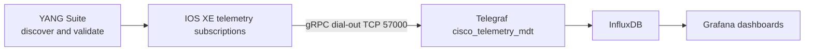

# Lab 12: Add Model-Driven Telemetry

## Lab Introduction

Lab 10 observed the automation application. Lab 12 observes the network device itself. IOS XE streams CPU, memory, and GigabitEthernet1 traffic counters to Telegraf using model-driven telemetry. Telegraf writes the measurements to InfluxDB, and Grafana displays time-series panels. This is a push model: after configuration, the router publishes updates without waiting for repeated polling requests.

## Important Reachability Requirement

Dial-out telemetry requires the IOS XE router to initiate a TCP connection to the workstation on port 57000. Some DevNet VPN environments allow the learner to reach the sandbox but do not provide the reverse route. Test this before investing time in the subscription. If reverse connectivity is unavailable, perform the lab with an instructor-provided collector, a reachable cloud relay, or a locally hosted IOS XE/CML instance. Do not expose an unauthenticated collector directly to the public Internet.

## Learning Objectives

- Compare polling with dial-out streaming telemetry.
- Discover operational YANG paths in YANG Suite.
- Configure periodic subscriptions for CPU, memory, and interface counters.
- Receive Cisco MDT gRPC data with Telegraf.
- Store telemetry in InfluxDB and build Grafana panels.
- Diagnose routing, encoding, sensor-path, and subscription failures.

## Telemetry Flow



## Task 1: Prepare the TIG Receiver

```bash
cd ~/lab-services/tig
cp /path/to/CCNPAUTO/LAB/Lab12/telegraf-mdt.conf .
cp /path/to/CCNPAUTO/LAB/Lab12/telemetry-compose.override.yml \
  compose.override.yaml
docker compose up -d
docker compose logs --tail=100 telegraf
sudo ss -lntp | grep 57000
```

Docker Compose automatically combines `compose.yaml` from Lab 1 with `compose.override.yaml` from this lab. The override publishes the Telegraf receiver on the workstation and replaces the original Telegraf configuration mount with the MDT-enabled file. Allow TCP 57000 only from the lab network where host firewall policy is in use.

Determine the workstation address reachable from the sandbox. It is normally the VPN interface address, not `127.0.0.1`, the Docker bridge address, or the workstation's home-LAN address.

```bash
ip -brief address
ip route get "$IOSXE_HOST"
```

Record the source interface and address selected by the route lookup. Confirm reverse reachability according to the sandbox documentation or with an instructor-supported test.

## Task 2: Discover Sensor Paths with YANG Suite

Start YANG Suite and connect it to the active reservation. Retrieve the advertised modules and examine these common IOS XE operational models:

- `Cisco-IOS-XE-process-cpu-oper`
- `Cisco-IOS-XE-memory-oper`
- `Cisco-IOS-XE-interfaces-oper`
- `Cisco-IOS-XE-mdt-cfg`

Candidate paths often resemble:

```text
/process-cpu-ios-xe-oper:cpu-usage/cpu-utilization
/memory-ios-xe-oper:memory-statistics/memory-statistic
/interfaces-ios-xe-oper:interfaces/interface[name='GigabitEthernet1']/statistics
```

Model revisions and path structures vary by IOS XE release. The router's advertised schemas are authoritative. Use YANG Suite to issue a read for each path before creating a subscription; a path that returns no modeled data will not become useful merely because it is placed in telemetry configuration.

## Task 3: Build the Dial-Out Subscriptions

In the YANG Suite RESTCONF or NETCONF application, use `Cisco-IOS-XE-mdt-cfg` to build three periodic subscriptions:

| Subscription | Sensor | Suggested period |
|---:|---|---:|
| 201 | CPU utilization | 10 seconds |
| 202 | Memory statistics | 30 seconds |
| 203 | GigabitEthernet1 statistics | 10 seconds |

Set the receiver to the workstation's reachable VPN address, TCP port 57000, protocol `grpc-tcp`, and the encoding supported by both the router and Telegraf, commonly key-value GPB. Export the YANG Suite-generated RESTCONF body as:

```text
telemetry/telemetry_payload.json
```

Do not copy a payload from a different IOS XE version without validating it. Review subscription IDs, receiver address, paths, encoding, and periods before sending it.

## Task 4: Add the RESTCONF Playbook

```bash
cd ~/ccnpauto-workspace/network_automation_project
git switch main && git pull --ff-only
git switch -c feature/model-driven-telemetry
LAB12_FILES="/path/to/CCNPAUTO/LAB/Lab12"
mkdir -p telemetry playbooks
cp "$LAB12_FILES/playbooks/send_telemetry_payload.yml" playbooks/
cp telemetry_payload.json telemetry/telemetry_payload.json
```

Set `ALLOW_CONFIG_CHANGES=true`, confirm the reserved endpoint, and run:

```bash
ansible-playbook playbooks/send_telemetry_payload.yml
export ALLOW_CONFIG_CHANGES=false
```

The example disables certificate validation because the reservable sandbox commonly presents a training certificate. Production RESTCONF must validate the device certificate against a trusted CA and match the management hostname.

## Task 5: Verify the Stream

On IOS XE, inspect configured subscriptions and connection state using commands supported by the active release, commonly:

```text
show telemetry ietf subscription all
show telemetry ietf subscription 201 detail
show platform software yang-management process
```

On the workstation:

```bash
cd ~/lab-services/tig
docker compose logs -f telegraf
```

Successful configuration without received measurements usually indicates reverse routing, firewall, receiver address, encoding, or sensor-path trouble. First prove the TCP session; then investigate decoding and data shape.

## Task 6: Build the Grafana Dashboard

Open Grafana and create **IOS XE Model-Driven Telemetry**. Use InfluxDB's Data Explorer first because Cisco path and field names depend on the encoding and Telegraf mapping. Then create panels for:

- CPU utilization over time
- Used and free memory
- GigabitEthernet1 input and output octets per second
- GigabitEthernet1 input and output errors
- Telemetry freshness, showing time since the last received point

Counters are cumulative. Apply a derivative or rate function when displaying traffic per second; graphing the raw octet counter as bandwidth is misleading.

## Task 7: Correlate Device and Pipeline Observability

Create another NetBox loopback and let GitLab run the containerized Ansible pipeline. Compare the pipeline timestamps from Lab 10 with CPU, memory, and interface telemetry. Correlation does not prove causation, but it helps determine whether a deployment coincided with resource pressure or traffic changes.

## Task 8: Commit Safely

```bash
git add playbooks/send_telemetry_payload.yml telemetry/telemetry_payload.json
git commit -m "Add IOS XE model-driven telemetry subscriptions"
git push -u origin feature/model-driven-telemetry
```

Treat receiver addresses and model paths as configuration, not secrets. Credentials and tokens remain in Vault or protected GitLab variables.

## Troubleshooting

| Symptom | First check |
|---|---|
| No TCP connection | Reverse route from sandbox, VPN policy, firewall, receiver address |
| TCP connection but no fields | Encoding compatibility and Telegraf logs |
| Subscription invalid | YANG Suite model revision and exact sensor path |
| Interface data absent | Exact modeled name for `GigabitEthernet1` |
| Duplicate measurements | Duplicate subscription IDs or old subscriptions still active |
| Traffic graph continually rises | Raw counter displayed instead of derivative/rate |
| Gaps in all panels | Router session, Telegraf health, InfluxDB write path |

## Key Takeaways

- Push telemetry reduces repeated polling and provides timely time-series data.
- YANG Suite should validate paths and payloads against the active device release.
- Receiver reachability is a bidirectional network-design requirement.
- CPU, memory, and interface counters require different sampling and visualization choices.
- Application and network telemetry together provide stronger operational context.

## References

- [Cisco IOS XE model-driven telemetry](https://developer.cisco.com/docs/ios-xe/#!model-driven-telemetry)
- [Cisco YANG Suite](https://developer.cisco.com/docs/yangsuite/)
- [Telegraf Cisco MDT input](https://github.com/influxdata/telegraf/tree/master/plugins/inputs/cisco_telemetry_mdt)
- [InfluxDB data visualization](https://docs.influxdata.com/influxdb/v2/visualize-data/)
