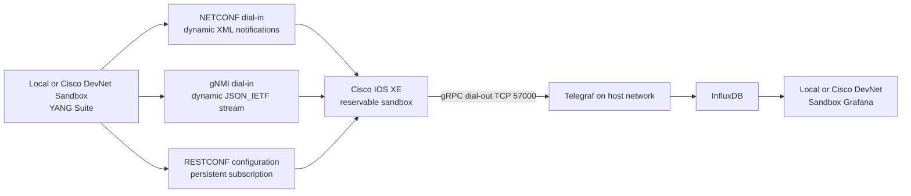

# Lab 12: Model-Driven Telemetry with Dial-In and Dial-Out

## Lab Introduction

Lab 10 observed the automation application. Lab 12 observes the network device itself. Learners first derive operational data paths from the YANG modules advertised by the active IOS XE reservation. They then use those paths in a NETCONF dial-in subscription, a gNMI dial-in subscription, and a configured gRPC dial-out subscription. CPU, memory, and GigabitEthernet1 counters can subsequently be stored in InfluxDB and displayed in Grafana.

Dial-in and dial-out solve different operational problems. In dial-in, the collector initiates a NETCONF or gNMI session to IOS XE, and the dynamic subscription exists only while that session remains open. In dial-out, a configured subscription persists on IOS XE and the router initiates a connection to a receiver. Dial-in is usually easier across the Cisco DevNet VPN because it follows the same workstation-to-sandbox path used by NETCONF and RESTCONF. Dial-out is better for persistent streaming, but it requires a valid reverse path from the sandbox to the collector.

## Learning Objectives

- Discover operational YANG models and exact node paths in YANG Suite.
- Convert a YANG tree path into a RESTCONF resource URI and an MDT XPath filter.
- Create a periodic NETCONF dial-in subscription and interpret XML notifications.
- Build and run a gNMI `Subscribe` request using `STREAM`, `SAMPLE`, and `JSON_IETF`.
- Configure persistent gRPC dial-out subscriptions through RESTCONF.
- Receive Cisco MDT data with Telegraf and store it in InfluxDB.
- Build Grafana panels for CPU, memory, and interface traffic.
- Explain reachability, lifecycle, encoding, and security differences among the methods.

## Telemetry Flow


```mermaid
flowchart LR
    Y["Local or Cisco DevNet Sandbox<br/>YANG Suite"] --> N["NETCONF dial-in<br/>dynamic XML notifications"]
    Y --> G["gNMI dial-in<br/>dynamic JSON_IETF stream"]
    Y --> R["RESTCONF configuration<br/>persistent subscription"]
    N --> XE["Cisco IOS XE<br/>reservable sandbox"]
    G --> XE
    R --> XE
    XE -->|"gRPC dial-out TCP 57000"| T["Telegraf on host network"]
    T --> I["InfluxDB"]
    I --> F["Local or Cisco DevNet<br/>Sandbox Grafana"]
```

## Prerequisites and Service Readiness

Reserve the IOS XE sandbox and connect the workstation to its VPN. Export the current reservation values used by the cumulative project. Then start only the services required by the chosen tasks.

For local YANG Suite:

```bash
cd "$HOME/lab-services/yangsuite/docker"
docker compose up -d
docker compose ps
curl -kI --connect-timeout 5 https://localhost:8443
```

For Cisco DevNet Sandbox YANG Suite:

```bash
curl -I --connect-timeout 5 http://10.10.20.50:8480
```

For local TIG:

```bash
cd "$HOME/lab-services/tig"
docker compose --env-file .env -f compose.yaml up -d
docker compose --env-file .env -f compose.yaml ps
curl --fail --silent http://127.0.0.1:8086/health | jq
```

For Cisco DevNet Sandbox Grafana:

```bash
curl -I --connect-timeout 5 http://10.10.20.50:3000
```

Cisco DevNet Sandbox Grafana is the visualization layer. A dial-out exercise also needs a receiver and a writable time-series data source reachable from the router. If the sandbox does not provide those endpoints, use local TIG when reverse reachability exists, or complete the NETCONF and gNMI dial-in tasks.

## Task 1: Prepare the Local Dial-Out Receiver

Skip this task when completing dial-in only or when the Cisco DevNet Sandbox provides the receiver and data source.

```bash
cd ~/lab-services/tig
cp /path/to/CCNPAUTO/LAB/Lab12/telegraf-mdt.conf .
cp /path/to/CCNPAUTO/LAB/Lab12/telemetry-compose.override.yml \
  compose.override.yaml
docker compose config
docker compose up -d
docker compose logs --tail=100 telegraf
sudo ss -lntp | grep 57000
```

All TIG services use `network_mode: host`. Telegraf therefore binds TCP 57000 directly in the workstation network namespace, and it writes to InfluxDB at `http://127.0.0.1:8086`. Allow TCP 57000 only from the Cisco lab network.

Determine the workstation address that the sandbox would need to reach:

```bash
ip -brief address
ip route get "$IOSXE_HOST"
```

The destination is normally a VPN-interface address, not `127.0.0.1` or a Docker bridge address. A successful workstation-to-router connection does not prove the reverse route. If the router cannot initiate TCP toward the receiver, dial-out will not work; continue with dial-in instead of exposing an unauthenticated receiver to the Internet.

## Task 2: Create the YANG Suite Device Profile and Model Set

Open local YANG Suite at `https://localhost:8443` or Cisco DevNet Sandbox YANG Suite at `http://10.10.20.50:8480`.

1. Select **Setup > Device profiles > New profile**.
2. Name the profile `iosxe-telemetry` and enter the current reservation address and credentials.
3. Enable NETCONF on port `830` and RESTCONF over HTTPS on port `443`.
4. If the reservation supports gNMI, enable it in the profile with the port reported by `show gnxi state detail`. IOS XE 17.3 and later commonly use `gnxi`; an insecure training service commonly uses port `50052`, while a TLS service commonly uses `9339`.
5. Select **Check connectivity**, save the profile, and do not continue with a protocol whose connectivity test fails.
6. Select **Setup > YANG files and repositories**, create `iosxe-telemetry-repository`, and use the **NETCONF** tab to retrieve the device schema list.
7. Download the modules below and all dependencies advertised by the router:

   - `Cisco-IOS-XE-process-cpu-oper`
   - `Cisco-IOS-XE-memory-oper`
   - `Cisco-IOS-XE-interfaces-oper`
   - `Cisco-IOS-XE-mdt-cfg`
   - `ietf-event-notifications`
   - `ietf-yang-push`

8. Select **Setup > YANG module sets** and create `iosxe-telemetry-set` from the downloaded modules.

The device capability list is authoritative. If an expected module or protocol is missing, document the capability difference instead of copying a payload from another IOS XE release.

## Task 3: Derive the XPath and RESTCONF URI

An XPath and a RESTCONF URI describe the same modeled tree differently. The XPath is an absolute data-tree expression used by telemetry filters. The RESTCONF URI is an HTTP resource identifier using the RFC 8040 `/restconf/data/` root and URI-encoded list keys.

### Build and Validate an XPath

1. Select **Explore > YANG**, choose `iosxe-telemetry-set`, and load one operational module.
2. Search for the desired leaf or container. Begin with the smallest useful object that contains all fields required by the dashboard.
3. Trace from the top-level container to the selected object. Prefix the first node with the module prefix displayed by YANG Suite.
4. Separate every child with `/`. For a list, add a predicate only when one list instance is required.
5. For GigabitEthernet1 statistics, the path commonly resembles:

   ```text
   /interfaces-ios-xe-oper:interfaces/interface[name='GigabitEthernet1']/statistics
   ```

6. CPU and memory candidates commonly resemble:

   ```text
   /process-cpu-ios-xe-oper:cpu-usage/cpu-utilization
   /memory-ios-xe-oper:memory-statistics/memory-statistic
   ```

7. Use **Protocols > NETCONF**, build a `<get>` subtree or XPath-filtered request for each candidate, and run it. An XPath is not accepted merely because it parses; it must return the expected modeled data on the active router.

An MDT XPath must identify a single container, list, leaf-list, or leaf. Do not join unrelated paths with a union operator. Create separate subscriptions for CPU, memory, and interface statistics.

### Generate the RESTCONF Resource URI

1. Select **Protocols > RESTCONF**.
2. Choose `iosxe-telemetry-set` and the `iosxe-telemetry` device profile.
3. Load the operational module and use **Search module** to locate the same node used for the XPath.
4. Select the node and choose **Generate APIs**. YANG Suite opens a Swagger view containing the supported methods, headers, and generated resource path.
5. Choose `GET`, set `Accept: application/yang-data+json`, and select **Try it out**.
6. Confirm a `200 OK` response and inspect the returned JSON keys.
7. Record the device path and clearly separate the fixed `/restconf/data` API root from the model resource that follows it. YANG Suite may display a proxy URL through its own server because a browser enforces cross-origin rules; application code must combine the IOS XE hostname, `/restconf/data`, and the generated model resource.
8. For a list instance, RESTCONF represents the key in the URI rather than as an XPath predicate. Let YANG Suite generate the exact form, which commonly resembles:

   ```text
   /restconf/data/Cisco-IOS-XE-interfaces-oper:interfaces/interface=GigabitEthernet1/statistics
   ```

Validate the resource portion directly from the workstation:

```bash
curl -k -u "$IOSXE_USERNAME:$IOSXE_PASSWORD" \
  -H "Accept: application/yang-data+json" \
  "https://${IOSXE_HOST}:443/restconf/data/<generated-resource>"
```

Never copy the YANG Suite proxy prefix into Python or Ansible. The application should call the router's RESTCONF endpoint directly.

## Task 4: Create a NETCONF Dial-In Subscription

NETCONF dial-in creates a dynamic subscription over the same SSH session that receives the notifications. It requires no reverse connection from IOS XE to the workstation.

1. In YANG Suite, select **Protocols > NETCONF**.
2. Choose `iosxe-telemetry-set`, select the `iosxe-telemetry` device, and open a NETCONF session.
3. Load `ietf-event-notifications`, `ietf-yang-push`, and the operational module used by the chosen XPath.
4. Select the `establish-subscription` RPC.
5. Set the stream to `yp:yang-push`, paste one validated XPath into `yp:xpath-filter`, and set `yp:period` to `500`. IOS XE expresses this period in centiseconds, so `500` requests an update every five seconds.
6. Select **Build RPC** and compare the result with this structure:

```xml
<rpc message-id="101"
     xmlns="urn:ietf:params:xml:ns:netconf:base:1.0">
  <establish-subscription
      xmlns="urn:ietf:params:xml:ns:yang:ietf-event-notifications"
      xmlns:yp="urn:ietf:params:xml:ns:yang:ietf-yang-push">
    <stream>yp:yang-push</stream>
    <yp:xpath-filter>/process-cpu-ios-xe-oper:cpu-usage/cpu-utilization</yp:xpath-filter>
    <yp:period>500</yp:period>
  </establish-subscription>
</rpc>
```

7. Select **Run RPC**. A successful reply contains `subscription-result` with an `ok` result and a dynamically assigned `subscription-id`.
8. Keep the NETCONF session open and observe `<notification>` messages. The requested data appears under `push-update/datastore-contents-xml`.
9. Close the session and confirm that the dynamic subscription disappears. A dial-in subscription is session state, not running configuration.

Repeat the process for memory or GigabitEthernet1. Do not create all three at once until one path and period have been proven.

## Task 5: Create a gNMI Dial-In Subscription

gNMI dial-in also creates a dynamic client-initiated stream. It commonly uses JSON_IETF or PROTO encoding and expresses sample intervals in nanoseconds.

On IOS XE 17.3 or later, verify the service:

```text
show gnxi state detail
```

If the service is supported but disabled and the sandbox permits the change, an insecure training-only service commonly uses:

```text
configure terminal
 gnxi
 gnxi server
end
show gnxi state detail
```

Do not enable an insecure gNMI service on a production or untrusted network. Production deployments should use `gnxi secure-server`, an approved trustpoint, certificate validation, and the configured secure port.

In YANG Suite:

1. Select **Protocols > gNMI**, choose `iosxe-telemetry-set`, and select the `iosxe-telemetry` device profile.
2. Load the operational module containing the tested path.
3. Select **Subscribe** as the operation, `STREAM` as the subscription-list mode, `SAMPLE` as the per-path mode, and `JSON_IETF` as the encoding.
4. Select the target nodes in the tree. For an interface list, select the `GigabitEthernet1` key and its `statistics` subtree.
5. Set the sample interval to `5000000000` nanoseconds, which equals five seconds.
6. Select **Build JSON**. A representative structure is:

```json
{
  "subscribe": {
    "subscription": [
      {
        "path": {
          "origin": "legacy",
          "elem": [
            {"name": "interfaces-ios-xe-oper:interfaces"},
            {
              "name": "interface",
              "key": {"name": "GigabitEthernet1"}
            },
            {"name": "statistics"}
          ]
        },
        "mode": "SAMPLE",
        "sample_interval": 5000000000
      }
    ],
    "mode": "STREAM",
    "encoding": "JSON_IETF"
  }
}
```

7. Select **Run RPC** and observe the initial synchronization followed by sampled updates.
8. Compare the returned path and JSON values with the RESTCONF GET from Task 3.

YANG Suite generates the exact prefix, origin, and element representation expected by its gNMI plugin. If the router does not advertise gNMI or the sandbox blocks its port, save the generated request and capability evidence, then continue with NETCONF dial-in.

## Task 6: Build the Persistent gRPC Dial-Out Subscriptions

Use **Protocols > RESTCONF** or **Protocols > NETCONF** with `Cisco-IOS-XE-mdt-cfg` to build three configured subscriptions:

| Subscription | Validated XPath | Suggested period |
|---:|---|---:|
| 201 | CPU utilization | 10 seconds |
| 202 | Memory statistics | 30 seconds |
| 203 | GigabitEthernet1 statistics | 10 seconds |

Set the receiver to the workstation VPN address or the collector address provided by the Cisco DevNet Sandbox, TCP port 57000, protocol `grpc-tcp`, and encoding `encode-kvgpb`. Export the generated RESTCONF JSON body as:

```text
telemetry/telemetry_payload.json
```

Review subscription IDs, receiver address, XPath filters, encoding, and periods before sending it. A syntactically valid payload can still fail because a path does not exist in the active model revision or because the router cannot reach the receiver.

## Task 7: Apply and Verify the Dial-Out Configuration

```bash
cd ~/ccnpauto-workspace/network_automation_project
git switch main && git pull --ff-only
git switch -c feature/model-driven-telemetry
LAB12_FILES="/path/to/CCNPAUTO/LAB/Lab12"
mkdir -p telemetry playbooks
cp "$LAB12_FILES/playbooks/send_telemetry_payload.yml" playbooks/
cp telemetry_payload.json telemetry/telemetry_payload.json
```

Set `ALLOW_CONFIG_CHANGES=true`, confirm the reserved endpoint, and run:

```bash
ansible-playbook playbooks/send_telemetry_payload.yml
export ALLOW_CONFIG_CHANGES=false
```

The example disables certificate validation because the reservable sandbox commonly presents a training certificate. Production RESTCONF must validate the device certificate against a trusted CA and match the management hostname.

Inspect IOS XE:

```text
show telemetry ietf subscription all
show telemetry ietf subscription 201 detail
show platform software yang-management process
```

Inspect the local receiver:

```bash
cd ~/lab-services/tig
docker compose logs -f telegraf
```

Successful configuration without received measurements usually indicates reverse routing, firewall policy, receiver address, encoding, or sensor-path trouble. Prove the TCP session first, then investigate decoding and data shape.

## Task 8: Build and Compare Grafana Views

Open local Grafana at `http://127.0.0.1:3000` or Cisco DevNet Sandbox Grafana at `http://10.10.20.50:3000`. Select the data source receiving the telemetry and create **IOS XE Model-Driven Telemetry** with panels for:

- CPU utilization over time
- Used and free memory
- GigabitEthernet1 input and output octets per second
- GigabitEthernet1 input and output errors
- Telemetry freshness, showing time since the last received point

Counters are cumulative. Apply a derivative or rate function when displaying traffic per second; graphing the raw octet counter as bandwidth is misleading.

Record the behavior of each method:

| Property | NETCONF dial-in | gNMI dial-in | gRPC dial-out |
|---|---|---|---|
| Connection initiator | Collector | Collector | IOS XE |
| Subscription lifetime | NETCONF session | gNMI session | Running configuration |
| Typical encoding | XML | JSON_IETF or PROTO | kvGPB |
| Reverse VPN path required | No | No | Yes |
| Automatic reconnect after router restart | Client responsibility | Client responsibility | Device retries receiver |

## Task 9: Commit and Stop Unneeded Services

```bash
git add playbooks/send_telemetry_payload.yml telemetry/telemetry_payload.json
git commit -m "Add IOS XE model-driven telemetry subscriptions"
git push -u origin feature/model-driven-telemetry
```

Stop services that are not required for the next lab:

```bash
test -d "$HOME/lab-services/tig" && \
  (cd "$HOME/lab-services/tig" && docker compose stop)
test -d "$HOME/lab-services/yangsuite/docker" && \
  (cd "$HOME/lab-services/yangsuite/docker" && docker compose stop)
```

Do not stop NetBox, Vault, or GitLab Runner while a project pipeline is active.

## Troubleshooting

| Symptom | Investigate |
|---|---|
| NETCONF subscription RPC returns `unknown-element` | Device-advertised revisions of `ietf-event-notifications` and `ietf-yang-push` |
| NETCONF reply succeeds but no notification arrives | Empty XPath result, unsupported period, or closed NETCONF session |
| gNMI connectivity fails | `show gnxi state detail`, service port, TLS mode, and device-profile settings |
| gNMI returns no values | Origin, module prefix, list key, encoding, and selected subtree |
| Dial-out subscription remains disconnected | Reverse route, host firewall, receiver IP, TCP 57000, and Telegraf listener |
| Data arrives but Grafana is empty | Telegraf output URL, InfluxDB token, bucket, measurement, and time range |
| Interface traffic appears constantly increasing | Raw counter plotted instead of derivative or rate |

## Key Takeaways

- YANG Suite should derive payloads and paths from the active device schemas, not from memory.
- RESTCONF resource URIs and telemetry XPath filters describe the same tree with different syntax.
- NETCONF and gNMI dial-in avoid reverse-path requirements but depend on a client session.
- Configured gRPC dial-out persists and reconnects, but the router must reach the receiver.
- Host-networked containers use the workstation's VPN and cloud routes and use `127.0.0.1` for local service-to-service communication.
- A dashboard is trustworthy only when its XPath, encoding, counter semantics, timestamps, and collection path are understood.

## References

- [Cisco IOS XE Model-Driven Telemetry](https://www.cisco.com/c/en/us/td/docs/switches/lan/c9000/prog/mdt/model-driven-telemetry.html)
- [Cisco IOS XE gNMI Protocol](https://www.cisco.com/c/en/us/td/docs/ios-xml/ios/prog/configuration/1713/b_1713_programmability_cg/m_1713_prog_gnmi.html)
- [Using NETCONF with YANG Suite](https://developer.cisco.com/docs/yangsuite/using-netconf-with-yang-suite/)
- [RESTCONF in YANG Suite](https://developer.cisco.com/docs/yangsuite/restconf-in-yang-suite/)
- [Using gNMI with YANG Suite](https://developer.cisco.com/docs/yangsuite/using-gnmi-with-yang-suite/)
