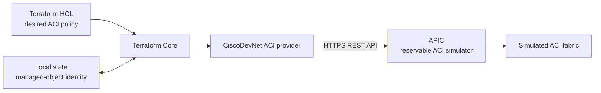
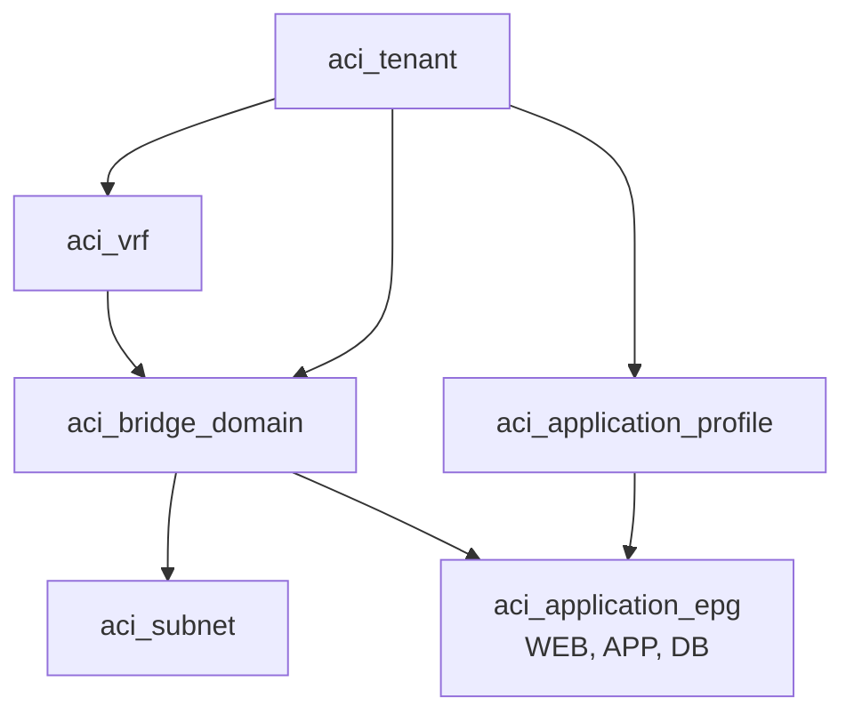

# Optional Lab 12: Provision Cisco ACI with Terraform

## Lab Introduction

An application team needs an isolated three-tier network in Cisco ACI. Creating the tenant, VRF, bridge domain, subnet, application profile, and endpoint groups manually would be repeatable only through an operator's memory. In this optional lab, learners express the same ACI policy as Terraform configuration and deploy it to a Cisco DevNet reservable ACI Simulator sandbox.

Terraform is useful here because the configuration describes the intended end state and records the relationship among ACI managed objects. The provider translates Terraform resources into APIC API operations, while the state file records which remote objects Terraform manages. Consequently, learners must review the plan before applying it and must not treat the state file as a disposable log.

This lab is standalone and does not modify `network_automation_project`.

## Learning Objectives

- Explain how the Terraform provider maps resources to ACI managed objects.
- Authenticate to APIC without placing credentials in HCL files.
- Create an ACI tenant, VRF, bridge domain, subnet, application profile, and EPGs.
- Interpret `terraform plan`, `apply`, `state`, and `destroy`.
- Verify the deployed policy in APIC and through Terraform outputs.
- Explain why Terraform state must be protected and coordinated.

## Architecture


```mermaid
flowchart LR
    HCL["Terraform HCL<br/>desired ACI policy"] --> TF["Terraform Core"]
    State["Local state<br/>managed-object identity"] <--> TF
    TF --> Provider["CiscoDevNet ACI provider"]
    Provider -->|"HTTPS REST API"| APIC["APIC<br/>reservable ACI simulator"]
    APIC --> Fabric["Simulated ACI fabric"]
```

## Prerequisites

- Ubuntu workstation prepared in Lab 1.
- Terraform installed and available in the terminal.
- A GitLab.com account.
- An active **Cisco ACI Simulator reservable sandbox** reservation.
- VPN access and the APIC URL and credentials shown in the reservation.
- Basic understanding of ACI tenants, VRFs, bridge domains, application profiles, and EPGs.

Create a standalone GitLab.com repository named `optional_lab12_aci_terraform`, clone it under `~/ccnpauto-workspace`, and use the VS Code Explorer to copy the files from `CCNPAUTO/LAB/Lab12/` into it, including the hidden `.env.example` file.

## Task 1: Inspect the ACI Object Model

Before running Terraform, sign in to APIC with the reservation credentials. Inspect these locations:

1. Open **Tenants** and confirm that the learner tenant does not already exist.
2. Open an existing tenant and examine **Networking > VRFs**.
3. Examine **Networking > Bridge Domains** and the subnets below a bridge domain.
4. Examine **Application Profiles** and the endpoint groups below a profile.

The hierarchy matters because APIC identifies objects by distinguished names. For example:

```text
uni/tn-ccnpauto-<learner-id>
uni/tn-ccnpauto-<learner-id>/ctx-PROD-VRF
uni/tn-ccnpauto-<learner-id>/BD-PROD-BD
uni/tn-ccnpauto-<learner-id>/ap-THREE-TIER-APP/epg-WEB-EPG
```

Terraform dependencies reproduce this hierarchy. A child resource uses the parent resource ID instead of reconstructing the distinguished name manually.

## Task 2: Protect APIC Credentials

Open `.env.example`, create a new `.env` file in the repository root, copy and paste the example content into it, and insert the values from the active reservation:

```text
ACI_URL=https://<apic-address>
ACI_USERNAME=<sandbox-username>
ACI_PASSWORD=<sandbox-password>
ACI_INSECURE=true
TF_VAR_learner_id=<short-lowercase-identifier>
```

`ACI_INSECURE=true` is acceptable only for this simulator because its certificate might not be trusted by the workstation. A production workflow should validate APIC TLS with the organization's CA. Do not commit `.env`.

Load the variables into the current shell:

```bash
set -a
source .env
set +a
```

The ACI provider reads `ACI_URL`, `ACI_USERNAME`, `ACI_PASSWORD`, and `ACI_INSECURE`. Terraform reads variables prefixed with `TF_VAR_`, so `TF_VAR_learner_id` becomes the `learner_id` input without a password appearing in a `.tf` file.

## Task 3: Review the Terraform Configuration

Open `versions.tf`, `variables.tf`, `main.tf`, and `outputs.tf`. The configuration uses the current `ciscodevnet/aci` provider resource model. The main dependency path is:


```mermaid
flowchart TD
    Tenant["aci_tenant"] --> VRF["aci_vrf"]
    Tenant --> BD["aci_bridge_domain"]
    VRF --> BD
    BD --> Subnet["aci_subnet"]
    Tenant --> AP["aci_application_profile"]
    AP --> EPGs["aci_application_epg<br/>WEB, APP, DB"]
    BD --> EPGs
```

The `for_each` expression creates three EPG resources from one map. Each EPG is still a separately addressable Terraform resource and ACI managed object.

## Task 4: Initialize and Validate

Run formatting and initialization:

```bash
terraform fmt -recursive
terraform init
terraform validate
```

`terraform init` installs the provider version allowed by `versions.tf` and creates `.terraform.lock.hcl`. Commit the lock file because it records provider selection. Do not commit `.terraform/`, `.env`, plan files, or state files.

## Task 5: Review the Execution Plan

Create a saved plan:

```bash
terraform plan -out=aci.plan
terraform show aci.plan
```

Confirm that the plan creates only the learner-prefixed resources. A plan containing deletion or modification of a shared sandbox object must not be applied. Record the number of resources to add, change, and destroy.

The saved plan binds the reviewed proposal to the subsequent apply. If HCL or variables change, create a new plan rather than applying an old one.

## Task 6: Apply and Interpret the Result

Apply the reviewed plan:

```bash
terraform apply aci.plan
terraform output
terraform state list
```

The output should contain the tenant distinguished name, bridge-domain distinguished name, subnet address, application-profile distinguished name, and EPG distinguished names. The state list should include one resource address for each managed object.

Inspect one object:

```bash
terraform state show aci_application_epg.tier["web"]
```

The resource address includes the `for_each` key. The remote `id` is the APIC distinguished name that associates the Terraform address with the ACI object.

## Task 7: Verify in APIC

In APIC:

1. Open **Tenants > ccnpauto-\<learner-id\>**.
2. Under **Networking > VRFs**, verify `PROD-VRF`.
3. Under **Networking > Bridge Domains**, open `PROD-BD`; verify the VRF relationship and `10.50.0.1/24` subnet.
4. Under **Application Profiles**, open `THREE-TIER-APP`.
5. Verify `WEB-EPG`, `APP-EPG`, and `DB-EPG`.
6. Open each EPG and confirm that it is associated with `PROD-BD`.

Terraform reports API completion, while APIC verification confirms that the policy is visible in the controller's operational model.

## Task 8: Make a Controlled Change

Add a fourth entry to the `epgs` map in `variables.tf`:

```hcl
tools = "TOOLS-EPG"
```

Then run:

```bash
terraform fmt -recursive
terraform validate
terraform plan -out=aci-change.plan
```

The plan should add exactly one EPG and leave the existing resources unchanged. Apply the saved plan, verify the new EPG in APIC, and inspect `terraform state list` again.

## Task 9: Detect Out-of-Band Change

In APIC, change the description of `TOOLS-EPG`. Do not delete the object. Run:

```bash
terraform plan
```

Interpret whether the provider detects and proposes correction of the changed attribute. Terraform can only detect drift for attributes represented in the resource schema and configuration. An APIC property that is computed, ignored, or absent from HCL might not produce a plan difference.

## Task 10: Clean Up Safely

Because the ACI simulator is shared for the duration of the reservation, remove only the objects created by this configuration:

```bash
terraform plan -destroy -out=destroy.plan
terraform show destroy.plan
terraform apply destroy.plan
```

Verify that the plan targets only the learner tenant and its children. APIC deletes children with the tenant, but Terraform still evaluates its dependency graph and removes every managed resource from state.

## Troubleshooting

| Symptom | Investigate |
|---|---|
| Provider authentication fails | Reservation credentials, APIC URL, VPN, and loaded `ACI_*` variables |
| Provider installation fails | Internet access, proxy trust, and Terraform Registry availability |
| `403 Forbidden` | Sandbox role permissions or an attempt to modify protected shared policy |
| Plan proposes unexpected objects | `learner_id`, current working directory, state file, and active workspace |
| EPG exists without the expected bridge domain | `relation_to_bridge_domain` and provider-version schema |
| APIC object exists but Terraform wants to create it | Wrong state, different resource address, or unmanaged pre-existing object |

## Key Takeaways

- Terraform resources map to APIC managed objects and preserve their identities in state.
- ACI object hierarchy should be represented with resource references rather than hard-coded distinguished names.
- Provider credentials belong in protected environment variables, not HCL.
- A saved plan should be reviewed before apply, especially on a shared controller.
- Terraform state contains sensitive infrastructure metadata and requires controlled storage.
- `destroy` is a real controller change and must receive the same review as creation.

## References

- [Cisco DevNet ACI Sandboxes](https://developer.cisco.com/docs/aci/sandbox/)
- [CiscoDevNet ACI Provider](https://registry.terraform.io/providers/CiscoDevNet/aci/latest/docs)
- [Cisco DevNet Terraform Learning](https://developer.cisco.com/automation-terraform/)
- [Terraform State](https://developer.hashicorp.com/terraform/language/state)
