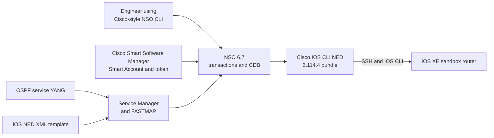

# Optional Lab 13: Manage IOS XE and Build an OSPF Service with Cisco NSO 6.7

## Lab Introduction

A network team may manage many IOS XE routers that use familiar CLI syntax but still require transaction safety, configuration synchronization, reusable services, and clear ownership of generated configuration. Cisco Network Services Orchestrator (NSO) provides these capabilities by placing a transactional configuration database and service layer between the operator and the managed network.

In this optional lab, learners install Cisco NSO 6.7 as a local development instance, register it with Cisco Smart Software Manager (CSSM), install the Cisco IOS CLI Network Element Driver (NED), and onboard an IOS XE reservable sandbox router. After confirming basic device management, learners build a small OSPF service in YANG and map the service intent to IOS configuration through an NSO XML template.

The lab uses the NSO 6.7 free-trial signed bundle. This software is suitable for learning and evaluation; it is not a production deployment.

## Learning Objectives

- Explain the roles of the NSO device manager, CDB, NEDs, service manager, and FASTMAP.
- Select the correct NSO 6.7 installer for an x86-64 or ARM64 Linux workstation.
- Verify and extract the Cisco-signed free-trial bundle before installing NSO.
- Perform an NSO 6.7 local installation and create a development runtime.
- Register NSO to a Cisco Smart Account with a valid CSSM registration token.
- Install the Cisco IOS CLI NED included with the NSO 6.7 bundle and reload NSO packages.
- Onboard and synchronize an IOS XE router.
- Use NSO's Cisco-style CLI to preview and commit device configuration.
- Define an OSPF service interface in YANG and map it to IOS configuration.
- Explain service ownership, transaction preview, and automatic cleanup.

## Architecture



The YANG service model describes what the operator requests, whereas the XML template maps that request to the device model supplied by the IOS NED. The NED then translates modeled configuration into native IOS CLI and parses device output back into NSO's configuration database.

## Prerequisites

- Ubuntu learner workstation prepared in Lab 1.
- Active Cisco IOS XE reservable sandbox, VPN access, and its SSH connection details.
- Cisco.com account with permission to download the NSO 6.7 free-trial bundle.
- Membership in a valid Cisco Smart Account and Virtual Account.
- Permission to create a CSSM registration token for the lab NSO instance.
- Approximately 10 GB of free disk space and at least 8 GB of available memory.

The downloaded bundle should be one of these architecture-specific files:

- `nso-6.7-freetrial.linux.x86_64.signed.bin`
- `nso-6.7-freetrial.linux.arm64.signed.bin`

Do not add installers, extracted packages, license tokens, or device passwords to Git.

## Task 1: Confirm the Workstation Architecture and Dependencies

Check the workstation architecture:

```bash
dpkg --print-architecture
uname -m
```

Use the x86-64 bundle when the results are `amd64` and `x86_64`. Use the ARM64 bundle when the results are `arm64` and `aarch64`. An installer for one architecture cannot run natively on the other architecture.

The NSO 6.7 installation guide requires Java JRE 21 or later for Cisco Smart Licensing and Python 3.10 or later. Install the local-development dependencies:

```bash
sudo apt update
sudo apt install -y \
  ant build-essential gzip libexpat1 libpam0g libxml2-utils \
  openjdk-21-jdk openssh-client openssl python3 python3-pip \
  tar xsltproc zlib1g
```

Confirm the important versions:

```bash
java -version
python3 --version
```

Java must report release 21 or later, and Python must report 3.10 or later. The supplied Cisco guide recommends Python 3.12 for NSO 6.7, although a later distribution-provided Python may also be available on the learner workstation.

## Task 2: Obtain the NSO 6.7 Signed Bundle

Download the NSO 6.7 free-trial Linux bundle from Cisco Software Download. Select the file that matches the architecture confirmed in Task 1. Keep the file in `~/Downloads` and compare its checksum with the value published by Cisco when a checksum is supplied.

The `.signed.bin` file is not the final NSO installer. It is a Cisco-signed, self-extracting archive that verifies the release and then produces the architecture-specific `.installer.bin`, package archives, package signatures, verification utility, and signing certificate.

## Task 3: Verify and Extract the Signed Bundle

Open a terminal in the Downloads directory:

```bash
cd "$HOME/Downloads"
```

Run only the command matching the learner workstation.

For x86-64:

```bash
sh nso-6.7-freetrial.linux.x86_64.signed.bin
```

For ARM64:

```bash
sh nso-6.7-freetrial.linux.arm64.signed.bin
```

The extraction process verifies the Cisco certificate chain and the signatures of the embedded files. Do not continue if the output reports a signature or certificate verification failure. Do not bypass signature verification merely to make the installation continue.

After successful extraction, inspect the resulting files:

```bash
ls -lh nso-6.7.linux.*.installer.bin
ls -lh ncs-6.7-cisco-ios-6.114.4.tar.gz
ls -lh ncs-6.7-cisco-ios-6.114.4.tar.gz.signature
ls -lh README.signature tailf.cer cisco_x509_verify_release.py3
```

The important files for this lab are:

| File | Purpose |
|---|---|
| `nso-6.7.linux.x86_64.installer.bin` or `nso-6.7.linux.arm64.installer.bin` | Architecture-specific NSO 6.7 installer produced by the signed bundle |
| `ncs-6.7-cisco-ios-6.114.4.tar.gz` | Cisco IOS CLI NED package built for NSO 6.7 |
| `ncs-6.7-cisco-ios-6.114.4.tar.gz.signature` | Signature associated with the IOS NED archive |
| `tailf.cer` | Cisco-signed certificate containing the public key used by the verification process |
| `README.signature` | Cisco instructions describing the verification files and manual verification workflow |

Other NED and platform-tool archives may also be present. This lab installs only the Cisco IOS CLI NED because IOS XE is managed through IOS-style CLI.

## Task 4: Install NSO 6.7 Locally

A local install keeps the NSO software under the learner's home directory and is appropriate for evaluation, development, and course exercises. Run only the command matching the workstation architecture.

For x86-64:

```bash
cd "$HOME/Downloads"
sh nso-6.7.linux.x86_64.installer.bin \
  --local-install "$HOME/nso-6.7"
```

For ARM64:

```bash
cd "$HOME/Downloads"
sh nso-6.7.linux.arm64.installer.bin \
  --local-install "$HOME/nso-6.7"
```

Load the NSO environment into the current shell and verify the installed version:

```bash
source "$HOME/nso-6.7/ncsrc"
ncs --version
```

The version must report NSO 6.7. Source `~/nso-6.7/ncsrc` in every new terminal used for this lab. Learners may add the command to their Bash startup file after confirming that it points to the correct installation.

## Task 5: Install the Cisco IOS CLI NED

NSO cannot manage IOS XE CLI until a compatible NED is available. The signed free-trial bundle has already produced `ncs-6.7-cisco-ios-6.114.4.tar.gz`, so do not run the archive as an executable. Extract it into the NED directory of the NSO 6.7 installation:

```bash
mkdir -p "$HOME/nso-6.7/packages/neds"
tar -xzf "$HOME/Downloads/ncs-6.7-cisco-ios-6.114.4.tar.gz" \
  -C "$HOME/nso-6.7/packages/neds"
```

Confirm that the extracted IOS NED contains package metadata:

```bash
find "$HOME/nso-6.7/packages/neds" \
  -maxdepth 2 -name package-meta-data.xml -print
```

The output should include a path beneath a directory whose name begins with `cisco-ios-cli-6.114`. The archive name includes the full package build, while the extracted package directory and NED identity may use a shortened version. Always use the identity advertised by the installed package rather than guessing it.

## Task 6: Create and Start the NSO Runtime

The installation directory contains NSO software, documentation, examples, and base packages. The runtime directory contains the active configuration database, logs, runtime configuration, and package links used by this lab.

Create a fresh runtime after installing the IOS NED so that the package is included in the runtime setup:

```bash
source "$HOME/nso-6.7/ncsrc"
ncs-setup --dest "$HOME/nso-run"
cd "$HOME/nso-run"
ncs
```

Open the Cisco-style NSO CLI:

```bash
ncs_cli -C -u admin
```

Reload packages so NSO compiles and activates the newly installed IOS NED, then verify its state:

```text
packages reload
show packages package oper-status
show packages package package-version
```

Locate the `cisco-ios-cli` package in the output. Its operational state must be `up`. If it is not `up`, leave the CLI and inspect `$HOME/nso-run/logs/ncs.log`. Do not continue with device onboarding until the package loads successfully.

## Task 7: Create and Register a Cisco Smart Licensing Token

NSO 6.7 uses Cisco Smart Licensing. For this lab, learners must register the NSO instance with a valid, unexpired token associated with a Cisco Smart Account and Virtual Account.

In a web browser:

1. Sign in to [Cisco Software Central](https://software.cisco.com/) with the entitled Cisco account.
2. Open **Smart Software Manager**.
3. Select the correct Smart Account and then the Virtual Account assigned for the course or organization.
4. Open the **General** area of the selected inventory and choose **New Token** or **Create Registration Token**. Cisco may adjust the exact UI wording over time.
5. Enter a clear description such as `CCNPAUTO-NSO67-<learner-name>`, choose an appropriate short expiry period, and create the token.
6. Copy the complete token. Treat it as a secret: do not place it in screenshots, Markdown, Git, shell scripts, or shared chat messages.

Return to the NSO Cisco-style CLI and register the instance:

```text
license smart register idtoken <paste-valid-cssm-token-here>
```

NSO should report that registration is in progress. Check the result:

```text
show license status
show license all
```

A successful status includes `Smart Licensing is ENABLED`, `Status: REGISTERED`, the expected Smart Account and Virtual Account, and an authorization state that is in compliance. Registration also causes NSO to request entitlements for its instance and the device/NED usage it orchestrates.

If registration fails, check all of the following before creating a replacement token:

- The token is complete, unexpired, and belongs to the intended Virtual Account.
- The learner account is authorized to use that Smart Account.
- Java 21 or later is installed because the NSO Smart Licensing agent depends on Java.
- The workstation can reach Cisco Smart Software Manager through its normal Internet or approved proxy path.
- The NSO daemon log does not report a Smart Agent or certificate error.

Do not rely on the evaluation countdown as a substitute for the required registration exercise. The objective is to complete and verify Smart Account registration with a valid token.

## Task 8: Create an Authentication Group

In the NSO CLI, create an authentication group using the IOS XE sandbox credentials:

```text
configure
devices authgroups group IOSXE-AUTH default-map remote-name <sandbox-username>
devices authgroups group IOSXE-AUTH default-map remote-password <sandbox-password>
commit
```

The development runtime stores the credential in NSO CDB. Production environments require protected encryption keys, restricted access, backups, and an approved credential-management design.

## Task 9: Onboard the IOS XE Router

Create the managed device:

```text
configure
devices device iosxe-sandbox address <sandbox-host>
devices device iosxe-sandbox port <sandbox-ssh-port>
devices device iosxe-sandbox authgroup IOSXE-AUTH
devices device iosxe-sandbox device-type cli protocol ssh
devices device iosxe-sandbox device-type cli ned-id ?
```

At `ned-id ?`, use CLI completion to select the installed `cisco-ios-cli` NED identity. The identity must come from the package loaded in Task 6; do not copy a NED identity from a different NSO installation.

Complete the device definition and leave configuration mode:

```text
devices device iosxe-sandbox state admin-state unlocked
commit
end
```

Fetch the SSH host key before the first managed connection, then connect and synchronize:

```text
devices device iosxe-sandbox ssh fetch-host-keys
devices device iosxe-sandbox connect
devices device iosxe-sandbox sync-from
```

Interpret the operations:

- `ssh fetch-host-keys` records the device SSH host key used by NSO.
- `connect` verifies that the IOS NED can establish and identify the CLI session.
- `sync-from` reads the device configuration and stores its modeled representation in CDB.
- `check-sync` later compares the live device with the CDB copy.

Verify the managed state:

```text
show devices device iosxe-sandbox platform
devices device iosxe-sandbox check-sync
```

## Task 10: Manage the Router Through Cisco-Style CLI

Create a loopback through NSO:

```text
configure
devices device iosxe-sandbox config
interface Loopback 160
description NSO-MANAGED
ip address 10.160.0.1 255.255.255.255
exit
commit dry-run outformat native
```

The dry run shows the native IOS commands that the NED intends to send. Review the proposed change before applying it:

```text
commit
end
devices device iosxe-sandbox check-sync
```

Verify the result on IOS XE with `show ip interface brief | include Loopback160`. This transaction manages device configuration through NSO, but it is not yet a reusable service abstraction.

## Task 11: Generate the OSPF Service Skeleton

Exit the NSO CLI and create a template-based service package:

```bash
cd "$HOME/nso-run/packages"
ncs-make-package --no-test --service-skeleton template ospf-service
```

Using VS Code, replace the generated YANG module and XML template with the course files supplied under `CCNPAUTO/LAB/Lab13 - Manage IOS XE and Build an OSPF Service with Cisco NSO/packages/ospf-service/`. The model augments `/ncs:services` with an `ospf-service` list. A service instance selects a device, OSPF process ID, router ID, area, and one or more network statements.

## Task 12: Derive and Confirm the NED XML

The supplied template uses the common Cisco IOS CLI NED namespace `urn:ios`. Before building the package, derive the actual structure from the installed NED:

```text
configure
devices device iosxe-sandbox config
router ospf 100
router-id 10.160.0.1
network 10.160.0.1 0.0.0.0 area 0
top
show full-configuration devices device iosxe-sandbox config router ospf | display xml
abort
```

Compare the generated XML with `ospf-service-template.xml`. Retain the supplied namespace and elements only when they match the XML exposed by the installed IOS NED. NSO service templates target the NED data model, so a template copied from a different NED revision may fail with an unknown-element error.

## Task 13: Build and Reload the OSPF Service Package

Build the YANG module:

```bash
cd "$HOME/nso-run/packages/ospf-service/src"
make
```

Return to the Cisco-style CLI and reload all packages:

```bash
ncs_cli -C -u admin
```

```text
packages reload
show packages package ospf-service oper-status
```

The service package must report `up`. If it does not, inspect `$HOME/nso-run/logs/ncs.log` and correct the reported YANG, servicepoint, or XML template error.

## Task 14: Create and Verify an OSPF Service Instance

Create the service in configuration mode:

```text
configure
ospf-service CORE-OSPF
device iosxe-sandbox
process-id 100
router-id 10.160.0.1
area 0
network 10.160.0.1 address 10.160.0.1 wildcard 0.0.0.0
commit dry-run outformat native
```

The dry run should resemble:

```text
router ospf 100
 router-id 10.160.0.1
 network 10.160.0.1 0.0.0.0 area 0
```

After reviewing the native proposal, commit and verify:

```text
commit
end
show running-config ospf-service CORE-OSPF
devices device iosxe-sandbox check-sync
```

On IOS XE, verify the running OSPF configuration, `show ip protocols`, and `show ip ospf interface brief`.

## Task 15: Observe Service Ownership and Cleanup

Preview deletion of the service:

```text
configure
no ospf-service CORE-OSPF
commit dry-run outformat native
```

FASTMAP tracks configuration created by the service. The dry run should remove service-owned configuration without deleting unrelated OSPF configuration. Commit only after verifying the scope:

```text
commit
end
devices device iosxe-sandbox check-sync
```

Stop the local runtime when the lab is complete:

```bash
cd "$HOME/nso-run"
ncs --stop
```

## Troubleshooting

| Symptom | Investigation and correction |
|---|---|
| Signed bundle reports a verification failure | Stop. Confirm the correct Cisco download, system time, certificate path, and unmodified file; download the bundle again if necessary. |
| `ncs` is not found | Source `$HOME/nso-6.7/ncsrc` in the current terminal. |
| Smart Licensing does not start | Confirm Java 21 or later and inspect `$HOME/nso-run/logs/ncs.log`. |
| Token registration fails | Confirm token completeness, expiry, Smart/Virtual Account authorization, and CSSM connectivity. |
| IOS NED package is not `up` | Confirm the archive is for NSO 6.7, inspect package metadata and `ncs.log`, then run `packages reload` again after correcting the problem. |
| Device connection fails before authentication | Run `devices device iosxe-sandbox ssh fetch-host-keys` and confirm the sandbox host and SSH port. |
| Device authentication fails | Verify the NSO authgroup remote username and password against the active reservation. |
| `sync-from` fails | Inspect the NED parser error for unsupported or unexpected running configuration. |
| Template reports `unknown element` | Generate XML from the installed NED and correct the namespace or element hierarchy. |
| Service exists but creates no device change | Confirm the YANG and XML template use the same servicepoint. |
| Device is out of sync | Investigate out-of-band changes and compare configuration before choosing `sync-from` or `sync-to`. |

## Key Takeaways

- NSO 6.7 is distributed as a Cisco-signed bundle that must be verified and extracted before the resulting installer is run.
- x86-64 and ARM64 learners must use the installer that matches their workstation architecture.
- NSO 6.7 Smart Licensing depends on Java and must be registered to an authorized Smart Account with a valid CSSM token for this exercise.
- The Cisco IOS CLI NED is the driver that translates between NSO's modeled configuration and IOS XE CLI.
- Installing a NED is not complete until NSO reloads the package and reports its operational state as `up`.
- `sync-from` establishes the modeled CDB state; it does not push configuration to the device.
- `commit dry-run outformat native` provides a safety boundary by showing the exact proposed IOS commands before deployment.
- A YANG service model expresses reusable intent, while the NED-specific XML template maps that intent to device configuration.
- FASTMAP records service ownership and supports controlled updates and cleanup.

## References

- *Cisco Network Services Orchestrator 6.7 Installation Guide - Free Trial*, course-supplied PDF.
- [Cisco NSO Documentation](https://developer.cisco.com/docs/nso/)
- [Cisco Software Download](https://software.cisco.com/download/home)
- [Cisco Smart Software Manager](https://software.cisco.com/)
- [Cisco NSO Implementing Services](https://developer.cisco.com/docs/nso-guides/implementing-services/)
- [Cisco NSO Templates](https://developer.cisco.com/docs/nso-guides/templates/)
