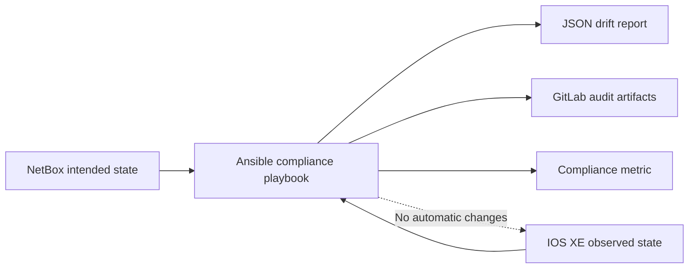

# Lab 13: Detect Configuration Drift and Report Compliance

## Lab Introduction

The project can now configure and observe IOS XE, but it still assumes that state remains correct between deployments. Manual commands, another automation system, or a sandbox reset can cause configuration drift. Lab 13 adds a strictly read-only pipeline that compares NetBox intent with observed loopback and OSPF state, produces structured evidence, and fails visibly without correcting the router.

## Learning Objectives

- Distinguish drift detection from automatic remediation.
- Parse observed IOS XE configuration into normalized records.
- Detect missing, mismatched, and unmanaged resources.
- Produce machine-readable compliance evidence.
- Run scheduled pipelines without invoking deployment jobs.
- Publish compliance status while protecting credentials.

## Compliance Model



The lab treats every tagged NetBox loopback as managed. A compliant router contains the intended interface, `/32` address, administrative state, and OSPF area 0 network statement. A loopback present on IOS XE but absent from the managed NetBox set is reported as unmanaged rather than deleted.

## Task 1: Add the Drift Components

```bash
cd ~/ccnpauto-workspace/network_automation_project
git switch main && git pull --ff-only
git switch -c feature/drift-compliance
LAB13_FILES="/path/to/CCNPAUTO/LAB/Lab13"
mkdir -p filter_plugins tests playbooks
cp "$LAB13_FILES/filter_plugins/drift_filters.py" filter_plugins/
cp "$LAB13_FILES/tests/test_drift_filters.py" tests/
cp "$LAB13_FILES/playbooks/drift.yml" playbooks/
```

The filter converts CLI configuration to dictionaries before comparison. This is more reliable than searching for unrelated substrings, but it remains platform-specific. Structured YANG operational data would be preferable when the required state is consistently exposed by the device model.

## Task 2: Test the Comparison Logic

```bash
source ~/.venvs/ccnpauto/bin/activate
pytest -q tests/test_drift_filters.py
ansible-playbook --syntax-check playbooks/drift.yml
```

The tests cover a compliant router and a router with both missing and unmanaged state. Add a third test for an incorrect address before continuing.

## Task 3: Run a Read-Only Audit

Set the same NetBox, Vault, and IOS XE environment variables used by Lab 8. Keep `ALLOW_CONFIG_CHANGES=false` and run:

```bash
mkdir -p artifacts
ansible-playbook playbooks/drift.yml
jq . artifacts/drift-report.json
```

The playbook retrieves credentials because read-only device access still requires authentication. It does not invoke `ios_config`, `netconf_config`, RESTCONF PATCH, or any other write operation.

## Task 4: Create Controlled Drift

On the reserved sandbox, change the description or address of one managed loopback, or create an unmanaged `Loopback999`. Run the audit again. The play should fail and identify the exact category while leaving the router untouched. Restore state with the normal NetBox-triggered pipeline, then confirm the next drift audit passes.

## Task 5: Add Scheduled Compliance

Add an `assess` stage and the supplied `drift-compliance` job to `.gitlab-ci.yml`. Tag the successful Lab 11 runtime image as `network-automation-runtime:stable` in the build job:

```bash
docker tag "$AUTOMATION_IMAGE" network-automation-runtime:stable
```

Scheduled pipelines must not run normal build, deploy, or test jobs. Add this rule to change-capable jobs:

```yaml
rules:
  - if: '$CI_PIPELINE_SOURCE == "schedule"'
    when: never
  - if: '$CI_COMMIT_BRANCH == $CI_DEFAULT_BRANCH'
```

In GitLab.com, open **Build > Pipeline schedules**, create `Nightly IOS XE compliance`, select `main`, and use an instructor-approved schedule. Protected variables and the protected Runner must be available to scheduled pipelines.

## Task 6: Retain and Observe Results

Retain `drift-report.json`, JSONL audit events, and the console log for 30 days. Extend the Lab 10 metrics publisher with a compliance measurement if desired:

```text
network_compliance,device=iosxe-sandbox compliant=1i,missing=0i,mismatched=0i,unmanaged=0i
```

Grafana can then display current compliance, failure count, and time since the last successful audit.

## Task 7: Commit and Merge

```bash
git add filter_plugins tests playbooks .gitlab-ci.yml
git commit -m "Add scheduled configuration drift reporting"
git push -u origin feature/drift-compliance
```

Review the merge request and prove that scheduled execution cannot reach a deployment job.

## Key Takeaways

- Drift detection should be read-only by default.
- NetBox intent and IOS XE observations must be normalized before comparison.
- Missing, mismatched, and unmanaged resources require different operator decisions.
- Compliance failure is evidence, not authorization to delete or overwrite configuration.
- Scheduled pipelines need explicit rules that exclude change-capable jobs.

Lab 14 adds change planning, approval, backup evidence, testing, and compensating rollback.

## References

- [Ansible Cisco IOS command module](https://docs.ansible.com/ansible/latest/collections/cisco/ios/ios_command_module.html)
- [GitLab pipeline schedules](https://docs.gitlab.com/ci/pipelines/schedules/)
- [GitLab job artifacts](https://docs.gitlab.com/ci/jobs/job_artifacts/)
