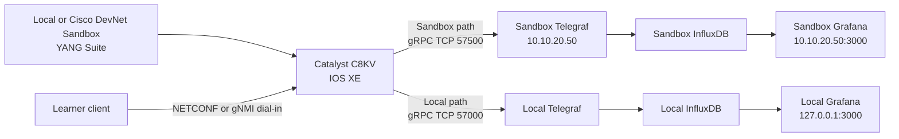

# Lab 13: Model-Driven Telemetry with Dial-In and Dial-Out

## Lab Introduction

Lab 10 observed the automation application, while Lab 12 checked whether configuration still matched the intended state. Lab 13 now observes the network device continuously. Learners first derive operational data paths from the YANG modules advertised by Cisco Catalyst C8KV running IOS XE. They then use those paths in a NETCONF dial-in subscription, a gNMI dial-in subscription, and a configured gRPC dial-out subscription. CPU, memory, and GigabitEthernet1 counters can subsequently be stored in InfluxDB and displayed in Grafana.

Dial-in and dial-out solve different operational problems. In dial-in, the collector initiates a NETCONF or gNMI session to IOS XE, and the dynamic subscription exists only while that session remains open. In dial-out, a configured subscription persists on IOS XE and the router initiates a connection to a receiver. The Cisco Catalyst C8KV sandbox includes an integrated TIG stack, so its router can stream to Telegraf at `10.10.20.50:57500`, while learners operating a locally hosted C8KV can stream to the local TIG stack prepared in Lab 1.

The telemetry services have their own Docker and application logs. Keep the cumulative project's Python logging files and controls, but do not confuse them with Telegraf ingestion logs, InfluxDB service logs, or Grafana queries. During troubleshooting, first identify whether the failure is on the router, transport, collector, storage, or visualization layer.

## Learning Objectives

- Discover operational YANG models and exact node paths in YANG Suite.
- Convert a YANG tree path into a RESTCONF resource URI and an MDT XPath filter.
- Create a periodic NETCONF dial-in subscription and interpret XML notifications.
- Build and run a gNMI `Subscribe` request using `STREAM`, `SAMPLE`, and `JSON_IETF`.
- Configure persistent gRPC dial-out subscriptions through RESTCONF.
- Receive Cisco MDT data with Telegraf and store it in InfluxDB.
- Build Grafana panels for CPU, memory, and interface traffic.
- Explain reachability, lifecycle, encoding, and security differences among the methods.

## Telemetry Flow


```mermaid
flowchart LR
    Y["Local or Cisco DevNet Sandbox<br/>YANG Suite"] --> XE["Catalyst C8KV<br/>IOS XE"]
    C["Learner client"] -->|"NETCONF or gNMI dial-in"| XE
    XE -->|"Sandbox path<br/>gRPC TCP 57500"| ST["Sandbox Telegraf<br/>10.10.20.50"]
    ST --> SI["Sandbox InfluxDB"]
    SI --> SG["Sandbox Grafana<br/>10.10.20.50:3000"]
    XE -->|"Local path<br/>gRPC TCP 57000"| LT["Local Telegraf"]
    LT --> LI["Local InfluxDB"]
    LI --> LG["Local Grafana<br/>127.0.0.1:3000"]
```

## Choose the Lab Path

Both paths teach the same telemetry workflow. Select one path and use its receiver settings consistently throughout the lab.

| Path | IOS XE router | Telegraf receiver | Grafana | Learner-managed services |
|---|---|---|---|---|
| Cisco DevNet Sandbox | Catalyst C8KV in the active reservation | `10.10.20.50:57500` over TCP | `http://10.10.20.50:3000` | None; TIG integration is already prepared |
| Locally hosted lab | Local Catalyst C8KV | A C8KV-reachable workstation address on TCP `57000` | `http://127.0.0.1:3000` | Local TIG from Lab 1 |

## Prerequisites and Service Readiness

For the sandbox path, reserve the Cisco Catalyst C8KV IOS XE sandbox and connect the workstation to its VPN. For the local path, start the learner's locally hosted Catalyst C8KV and confirm management reachability. Export the current router values used by the cumulative project, and then prepare only the services required by the selected path.

For local YANG Suite:

```bash
cd "$HOME/lab-services/yangsuite/docker"
docker compose up -d
docker compose ps
```

Open Cisco DevNet Sandbox YANG Suite at `http://10.10.20.50:8480`. For the sandbox TIG path, open Grafana at `http://10.10.20.50:3000`.

The sandbox already integrates Telegraf, InfluxDB, and Grafana. Learners configure the sandbox C8KV to send telemetry to `10.10.20.50:57500` and use Grafana at `http://10.10.20.50:3000`; they do not need to install, reconfigure, or restart those shared services.

For a locally hosted C8KV, start and verify the local TIG stack:

```bash
cd "$HOME/lab-services/tig"
docker compose --env-file .env -f compose.yaml up -d
docker compose --env-file .env -f compose.yaml ps
```

## Task 1: Select and Verify the Dial-Out Receiver

### Path A: Cisco DevNet Sandbox C8KV and TIG

Use the prepared endpoints:

| Component | Setting |
|---|---|
| Telegraf receiver address | `10.10.20.50` |
| Telegraf receiver port | TCP `57500` |
| Grafana URL | `http://10.10.20.50:3000` |

Open Grafana in a browser. The IOS XE subscription state and fresh Grafana samples later prove that the router is actually streaming to the prepared Telegraf listener.

### Path B: Local C8KV and Local TIG

Using the VS Code Explorer, copy and paste `telegraf-mdt.conf` and `telemetry-compose.override.yml` from `CCNPAUTO/LAB/Lab13/` into `~/lab-services/tig/`. Rename the pasted override to `compose.override.yaml`, then start the stack:

```bash
cd ~/lab-services/tig
docker compose config
docker compose up -d
docker compose logs --tail=100 telegraf
sudo ss -lntp | grep 57000
```

All local TIG services use `network_mode: host`. Telegraf therefore binds TCP `57000` directly in the workstation network namespace, and it writes to InfluxDB at `http://127.0.0.1:8086`. Allow TCP `57000` only from the local C8KV management network.

Enter a workstation address that the local C8KV can reach; do not use `127.0.0.1` or a Docker bridge address. Confirm the address from the workstation network settings and the local C8KV management design. Do not expose an unauthenticated telemetry receiver to the Internet.

## Task 2: Create the YANG Suite Device Profile and Model Set

Open local YANG Suite at `https://localhost:8443` or Cisco DevNet Sandbox YANG Suite at `http://10.10.20.50:8480`.

1. Select **Setup > Device profiles > New profile**.
2. Name the profile `iosxe-telemetry` and enter the current reservation address and credentials.
3. Enable NETCONF on port `830` and RESTCONF over HTTPS on port `443`.
4. If the reservation supports gNMI, enable it in the profile with the port reported by `show gnxi state detail`. IOS XE 17.3 and later commonly use `gnxi`; an insecure training service commonly uses port `50052`, while a TLS service commonly uses `9339`.
5. Select **Check connectivity**, save the profile, and do not continue with a protocol whose connectivity test fails.
6. Select **Setup > YANG files and repositories**, create `iosxe-telemetry-repository`, and use the **NETCONF** tab to retrieve the device schema list.
7. Download the modules below and all dependencies advertised by the router:

   - `Cisco-IOS-XE-process-cpu-oper`
   - `Cisco-IOS-XE-memory-oper`
   - `Cisco-IOS-XE-interfaces-oper`
   - `Cisco-IOS-XE-mdt-cfg`
   - `ietf-event-notifications`
   - `ietf-yang-push`

8. Select **Setup > YANG module sets** and create `iosxe-telemetry-set` from the downloaded modules.

The device capability list is authoritative. If an expected module or protocol is missing, document the capability difference instead of copying a payload from another IOS XE release.

## Task 3: Derive the XPath and RESTCONF URI

An XPath and a RESTCONF URI describe the same modeled tree differently. The XPath is an absolute data-tree expression used by telemetry filters. The RESTCONF URI is an HTTP resource identifier using the RFC 8040 `/restconf/data/` root and URI-encoded list keys.

### Build and Validate an XPath

1. Select **Explore > YANG**, choose `iosxe-telemetry-set`, and load one operational module.
2. Search for the desired leaf or container. Begin with the smallest useful object that contains all fields required by the dashboard.
3. Trace from the top-level container to the selected object. Prefix the first node with the module prefix displayed by YANG Suite.
4. Separate every child with `/`. For a list, add a predicate only when one list instance is required.
5. For GigabitEthernet1 statistics, the path commonly resembles:

   ```text
   /interfaces-ios-xe-oper:interfaces/interface[name='GigabitEthernet1']/statistics
   ```

6. CPU and memory candidates commonly resemble:

   ```text
   /process-cpu-ios-xe-oper:cpu-usage/cpu-utilization
   /memory-ios-xe-oper:memory-statistics/memory-statistic
   ```

7. Use **Protocols > NETCONF**, build a `<get>` subtree or XPath-filtered request for each candidate, and run it. An XPath is not accepted merely because it parses; it must return the expected modeled data on the active router.

An MDT XPath must identify a single container, list, leaf-list, or leaf. Do not join unrelated paths with a union operator. Create separate subscriptions for CPU, memory, and interface statistics.

### Generate the RESTCONF Resource URI

1. Select **Protocols > RESTCONF**.
2. Choose `iosxe-telemetry-set` and the `iosxe-telemetry` device profile.
3. Load the operational module and use **Search module** to locate the same node used for the XPath.
4. Select the node and choose **Generate APIs**. YANG Suite opens a Swagger view containing the supported methods, headers, and generated resource path.
5. Choose `GET`, set `Accept: application/yang-data+json`, and select **Try it out**.
6. Confirm a `200 OK` response and inspect the returned JSON keys.
7. Record the device path and clearly separate the fixed `/restconf/data` API root from the model resource that follows it. YANG Suite may display a proxy URL through its own server because a browser enforces cross-origin rules; application code must combine the IOS XE hostname, `/restconf/data`, and the generated model resource.
8. For a list instance, RESTCONF represents the key in the URI rather than as an XPath predicate. Let YANG Suite generate the exact form, which commonly resembles:

   ```text
   /restconf/data/Cisco-IOS-XE-interfaces-oper:interfaces/interface=GigabitEthernet1/statistics
   ```

Validate the resource with YANG Suite's **Try it out** function or the Postman workflow from Lab 2. Never copy the YANG Suite proxy prefix into Python or Ansible. An application calls the router's RESTCONF endpoint directly.

## Task 4: Create a NETCONF Dial-In Subscription

NETCONF dial-in creates a dynamic subscription over the same SSH session that receives the notifications. It requires no reverse connection from IOS XE to the workstation.

1. In YANG Suite, select **Protocols > NETCONF**.
2. Choose `iosxe-telemetry-set`, select the `iosxe-telemetry` device, and open a NETCONF session.
3. Load `ietf-event-notifications`, `ietf-yang-push`, and the operational module used by the chosen XPath.
4. Select the `establish-subscription` RPC.
5. Set the stream to `yp:yang-push`, paste one validated XPath into `yp:xpath-filter`, and set `yp:period` to `500`. IOS XE expresses this period in centiseconds, so `500` requests an update every five seconds.
6. Select **Build RPC** and compare the result with this structure:

```xml
<rpc message-id="101"
     xmlns="urn:ietf:params:xml:ns:netconf:base:1.0">
  <establish-subscription
      xmlns="urn:ietf:params:xml:ns:yang:ietf-event-notifications"
      xmlns:yp="urn:ietf:params:xml:ns:yang:ietf-yang-push">
    <stream>yp:yang-push</stream>
    <yp:xpath-filter>/process-cpu-ios-xe-oper:cpu-usage/cpu-utilization</yp:xpath-filter>
    <yp:period>500</yp:period>
  </establish-subscription>
</rpc>
```

7. Select **Run RPC**. A successful reply contains `subscription-result` with an `ok` result and a dynamically assigned `subscription-id`.
8. Keep the NETCONF session open and observe `<notification>` messages. The requested data appears under `push-update/datastore-contents-xml`.
9. Close the session and confirm that the dynamic subscription disappears. A dial-in subscription is session state, not running configuration.

Repeat the process for memory or GigabitEthernet1. Do not create all three at once until one path and period have been proven.

## Task 5: Create a gNMI Dial-In Subscription

gNMI dial-in also creates a dynamic client-initiated stream. It commonly uses JSON_IETF or PROTO encoding and expresses sample intervals in nanoseconds.

On IOS XE 17.3 or later, verify the service:

```text
show gnxi state detail
```

If the service is supported but disabled and the sandbox permits the change, an insecure training-only service commonly uses:

```text
configure terminal
 gnxi
 gnxi server
end
show gnxi state detail
```

Do not enable an insecure gNMI service on a production or untrusted network. Production deployments should use `gnxi secure-server`, an approved trustpoint, certificate validation, and the configured secure port.

In YANG Suite:

1. Select **Protocols > gNMI**, choose `iosxe-telemetry-set`, and select the `iosxe-telemetry` device profile.
2. Load the operational module containing the tested path.
3. Select **Subscribe** as the operation, `STREAM` as the subscription-list mode, `SAMPLE` as the per-path mode, and `JSON_IETF` as the encoding.
4. Select the target nodes in the tree. For an interface list, select the `GigabitEthernet1` key and its `statistics` subtree.
5. Set the sample interval to `5000000000` nanoseconds, which equals five seconds.
6. Select **Build JSON**. A representative structure is:

```json
{
  "subscribe": {
    "subscription": [
      {
        "path": {
          "origin": "legacy",
          "elem": [
            {"name": "interfaces-ios-xe-oper:interfaces"},
            {
              "name": "interface",
              "key": {"name": "GigabitEthernet1"}
            },
            {"name": "statistics"}
          ]
        },
        "mode": "SAMPLE",
        "sample_interval": 5000000000
      }
    ],
    "mode": "STREAM",
    "encoding": "JSON_IETF"
  }
}
```

7. Select **Run RPC** and observe the initial synchronization followed by sampled updates.
8. Compare the returned path and JSON values with the RESTCONF GET from Task 3.

YANG Suite generates the exact prefix, origin, and element representation expected by its gNMI plugin. If the router does not advertise gNMI or the sandbox blocks its port, save the generated request and capability evidence, then continue with NETCONF dial-in.

## Task 6: Prepare the Persistent gRPC Dial-Out Subscriptions

Use YANG Suite to validate three XPath filters before entering them manually on IOS XE:

| Subscription | Validated XPath | Suggested period |
|---:|---|---:|
| 201 | CPU utilization | 10 seconds |
| 202 | Memory statistics | 30 seconds |
| 203 | GigabitEthernet1 statistics | 10 seconds |

Use the receiver values for the path selected in Task 1:

| Path | Receiver address | TCP port | Protocol | Encoding |
|---|---|---:|---|---|
| Cisco DevNet Sandbox C8KV | `10.10.20.50` | `57500` | `grpc-tcp` | `encode-kvgpb` |
| Local C8KV | Workstation address reachable from the C8KV | `57000` | `grpc-tcp` | `encode-kvgpb` |

Record the three validated paths in the lab worksheet. A syntactically valid XPath can still return no data when it does not exist in the active model revision.

## Task 7: Configure gRPC Dial-Out Manually

Open an SSH or console session to the reserved C8KV. Begin with CPU subscription `201`, replacing `<CPU_XPATH>` with the path validated in Task 3:

```text
configure terminal
telemetry ietf subscription 201
 encoding encode-kvgpb
 filter xpath <CPU_XPATH>
 stream yang-push
 update-policy periodic 1000
 receiver ip address 10.10.20.50 57500 protocol grpc-tcp
end
```

The period is expressed in centiseconds on IOS XE, so `1000` represents 10 seconds. For the local path, replace the receiver address with the workstation address reachable by the local C8KV and replace port `57500` with `57000`.

Create memory subscription `202` with its validated XPath and a 30-second period:

```text
configure terminal
telemetry ietf subscription 202
 encoding encode-kvgpb
 filter xpath <MEMORY_XPATH>
 stream yang-push
 update-policy periodic 3000
 receiver ip address 10.10.20.50 57500 protocol grpc-tcp
end
```

Create interface subscription `203` with the validated GigabitEthernet1 statistics XPath and a 10-second period:

```text
configure terminal
telemetry ietf subscription 203
 encoding encode-kvgpb
 filter xpath <GIGABITETHERNET1_XPATH>
 stream yang-push
 update-policy periodic 1000
 receiver ip address 10.10.20.50 57500 protocol grpc-tcp
end
```

Review the running configuration and correct any rejected command before continuing:

```text
show telemetry ietf subscription all
show telemetry ietf subscription 201 detail
show telemetry ietf subscription 202 detail
show telemetry ietf subscription 203 detail
show running-config | section telemetry
show platform software yang-management process
```

For the local path, inspect the Telegraf receiver:

```bash
cd ~/lab-services/tig
docker compose logs -f telegraf
```

For the sandbox path, learners do not need shell access to the shared TIG host. Instead, confirm that the subscription is connected on IOS XE and that samples with current timestamps appear in Grafana at `http://10.10.20.50:3000`.

Successful configuration without received measurements usually indicates routing, firewall policy, an incorrect receiver port, encoding, or sensor-path trouble. Prove the subscription and TCP session first, then investigate decoding and data shape.

## Task 8: Create the Grafana Dashboard

Open `http://10.10.20.50:3000` for the Cisco DevNet Sandbox TIG stack or `http://127.0.0.1:3000` for local TIG. Then:

1. Sign in with the credentials supplied for the selected environment.
2. Select **Dashboards > New > New dashboard** and choose **Add visualization**.
3. Select the integrated InfluxDB data source.
4. Use the query builder or measurement browser to locate the series generated by subscription `201`. Filter by the router source and CPU field, select a time-series visualization, and title it **CPU Utilization**.
5. Add a second visualization from subscription `202`. Select the used and free memory fields, use a time-series or gauge visualization, set the unit to bytes where appropriate, and title it **Memory Utilization**.
6. Add a third visualization from subscription `203`. Filter the interface tag or key to `GigabitEthernet1`, select input and output octet counters, and apply a non-negative derivative or rate transformation so the panel displays change per second rather than an ever-increasing counter. Title it **GigabitEthernet1 Traffic Rate**.
7. Add an **Interface Errors** panel using input-error and output-error fields when they are present.
8. Add a **Telemetry Freshness** stat panel based on the newest sample timestamp. A stale timestamp indicates that the subscription or receiver path has failed even when an older graph remains visible.
9. Set the dashboard refresh interval to five seconds, save it as **IOS XE Model-Driven Telemetry**, and confirm that the panels update after at least two collection intervals.

Field and measurement names can vary with the Telegraf Cisco MDT decoder and IOS XE release. Select fields from the data-source browser rather than inventing names. The finished dashboard should cover:

- CPU utilization over time
- Used and free memory
- GigabitEthernet1 input and output octets per second
- GigabitEthernet1 input and output errors
- Telemetry freshness, showing time since the last received point

Counters are cumulative. Apply a derivative or rate function when displaying traffic per second; graphing the raw octet counter as bandwidth is misleading.

Record the behavior of each method:

| Property | NETCONF dial-in | gNMI dial-in | gRPC dial-out |
|---|---|---|---|
| Connection initiator | Collector | Collector | IOS XE |
| Subscription lifetime | NETCONF session | gNMI session | Running configuration |
| Typical encoding | XML | JSON_IETF or PROTO | kvGPB |
| Reverse VPN path required | No | No | Yes |
| Automatic reconnect after router restart | Client responsibility | Client responsibility | Device retries receiver |

## Task 9: Preserve Evidence and Stop Unneeded Services

Save screenshots of the three subscription-detail outputs and the completed dashboard without exposing credentials. No Ansible telemetry playbook or generated RESTCONF payload is added to the project in this lab.

If the local TIG stack was used, stop it after collecting the required evidence:

```bash
test -d "$HOME/lab-services/tig" && \
  (cd "$HOME/lab-services/tig" && docker compose stop)
```

If local YANG Suite was used, it may also be stopped:

```bash
test -d "$HOME/lab-services/yangsuite/docker" && \
  (cd "$HOME/lab-services/yangsuite/docker" && docker compose stop)
```

The TIG services at `10.10.20.50` are managed as part of the Cisco DevNet Sandbox and are not stopped by learners. Remove the lab subscriptions before releasing the reservation:

```text
configure terminal
no telemetry ietf subscription 201
no telemetry ietf subscription 202
no telemetry ietf subscription 203
end
show telemetry ietf subscription all
```

Do not stop NetBox, Vault, or GitLab Runner while a project pipeline is active.

## Troubleshooting

| Symptom | Investigate |
|---|---|
| NETCONF subscription RPC returns `unknown-element` | Device-advertised revisions of `ietf-event-notifications` and `ietf-yang-push` |
| NETCONF reply succeeds but no notification arrives | Empty XPath result, unsupported period, or closed NETCONF session |
| gNMI connectivity fails | `show gnxi state detail`, service port, TLS mode, and device-profile settings |
| gNMI returns no values | Origin, module prefix, list key, encoding, and selected subtree |
| Sandbox dial-out subscription remains disconnected | Receiver `10.10.20.50`, TCP `57500`, subscription state, encoding, and validated XPath |
| Local dial-out subscription remains disconnected | Route, host firewall, C8KV-reachable receiver IP, TCP `57000`, and local Telegraf listener |
| Data arrives but Grafana is empty | Telegraf output URL, InfluxDB token, bucket, measurement, and time range |
| Interface traffic appears constantly increasing | Raw counter plotted instead of derivative or rate |

## Key Takeaways

- YANG Suite should derive payloads and paths from the active device schemas, not from memory.
- RESTCONF resource URIs and telemetry XPath filters describe the same tree with different syntax.
- NETCONF and gNMI dial-in avoid reverse-path requirements but depend on a client session.
- Configured gRPC dial-out persists and reconnects, but the router must reach the receiver.
- Host-networked containers use the workstation's VPN and cloud routes and use `127.0.0.1` for local service-to-service communication.
- A dashboard is trustworthy only when its XPath, encoding, counter semantics, timestamps, and collection path are understood.

Lab 14 applies these API and model-driven foundations to a controlled FastMCP and LLM route assistant.

## References

- [Cisco IOS XE Model-Driven Telemetry](https://www.cisco.com/c/en/us/td/docs/switches/lan/c9000/prog/mdt/model-driven-telemetry.html)
- [Cisco IOS XE gNMI Protocol](https://www.cisco.com/c/en/us/td/docs/ios-xml/ios/prog/configuration/1713/b_1713_programmability_cg/m_1713_prog_gnmi.html)
- [Using NETCONF with YANG Suite](https://developer.cisco.com/docs/yangsuite/using-netconf-with-yang-suite/)
- [RESTCONF in YANG Suite](https://developer.cisco.com/docs/yangsuite/restconf-in-yang-suite/)
- [Using gNMI with YANG Suite](https://developer.cisco.com/docs/yangsuite/using-gnmi-with-yang-suite/)
