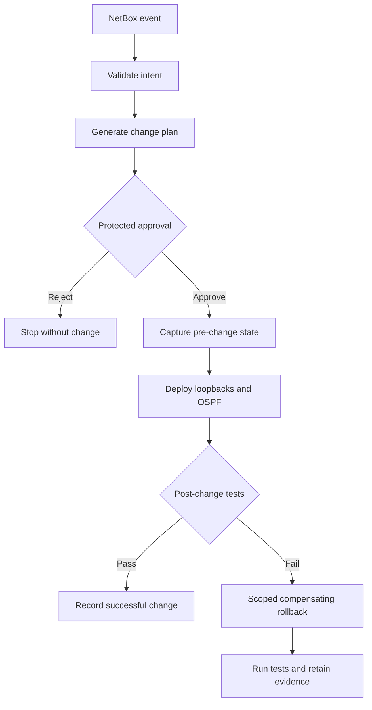

# Lab 14: Plan, Approve, Back Up, and Roll Back Changes

## Lab Introduction

An automated change should not move directly from intent to production merely because syntax is valid. Lab 14 adds a reviewable plan, protected manual approval, scoped pre-change backup, deployment, independent tests, and compensating rollback. The workflow remains NetBox-triggered, but the pipeline pauses before device modification.

## Learning Objectives

- Generate a non-changing Ansible plan with check and diff behavior.
- Protect deployment with a GitLab manual approval gate.
- Capture raw and structured pre-change evidence.
- Distinguish full configuration replacement from scoped compensation.
- Trigger rollback after deployment or test failure.
- Retain plans, approvals, backups, tests, and rollback evidence.

## Safe Change Flow



## Task 1: Add Planning and Recovery Files

```bash
cd ~/ccnpauto-workspace/network_automation_project
git switch main && git pull --ff-only
git switch -c feature/safe-change-lifecycle
LAB14_FILES="/path/to/CCNPAUTO/LAB/Lab14"
cp "$LAB14_FILES/playbooks/"*.yml playbooks/
```

The playbooks reuse the Lab 13 parsing filters. Ensure `filter_plugins/drift_filters.py` remains present in the repository and container build context.

## Task 2: Generate a Local Plan

Keep `ALLOW_CONFIG_CHANGES=false` and run:

```bash
mkdir -p artifacts
ansible-playbook playbooks/plan_change.yml --check --diff
jq . artifacts/change-plan.json
less artifacts/ospf-plan.xml
```

The CLI module calculates candidate differences without sending configuration. The OSPF XML is rendered for review because a NETCONF check-mode result is not uniformly available across IOS XE releases. A plan is advisory: observed state can change between planning and deployment, so validation and serialization remain necessary.

## Task 3: Capture Pre-Change State

```bash
ansible-playbook playbooks/backup_state.yml
jq . artifacts/pre-change-state.json
less artifacts/pre-change-running-config.txt
```

The structured file contains only loopbacks and OSPF host networks controlled by this project. The raw file supports human investigation. Neither artifact may contain credentials.

## Task 4: Understand Scoped Rollback

Replacing the entire running configuration from an old backup can remove unrelated work performed after the backup. Consequently, this lab uses compensation within the project's ownership boundary:

- Remove managed loopbacks that did not exist before the failed change.
- Restore the description, IPv4 address, and administrative state of pre-existing loopbacks.
- Remove new OSPF area 0 host statements absent from the pre-change state.
- Leave unmanaged interfaces and unrelated routing configuration untouched.

Compensation is not perfectly atomic. Production designs should prefer transactional platform capabilities, NETCONF candidate and confirmed commit where supported, or controller-native rollback functions.

## Task 5: Add the GitLab Approval Gate

Integrate the supplied jobs into the cumulative `.gitlab-ci.yml` and arrange stages in this order:

```yaml
stages:
  - validate
  - plan
  - approve
  - backup
  - deploy
  - test
  - rollback
  - observe
```

Configure `iosxe-reserved` as a protected GitLab environment and permit only the instructor or designated maintainer to deploy. The manual job records `GITLAB_USER_LOGIN` as approval evidence. Approval proves authorization, not technical correctness.

Artifacts from `backup-state` must be available to `rollback-on-failure`. Do not use `dependencies: []` or delete intermediate artifacts before rollback can run.

## Task 6: Test Successful Deployment

Create a complete loopback in NetBox. The webhook starts the pipeline, which should pause at `approve-change`. Review:

- NetBox change history
- `change-plan.json`
- `ospf-plan.xml`
- Runner and sandbox availability
- Maintenance-window authorization

Approve the job. Backup, deploy, and test should pass. Download the complete artifact set.

## Task 7: Exercise Failure and Rollback

Use only the reserved sandbox. Introduce an instructor-approved test failure after deployment, such as temporarily asserting an intentionally incorrect address in a feature branch. Approve the pipeline and observe `rollback-on-failure`.

After rollback, manually run `playbooks/test.yml` against the pre-change NetBox state or use the drift playbook to confirm the scoped configuration is restored. Correct the deliberate test and remove the temporary branch.

## Task 8: Commit and Merge

```bash
git add playbooks .gitlab-ci.yml
git commit -m "Add approval backup and scoped rollback"
git push -u origin feature/safe-change-lifecycle
```

Review rules carefully. Scheduled compliance pipelines from Lab 13 must never wait for approval or enter deployment.

## Key Takeaways

- Planning and approval are separate technical and governance controls.
- Backups must be captured immediately before a serialized deployment.
- Post-change tests determine whether the intended outcome was achieved.
- Scoped compensation is safer than blindly restoring an entire old configuration.
- Rollback itself must be tested, logged, and auditable.

Lab 14 completes the course lab sequence by combining intent validation, reviewable planning, protected approval, deployment testing, audit evidence, and scoped rollback in one controlled workflow.

## References

- [GitLab deployment approvals](https://docs.gitlab.com/ci/environments/deployment_approvals/)
- [GitLab manual jobs](https://docs.gitlab.com/ci/jobs/job_control/)
- [Ansible check mode and diff](https://docs.ansible.com/ansible/latest/playbook_guide/playbooks_checkmode.html)
- [NETCONF confirmed commit](https://www.rfc-editor.org/rfc/rfc6241)
