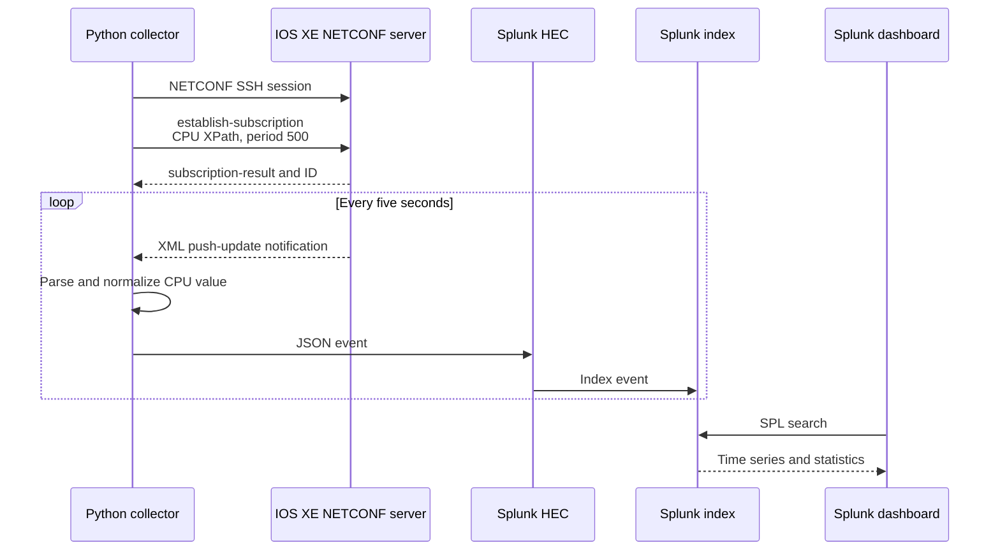

# Optional Lab 14: Stream IOS XE CPU Data into Splunk with NETCONF Dial-In

## Lab Introduction

An operations team already uses Splunk for centralized search and dashboards. It now wants near-real-time CPU visibility from an IOS XE router without configuring a persistent dial-out receiver on the device. In this optional lab, a Python collector opens a NETCONF session to the Cisco IOS XE reservable sandbox, establishes a dynamic YANG-push subscription for five-second CPU utilization, and forwards each normalized notification to Splunk HTTP Event Collector (HEC).

The direction of the sessions is important. The Python collector initiates NETCONF toward IOS XE, so the telemetry subscription is **dial-in**. Splunk does not act as a NETCONF client; it receives normalized events over HEC. If the collector or NETCONF session stops, the dynamic subscription disappears.

Splunk Enterprise is installed with its trial license. Learners must review the current trial terms before installation and should stop the service when the optional lab is complete.

## Learning Objectives

- Explain NETCONF dial-in subscription lifecycle.
- Use Yangsuite to confirm the IOS XE CPU XPath.
- Install Splunk Enterprise and create a dedicated index and HEC token.
- Establish a periodic YANG-push subscription with `ncclient`.
- Parse NETCONF XML into Python dictionaries with `xmltodict` and normalize CPU values.
- Send structured events to Splunk HEC.
- Search the indexed events and build a CPU dashboard.
- Distinguish collector, transport, storage, and visualization failures.

## Data Flow


```mermaid
sequenceDiagram
    participant C as Python collector
    participant R as IOS XE NETCONF server
    participant H as Splunk HEC
    participant S as Splunk index
    participant D as Splunk dashboard

    C->>R: NETCONF SSH session
    C->>R: establish-subscription<br/>CPU XPath, period 500
    R-->>C: subscription-result and ID
    loop Every five seconds
        R-->>C: XML push-update notification
        C->>C: Parse and normalize CPU value
        C->>H: JSON event
        H->>S: Index event
    end
    D->>S: SPL search
    S-->>D: Time series and statistics
```

## Prerequisites

- Ubuntu workstation prepared in Lab 1.
- An active Cisco IOS XE reservable sandbox and VPN connection.
- NETCONF enabled on the sandbox router.
- Access to local or Cisco DevNet Sandbox Yangsuite.
- A Splunk.com account permitted to download the Splunk Enterprise trial.
- At least 4 GB of free memory and sufficient disk for a short lab data set.

This lab is standalone. Create a GitLab.com repository named `optional_lab14_splunk_netconf`, clone it under `~/ccnpauto-workspace`, and copy the contents of `CCNPAUTO/LAB/Lab14/` into it with VS Code, including the hidden `.env.example` file.

## Task 1: Confirm the CPU YANG Path

Open local Yangsuite or Cisco DevNet Sandbox Yangsuite at `http://10.10.20.50:8480`. Add the reserved IOS XE device and build a YANG set from the device-advertised modules. In **Explore YANG**:

1. Load `Cisco-IOS-XE-process-cpu-oper`.
2. Expand `cpu-usage`.
3. Expand `cpu-utilization`.
4. Select `five-seconds`.
5. Confirm the XPath:

```text
/process-cpu-ios-xe-oper:cpu-usage/cpu-utilization/five-seconds
```

The module prefix used inside an XML RPC is locally declared as `cpu`, so the collector sends the equivalent expression:

```text
/cpu:cpu-usage/cpu-utilization/five-seconds
```

The namespace binding, not the spelling of the prefix, identifies the YANG module.

## Task 2: Download and Install Splunk Enterprise

First confirm the workstation architecture:

```bash
dpkg --print-architecture
uname -m
```

This lab requires an x86-64 workstation. The expected results are `amd64` and `x86_64`. Current Splunk Enterprise support for Ubuntu is x86-64; ARM64 packages available for other Splunk components must not be assumed to be a supported Splunk Enterprise server. If the learner workstation reports `arm64` and `aarch64`, run this optional lab in an instructor-approved Ubuntu x86-64 VM instead.

Sign in at Splunk.com, select the current Splunk Enterprise Linux x86-64 `.deb` package, and download it to `~/Downloads`. Splunk's current documentation states that a new Enterprise installation starts with a time-limited trial license; read the displayed license and indexing limits before accepting it.

Install the exact downloaded filename:

```bash
sudo dpkg -i ~/Downloads/splunk-<VERSION>-linux-amd64.deb
sudo /opt/splunk/bin/splunk start --accept-license
```

The release filename can contain additional build identifiers. Replace the placeholder with the exact x86-64 `.deb` filename shown in `~/Downloads`; do not rename an ARM package to include `amd64`.

During first start, create a unique Splunk administrator password. Do not reuse a device, GitLab, or Vault password.

Open Splunk Web:

```text
http://127.0.0.1:8000
```

For this single-workstation exercise, Splunk Web and HEC are local. Production Splunk architecture, TLS, clustering, retention, and role separation are outside this lab.

## Task 3: Create a Dedicated Index

In Splunk Web:

1. Open **Settings > Indexes**.
2. Select **New Index**.
3. Set **Index Name** to `network_telemetry`.
4. Retain instructor-approved storage and retention values.
5. Save the index.

A dedicated index separates lab telemetry from Splunk internal data and makes access and retention easier to control.

## Task 4: Enable HEC and Create a Token

In Splunk Web:

1. Open **Settings > Data Inputs**.
2. Select **HTTP Event Collector**.
3. Select **Global Settings**.
4. Set **All Tokens** to **Enabled**.
5. Retain HTTPS unless the instructor explicitly approves local HTTP.
6. Save the global settings.
7. Select **New Token**.
8. Set the name to `iosxe-netconf-cpu`.
9. On **Input Settings**, select the `network_telemetry` index.
10. Complete the wizard and copy the token once.

The token authorizes event ingestion; it is not an administrator password. Store it only in the untracked `.env`.

## Task 5: Prepare the Collector

Create and activate the lab virtual environment:

```bash
cd ~/ccnpauto-workspace/optional_lab14_splunk_netconf
python3 -m venv .venv
source .venv/bin/activate
python -m pip install --upgrade pip
python -m pip install -r requirements.txt
```

The requirements include `xmltodict`. This library converts XML elements into nested Python dictionaries and lists, which allows learners to inspect NETCONF data with familiar Python structures instead of writing XPath expressions for every value.

Open `.env.example`, create a new `.env` file in the repository root, copy and paste the example content into it, and enter the reservation and Splunk values:

```text
IOSXE_HOST=<sandbox-host>
IOSXE_NETCONF_PORT=830
IOSXE_USERNAME=<sandbox-username>
IOSXE_PASSWORD=<sandbox-password>
IOSXE_HOSTKEY_VERIFY=false

SPLUNK_HEC_URL=https://127.0.0.1:8088
SPLUNK_HEC_TOKEN=<hec-token>
SPLUNK_HEC_VERIFY_TLS=false
SPLUNK_INDEX=network_telemetry

SUBSCRIPTION_PERIOD=500
NOTIFICATION_TIMEOUT=30
```

`SUBSCRIPTION_PERIOD=500` means 500 centiseconds, or five seconds, in the IOS XE YANG-push implementation. Disabling TLS verification is limited to the local lab HEC certificate. Production code must validate a trusted certificate.

## Task 6: Understand the Subscription RPC

Open `netconf_to_splunk.py` and inspect `SUBSCRIPTION_RPC`:

```xml
<establish-subscription
    xmlns="urn:ietf:params:xml:ns:yang:ietf-event-notifications"
    xmlns:yp="urn:ietf:params:xml:ns:yang:ietf-yang-push"
    xmlns:cpu="http://cisco.com/ns/yang/Cisco-IOS-XE-process-cpu-oper">
  <stream>yp:yang-push</stream>
  <yp:xpath-filter>/cpu:cpu-usage/cpu-utilization/five-seconds</yp:xpath-filter>
  <yp:period>500</yp:period>
</establish-subscription>
```

The collector sends this operation on an established NETCONF session. IOS XE returns a subscription ID, followed by notifications on that same session. The collector must continue reading the session; repeatedly polling `<get>` would be a different design.

### Understand the `xmltodict` Parsing Flow

The IOS XE sample notification uses default XML namespaces rather than prefixes on individual elements. With the default `xmltodict.parse()` behavior, namespace declarations appear as `@xmlns` metadata while the data elements become ordinary dictionary keys. The collector can therefore follow the exact hierarchy reported by the device instead of searching the entire document.

The parsing workflow is:

```text
NETCONF XML string
        |
        v
xmltodict.parse()
        |
        v
nested Python dictionaries and lists
        |
        v
read the exact nested keys for five-seconds,
subscription-id, and eventTime
        |
        v
validate and normalize the Splunk event
```

Open `_xml_to_dict()` and `_parse_notification()` in `netconf_to_splunk.py`. The parser disables XML entities, verifies that parsing produced a dictionary root, and raises a meaningful `ValueError` for malformed XML. `_parse_notification()` then reads the IOS XE keys directly.

A simplified notification becomes a structure similar to this:

```python
{
    "notification": {
        "eventTime": "2026-08-01T10:00:00Z",
        "@xmlns": "urn:ietf:params:xml:ns:netconf:notification:1.0",
        "eventTime": "2026-08-01T12:34:42.33Z",
        "push-update": {
            "@xmlns": "urn:ietf:params:xml:ns:yang:ietf-yang-push",
            "subscription-id": "2147483653",
            "datastore-contents-xml": {
                "cpu-usage": {
                    "@xmlns": "http://cisco.com/ns/yang/Cisco-IOS-XE-process-cpu-oper",
                    "cpu-utilization": {
                        "five-seconds": "0"
                    }
                }
            }
        }
    }
}
```

The code extracts the CPU value from this exact dictionary path:

```python
cpu_text = parsed["notification"]["push-update"]["datastore-contents-xml"][
    "cpu-usage"
]["cpu-utilization"]["five-seconds"]
```

It reads the other values from `parsed["notification"]["eventTime"]` and `parsed["notification"]["push-update"]["subscription-id"]`. The XML values arrive as text, so `_parse_notification()` converts `five-seconds` to `int` and rejects values outside `0` through `100`.

The script retains a small local-name search only for the initial RPC reply because IOS XE releases can wrap the returned subscription ID differently. The recurring notification parser uses the exact device structure shown above, which keeps the learner-facing data extraction clear.

`xmltodict` makes XML easier to navigate, but it does not validate the payload against the YANG model. The collector still needs explicit checks for missing fields, expected types, permitted ranges, and notification purpose.

## Task 7: Validate HEC Before Opening NETCONF

Run the supplied Python validation:

```bash
python check_splunk.py
```

The script sends one synthetic event through the same HEC endpoint and token used by the collector. In Splunk Search, run:

```spl
index=network_telemetry sourcetype="cisco:iosxe:netconf:cpu"
| sort - _time
| head 10
```

Confirm an event with `device="hec-self-test"` and `cpu_five_seconds=0`. This isolates HEC configuration from NETCONF troubleshooting.

## Task 8: Run the Dial-In Collector

Start the collector:

```bash
python netconf_to_splunk.py
```

Expected console behavior:

```text
Connected to IOS XE NETCONF at <host>:830
Subscription established: <subscription-id>
Forwarded CPU sample: device=<host> cpu_five_seconds=<value>
```

Leave it running for at least five minutes. Press `Ctrl+C` to stop it cleanly. Stopping the program closes the NETCONF session and ends the dynamic subscription.

If a notification is not well-formed XML, contains a non-integer CPU value, or reports a value outside the expected percentage range, the collector logs a warning and continues waiting for the next notification. A notification that is valid XML but does not contain `five-seconds` is ignored at debug level because it may represent another NETCONF notification on the session.

On IOS XE, `show telemetry ietf subscription all` should show a dynamic subscription only while the collector is connected.

## Task 9: Search and Interpret the Events

In Splunk Search:

```spl
index=network_telemetry sourcetype="cisco:iosxe:netconf:cpu" device!="hec-self-test"
| timechart span=5s latest(cpu_five_seconds) AS cpu_percent BY device
```

Then inspect delivery statistics:

```spl
index=network_telemetry sourcetype="cisco:iosxe:netconf:cpu" device!="hec-self-test"
| stats count AS samples
        min(cpu_five_seconds) AS minimum
        avg(cpu_five_seconds) AS average
        max(cpu_five_seconds) AS maximum
  BY device
```

A gap in the time series can indicate a stopped collector, a NETCONF disconnect, an XPath problem, or failed HEC delivery. Splunk cannot infer which layer failed without collector logs.

## Task 10: Build a Splunk App and Dashboard in the UI

Build the visualization entirely in Splunk Web. This lab does not import HTML, XML, or another external dashboard file.

1. Open **Apps > Manage Apps**.
2. Select **Create app**.
3. Enter `IOS XE Telemetry` as the name and `ios_xe_telemetry` as the folder name.
4. Select the visible navigation option, retain the standard template, and save.
5. Open the new **IOS XE Telemetry** app.
6. Open **Dashboards**, select **Create New Dashboard**, and name it `IOS XE NETCONF CPU`.
7. Choose a dashboard editor available in the installed trial version. The Classic editor is sufficient for this lab.
8. Add a line-chart panel named `Five-Second CPU Trend` with:

```spl
index=network_telemetry sourcetype="cisco:iosxe:netconf:cpu" device!="hec-self-test"
| timechart span=5s latest(cpu_five_seconds) AS cpu_percent BY device
```

9. Set the Y-axis minimum to `0`, maximum to `100`, and unit to percent when the selected editor exposes those options.
10. Add a single-value panel named `Latest CPU` with:

```spl
index=network_telemetry sourcetype="cisco:iosxe:netconf:cpu" device!="hec-self-test"
| stats latest(cpu_five_seconds) AS cpu_percent
```

11. Add a statistics-table panel named `Collection Health` with:

```spl
index=network_telemetry sourcetype="cisco:iosxe:netconf:cpu" device!="hec-self-test"
| stats count AS samples
        latest(_time) AS last_event
        avg(cpu_five_seconds) AS average_cpu
        max(cpu_five_seconds) AS peak_cpu
  BY device
| convert ctime(last_event)
```

12. Set the dashboard time picker to **Last 15 minutes**, save it, and confirm that all three panels populate while the collector is running.

Use these additional SPL searches directly in the Search view when troubleshooting. They do not require another dashboard:

```spl
index=network_telemetry sourcetype="cisco:iosxe:netconf:cpu"
| stats count BY device, source, sourcetype, index
```

```spl
index=network_telemetry sourcetype="cisco:iosxe:netconf:cpu" device!="hec-self-test"
| eval delay_seconds=now()-_time
| stats latest(_time) AS last_event latest(delay_seconds) AS ingestion_delay BY device
| convert ctime(last_event)
```

```spl
index=network_telemetry sourcetype="cisco:iosxe:netconf:cpu" device!="hec-self-test"
| bucket _time span=30s
| stats count AS samples BY _time, device
| where samples < 5
```

The final search highlights intervals that received fewer samples than expected. It is an indicator rather than proof of packet loss because collector startup, shutdown, search-window boundaries, and processing delay can also reduce the count.

## Task 11: Test a Failure

With the collector running, stop Splunk:

```bash
sudo /opt/splunk/bin/splunk stop
```

Observe that the collector reports an HEC delivery failure instead of silently discarding it. Restart Splunk:

```bash
sudo /opt/splunk/bin/splunk start
```

The simple lab collector continues with subsequent notifications but does not queue failed events to disk. A production collector needs buffering, retry limits, durable offsets, health metrics, and secure TLS.

## Task 12: Stop Services and Protect Data

Stop the collector with `Ctrl+C`, then stop Splunk:

```bash
sudo /opt/splunk/bin/splunk stop
```

Do not commit `.env`, Splunk tokens, indexed data, or Splunk administrator credentials. If the trial is no longer required, follow Splunk's official uninstall instructions rather than deleting `/opt/splunk` manually.

## Troubleshooting

| Symptom | Investigate |
|---|---|
| HEC check returns `401` or `403` | Token value, token enabled state, and index permission |
| HEC connection is refused | Splunk service and HEC global enablement |
| NETCONF RPC returns `unknown-element` | IOS XE release, advertised telemetry modules, and Yangsuite-generated RPC |
| Subscription succeeds but no notifications arrive | XPath, period, active NETCONF session, and notification timeout |
| XML arrives without `five-seconds` | Device model revision or a different notification payload structure |
| Collector reports malformed NETCONF XML | Inspect the notification source and XML completeness; `xmltodict` could not parse the document |
| Collector reports a non-integer or out-of-range CPU value | Confirm the selected YANG leaf and inspect the actual notification dictionary before changing validation |
| Splunk events exist but dashboard is empty | Time range, index, sourcetype, and field extraction |
| Repeated TLS warnings | Lab-only self-signed certificate; install a trusted certificate for production |

## Key Takeaways

- NETCONF dial-in means the collector initiates and owns the subscription session.
- IOS XE sends structured XML notifications rather than Splunk events.
- `xmltodict` converts XML into familiar dictionaries, but application code must still handle namespaces, missing leaves, types, and ranges.
- A collector is required to normalize NETCONF data and forward it to Splunk HEC.
- HEC tokens should be scoped to a dedicated index and protected like credentials.
- Dashboard gaps are symptoms; collector logs and subscription state locate the failed layer.
- A development collector without durable buffering is not a production telemetry pipeline.

## References

- [Cisco IOS XE Model-Driven Telemetry](https://www.cisco.com/c/en/us/td/docs/ios-xml/ios/prog/configuration/1715/b_1715_programmability_cg/model-driven-telemetry.html)
- [Cisco DevNet IOS XE Programmability](https://developer.cisco.com/iosxe/)
- [Splunk Enterprise Linux Installation](https://help.splunk.com/en/splunk-enterprise/administer/install-and-upgrade/10.2/install-splunk-enterprise-on-linux-or-macos)
- [Splunk HTTP Event Collector](https://help.splunk.com/en/splunk-enterprise/get-data-in/get-started-with-getting-data-in/10.2/get-data-with-http-event-collector/set-up-and-use-http-event-collector-from-the-cli)
