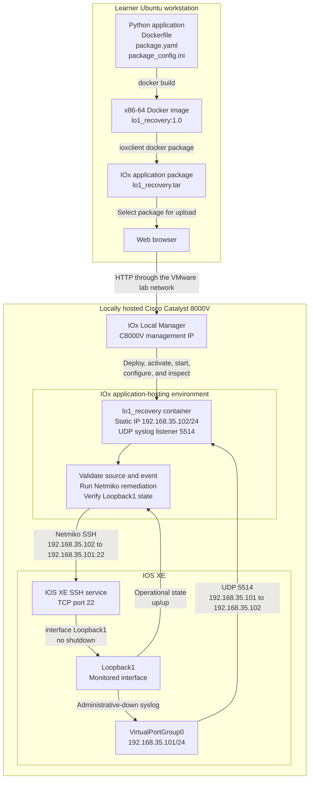
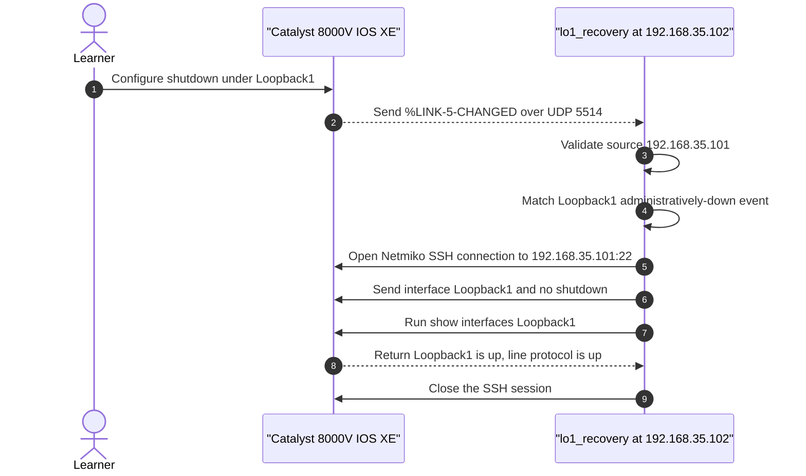

# Optional Lab 15: Host a Python Application Using the Application Hosting Service on the Cisco IOS XE Platform

## Lab Introduction

Network automation normally runs from a workstation, runner, or controller. However, a small operational service can also run directly beside IOS XE. Hosting the service on the router reduces its dependency on an external automation server and demonstrates how edge applications can react to local events.

The Cisco Catalyst 8000V DevNet Sandbox has limited compute and application-hosting resources. Consequently, it may boot IOS XE successfully but still lack enough available capacity to activate and run this container reliably. For this lab, learners should host a dedicated **Cisco Catalyst 8000V** virtual router on **VMware Workstation** and manage the application through the router's **IOx Local Manager** at:

```text
http://<C8000V-MANAGEMENT-IP>/iox/login
```

Allocate **2 vCPUs as the absolute minimum, 4 vCPUs as the recommended lab configuration, and 8 GB RAM**. Four vCPUs provide useful headroom for IOS XE, IOx, and the hosted Python container to run together. Do not use the DevNet reservation as the application execution platform for this lab; its application-hosting allocation is too constrained for reliable activation and runtime. It may still be used only to observe the IOS XE and IOx interfaces when available.

Learners build a Python service as an x86-64 Docker image, convert the image into an IOx application package with `ioxclient`, and use Local Manager to deploy, configure, activate, start, inspect, stop, and delete it. IOS XE CLI is still used to create the test interface, configure syslog, verify IOx state, and confirm the final network condition.

The application listens for an IOS XE syslog message stating that `Loopback1` was administratively shut down. After validating the message and source address, it connects back to the Catalyst 8000V with Netmiko, applies `no shutdown`, and verifies that the interface is operational. The remediation is intentionally narrow so learners can concentrate on application hosting and lifecycle management.

## Learning Objectives

- Explain the relationship between IOS XE, IOx, Local Manager, Docker, and `ioxclient`.
- Install `ioxclient` on an x86-64 or ARM64 learner workstation.
- Build an x86-64 application image for Catalyst 8000V.
- Package the Docker image as an IOx archive.
- Deploy and activate an application through IOx Local Manager.
- Supply deployment-specific settings through `package_config.ini`.
- Configure application networking and UDP port exposure.
- Inspect application state, resources, configuration, and logs.
- Validate a small event-driven closed loop.
- Remove the application and temporary credentials safely.

## Application and Management Flow



The diagram separates the management plane from the runtime closed loop. The learner uses Local Manager to control the application's lifecycle, whereas IOS XE and the running container communicate directly across `VirtualPortGroup0`. The container must use the static address `192.168.35.102/24`; this lab does not depend on DHCP inside the application-hosting network.

The event sequence is as follows:



The four control paths therefore have distinct purposes:

```text
Learner browser  -> http://<C8000V-MANAGEMENT-IP>/iox/login -> IOx Local Manager
Learner terminal -> SSH to the C8000V management IP         -> IOS XE CLI
Hosted app       -> SSH to 192.168.35.101:22                 -> Netmiko remediation
IOS XE           -> Application UDP/5514                    -> Shutdown event
```

## Supplied Files

```text
Lab15/
├── .dockerignore
├── .gitignore
├── Dockerfile
├── Lab15.md
├── loopback_recovery.py
├── package.yaml
├── package_config.ini
├── requirements.txt
├── scripts/
│   └── send_test_syslog.py
└── tests/
    └── test_loopback_recovery.py
```

`package_config.ini` is a deployment-specific IOx bootstrap configuration. It is excluded from Git and from the Docker image, but `ioxclient` places it in the IOx application package so Local Manager can manage it separately from application code.

## Task 1: Host and Inspect the Catalyst 8000V

Deploy the Catalyst 8000V on an x86-64 computer running VMware Workstation. Use a legally obtained Cisco C8000V image appropriate for the course and comply with Cisco licensing requirements. VMware Workstation is suitable for this self-contained learning exercise; consult Cisco's current supported-hypervisor documentation before designing a production deployment.

Use the following virtual-machine allocation:

| Resource | Lab allocation | Reason |
|---|---:|---|
| vCPU | 2 minimum; 4 recommended | IOS XE and IOx must run concurrently, and application activation needs spare CPU capacity. |
| Memory | 8 GB | Provides headroom beyond base router operation for IOx and the Python container. |
| Storage | At least 16 GB, with several GB free | The router needs space for IOS XE, IOx application storage, uploaded packages, and extracted container layers. |
| Management NIC | Bridged or NAT, reachable from Ubuntu | Learners must reach IOS XE SSH and IOx Local Manager from the workstation. |

The C8000V guest is x86-64. Therefore, run it on an x86-64 VMware host. An ARM64 learner workstation cannot run this guest natively in VMware Workstation; use a separate x86-64 computer or an instructor-provided x86-64 VMware/ESXi host in that situation.

In VMware Workstation, import the Cisco-provided virtual appliance or create the VM using the matching Cisco installation image, then open **VM Settings** before the first boot. Assign the CPU, memory, disk, and management NIC shown above. Do not oversubscribe the host so heavily that the VM cannot receive its configured CPU and memory. Complete the initial IOS XE setup, assign a reachable management address, configure local administrative access, and enable IOx if it is not already enabled:

```text
configure terminal
iox
end
```

Allow IOx several minutes to initialize after the first boot or after enabling it. Record the following values before continuing:

- C8000V management IP address.
- IOS XE administrative username and password.
- IOx Local Manager username and password.
- IOS XE release and C8000V image used for the lab.

Open an SSH session to the local router and enter privileged EXEC mode.

Inspect the environment without changing it:

```text
show version
show iox
show app-hosting list
show app-hosting resource
show ip interface brief
```

Confirm that the IOx services report a running state and that sufficient CPU, memory, vCPU, and disk resources are available. If the output shows no usable application-hosting CPU or memory, power off the VM, increase it to the recommended **4 vCPUs and 8 GB RAM**, power it on again, and repeat the checks. Do not proceed until IOx is healthy and application resources are available.

Open the Local Manager URL in a browser, replacing the placeholder with the reachable management address of the local C8000V:

```text
http://<C8000V-MANAGEMENT-IP>/iox/login
```

Use the IOx Local Manager credentials configured for the local router. These credentials may differ from the IOS XE SSH credentials. If the router redirects the session to HTTPS, accept only the expected locally managed certificate. Keep the management interface on an isolated lab network and do not expose Local Manager directly to the Internet.

After login, open **Applications** and confirm that the page displays the applications known to the Catalyst 8000V.

## Task 2: Prepare the Repository and Test the Code

Create a private GitLab.com project named `optional_lab15_c8000v_app_hosting`. Clone it under `~/ccnpauto-workspace`, and then use VS Code to copy the supplied Lab 15 files into the cloned folder.

Create a virtual environment and run the supplied validation:

```bash
python3 -m venv .venv
source .venv/bin/activate
python -m pip install --upgrade pip
python -m pip install -r requirements.txt
python -m py_compile loopback_recovery.py scripts/send_test_syslog.py
python -m pytest -q
```

The tests confirm that only a `Loopback1` administrative-down event triggers remediation. They also verify that Netmiko receives `interface Loopback1` and `no shutdown`, checks the interface state, and disconnects. Mocked connections prevent the local tests from modifying the router.

## Task 3: Install and Initialize `ioxclient`

`ioxclient` is Cisco's command-line tool for converting an application image into an IOx-compatible package. It is a standalone executable rather than a Python library.

Identify the learner workstation architecture:

```bash
uname -m
dpkg --print-architecture
```

| Result | Required `ioxclient` download |
|---|---|
| `x86_64` or `amd64` | Linux x86-64 |
| `aarch64` or `arm64` | Linux ARM64 |

Open [Cisco IOx Resource Downloads](https://developer.cisco.com/docs/iox/iox-resource-downloads/) and download the current Linux binary matching the workstation. The `ioxclient` architecture must match the workstation, whereas the application image created later must match the x86-64 Catalyst 8000V.

Extract the archive with Ubuntu Files. Open a terminal in the extracted directory and install the executable:

```bash
file ioxclient
chmod +x ioxclient
./ioxclient --version
sudo install -m 0755 ioxclient /usr/local/bin/ioxclient
ioxclient --version
```

Use `sudo` only for installing the executable into `/usr/local/bin`. Running normal `ioxclient` commands with `sudo` can create root-owned settings and build files. An `Exec format error` indicates that the wrong workstation architecture was downloaded.

Confirm the workstation Docker environment:

```bash
docker version
```

The course workstation used for this lab has an ARM64 Docker 29 installation. Typical evidence is:

```text
Server Version: 29.6.2
OS/Arch: linux/arm64
```

Docker 29 remains the workstation's normal engine for the other course services. Do not downgrade or remove it. However, Cisco identifies Docker 24.0.9 as the latest engine compatible with the C8000V `ioxclient` packaging workflow. Task 6 therefore starts a temporary ARM64 Docker 24.0.9 daemon and uses it to cross-build and package the AMD64 application.

This lab does not require an `ioxclient` platform profile because Local Manager performs deployment and lifecycle operations. The Docker connection used internally by `ioxclient` is configured in Task 6.

## Task 4: Understand the Application Configuration Boundary

Open `loopback_recovery.py`. The application reads the path supplied by the IOx `CAF_APP_CONFIG_FILE` environment variable. Local Manager provisions that path and stores the uploaded `package_config.ini` separately from the immutable application image.

The file contains:

```ini
[router]
host = 192.168.35.101
port = 22
username = apphost
password = REPLACE_WITH_LAB_PASSWORD
device_type = cisco_ios
timeout = 10
syslog_source = 192.168.35.101
```

The fields have these purposes:

| Field | Meaning |
|---|---|
| `host` | IOS XE VirtualPortGroup address the application reaches with Netmiko |
| `port` | SSH port as seen from the hosted application; normally 22 on the internal application network |
| `username` and `password` | Temporary router account used only by this lab |
| `device_type` | Netmiko platform driver, `cisco_ios` |
| `timeout` | SSH establishment timeout |
| `syslog_source` | Source address allowed to trigger remediation |

The application can also accept equivalent environment variables for portability, but this Local Manager workflow deliberately uses the managed bootstrap file.

## Task 5: Prepare IOS XE Networking, Credentials, and the Test Interface

Choose a temporary lab password containing letters and numbers but no spaces. Do not reuse any personal, GitLab, Vault, or production password.

First, inspect whether the local router already has an application-hosting network. Do not overwrite a VirtualPortGroup used by another application:

```text
show ip interface brief | include VirtualPortGroup
show running-config | section app-hosting
show app-hosting list
```

The dedicated local C8000V used by this lab should not have another hosted application or an existing `VirtualPortGroup0` address. Because the learner-built IOx archive is not Cisco-signed, disable signed-application verification for this isolated lab before deploying it. This is a global security control, so do not disable it on a production router merely to bypass package validation.

Configure a dedicated internal subnet between IOS XE and `lo1_recovery`, create the application account with privilege level 15, and prepare the test loopback:

```text
app-hosting verification disable
show app-hosting infra
configure terminal
interface VirtualPortGroup0
 description LAB15-IOX-APPLICATION-NETWORK
 ip address 192.168.35.101 255.255.255.0
 no shutdown
exit
app-hosting appid lo1_recovery
 app-vnic gateway1 virtualportgroup 0 guest-interface 0
  guest-ipaddress 192.168.35.102 netmask 255.255.255.0
 exit
 app-default-gateway 192.168.35.101 guest-interface 0
 name-server0 8.8.8.8
exit
username apphost privilege 15 secret <TEMPORARY-LAB-PASSWORD>
ip ssh version 2
interface Loopback1
 description LAB15-CLOSED-LOOP-TEST
 ip address 198.51.100.1 255.255.255.255
 no shutdown
end
show running-config interface VirtualPortGroup0
show running-config | section app-hosting appid lo1_recovery
show running-config | include ^username apphost
show app-hosting infra
show interfaces Loopback1 | include line protocol
```

`192.168.35.101` is the IOS XE side of the internal link, while `192.168.35.102` becomes the application address. The application can therefore SSH directly to the router through the VirtualPortGroup, and IOS XE can send syslog directly to the application without NAT or an external port mapping.

The command `username apphost privilege 15 secret <TEMPORARY-LAB-PASSWORD>` is required: it creates the `apphost` SSH account and assigns privilege level 15 so the hosted application can enter configuration mode and issue `no shutdown`. Confirm that the username appears in the running configuration before continuing. The account has this broad privilege only to keep this optional lab focused on application hosting. A production implementation should use command authorization and the minimum privileges required for the remediation.

In `show app-hosting infra`, confirm that `App signature verification` is reported as `disabled` before uploading the learner-built package.

In VS Code, open `package_config.ini` and replace `REPLACE_WITH_LAB_PASSWORD` with the temporary password. Retain `192.168.35.101` for both `host` and `syslog_source`. These values match the IOS XE VirtualPortGroup address configured above.

Do not stage or commit `package_config.ini`. Verify that Git ignores it:

```bash
git status --short
git check-ignore package_config.ini
```

## Task 6: Build and Inspect the x86-64 Container

Catalyst 8000V is the application target, so the application image must be AMD64 even though the learner workstation is ARM64. Meanwhile, `ioxclient` must obtain the image from Docker 24.0.9 to generate the legacy layer archive accepted by this IOx release.

First, register AMD64 binary emulation with the workstation kernel. This permits the temporary ARM64 Docker daemon to execute AMD64 build steps:

```bash
docker run --privileged --rm \
  tonistiigi/binfmt --install amd64
```

Remove a compatibility container left by an earlier attempt, and then start a clean Docker 24.0.9 daemon:

```bash
docker rm -f iox-docker24 2>/dev/null || true

docker run -d \
  --privileged \
  --name iox-docker24 \
  -e DOCKER_TLS_CERTDIR="" \
  --dns 1.1.1.1 \
  --dns 8.8.8.8 \
  -p 127.0.0.1:2375:2375 \
  docker:24.0.9-dind
```

The empty `DOCKER_TLS_CERTDIR` value is required. Without it, the Docker-in-Docker image enables HTTPS automatically and a plain HTTP client receives `Client sent an HTTP request to an HTTPS server`. The explicit DNS servers prevent the nested daemon from inheriting an unusable loopback resolver such as `127.0.0.53` from the Ubuntu host. Port 2375 is bound only to `127.0.0.1`; never expose this unauthenticated daemon on an external interface.

Confirm that the compatibility daemon is ready:

```bash
docker -H tcp://127.0.0.1:2375 version \
  --format 'Compatibility Docker Server: {{.Server.Version}}'
```

The result must be:

```text
Compatibility Docker Server: 24.0.9
```

Before building, verify DNS resolution from inside the compatibility container:

```bash
docker exec iox-docker24 \
  nslookup registry-1.docker.io
```

The command must return one or more addresses. If it times out, the VPN or local network may block public DNS. Inspect the DNS servers assigned to the active Ubuntu interface with `resolvectl dns`, replace `1.1.1.1` and `8.8.8.8` in the `docker run` command with a reachable non-loopback DNS server, and recreate `iox-docker24` before continuing.

Build the AMD64 application inside the Docker 24 daemon:

```bash
docker -H tcp://127.0.0.1:2375 build \
  --platform linux/amd64 \
  -t lo1_recovery:1.0 .
```

Inspect the resulting architecture:

```bash
docker -H tcp://127.0.0.1:2375 image inspect \
  lo1_recovery:1.0 \
  --format '{{.Architecture}}'
```

The expected value is:

```text
amd64
```

If the architecture is not `amd64`, do not continue to packaging. Rebuild the image with the explicit `--platform linux/amd64` option.

Configure `ioxclient` to obtain the image from the temporary Docker 24 daemon:

```bash
ioxclient docker init
```

Enter:

```text
Docker daemon URI: http://127.0.0.1:2375
Docker API version: 1.43
```

Keep `iox-docker24` running until Task 7 is complete.

The Dockerfile installs only the Python dependencies required by the application. It does not install `iproute2` because the recovery service uses Python sockets and Netmiko and never invokes the Linux `ip` command. Keeping unnecessary operating-system packages out of the image reduces its size and removes an avoidable dependency on the Alpine package repository during the build.

Run a local startup check using the INI file:

```bash
docker -H tcp://127.0.0.1:2375 run \
  --rm --name loopback-recovery-test \
  -p 15514:5514/udp \
  -e CAF_APP_CONFIG_FILE=/data/package_config.ini \
  -v "$PWD/package_config.ini:/data/package_config.ini:ro" \
  lo1_recovery:1.0
```

Confirm that the process listens on UDP 5514. Do not generate the matching shutdown event during this local test. Stop the container with `Ctrl+C`.

## Task 7: Create the IOx Application Package

Open `package.yaml` and confirm that it declares:

- Docker application type.
- `x86_64` CPU architecture.
- UDP port 5514.
- A custom resource profile with 256 MB memory.
- `rootfs.tar` as the Docker-layer root filesystem used by the C8000V workflow.
- The Python startup target.

Package the image:

```bash
ioxclient docker package \
  --name lo1_recovery.tar \
  lo1_recovery:1.0 .
```

If the installed release does not support `--name` in that position, use:

```bash
ioxclient docker package lo1_recovery:1.0 .
mv package.tar lo1_recovery.tar
```

Inspect the resulting archive:

```bash
tar -tf lo1_recovery.tar
```

Confirm that the IOx package contains its descriptor, generated root filesystem, and bootstrap configuration. Do not commit the TAR archive.

Before uploading the package, perform one additional integrity check. This extracts the outer IOx envelope into a temporary directory, locates `rootfs.tar` inside `artifacts.tar.gz`, and confirms that the Docker archive contains a manifest and layer data:

```bash
rm -rf /tmp/lab15-package-check
mkdir -p /tmp/lab15-package-check/outer /tmp/lab15-package-check/artifacts
tar -xf lo1_recovery.tar -C /tmp/lab15-package-check/outer
tar -xzf /tmp/lab15-package-check/outer/artifacts.tar.gz \
  -C /tmp/lab15-package-check/artifacts
tar -tf /tmp/lab15-package-check/artifacts/rootfs.tar | sed -n '1,20p'
```

The listing must include `manifest.json` and Docker layer content. If the command reports that `rootfs.tar` is absent, or the listing contains no manifest or layer data, do not upload the package. Confirm that `ioxclient` is using `http://127.0.0.1:2375`, verify that the compatibility server reports `24.0.9`, and rebuild the package.

This C8000V workflow deliberately omits `-p ext2`. `ioxclient` packages the Docker layers into `rootfs.tar`, so `package.yaml` must declare:

```yaml
startup:
  rootfs: rootfs.tar
```

Do not add `-p ext2` to the command. That option invokes a flat ext2 conversion, expects `rootfs.img`, and can fail with `Failed to format rootfs image file`. Cisco's C8000V packaging example uses the Docker-layer `rootfs.tar` method shown here.

After the package is created and inspected, return `ioxclient` to the workstation's normal Docker 29 socket:

```bash
ioxclient docker init
```

Enter:

```text
Docker daemon URI: unix:///var/run/docker.sock
Docker API version: accept the detected/default value
```

## Task 8: Deploy the Package through Local Manager

Return to:

```text
http://<C8000V-MANAGEMENT-IP>/iox/login
```

Deploy the package:

1. Select **Applications** from the Local Manager menu.
2. Select **Add New**, **Add/Deploy**, or the equivalent deployment button shown by this Local Manager release.
3. Enter `lo1_recovery` as the application ID.
4. Select **Choose File**.
5. Browse to the project directory and select `lo1_recovery.tar`.
6. Start the upload and wait without refreshing the browser.
7. Confirm the successful deployment dialog.
8. Return to **Applications** and verify that the application state is **DEPLOYED**.

Deployment stores and validates the package, but it does not yet reserve CPU, memory, or networking resources.

## Task 9: Activate the Application

At the **DEPLOYED** state, the application card displays **Activate**, **Upgrade**, and **Delete**. Selecting the application name may display tabs such as **Resources**, **App-Config**, **App-info**, **App-DataDir**, and **Logs**, but the management tabs are not usable yet. Selecting **App-Config** at this point produces `This tab is not valid in deployed state`; this is expected behavior, not a package failure. Select **OK**, return to **Resources** or **Applications**, and activate the application first.

Select **Activate** for `lo1_recovery`. On the **Resources** page:

1. Select the custom resource profile requested by the descriptor, or enter approximately 100 CPU units, 256 MB memory, and 10 MB application disk when Local Manager asks for explicit values.
2. In the network section, select the application interface and map it to `VirtualPortGroup0` through the interface shown by Local Manager.
3. Select **Interface Setting** or **details** beside the application interface.
4. Under **IPv4 Setting**, select **Static**. Do not leave IPv4 set to **Dynamic**; this lab intentionally uses a fixed application address and does not rely on DHCP.
5. Enter the following values:

   | Setting | Value |
   |---|---|
   | IP address | `192.168.35.102` |
   | Prefix length | `24` |
   | DNS | `8.8.8.8` |
   | Default gateway | `192.168.35.101` |

6. Select **OK** and confirm that the resource page displays the static application address.
7. No NAT or external port mapping is required because IOS XE and the application communicate directly over the VirtualPortGroup subnet.
8. Do not enable debug mode unless troubleshooting requires it.
9. Select **Activate App** or **Activate**, and wait for the state to become **ACTIVATED**.

If Local Manager reports `App requires at least one interface in package.yaml, but no network is set up on the device`, select **OK** and return to IOS XE. Reapply the `VirtualPortGroup0` and `app-hosting appid lo1_recovery` configuration from Task 5, verify it in the running configuration, refresh Local Manager, and activate again.

Activation reserves the requested resources and creates the application network, but it does not start the Python process.

## Task 10: Start and Manage the Application

Return to **Applications**, select **Start** for `lo1_recovery`, and wait for **RUNNING**. Once the application is running, its card exposes **Manage**, or the application name/card becomes selectable depending on the Local Manager release.

1. Select **Manage**. If no Manage button is shown, select the `lo1_recovery` name or application card.
2. On the application-specific page, locate the tabs such as **Resources**, **App-Info**, **App-Config**, **App-DataDir**, and **Log**. These are not top-level Local Manager tabs.
3. Open **App-Config**.
4. Confirm that the displayed content uses valid INI syntax and includes the `[router]` section.
5. Confirm that `host`, `username`, `password`, `device_type`, and `syslog_source` contain the Lab 15 values rather than the placeholder password.
6. If a correction is necessary, edit the text in the page or upload the revised `package_config.ini`, depending on which controls this Local Manager release provides.
7. Select **Save**.
8. Stop and restart the application after changing the configuration so that the Python process rereads `CAF_APP_CONFIG_FILE`.

Local Manager provisions `package_config.ini` at the path referenced by `CAF_APP_CONFIG_FILE`. Although this mechanism keeps the password outside the Docker image, Local Manager administrators can still read the configuration. It is appropriate only for this isolated lab account, which is removed at the end of the exercise.

Do not refresh the browser during upload, activation, or start operations. Local Manager may need several minutes to allocate resources and create the container.

Open the application's **Resources**, **App-Info**, and **Logs** or **App-Console** views. Record:

- Application state.
- Application address `192.168.35.102`.
- `VirtualPortGroup0` application network.
- Internal UDP port.
- CPU and memory reservation.

Corroborate the UI from IOS XE:

```text
show app-hosting list
show app-hosting detail appid lo1_recovery
show app-hosting utilization appid lo1_recovery
```

The application log should report that it is listening on UDP 5514. If it exits immediately, open the application-specific management page and inspect **App-Config**; the most common cause is a missing configuration file or unchanged placeholder password.

### Verify Runtime and Network Readiness

Do not test Loopback1 recovery merely because Local Manager accepted the activation. Establish the application state and network identity first:

```text
show app-hosting list
show app-hosting detail appid lo1_recovery
show running-config interface VirtualPortGroup0
show running-config | section app-hosting appid lo1_recovery
show ip arp 192.168.35.102
ping 192.168.35.102
show logging | include Trap logging|192.168.35.102
```

Proceed only when all of the following are true:

- `lo1_recovery` is `RUNNING`.
- The application detail identifies guest interface 0 and the statically assigned address `192.168.35.102`.
- `VirtualPortGroup0` is up with address `192.168.35.101/24`.
- The application-hosting configuration binds `gateway1` to `VirtualPortGroup0` and guest interface 0.
- IOS XE can successfully ping the application at `192.168.35.102`.
- Local Manager **App-Config** contains the correct temporary password and uses `192.168.35.101` for `host` and `syslog_source`.
- The application log contains `Listening for IOS XE syslog on udp://0.0.0.0:5514`.

Do not continue to the recovery test until `ping 192.168.35.102` succeeds. If it fails, stop and deactivate the application, confirm that **IPv4 Setting** uses the static address `192.168.35.102/24` rather than **Dynamic**, and verify that the default gateway is `192.168.35.101`. Then reapply the Task 5 `VirtualPortGroup0` and `app-hosting` configuration if necessary, activate and start the application again, and repeat the ping test. An unresolved or incomplete ARP entry, or a missing guest address in `show app-hosting detail`, is further evidence that the application vNIC was not provisioned correctly.

## Task 11: Deliver Syslog and Test Recovery

The application uses `192.168.35.102` on the directly connected VirtualPortGroup subnet. Configure IOS XE to source informational syslog from its `192.168.35.101` VirtualPortGroup address and send it to application UDP port 5514:

```text
configure terminal
logging source-interface VirtualPortGroup0
logging host 192.168.35.102 transport udp port 5514
logging trap informational
end
```

Confirm the application remains **RUNNING**. Then generate the intended event:

```text
configure terminal
interface Loopback1
 shutdown
end
```

The application should receive the syslog, validate source `192.168.35.101`, connect to that address with Netmiko, apply `no shutdown`, and verify the result.

Check IOS XE:

```text
show interfaces Loopback1 | include line protocol
show logging | include Loopback1
show app-hosting list
```

The expected final interface state is:

```text
Loopback1 is up, line protocol is up
```

Review the application log in Local Manager. It should show event detection, Netmiko configuration output, and final verification.

If the log reports that the syslog came from an unexpected address, record that observed source. Stop the application, update `syslog_source` in `package_config.ini`, upload it through **App-Config**, and restart the application. Do not weaken the application by accepting every source.

## Task 12: Stop, Deactivate, and Delete the Application

Use Local Manager to remove resources in the correct order:

1. Open **Applications**.
2. Select **Stop** for `lo1_recovery` and wait for **STOPPED**.
3. Select **Deactivate** and wait for **DEPLOYED**.
4. Select **Delete**, **Remove**, or **Uninstall**, depending on the UI wording.
5. Confirm only the `lo1_recovery` application.
6. Verify that it no longer appears in **Applications**.

Confirm from IOS XE:

```text
show app-hosting list
```

Remove the temporary syslog, application-hosting network, and account configuration:

```text
configure terminal
no logging host 192.168.35.102 transport udp port 5514
no logging source-interface VirtualPortGroup0
no username apphost
no app-hosting appid lo1_recovery
no interface VirtualPortGroup0
interface Loopback1
 no shutdown
end
app-hosting verification enable
show app-hosting infra
```

The `app-hosting verification enable` command restores package-signature verification after the unsigned lab application has been removed. Confirm that `show app-hosting infra` reports signature verification as enabled before finishing the lab.

On Ubuntu, delete the generated package and optional local image when they are no longer required:

```bash
rm -f lo1_recovery.tar package.tar
docker -H tcp://127.0.0.1:2375 image rm \
  lo1_recovery:1.0
```

The Lab 15 image resides in the temporary daemon rather than the normal Docker 29 image store. Remove that daemon after packaging and deployment are complete. This does not change or remove the workstation's normal Docker 29 service:

```bash
docker rm -f iox-docker24
```

Commit and push only the source, tests, Dockerfile, descriptor, and documentation. Never commit `package_config.ini`, generated archives, router credentials, or temporary passwords.

## Troubleshooting

| Evidence | Likely cause and next check |
|---|---|
| Local Manager login page is unavailable | Incorrect management address, VMware NIC mode, local routing, IOx state, browser proxy, or host firewall |
| Local Manager credentials fail | Use the IOx Local Manager credentials configured for the local router, not automatically the IOS XE SSH credentials |
| `show app-hosting resource` reports inadequate resources or activation remains pending | Power off the C8000V, assign the recommended 4 vCPUs and 8 GB RAM, confirm sufficient virtual disk space, then boot it and recheck IOx |
| `Exec format error` for `ioxclient` | Wrong workstation binary architecture |
| `Client sent an HTTP request to an HTTPS server` on port 2375 | Remove `iox-docker24` and recreate it with `-e DOCKER_TLS_CERTDIR=""` exactly as shown in Task 6 |
| Compatibility server does not report `24.0.9` | The command is addressing the wrong Docker daemon; include `-H tcp://127.0.0.1:2375` |
| `lookup registry-1.docker.io: i/o timeout` | The Docker 24 container cannot resolve Docker Hub; recreate it with the explicit DNS options in Task 6 and verify with `docker exec iox-docker24 nslookup registry-1.docker.io` |
| AMD64 build reports `exec format error` | AMD64 emulation was not registered; rerun the `tonistiigi/binfmt --install amd64` command before rebuilding |
| Docker image reports `arm64` | Rebuild with `--platform linux/amd64` |
| Build reports `DNS: transient error` | Docker cannot resolve an external package repository; confirm workstation Internet access, restart Docker, and retry the build |
| Build reports `iproute2 (no such package)` with preceding DNS warnings | Use the supplied revised Dockerfile; the application does not require `iproute2`, and the apparent package error follows a failed Alpine index download |
| `Incompatible package type(ext2) and rootfs(rootfs.tar)` | Remove `-p ext2` from the command and use the supplied C8000V descriptor with `startup.rootfs: rootfs.tar` |
| `Failed to format rootfs image file` | The command is still invoking flat ext2 conversion; remove `-p ext2`, delete incomplete output, and use the Docker-layer packaging command in Task 7 |
| `Mandatory layer blobs is missing` in Local Manager | `ioxclient` packaged from Docker 29 or the archive is incomplete; delete the generated TAR, point `ioxclient` to the Docker 24 daemon, and rebuild the package from the beginning |
| Package upload or validation fails | Descriptor syntax, x86-64 image, package format, available storage, or application signature policy |
| Activation fails | Resource shortage, invalid profile, unavailable network, or port conflict |
| App starts but has no reachable IPv4 address | Deactivate it and set IPv4 to **Static** with `192.168.35.102/24`, DNS `8.8.8.8`, and gateway `192.168.35.101`; do not select Dynamic for this lab |
| Application starts and immediately stops | Missing/invalid `package_config.ini` or placeholder password |
| Application is running but receives no event | Incorrect Local Manager network selection or UDP port mapping, wrong logging destination, or wrong logging severity |
| Unexpected syslog source is rejected | Update only `syslog_source` to the observed authorized router address and restart |
| Netmiko authentication fails | Temporary account or bootstrap username/password is incorrect |
| Netmiko times out | The application cannot reach `192.168.35.101:22`; inspect `VirtualPortGroup0`, the application vNIC, and the temporary IOS XE account |
| Loopback remains down | Inspect event match, source validation, application log, SSH privileges, and verification output |

## References

- [Cisco IOx Local Manager Reference](https://www.cisco.com/c/en/us/td/docs/routers/access/800/software/guides/iox/lm/reference-guide/1-1/iox_local_manager_ref_guide/workflows.html)
- [Cisco: Deploy an IOx Application Using IOxClient](https://www.cisco.com/c/en/us/support/docs/cloud-systems-management/iox/223201-deploy-an-iox-application-using.html)
- [Cisco DevNet: IOx Docker Commands](https://developer.cisco.com/docs/iox/docker-commands/)
- [Cisco IOx Application Development Concepts](https://developer.cisco.com/docs/iox/application-development-concepts/)
- [Cisco IOx Resource Downloads](https://developer.cisco.com/docs/iox/iox-resource-downloads/)
- [Cisco IOx Docker Commands](https://developer.cisco.com/docs/iox/docker-commands/)
- [Cisco Catalyst 8000V: Installing in a VMware ESXi Environment](https://www.cisco.com/c/en/us/td/docs/routers/C8000V/Configuration/c8000v-installation-configuration-guide/install-cisco-catalyst-8000v-in-vmware-esxi-environment/installing-in-vmware-esxienviroment.html)
- [Cisco Catalyst 8000V IOx Verification](https://www.cisco.com/c/en/us/td/docs/routers/C8000V/HighAvailability/c8000v-high-availability-configuration-guide/troubleshoot-high-availability-issues.html)

## Key Takeaways

- `ioxclient` creates the package, while IOx Local Manager controls deployment and runtime lifecycle.
- Local Manager separates immutable application code from deployment-specific bootstrap configuration.
- Activation reserves CPU, memory, disk, networking, and port mappings before the application starts.
- The workstation architecture and hosted application architecture are separate decisions.
- A closed loop must validate its event source, limit the intended change, handle connection failures, and verify final state.
- Local Manager configuration is manageable by administrators and is not a substitute for enterprise secret management.
