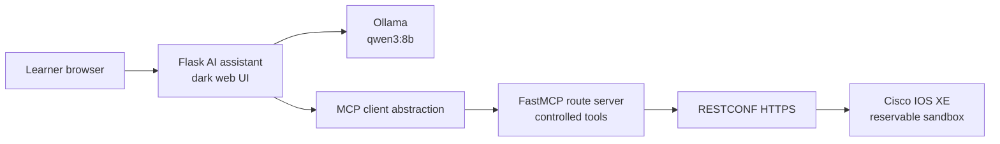
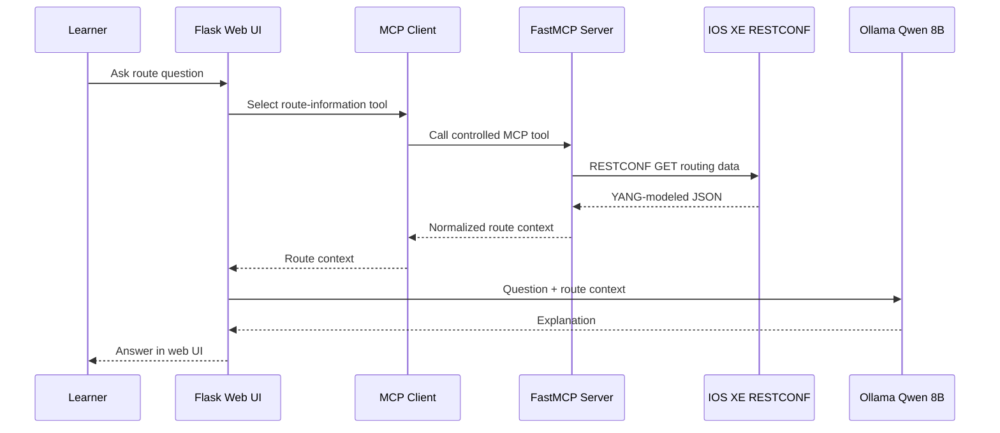

# Lab 15: Build an AI Network Route Assistant

## Lab Introduction

In this lab, learners build a small but realistic AI network assistant. The assistant runs on the learner workstation, displays a professional dark-theme web interface, asks a FastMCP tool layer for routing information, and uses a local Qwen 8B model through Ollama to answer route-focused questions. The FastMCP server is the component that retrieves live routing information from a Cisco IOS XE reservable sandbox router through RESTCONF.

The important design choice is that the language model and Flask application do not connect directly to the router. Instead, Flask asks an MCP client abstraction for route context, the MCP client calls controlled tools exposed by `mcp_server.py`, and the MCP server retrieves the route data through RESTCONF. This reinforces the Chapter 17 principle that AI should operate through narrow, auditable tools rather than unrestricted device access.

By the end of the lab, learners can ask questions such as:

- How many routes are in the routing table?
- Which routes are static?
- Which routes are connected?
- What are the next hops for the static routes?
- What is the metric for each route?
- Show the details for a specific prefix.

## Learning Objectives

- Install and run Ollama with a Qwen 8B model on the Ubuntu workstation.
- Build a Flask-based AI assistant web UI.
- Retrieve IOS XE routing information through a FastMCP tool layer that uses RESTCONF.
- Normalize route data from YANG-modeled JSON responses.
- Expose route-information tools with Python FastMCP.
- Use an LLM to explain live route data without giving the model direct router access.
- Recognize the security boundary between the AI assistant, MCP tools, credentials, and the network device.

## Lab Topology



The Flask application does not retrieve network data directly. It asks the MCP tool layer for route context, and the MCP server owns the RESTCONF interaction with IOS XE. This separation keeps the AI-facing application simple while preserving a clean operational boundary.

## Prerequisites

Before starting, learners should have:

- Ubuntu workstation prepared from Lab 1.
- Access to a Cisco IOS XE reservable sandbox.
- RESTCONF enabled on the sandbox router.
- Python virtual environment knowledge from earlier labs.
- Basic understanding of Chapter 17 MCP concepts.

The lab assumes the learner works under:

```bash
mkdir -p ~/ccnpauto-workspace
cd ~/ccnpauto-workspace
```

## Task 1: Create the Lab Repository on GitLab.com

Create a new GitLab.com project named `ai_route_assistant`. Then clone it to the workstation:

```bash
cd ~/ccnpauto-workspace
git clone git@gitlab.com:<your-namespace>/ai_route_assistant.git
cd ai_route_assistant
```

Copy the supplied Lab 15 files into the repository:

```bash
LAB15_FILES="/Users/thandoan/Documents/Presentations/CCNPAUTO/LAB/Lab15"
cp "$LAB15_FILES"/requirements.txt .
cp "$LAB15_FILES"/.env.example .
cp "$LAB15_FILES"/app.py .
cp "$LAB15_FILES"/restconf_routes.py .
cp "$LAB15_FILES"/mcp_client.py .
cp "$LAB15_FILES"/mcp_server.py .
mkdir -p templates static scripts
cp "$LAB15_FILES"/templates/index.html templates/
cp "$LAB15_FILES"/static/styles.css static/
cp "$LAB15_FILES"/static/app.js static/
cp "$LAB15_FILES"/scripts/check_lab15.py scripts/
```

The repository now contains a small web application, an MCP client abstraction, a FastMCP server, and a RESTCONF route backend used only behind the MCP server.

## Task 2: Prepare Python and Environment Variables

Create and activate a virtual environment:

```bash
python3 -m venv .venv
source .venv/bin/activate
python -m pip install --upgrade pip
python -m pip install -r requirements.txt
```

Create the real `.env` file from the example:

```bash
cp .env.example .env
nano .env
```

Update the values based on the Cisco IOS XE reservable sandbox reservation:

```text
IOSXE_HOST=<sandbox-management-ip-or-hostname>
IOSXE_RESTCONF_PORT=443
IOSXE_USERNAME=<sandbox-username>
IOSXE_PASSWORD=<sandbox-password>
IOSXE_VERIFY_TLS=false

OLLAMA_URL=http://127.0.0.1:11434
OLLAMA_MODEL=qwen3:8b
```

For a lab sandbox, `IOSXE_VERIFY_TLS=false` is commonly required because the device may present a self-signed certificate. In a production design, TLS verification should be enabled with a trusted CA bundle.

Protect local secrets from Git:

```bash
cat > .gitignore <<'EOF'
.env
.venv/
__pycache__/
*.pyc
EOF
```

## Task 3: Install and Start Ollama

Install Ollama from the official installer:

```bash
curl -fsSL https://ollama.com/install.sh -o /tmp/install-ollama.sh
sh /tmp/install-ollama.sh
```

If the workstation is behind a proxy or TLS inspection device, the download may fail with a certificate error. In that case, install the organization’s trusted CA certificate first, then retry the command. Do not permanently disable TLS verification for software installation.

Start and test Ollama:

```bash
ollama --version
ollama serve
```

Open a second terminal and pull the Qwen 8B model:

```bash
ollama pull qwen3:8b
ollama run qwen3:8b "Explain what a connected route is in one sentence."
```

If the workstation does not have enough memory to run `qwen3:8b` comfortably, confirm with the instructor before using a smaller model. The lab is written for Qwen 8B so that learners practice with the same model family.

## Task 4: Validate MCP-to-RESTCONF Reachability

From the project directory, load the environment and run the readiness check:

```bash
source .venv/bin/activate
set -a
source .env
set +a
python scripts/check_lab15.py
```

Then test the route path through the MCP client abstraction:

```bash
python - <<'PY'
from pprint import pprint
from mcp_client import call_route_tool

pprint(call_route_tool("get_route_summary"))
PY
```

The output should show a total route count and route counts grouped by protocol. This confirms that the MCP tool path can reach the RESTCONF backend. If the script reports that no supported route endpoint returned data, open Cisco YANG Suite and inspect the routing operational models supported by the current IOS XE sandbox release. IOS XE releases can differ in the exact operational YANG path used for RIB data.

## Task 5: Inspect the MCP and RESTCONF Boundary

Open `mcp_server.py`, `mcp_client.py`, and `restconf_routes.py` together. The Flask app calls `mcp_client.py`; the MCP client calls controlled route tools in `mcp_server.py`; and `mcp_server.py` imports the RESTCONF backend from `restconf_routes.py`. Therefore, the web assistant does not retrieve route data directly from IOS XE.

The MCP server exposes these tools:

```python
get_route_summary()
get_routes_by_protocol("static")
get_routes_by_protocol("connected")
get_route_detail("10.10.10.0/24")
get_all_routes()
```

This design keeps the AI prompt grounded in live data while preserving the right trust boundary. The LLM receives a JSON context produced by the MCP tool layer and is instructed to answer only from that context. The LLM does not receive the router password, does not send RESTCONF requests, and cannot create or change routes.

## Task 6: Start the FastMCP Route Server

Run the FastMCP server:

```bash
source .venv/bin/activate
set -a
source .env
set +a
python mcp_server.py
```

The server exposes three route tools:

| MCP tool | Purpose |
|---|---|
| `get_route_summary` | Returns total route count and counts grouped by protocol |
| `get_routes_by_protocol` | Returns static, connected, local, OSPF, or other matching routes |
| `get_route_detail` | Returns details for one exact destination prefix |
| `get_all_routes` | Returns all normalized routes collected through RESTCONF |

During development, learners can also inspect the server with the MCP SDK tooling:

```bash
mcp dev mcp_server.py
```

The point is not to give the model a generic command tool. The point is to expose controlled route-information tools that return structured data.

## Task 7: Run the Flask AI Assistant

In a separate terminal, start the Flask application:

```bash
source .venv/bin/activate
set -a
source .env
set +a
python app.py
```

Open the web interface:

```text
http://127.0.0.1:5050
```

The page should display a dark professional assistant interface. The left panel shows a live route summary returned by the MCP tool layer. The chat area lets learners ask route-related questions.

Ask:

```text
How many routes are in the routing table?
```

Then ask:

```text
Show me the static routes and next hops.
```

The Flask application selects the appropriate MCP tool, receives route context from the MCP layer, sends that context to Ollama, and returns a natural-language explanation. If the context does not include the requested detail, the assistant should say what is missing rather than inventing a route.

## Task 8: Understand the Assistant Workflow

The request path is intentionally simple:



This workflow avoids a risky pattern where the LLM directly decides which network endpoint to call. The MCP server is the deterministic software boundary that decides what data can be retrieved, how much data can be returned, and how RESTCONF errors are handled.

## Task 9: Ask Better Operational Questions

Good AI-assisted operations depend on good questions and good data. Try the following:

```text
List connected routes with their metrics.
```

```text
What next hops are used by the static routes?
```

```text
Show details for 0.0.0.0/0.
```

```text
Which protocols appear in the routing table?
```

If an answer seems vague, inspect the JSON context shown in the left panel. The assistant can only explain the data that was successfully retrieved and normalized from RESTCONF.

## Task 10: Commit the Lab Project

Commit the working project:

```bash
git status
git add .gitignore requirements.txt app.py restconf_routes.py mcp_client.py mcp_server.py templates static scripts
git commit -m "Build AI route assistant with Flask Ollama and FastMCP"
git push -u origin main
```

Confirm that `.env` was not committed:

```bash
git ls-files | grep '^.env$' || echo ".env is not tracked"
```

## Troubleshooting

| Symptom | Likely Cause | Action |
|---|---|---|
| `curl` cannot download Ollama | Missing CA certificate or proxy TLS inspection | Install trusted CA certificate and retry |
| `ollama run qwen3:8b` is slow | Workstation memory or CPU is limited | Close other services or ask instructor about a smaller model |
| Flask reports Ollama connection failure | Ollama service is not running | Start `ollama serve` |
| RESTCONF returns `401` or `403` | Wrong sandbox credentials | Check reservation details and `.env` |
| RESTCONF route endpoint returns `404` | IOS XE release uses a different YANG path | Use Cisco YANG Suite to inspect routing operational models |
| Assistant invents details | Prompt lacks enough route context or model is too creative | Keep temperature low and verify against JSON context |

## Key Takeaways

- A useful AI network assistant should be grounded in live operational data, not guesses.
- RESTCONF provides structured routing data that can be normalized by the MCP server before being sent to the model.
- FastMCP exposes controlled network-information tools and creates the safety boundary between the AI assistant and the network.
- The model should not receive device credentials or unrestricted access to network commands.
- A professional AI workflow still requires validation, least privilege, clear error handling, and human verification.

## References

- [Ollama](https://ollama.com/) - local model runtime.
- [Qwen Models on Ollama](https://ollama.com/library/qwen3) - Qwen model family availability in Ollama.
- [Model Context Protocol](https://modelcontextprotocol.io/) - MCP concepts and architecture.
- [MCP Python SDK](https://github.com/modelcontextprotocol/python-sdk) - Python SDK and FastMCP examples.
- [Cisco IOS XE RESTCONF Programmability](https://developer.cisco.com/docs/ios-xe/) - IOS XE programmability documentation.
- [Cisco YANG Suite](https://developer.cisco.com/yangsuite/) - YANG model discovery and RESTCONF/NETCONF testing.
