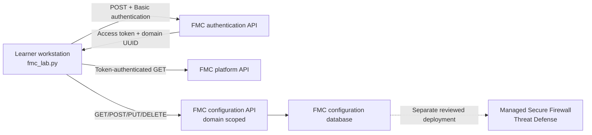
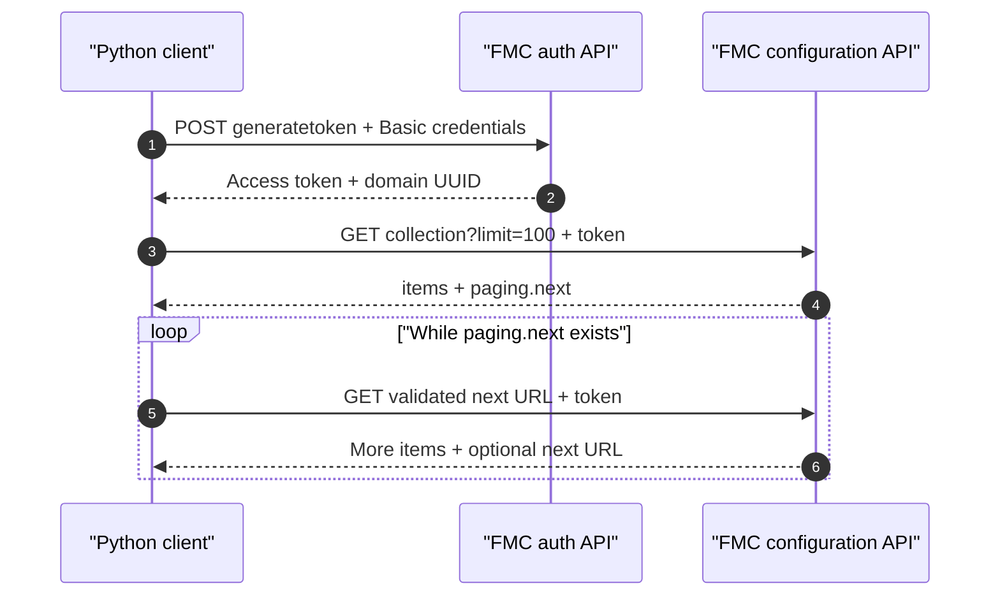
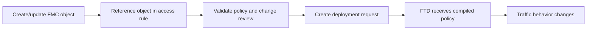

# Lab 15: Automate Cisco Secure Firewall Management Center

## Lab Introduction

Cisco Secure Firewall Management Center (FMC) centralizes objects, policies, managed Secure Firewall Threat Defense devices, health information, and deployment workflows. Its REST API exposes many of the same logical resources used by the graphical interface. Consequently, an automation application can inventory devices, inspect access control policy, create reusable objects, and prepare controlled changes without relying on screen scraping.

This lab begins with authentication and read-only discovery. Learners obtain a short-lived FMC access token, identify the domain UUID, follow paginated collections, inventory managed devices and access control policies, and export an ordered access-rule report. The final tasks perform a guarded create, read, update, and delete lifecycle on one network object whose name begins with `LAB15-`.

Creating an object changes the FMC configuration database, but it does not automatically alter packet handling on a managed firewall. A policy must reference that object, and the relevant policy must then be deployed to the appropriate device. Deployment is deliberately excluded from this shared training lab because it can interrupt traffic or affect other learners.

## Learning Objectives

After completing this lab, you will be able to:

- Explain FMC platform, configuration, domain, policy, and deployment API roles.
- Generate an FMC access token using HTTP Basic authentication.
- Retrieve the domain UUID returned during authentication.
- Protect FMC passwords and access tokens from source control and logs.
- Navigate FMC API Explorer for the active software release.
- Retrieve server, managed-device, and access-policy information.
- Follow FMC pagination links safely.
- Retrieve expanded access control rules in evaluation order.
- Interpret actions, enabled state, logging options, object references, and UUIDs.
- Export a sanitized access-rule inventory to CSV.
- Validate and create a lab-owned network object.
- Update and delete only the object owned by the lab.
- Distinguish saving an FMC change from deploying policy to a firewall.
- Diagnose authentication, authorization, validation, conflict, and timeout errors.

## Estimated Time

Allow approximately **3 to 4 hours**.

## Prerequisites

- Ubuntu 26.04 workstation prepared in Lab 1
- Active `ccnpauto` Python virtual environment or permission to create one
- Git and local GitLab access
- Cisco DevNet account
- Reserved Cisco Secure Firewall Management Center sandbox or instructor-provided FMC
- HTTPS reachability to the FMC management interface
- API-capable FMC user credentials
- Permission from the instructor before making configuration changes

The Cisco DevNet FMC sandbox is the preferred training target. Reservation details, credentials, topology, and software versions can change, so use the values shown in the active reservation rather than copying credentials from a static guide.

## Scenario

A security operations team is reviewing an access control policy before a branch rollout. The team needs a reproducible inventory of managed devices and current rule order. It also wants to prove that an automation account can manage reusable network objects without deploying an unreviewed firewall policy.

The learner acts as the automation engineer. Read-only information is collected first. The learner then creates `LAB15-NETWORK`, confirms the UUID assigned by FMC, changes its network value, and deletes it. Every write is protected by an explicit environment switch and a naming boundary.

## Architecture and API Workflow



FMC uses different API roots for platform information and domain-scoped configuration. Most configuration endpoints include the domain UUID:

```text
/api/fmc_platform/v1/...
/api/fmc_config/v1/domain/{domainUUID}/...
```

The access token authorizes subsequent requests. The domain UUID identifies the administrative domain containing devices, policies, and objects. A UUID is a stable API identity; a display name is not a safe substitute because names can be duplicated or changed.

## Project Structure

```text
Lab15/
├── .env.example
├── .gitignore
├── Lab15.md
├── README.md
├── fmc_client.py
├── fmc_lab.py
├── pytest.ini
├── requirements.txt
└── tests/
    └── test_fmc_lab.py
```

## Task 1: Reserve and Inspect the FMC Environment

Reserve the Cisco Secure Firewall Management Center sandbox and establish its required VPN connection. Record:

| Item | Reservation value |
|---|---|
| FMC hostname or address | |
| HTTPS port | `443` unless stated otherwise |
| Username | |
| Password | Stored only in `.env` |
| Managed FTD name | |
| FMC software version | |

Open the FMC graphical interface in a browser and confirm that the credentials work. Do not change policy yet. Locate the managed device and access control policy so the later API response has familiar context.

In FMC, open the API Explorer from the help or integration area. API Explorer is generated for the installed release and is therefore a better authority than examples written for another version. Locate these resources:

```text
Authentication token
Server version
Device records
Access policies
Access rules
Network objects
Deployable devices
```

Record the HTTP method, URI, required UUIDs, supported query parameters, and expected response code for each resource.

## Task 2: Create the GitLab Project and Environment

Create a private GitLab project named `lab15-fmc-api`, clone it, and copy the supplied files. Then prepare Python:

```bash
cd ~/ccnpauto-workspace/lab15-fmc-api
python3 -m venv .venv
source .venv/bin/activate
python -m pip install --upgrade pip
python -m pip install -r requirements.txt
python -m pip check
pytest -q
```

The tests validate the lab ownership prefix, canonical network syntax, and pagination-origin protection without contacting FMC.

Create the protected environment file:

```bash
cp .env.example .env
chmod 600 .env
```

Enter the reservation information:

```dotenv
FMC_HOST=<reserved-fmc-host>
FMC_PORT=443
FMC_USERNAME=<api-username>
FMC_PASSWORD=<api-password>
FMC_VERIFY_TLS=false
FMC_TIMEOUT=30
FMC_DOMAIN_UUID=
FMC_ACCESS_POLICY_ID=
LAB_OBJECT_NAME=LAB15-NETWORK
LAB_OBJECT_VALUE=198.18.15.0/24
ALLOW_FMC_CHANGES=false
```

The sandbox commonly uses a certificate that the workstation does not trust, so verification is disabled for this isolated lab. Production automation should trust the organizational CA and set `FMC_VERIFY_TLS=true`.

Confirm that `.env` is ignored before committing:

```bash
git status --ignored
git check-ignore -v .env
```

## Task 3: Generate an FMC Authentication Token Manually

Before running Python, observe the authentication exchange with `curl`. Load the protected variables into the current shell:

```bash
set -a
source .env
set +a
```

Request a token while writing headers to a protected temporary file:

```bash
umask 077
curl -sk -D /tmp/fmc-auth-headers.txt -o /dev/null \
  -u "$FMC_USERNAME:$FMC_PASSWORD" \
  -X POST \
  "https://$FMC_HOST:$FMC_PORT/api/fmc_platform/v1/auth/generatetoken"
```

Inspect only the header names, not their secret values:

```bash
cut -d: -f1 /tmp/fmc-auth-headers.txt
```

A successful response includes headers such as:

```text
X-auth-access-token
X-auth-refresh-token
DOMAIN_UUID
```

The initial request uses Basic authentication over HTTPS. Subsequent requests use `X-auth-access-token`. The token must be protected like a password because it represents the authenticated user's authority. Delete the temporary file immediately:

```bash
shred -u /tmp/fmc-auth-headers.txt 2>/dev/null || rm -f /tmp/fmc-auth-headers.txt
unset FMC_PASSWORD
```

The Python client performs the same exchange internally and never prints either token.

## Task 4: Understand the Python Client

Open `fmc_client.py`. `FMCClient` creates one persistent `requests.Session`, exchanges credentials for a token, and adds the token to future requests. If `FMC_DOMAIN_UUID` is empty, it uses the domain returned in the authentication response.

The `request()` method centralizes four controls:

- connection and read timeouts;
- accepted HTTP status codes;
- short, controlled error messages; and
- JSON request headers.

The `get_all()` method follows `paging.next` until FMC returns no next link. It also rejects a next link pointing to a different origin. Although pagination URLs originate from FMC, validating their scheme and authority prevents an API response from redirecting the authenticated session to an unexpected server.



## Task 5: Inventory FMC and Managed Devices

Run the read-only inventory:

```bash
python fmc_lab.py inventory
```

The report displays server information, managed devices, and access control policies. Compare the API results with the FMC graphical interface.

For each managed device, identify:

- display name and hostname;
- platform or model;
- health status when returned;
- device UUID.

For each access policy, record its name and UUID. If the sandbox contains several policies, do not assume the first one is the intended target. Copy the chosen policy UUID into `.env`:

```dotenv
FMC_ACCESS_POLICY_ID=<chosen-policy-uuid>
```

## Task 6: Retrieve and Interpret Access Rules

Retrieve expanded rules for the selected policy:

```bash
python fmc_lab.py rules
```

FMC evaluates access control rules in order. The report therefore includes `metadata.ruleIndex` alongside name, action, enabled state, logging flags, and UUID.

Interpret several rules in the FMC interface and raw expanded response. Important properties include:

| Property | Meaning |
|---|---|
| `name` | Human-readable rule name |
| `id` | Stable rule UUID used by API operations |
| `action` | Permit, trust, block, monitor, or another supported action |
| `enabled` | Whether the rule participates in evaluation |
| `metadata.ruleIndex` | Position in policy evaluation order |
| `sourceNetworks` | Source network object references or literals |
| `destinationNetworks` | Destination network object references or literals |
| `sourceZones` / `destinationZones` | Security-zone constraints |
| `applications` | Application detector criteria |
| `logBegin` / `logEnd` | Connection logging behavior |

An object reference typically contains a type, UUID, and name. The reference does not duplicate the object's complete definition. Resolving all references requires additional API requests, so production reporting should cache objects rather than request the same UUID once per rule.

## Task 7: Export the Rule Inventory

Create a sanitized CSV report:

```bash
python fmc_lab.py export-rules
column -s, -t < output/access_rules.csv | less -S
```

The report deliberately includes only rule order, name, action, enabled state, logging flags, and UUID. It excludes tokens, credentials, and detailed network information. Before sharing a firewall report, consider whether names and UUIDs disclose security architecture.

Check that the CSV row order matches the FMC interface. Then inspect Git status:

```bash
git status --short
```

The `output/` directory is ignored because reports describe live security state and may become stale or sensitive.

## Task 8: Preview the Lab-Owned Network Object

Search for the object without changing FMC:

```bash
python fmc_lab.py show-object
```

The name must begin with `LAB15-`, and the value must be a canonical network such as `198.18.15.0/24`. The documentation-only benchmark range is used to avoid accidentally representing a real enterprise subnet.

The script stops if more than one exact-name match exists. Automation should not guess which duplicate object it owns.

## Task 9: Create the Network Object

Obtain instructor approval and ensure no other learner is using the same FMC domain and object name. Enable writes:

```dotenv
ALLOW_FMC_CHANGES=true
```

Create the object:

```bash
python fmc_lab.py create-object
python fmc_lab.py show-object
```

FMC should return HTTP 201 and assign a UUID. Confirm the name, value, type, description, and UUID in both API output and the graphical interface.

Run `create-object` again. The script should stop before issuing a duplicate POST because the exact object already exists. This makes the learner workflow safer and demonstrates a basic idempotency check.

## Task 10: Update the Network Object

Change only the lab object's network value:

```bash
python fmc_lab.py update-object --new-value 198.18.16.0/24
python fmc_lab.py show-object
```

The client sends a PUT to the object-specific URI containing its UUID. FMC does not generally support PATCH for these resources, so a client must understand which fields are required for replacement or update. The supplied method preserves the object's identity, name, type, and description while changing the value.

Try an invalid host-bit network:

```bash
python fmc_lab.py update-object --new-value 198.18.16.1/24
```

Python should reject it before FMC receives a request. Client-side validation improves feedback and reduces unnecessary API traffic, although server-side validation remains authoritative.

## Task 11: Understand Policy Reference and Deployment

The network object now exists in FMC, but no access rule references it. Even if a rule did reference it, managed FTD packet handling would remain unchanged until deployment.



Deployment is a distinct operation because FMC may contain pending changes for multiple users and policies. A careless deployment request can push unrelated work or disrupt traffic. For this reason, Lab 15 only inspects deployment readiness through the GUI or API Explorer and does not send a deployment POST.

In API Explorer, locate deployable devices and deployment requests. Record the data required for a deployment request, but do not execute it in a shared sandbox.

## Task 12: Delete the Lab Object

Because no rule should reference the object, delete it:

```bash
python fmc_lab.py delete-object
python fmc_lab.py show-object
```

The DELETE request targets the object UUID and expects HTTP 204. Run the delete action again; the script reports that the object is already absent instead of attempting to delete an unknown resource.

Return the write guard to its safe default:

```dotenv
ALLOW_FMC_CHANGES=false
```

Confirm in the FMC interface that `LAB15-NETWORK` is absent and that no deployment was started.

## Task 13: Interpret Common API Failures

Temporarily introduce one controlled error at a time and restore the correct value afterward.

| HTTP status or symptom | Typical meaning | Investigation |
|---|---|---|
| 400 | Invalid JSON, unsupported field, or validation error | Read response details and compare with API Explorer schema |
| 401 | Missing, invalid, or expired token | Reauthenticate; verify credentials and token handling |
| 403 | Authenticated user lacks permission | Check FMC role, domain, and endpoint authority |
| 404 | Wrong domain, policy, object UUID, or API path | Confirm UUIDs and active FMC release |
| 409 | Duplicate object or conflicting state | Search by exact name and inspect references |
| 422 | Semantically invalid object or requested operation | Correct value/type relationships |
| 429 | API rate limit reached | Honor server guidance and use bounded backoff |
| Timeout | VPN, DNS, certificate, service load, or reachability problem | Test HTTPS separately and avoid immediate infinite retries |

Do not log the complete authentication response headers. A useful audit log records UTC time, user identity, action, resource type, object UUID, response status, and correlation information without recording passwords or access tokens.

## Task 14: Review Production Design Improvements

The lab client is intentionally compact. A production FMC integration should add:

- trusted CA validation rather than `verify=False`;
- secrets from Vault or another approved secret manager;
- a dedicated least-privilege API account;
- bounded token renewal and retry logic;
- rate-limit handling with jittered backoff;
- structured audit logging with token redaction;
- change tickets and human approval before policy mutation;
- optimistic concurrency or current-state checks before PUT and DELETE;
- schema/version compatibility tests for every supported FMC release;
- dry-run plans showing object, rule, order, and deployment impact;
- post-deployment verification and rollback procedures.

Firewall automation has a larger blast radius than an ordinary inventory script. Fluent Python and an HTTP 2xx response do not prove that a policy is secure. Security intent, rule ordering, object scope, logging, inspection policy, and deployment targets all require review.

## Troubleshooting Guide

| Symptom | Likely cause | Corrective action |
|---|---|---|
| Browser works but Python cannot connect | VPN route, proxy, or hostname difference | Test `curl -vk https://FMC_HOST/` from the same shell |
| Authentication returns 401 | Incorrect reservation credentials or API-disabled user | Verify UI login and FMC user role |
| No `DOMAIN_UUID` header | Release/account behavior differs | Inspect API Explorer and set `FMC_DOMAIN_UUID` explicitly |
| Inventory lists no devices | Wrong domain or sandbox initialization incomplete | Verify domain and managed-device registration in FMC |
| Rules require a policy ID | `FMC_ACCESS_POLICY_ID` is empty or incorrect | Copy the UUID printed by `inventory` |
| Repeated pagination detected | Unexpected FMC next link or API issue | Stop; inspect sanitized paging metadata |
| Create is blocked | Write guard remains false | Obtain approval, review values, then enable the guard |
| Create reports duplicate | Object already exists | Use `show-object`; do not create a second object |
| Update returns validation error | Required field or format differs by release | Compare the PUT schema in the local API Explorer |
| Delete reports object in use | A policy references the object | Do not force deletion; identify and review references |

## Cleanup and Repository Check

Verify that the object is absent, writes are disabled, and no credentials are staged:

```bash
python fmc_lab.py show-object
grep '^ALLOW_FMC_CHANGES=' .env
git status --short
git check-ignore -v .env output/access_rules.csv
```

Commit only source files and documentation:

```bash
git add .gitignore .env.example README.md Lab15.md \
  requirements.txt pytest.ini fmc_client.py fmc_lab.py tests
git commit -m "Add FMC REST API lab"
git push -u origin main
```

End the sandbox reservation when finished.

## Key Takeaways

- FMC authentication exchanges Basic credentials for short-lived token headers.
- Most configuration resources are scoped by a domain UUID.
- Collection endpoints must be paginated; one response may not contain every object.
- Rule index is operationally important because access control policy is order dependent.
- Expanded rule responses contain conditions and references, whereas compact responses may contain only summaries.
- POST creates, PUT updates, and DELETE removes resources; PATCH is not generally supported by FMC REST resources.
- A saved FMC object or rule is not the same as a deployed firewall policy.
- Naming boundaries, validation, dry-run behavior, and explicit write guards reduce automation risk.
- Tokens, passwords, policy reports, and firewall topology require careful handling.

The next platform lab applies similar API discipline to Meraki's cloud-managed hierarchy, where organization scope, pagination, and shared rate limits become central concerns.

## References and Further Reading

- [Cisco Secure Firewall APIs](https://developer.cisco.com/secure-firewall/)
- [Cisco FMC API resources](https://developer.cisco.com/secure-firewall/management-center/)
- [Cisco Secure FMC REST API Quick Start Guide 7.7](https://www.cisco.com/c/en/us/td/docs/security/firepower/770/API/REST/secure_firewall_management_center_rest_api_quick_start_guide_770.html)
- [FMC REST API objects, request methods, pagination, and rate limiting](https://www.cisco.com/c/en/us/td/docs/security/firepower/770/API/REST/secure_firewall_management_center_rest_api_quick_start_guide_770/Objects_In_The_REST_API.html)
- Use the API Explorer built into the reserved FMC for schemas that match its installed release.

