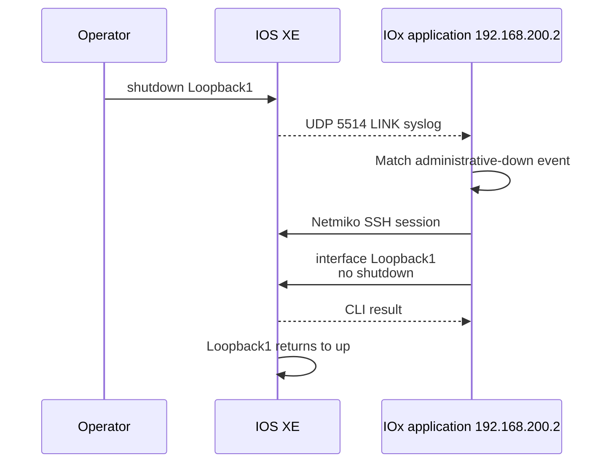

# Optional Lab 15: Host a Loopback Recovery Application on IOS XE

## Lab Introduction

A branch router uses `Loopback1` as a stable management and routing identifier. If an administrator accidentally enters `shutdown` under the interface, routing adjacencies and monitoring can be affected. In this lab, learners host a small closed-loop remediation application directly on an IOx-capable IOS XE router.

The application runs as a Docker container with its own IP address. IOS XE sends native syslog directly to the container. When the service recognizes the `%LINK` message indicating that `Loopback1` became administratively down, it uses Netmiko to open an SSH session to IOS XE and sends `interface Loopback1` followed by `no shutdown`.

The lab intentionally remains simple. The application does not store audit files, does not use EEM, and does not run through Guest Shell. Runtime messages are visible through the application console and container output only.

## Learning Objectives

- Package a Python service as a Cisco IOx Docker application.
- Give the application its own routed address through `VirtualPortGroup0`.
- Send IOS XE syslog directly to the hosted service.
- Recognize a specific interface shutdown message.
- Use Netmiko to apply `no shutdown` to a specific interface.
- Verify a complete observe, decide, act, and verify workflow.
- Operate and remove an IOx application safely.

## Application Flow


```mermaid
sequenceDiagram
    participant O as Operator
    participant R as IOS XE
    participant A as IOx application 192.168.200.2

    O->>R: shutdown Loopback1
    R-->>A: UDP 5514 LINK syslog
    A->>A: Match administrative-down event
    A->>R: Netmiko SSH session
    A->>R: interface Loopback1<br/>no shutdown
    R-->>A: CLI result
    R->>R: Loopback1 returns to up
```

## Supplied Files

```text
Lab15/
├── .dockerignore
├── .gitignore
├── Dockerfile
├── Lab15.md
├── loopback_recovery.py
├── package.yaml
├── package_config.ini
├── requirements.txt
├── scripts/
│   └── send_test_syslog.py
└── tests/
    └── test_loopback_recovery.py
```

## Prerequisites and Platform Boundary

- Ubuntu workstation prepared in Lab 1.
- Docker and `ioxclient`.
- A dedicated IOx-capable IOS XE application-hosting platform.
- Permission to install a custom application and change `Loopback1`.
- An IOS XE account dedicated to the lab application.

Not every Cisco IOS XE sandbox supports custom application hosting. First verify `show iox`, `show app-hosting infra`, and `show app-hosting list`. Recent platforms may require signed application packages. Do not disable signature enforcement; use an instructor-approved signing workflow or compatible development platform.

This lab uses the following isolated subnet unless it conflicts with the selected router:

| Component | Address |
|---|---:|
| IOS XE `VirtualPortGroup0` | `192.168.200.1/30` |
| IOx application `eth0` | `192.168.200.2/30` |

## Task 1: Create the Repository

Create a private GitLab.com project named `optional_lab15_iosxe_app_hosting`. Clone it under `~/ccnpauto-workspace`, then use VS Code to copy and paste the contents of `CCNPAUTO/LAB/Lab15/` into the repository.

The supplied `.gitignore` excludes `package_config.ini`, package archives, caches, and local runtime data. The configuration file contains a password after Task 5 and must never be committed.

## Task 2: Install the Python Dependencies and Run Tests

```bash
python3 -m venv .venv
source .venv/bin/activate
python -m pip install --upgrade pip
python -m pip install -r requirements.txt
python -m py_compile loopback_recovery.py scripts/send_test_syslog.py
python -m pytest -q
```

The tests confirm that the parser reacts only to the `Loopback1` administrative-down event and that Netmiko receives this command list:

```text
interface Loopback1
no shutdown
```

The test also confirms that the SSH session disconnects after the change.

## Task 3: Review the Application

Open `loopback_recovery.py`. The service accepts syslog only from `192.168.200.1` and ignores every event except:

```text
%LINK-5-CHANGED: Interface Loopback1, changed state to administratively down
```

The recovery class builds a familiar Netmiko device dictionary and passes it to `ConnectHandler(**device)`. It then calls:

```python
connection.send_config_set(
    ["interface Loopback1", "no shutdown"]
)
```

Because the command changes only the administrative state, the existing description and IP address remain unchanged. The script verifies the interface with `show interfaces Loopback1 | include line protocol` and always disconnects in a `finally` block.

## Task 4: Prepare IOS XE

Verify IOx and enable the required services:

```text
show iox
show app-hosting infra
show app-hosting list
configure terminal
iox
end
```

Create a lab-only account. Replace the sample secret with a unique password:

```text
configure terminal
username apphost privilege 15 secret <unique-lab-password>
end
```

Privilege 15 keeps the optional exercise straightforward. A production system should use an AAA command policy restricted to the required interface commands.

Confirm that the SSH server is available:

```text
show ip ssh
```

The router already uses SSH for learner access in most application-hosting environments. If SSH is disabled, configure the platform’s approved hostname, domain name, RSA key, and SSH version before continuing.

Prepare `Loopback1` without changing an existing address:

```text
show running-config interface Loopback1
configure terminal
interface Loopback1
 logging event link-status
 no shutdown
end
```

If the interface does not exist, create it only with an instructor-approved address.

## Task 5: Configure the Application

Open `package_config.ini` and replace only the password:

```ini
[router]
host = 192.168.200.1
port = 22
username = apphost
password = <unique-lab-password>
device_type = cisco_ios
timeout = 10
```

IOx exposes the bootstrap file through `CAF_APP_CONFIG_FILE`. The application reads that location at startup. Do not commit the edited file or place the password in `Dockerfile`, `package.yaml`, or Python code.

## Task 6: Build and Package the Application

The architecture required here is the IOS XE application-hosting architecture, which can differ from the learner workstation architecture. Check it on the router:

```text
show app-hosting infra
```

When the output reports `x86_64`, set `cpuarch: x86_64` in `package.yaml` and build the x86-64/AMD64 image:

```bash
docker build \
  --platform linux/amd64 \
  -t loopback1-auto-recovery:1.0 .
ioxclient docker package loopback1-auto-recovery:1.0 .
tar -tf package.tar
```

When the output reports `aarch64`, set `cpuarch: aarch64` in `package.yaml` and build the ARM64 image:

```bash
docker build \
  --platform linux/arm64 \
  -t loopback1-auto-recovery:1.0 .
ioxclient docker package loopback1-auto-recovery:1.0 .
tar -tf package.tar
```

Docker BuildKit can build for a target architecture different from the workstation only when the required builder and emulation support are available. Whenever possible, build natively for the architecture reported by IOS XE. Do not package an ARM64 image for an `x86_64` IOx host or an AMD64 image for an `aarch64` IOx host.

Sign the resulting package when the device enforces application signatures. Never commit or share the signing private key.

## Task 7: Transfer the Package

Enable SCP only when permitted:

```text
configure terminal
ip scp server enable
end
```

From Ubuntu:

```bash
export IOSXE_HOST=<router-address>
export IOSXE_SSH_PORT=<ssh-port>
export IOSXE_USERNAME=<administrator-username>

scp -O -P "$IOSXE_SSH_PORT" \
  package.tar \
  "$IOSXE_USERNAME@$IOSXE_HOST:loopback1-auto-recovery.tar"
```

Verify it on the router:

```text
dir bootflash:loopback1-auto-recovery.tar
```

## Task 8: Configure the Application Address

```text
configure terminal
interface VirtualPortGroup0
 description LAB18_IOX_GATEWAY
 ip address 192.168.200.1 255.255.255.252
 no shutdown
exit
app-hosting appid loopback1-recovery
 app-vnic gateway0 virtualportgroup 0 guest-interface 0
  guest-ipaddress 192.168.200.2 netmask 255.255.255.252
 exit
 app-default-gateway 192.168.200.1 guest-interface 0
end
```

If the platform uses different vNIC syntax, follow its application-hosting configuration guide rather than guessing.

## Task 9: Install and Start the Application

```text
app-hosting install appid loopback1-recovery package bootflash:loopback1-auto-recovery.tar
app-hosting activate appid loopback1-recovery
app-hosting start appid loopback1-recovery
show app-hosting list
show app-hosting detail appid loopback1-recovery
```

Connect to the application:

```text
app-hosting connect appid loopback1-recovery session
```

Inside the container, verify `eth0`, UDP port `5514`, and the Python process:

```bash
ip address show eth0
ss -lun
ps
```

Exit the container.

## Task 10: Send Syslog Directly to the Application

```text
configure terminal
service timestamps log datetime msec show-timezone year
logging trap notifications
logging source-interface VirtualPortGroup0
logging host 192.168.200.2 transport udp port 5514
end
```

Verify:

```text
show running-config | section ^logging
show logging
```

No EEM applet is required. IOS XE sends the interface event directly to the application IP.

## Task 11: Test Closed-Loop Recovery

Open one session for the interface change and another for observation. Enter:

```text
configure terminal
interface Loopback1
 shutdown
end
```

Within a few seconds, the application should receive the syslog, open an SSH session to IOS XE, and apply `no shutdown`. Verify:

```text
show interfaces Loopback1
show running-config interface Loopback1
show logging | include Loopback1
```

The running configuration must not contain `shutdown`, and the interface should return to `up/up`. Enter the application session and review its runtime messages. A successful cycle reports the detected shutdown, Netmiko configuration output, and interface verification.

If the interface remains down, troubleshoot in this order:

1. Confirm the application is `RUNNING`.
2. Confirm IOS XE generated the `%LINK` message.
3. Confirm the syslog source and destination configuration.
4. Confirm the container listens on UDP `5514`.
5. Confirm the application configuration contains the correct password.
6. Confirm IOS XE accepts SSH from `192.168.200.2`.
7. Inspect authentication, timeout, configuration, and verification messages.

## Task 12: Clean Up

Remove only this syslog destination, application, account, and package:

```text
configure terminal
no logging host 192.168.200.2 transport udp port 5514
no username apphost
end
app-hosting stop appid loopback1-recovery
app-hosting deactivate appid loopback1-recovery
app-hosting uninstall appid loopback1-recovery
configure terminal
no app-hosting appid loopback1-recovery
no interface VirtualPortGroup0
end
delete /force bootflash:loopback1-auto-recovery.tar
```

Do not disable IOx or SSH when another lab, management workflow, or hosted application requires them.

## Key Takeaways

- A true hosted application has its own process, lifecycle, resources, vNIC, and IP address.
- Native IOS XE syslog can trigger a small closed-loop remediation service without EEM.
- Netmiko can apply the small CLI change through a standard device dictionary.
- Narrow event matching and source validation prevent unrelated syslog from triggering configuration.
- Runtime verification must cover the event, application, SSH action, and final interface state.

## Further Reading

- [Cisco IOS XE Application Hosting](https://www.cisco.com/c/en/us/td/docs/ios-xml/ios/prog/configuration/1717/b_1717_programmability_cg/application-hosting.html)
- [Cisco IOx Package Descriptor](https://developer.cisco.com/docs/iox/package-descriptor/)
- [Netmiko Documentation](https://ktbyers.github.io/netmiko/)
