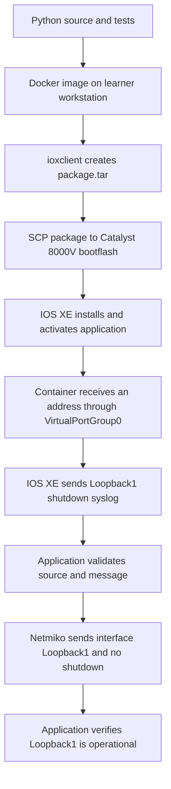

# Optional Lab 15: Host a Python Application on a Catalyst 8000V Router

## Lab Introduction

Network automation normally runs from a workstation, runner, or controller. However, some operational functions benefit from running close to the network device. An application hosted directly on an IOS XE router can receive local events and respond without waiting for an external automation platform.

In this optional lab, learners use the **reservable Cisco Catalyst 8000V DevNet Sandbox** as the application-hosting platform. They build a small Python service as a Docker image, convert it into an IOx package with `ioxclient`, copy the package to router storage, and control its lifecycle with IOS XE `app-hosting` commands.

The application listens for a syslog message reporting that `Loopback1` was administratively shut down. After validating the event source and message, it connects back to the hosting router with Netmiko, enters the interface configuration, applies `no shutdown`, and verifies the resulting state. The exercise demonstrates a compact closed-loop workflow while keeping the remediation deliberately narrow.

This is no longer a Local Manager exercise. The Catalyst 8000V router itself installs, activates, starts, monitors, stops, and uninstalls the application through IOS XE CLI.

## Learning Objectives

- Explain the IOS XE and IOx application-hosting lifecycle.
- Install `ioxclient` for an x86-64 or ARM64 learner workstation.
- Build an x86-64 Docker image for Catalyst 8000V.
- Package a Docker image as an IOx application.
- Connect the hosted application through a `VirtualPortGroup` interface.
- Transfer and install an application package on IOS XE.
- Configure Docker runtime environment variables with `app-hosting` CLI.
- Verify a closed loop from syslog detection through Netmiko remediation.
- Remove application resources and temporary credentials safely.

## End-to-End Flow


```mermaid
flowchart TD
    A["Python source and tests"] --> B["Docker image on learner workstation"]
    B --> C["ioxclient creates package.tar"]
    C --> D["SCP package to Catalyst 8000V bootflash"]
    D --> E["IOS XE installs and activates application"]
    E --> F["Container receives an address through VirtualPortGroup0"]
    F --> G["IOS XE sends Loopback1 shutdown syslog"]
    G --> H["Application validates source and message"]
    H --> I["Netmiko sends interface Loopback1 and no shutdown"]
    I --> J["Application verifies Loopback1 is operational"]
```

The router and hosted application use an internal subnet. The following addresses are examples; learners must first inspect the reserved router and avoid addresses already assigned to Guest Shell or another application.

```text
Catalyst 8000V VirtualPortGroup0: 192.168.35.1/24
Hosted application eth0:         192.168.35.103/24
Default gateway and SSH target:  192.168.35.1
Syslog destination:              192.168.35.103 UDP/5514
```

## Supplied Files

```text
Lab15/
├── .dockerignore
├── .gitignore
├── Dockerfile
├── Lab15.md
├── loopback_recovery.py
├── package.yaml
├── package_config.ini
├── requirements.txt
├── scripts/
│   └── send_test_syslog.py
└── tests/
    └── test_loopback_recovery.py
```

`package_config.ini` supports local container testing. On the router, IOS XE passes the deployment settings to the container through Docker environment variables.

## Task 1: Reserve and Inspect the Catalyst 8000V

1. Sign in to Cisco DevNet Sandbox.
2. Reserve the **Cisco Catalyst 8000V** sandbox.
3. Wait until the reservation is active and connect through the supplied VPN.
4. Record the IOS XE hostname or address, SSH port, username, and password from the reservation.
5. Open an SSH session to the router and enter privileged EXEC mode.

Inspect the platform before changing it:

```text
show version
show iox
show app-hosting list
show app-hosting resource
show ip interface brief | include VirtualPortGroup
show running-config | section app-hosting
dir bootflash:
```

Proceed only when `show iox` reports that the application-hosting infrastructure is running and sufficient memory, CPU, and bootflash space are available. Existing applications belong to the sandbox environment or another activity; do not stop, alter, or remove them.

If `VirtualPortGroup0` already exists, record its address and subnet. Do not overwrite it. If Guest Shell or another application already uses an address in that subnet, select a different unused guest address for this application.

## Task 2: Prepare the Repository and Test the Code

Create a private GitLab.com project named `optional_lab15_c8000v_app_hosting`. Clone it under `~/ccnpauto-workspace`, then use VS Code to copy the supplied Lab 15 files into the cloned folder.

Create the Python environment and run the supplied checks:

```bash
python3 -m venv .venv
source .venv/bin/activate
python -m pip install --upgrade pip
python -m pip install -r requirements.txt
python -m py_compile loopback_recovery.py scripts/send_test_syslog.py
python -m pytest -q
```

The tests confirm that only a `Loopback1` administrative-down event triggers remediation. They also confirm that Netmiko receives `interface Loopback1` and `no shutdown`, verifies the interface state, and disconnects cleanly. Mocked connections ensure that these local tests cannot modify the sandbox router.

## Task 3: Install and Initialize `ioxclient`

`ioxclient` is Cisco's packaging and lifecycle utility for IOx applications. It is a standalone executable, not a Python package.

Identify the learner workstation architecture:

```bash
uname -m
dpkg --print-architecture
```

| Result | Cisco download to select |
|---|---|
| `x86_64` or `amd64` | Linux x86-64 |
| `aarch64` or `arm64` | Linux ARM64 |

Open [Cisco IOx Resource Downloads](https://developer.cisco.com/docs/iox/iox-resource-downloads/) and download the current Linux `ioxclient` binary matching the workstation. The workstation binary may be ARM64 even though the application image built for Catalyst 8000V must be x86-64.

Extract the downloaded archive through Ubuntu Files, open a terminal in the extracted directory, and install the binary:

```bash
file ioxclient
chmod +x ioxclient
./ioxclient --version
sudo install -m 0755 ioxclient /usr/local/bin/ioxclient
ioxclient --version
```

Use `sudo` only for writing to `/usr/local/bin`; ordinary `ioxclient` commands should run as the learner account. An `Exec format error` means the wrong workstation architecture was downloaded.

Confirm Docker access and initialize the local Docker socket used during packaging:

```bash
docker version
ioxclient docker init
```

Accept `unix:///var/run/docker.sock` and the detected/default Docker API version. Unlike the earlier IOx sandbox design, this lab does not create an `ioxclient` platform profile because application lifecycle operations are performed directly from IOS XE CLI.

## Task 4: Review Configuration and Credential Handling

Open `loopback_recovery.py`. The application accepts router settings through these environment variables:

```text
ROUTER_HOST
ROUTER_PORT
ROUTER_USERNAME
ROUTER_PASSWORD
ROUTER_DEVICE_TYPE
ROUTER_TIMEOUT
ROUTER_SYSLOG_SOURCE
```

When those variables are absent during local development, the application falls back to `package_config.ini`. This file is ignored by Git and excluded from the Docker build.

For this isolated sandbox exercise, IOS XE Docker run options provide a temporary local account to the container. This makes the password visible to privileged administrators in the router configuration, so it is not an acceptable production secret-management design. Production deployments should use a supported secret injection mechanism, short-lived credentials, external authorization, and least privilege.

Choose a temporary lab password containing letters and numbers but no spaces or quotation marks. Do not reuse the reservation, GitLab, Vault, or personal password. The account and all run options are removed during cleanup.

## Task 5: Prepare the Internal Application Network

First inspect `VirtualPortGroup0`:

```text
show running-config interface VirtualPortGroup0
show ip interface brief | include VirtualPortGroup
show running-config | section app-hosting
```

If `VirtualPortGroup0` is already configured, reuse its gateway and subnet without changing them. Select an unused address for the new application. The remaining examples assume the gateway is `192.168.35.1/24` and the unused application address is `192.168.35.103`.

Only when `VirtualPortGroup0` does not exist, create it:

```text
configure terminal
interface VirtualPortGroup0
 ip address 192.168.35.1 255.255.255.0
 no shutdown
end
```

Create the temporary account and make the router send relevant syslog messages to the application:

```text
configure terminal
username apphost privilege 15 secret <TEMPORARY-LAB-PASSWORD>
ip ssh version 2
logging source-interface VirtualPortGroup0
logging host 192.168.35.103 transport udp port 5514
logging trap informational
end
```

Replace the password placeholder rather than entering the angle brackets. If the existing `VirtualPortGroup0` uses another address, substitute that actual gateway throughout the remaining tasks. Likewise, change the syslog destination when a different unused guest address was selected.

## Task 6: Build and Test the x86-64 Container

Catalyst 8000V is the target platform, so build an x86-64 image even when the learner workstation is ARM64:

```bash
docker build \
  --platform linux/amd64 \
  -t loopback1-auto-recovery:1.0 .
```

Confirm the resulting image architecture:

```bash
docker image inspect loopback1-auto-recovery:1.0 \
  --format '{{.Architecture}}'
```

The expected value is `amd64`.

Optionally run it locally with controlled values. Use the real sandbox password only when the VPN is active and the workstation is authorized to reach the reservation:

```bash
docker run --rm --name loopback-recovery-test \
  -p 15514:5514/udp \
  -e ROUTER_HOST='<IOSXE-HOST>' \
  -e ROUTER_PORT='<IOSXE-SSH-PORT>' \
  -e ROUTER_USERNAME='apphost' \
  -e ROUTER_PASSWORD='<TEMPORARY-LAB-PASSWORD>' \
  -e ROUTER_DEVICE_TYPE='cisco_ios' \
  -e ROUTER_SYSLOG_SOURCE='127.0.0.1' \
  loopback1-auto-recovery:1.0
```

This test proves that the process starts and listens on UDP 5514. Do not send the matching shutdown event during local testing unless the instructor explicitly authorizes it. Stop the container with `Ctrl+C`.

## Task 7: Package the Docker Image for IOx

Open `package.yaml` and confirm:

- `app.type` is `docker`.
- `app.cpuarch` is `x86_64`.
- UDP port `5514` is declared.
- The custom profile requests 256 MB memory.
- The startup command launches `/app/loopback_recovery.py`.

Create the IOx package:

```bash
ioxclient docker package \
  -p ext2 \
  --name loopback1-recovery.tar \
  loopback1-auto-recovery:1.0 .
```

If the installed `ioxclient` release does not accept `--name` with this command, use:

```bash
ioxclient docker package -p ext2 loopback1-auto-recovery:1.0 .
mv package.tar loopback1-recovery.tar
```

Inspect the archive:

```bash
tar -tf loopback1-recovery.tar
```

The package must contain its descriptor and generated root filesystem. Do not commit the TAR file because it is large and is specific to this build.

## Task 8: Copy the Package to Router Bootflash

If the sandbox does not already permit SCP, enable its server temporarily:

```text
configure terminal
ip scp server enable
end
```

From Ubuntu, use the reservation's external SSH address and port to copy the package. Replace every placeholder:

```bash
scp -P <IOSXE-SSH-PORT> \
  loopback1-recovery.tar \
  <IOSXE-USERNAME>@<IOSXE-HOST>:bootflash:loopback1-recovery.tar
```

Back on IOS XE, verify the file:

```text
dir bootflash:loopback1-recovery.tar
```

If the SCP client does not accept the filesystem syntax, initiate the transfer from IOS XE with `copy scp: bootflash:` and enter the Ubuntu SSH server details supplied by the instructor. Do not enable an Ubuntu SSH server solely for this fallback unless the course environment permits it.

## Task 9: Configure and Start the Hosted Application

Configure the application network, resources, and Docker environment. Substitute the actual gateway, guest address, and temporary password chosen earlier:

```text
configure terminal
app-hosting appid loopback1-recovery
 app-vnic gateway1 virtualportgroup 0 guest-interface 0
  guest-ipaddress 192.168.35.103 netmask 255.255.255.0
 exit
 app-default-gateway 192.168.35.1 guest-interface 0
 name-server0 8.8.8.8
 app-resource profile custom
  cpu 100
  memory 256
  disk 10
  vcpu 1
 exit
 app-resource docker
  run-opts 1 "--env ROUTER_HOST=192.168.35.1"
  run-opts 2 "--env ROUTER_PORT=22"
  run-opts 3 "--env ROUTER_USERNAME=apphost"
  run-opts 4 "--env ROUTER_PASSWORD=<TEMPORARY-LAB-PASSWORD>"
  run-opts 5 "--env ROUTER_DEVICE_TYPE=cisco_ios"
  run-opts 6 "--env ROUTER_SYSLOG_SOURCE=192.168.35.1"
 exit
end
```

Install the package and wait for each lifecycle transition to finish before issuing the next command:

```text
app-hosting install appid loopback1-recovery package bootflash:loopback1-recovery.tar
show app-hosting list
app-hosting activate appid loopback1-recovery
show app-hosting list
app-hosting start appid loopback1-recovery
show app-hosting list
```

The expected progression is `DEPLOYED`, `ACTIVATED`, and finally `RUNNING`. Installation and activation can take several minutes. Do not repeat lifecycle commands while an earlier transition is still running.

## Task 10: Inspect the Running Application

Use IOS XE to inspect state, addressing, resources, and utilization:

```text
show app-hosting list
show app-hosting detail appid loopback1-recovery
show app-hosting utilization appid loopback1-recovery
```

The detailed view should report `RUNNING` and show the selected guest address. Connect to the application session when supported by the sandbox image:

```text
app-hosting connect appid loopback1-recovery session
```

Confirm that the process reports it is listening on UDP 5514. Use the IOS XE escape sequence shown by the session to return to the router CLI. If this image does not expose an interactive session, use `show app-hosting detail` and IOS XE system logging as the primary lifecycle evidence.

## Task 11: Test the Closed-Loop Recovery

Create `Loopback1` in an enabled state:

```text
configure terminal
interface Loopback1
 description LAB15-CLOSED-LOOP-TEST
 ip address 198.51.100.1 255.255.255.255
 no shutdown
end
show interfaces Loopback1 | include line protocol
```

Confirm the application remains `RUNNING`. Then generate the intended event:

```text
configure terminal
interface Loopback1
 shutdown
end
```

The router sends the administrative-down syslog to the hosted application. The application validates that it came from the configured `VirtualPortGroup0` address, connects to that gateway through SSH, and applies `no shutdown`.

Verify the final state:

```text
show interfaces Loopback1 | include line protocol
show logging | include Loopback1
show app-hosting list
```

The expected final result is:

```text
Loopback1 is up, line protocol is up
```

If the interface remains down, do not keep repeating the shutdown. Inspect the application state, VPG addressing, syslog source, SSH account, and run options in a controlled order.

## Task 12: Stop, Remove, and Clean Up

Stop and remove only the application created by this lab:

```text
app-hosting stop appid loopback1-recovery
app-hosting deactivate appid loopback1-recovery
app-hosting uninstall appid loopback1-recovery
show app-hosting list
```

Remove the temporary router configuration:

```text
configure terminal
no logging host 192.168.35.103 transport udp port 5514
no username apphost
no app-hosting appid loopback1-recovery
end
delete /force bootflash:loopback1-recovery.tar
```

Remove `VirtualPortGroup0` only if this lab created it and no Guest Shell or other application uses it. Never remove a pre-existing VPG from the sandbox.

On Ubuntu, remove the generated package and optional local image when no longer needed:

```bash
rm -f loopback1-recovery.tar package.tar
docker image rm loopback1-auto-recovery:1.0
```

Commit and push only the source, tests, descriptor, Dockerfile, and lab documentation. Do not commit the temporary password, reservation credentials, generated package, or local configuration file.

## Troubleshooting

| Evidence | Likely cause and next check |
|---|---|
| `show iox` is not running | The reserved image or day-zero configuration does not currently provide application hosting; verify the correct Catalyst 8000V reservation before continuing |
| `Exec format error` for `ioxclient` | The workstation downloaded the wrong `ioxclient` architecture |
| Docker image reports `arm64` | Rebuild with `--platform linux/amd64` |
| Package installation fails validation | Check `package.yaml`, x86-64 architecture, package format, available resources, and sandbox signature policy |
| Activation reports an address conflict | The selected guest address is already used by Guest Shell or another application |
| Application exits immediately | Review environment run options and confirm all router variables are present |
| No syslog event reaches the application | Check `logging host`, UDP port 5514, `logging source-interface`, VPG address, and application state |
| Netmiko authentication fails | Check the temporary local account and `ROUTER_USERNAME`/`ROUTER_PASSWORD` run options |
| Netmiko times out | Check that `ROUTER_HOST` is the VPG gateway and SSH is available on that interface |
| Loopback remains down | Check the matched syslog text, application logs, privilege level, and final verification command |

## References

- [Cisco IOx Resource Downloads](https://developer.cisco.com/docs/iox/iox-resource-downloads/)
- [Cisco IOx Docker Commands](https://developer.cisco.com/docs/iox/docker-commands/)
- [Cisco IOS XE Application Hosting](https://www.cisco.com/c/en/us/td/docs/ios-xml/ios/prog/configuration/1715/b_1715_programmability_cg/m_1715_prog_app_hosting.html)
- [Cisco Catalyst 8000V Guest Shell and IOx Verification](https://www.cisco.com/c/en/us/td/docs/routers/C8000V/HighAvailability/c8000v-high-availability-configuration-guide/troubleshoot-high-availability-issues.html)

## Key Takeaways

- Catalyst 8000V can provide an IOS XE-managed application-hosting environment when IOx is enabled in the reserved image.
- `ioxclient` packages the local Docker image, while IOS XE CLI controls the application lifecycle on the router.
- The learner workstation architecture and the hosted application architecture are separate decisions.
- `VirtualPortGroup0` provides the internal path between IOS XE and the hosted container.
- A safe closed loop validates the event source, limits the intended change, handles connection failures, and verifies final state.
- Runtime passwords in router configuration are acceptable only for this isolated exercise and must be removed during cleanup.
