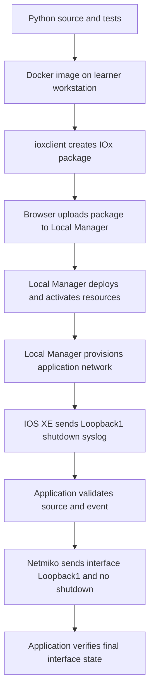

# Optional Lab 15: Host a Python Application with IOx Local Manager

## Lab Introduction

Network automation normally runs from a workstation, runner, or controller. However, a small operational service can also run directly beside IOS XE. Hosting the service on the router reduces its dependency on an external automation server and demonstrates how edge applications can react to local events.

In this optional lab, learners reserve the **Cisco Catalyst 8000V DevNet Sandbox** and manage the hosted application through the router's **IOx Local Manager** at:

```text
http://10.10.20.48/iox/login
```

Learners build a Python service as an x86-64 Docker image, convert the image into an IOx application package with `ioxclient`, and use Local Manager to deploy, configure, activate, start, inspect, stop, and delete it. IOS XE CLI is still used to create the test interface, configure syslog, verify IOx state, and confirm the final network condition.

The application listens for an IOS XE syslog message stating that `Loopback1` was administratively shut down. After validating the message and source address, it connects back to the Catalyst 8000V with Netmiko, applies `no shutdown`, and verifies that the interface is operational. The remediation is intentionally narrow so learners can concentrate on application hosting and lifecycle management.

## Learning Objectives

- Explain the relationship between IOS XE, IOx, Local Manager, Docker, and `ioxclient`.
- Install `ioxclient` on an x86-64 or ARM64 learner workstation.
- Build an x86-64 application image for Catalyst 8000V.
- Package the Docker image as an IOx archive.
- Deploy and activate an application through IOx Local Manager.
- Supply deployment-specific settings through `package_config.ini`.
- Configure application networking and UDP port exposure.
- Inspect application state, resources, configuration, and logs.
- Validate a small event-driven closed loop.
- Remove the application and temporary credentials safely.

## Application and Management Flow


```mermaid
flowchart TD
    A["Python source and tests"] --> B["Docker image on learner workstation"]
    B --> C["ioxclient creates IOx package"]
    C --> D["Browser uploads package to Local Manager"]
    D --> E["Local Manager deploys and activates resources"]
    E --> F["Local Manager provisions application network"]
    F --> G["IOS XE sends Loopback1 shutdown syslog"]
    G --> H["Application validates source and event"]
    H --> I["Netmiko sends interface Loopback1 and no shutdown"]
    I --> J["Application verifies final interface state"]
```

The control paths are different:

```text
Learner browser  -> http://10.10.20.48/iox/login -> IOx Local Manager
Learner terminal -> SSH to Catalyst 8000V        -> IOS XE CLI
Hosted app       -> SSH to 10.10.20.48:22        -> Netmiko remediation
IOS XE           -> Application UDP/5514         -> Shutdown event
```

## Supplied Files

```text
Lab15/
├── .dockerignore
├── .gitignore
├── Dockerfile
├── Lab15.md
├── loopback_recovery.py
├── package.yaml
├── package_config.ini
├── requirements.txt
├── scripts/
│   └── send_test_syslog.py
└── tests/
    └── test_loopback_recovery.py
```

`package_config.ini` is a deployment-specific IOx bootstrap configuration. It is excluded from Git and from the Docker image, but `ioxclient` places it in the IOx application package so Local Manager can manage it separately from application code.

## Task 1: Reserve and Inspect the Catalyst 8000V

1. Sign in to Cisco DevNet Sandbox.
2. Reserve the **Cisco Catalyst 8000V** sandbox.
3. Wait until the reservation is active and connect through the supplied VPN.
4. Record the IOS XE SSH username and password from the reservation.
5. Open an SSH session to the router and enter privileged EXEC mode.

Inspect the environment without changing it:

```text
show version
show iox
show app-hosting list
show app-hosting resource
show ip interface brief
```

Confirm that the IOx services report a running state and that sufficient CPU, memory, and disk resources are available. Do not stop or remove existing applications.

Open the Local Manager URL in a browser:

```text
http://10.10.20.48/iox/login
```

Use the IOx Local Manager credentials provided by the active reservation. These credentials may differ from the IOS XE SSH credentials. Because this sandbox URL uses HTTP, use it only inside the protected DevNet VPN environment and never reuse its password elsewhere.

After login, open **Applications** and confirm that the page displays the applications known to the Catalyst 8000V.

## Task 2: Prepare the Repository and Test the Code

Create a private GitLab.com project named `optional_lab15_c8000v_app_hosting`. Clone it under `~/ccnpauto-workspace`, and then use VS Code to copy the supplied Lab 15 files into the cloned folder.

Create a virtual environment and run the supplied validation:

```bash
python3 -m venv .venv
source .venv/bin/activate
python -m pip install --upgrade pip
python -m pip install -r requirements.txt
python -m py_compile loopback_recovery.py scripts/send_test_syslog.py
python -m pytest -q
```

The tests confirm that only a `Loopback1` administrative-down event triggers remediation. They also verify that Netmiko receives `interface Loopback1` and `no shutdown`, checks the interface state, and disconnects. Mocked connections prevent the local tests from modifying the sandbox.

## Task 3: Install and Initialize `ioxclient`

`ioxclient` is Cisco's command-line tool for converting an application image into an IOx-compatible package. It is a standalone executable rather than a Python library.

Identify the learner workstation architecture:

```bash
uname -m
dpkg --print-architecture
```

| Result | Required `ioxclient` download |
|---|---|
| `x86_64` or `amd64` | Linux x86-64 |
| `aarch64` or `arm64` | Linux ARM64 |

Open [Cisco IOx Resource Downloads](https://developer.cisco.com/docs/iox/iox-resource-downloads/) and download the current Linux binary matching the workstation. The `ioxclient` architecture must match the workstation, whereas the application image created later must match the x86-64 Catalyst 8000V.

Extract the archive with Ubuntu Files. Open a terminal in the extracted directory and install the executable:

```bash
file ioxclient
chmod +x ioxclient
./ioxclient --version
sudo install -m 0755 ioxclient /usr/local/bin/ioxclient
ioxclient --version
```

Use `sudo` only for installing the executable into `/usr/local/bin`. Running normal `ioxclient` commands with `sudo` can create root-owned settings and build files. An `Exec format error` indicates that the wrong workstation architecture was downloaded.

Confirm access to the local Docker daemon and initialize the Docker connection used for packaging:

```bash
docker version
ioxclient docker init
```

Accept the local socket and detected/default Docker API version:

```text
unix:///var/run/docker.sock
```

This lab does not require an `ioxclient` platform profile because Local Manager performs the deployment and lifecycle operations.

## Task 4: Understand the Application Configuration Boundary

Open `loopback_recovery.py`. The application reads the path supplied by the IOx `CAF_APP_CONFIG_FILE` environment variable. Local Manager provisions that path and stores the uploaded `package_config.ini` separately from the immutable application image.

The file contains:

```ini
[router]
host = 10.10.20.48
port = 22
username = apphost
password = REPLACE_WITH_LAB_PASSWORD
device_type = cisco_ios
timeout = 10
syslog_source = 10.10.20.48
```

The fields have these purposes:

| Field | Meaning |
|---|---|
| `host` | IOS XE address the application reaches with Netmiko |
| `port` | SSH port as seen from the hosted application; normally 22 inside the sandbox |
| `username` and `password` | Temporary router account used only by this lab |
| `device_type` | Netmiko platform driver, `cisco_ios` |
| `timeout` | SSH establishment timeout |
| `syslog_source` | Source address allowed to trigger remediation |

The application can also accept equivalent environment variables for portability, but this Local Manager workflow deliberately uses the managed bootstrap file.

## Task 5: Create the Temporary IOS XE Account and Test Interface

Choose a temporary lab password containing letters and numbers but no spaces. Do not reuse any personal, reservation, GitLab, or Vault password.

On IOS XE, create the application account and the test loopback:

```text
configure terminal
username apphost privilege 15 secret <TEMPORARY-LAB-PASSWORD>
ip ssh version 2
interface Loopback1
 description LAB15-CLOSED-LOOP-TEST
 ip address 198.51.100.1 255.255.255.255
 no shutdown
end
show interfaces Loopback1 | include line protocol
```

The account has privilege 15 only to keep this optional sandbox exercise focused on application hosting. A production implementation should use command authorization and the minimum privileges required for the remediation.

In VS Code, open `package_config.ini` and replace `REPLACE_WITH_LAB_PASSWORD` with the temporary password. Retain `10.10.20.48` for `host` and `syslog_source` initially. If later logs show a different source address, update only `syslog_source` through Local Manager.

Do not stage or commit `package_config.ini`. Verify that Git ignores it:

```bash
git status --short
git check-ignore package_config.ini
```

## Task 6: Build and Inspect the x86-64 Container

Catalyst 8000V is the application target, so build an x86-64 image even when the learner workstation uses ARM64:

```bash
docker build \
  --platform linux/amd64 \
  -t loopback1-auto-recovery:1.0 .
```

Inspect the resulting architecture:

```bash
docker image inspect loopback1-auto-recovery:1.0 \
  --format '{{.Architecture}}'
```

The expected value is:

```text
amd64
```

Run a local startup check using the INI file:

```bash
docker run --rm --name loopback-recovery-test \
  -p 15514:5514/udp \
  -e CAF_APP_CONFIG_FILE=/data/package_config.ini \
  -v "$PWD/package_config.ini:/data/package_config.ini:ro" \
  loopback1-auto-recovery:1.0
```

Confirm that the process listens on UDP 5514. Do not generate the matching shutdown event during this local test. Stop the container with `Ctrl+C`.

## Task 7: Create the IOx Application Package

Open `package.yaml` and confirm that it declares:

- Docker application type.
- `x86_64` CPU architecture.
- UDP port 5514.
- A custom resource profile with 256 MB memory.
- The Python startup target.

Package the image:

```bash
ioxclient docker package \
  -p ext2 \
  --name loopback1-recovery.tar \
  loopback1-auto-recovery:1.0 .
```

If the installed release does not support `--name` in that position, use:

```bash
ioxclient docker package -p ext2 loopback1-auto-recovery:1.0 .
mv package.tar loopback1-recovery.tar
```

Inspect the resulting archive:

```bash
tar -tf loopback1-recovery.tar
```

Confirm that the IOx package contains its descriptor, generated root filesystem, and bootstrap configuration. Do not commit the TAR archive.

## Task 8: Deploy the Package through Local Manager

Return to:

```text
http://10.10.20.48/iox/login
```

Deploy the package:

1. Select **Applications** from the Local Manager menu.
2. Select **Add New**, **Add/Deploy**, or the equivalent deployment button shown by this Local Manager release.
3. Enter `loopback1-recovery` as the application ID.
4. Select **Choose File**.
5. Browse to the project directory and select `loopback1-recovery.tar`.
6. Start the upload and wait without refreshing the browser.
7. Confirm the successful deployment dialog.
8. Return to **Applications** and verify that the application state is **DEPLOYED**.

Deployment stores and validates the package, but it does not yet reserve CPU, memory, or networking resources.

## Task 9: Verify the Bootstrap Configuration

From the `loopback1-recovery` application page, open **App-Config** or the configuration tab exposed by the installed Local Manager release.

1. View or download the current application configuration.
2. Confirm that it uses valid INI syntax and includes the `[router]` section.
3. If the placeholder password is still present, select the option to update or upload the configuration.
4. Choose the edited `package_config.ini` from the project folder.
5. Save the configuration.
6. View or download it again and confirm that the new configuration is active.

Local Manager provisions this file at the path referenced by `CAF_APP_CONFIG_FILE` when the application starts. The application does not need to know the physical path in advance.

Although this mechanism keeps the password outside the Docker image, Local Manager administrators can still read the configuration. It is appropriate only for this isolated lab account. Remove the account when the lab finishes.

## Task 10: Activate and Start the Application

Select **Activate** for `loopback1-recovery`. On the **Resources** page:

1. Select the custom resource profile requested by the descriptor, or enter approximately 100 CPU units, 256 MB memory, and 10 MB application disk when Local Manager asks for explicit values.
2. Locate **Network Configuration** and map `eth0` to a network offered by the Catalyst 8000V sandbox.
3. Prefer a bridged or directly reachable application network when one is available.
4. If only `iox-nat0` is offered, select it and open **Port Mapping**.
5. Map application UDP port `5514` to an available external UDP port. Use `5514` when available; otherwise record the external port assigned by Local Manager.
6. Do not enable debug mode unless troubleshooting requires it.
7. Select **Activate** and wait for the state to become **ACTIVATED**.
8. Return to **Applications**, select **Start**, and wait for **RUNNING**.

Do not refresh the browser during upload, activation, or start operations. Local Manager may need several minutes to allocate resources and create the container.

Open the application's **Resources**, **App-Info**, and **Logs** or **App-Console** views. Record:

- Application state.
- Assigned application address.
- Selected IOx network.
- Internal UDP port.
- External UDP port when NAT port mapping is used.
- CPU and memory reservation.

Corroborate the UI from IOS XE:

```text
show app-hosting list
show app-hosting detail appid loopback1-recovery
show app-hosting utilization appid loopback1-recovery
```

The application log should report that it is listening on UDP 5514. If it exits immediately, inspect **App-Config** first; the most common cause is a missing configuration file or unchanged placeholder password.

## Task 11: Deliver Syslog and Test Recovery

Determine the correct syslog destination from the Local Manager network selection:

| Activation choice | IOS XE syslog destination |
|---|---|
| Bridged or directly reachable network | Assigned application IP, UDP 5514 |
| `iox-nat0` with port mapping | IOx host address `10.10.20.48` and the external UDP port recorded during activation |

Determine which IOS XE interface owns `10.10.20.48`:

```text
show ip interface brief | include 10.10.20.48
```

Configure the router to send informational syslog to the selected destination. Replace every placeholder with the Local Manager values:

```text
configure terminal
logging source-interface <INTERFACE-WITH-10.10.20.48>
logging host <SYSLOG-DESTINATION> transport udp port <SYSLOG-PORT>
logging trap informational
end
```

Confirm the application remains **RUNNING**. Then generate the intended event:

```text
configure terminal
interface Loopback1
 shutdown
end
```

The application should receive the syslog, validate its source, connect to `10.10.20.48` with Netmiko, apply `no shutdown`, and verify the result.

Check IOS XE:

```text
show interfaces Loopback1 | include line protocol
show logging | include Loopback1
show app-hosting list
```

The expected final interface state is:

```text
Loopback1 is up, line protocol is up
```

Review the application log in Local Manager. It should show event detection, Netmiko configuration output, and final verification.

If the log reports that the syslog came from an unexpected address, record that observed source. Stop the application, update `syslog_source` in `package_config.ini`, upload it through **App-Config**, and restart the application. Do not weaken the application by accepting every source.

## Task 12: Stop, Deactivate, and Delete the Application

Use Local Manager to remove resources in the correct order:

1. Open **Applications**.
2. Select **Stop** for `loopback1-recovery` and wait for **STOPPED**.
3. Select **Deactivate** and wait for **DEPLOYED**.
4. Select **Delete**, **Remove**, or **Uninstall**, depending on the UI wording.
5. Confirm only the `loopback1-recovery` application.
6. Verify that it no longer appears in **Applications**.

Confirm from IOS XE:

```text
show app-hosting list
```

Remove the temporary network and account configuration. Use the exact syslog destination and port configured earlier:

```text
configure terminal
no logging host <SYSLOG-DESTINATION> transport udp port <SYSLOG-PORT>
no username apphost
interface Loopback1
 no shutdown
end
```

On Ubuntu, delete the generated package and optional local image when they are no longer required:

```bash
rm -f loopback1-recovery.tar package.tar
docker image rm loopback1-auto-recovery:1.0
```

Commit and push only the source, tests, Dockerfile, descriptor, and documentation. Never commit `package_config.ini`, generated archives, sandbox credentials, or temporary passwords.

## Troubleshooting

| Evidence | Likely cause and next check |
|---|---|
| Local Manager login page is unavailable | VPN, reservation state, browser proxy, or incorrect URL |
| Local Manager credentials fail | Use the IOx credentials from the reservation, not automatically the IOS XE SSH credentials |
| `Exec format error` for `ioxclient` | Wrong workstation binary architecture |
| Docker image reports `arm64` | Rebuild with `--platform linux/amd64` |
| Package upload or validation fails | Descriptor syntax, x86-64 image, package format, available storage, or application signature policy |
| Activation fails | Resource shortage, invalid profile, unavailable network, or port conflict |
| Application starts and immediately stops | Missing/invalid `package_config.ini` or placeholder password |
| Application is running but receives no event | Incorrect Local Manager network selection or UDP port mapping, wrong logging destination, or wrong logging severity |
| Unexpected syslog source is rejected | Update only `syslog_source` to the observed authorized router address and restart |
| Netmiko authentication fails | Temporary account or bootstrap username/password is incorrect |
| Netmiko times out | The application cannot reach `10.10.20.48:22`; inspect IOx network and routing |
| Loopback remains down | Inspect event match, source validation, application log, SSH privileges, and verification output |

## References

- [Cisco IOx Local Manager Reference](https://www.cisco.com/c/en/us/td/docs/routers/access/800/software/guides/iox/lm/reference-guide/1-1/iox_local_manager_ref_guide/workflows.html)
- [Cisco IOx Application Development Concepts](https://developer.cisco.com/docs/iox/application-development-concepts/)
- [Cisco IOx Resource Downloads](https://developer.cisco.com/docs/iox/iox-resource-downloads/)
- [Cisco IOx Docker Commands](https://developer.cisco.com/docs/iox/docker-commands/)
- [Cisco Catalyst 8000V IOx Verification](https://www.cisco.com/c/en/us/td/docs/routers/C8000V/HighAvailability/c8000v-high-availability-configuration-guide/troubleshoot-high-availability-issues.html)

## Key Takeaways

- `ioxclient` creates the package, while IOx Local Manager controls deployment and runtime lifecycle.
- Local Manager separates immutable application code from deployment-specific bootstrap configuration.
- Activation reserves CPU, memory, disk, networking, and port mappings before the application starts.
- The workstation architecture and hosted application architecture are separate decisions.
- A closed loop must validate its event source, limit the intended change, handle connection failures, and verify final state.
- Local Manager configuration is manageable by administrators and is not a substitute for enterprise secret management.
