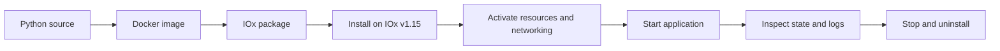
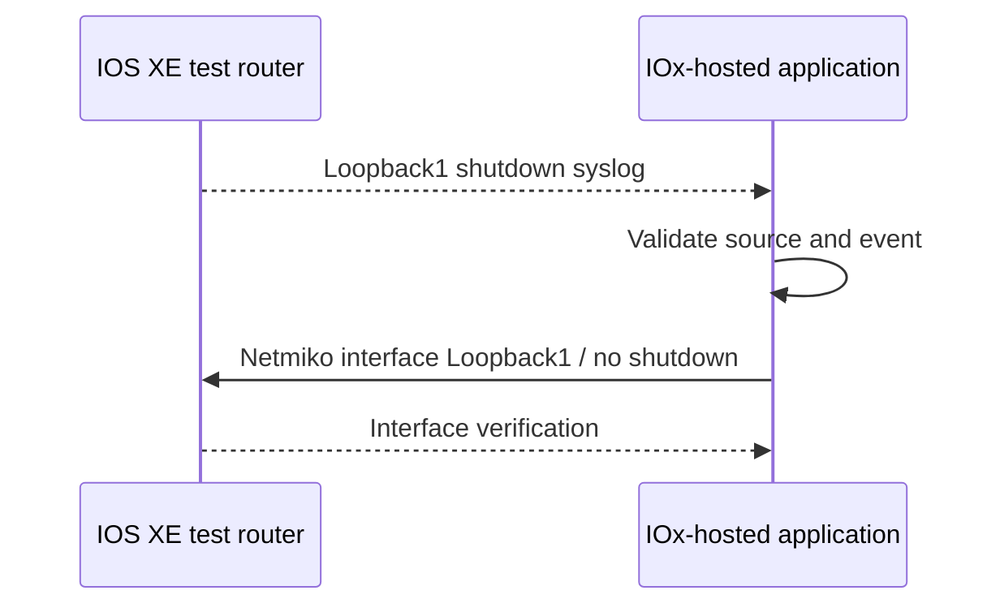

# Optional Lab 15: Deploy a Python Application to the DevNet IOx v1.15 Sandbox

## Lab Introduction

Cisco IOx provides an application lifecycle on supported edge platforms: package, install, activate, start, observe, stop, and uninstall. In this lab, learners package the supplied Python loopback-recovery service and deploy it to the **Cisco DevNet IOx v1.15 reservable sandbox**.

The IOx v1.15 sandbox is the application-hosting target. It is not automatically an IOS XE router with `VirtualPortGroup0`, so this revised lab does not use IOS XE `app-hosting` CLI commands. Learners use the IOx host, Local Manager, and `ioxclient` connection information provided by the active reservation. The application’s event parser and Netmiko recovery logic are validated locally before deployment. A live `no shutdown` action is attempted only when the reservation topology or instructor provides a reachable IOS XE test router.

## Learning Objectives

- Explain the Cisco IOx application lifecycle.
- Build a Docker image for the architecture supported by the IOx host.
- Package the image with `ioxclient` and a package descriptor.
- Create and verify an `ioxclient` profile for IOx v1.15.
- Install, activate, start, inspect, stop, and uninstall an application.
- Distinguish application-hosting validation from network-remediation validation.
- Protect bootstrap configuration and device credentials.

## Application Flow


```mermaid
flowchart LR
    Code["Python source"] --> Image["Docker image"]
    Image --> Package["IOx package"]
    Package --> Install["Install on IOx v1.15"]
    Install --> Activate["Activate resources and networking"]
    Activate --> Start["Start application"]
    Start --> Observe["Inspect state and logs"]
    Observe --> Stop["Stop and uninstall"]
```

When a reachable IOS XE test router is available, the runtime path is:


```mermaid
sequenceDiagram
    participant R as IOS XE test router
    participant A as IOx-hosted application
    R-->>A: Loopback1 shutdown syslog
    A->>A: Validate source and event
    A->>R: Netmiko interface Loopback1 / no shutdown
    R-->>A: Interface verification
```

## Supplied Files

```text
Lab15/
├── .dockerignore
├── .gitignore
├── Dockerfile
├── Lab15.md
├── loopback_recovery.py
├── package.yaml
├── package_config.ini
├── requirements.txt
├── scripts/
│   └── send_test_syslog.py
└── tests/
    └── test_loopback_recovery.py
```

## Task 1: Reserve IOx v1.15

1. Sign in to Cisco DevNet Sandbox and reserve **IOx v1.15**.
2. Wait for the reservation to become active and follow its VPN instructions.
3. In the reservation resources, locate the IOx host address, Local Manager URL, management port, username, password, and SSH port.
4. Use the values supplied by this reservation. Do not assume that an address copied from an older IOx lab is still correct.
5. Open Local Manager in a browser and confirm that the IOx host is reachable.

Reservation credentials, VPN profiles, application configuration, and generated packages must not be committed.

## Task 2: Prepare the Repository and Test Locally

Create a private GitLab.com project named `optional_lab15_iox_v115`. Clone it under `~/ccnpauto-workspace`, then copy the supplied Lab 15 files into it using VS Code.

```bash
python3 -m venv .venv
source .venv/bin/activate
python -m pip install --upgrade pip
python -m pip install -r requirements.txt
python -m py_compile loopback_recovery.py scripts/send_test_syslog.py
python -m pytest -q
```

The tests prove that the parser reacts only to a `Loopback1` administrative-down event and that Netmiko receives `interface Loopback1` followed by `no shutdown`. The tests use mocks and therefore do not modify a router.

## Task 3: Review the Security Boundary

Open `loopback_recovery.py`. Confirm that it validates both the syslog source address and the message pattern before opening an SSH connection. Confirm that Netmiko authentication and timeout exceptions are handled and that the session disconnects in `finally`.

Open `package_config.ini`. This file is deployment-specific and ignored by Git. If the sandbox topology provides no reachable IOS XE router, leave the application in lifecycle-validation mode: use placeholder lab-only values, start the service, inspect it, and do not send the matching shutdown event. If an instructor provides a reachable IOS XE target, enter only that target’s dedicated lab account and expected syslog source.

## Task 4: Create the IOx v1.15 Client Profile

Run:

```bash
ioxclient profiles create
```

Answer the prompts with the active reservation values. Use a profile name such as `devnet-iox-v115`. The common IOx API prefix is `/iox/api/v2/hosting/`, but use the prefix displayed by the reservation when it differs.

Verify the active profile:

```bash
ioxclient profiles show
ioxclient platform info
ioxclient platform capability
ioxclient application list
```

If the profile is wrong, delete and recreate it rather than editing cached credentials manually.

## Task 5: Select the Target Architecture

Use `ioxclient platform capability` and the reservation documentation to determine the IOx host architecture. Set the matching `cpuarch` in `package.yaml`.

For an x86-64 host:

```bash
docker build --platform linux/amd64 -t loopback1-auto-recovery:1.0 .
```

For an ARM64 host:

```bash
docker build --platform linux/arm64 -t loopback1-auto-recovery:1.0 .
```

Do not infer the IOx architecture from the learner workstation. The image architecture must match the hosting platform.

## Task 6: Test the Container Locally

Use a lab-only configuration and run the container with UDP port mapping. Do not send the matching shutdown event unless the configured router is a controlled test target.

```bash
docker run --rm --name loopback-recovery-test \
  -p 15514:5514/udp \
  -e CAF_APP_CONFIG_FILE=/data/package_config.ini \
  -e ROUTER_SYSLOG_SOURCE=127.0.0.1 \
  -v "$PWD/package_config.ini:/data/package_config.ini:ro" \
  loopback1-auto-recovery:1.0
```

From another terminal, send an unrelated UDP message or run the supplied test script only when a mocked or controlled target is configured. Review the container output, then stop the local test with Ctrl+C.

## Task 7: Package the Application

```bash
ioxclient docker package loopback1-auto-recovery:1.0 .
tar -tf package.tar
```

Confirm the package contains the descriptor and root filesystem. If IOx v1.15 rejects a package created by a newer Docker engine or incompatible `ioxclient`, use the tool version recommended in the reservation instructions. Do not weaken package-signing policy to force an installation.

## Task 8: Install with Local Manager

Local Manager labels can vary slightly by IOx release, but the lifecycle remains the same:

1. Open **Applications**.
2. Choose **Add New** or **Install Application**.
3. Enter application ID `loopback1-recovery`.
4. Upload `package.tar` and wait for installation to complete.
5. Select the installed application and choose **Activate**.
6. Select a network offered by the sandbox and map UDP port `5514` when Local Manager requests application networking.
7. Supply `package_config.ini` through the application configuration/bootstrap mechanism exposed by the sandbox.
8. Set `ROUTER_SYSLOG_SOURCE` to the authorized source only when a reachable IOS XE target is available.
9. Start the application and confirm its state is **RUNNING**.

Do not invent a `VirtualPortGroup0` address. Use only the network and address allocated by IOx v1.15.

## Task 9: Verify with ioxclient

```bash
ioxclient application list
ioxclient application status loopback1-recovery
ioxclient application info loopback1-recovery
```

Use Local Manager or the supported `ioxclient` log command for the active release to inspect startup messages. Confirm that Python starts and listens on UDP 5514. A running process validates packaging and application lifecycle; it does not by itself prove router remediation.

## Task 10: Optional Live Recovery

Perform this task only when the instructor confirms that an IOS XE target is reachable from the IOx application network.

1. Configure the router to send link-status syslog to the application address and UDP port 5514.
2. Use a dedicated lab account with only the privileges required for the exercise.
3. Confirm the application can establish SSH before generating an event.
4. Shut down `Loopback1` on the controlled router.
5. Verify that the application recognizes the event, sends `no shutdown`, and confirms `Loopback1 is up, line protocol is up`.

Do not perform this task against shared infrastructure or an unapproved router.

## Task 11: Stop and Remove the Application

Use Local Manager to stop, deactivate, and uninstall `loopback1-recovery`. Verify removal with:

```bash
ioxclient application list
```

Remove the local package and Docker test image when no longer needed. Do not delete other learners’ applications or reset the shared IOx host.

## Troubleshooting

| Symptom | Likely cause |
|---|---|
| Profile connection fails | VPN, host, port, API prefix, or reservation credentials are wrong |
| Package rejected | Descriptor, architecture, Docker format, signature, or tool-version mismatch |
| Application stops immediately | Missing bootstrap file, placeholder password, or Python dependency failure |
| Listener runs but no event arrives | Wrong IOx network/port mapping or syslog destination |
| Netmiko timeout | The router is not reachable from the IOx application network |

## References

- [Cisco IOx documentation](https://developer.cisco.com/docs/iox/introduction-to-iox/)
- [IOx sandbox guidance](https://developer.cisco.com/docs/iox/sandbox/)
- [Managing ioxclient profiles](https://developer.cisco.com/docs/iox/profiles/)
- [IOx package descriptor](https://developer.cisco.com/docs/iox/package-descriptor/)

## Key Takeaways

- IOx v1.15 provides an application lifecycle independent of IOS XE `app-hosting` CLI.
- The target architecture, descriptor, networking, bootstrap configuration, and package format must agree.
- A running container proves hosting; a successful closed loop additionally requires event delivery, router reachability, authorized credentials, and final-state verification.
- Shared sandboxes must be cleaned up without affecting other users.
