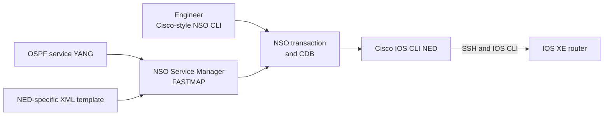

# Optional Lab 16: Manage IOS XE and Build an OSPF Service with Cisco NSO

## Lab Introduction

A network team manages several IOS XE routers through device-specific CLI. Although the commands are familiar, engineers still need transaction safety, configuration synchronization, service ownership, and a repeatable way to apply the same business intent to multiple routers. Cisco Network Services Orchestrator (NSO) addresses this problem by placing a transactional configuration database and service layer between operators and managed devices.

In this optional lab, learners install NSO for local development, load a Cisco IOS CLI NED, onboard a Cisco IOS XE reservable sandbox router, and manage it through NSO's Cisco-style CLI. Learners then define an OSPF service model in YANG and map that service to IOS CLI configuration with an XML template.

NSO software and Cisco NED packages are licensed downloads. The lab therefore uses placeholders for release numbers and filenames rather than linking to an unapproved package. Learners must use versions provided by the instructor or downloaded through an entitled Cisco account.

## Learning Objectives

- Explain the NSO device manager, service manager, CDB, NED, and FASTMAP roles.
- Install a local NSO development instance and a compatible IOS CLI NED.
- Onboard and synchronize an IOS XE router.
- Use NSO's Cisco-style CLI to inspect and change device configuration.
- Define an OSPF service interface in YANG.
- Map service intent to device configuration with an XML template.
- Preview native CLI with `commit dry-run` and verify synchronization.
- Explain service ownership and automatic cleanup.

## Architecture



The service YANG model describes what an operator requests. The XML template describes how that request maps to the device model supplied by the NED. The separation allows the service interface to remain stable even if a different mapping is later added for another device family.

## Prerequisites

- Ubuntu workstation from Lab 1.
- An active Cisco IOS XE reservable sandbox and VPN connection.
- Cisco account entitlement or instructor-provided NSO evaluation software.
- A Cisco IOS or IOS XE CLI NED compatible with the chosen NSO release.
- An x86-64 workstation when required by the selected NSO local installer.
- Approximately 8 GB of free memory and 10 GB of free disk space for this optional lab.

Check the architecture:

```bash
dpkg --print-architecture
uname -m
```

For an x86-64 workstation, the commands return `amd64` and `x86_64`; use the `.linux.x86_64.installer.bin` shown in this lab. If they return `arm64` and `aarch64`, do not use the x86-64 installer. Use an instructor-provided x86-64 VM or another NSO development environment supported by the selected NSO release. Do not emulate a production NSO deployment on an unsupported platform.

## Task 1: Obtain the Software

From Cisco Software Download or the course distribution, obtain:

- `nso-<NSO_VERSION>.linux.x86_64.installer.bin`
- a Cisco IOS CLI NED built for the same NSO major release
- any evaluation or Smart Licensing information required by the selected release

Verify the downloaded checksum against the value published by Cisco. Keep installers outside Git repositories.

Install prerequisites appropriate to the selected NSO release:

```bash
sudo apt update
sudo apt install -y ant build-essential default-jdk libxml2-utils make openssh-client xsltproc
```

The NSO release notes are authoritative for Java and operating-system compatibility. If they require a specific JDK, install that version and select it before continuing.

## Task 2: Perform a Local NSO Installation

Replace the placeholders with the actual release and filename:

```bash
chmod +x ~/Downloads/nso-<NSO_VERSION>.linux.x86_64.installer.bin
sh ~/Downloads/nso-<NSO_VERSION>.linux.x86_64.installer.bin \
  "$HOME/nso-<NSO_VERSION>" --local-install
source "$HOME/nso-<NSO_VERSION>/ncsrc"
ncs --version
```

Local install is intended for evaluation, development, and examples. A production NSO deployment uses a system installation, durable directories, backup, high availability, role-based access, and production licensing.

Create the runtime:

```bash
ncs-setup --dest "$HOME/nso-run"
cd "$HOME/nso-run"
```

The install directory contains NSO binaries and examples. The runtime directory contains the active configuration database, logs, packages, and runtime configuration. Keeping them separate makes it easier to recreate the development runtime.

## Task 3: Install the IOS CLI NED

Follow the README supplied with the NED. A signed NED installer commonly verifies itself and produces a compressed package. Extract the resulting NED package into `$HOME/nso-run/packages/`.

After extraction, verify that the directory contains `package-meta-data.xml`, load directories, and the NED model files:

```bash
find "$HOME/nso-run/packages" -maxdepth 2 -name package-meta-data.xml -print
```

Start NSO:

```bash
cd "$HOME/nso-run"
ncs
ncs_cli -C -u admin
```

The `-C` option selects Cisco-style CLI. At the NSO prompt, verify package state:

```text
show packages package oper-status
show packages package package-version
```

Every required package must report `up`. A NED built for a different NSO release will normally fail package loading and must not be forced into service.

## Task 4: Create an Authentication Group

In the NSO CLI, create an authentication group using the sandbox credentials:

```text
configure
devices authgroups group IOSXE-AUTH default-map remote-name <sandbox-username>
devices authgroups group IOSXE-AUTH default-map remote-password <sandbox-password>
commit
```

NSO encrypts stored secrets in CDB when encryption keys are configured correctly. For a production deployment, integrate an approved credential system and protect NSO encryption keys and backups.

## Task 5: Onboard the IOS XE Router

Create the managed device:

```text
configure
devices device iosxe-sandbox address <sandbox-host>
devices device iosxe-sandbox port <sandbox-ssh-port>
devices device iosxe-sandbox authgroup IOSXE-AUTH
devices device iosxe-sandbox device-type cli protocol ssh
devices device iosxe-sandbox device-type cli ned-id ?
```

At `ned-id ?`, select the installed Cisco IOS CLI NED identifier. The identifier includes the installed NED family and might include a release-specific identity. Do not copy an identifier from another NSO system.

Complete the device:

```text
devices device iosxe-sandbox state admin-state unlocked
commit
devices device iosxe-sandbox connect
devices device iosxe-sandbox sync-from
```

Interpret the operations:

- `connect` verifies that the NED can establish and identify the CLI session.
- `sync-from` reads device configuration and stores its modeled representation in CDB.
- `check-sync` later compares the device with the CDB copy.

Verify:

```text
show devices device iosxe-sandbox platform
show devices device iosxe-sandbox config ios:hostname
devices device iosxe-sandbox check-sync
```

The model prefix shown by your NED might differ from `ios:`. Use CLI completion to select the prefix advertised by the installed package.

## Task 6: Manage the Router Through Cisco-Style CLI

Create a loopback through NSO:

```text
configure
devices device iosxe-sandbox config
interface Loopback 160
description NSO-MANAGED
ip address 10.160.0.1 255.255.255.255
exit
commit dry-run outformat native
```

The dry run shows the native IOS CLI that the NED intends to send. If it is correct:

```text
commit
end
devices device iosxe-sandbox check-sync
```

Verify on the router with `show ip interface brief | include Loopback160`. Then return to NSO. This direct device configuration is owned by the NSO device configuration transaction, but it is not yet a reusable network service.

## Task 7: Generate the OSPF Service Skeleton

Exit the NSO CLI and create a template-only service package:

```bash
cd "$HOME/nso-run/packages"
ncs-make-package --no-test --service-skeleton template ospf-service
```

Using VS Code, replace the generated `ospf-service/src/yang/ospf-service.yang` with the supplied file from `CCNPAUTO/LAB/Lab16/packages/ospf-service/src/yang/ospf-service.yang`. Replace the generated XML template with the supplied `CCNPAUTO/LAB/Lab16/packages/ospf-service/templates/ospf-service-template.xml`.

The model augments `/ncs:services` with an `ospf-service` list. One service instance can target one or more devices and carries a process ID, router ID, area, and one or more network statements.

## Task 8: Derive and Confirm the NED XML

The supplied template uses the common Cisco IOS CLI NED namespace `urn:ios`. Before building, derive the namespace and element structure from the installed NED:

```text
configure
devices device iosxe-sandbox config
router ospf 100
router-id 10.160.0.1
network 10.160.0.1 0.0.0.0 area 0
top
show full-configuration devices device iosxe-sandbox config router ospf | display xml
abort
```

Compare the generated XML with `ospf-service-template.xml`:

- If the router element uses `xmlns="urn:ios"` and the children match, retain the supplied template.
- If the NED uses another namespace or element name, modify the template to match the XML generated by the installed NED.

This derivation is essential. NSO templates target NED data models, and NED revisions can change namespaces or schema structure.

## Task 9: Build and Load the Service

Build the YANG module:

```bash
cd "$HOME/nso-run/packages/ospf-service/src"
make
```

Reload packages:

```bash
ncs_cli -C -u admin
```

```text
packages reload
show packages package ospf-service oper-status
```

If the package is not `up`, inspect `$HOME/nso-run/logs/ncs.log` and correct the reported YANG or template error.

## Task 10: Create an OSPF Service Instance

In configuration mode:

```text
configure
ospf-service CORE-OSPF
device iosxe-sandbox
process-id 100
router-id 10.160.0.1
area 0
network 10.160.0.1 address 10.160.0.1 wildcard 0.0.0.0
commit dry-run outformat native
```

The dry run should resemble:

```text
router ospf 100
 router-id 10.160.0.1
 network 10.160.0.1 0.0.0.0 area 0
```

Commit and verify:

```text
commit
end
show running-config ospf-service CORE-OSPF
devices device iosxe-sandbox check-sync
```

On IOS XE, verify `show ip protocols`, `show ip ospf interface brief`, and the running OSPF configuration.

## Task 11: Add Another Managed Router or Network

If the reservation includes another reachable IOS XE router, onboard it with the same workflow and add its device name to `CORE-OSPF`. Otherwise, create another managed loopback network on the existing router:

```text
configure
ospf-service CORE-OSPF
network 10.161.0.1 address 10.161.0.1 wildcard 0.0.0.0
commit dry-run outformat native
commit
```

The service abstraction lets an operator express OSPF intent once while the template expands it into the NED-specific device configuration.

## Task 12: Observe Service Ownership and Cleanup

Preview deletion:

```text
configure
no ospf-service CORE-OSPF
commit dry-run outformat native
```

FASTMAP tracks the configuration produced by the service. The dry run should remove configuration owned by the service without deleting unrelated OSPF statements. Commit only after confirming the scope:

```text
commit
end
devices device iosxe-sandbox check-sync
```

Stop the development runtime after the lab:

```bash
cd "$HOME/nso-run"
ncs --stop
```

## Troubleshooting

| Symptom | Investigate |
|---|---|
| NSO package is not `up` | NSO/NED compatibility, YANG compile output, template namespace, and `ncs.log` |
| Device `connect` fails | Sandbox VPN, SSH port, authgroup, prompt recognition, and selected NED |
| `sync-from` fails | Unsupported CLI in the running configuration or NED parser error |
| Template reports `unknown element` | XML differs from the installed NED schema |
| Service appears in CDB but no device change is generated | Servicepoint mismatch between YANG and template |
| Device is `out-of-sync` | Out-of-band changes; inspect `compare-config` before choosing `sync-from` or `sync-to` |

## Key Takeaways

- A NED translates between NSO's modeled configuration and the device protocol or CLI.
- `sync-from` establishes CDB state; it is not the same as pushing configuration.
- Cisco-style NSO CLI provides familiar syntax while preserving transactions.
- A YANG service model defines operator intent independently of device syntax.
- XML templates must be derived from the installed NED rather than assumed.
- FASTMAP tracks service-owned configuration and enables scoped update and deletion.

## References

- [Cisco NSO Installation Guide](https://developer.cisco.com/docs/nso/guides/installation/)
- [Cisco NSO Implementing Services](https://developer.cisco.com/docs/nso-guides-6.3/implementing-services/)
- [Cisco NSO Templates](https://developer.cisco.com/docs/nso-guides-6.2/templates/)
- [Cisco NSO Package Development](https://developer.cisco.com/docs/nso/guides/package-development/)
