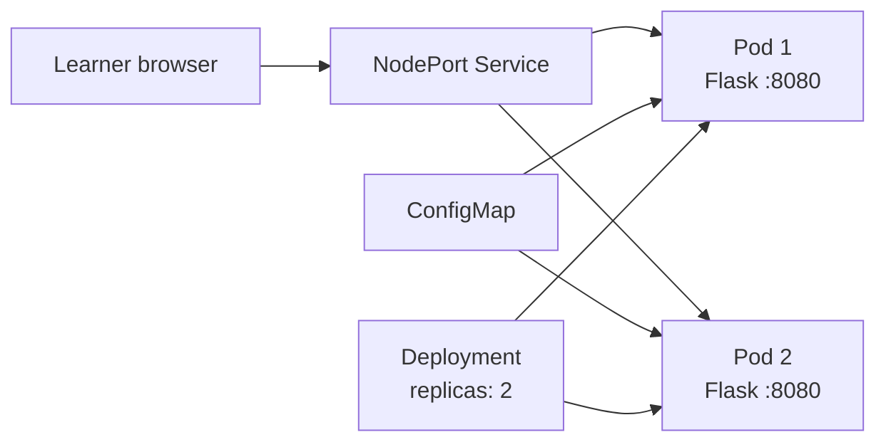
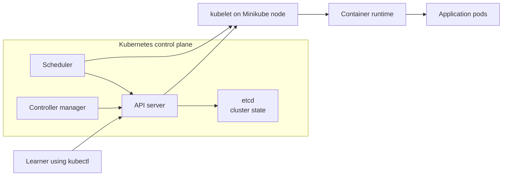

# Optional Lab 16: Learn Kubernetes Fundamentals with Minikube

## Lab Introduction

Network automation services are often delivered as containers, but a container engine by itself does not decide which host should run an application, replace a failed instance, distribute traffic across replicas, or coordinate a controlled rollout. Kubernetes is a container orchestration platform that provides those capabilities through an API and a set of controllers. An operator declares the desired state, and Kubernetes continually works to make the observed state match it.

This standalone beginner lab uses Minikube to create a small local Kubernetes cluster and deploy a network-status web service. Minikube places the Kubernetes control plane and worker functions on one local node, which makes the platform practical for learning without requiring several servers.

The application is intentionally stateless: it does not retain session data or write application state inside a pod. It returns the pod name, namespace, and a message supplied by a ConfigMap. Learners can therefore watch Kubernetes distribute requests across interchangeable replicas, replace a deleted pod, update application configuration, and preserve a stable service endpoint even while individual pods change.

## Learning Objectives

- Explain the purpose of Kubernetes and distinguish a cluster, control plane, and worker node.
- Explain pods, Deployments, ReplicaSets, Services, ConfigMaps, probes, labels, selectors, and namespaces.
- Read the common `apiVersion`, `kind`, `metadata`, `spec`, and `status` structure of a Kubernetes object.
- Explain desired state and controller reconciliation.
- Create a local Kubernetes cluster with Minikube.
- Build an image directly into the Minikube image store.
- Deploy and expose a two-replica application.
- Inspect desired and observed state with `kubectl`.
- Scale and update a Deployment, explain rollback boundaries, and test self-healing.
- Explain resource requests and limits, configuration injection, and stateless application design.
- Stop and delete the standalone cluster safely.

## Architecture



The browser does not connect to a particular pod. It connects to the Service, and the Service forwards the request to a ready pod whose label matches its selector. The Deployment, meanwhile, declares that two pod replicas should exist. If a pod disappears, the Deployment's controller causes a replacement to be created.

## What Kubernetes Does

Kubernetes accepts declarative objects through its API. Instead of writing a procedure such as “start container A, check it, then start another container,” an engineer declares “two healthy replicas of this application must exist.” Kubernetes stores that desired state and continuously reconciles it with the cluster's observed state.

Reconciliation is the central operating idea. A controller repeatedly compares what should exist with what actually exists and takes corrective action. Scaling a Deployment from two to three replicas changes desired state; the controller creates another pod. Deleting one of the three pods changes observed state; the controller creates a replacement because desired state still requires three.

Kubernetes does not build application images and does not replace Git or a CI/CD system. A build system normally creates and tests a container image, stores it in a registry, and updates a Kubernetes manifest or release. Kubernetes then schedules and operates that image.

## Understand the Cluster Architecture

A Kubernetes cluster has a control plane and one or more worker nodes. In a production design, these functions normally run across multiple systems for capacity and availability. In this lab, Minikube runs them together on one local node.



The major components have distinct responsibilities:

- **API server:** The front door to the cluster. `kubectl`, controllers, and other clients read and modify Kubernetes objects through this API. Authentication, authorization, and admission checks occur around API requests.
- **etcd:** A consistent key-value data store that holds the cluster's configuration and state. Production clusters protect and back up etcd because losing it can mean losing the control-plane record of the cluster.
- **Scheduler:** Watches for unscheduled pods and selects a suitable node by considering resource requests, constraints, policies, and available capacity. It chooses the node; it does not directly start the container.
- **Controller manager:** Runs controllers that reconcile objects. The Deployment and ReplicaSet behavior observed in this lab is driven by controllers.
- **Worker node:** A machine that supplies CPU, memory, networking, and storage for application workloads. Minikube provides one local node.
- **kubelet:** The node agent. It watches assigned pod specifications and works with the container runtime to keep their containers running.
- **Container runtime:** Pulls images and creates containers. With the Minikube Docker driver, the local learning environment uses container technology inside the Minikube node.
- **Cluster networking:** Gives pods connectivity and allows Services to reach selected pods. A production cluster uses a Container Network Interface (CNI) implementation; Minikube configures suitable local networking automatically.

## Understand the Kubernetes Objects in This Lab

### Namespace

A namespace is a logical scope for namespaced resources. The lab creates `network-lab` so its Deployment, pods, Service, and ConfigMap are separated from objects in the `default` namespace. Namespaces improve organization and can be combined with role-based access control, resource quotas, and policies. They are not, by themselves, a complete security boundary.

The command below changes the current `kubectl` context so subsequent namespaced commands default to `network-lab`:

```bash
kubectl config set-context --current --namespace=network-lab
```

### Pod

A pod is the smallest deployable unit in Kubernetes. It contains one or more tightly coupled containers that share the pod network namespace and can share volumes. Most application pods contain one main application container, although helper or sidecar containers can be included when their lifecycle belongs with the application.

Pods are replaceable. A replacement pod normally receives a new name and IP address, so clients should not depend on a specific pod identity. This lab therefore accesses the application through a Service rather than through a pod IP.

### Deployment and ReplicaSet

A Deployment is a controller-backed object for running and updating replicated stateless applications. Its pod template describes the desired pods, and its `replicas` value states how many should exist. A Deployment creates and manages a ReplicaSet; the ReplicaSet maintains the requested number of matching pods.

Learners normally operate the Deployment rather than manually creating ReplicaSets or individual pods. During a rolling update, the Deployment creates a new ReplicaSet and gradually moves replicas from the old template to the new one. Rollout history also makes rollback possible when a revision is available.

### Labels and Selectors

Labels are key-value metadata attached to Kubernetes objects. Selectors find objects with particular labels. In this lab, every application pod receives:

```yaml
labels:
  app: network-status
```

The Deployment selector and Service selector both use `app: network-status`. The Deployment uses the label to identify the pods it owns, while the Service uses it to find traffic destinations. A selector that does not match the pod-template label results in an application with no usable Service endpoints.

### Service

A Service provides a stable virtual IP and DNS name in front of a changing set of pods. It continuously derives its endpoints from label selection and sends traffic only to matching ready pods.

The common Service types are:

- **ClusterIP:** Exposes the Service only inside the cluster and is the default type.
- **NodePort:** Opens a port on every node and forwards it to the Service. This lab uses NodePort so the learner workstation can reach the application through Minikube.
- **LoadBalancer:** Requests an external load balancer from a supported cloud or infrastructure integration.
- **ExternalName:** Returns a DNS alias for an external name rather than selecting pods.

In `service.yaml`, `port: 80` is the Service port seen by a client, while `targetPort: http` refers to the named container port `8080` in the pod template.

### ConfigMap and Secret

A ConfigMap stores nonsecret configuration separately from the container image. The lab stores `APP_MESSAGE` in a ConfigMap and imports it as an environment variable. This separation allows the same immutable image to run with different environment-specific settings.

A Secret is intended for sensitive values such as tokens, passwords, or certificates. Kubernetes Secrets require appropriate encryption-at-rest configuration, RBAC, and handling controls; base64 representation alone is not encryption. This lab does not require a Secret because `APP_MESSAGE` is not sensitive.

### Readiness, Liveness, and Startup Probes

Probes allow Kubernetes to make decisions based on application health:

- **Readiness probe:** Determines whether a pod is ready to receive Service traffic. A running but unready pod remains outside the ready endpoint set.
- **Liveness probe:** Detects a container that should be restarted because it is no longer healthy.
- **Startup probe:** Protects slow-starting applications by delaying liveness and readiness decisions until startup succeeds. This small Flask application starts quickly, so the manifest does not need one.

Both configured probes send HTTP requests to `/health`. Their different purposes mean a successful process start alone is not enough; Kubernetes also checks whether the application responds as expected.

### Resource Requests and Limits

A resource request is the amount of CPU or memory used by the scheduler when placing a pod. A limit is the maximum consumption Kubernetes allows for that container. CPU is measured in cores or millicores, so `50m` means 0.05 CPU. Memory uses byte-based quantities, so `64Mi` means 64 mebibytes.

If a container exceeds its CPU limit, it can be throttled. If it exceeds its memory limit, it can be terminated for out-of-memory use. Requests and limits should be based on measurements; arbitrary values can waste capacity or destabilize workloads.

### Stateless Workload and Persistent Storage

The web service is stateless because any replica can answer a request without relying on local session or application data. This makes replacement and horizontal scaling straightforward.

Data written only inside a container or pod is ephemeral and can disappear when the pod is replaced. Stateful applications normally use PersistentVolumes and PersistentVolumeClaims or an external data service. Those storage concepts are outside this introductory exercise, but learners must understand why important audit files or databases should not be kept only in a pod's writable layer.

## Read a Kubernetes Manifest

Kubernetes objects are commonly stored as YAML manifests. Every manifest in this lab follows the same high-level structure:

```yaml
apiVersion: apps/v1
kind: Deployment
metadata:
  name: network-status
spec:
  replicas: 2
```

- `apiVersion` selects the API group and version that defines the object schema.
- `kind` identifies the object type, such as `Deployment`, `Service`, or `ConfigMap`.
- `metadata` carries identity and organization fields such as name, namespace, labels, and annotations.
- `spec` declares the desired state supplied by the user.
- `status` is normally written by Kubernetes to describe observed state; it is visible in API output but is not manually declared in these files.

`kubectl apply -f <file>` sends the manifest to the API server and creates or updates the declared object. Reapplying an unchanged manifest should not recreate the object. This declarative approach differs from manually starting individual containers.

## Understand `kubectl`, Contexts, and Resource Names

`kubectl` is the primary command-line client used in this lab. It reads a kubeconfig file that contains clusters, users, and contexts. A context selects which cluster, identity, and default namespace a command uses. Always confirm the active context before changing a production cluster.

The main command patterns are:

| Command pattern | Purpose |
|---|---|
| `kubectl get <resource>` | List objects and concise observed state |
| `kubectl describe <resource> <name>` | Show configuration, status, conditions, and recent events |
| `kubectl apply -f <file-or-directory>` | Create or update declarative objects from manifests |
| `kubectl logs <pod>` | Read application standard output and error |
| `kubectl delete <resource> <name>` | Delete an object from desired state |
| `kubectl rollout status deployment/<name>` | Wait for a Deployment rollout to complete |
| `kubectl explain <kind>.<field>` | Read schema help from the Kubernetes API |

Plural, singular, and short resource names are often accepted. For example, `pods`, `pod`, and `po` refer to the same resource type. The explicit names used in this lab make commands easier to read.

## Prerequisites

- Ubuntu 26.04 workstation with Docker.
- At least 2 CPU cores, 4 GB free memory, and 10 GB free disk for Minikube.
- Internet access for installation and base-image download.
- Basic familiarity with containers and YAML.

This lab does not use a Cisco sandbox, GitLab Runner, NetBox, Vault, or the main course repository.

## Task 1: Create the Repository

Create a private GitLab.com project named `optional_lab16_minikube`, clone it under `~/ccnpauto-workspace`, and copy the contents of `CCNPAUTO/LAB/Lab16/` into it using VS Code.

## Task 2: Install `kubectl` and Minikube

Install `kubectl` with the current official Kubernetes instructions. On an Ubuntu workstation with Snap available:

```bash
sudo snap install kubectl --classic
kubectl version --client
```

Determine the workstation architecture. Ubuntu uses `amd64` to identify x86-64:

```bash
dpkg --print-architecture
uname -m
```

If the results are `amd64` and `x86_64`, download and install the x86-64 Minikube binary:

```bash
wget -O minikube \
  https://storage.googleapis.com/minikube/releases/latest/minikube-linux-amd64
sudo install minikube /usr/local/bin/minikube
minikube version
```

If the results are `arm64` and `aarch64`, download and install the ARM64 Minikube binary:

```bash
wget -O minikube \
  https://storage.googleapis.com/minikube/releases/latest/minikube-linux-arm64
sudo install minikube /usr/local/bin/minikube
minikube version
```

Use only the block matching the workstation. Remove the downloaded working copy after installation through the file manager.

## Task 3: Start the Cluster

```bash
minikube start \
  --driver=docker \
  --cpus=2 \
  --memory=4096
```

Minikube’s Docker driver creates a local Kubernetes node inside a managed container. Kubernetes must create and control its own pod and service networks, so Minikube does not use the host-network pattern employed by automation containers that must follow DevNet VPN routes.

Verify the cluster:

```bash
minikube status
kubectl cluster-info
kubectl get nodes -o wide
kubectl get namespaces
```

Interpret the output:

- `minikube status` reports whether the local host, kubelet, API server, and kubeconfig are available.
- `kubectl cluster-info` displays control-plane endpoints selected by the active context.
- `kubectl get nodes -o wide` shows the Minikube worker node and additional network/runtime information.
- `kubectl get namespaces` shows built-in namespaces such as `default`, `kube-system`, and `kube-public`.

The node must report `Ready`. A `NotReady` node cannot reliably run the application pods. Display the active context before continuing:

```bash
kubectl config current-context
```

It should identify Minikube rather than another cluster.

## Task 4: Review the Application and Manifests

`app.py` provides:

- `/` for application identity and pod information;
- `/health` for readiness and liveness probes.

The Kubernetes folder contains:

- `configmap.yaml`, which separates a message from the image;
- `deployment.yaml`, which requests two replicas and defines health probes;
- `service.yaml`, which gives changing pods a stable virtual endpoint.

Open each manifest in VS Code and trace the object relationships:

1. `configmap.yaml` uses the core `v1` API and stores one nonsecret key named `APP_MESSAGE`.
2. `deployment.yaml` uses `apps/v1`, declares two replicas, and defines a pod template. Its selector must exactly match the `app: network-status` label in that template.
3. The container section names the image, exposes the named port `http`, imports the ConfigMap with `envFrom`, and uses the downward API through `fieldRef` to expose pod metadata as environment variables.
4. The readiness and liveness probes refer to the named `http` port rather than repeating `8080`.
5. `service.yaml` selects the same pod label and maps Service port 80 to the pod's named `http` port.

The downward API allows a container to learn selected pod or cluster metadata without calling the API server. Here it supplies `metadata.name` and `metadata.namespace`, which makes the responding pod visible on the web page.

Validate the YAML on the client:

```bash
kubectl apply --dry-run=client -f kubernetes/
```

Client-side dry run checks that the files can be decoded as Kubernetes objects but does not create them. It cannot prove that every server-side policy or runtime dependency will succeed. Learners can inspect individual schema fields with commands such as `kubectl explain deployment.spec.template.spec.containers`.

## Task 5: Build the Image Inside Minikube

```bash
minikube image build -t network-status:1.0 .
minikube image ls | grep network-status
```

Building into Minikube avoids pushing this learning image to a public registry. `imagePullPolicy: IfNotPresent` tells the node to use the local image.

An image tag identifies a build, so `network-status:1.0` combines the repository name and tag. In production, CI normally builds the image, scans it, pushes it to an authenticated registry, and deploys an immutable version or digest. Building directly inside Minikube is a deliberate simplification for this standalone lab.

## Task 6: Deploy the Application

Create a dedicated namespace:

```bash
kubectl create namespace network-lab
kubectl config set-context --current --namespace=network-lab
```

The first command creates the namespace object. The second updates only the current kubeconfig context so that later commands default to this namespace. Confirm it with:

```bash
kubectl config view --minify | grep namespace
```

Apply the objects:

```bash
kubectl apply -f kubernetes/configmap.yaml
kubectl apply -f kubernetes/deployment.yaml
kubectl apply -f kubernetes/service.yaml
kubectl rollout status deployment/network-status
```

`kubectl apply` submits desired state. Creating the ConfigMap first ensures that it exists when the pod starts and imports its environment. Applying the Deployment causes its controller to create a ReplicaSet and two pods. Applying the Service creates a stable endpoint and selects ready pods.

Inspect the resources:

```bash
kubectl get deployments
kubectl get replicasets
kubectl get pods -o wide
kubectl get services
kubectl describe deployment network-status
```

In `kubectl get deployments`, compare `READY`, `UP-TO-DATE`, and `AVAILABLE`. `READY` shows ready replicas, `UP-TO-DATE` shows replicas using the current pod template, and `AVAILABLE` shows replicas available to serve according to the Deployment's availability rules.

The Deployment is the desired-state controller. The ReplicaSet maintains two pods, while the Service selects them through the `app: network-status` label. `kubectl describe` is especially useful when an object does not become ready because its Events section shows scheduling, image, probe, and policy failures.

## Task 7: Access the Service

```bash
minikube service network-status --url -n network-lab
```

Open the displayed URL in a browser. Refresh several times and compare the `pod` value. The Service can send successive requests to different ready replicas.

Inspect how the Service selector becomes ready endpoints:

```bash
kubectl get service network-status -o wide
kubectl get pods -l app=network-status --show-labels
kubectl get endpointslices \
  -l kubernetes.io/service-name=network-status
```

The Service has a stable cluster identity, while the EndpointSlice records the current backend pod addresses. When pods are replaced, Kubernetes updates the EndpointSlice without requiring clients to learn new pod IP addresses.

Inspect a pod’s logs:

```bash
kubectl logs deployment/network-status --tail=20
```

## Task 8: Explore Configuration and Probes

View the configuration:

```bash
kubectl get configmap network-status-config -o yaml
kubectl describe pod -l app=network-status
```

Readiness determines whether a pod may receive Service traffic. Liveness determines whether Kubernetes should restart the container. Resource requests help scheduling, while limits constrain consumption.

In the pod description, locate **Conditions**, **Containers**, and **Events**. A pod can be in the `Running` phase while its readiness condition is false, which is why operational checks must distinguish process state from service readiness.

## Task 9: Scale the Deployment

```bash
kubectl scale deployment network-status --replicas=3
kubectl rollout status deployment/network-status
kubectl get pods -o wide
```

Scaling changes the desired replica count. Kubernetes creates one additional pod without changing the Service.

`kubectl scale` updates the Deployment's `spec.replicas` field. The Deployment and ReplicaSet controllers then reconcile the new desired count. In a GitOps workflow, the replica value would normally also be updated in the tracked manifest so a later declarative apply does not restore the old value.

## Task 10: Observe Self-Healing

Choose one pod name and delete it:

```bash
kubectl get pods
kubectl delete pod <one-pod-name>
kubectl get pods --watch
```

Press `Ctrl+C` after the replacement becomes `Running` and `Ready`. The Deployment controller creates a replacement because the observed number of replicas temporarily fell below the desired number.

The deleted pod is not repaired in place. A new pod is created from the Deployment template, normally with a new name and IP address. This behavior demonstrates why application replicas should avoid relying on pod-local identity or ephemeral files.

## Task 11: Perform a Controlled Update

Edit `kubernetes/configmap.yaml` and change `APP_MESSAGE`. Apply it:

```bash
kubectl apply -f kubernetes/configmap.yaml
kubectl rollout restart deployment/network-status
kubectl rollout status deployment/network-status
```

Environment variables are read when a container starts, so the controlled restart makes the new ConfigMap value visible. Refresh the service URL.

Inspect rollout history:

```bash
kubectl rollout history deployment/network-status
```

A Deployment revision records changes to the pod template. `kubectl rollout undo deployment/network-status` can restore a previous Deployment template revision, but it does not restore an independently changed ConfigMap. In this task, the message is owned by the ConfigMap, so reversing it requires restoring the earlier `APP_MESSAGE` value and restarting the pods again. This distinction prevents learners from assuming that a Deployment rollback reverses every related Kubernetes object.

## Task 12: Clean Up

```bash
kubectl delete namespace network-lab
kubectl config set-context --current --namespace=default
minikube stop
```

`minikube stop` preserves the cluster for later use. When it is no longer required:

```bash
minikube delete
```

Deleting the namespace removes the namespaced Deployment, ReplicaSet, pods, Service, and ConfigMap together. Setting the context back to `default` prevents later commands from pointing at a namespace that no longer exists. `minikube stop` preserves the cluster state but releases the running node; `minikube delete` removes the local cluster and its state.

## Troubleshooting Kubernetes Systematically

Begin with the highest-level object and follow ownership and traffic relationships downward:

```text
Deployment -> ReplicaSet -> Pod -> Container
Service selector -> EndpointSlice -> Ready Pod
```

Use this evidence sequence:

```bash
kubectl get all
kubectl get pods -o wide
kubectl describe deployment network-status
kubectl describe pod <pod-name>
kubectl logs <pod-name>
kubectl get events --sort-by=.metadata.creationTimestamp
```

| Symptom or status | Meaning and investigation |
|---|---|
| Pod remains `Pending` | The scheduler has not placed it. Inspect events for insufficient CPU/memory, constraints, or storage requirements. |
| `ImagePullBackOff` or `ErrImagePull` | The node cannot obtain the image. Confirm the image name, tag, registry access, and that it was built inside Minikube. |
| `CrashLoopBackOff` | The container repeatedly starts and exits. Inspect current and previous logs with `kubectl logs <pod> --previous`. |
| Pod is `Running` but not `Ready` | The process exists but the readiness probe fails. Inspect the probe path, port, delay, application logs, and pod events. |
| Service has no response | Confirm the Service selector matches pod labels and that the EndpointSlice contains ready backends. |
| ConfigMap was changed but the page shows the old value | Environment variables are captured at container start. Restart the Deployment and wait for the rollout. |
| Commands report `NotFound` | Confirm the current context, namespace, resource type, and object name. |

`kubectl get` provides a summary, `describe` combines specification and recent events, and `logs` exposes application output. Effective troubleshooting uses all three rather than repeatedly deleting pods without identifying the cause.

## Key Takeaways

- Kubernetes is a declarative orchestration platform that continuously reconciles desired and observed state.
- The control plane stores state, schedules pods, and runs controllers; worker-node components execute the assigned workloads.
- Pods are replaceable execution units and should not be treated as permanent servers.
- Deployments continuously reconcile desired replicas with observed pods.
- ReplicaSets maintain pod counts on behalf of Deployments.
- Services provide a stable endpoint in front of replaceable pods.
- Labels and selectors connect Deployments, pods, Services, and EndpointSlices.
- ConfigMaps separate nonsecret settings from container images.
- Readiness and liveness probes serve different operational purposes.
- Resource requests influence scheduling, while limits constrain consumption.
- Deployment rollback restores a pod-template revision but does not automatically restore related ConfigMaps or Secrets.
- Persistent application data requires durable storage outside a pod's ephemeral writable layer.
- Minikube provides a safe local environment for practicing Kubernetes lifecycle operations.

## Further Reading

- [Minikube Documentation](https://minikube.sigs.k8s.io/docs/)
- [Kubernetes Deployments](https://kubernetes.io/docs/concepts/workloads/controllers/deployment/)
- [Kubernetes Services](https://kubernetes.io/docs/concepts/services-networking/service/)
- [Configure Liveness and Readiness Probes](https://kubernetes.io/docs/tasks/configure-pod-container/configure-liveness-readiness-startup-probes/)
