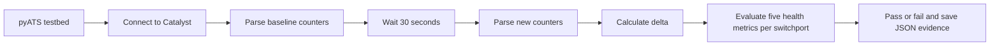

# Optional Lab 17: Validate Catalyst Switchport Health with Cisco pyATS

## Lab Introduction

Switchport counters provide evidence about several different failure modes. CRC errors commonly point toward damaged cabling, optical problems, or interference. Collisions can indicate duplex or shared-media problems, while output errors and drops can expose transmission or queue pressure. Interface resets may accompany driver, link, or platform events. Because any single cumulative value can describe an old incident rather than an active fault, this lab uses Cisco pyATS and Genie to take two structured samples and evaluate the change between them.

Learners connect to a Cisco Catalyst IOS XE switch, parse `show interfaces`, record a baseline, wait 30 seconds, and collect a second sample. The test evaluates CRC errors, interface resets, collisions, output errors, and output drops for every discovered physical Ethernet interface. It fails when a monitored counter increases or resets between samples, producing repeatable evidence instead of relying on visual inspection of CLI text.

## Learning Objectives

- Define an IOS XE switch in a pyATS testbed.
- Use Genie to parse `show interfaces`.
- Extract switchport health counters without regular expressions against raw CLI.
- Compare baseline and current counters.
- Distinguish cumulative nonzero values from counters that are actively increasing.
- Interpret passed, failed, missing, and reset-counter conditions.
- Preserve pyATS logs and a JSON evidence file.

## Test Flow



## Prerequisites

- Ubuntu workstation and GitLab.com account.
- A Cisco Catalyst IOS XE switch or reservable Catalyst 9000v sandbox.
- SSH credentials and permission to run `show interfaces`.
- Basic Python dictionary and exception-handling knowledge.

A virtual C9000V normally reports zero CRC errors and collisions because it has no physical copper or optical medium. However, it may contain nonzero interface-reset or drop counters caused by earlier lifecycle activity. The lab still validates the workflow because it evaluates counter movement during the sampling window. Use a dedicated physical lab switch when the objective is to investigate real Layer 1 faults. Do not damage cables or disturb production links to manufacture errors.

## Task 1: Create the Repository

Create a private standalone project named `optional_lab17_switchport_health`, clone it under `~/ccnpauto-workspace`, and copy the supplied Lab 17 files into it using VS Code, including the hidden `.env.example` file.

## Task 2: Install pyATS and Genie

```bash
python3 -m venv .venv
source .venv/bin/activate
python -m pip install --upgrade pip
python -m pip install -r requirements.txt
pyats version check
python -m py_compile switchport_health_test.py job.py
python -m pytest -q
```

The requirements file installs `pyats[full]`, Cisco's complete bundle containing pyATS, Genie parsers, Unicon, and the platform connection plugins. Installation can take several minutes because the bundle includes platform models, parsers, and connection support. The supplied unit tests verify metric extraction from both supported parsed-data layouts without connecting to the sandbox.

If an earlier copy of this lab installed only `pyats` and `genie`, upgrade the existing virtual environment before continuing:

```bash
python -m pip install --upgrade 'pyats[full]'
```

The quotation marks prevent the shell from interpreting the square brackets. Confirm that the IOS XE connection plugin and parser libraries import successfully:

```bash
python -c "import unicon.plugins; import genie.libs.parser; print('pyATS full installation is ready')"
```

## Task 3: Configure Connection Variables

Open `.env.example`, create a new `.env` file in the repository root, copy and paste the example content into it, and enter the current switch details. Do not commit `.env`:

```text
CATALYST_HOST=<sandbox-host-or-ip>
CATALYST_PORT=<sandbox-ssh-port>
CATALYST_USERNAME=<sandbox-username>
CATALYST_PASSWORD=<sandbox-password>
```

Load the variables:

```bash
set -a
source .env
set +a
```

The `%ENV{...}` expressions in `testbed.yaml` read these values without storing a password in YAML. The CLI connection also sets `learn_hostname: true`. Consequently, Unicon learns the actual Catalyst prompt instead of assuming that the testbed key `catalyst` is the switch hostname.

## Task 4: Validate the Testbed

```bash
pyats validate testbed testbed.yaml
pyats parse "show version" \
  --testbed-file testbed.yaml \
  --devices catalyst
```

The validation command can display this warning:

```text
Device 'catalyst' has no interface definitions
```

This is expected and does not indicate a failed testbed. Static interface definitions are required when a pyATS topology models links between devices. This lab does not model a topology or depend on predetermined port names; instead, Genie parses `show interfaces`, and the Python test discovers eligible physical Ethernet interfaces from the returned operational data. Therefore, do not add placeholder interfaces merely to suppress the warning. Continue when the device appears under **Testbed Devices**, no message appears under **YAML Lint Messages**, and the subsequent `show version` parse connects successfully.

If validation succeeds but connection fails, confirm the reservation host, SSH port, VPN, username, and password. `os: iosxe` is required so Genie selects IOS XE parsers.

If `pyats parse` reports `device is not connected, output must be provided`, it means the parser received no CLI output because connection establishment did not complete. Confirm that `pyats[full]` is installed, reload the `.env` values, and verify that none are missing without displaying their contents:

```bash
python - <<'PY'
import os

for name in (
    "CATALYST_HOST",
    "CATALYST_PORT",
    "CATALYST_USERNAME",
    "CATALYST_PASSWORD",
):
    print(f"{name}: {'set' if os.getenv(name) else 'MISSING'}")
PY
```

Then retry the `show version` parse before proceeding to `show interfaces`. The testbed's `learn_hostname: true` setting handles a switch prompt that differs from the logical device name `catalyst`.

## Task 5: Explore Parsed Interface Data

```bash
pyats parse "show interfaces" \
  --testbed-file testbed.yaml \
  --devices catalyst
```

Locate one physical Ethernet interface in the parsed dictionary. Current IOS XE `ShowInterfaces` parser releases normally place interface names at the top level. The supplied extraction function also accepts output wrapped in an `interfaces` dictionary for compatibility with other Genie workflows. Within each interface, the IOS XE Genie schema normally exposes:

| Health metric | Structured Genie path below an interface |
|---|---|
| CRC errors | `counters.in_crc_errors` |
| Interface resets | `counters.out_interface_resets` |
| Collisions | `counters.out_collision` |
| Output errors | `counters.out_errors` |
| Total output drops | `queues.total_output_drop` |

Some IOS XE variants expose output drops as `counters.out_drops`, so the supplied extraction function supports that documented alternative. It deliberately follows known structured paths instead of recursively matching any key containing words such as `drop` or `error`, which could select a different counter.

The test deliberately selects physical Ethernet names and excludes loopbacks, VLAN interfaces, port channels, and management abstractions.

## Task 6: Review the aetest Structure

`switchport_health_test.py` contains:

- `CommonSetup`, which connects once;
- `SwitchportHealthTest.setup`, which captures all available baseline metrics;
- `SwitchportHealthTest.test`, which waits, resamples, compares every interface and metric, and writes JSON;
- `CommonCleanup`, which disconnects.

The default increase threshold is zero. Therefore, any positive delta fails. A negative delta also fails because it usually means the counter was cleared or the device reloaded between samples, making the comparison invalid. A cumulative value such as two interface resets at both samples produces a delta of zero and passes; the artifact still preserves that baseline for operational review.

## Task 7: Run the Test

```bash
pyats run job job.py \
  --testbed-file testbed.yaml
```

Review the terminal summary. A healthy virtual switch should normally pass. Then inspect:

```bash
find artifacts -maxdepth 1 -type f -name 'switchport_health_*.json' -print
```

Open the newest JSON file in VS Code. Each record contains:

```json
{
  "interface": "GigabitEthernet1/0/1",
  "metric": "interface_resets",
  "baseline": 2,
  "current": 2,
  "delta": 0,
  "status": "pass"
}
```

pyATS also creates its standard run archive and logs. These show setup, test, cleanup, and result details.

## Task 8: Interpret a Failure

A positive delta proves only that a particular counter increased during the observation window; it does not identify the defective component. Interpret the affected metric before acting:

| Increasing metric | Initial investigation |
|---|---|
| CRC errors | Cabling, connectors, optics, interference, remote-interface CRC counters |
| Interface resets | Link transitions, driver or platform events, logs, recent administrative actions |
| Collisions | Duplex negotiation, legacy shared media, incorrect forced speed or duplex |
| Output errors | Interface hardware, carrier state, encapsulation, related output counters |
| Output drops | Queue congestion, oversubscription, QoS policy, burst behavior |

A professional response also correlates:

- interface description and neighbor;
- speed, duplex, and autonegotiation;
- input errors and frame errors;
- transceiver DOM readings;
- cable or fiber test results;
- errors on the remote endpoint;
- recent physical changes.

The test alerts engineers to active degradation. A separate monitoring policy can evaluate large historical counters, because a stable nonzero baseline may still justify investigation even though this short-window test passes.

## Task 9: Change the Observation Policy

Open `job.py`. Change:

```python
sample_interval=30,
increase_threshold=0,
```

For a longer observation, use 60 seconds. A nonzero threshold is appropriate only when the organization has documented why a small increase is tolerable. Run the test again and compare artifacts.

## Task 10: Commit the Reusable Test

Confirm `.env`, artifacts, and pyATS archives are excluded:

```bash
git status
git add .
git commit -m "Add pyATS Catalyst switchport health test"
git push
```

## Key Takeaways

- Structured Genie output is safer than matching counter columns in raw CLI text.
- Counter deltas distinguish active errors from old cumulative values.
- Counter resets and missing interfaces make a comparison invalid.
- pyATS separates setup, test logic, cleanup, evidence, and final result.
- CRC errors, resets, collisions, output errors, and output drops represent different operational conditions and require different investigations.

## Further Reading

- [Cisco pyATS Documentation](https://developer.cisco.com/docs/pyats/)
- [Genie Parsers](https://developer.cisco.com/docs/genie-docs/)
- [pyATS aetest](https://devnet-pubhub-site.s3.amazonaws.com/media/pyats/docs/aetest/index.html)
