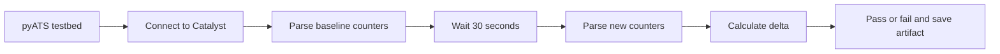

# Optional Lab 17: Test Catalyst Port CRC Errors with Cisco pyATS

## Lab Introduction

CRC errors usually indicate damaged cabling, optical problems, interference, duplex faults, or failing hardware. A single cumulative counter does not reveal whether a fault is active, so this lab uses Cisco pyATS and Genie to take two structured samples and evaluate the change between them.

Learners connect to a Cisco Catalyst IOS XE switch, parse `show interfaces`, record a baseline, wait 30 seconds, collect a second sample, and fail the test when any physical Ethernet port’s CRC counter increases. The result is a repeatable automated test rather than a visual inspection of CLI text.

## Learning Objectives

- Define an IOS XE switch in a pyATS testbed.
- Use Genie to parse `show interfaces`.
- Extract CRC counters without regular expressions against raw CLI.
- Compare baseline and current counters.
- Interpret passed, failed, missing, and reset-counter conditions.
- Preserve pyATS logs and a JSON evidence file.

## Test Flow



## Prerequisites

- Ubuntu workstation and GitLab.com account.
- A Cisco Catalyst IOS XE switch or reservable Catalyst 9000v sandbox.
- SSH credentials and permission to run `show interfaces`.
- Basic Python dictionary and exception-handling knowledge.

A virtual sandbox normally reports zero CRC errors because it has no physical copper or optical medium. The lab still validates the test workflow. Use a dedicated physical lab switch when the objective is to observe real Layer 1 faults. Do not damage cables or disturb production links to manufacture errors.

## Task 1: Create the Repository

Create a private standalone project named `optional_lab17_pyats_crc`, clone it under `~/ccnpauto-workspace`, and copy the supplied Lab 17 files into it using VS Code, including the hidden `.env.example` file.

## Task 2: Install pyATS and Genie

```bash
python3 -m venv .venv
source .venv/bin/activate
python -m pip install --upgrade pip
python -m pip install -r requirements.txt
pyats version check
```

Installation can take several minutes because pyATS and Genie include platform models and parsers.

## Task 3: Configure Connection Variables

Open `.env.example`, create a new `.env` file in the repository root, copy and paste the example content into it, and enter the current switch details. Do not commit `.env`:

```text
CATALYST_HOST=<sandbox-host-or-ip>
CATALYST_PORT=<sandbox-ssh-port>
CATALYST_USERNAME=<sandbox-username>
CATALYST_PASSWORD=<sandbox-password>
```

Load the variables:

```bash
set -a
source .env
set +a
```

The `%ENV{...}` expressions in `testbed.yaml` read these values without storing a password in YAML.

## Task 4: Validate the Testbed

```bash
pyats validate testbed testbed.yaml
pyats parse "show version" \
  --testbed-file testbed.yaml \
  --devices catalyst
```

If validation succeeds but connection fails, confirm the reservation host, SSH port, VPN, username, and password. `os: iosxe` is required so Genie selects IOS XE parsers.

## Task 5: Explore Parsed Interface Data

```bash
pyats parse "show interfaces" \
  --testbed-file testbed.yaml \
  --devices catalyst
```

Locate the `interfaces` dictionary, one Ethernet interface, its `counters` dictionary, and the CRC-related key. Parser keys can vary between platform and Genie releases, so `extract_crc_counters()` accepts several established CRC key names and a constrained CRC-key fallback.

The test deliberately selects physical Ethernet names and excludes loopbacks, VLAN interfaces, port channels, and management abstractions.

## Task 6: Review the aetest Structure

`crc_test.py` contains:

- `CommonSetup`, which connects once;
- `CRCCounterTest.setup`, which captures the baseline;
- `CRCCounterTest.test`, which waits, resamples, compares, and writes JSON;
- `CommonCleanup`, which disconnects.

The default threshold is zero. Therefore, any positive delta fails. A negative delta also fails because it usually means the counter was cleared or the device reloaded between samples, making the comparison invalid.

## Task 7: Run the Test

```bash
pyats run job job.py \
  --testbed-file testbed.yaml
```

Review the terminal summary. A healthy virtual switch should normally pass. Then inspect:

```bash
find artifacts -maxdepth 1 -type f -name 'crc_results_*.json' -print
```

Open the newest JSON file in VS Code. Each record contains:

```json
{
  "interface": "GigabitEthernet1/0/1",
  "baseline": 0,
  "current": 0,
  "delta": 0,
  "status": "pass"
}
```

pyATS also creates its standard run archive and logs. These show setup, test, cleanup, and result details.

## Task 8: Interpret a Failure

A positive CRC delta proves that corrupted frames were counted during the observation window. It does not identify the defective component. A professional response correlates:

- interface description and neighbor;
- speed, duplex, and autonegotiation;
- input errors and frame errors;
- transceiver DOM readings;
- cable or fiber test results;
- errors on the remote endpoint;
- recent physical changes.

The test should alert engineers to active degradation, while a separate monitoring policy can evaluate large historical counters.

## Task 9: Change the Observation Policy

Open `job.py`. Change:

```python
sample_interval=30,
crc_threshold=0,
```

For a longer observation, use 60 seconds. A nonzero threshold is appropriate only when the organization has documented why a small increase is tolerable. Run the test again and compare artifacts.

## Task 10: Commit the Reusable Test

Confirm `.env`, artifacts, and pyATS archives are excluded:

```bash
git status
git add .
git commit -m "Add pyATS Catalyst CRC counter test"
git push
```

## Key Takeaways

- Structured Genie output is safer than matching columns in raw CLI text.
- Counter deltas distinguish active errors from old cumulative values.
- Counter resets and missing interfaces make a comparison invalid.
- pyATS separates setup, test logic, cleanup, evidence, and final result.
- A CRC alert starts Layer 1 investigation; it does not identify root cause by itself.

## Further Reading

- [Cisco pyATS Documentation](https://developer.cisco.com/docs/pyats/)
- [Genie Parsers](https://developer.cisco.com/docs/genie-docs/)
- [pyATS aetest](https://devnet-pubhub-site.s3.amazonaws.com/media/pyats/docs/aetest/index.html)
