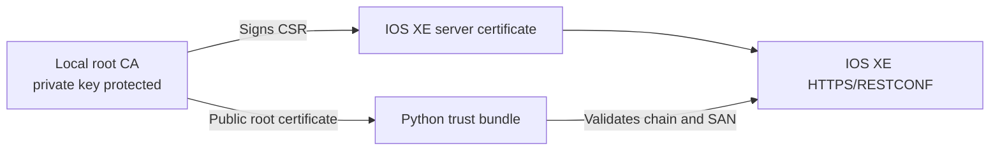

# Optional Lab 18: Secure IOS XE RESTCONF with a Local Certificate Authority

## Lab Introduction

Many lab scripts use `verify=False` to bypass certificate validation. Although convenient, that setting prevents the client from proving that it has reached the intended RESTCONF server. An attacker who can redirect traffic could present another certificate and intercept credentials or configuration data.

In this standalone lab, learners create a local root certificate authority with OpenSSL, generate an IOS XE certificate-signing request, sign the router certificate, bind it to the IOS XE HTTPS server, and build a Python `requests` client that trusts only the local CA. The client validates the certificate chain, validity period, and subject alternative name.

## Learning Objectives

- Explain the roles of a root CA, server key, CSR, server certificate, and trust store.
- Create and protect a local OpenSSL root CA.
- Create an IOS XE RSA key pair and PKI trustpoint.
- Sign and import an IOS XE HTTPS certificate.
- Bind the trustpoint to the RESTCONF HTTPS server.
- Validate RESTCONF with `requests` and a CA bundle.
- Diagnose chain, hostname, expiry, and connection failures.

## Trust Flow



## Prerequisites and Safety

- Ubuntu workstation with OpenSSL and Python.
- Dedicated or reservable IOS XE router on which PKI and HTTPS changes are permitted.
- Direct HTTPS reachability to the router IP and a lab-only RESTCONF account.
- Permission to edit the workstation’s `/etc/hosts`.

This is a learning CA, not an enterprise PKI. Protect its private key, never commit it, and never use it to issue production certificates. The router certificate must contain the DNS name or IP used in the Python URL. Certificate validation correctly fails when they do not match.

## Task 1: Create the Repository

Create a private standalone project named `optional_lab18_restconf_pki`, clone it under `~/ccnpauto-workspace`, and copy the Lab 18 files into it using VS Code, including the hidden `.env.example` file.

Create and activate the environment:

```bash
python3 -m venv .venv
source .venv/bin/activate
python -m pip install --upgrade pip
python -m pip install -r requirements.txt
```

## Task 2: Choose the RESTCONF Identity

This lab uses:

```text
iosxe.lab.local
```

Open `ca/iosxe-san.cnf` and replace `REPLACE_WITH_ROUTER_IP` with the directly reachable IOS XE address. Keep both entries:

```ini
DNS.1 = iosxe.lab.local
IP.1 = <router-ip>
```

Map the DNS name locally:

```bash
sudo nano /etc/hosts
```

Add:

```text
<router-ip> iosxe.lab.local
```

If the sandbox exposes RESTCONF through a nondefault port, include that port in `IOSXE_BASE_URL`; the certificate identity remains `iosxe.lab.local`.

## Task 3: Create the Local Root CA

Create the working directories:

```bash
mkdir -p ca/private ca/certs ca/csr
chmod 700 ca/private
```

Generate an encrypted 4096-bit CA private key:

```bash
openssl genrsa \
  -aes256 \
  -out ca/private/ccnpauto-root-ca.key.pem \
  4096
chmod 600 ca/private/ccnpauto-root-ca.key.pem
```

Use a unique passphrase and store it in an approved password manager. Generate the self-signed root certificate:

```bash
openssl req \
  -x509 \
  -new \
  -sha256 \
  -days 3650 \
  -key ca/private/ccnpauto-root-ca.key.pem \
  -out ca/certs/ccnpauto-root-ca.crt.pem \
  -subj "/C=AU/O=CCNPAUTO Lab/CN=CCNPAUTO Lab Root CA" \
  -addext "basicConstraints=critical,CA:TRUE" \
  -addext "keyUsage=critical,keyCertSign,cRLSign"
```

Inspect it:

```bash
openssl x509 \
  -in ca/certs/ccnpauto-root-ca.crt.pem \
  -noout -subject -issuer -dates -fingerprint -sha256
```

The subject and issuer are identical because this is a self-signed root. The SHA-256 fingerprint provides a strong out-of-band value for identifying the certificate. A later IOS XE step also obtains the MD5 fingerprint because the trustpoint `fingerprint` command on the lab router expects that format. This compatibility use does not change the certificate signature configured with SHA-256.

## Task 4: Create the IOS XE Trustpoint and Key

On IOS XE:

```text
configure terminal
crypto key generate rsa general-keys label RESTCONF-RSA modulus 2048
crypto pki trustpoint CCNPAUTO-RESTCONF
 enrollment terminal
 subject-name cn=iosxe.lab.local
 fqdn iosxe.lab.local
 revocation-check none
 rsakeypair RESTCONF-RSA
 hash sha256
end
```

`revocation-check none` is limited to this offline learning CA, which does not publish CRL or OCSP services.

## Task 5: Trust the Root CA on IOS XE

Before importing the root certificate, calculate the MD5 fingerprint that IOS XE will match against the trustpoint. Run this on Ubuntu:

```bash
openssl x509 \
  -in ca/certs/ccnpauto-root-ca.crt.pem \
  -noout \
  -fingerprint \
  -md5
```

OpenSSL displays a colon-separated value similar to:

```text
MD5 Fingerprint=8A:71:8C:E3:B9:7E:9F:C7:58:5E:D7:E8:1E:3C:92:37
```

Every learner generates a different CA certificate, so do not copy the example fingerprint. Remove the colons from your own result and arrange the 32 hexadecimal characters as four groups of eight:

```text
8A718CE3 B97E9FC7 585ED7E8 1E3C9237
```

Configure that value under the existing trustpoint on IOS XE. Replace the sample with the fingerprint calculated from your certificate:

```text
configure terminal
crypto pki trustpoint CCNPAUTO-RESTCONF
 fingerprint <YOUR-CA-MD5-FINGERPRINT>
end
```

For example, the placeholder is replaced with four hexadecimal groups, not entered literally:

```text
fingerprint 8A718CE3 B97E9FC7 585ED7E8 1E3C9237
```

Now display the root certificate on Ubuntu:

```bash
openssl x509 \
  -in ca/certs/ccnpauto-root-ca.crt.pem \
  -outform PEM
```

On IOS XE:

```text
crypto pki authenticate CCNPAUTO-RESTCONF
```

Paste the complete root certificate, including the `BEGIN CERTIFICATE` and `END CERTIFICATE` lines, and then enter a blank line. IOS XE compares the certificate presented during authentication with the fingerprint already stored under the trustpoint. Continue only when the displayed certificate fingerprint matches the value calculated on Ubuntu.

A successful authentication reports output similar to:

```text
Certificate validated - fingerprints matched.
Trustpoint CA certificate accepted.
% Certificate successfully imported
```

If IOS XE reports the following messages, the `fingerprint` command was omitted or configured with the wrong value:

```text
Trustpoint fingerprint must be supplied.
Trustpoint CA certificate is rejected. Abort.
% Error in saving certificate: status = FAIL
```

The rejected authentication does not normally require the trustpoint to be deleted. Return to the existing trustpoint, configure the correct fingerprint, and repeat `crypto pki authenticate CCNPAUTO-RESTCONF`.

Verify:

```text
show crypto pki certificates CCNPAUTO-RESTCONF
```

## Task 6: Generate and Save the IOS XE CSR

On IOS XE:

```text
crypto pki enroll CCNPAUTO-RESTCONF
```

Accept enrollment and choose to display the certificate request. Copy the complete base64 request. In VS Code, create `ca/csr/iosxe.csr.pem` and paste:

```text
-----BEGIN CERTIFICATE REQUEST-----
<router-generated-base64>
-----END CERTIFICATE REQUEST-----
```

Inspect the CSR:

```bash
openssl req \
  -in ca/csr/iosxe.csr.pem \
  -noout -subject -text
```

## Task 7: Sign the Router Certificate

Confirm the IP in `ca/iosxe-san.cnf`, then sign:

```bash
openssl x509 \
  -req \
  -in ca/csr/iosxe.csr.pem \
  -CA ca/certs/ccnpauto-root-ca.crt.pem \
  -CAkey ca/private/ccnpauto-root-ca.key.pem \
  -CAcreateserial \
  -out ca/certs/iosxe-restconf.crt.pem \
  -days 825 \
  -sha256 \
  -extfile ca/iosxe-san.cnf \
  -extensions v3_server
```

Validate the chain and inspect SAN:

```bash
openssl verify \
  -CAfile ca/certs/ccnpauto-root-ca.crt.pem \
  ca/certs/iosxe-restconf.crt.pem

openssl x509 \
  -in ca/certs/iosxe-restconf.crt.pem \
  -noout -subject -issuer -dates -ext subjectAltName
```

The verification result must be `OK`, and the SAN must contain the selected DNS name and router IP.

## Task 8: Import and Bind the Server Certificate

Display the signed server certificate:

```bash
openssl x509 \
  -in ca/certs/iosxe-restconf.crt.pem \
  -outform PEM
```

On IOS XE:

```text
crypto pki import CCNPAUTO-RESTCONF certificate
```

Paste the complete server certificate and finish with a blank line. Then bind the trustpoint:

```text
configure terminal
ip http secure-server
ip http secure-trustpoint CCNPAUTO-RESTCONF
restconf
end
```

Verify:

```text
show crypto pki certificates CCNPAUTO-RESTCONF
show running-config | include ip http|restconf
```

The trustpoint should contain both the CA certificate and an identity certificate associated with `RESTCONF-RSA`.

## Task 9: Configure the Secure Python Client

Open `.env.example`, create a new `.env` file in the repository root, and copy and paste the example content into it. Then update `.env`:

```text
IOSXE_BASE_URL=https://iosxe.lab.local
IOSXE_USERNAME=<restconf-username>
IOSXE_PASSWORD=<restconf-password>
CA_BUNDLE=ca/certs/ccnpauto-root-ca.crt.pem
REQUEST_TIMEOUT=15
```

Do not add `VERIFY=false`. The client passes the root CA file to `requests`:

```python
response = session.get(
    url,
    verify=str(ca_bundle),
    timeout=15,
)
```

The root CA certificate is public and can be distributed to clients. Its private key must remain secret.

## Task 10: Run and Interpret the Request

```bash
python secure_restconf.py
```

A successful result reports HTTP `200` and lists configured interfaces. The TLS handshake occurred before RESTCONF authentication or JSON parsing.

To prove validation is active, temporarily change the URL to the router IP while removing its IP SAN, or set `CA_BUNDLE` to an unrelated CA file. The request should fail with `SSLError`. Restore the correct settings immediately; do not solve the failure with `verify=False`.

## Task 11: Troubleshoot by Failure Type

| Evidence | Likely cause |
|---|---|
| `certificate verify failed: unable to get local issuer` | Wrong CA bundle or incomplete chain |
| `IP address mismatch` or `hostname mismatch` | URL identity absent from SAN |
| Certificate expired or not yet valid | Clock or validity problem |
| `Trustpoint fingerprint must be supplied` | Calculate the CA certificate's MD5 fingerprint, configure `fingerprint <value>` under `CCNPAUTO-RESTCONF`, and repeat CA authentication |
| HTTP `401` | TLS succeeded; RESTCONF credentials failed |
| HTTP `403` | TLS and authentication succeeded; authorization failed |
| Connection refused or timeout | Address, port, route, or HTTPS service issue |
| HTTP `404` | RESTCONF resource or model path issue |

Use OpenSSL for an independent TLS check:

```bash
openssl s_client \
  -connect iosxe.lab.local:443 \
  -servername iosxe.lab.local \
  -CAfile ca/certs/ccnpauto-root-ca.crt.pem \
  </dev/null
```

The final verification code should be `0 (ok)`.

## Task 12: Protect and Clean Up

Do not commit `.env`, private keys, CSRs, issued certificates, or serial files. Commit the Python source, requirements, guide, and SAN template only.

When the instructor requires cleanup, first bind HTTPS to an approved replacement trustpoint. Removing the active trustpoint before replacement can disrupt RESTCONF. Then remove only the lab identity:

```text
configure terminal
no crypto pki trustpoint CCNPAUTO-RESTCONF
end
crypto key zeroize rsa RESTCONF-RSA
```

## Key Takeaways

- TLS authentication requires both a trusted issuer and a matching SAN.
- A CA private key signs certificates and must never be distributed to clients.
- IOS XE uses a trustpoint to associate CA trust, identity certificate, and private key.
- `requests` accepts a CA bundle path through `verify`; `verify=False` removes server authentication.
- HTTP status troubleshooting begins only after the TLS handshake succeeds.

## Further Reading

- [Python Requests SSL Certificate Verification](https://requests.readthedocs.io/en/latest/user/advanced/#ssl-cert-verification)
- [OpenSSL Documentation](https://docs.openssl.org/)
- [Cisco IOS XE PKI Configuration Guide](https://www.cisco.com/c/en/us/support/docs/security-vpn/public-key-infrastructure-pki/221852-configure-and-verify-certificate-sign.html)
