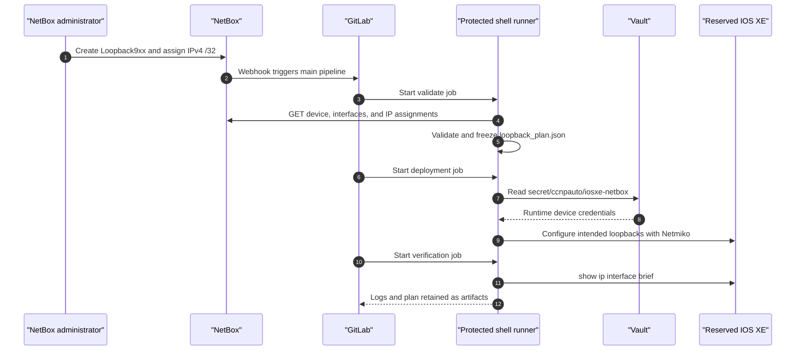

# Lab 18: NetBox-Driven Loopback Automation

## Lab Introduction

YAML files are useful sources of truth for small automation projects, but they provide limited relationships, allocation controls, role-based access, audit history, and API discovery. NetBox models devices, interfaces, prefixes, and IP addresses as related objects and exposes those objects through a REST API. This makes it suitable as a network source of truth rather than merely a documentation database.

In this lab, learners install NetBox on the Ubuntu 26.04 workstation and model a reservable IOS XE sandbox. Loopback interfaces and their /32 addresses exist in NetBox instead of a YAML file. When an administrator creates an IP address and assigns it to a managed loopback, a NetBox event rule sends a webhook to GitLab's pipeline-trigger API. The pipeline retrieves the complete intended loopback set from NetBox, validates it, freezes it into a plan artifact, obtains device credentials from HashiCorp Vault, configures IOS XE with Netmiko, verifies operational state, and retains UTC audit logs.

## Learning Objectives

After completing this lab, you will be able to:

- Explain the difference between a source of truth and observed device state.
- Install NetBox locally with the community Docker Compose project.
- Model a site, manufacturer, device type, role, platform, and IOS XE device.
- Create virtual loopback interfaces and assign /32 IP addresses.
- Generate and protect a NetBox REST API token.
- Query devices, interfaces, and assigned addresses with `pynetbox`.
- Validate naming, address, uniqueness, and ownership constraints.
- Configure NetBox webhooks through event rules.
- Trigger a GitLab pipeline through a pipeline trigger token.
- Freeze source-of-truth state into a reviewed pipeline artifact.
- Retrieve IOS XE credentials from Vault at runtime.
- Configure and verify loopbacks with Netmiko.
- Serialize network deployments with a GitLab resource group.
- Interpret audit logs from NetBox, GitLab, Vault, and the automation application.

## Estimated Time

Allow approximately **5 to 7 hours**, including NetBox installation and data modeling.

## Prerequisites

- Ubuntu 26.04 workstation prepared in Lab 1
- Docker Engine and Docker Compose
- Local GitLab and GitLab Runner from Lab 1
- Protected shell runner tagged `network-deploy`, as built in Lab 11
- HashiCorp Vault development service from Lab 1
- Active IOS XE reservable sandbox and VPN
- Python virtual environment with access from the shell runner account

NetBox, GitLab, Vault, and the runner all reside on the learner workstation. This topology is convenient for training but does not represent a resilient production deployment.

## End-to-End Architecture



The webhook does not send device commands or treat its event payload as trusted configuration. It only starts the pipeline. The pipeline queries NetBox again and validates the authoritative current state.

## Managed Scope

The automation manages only interfaces matching:

```text
Loopback900 through Loopback999
```

Each managed interface must have exactly one IPv4 `/32` address. Other NetBox interfaces and IOS XE configuration remain outside the lab's ownership. The workflow is additive: it creates or updates intended loopbacks but does not delete router interfaces merely because they are absent from NetBox.

## Project Structure

```text
lab18-netbox-loopbacks/
├── .gitlab-ci.yml
├── .gitignore
├── requirements.txt
├── files/
│   └── docker-compose.override.yml
├── scripts/
│   ├── validate_intent.py
│   ├── deploy_loopbacks.py
│   └── verify_loopbacks.py
└── src/
    └── common.py
```

## Task 1: Install NetBox with Docker Compose

Place the NetBox service outside the course Git repositories:

```bash
mkdir -p "$HOME/lab-services"
cd "$HOME/lab-services"
git clone --branch release --depth 1 \
  https://github.com/netbox-community/netbox-docker.git
cd netbox-docker
```

Copy the supplied override file into the NetBox Docker project:

```bash
cp /path/to/CCNPAUTO/LAB/Lab18/files/docker-compose.override.yml \
  docker-compose.override.yml
```

The override publishes NetBox only on workstation loopback port 8000. It also maps `gitlab.lab.local` to Docker's host gateway for both the NetBox web and worker containers. The worker performs webhook delivery, so adding the mapping only to the web container is insufficient.

Pull and start NetBox:

```bash
docker compose pull
docker compose up -d
docker compose ps
docker compose logs --tail=100 netbox
```

Create the administrator account:

```bash
docker compose exec netbox \
  /opt/netbox/netbox/manage.py createsuperuser
```

Open:

```text
http://127.0.0.1:8000
```

Change the training password after the first login. The Docker volumes contain the PostgreSQL database and must not be deleted during ordinary cleanup.

## Task 2: Model the IOS XE Sandbox

Create the following objects through the NetBox interface. Names may vary slightly by NetBox release, but their relationships remain the same.

| Object | Suggested value |
|---|---|
| Site | `DEVNET-SANDBOX` |
| Manufacturer | `Cisco` |
| Device type | `IOS-XE-SANDBOX` |
| Device role | `Router` |
| Platform | `Cisco IOS XE` |
| Device | `iosxe-sandbox` |
| Status | Active |

The device name must match the pipeline variable `NETBOX_DEVICE_NAME`. Add the current management address only if it helps documentation; the pipeline retrieves connection details from Vault because sandbox endpoints can change between reservations.

NetBox describes intended resources. It does not discover the router automatically in this lab, and creating an interface in NetBox does not itself configure IOS XE.

## Task 3: Create an Initial Loopback and Address

On `iosxe-sandbox`, add:

| Field | Value |
|---|---|
| Interface name | `Loopback900` |
| Type | Virtual |
| Enabled | Yes |
| Description | `NETBOX_MANAGED_LAB18` |

Then create IP address `198.18.90.1/32` with Active status and assign it to the DCIM interface `iosxe-sandbox / Loopback900`.

NetBox assigns IP addresses to interfaces, not directly to devices. This relationship allows one interface to carry multiple addresses, although the lab contract deliberately permits exactly one IPv4 /32 per managed loopback.

## Task 4: Create a NetBox API Token

Create an API token for the learner or a dedicated automation user. Give it read access to DCIM devices and interfaces and IPAM addresses. Record the token only once in a secure temporary location.

Test it from the workstation:

```bash
export NETBOX_TOKEN='REPLACE_WITH_TOKEN'
curl --silent \
  --header "Authorization: Token $NETBOX_TOKEN" \
  --header "Accept: application/json" \
  'http://127.0.0.1:8000/api/dcim/devices/?name=iosxe-sandbox' | jq
```

Do not put the token in Git, screenshots, pipeline logs, or the webhook URL.

## Task 5: Create the GitLab Automation Project

Create a blank private project named `lab18-netbox-loopbacks`, clone it, and copy the Lab 18 files. Commit and push them to `main`.

Protect the `main` branch. Confirm that the protected shell runner tagged `network-deploy` is online and assigned to the project. Because this runner executes repository code directly on the workstation, only trusted maintainers should be allowed to merge into `main`.

## Task 6: Store Sandbox Credentials in Vault

Start the Lab 1 development Vault and create the credential path:

```bash
export VAULT_ADDR=http://127.0.0.1:8200
export VAULT_TOKEN='LAB1_DEV_TOKEN'

vault kv put secret/ccnpauto/iosxe-netbox \
  host='RESERVED_IOSXE_HOST' \
  port='SSH_PORT' \
  username='SANDBOX_USERNAME' \
  password='SANDBOX_PASSWORD'
```

The NetBox device object describes identity and intended interfaces. Vault provides current connection credentials. Separating these concerns prevents NetBox exports and API responses from becoming password stores.

## Task 7: Configure Protected GitLab Variables

In **Settings > CI/CD > Variables**, add:

| Variable | Value | Controls |
|---|---|---|
| `NETBOX_URL` | `http://127.0.0.1:8000` | Protected |
| `NETBOX_TOKEN` | NetBox API token | Masked, protected |
| `NETBOX_DEVICE_NAME` | `iosxe-sandbox` | Protected |
| `VAULT_ADDR` | `http://127.0.0.1:8200` | Protected |
| `VAULT_TOKEN` | Lab Vault token | Masked, protected |

The shell runner uses the host network namespace, so loopback URLs reach local NetBox and Vault. A Docker executor would require host-gateway routing instead.

## Task 8: Run the Pipeline Manually

Before enabling event-driven execution, select **Build > Pipelines > New pipeline** and run `main` manually.

The validation job performs these checks:

- NetBox device exists.
- Interface name matches `Loopback9xx`.
- Every managed interface has exactly one assigned IP.
- The address is IPv4 with a `/32` prefix.
- The address belongs to the lab allocation `198.18.90.0/24`.
- Loopback IDs and addresses are unique.
- Descriptions contain only a bounded set of CLI-safe characters.

It writes `artifacts/loopback_plan.json`. Download and inspect the plan. Deployment uses this artifact rather than querying NetBox again, creating a stable snapshot for that pipeline.

The deployment job retrieves Vault credentials, sends interface configuration, and records `deployment.log`. The verification job runs `show ip interface brief` and requires every planned loopback to be present with the expected address and up/up state.

Verify manually:

```text
show ip interface brief | include Loopback9
show running-config interface Loopback900
```

## Task 9: Create the GitLab Pipeline Trigger

In the GitLab project, open **Settings > CI/CD > Pipeline triggers** and create a trigger named `netbox-loopback-event`. Copy the token and note the numeric project ID.

The trigger URL has this form:

```text
http://gitlab.lab.local:8088/api/v4/projects/PROJECT_ID/trigger/pipeline?token=TRIGGER_TOKEN&ref=main
```

The trigger token is a credential. NetBox administrators who can view the webhook configuration may be able to see it. Limit NetBox administrative access and revoke the token after the lab.

Test connectivity from the worker container before creating the webhook:

```bash
cd "$HOME/lab-services/netbox-docker"
docker compose exec netbox-worker \
  python -c "import urllib.request; print(urllib.request.urlopen('http://gitlab.lab.local:8088/users/sign_in').status)"
```

An HTTP response proves hostname resolution and port reachability.

## Task 10: Configure the NetBox Webhook and Event Rule

In NetBox, create a webhook with:

| Setting | Value |
|---|---|
| Name | `Trigger GitLab Loopback Pipeline` |
| Method | POST |
| URL | GitLab trigger URL from Task 9 |
| Content type | `application/json` |
| SSL verification | Not applicable to the local HTTP training URL |

Create an event rule that invokes this webhook when an **IPAM IP Address** object is created. If the current NetBox release supports event conditions in the UI, narrow the rule to addresses assigned to DCIM interfaces. The pipeline still enforces its own Loopback900–999 scope.

The event is attached to IP address creation rather than bare interface creation. This prevents GitLab from reading the interface before its address has been assigned. Operationally, “adding the loopback” is complete only when both objects and their relationship exist.

## Task 11: Trigger an Event-Driven Deployment

Create `Loopback901` on `iosxe-sandbox`, then create and assign `198.18.90.2/32`. NetBox should queue the webhook, and GitLab should show a pipeline whose source is `trigger`.

Observe all three stages:

```text
validate → deploy → verify
```

Download the artifacts and confirm the frozen plan contains Loopback900 and Loopback901. Verify IOS XE:

```text
show ip interface brief | include Loopback90
```

## Task 12: Test Validation Failures

Create one of the following invalid conditions and observe a failed validation before device login:

- A managed loopback with no assigned address
- More than one address assigned to a managed loopback
- An address with a prefix other than `/32`
- A duplicate address

Because the webhook triggers on address creation, an address-less interface alone does not start a pipeline. Run a manual pipeline to test that condition. Correct the NetBox data and trigger again.

## Task 13: Interpret Audit Evidence

Four systems contribute evidence:

- **NetBox change log** identifies who changed the interface or address.
- **NetBox webhook records** show event delivery and response status.
- **GitLab pipeline metadata** records the trigger, commit, jobs, and runner.
- **Application artifacts** preserve intended plan, deployment response, verification result, and UTC timestamps.
- **Vault audit logs**, when enabled in production, identify secret access without revealing the secret.

Correlate event times across these systems. Accurate NTP is essential when investigating whether a device change corresponds to an approved source-of-truth event.

## Task 14: Understand Update and Deletion Behavior

The workflow is intentionally additive. Changing an assigned address and triggering a pipeline updates the interface address. Removing a loopback from NetBox does not remove it from IOS XE because absence can result from an incomplete database, operator error, or replication issue.

A production deletion design should require explicit desired state such as `decommissioning`, a reviewed change request, impact checks, approval, and a separate cleanup workflow. Silent “delete everything not returned by the API” behavior is unsafe.

## Task 15: Clean Up

Remove only the lab-owned router interfaces:

```text
configure terminal
no interface Loopback900
no interface Loopback901
end
```

Delete or mark the corresponding NetBox objects as decommissioned according to the instructor's policy. Disable the event rule before bulk cleanup to avoid unnecessary pipelines.

Revoke the GitLab pipeline trigger token and NetBox API token. Stop NetBox without deleting volumes:

```bash
cd "$HOME/lab-services/netbox-docker"
docker compose stop
```

Do not use `docker compose down -v` because `-v` deletes persistent database data.

## Troubleshooting

### NetBox does not open on port 8000

```bash
cd "$HOME/lab-services/netbox-docker"
docker compose ps
docker compose logs --tail=200 netbox
sudo ss -lntp | grep ':8000'
```

Initial database migrations can delay readiness.

### The webhook cannot resolve gitlab.lab.local

Confirm the supplied override is active for `netbox-worker`, recreate the services, and test the sign-in URL from that container. Webhooks execute asynchronously in the worker.

### GitLab returns 404 to the webhook

Confirm the numeric project ID and use a pipeline trigger token rather than a personal access token. Verify that the request is POST.

### GitLab returns 400 to the webhook

Confirm that the `main` ref exists and workflow rules allow pipeline source `trigger`.

### Pipeline cannot reach NetBox or Vault

Confirm the job uses the shell runner tagged `network-deploy`. The Docker runner cannot use the workstation's `127.0.0.1` services without additional networking.

### NetBox returns no addresses for an interface

Confirm the IP address's assigned object type is DCIM interface and the selected object is the correct device/interface pair. Merely placing an address in a prefix does not assign it to an interface.

### Verification reports down/down

Inspect IOS XE configuration and interface state. Loopbacks should normally become up/up after `no shutdown`; an unsupported name, rejected command, or conflicting configuration requires investigation.

## Key Takeaways

- NetBox models related network intent and exposes it through an API.
- Interfaces and IP addresses are separate objects joined by assignment.
- Event rules and webhooks convert source-of-truth changes into automation events.
- Webhooks should trigger controlled workflows, not execute device changes directly.
- A frozen plan artifact prevents source data from changing silently during deployment.
- Vault supplies current credentials without turning NetBox into a password store.
- Protected runners and branches define an important authorization boundary.
- Post-deployment verification proves observed state rather than assuming command success.
- Additive synchronization is safer than implicit deletion.
- Auditability requires correlating evidence across NetBox, GitLab, Vault, and the application.

The next lab can extend this design with reconciliation, approvals, explicit decommissioning state, and drift dashboards that compare NetBox intent with live device observations.

## Further Reading

- [NetBox documentation](https://netboxlabs.com/docs/netbox/)
- [NetBox Docker](https://github.com/netbox-community/netbox-docker)
- [NetBox REST API](https://netboxlabs.com/docs/netbox/integrations/rest-api/)
- [NetBox event rules](https://netboxlabs.com/docs/netbox/features/event-rules/)
- [GitLab pipeline triggers](https://docs.gitlab.com/ci/triggers/)
- [pynetbox documentation](https://pynetbox.readthedocs.io/)
