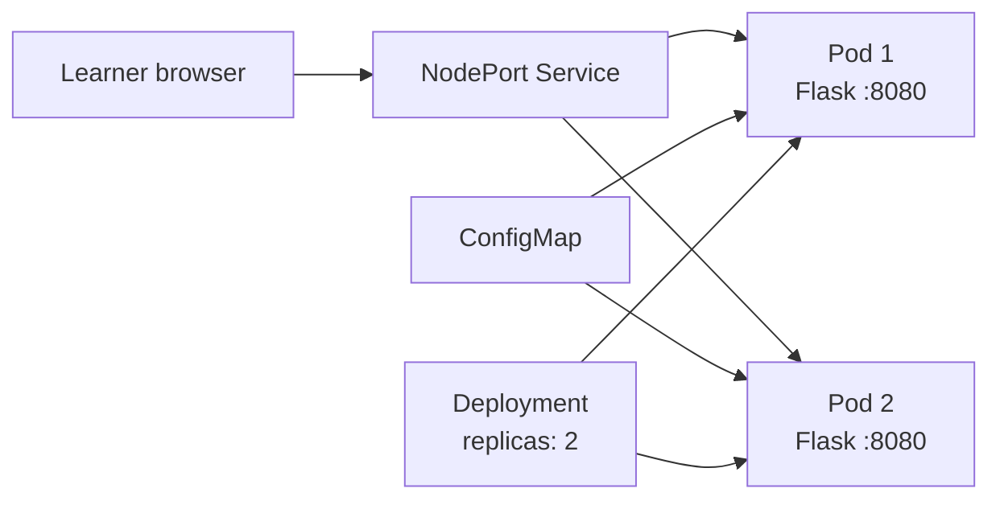

# Optional Lab 19: Learn Kubernetes Fundamentals with Minikube

## Lab Introduction

Network automation services are often delivered as containers, but a container alone does not provide scheduling, health checks, scaling, or controlled rollout. Kubernetes adds these capabilities through declarative objects. This standalone beginner lab uses Minikube to run a small local cluster and deploy a simple network-status web service.

The application is intentionally stateless. It returns the pod name, namespace, and a message supplied by a ConfigMap. Learners can therefore see Kubernetes distribute requests across replicas while practicing the basic operational workflow.

## Learning Objectives

- Explain pods, Deployments, Services, ConfigMaps, probes, and namespaces.
- Create a local Kubernetes cluster with Minikube.
- Build an image directly into the Minikube image store.
- Deploy and expose a two-replica application.
- Inspect desired and observed state with `kubectl`.
- Scale, update, roll back, and test self-healing.
- Stop and delete the standalone cluster safely.

## Architecture


```mermaid
flowchart LR
    U["Learner browser"] --> S["NodePort Service"]
    S --> P1["Pod 1<br/>Flask :8080"]
    S --> P2["Pod 2<br/>Flask :8080"]
    C["ConfigMap"] --> P1
    C --> P2
    D["Deployment<br/>replicas: 2"] --> P1
    D --> P2
```

## Prerequisites

- Ubuntu 26.04 workstation with Docker.
- At least 2 CPU cores, 4 GB free memory, and 10 GB free disk for Minikube.
- Internet access for installation and base-image download.
- Basic familiarity with containers and YAML.

This lab does not use a Cisco sandbox, GitLab Runner, NetBox, Vault, or the main course repository.

## Task 1: Create the Repository

Create a private GitLab.com project named `optional_lab19_minikube`, clone it under `~/ccnpauto-workspace`, and copy the contents of `CCNPAUTO/LAB/Lab19/` into it using VS Code.

## Task 2: Install `kubectl` and Minikube

Install `kubectl` with the current official Kubernetes instructions. On an Ubuntu workstation with Snap available:

```bash
sudo snap install kubectl --classic
kubectl version --client
```

Determine the workstation architecture:

```bash
dpkg --print-architecture
```

For `amd64`, download and install the current Minikube binary:

```bash
wget -O minikube \
  https://storage.googleapis.com/minikube/releases/latest/minikube-linux-amd64
sudo install minikube /usr/local/bin/minikube
minikube version
```

For `arm64`, replace `amd64` in the URL with `arm64`. Remove the downloaded working copy after installation through the file manager.

## Task 3: Start the Cluster

```bash
minikube start \
  --driver=docker \
  --cpus=2 \
  --memory=4096
```

Minikube’s Docker driver creates a local Kubernetes node inside a managed container. This is an intentional exception to the course’s normal host-networked application containers because Kubernetes must create and control its own pod and service networks.

Verify the cluster:

```bash
minikube status
kubectl cluster-info
kubectl get nodes -o wide
kubectl get namespaces
```

The node should report `Ready`.

## Task 4: Review the Application and Manifests

`app.py` provides:

- `/` for application identity and pod information;
- `/health` for readiness and liveness probes.

The Kubernetes folder contains:

- `configmap.yaml`, which separates a message from the image;
- `deployment.yaml`, which requests two replicas and defines health probes;
- `service.yaml`, which gives changing pods a stable virtual endpoint.

Validate the YAML on the client:

```bash
kubectl apply --dry-run=client -f kubernetes/
```

## Task 5: Build the Image Inside Minikube

```bash
minikube image build -t network-status:1.0 .
minikube image ls | grep network-status
```

Building into Minikube avoids pushing this learning image to a public registry. `imagePullPolicy: IfNotPresent` tells the node to use the local image.

## Task 6: Deploy the Application

Create a dedicated namespace:

```bash
kubectl create namespace network-lab
kubectl config set-context --current --namespace=network-lab
```

Apply the objects:

```bash
kubectl apply -f kubernetes/configmap.yaml
kubectl apply -f kubernetes/deployment.yaml
kubectl apply -f kubernetes/service.yaml
kubectl rollout status deployment/network-status
```

Inspect the resources:

```bash
kubectl get deployments
kubectl get replicasets
kubectl get pods -o wide
kubectl get services
kubectl describe deployment network-status
```

The Deployment is the desired-state controller. The ReplicaSet maintains two pods, while the Service selects them through the `app: network-status` label.

## Task 7: Access the Service

```bash
minikube service network-status --url -n network-lab
```

Open the displayed URL in a browser. Refresh several times and compare the `pod` value. The Service can send successive requests to different ready replicas.

Inspect a pod’s logs:

```bash
kubectl logs deployment/network-status --tail=20
```

## Task 8: Explore Configuration and Probes

View the configuration:

```bash
kubectl get configmap network-status-config -o yaml
kubectl describe pod -l app=network-status
```

Readiness determines whether a pod may receive Service traffic. Liveness determines whether Kubernetes should restart the container. Resource requests help scheduling, while limits constrain consumption.

## Task 9: Scale the Deployment

```bash
kubectl scale deployment network-status --replicas=3
kubectl rollout status deployment/network-status
kubectl get pods -o wide
```

Scaling changes the desired replica count. Kubernetes creates one additional pod without changing the Service.

## Task 10: Observe Self-Healing

Choose one pod name and delete it:

```bash
kubectl get pods
kubectl delete pod <one-pod-name>
kubectl get pods --watch
```

Press `Ctrl+C` after the replacement becomes `Running` and `Ready`. The Deployment controller creates a replacement because the observed number of replicas temporarily fell below the desired number.

## Task 11: Perform a Controlled Update

Edit `kubernetes/configmap.yaml` and change `APP_MESSAGE`. Apply it:

```bash
kubectl apply -f kubernetes/configmap.yaml
kubectl rollout restart deployment/network-status
kubectl rollout status deployment/network-status
```

Environment variables are read when a container starts, so the controlled restart makes the new ConfigMap value visible. Refresh the service URL.

Inspect rollout history:

```bash
kubectl rollout history deployment/network-status
```

## Task 12: Clean Up

```bash
kubectl delete namespace network-lab
kubectl config set-context --current --namespace=default
minikube stop
```

`minikube stop` preserves the cluster for later use. When it is no longer required:

```bash
minikube delete
```

## Key Takeaways

- Deployments continuously reconcile desired replicas with observed pods.
- Services provide a stable endpoint in front of replaceable pods.
- ConfigMaps separate nonsecret settings from container images.
- Readiness and liveness probes serve different operational purposes.
- Minikube provides a safe local environment for practicing Kubernetes lifecycle operations.

## Further Reading

- [Minikube Documentation](https://minikube.sigs.k8s.io/docs/)
- [Kubernetes Deployments](https://kubernetes.io/docs/concepts/workloads/controllers/deployment/)
- [Kubernetes Services](https://kubernetes.io/docs/concepts/services-networking/service/)
- [Configure Liveness and Readiness Probes](https://kubernetes.io/docs/tasks/configure-pod-container/configure-liveness-readiness-startup-probes/)
