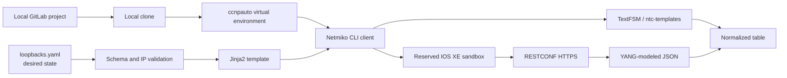
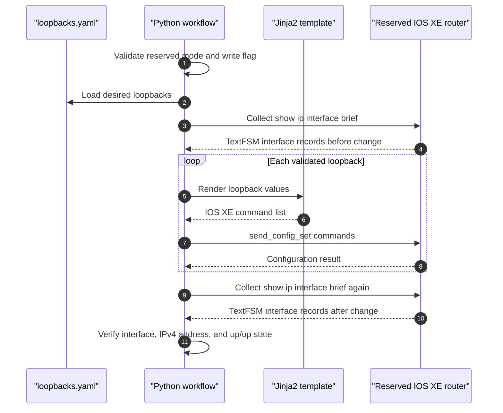

# Lab 2: IOS XE Automation Warm-Up

## Lab Introduction

Cisco DevNet Sandboxes provide remotely accessible Cisco products for learning, development, and API testing without requiring every learner to own physical equipment. A sandbox is more than a device address. It is a temporary lab environment with an access policy, topology, credentials, permitted operations, and reset behavior. Reading those details before connecting is part of responsible automation.

DevNet offers two broad sandbox models. An **Always-On** sandbox is available immediately and is shared among users, so administrative access is restricted. A **reservable** sandbox is assigned to one learner or team for a defined period and may require a VPN connection. Because Lab 2 includes configuration changes, every learner is assumed to have an active reservable IOS XE instance whose instructions permit CLI and RESTCONF access.

The reservation boundary remains important even when the first operations are read-only. Learners should use the same assigned IOS XE instance from initial collection through loopback configuration and RESTCONF verification. The supplied Python code requires `SANDBOX_MODE=reserved` and still refuses to send configuration while the separate change-enable flag remains false.

The lab begins with familiar CLI commands transported through Netmiko. TextFSM converts their human-oriented text into lists of dictionaries, allowing the script to print consistent tables. The lab then introduces a small desired-state workflow: YAML records loopback intent, Jinja2 renders IOS XE commands, and a reusable client applies and verifies the change. GitLab records that source-of-truth modification through a feature branch and merge request. Finally, the same interface state is collected from RESTCONF as YANG-modeled JSON, allowing learners to compare screen scraping with a structured API.

## Learning Objectives

After completing this lab, you will be able to:

- Explain why this configuration lab requires a reservable DevNet Sandbox.
- Create and clone a project from the GitLab instance on the learner workstation.
- Reuse the Python virtual environment created in Lab 1 and add project dependencies.
- Connect securely to IOS XE with Netmiko.
- Execute `show version` and `show ip interface brief` through Python.
- Parse supported CLI output with TextFSM and iterate through structured records.
- Print network information in readable tables.
- Use YAML as a limited source of truth for managed loopback interfaces.
- Render IOS XE configuration from a Jinja2 template.
- Apply and verify a loopback configuration only in a reserved sandbox.
- Create a Git feature branch, push it to GitLab, review it, and merge it into `main`.
- Explain the limitations of TextFSM and the value of YANG-modeled JSON and XML.
- Retrieve and normalize IOS XE interface information through RESTCONF.

## Estimated Time

Allow approximately **2.5 to 4 hours**. Reserving a sandbox and establishing VPN access may require additional time.

## Prerequisites

Before starting, confirm that Lab 1 is complete. The workstation should contain:

- The `ccnpauto` Python virtual environment
- Git and Visual Studio Code
- Local GitLab CE at `http://gitlab.lab.local:8088`
- A working learner GitLab account and personal access token
- Internet access to Cisco DevNet
- Cisco.com/DevNet credentials

The configuration task also requires an active reservable IOS XE sandbox and, where stated by the sandbox instructions, a Cisco Secure Client VPN connection.

## Automation Flow



## Project Structure

The supplied project separates transport, settings, validation, presentation, and executable workflows:

```text
lab2-iosxe-warmup/
├── .env.example
├── .gitignore
├── requirements.txt
├── data/
│   └── loopbacks.yaml
├── inventory/
│   └── devices.yaml
├── scripts/
│   ├── apply_loopbacks.py
│   ├── collect_cli.py
│   ├── collect_restconf.py
│   └── compare_cli_restconf.py
├── src/
│   ├── iosxe_cli.py
│   ├── iosxe_restconf.py
│   ├── loopback_source.py
│   ├── reporting.py
│   └── settings.py
└── templates/
    └── loopback.j2
```

The scripts are intentionally thin. Reusable behavior belongs in `src`, so collecting interface state does not need to be rewritten for configuration verification or protocol comparison.

## Task 1: Select and Access the IOS XE Sandbox

Sign in to the [Cisco DevNet Sandbox](https://devnetsandbox.cisco.com/) with the learner's Cisco account and search for IOS XE. Although the catalog also contains shared Always-On environments, select a **reservable IOS XE sandbox**, such as an available Catalyst 8000V/8kv environment, because this lab changes interface configuration.

For the complete lab, select a **reservable IOS XE sandbox** that supports CLI and RESTCONF configuration. Reserve the environment for the required period and wait until its status reports that setup is complete. Read the reservation instructions rather than relying on credentials copied from a blog or previous course. Sandbox hostnames, ports, credentials, images, and VPN procedures can change.

Record these values privately:

| Required value | Where to find it |
|---|---|
| Router hostname or IP address | Reservation topology/instructions |
| SSH port | Reservation instructions, commonly TCP 22 |
| HTTPS/RESTCONF port | Reservation instructions, commonly TCP 443 |
| Username and password | Reservation credentials |
| VPN endpoint and credentials | Reservation VPN instructions, if required |

Connect the VPN if the reservable sandbox requires it. Do not proceed to the configuration task until the router address is reachable through the expected path.

### Verify Network Reachability

Install a TCP test utility if it is missing:

```bash
command -v nc >/dev/null || sudo apt install -y netcat-openbsd
```

Test the exact host and ports shown by the reservation:

```bash
nc -vz <IOSXE_HOST> <SSH_PORT>
nc -vz <IOSXE_HOST> <HTTPS_PORT>
```

A successful TCP test proves that a service accepted the connection. It does not prove that credentials, authorization, or RESTCONF media types are correct.

### Sandbox Safety Boundaries

During this lab:

- Do not modify the management interface, default route, AAA, local users, SSH, HTTPS, RESTCONF, or VPN-related configuration.
- Do not erase configuration, reload the device, or save changes with `write memory` unless the reservation explicitly requires it.
- Create only the loopback allocated by the lab.
- Do not run configuration code against any device outside the active learner reservation.
- Assume the reservation will be reset when it expires.

## Task 2: Create and Clone the GitLab Repository

Open the learner's local GitLab at `http://gitlab.lab.local:8088`. Create a **private** project with these settings:

- Project name: `lab2-iosxe-warmup`
- Project slug: `lab2-iosxe-warmup`
- Initialize repository with a README
- Default branch: `main`

Copy the HTTP clone URL. Then clone the project into the course workspace:

```bash
mkdir -p "$HOME/ccnpauto-workspace"
cd "$HOME/ccnpauto-workspace"
git clone http://gitlab.lab.local:8088/YOUR_USERNAME/lab2-iosxe-warmup.git
cd lab2-iosxe-warmup
git status
git remote -v
```

When Git requests a password, use a narrowly scoped GitLab personal access token rather than placing a token in the clone URL. A token embedded in a command may remain in shell history and process logs.

Copy the project files from the Lab 2 course folder into the clone. Set `LAB2_FILES` to the actual Lab 2 path on the learner workstation:

```bash
LAB2_FILES="/path/to/CCNPAUTO/LAB/Lab2"
cp "$LAB2_FILES/requirements.txt" "$LAB2_FILES/.env.example" "$LAB2_FILES/.gitignore" .
cp -R "$LAB2_FILES/data" "$LAB2_FILES/inventory" "$LAB2_FILES/scripts" \
  "$LAB2_FILES/src" "$LAB2_FILES/templates" .
tree -a -I '.git'
```

Review `.gitignore` before creating credentials:

```bash
cat .gitignore
git check-ignore -v .env || true
```

Commit the reusable project code to `main`:

```bash
git add .
git status
git commit -m "Add reusable IOS XE automation project"
git push origin main
```

At this point, `main` contains code but no device secrets and no requested loopback intent.

## Task 3: Activate Python and Install Missing Libraries

Activate the virtual environment created in Lab 1:

```bash
source "$HOME/.venvs/ccnpauto/bin/activate"
which python
python --version
```

Install the dependencies required by this project. `pip` installs only missing or incompatible packages, so this step is safe when some packages already exist:

```bash
python -m pip install -r requirements.txt
python -m pip check
```

The project adds several libraries to the Lab 1 environment:

| Library | Use in this lab |
|---|---|
| `netmiko` | IOS XE SSH/CLI transport |
| `ntc-templates` | Community TextFSM templates used by Netmiko |
| `tabulate` | Table rendering |
| `PyYAML` | Safe YAML parsing through the `yaml` import |
| `Jinja2` | Configuration template rendering |
| `python-dotenv` | Loading untracked connection settings from `.env` |
| `requests` | RESTCONF HTTPS client |

Confirm the imports and locate the installed TextFSM template package:

```bash
python - <<'PY'
import jinja2
import netmiko
import ntc_templates
import requests
import tabulate
import yaml

print("netmiko:", netmiko.__version__)
print("requests:", requests.__version__)
print("ntc-templates:", ntc_templates.__file__)
PY
```

If a later script reports a missing module, keep the virtual environment active and install through `python -m pip install PACKAGE`. Do not use `sudo pip` and do not modify Ubuntu's system Python.

## Task 4: Configure Credentials and Collect CLI Data

Copy the example environment file and protect it:

```bash
cp .env.example .env
chmod 600 .env
code .env
```

Enter the values from the active reservable sandbox. Keep the configuration gate disabled during the collection task:

```dotenv
SANDBOX_MODE=reserved
ALLOW_CONFIG_CHANGES=false
```

Do not commit `.env`. Verify that Git ignores it:

```bash
git check-ignore -v .env
git status --short
```

### Understand the CLI Client

Open `src/iosxe_cli.py`. `IOSXECLIClient` is a context manager. Its `__enter__` method opens the Netmiko connection, and `__exit__` disconnects even when collection raises an exception. That lifecycle prevents abandoned SSH sessions on the sandbox.

The private `_send_structured()` method uses:

```python
result = self.connection.send_command(command, use_textfsm=True)
```

Netmiko identifies a TextFSM template from the platform and command. When parsing succeeds, the result is a list of dictionaries. When no template matches or parsing fails, Netmiko may return the original string. The wrapper treats a string as an error instead of accidentally iterating through it one character at a time.

The collection script reuses two methods and two presentation functions:

```python
with IOSXECLIClient(settings) as device:
    version_records = device.collect_version()
    interface_records = device.collect_interfaces()

print_version(version_records)
print_interfaces(interface_records, "IOS XE Interfaces from CLI and TextFSM")
```

`collect_interfaces()` loops over the TextFSM records and normalizes template field names into four stable keys: `interface`, `ip_address`, `status`, and `protocol`. The reporting module loops through those dictionaries again to construct rows for `tabulate`.

### Run the CLI Collector

Run executable files as modules from the project root. This keeps the project root on Python's import path:

```bash
python -m scripts.collect_cli
```

Expected output resembles the following, although sandbox values will differ:

```text
IOS XE Software and Platform
============================
| Hostname   | IOS XE Version   | Image                         | Uptime   | Serial   |
|------------|------------------|-------------------------------|----------|----------|
| sandbox-r1 | 17.x             | packages.conf                 | ...      | ...      |

IOS XE Interfaces from CLI and TextFSM
======================================
| Interface          | IPv4 Address   | Admin Status   | Protocol   |
|--------------------|----------------|----------------|------------|
| GigabitEthernet1   | ...            | up             | up         |
| Loopback...        | ...            | up             | up         |
```

Examine the raw parsed data in an interactive Python session if the normalization seems unclear:

```bash
python - <<'PY'
from pprint import pprint

from src.iosxe_cli import IOSXECLIClient
from src.settings import Settings

with IOSXECLIClient(Settings.from_env()) as device:
    pprint(device.collect_version())
    pprint(device.collect_interfaces())
PY
```

This completes the read-only warm-up. The next task moves desired state through a controlled Git branch before applying it.

## Task 5: Create a Feature Branch for Loopback Intent

Confirm once more that the active reservation belongs to the learner and permits configuration before creating the source-of-truth change.

Create a focused branch:

```bash
git switch main
git pull --ff-only
git switch -c feature/add-loopback-101
git branch --show-current
```

Open `data/loopbacks.yaml`. It begins with an empty list so the new desired state appears clearly in the branch diff. Replace it with:

```yaml
---
loopbacks:
  - id: 101
    description: LAB2_MANAGED_AUTOMATION
    ipv4: 192.0.2.101
    prefix_length: 32
    enabled: true
```

The address comes from the documentation prefix `192.0.2.0/24` and is suitable for an isolated loopback exercise. If the reservation instructions allocate a different range or Loopback101 already exists, choose an instructor-approved ID and address. Never overwrite an existing interface that the lab does not own.

### Validate YAML and Preview Jinja2 Output

The YAML file is a **scoped source of truth**: it owns only the loopbacks listed in this file and only the attributes rendered by this lab. It does not claim ownership of every interface on the router, and the script deliberately does not delete interfaces omitted from the file.

Validate and render without connecting to the router:

```bash
python - <<'PY'
from pathlib import Path

from src.loopback_source import load_loopbacks, render_commands

root = Path.cwd()
for loopback in load_loopbacks(root / "data" / "loopbacks.yaml"):
    print(f"Loopback{loopback['id']}")
    for command in render_commands(loopback, root / "templates"):
        print(f"  {command}")
PY
```

The expected command set is:

```text
interface Loopback101
 description LAB2_MANAGED_AUTOMATION
 ip address 192.0.2.101 255.255.255.255
 no shutdown
```

The Python validator checks required fields, duplicate IDs, duplicate addresses, IPv4 syntax, prefix length, one-line descriptions, and a real YAML Boolean for `enabled`. Jinja2 uses `StrictUndefined`, so a misspelled variable fails instead of silently producing an incomplete command.

Review the branch diff:

```bash
git diff -- data/loopbacks.yaml
```

## Task 6: Apply and Verify the Loopback

Open `.env` and make the second deliberate change gate:

```dotenv
SANDBOX_MODE=reserved
ALLOW_CONFIG_CHANGES=true
```

Both values are required. This is not intended as unbreakable security; it is a guard against pointing a configuration script at a shared environment through habit or copy-and-paste.

Run the source-of-truth workflow:

```bash
python -m scripts.apply_loopbacks
```

The script performs these steps:



The workflow reuses `IOSXECLIClient.collect_interfaces()` before and after the change. It therefore verifies with the same collection path established in Task 4 rather than introducing a second ad hoc parser.

Run the script a second time:

```bash
python -m scripts.apply_loopbacks
```

IOS configuration commands describing the same state are operationally idempotent: sending them again should leave the managed attributes unchanged. However, this introductory workflow does not calculate a full candidate diff, remove omitted loopbacks, or manage every interface property. Later labs will distinguish repeatable command execution from complete declarative reconciliation.

### Keep the Change in Git

Review, commit, and push the branch:

```bash
git status
git diff
git add data/loopbacks.yaml
git diff --staged
git commit -m "Define managed Lab 2 loopback"
git push -u origin feature/add-loopback-101
```

Open the GitLab project and create a merge request from `feature/add-loopback-101` into `main`. In the description, include:

- The reserved sandbox used
- The intended Loopback ID and address
- The validation and rendered commands
- The before/after verification result
- The fact that no startup configuration was saved

Review the diff and merge it. Then synchronize the local repository:

```bash
git switch main
git pull --ff-only
git log --oneline --graph --decorate -5
git branch -d feature/add-loopback-101
```

In a production workflow, the merge request would normally be approved before a protected pipeline applied network intent. The lab applies the branch manually first so the learner can observe every stage; do not mistake that teaching order for a production change-control design.

## Task 7: Understand the Limits of TextFSM

TextFSM is valuable because many network platforms expose important state through CLI commands. It converts familiar output into structured records without requiring the engineer to write a new regular-expression parser for every script. Nevertheless, it does not turn the CLI into a formal API.

### Template Dependence

A TextFSM template recognizes a particular command format through regular expressions and state transitions. Minor differences in command spelling, platform family, IOS XE release, field wrapping, localization, or optional output can cause a field to be missed or the entire parse to fail. Installing `ntc-templates` supplies many community-maintained templates, but coverage is not universal.

### Loss of Meaning

The template selects a subset of visible text and assigns locally chosen field names. Information that the template does not capture disappears from the structured result. Types are also weak: an interface index, speed, Boolean, and timestamp commonly arrive as strings unless application code converts them. The parser knows that text matched a regular expression; it does not know the YANG datatype, units, defaults, constraints, or whether a value is configuration or operational state.

### CLI Is Human-Oriented

CLI output is designed for engineers reading a terminal. Columns may wrap, abbreviations may change, and pagination or banners can interfere. The command itself can require privilege and may consume device resources. A parser can return plausible but incomplete data, so automation must detect unexpected types, empty results, and missing fields rather than assuming that `use_textfsm=True` always succeeded.

### JSON and XML Are Encodings, Not Schemas

JSON and XML provide explicit structure, but structure alone does not guarantee a stable contract. In model-driven IOS XE, YANG defines containers, lists, keys, leaf datatypes, constraints, namespaces, configuration status, and operational state. RESTCONF commonly encodes YANG data as JSON or XML, while NETCONF uses XML for RPC messages and datastore content.

For example, a JSON object preserves list and field boundaries without column parsing:

```json
{
  "Cisco-IOS-XE-interfaces-oper:interfaces": {
    "interface": [
      {
        "name": "Loopback101",
        "ipv4": "192.0.2.101",
        "admin-status": "if-state-up",
        "oper-status": "if-oper-state-ready"
      }
    ]
  }
}
```

The equivalent XML uses elements and a namespace:

```xml
<interfaces xmlns="http://cisco.com/ns/yang/Cisco-IOS-XE-interfaces-oper">
  <interface>
    <name>Loopback101</name>
    <ipv4>192.0.2.101</ipv4>
    <admin-status>if-state-up</admin-status>
    <oper-status>if-oper-state-ready</oper-status>
  </interface>
</interfaces>
```

Applications must still handle model revisions, namespace-qualified names, optional leaves, lists, HTTP errors, authorization, and TLS. Structured APIs reduce ambiguity; they do not eliminate the need for validation.

## Task 8: Explore RESTCONF with an Explicit HTTP Request

RESTCONF is defined by RFC 8040 and exposes YANG-modeled resources through HTTP methods. This lab uses `GET`, which is safe and read-only. IOS XE normally protects RESTCONF with HTTPS and device credentials.

First, display the connection values without printing the password:

```bash
python - <<'PY'
from src.settings import Settings

s = Settings.from_env()
print("Host:", s.host)
print("HTTPS port:", s.https_port)
print("Username:", s.username)
print("TLS verification:", s.verify_tls)
PY
```

Use `curl` to inspect the Cisco operational interface resource. Replace the placeholders with the active values. Supplying only the username causes `curl` to prompt for the password instead of recording it in shell history:

```bash
curl --insecure \
  --user '<IOSXE_USERNAME>' \
  --header 'Accept: application/yang-data+json' \
  'https://<IOSXE_HOST>:<HTTPS_PORT>/restconf/data/Cisco-IOS-XE-interfaces-oper:interfaces' \
  | jq
```

`--insecure` disables certificate validation and is acceptable only when the reserved lab presents a certificate that the workstation cannot validate. A production client should trust the issuing CA, verify the hostname, and omit this option.

The request components are:

| Component | Meaning |
|---|---|
| `GET` | Retrieve a resource without requesting a state change |
| `/restconf/data` | RESTCONF data resource root |
| `Cisco-IOS-XE-interfaces-oper:interfaces` | Module-qualified YANG container |
| `Accept: application/yang-data+json` | Request YANG data encoded as JSON |
| Basic authentication | Send sandbox credentials over the protected TLS session |

To observe XML encoding, repeat the request with this header:

```bash
--header 'Accept: application/yang-data+xml'
```

The data meaning comes from the YANG model; the `Accept` header selects the representation.

## Task 9: Collect RESTCONF JSON with Python

Open `src/iosxe_restconf.py`. `requests.Session` stores authentication, media headers, and TLS behavior for reuse. Timeouts are a tuple: the client allows up to 10 seconds to establish the connection and up to 45 seconds to read the response. It calls `raise_for_status()` so an authentication failure or missing resource is not mistaken for interface data.

The preferred resource is:

```text
/restconf/data/Cisco-IOS-XE-interfaces-oper:interfaces
```

If that Cisco operational model is not exposed by the sandbox image and returns HTTP 404, the client attempts the IETF operational interface-state resource. The normalizer understands both root names and maps their response fields into the same four keys used by the CLI workflow.

Run the RESTCONF collector:

```bash
python -m scripts.collect_restconf
```

The script writes the unmodified response to `artifacts/interfaces-restconf.json` and prints normalized records as a table. The `artifacts` directory is ignored by Git because operational snapshots can contain addresses, identifiers, or topology data that should not be committed automatically.

Inspect the response deliberately:

```bash
jq 'keys' artifacts/interfaces-restconf.json
jq '.. | objects | select(has("name")) | .name' artifacts/interfaces-restconf.json | head
git status --short --ignored
```

Confirm that Loopback101 appears. The CLI may describe the line protocol as `up`, while the Cisco operational model may encode it as `if-oper-state-ready`. The normalizer maps `ready` to `up` for the comparison table, but the raw artifact preserves the device's original enumeration.

## Task 10: Compare CLI and RESTCONF Sources

The final script collects the interface list through both transports, indexes each list by interface name, and iterates over the union of names. It then prints IP addresses and state side by side:

```bash
python -m scripts.compare_cli_restconf
```

Do not expect every field to match mechanically. A CLI parser and a YANG operational model can differ in naming, timing, inclusion of internal interfaces, or representation of “unassigned.” The purpose of normalization is to make an informed comparison possible, not to hide meaningful semantic differences.

If an interface exists in only one source, investigate the raw data:

1. Run `show ip interface brief` interactively through SSH.
2. Inspect `artifacts/interfaces-restconf.json`.
3. Confirm the YANG resource and IOS XE release.
4. Check whether the interface is internal, filtered, newly created, or represented under another model.
5. Record the reason instead of forcing the values to appear identical.

## Task 11: Final Repository and Lab Validation

Confirm that the merged source-of-truth change is on `main` and that secrets and artifacts remain untracked:

```bash
git branch --show-current
git status
git log --oneline --graph --decorate -6
git check-ignore -v .env artifacts/interfaces-restconf.json
```

Run all three collection paths one final time while the reservation is active:

```bash
source "$HOME/.venvs/ccnpauto/bin/activate"
python -m pip check
python -m scripts.collect_cli
python -m scripts.collect_restconf
python -m scripts.compare_cli_restconf
```

Return the write gate to its safe default after configuration work:

```dotenv
ALLOW_CONFIG_CHANGES=false
```

Because `.env` is not tracked, this safety change does not alter the repository.

## Expected Evidence

Retain the following evidence without including passwords, tokens, VPN credentials, or complete environment files:

- Active reservable IOS XE sandbox name and reservation time
- Successful SSH and HTTPS reachability checks
- GitLab project URL and initial `main` commit
- TextFSM version and interface tables
- Feature branch and merge request for `loopbacks.yaml`
- Rendered Jinja2 commands
- Before-and-after CLI interface tables
- Verification that the managed loopback has the expected address and up/up state
- RESTCONF HTTP status and normalized table
- CLI-to-RESTCONF comparison table
- Final clean Git status on `main`

## Troubleshooting

### SSH times out

For a reserved sandbox, confirm that the VPN is connected and that the route to the sandbox subnet exists:

```bash
ip route
nc -vz <IOSXE_HOST> <SSH_PORT>
```

Re-read the reservation because the router may use a private address or a nondefault port. A timeout is different from an authentication failure.

### Netmiko reports authentication failure

Confirm that `.env` contains the active reservation credentials and no surrounding quotes copied from a formatted document. Do not print the password. Test an interactive SSH session with the same host, port, and username.

### TextFSM returns raw text

Confirm that the virtual environment contains `ntc-templates`, the device type is `cisco_ios`, and the command has not been altered:

```bash
python -m pip show netmiko ntc-templates
python -c 'import ntc_templates; print(ntc_templates.__file__)'
```

The wrapper raises an error when Netmiko returns a string. Capture the first part of the raw output shown in the exception and compare it with the installed template rather than adding fragile string splits to the production path.

### The configuration script refuses to run

This is expected unless both gates confirm a reserved environment:

```dotenv
SANDBOX_MODE=reserved
ALLOW_CONFIG_CHANGES=true
```

Do not change these values merely to remove the error. First verify that the reservation belongs to the learner and configuration is permitted.

### The loopback exists but verification fails

Check for an existing interface with the same ID, a conflicting IP address, or an unexpected shutdown state:

```text
show running-config interface Loopback101
show ip interface brief | include Loopback101
```

If the lab does not own the existing interface, stop and choose an instructor-approved ID. Do not overwrite it.

### RESTCONF returns HTTP 401 or 403

`401` normally indicates missing or invalid authentication. `403` indicates that the authenticated account is not authorized for the resource. Confirm reservation credentials and privilege rather than retrying repeatedly.

### RESTCONF returns HTTP 404

The specific YANG model or resource path may not be available on that IOS XE image. The Python client attempts the IETF interface-state resource after a 404 from the Cisco operational model. Review the raw error, query the YANG library with YANG Suite, and compare the module name with the device release.

### RESTCONF certificate validation fails

The lab may use a self-signed certificate or an address that does not match its certificate. `VERIFY_TLS=false` suppresses validation only for this controlled sandbox. In a production environment, install the issuing CA and connect using the certificate's correct hostname; do not normalize `verify=False` as standard practice.

### CLI and RESTCONF tables differ

Compare timestamps and raw sources. The CLI command and operational model may represent internal interfaces, protocol state, absent addresses, and enum values differently. Treat the difference as a data-model investigation rather than automatically declaring one source wrong.

## Cleanup and Reservation End

Do not save the running configuration to startup configuration unless the reservation instructions explicitly require it. DevNet resets disposable environments after use.

If the instructor requires the loopback to be removed before releasing a still-active shared reservation, connect to the reserved router and remove only the interface created by this lab:

```text
configure terminal
no interface Loopback101
end
show ip interface brief | include Loopback101
```

Then return `ALLOW_CONFIG_CHANGES=false`, disconnect the VPN, and end the reservation according to the DevNet Sandbox instructions. Removing the interface creates temporary drift from the Git source of truth, but the reservation is being destroyed; the Git history remains the durable record of the lab exercise.

## Key Takeaways

- Reservable sandboxes provide the controlled ownership boundary required for configuration exercises.
- GitLab is the course's system of record, while `.env` keeps sandbox credentials outside version control.
- Netmiko simplifies CLI transport, and TextFSM can turn supported commands into dictionaries, but parser success must be checked explicitly.
- Reusable modules keep connection, collection, presentation, and validation logic consistent across scripts.
- YAML and Jinja2 separate intent from device syntax, although this introductory workflow manages only a bounded subset of loopback state.
- A feature branch and merge request make the source-of-truth change reviewable and traceable.
- JSON and XML preserve structure, while YANG supplies the model, types, constraints, and namespace semantics.
- RESTCONF provides modeled data and HTTP error behavior that are more suitable for application integration than screen scraping.
- Two sources can describe the same network state differently; good automation preserves raw evidence and normalizes only with understood rules.

Lab 3 can build on this repository by adding automated tests, schema validation, CI checks, and a controlled pipeline before network intent is applied.

## Further Reading and Official References

- [Cisco DevNet Sandbox getting started](https://developer.cisco.com/docs/sandbox/getting-started/)
- [Cisco IOS XE sandboxes](https://developer.cisco.com/docs/ios-xe-voip/sandbox/)
- [Cisco IOS XE programmability](https://developer.cisco.com/iosxe/)
- [Cisco YANG Suite documentation](https://developer.cisco.com/docs/yangsuite/)
- [RESTCONF RFC 8040](https://www.rfc-editor.org/rfc/rfc8040)
- [NETCONF RFC 6241](https://www.rfc-editor.org/rfc/rfc6241)
- [Cisco IOS XE YANG models](https://github.com/YangModels/yang/tree/main/vendor/cisco/xe)
- [Netmiko documentation](https://ktbyers.github.io/netmiko/docs/netmiko/)
- [TextFSM project](https://github.com/google/textfsm)
- [ntc-templates project](https://github.com/networktocode/ntc-templates)
- [Jinja documentation](https://jinja.palletsprojects.com/)
- [PyYAML documentation](https://pyyaml.org/wiki/PyYAMLDocumentation)
- [Requests documentation](https://requests.readthedocs.io/)
- [GitLab branches](https://docs.gitlab.com/user/project/repository/branches/)
- [GitLab merge requests](https://docs.gitlab.com/user/project/merge_requests/)
