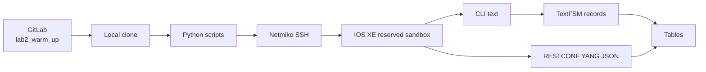

# Lab 2: Network Automation Warm-Up

## Lab Introduction

This short lab helps learners confirm that the workstation, GitLab.com account, Python environment, DevNet VPN, and IOS XE sandbox work together before the main project begins. Learners create a disposable GitLab.com repository named `lab2_warm_up`, connect to a reserved IOS XE router with Netmiko, run `show version` and `show ip interface brief`, parse the output with TextFSM, and display tables. They then retrieve structured YANG JSON interface data through RESTCONF.


## Learning Objectives

- Create and clone a GitLab repository.
- Work in a Python virtual environment.
- Protect credentials with an untracked `.env` file.
- Connect to a reserved IOS XE sandbox with Netmiko.
- Parse common operational commands with TextFSM.
- Iterate through structured records and print tables.
- Retrieve YANG-modeled interface state through RESTCONF.

## Estimated Time

Allow approximately **90 minutes to 2 hours**.

## Prerequisites

- Lab 1 completed
- GitLab.com learner account with the Lab 1 SSH key added
- Python virtual environment from Lab 1
- Active IOS XE reservable sandbox and VPN connection
- Permission to create a private project in the learner's GitLab.com namespace

## Lab Flow



## Project Structure

```text
lab2_warm_up/
├── .env.example
├── .gitignore
├── requirements.txt
├── inventory/
│   └── devices.yaml
├── scripts/
│   ├── __init__.py
│   ├── collect_cli.py
│   └── collect_restconf.py
└── src/
    ├── __init__.py
    ├── iosxe_cli.py
    ├── iosxe_restconf.py
    ├── reporting.py
    └── settings.py
```

## Task 1: Reserve IOS XE

Reserve a private IOS XE sandbox, connect the VPN the sandbox environment, and record the current hostname, SSH port, HTTPS port, username, and password. Do not change any configuration on the sandbox router.


## Task 2: Create `lab2_warm_up` in GitLab

Sign in to [GitLab.com](https://gitlab.com) and create a blank private project in your personal namespace:

- Project name: `lab2_warm_up`
- Project slug: `lab2_warm_up`
- Default branch: `main`
- Do not initialize with a README

Open **Settings > CI/CD > Auto DevOps**, clear **Default to Auto DevOps pipeline**, and save. The warm-up repository does not define a pipeline unless the instructor explicitly performs the optional Runner exercise from Lab 1.

Clone it:

REMEMBER TO CHANGE TO THE ACTUAL USERNAME IN THE BELOW URL

```bash
mkdir -p ~/ccnpauto-workspace
cd ~/ccnpauto-workspace
git clone \
  git@gitlab.com:YOUR_USERNAME/lab2_warm_up.git
cd lab2_warm_up
```

Copy the supplied files (use Linux cp command or simply copy and paste):

```bash
LAB2_FILES="/path/to/CCNPAUTO/LAB/Lab2"
cp "$LAB2_FILES/.env.example" "$LAB2_FILES/.gitignore" \
  "$LAB2_FILES/requirements.txt" .
cp -R "$LAB2_FILES/inventory" "$LAB2_FILES/scripts" "$LAB2_FILES/src" .
```

## Task 3: Install Dependencies

```bash
source ~/.venvs/ccnpauto/bin/activate
python -m pip install -r requirements.txt
python -m pip check
```

Commit the baseline:

```bash
git status
git add .
git commit -m "Add IOS XE warm-up scripts"
git push -u origin main
```

## Task 4: Configure the Environment

```bash
cp .env.example .env
chmod 600 .env
```

Enter the active reservation values. Keep `VERIFY_TLS=false` only because the training device commonly uses a certificate that the workstation does not trust.

Confirm the secret file is ignored:

```bash
git check-ignore -v .env
```

## Task 5: Collect and Parse CLI Data

In the lab 1 folder, run:

```bash
python -m scripts.collect_cli
```

`IOSXEDevice` opens one SSH connection and runs:

```text
show version
show ip interface brief
```

Netmiko asks the `ntc-templates` TextFSM templates to parse each response. The script checks that parsing returned a list rather than raw text, normalizes selected fields, loops through the records, and prints GitHub-style tables.

Review `src/iosxe_cli.py` and identify the connection lifecycle, timeout settings, command execution, and explicit parser-success check.

## Task 6: Understand TextFSM Limitations

TextFSM adds structure to human-oriented output, but the parser depends on exact command wording and templates. A software upgrade can alter spacing or labels. Unsupported commands return raw strings, and parsing generally loses schema constraints and namespace meaning.

This does not make TextFSM unsuitable. It remains useful when an API is unavailable. However, automation must detect parser failure and test templates against supported releases.

## Task 7: Inspect RESTCONF Manually

Load environment variables temporarily:

```bash
set -a
source .env
set +a
```

Retrieve interface state  uring curl command.

```bash
curl -sk -u "$IOSXE_USERNAME:$IOSXE_PASSWORD" \
  -H 'Accept: application/yang-data+json' \
  "https://$IOSXE_HOST:$IOSXE_HTTPS_PORT/restconf/data/Cisco-IOS-XE-interfaces-oper:interfaces" \
  | python -m json.tool | less
```

The JSON field hierarchy comes from a YANG model rather than a screen-oriented CLI format.

## Task 8: Collect RESTCONF Data with Python

```bash
python -m scripts.collect_restconf
```

The client tries the Cisco operational interface model and falls back to `ietf-interfaces:interfaces-state` when the first path returns 404. It saves the unmodified payload under `artifacts/` and prints a normalized table.

Compare the CLI and RESTCONF tables:

- Are interface names identical?
- How are unassigned addresses represented?
- Which source exposes administrative and operational state?
- Which response retains explicit model structure?

## Task 9: Exercise Safe Error Handling

Test one error at a time:

- incorrect password;
- unreachable hostname;
- wrong HTTPS port;
- invalid RESTCONF resource path.

Restore the correct value after each test. The scripts should display controlled authentication, timeout, HTTP, or response-processing errors rather than a long unhandled traceback.

## Task 10: Finish the Warm-Up

```bash
git status --short
git log --oneline --decorate -3
```

Do not commit `.env` or generated artifacts. This repository can remain as completed warm-up evidence, but later labs do not extend it.

## Key Takeaways

- `lab2_warm_up` confirms the workstation-to-sandbox development path.
- Netmiko and TextFSM make common CLI collection approachable, but parsing success must be checked.
- RESTCONF returns structured YANG-modeled data over HTTP.
- `.env` protects credentials from ordinary Git commits but is not a production secret manager.
- Lab 2 is deliberately read-only and independent from the main project.

Lab 3 creates a new repository named `network_automation_project` and introduces the first configuration workflow: YAML-driven loopback management with Jinja2 and Netmiko.

## References

- [Netmiko documentation](https://ktbyers.github.io/netmiko/docs/netmiko/)
- [ntc-templates](https://github.com/networktocode/ntc-templates)
- [RESTCONF RFC 8040](https://www.rfc-editor.org/rfc/rfc8040)
- [Cisco IOS XE programmability](https://developer.cisco.com/iosxe/)
