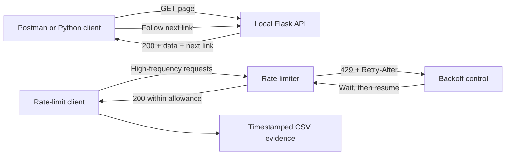

# Optional Lab 20: Simulate API Pagination and HTTP 429 Resilience

## Lab Introduction

An automation client rarely receives an unlimited result set in one response.
Controller and cloud APIs usually divide large collections into pages so that
the server can control memory, response size, and processing time. The client
must therefore continue requesting pages until the API indicates that no next
page exists. Assuming that the first response contains everything can produce
an incomplete inventory without raising an obvious error.

Request frequency is controlled for a different reason. An API may return
`429 Too Many Requests` when a client exceeds the permitted rate. Retrying
immediately increases the load and can extend the outage. A resilient client
recognizes the status, respects `Retry-After`, waits, and then resumes the
logical operation. It also distinguishes a recoverable frequency limit from
an unrecoverable authentication, authorization, or validation error.

This standalone lab uses a local Flask server instead of a shared Cisco
sandbox. Consequently, every learner receives the same 100 interface records,
five predictable pages, and reproducible `429` responses without placing load
on production or sandbox infrastructure.

## Learning Objectives

After completing this lab, you will be able to:

- Explain why APIs paginate large collections.
- Inspect page metadata, navigation links, and pagination headers.
- Follow server-provided `next` links until all records are collected.
- Detect malformed or repeated pagination responses.
- Interpret HTTP `429` and the `Retry-After` response header.
- Apply bounded backoff and resume a logical request safely.
- Stop retrying unrecoverable HTTP failures.
- Preserve timestamped logs and CSV evidence for every request attempt.

## Application Flow



## Task 1: Create the Standalone Project

Create a private GitLab.com project named
`standalone_http_resilience`. Clone it under
`~/ccnpauto-workspace`, and then open the clone in VS Code.

Using the VS Code Explorer, copy and paste the contents of
`CCNPAUTO/LAB/Lab20 - Simulate API Pagination and HTTP 429 Resilience/` into the repository. Keep the supplied
`requirements.txt`; do not create a second requirements file.

Create and activate a dedicated virtual environment:

```bash
cd ~/ccnpauto-workspace/standalone_http_resilience
python3 -m venv .venv
source .venv/bin/activate
python -m pip install --upgrade pip
python -m pip install -r requirements.txt
```

This lab does not require NetBox, Vault, GitLab Runner, Yangsuite, TIG, or a
Cisco sandbox reservation. Stop those services if they are not needed by
another exercise.

## Task 2: Understand the Simulated API

Open `server.py` in VS Code before running it. The
`build_interfaces()` function creates 100 deterministic loopback records for
a fictional IOS XE router. The normal endpoint is:

```text
GET http://127.0.0.1:5000/api/interfaces?page=1&per_page=20
```

The `page` value selects the required page, while `per_page` controls its
maximum number of records. The server limits `per_page` to 50 and rejects
invalid values with `400 Bad Request`. A successful response contains three
main objects:

```json
{
  "data": [
    {
      "id": 1,
      "device": "edge-router-01",
      "name": "Loopback1",
      "ipv4": "192.0.2.1/32",
      "status": "up",
      "description": "Automation-managed service interface 1"
    }
  ],
  "pagination": {
    "page": 1,
    "per_page": 20,
    "total_items": 100,
    "total_pages": 5,
    "has_next": true,
    "has_previous": false
  },
  "links": {
    "self": "http://127.0.0.1:5000/api/interfaces?page=1&per_page=20",
    "next": "http://127.0.0.1:5000/api/interfaces?page=2&per_page=20",
    "previous": null
  }
}
```

The server also supplies `X-Total-Count` and an HTTP `Link` header. APIs differ
in their pagination design: some use page numbers, while others use offsets
or opaque cursors. The client must follow the contract of the API it consumes.

## Task 3: Start the Flask API

Run the server in the first VS Code terminal:

```bash
source .venv/bin/activate
python server.py
```

The application listens only on `127.0.0.1:5000`; it is not exposed to the
learner network. Each start creates a new timestamped file under `logs/`.
Keep this terminal running during the remaining tasks.

## Task 4: Inspect Pagination with Postman

Open Postman and create a GET request for:

```text
http://127.0.0.1:5000/api/interfaces?page=1&per_page=20
```

Select **Send**, inspect the JSON body, and then inspect the response headers.
Confirm that:

- `data` contains 20 records.
- `pagination.total_items` is 100.
- `pagination.total_pages` is 5.
- `links.next` identifies page 2.
- `X-Total-Count` is 100.
- The `Link` header has a `rel="next"` entry.

Copy the `links.next` value into a second request. Page 2 should contain
`Loopback21` through `Loopback40`, and both `next` and `previous` should now be
present. Finally, request `per_page=0` and interpret the `400` response.

## Task 5: Retrieve Every Page in Python

Open `pagination_client.py`. The `PaginatedApiClient` does not calculate the
next page itself. Instead, it begins with page 1 and follows the URL supplied
in `links.next`. This is safer for cursor-based APIs and remains correct if
the server changes its URL format.

The client also:

- checks that the JSON body contains a list named `data`;
- requires a `links` object with a `next` key;
- records visited URLs so a faulty server cannot create an infinite loop;
- uses a finite timeout;
- calls `raise_for_status()` instead of treating error bodies as data.

Run it in a second terminal:

```bash
source .venv/bin/activate
python pagination_client.py
```

The output should contain 100 interfaces. Inspect the new
`logs/pagination_client_*.log` file and confirm that it records five page
requests and a cumulative record count of 100.

Change only `per_page=20` in `first_url` to `per_page=25`, rerun the client,
and explain why four requests are now sufficient. Restore it to 20 when the
comparison is complete.

## Task 6: Understand the Rate-Limited Endpoint

The second endpoint returns the same paginated data but permits only eight
accepted requests in a one-second window:

```text
GET http://127.0.0.1:5000/api/limited/interfaces?page=1&per_page=20
```

When the allowance is exhausted, the API returns:

```http
HTTP/1.1 429 TOO MANY REQUESTS
Content-Type: application/json
Retry-After: 1

{
  "error": "rate_limit_exceeded",
  "message": "Request frequency exceeded the lab policy.",
  "retry_after_seconds": 1
}
```

`Retry-After` can contain a number of seconds or an HTTP date. The supplied
client can interpret both. If the header is absent or malformed, it uses
bounded exponential backoff with a small random jitter. The maximum number of
attempts prevents an endless retry loop.

## Task 7: Run 100 Logical Requests

Open `rate_limit_client.py` and trace one logical request through the nested
loops. The outer loop represents the 100 operations requested by the
application. The inner loop represents network attempts made to complete one
operation. A `429` response increases the rate-limit count, writes an evidence
row, waits, and retries the same logical request. A later `200` increments both
the success and recovered counters.

Run the client:

```bash
source .venv/bin/activate
python rate_limit_client.py
```

The summary reports:

- 100 logical requests requested;
- the number completed successfully;
- the total number of `429` responses;
- the number that resumed successfully after backoff;
- any requests that remained failed.

The count of HTTP attempts can exceed 100 because retries are additional
network transactions. Conversely, `successful_requests +
failed_requests` should equal 100 because those values describe logical
outcomes.

## Task 8: Interpret the CSV Evidence

Open the newest file under `results/` in VS Code. Every attempt records:

| Field | Meaning |
|---|---|
| `timestamp` | Time-zone-aware time at which the result was recorded |
| `logical_request` | The application operation being attempted |
| `attempt` | Attempt number for that logical operation |
| `http_status` | `200`, `429`, another HTTP code, or `network_error` |
| `outcome` | Success, rate-limited, recovered, or unrecoverable result |
| `retry_after` | Raw value received from the response header |
| `wait_seconds` | Delay applied before the next attempt |
| `elapsed_ms` | Network response time for this attempt |

Locate one logical request that first received `429` and later received `200`.
Its rows demonstrate flow control: the operation was delayed rather than
discarded or duplicated. Compare the CSV timestamps with the server log and
confirm that the delay was applied before the successful retry.

## Task 9: Evaluate Error Policy

The supplied client retries `429` because the server explicitly identifies a
temporary frequency condition. It does not blindly retry other client errors.
A `400` indicates an invalid request, `401` indicates failed authentication,
`403` indicates insufficient authorization, and `404` indicates an unknown
resource. Repeating an unchanged request usually cannot resolve those
conditions.

Production code may also retry selected `5xx` responses and network failures,
but only when the operation is safe to repeat. A GET is normally idempotent.
A POST that creates a resource can be duplicated unless the API supports an
idempotency key. Therefore, retry policy must consider both the failure type
and the HTTP method's effect.

## Task 10: Preserve the Project

Stop the Flask server with `Ctrl+C`. Generated log and CSV files remain local
because `.gitignore` excludes them, while `.gitkeep` preserves the empty
evidence directories.

Commit the lab source:

```bash
git add .
git commit -m "Add pagination and HTTP 429 resilience simulation"
git push -u origin main
```

## Key Takeaways

- Pagination is part of the API contract, not a display-only feature.
- A client should follow server-provided continuation information and detect
  malformed responses or pagination loops.
- HTTP `429` is recoverable only when the client reduces request pressure.
- `Retry-After`, bounded backoff, jitter, timeouts, and attempt limits provide
  controlled recovery.
- Logical-request counts and raw HTTP-attempt counts measure different things.
- Timestamped logs and CSV rows turn retry behavior into auditable evidence.

## References

- [RFC 9110: HTTP Semantics](https://www.rfc-editor.org/rfc/rfc9110)
- [RFC 6585: Additional HTTP Status Codes](https://www.rfc-editor.org/rfc/rfc6585)
- [RFC 8288: Web Linking](https://www.rfc-editor.org/rfc/rfc8288)
- [Requests documentation](https://requests.readthedocs.io/)
- [Flask documentation](https://flask.palletsprojects.com/)
