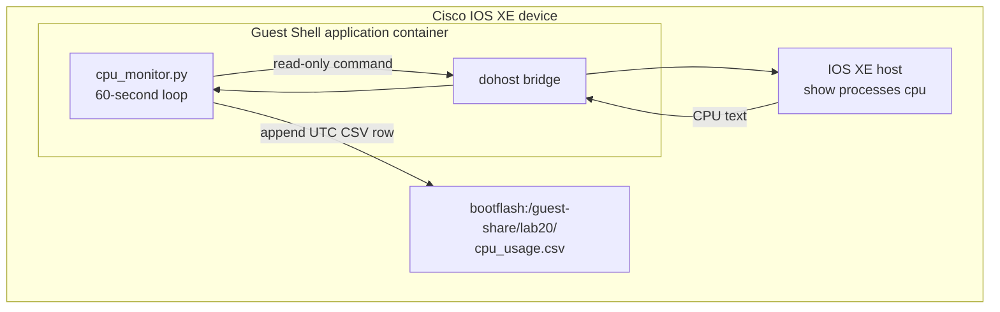

# Lab 20: Host a CPU Monitor on Cisco IOS XE

## Lab Introduction

Network automation normally runs from a central workstation or controller. However, some operational tasks benefit from running close to the device being observed. An on-box application continues collecting local information when a management station is unavailable, avoids sending every raw sample across a WAN, and can react with very low latency. These advantages must be balanced against finite device CPU, memory, and flash resources.

In this lab, learners use the Guest Shell on a reservable Cisco IOS XE application-hosting sandbox. Guest Shell is a Cisco-managed Linux container hosted through the IOS XE application framework. A small Python application runs inside that container, invokes the read-only IOS XE command `show processes cpu` through the supported `dohost` bridge, parses the five-second, one-minute, and five-minute measurements, and appends one timestamped record every 60 seconds to a CSV file on flash.

The application uses the shared Guest Shell directory. Inside Linux, the file appears as `/bootflash/guest-share/lab20/cpu_usage.csv`; from IOS XE, the same file appears as `bootflash:/guest-share/lab20/cpu_usage.csv`. This makes the result persistent and visible from both environments without giving the container unrestricted access to the IOS XE filesystem.

## Learning Objectives

After completing this lab, you will be able to:

- Explain why applications may be hosted directly on a network device.
- Distinguish Guest Shell from a general-purpose off-box Linux server.
- Verify whether an IOS XE platform supports IOx and Guest Shell.
- Enable and inspect the IOS XE application-hosting environment.
- Transfer a Python application into the shared flash directory.
- Use `dohost` to execute a read-only IOS XE operational command.
- Parse IOS XE CPU utilization safely and record it as CSV.
- Run, monitor, stop, and troubleshoot an on-box process.
- Verify the same persistent file from Guest Shell and IOS XE.
- Evaluate resource consumption, flash wear, security, and lifecycle concerns.

## Estimated Time

Allow approximately **2 to 3 hours**, including sandbox initialization and observation time.

## Prerequisites

- Ubuntu 26.04 workstation prepared in Lab 1
- Git and the local GitLab instance
- Python 3 and `pytest` on the workstation
- Cisco DevNet account
- Active VPN access to the reserved sandbox
- IOS XE privileged EXEC access
- Basic familiarity with Linux processes, CSV, and Python exceptions

## Required Sandbox

Reserve the **Cisco IOS XE on Catalyst 9000 with Application Hosting** sandbox when it is available. Cisco specifically identifies this reservable environment as an application-hosting sandbox. A generic always-on IOS XE sandbox may be shared, read-only, or lack the Guest Shell resources required by this lab.

Sandbox names and images can change. Before starting, read the reservation instructions and verify Guest Shell capability rather than assuming that every IOS XE instance supports identical hosting features. If the pre-flight commands in Task 2 show that IOx or Guest Shell is absent, select the application-hosting sandbox or ask the instructor for an equivalent supported IOS XE platform.

## Architecture



The application does not measure `/proc/stat` inside the container. That value would primarily describe the Linux/container execution environment and might not represent the IOS XE control-plane CPU shown to an operator. Instead, `dohost` deliberately retrieves IOS XE's own operational measurement.

## Project Structure

```text
Lab20/
├── .gitignore
├── Lab20.md
├── README.md
├── requirements.txt
├── cpu_monitor.py
├── pytest.ini
└── tests/
    └── test_cpu_monitor.py
```

## Task 1: Test the Application Parser Off-Box

Create or clone a GitLab project named `lab20-iosxe-cpu-monitor`, copy the supplied files into it, and create a Python virtual environment:

```bash
cd ~/Desktop/CCNPAUTO/LAB/Lab20
python3 -m venv .venv
source .venv/bin/activate
python -m pip install --upgrade pip
python -m pip install -r requirements.txt
pytest -q
```

The tests supply representative IOS XE output to `parse_cpu_output()` and verify the resulting numbers. They do not execute `dohost`, because that bridge exists only inside Guest Shell. This separation lets learners validate parsing logic on the workstation before involving the sandbox.

Open `cpu_monitor.py` and identify its main responsibilities:

1. `collect_cpu()` invokes a fixed read-only IOS XE command with a timeout.
2. `parse_cpu_output()` validates the expected text using a regular expression.
3. `append_sample()` creates the CSV header when required and appends one UTC row.
4. `run()` collects immediately and then uses a monotonic 60-second schedule.
5. `main()` validates command-line options and starts the monitor.

The IOS XE command is a program constant rather than user input. This prevents the script from becoming a general CLI execution service.

## Task 2: Perform the IOS XE Hosting Pre-Flight Check

Connect to the reserved device and enter privileged EXEC mode. Record the model and release:

```text
show version
show platform software status control-processor brief
show iox
show app-hosting list
show guestshell
```

Command availability and exact output vary by platform and release. A suitable platform should expose IOx/application-hosting commands and enough free resources to activate Guest Shell. If `show iox` reports that services are initializing, wait several minutes and check again.

Also inspect flash before creating data:

```text
dir bootflash:
dir bootflash:/guest-share
```

The `guest-share` directory is normally created when Guest Shell is installed or enabled. Do not create arbitrary paths elsewhere in flash for the container.

> **Side note — respect reserved infrastructure:** Use only the device assigned to your reservation. Record any existing Guest Shell application state and avoid deleting packages or files that do not belong to this lab.

## Task 3: Enable IOx and Guest Shell

If IOx is not already enabled, configure it:

```text
configure terminal
 iox
end
```

Wait for the infrastructure to initialize, then verify it:

```text
show iox
```

Enable Guest Shell from privileged EXEC mode:

```text
guestshell enable
```

Activation may take several minutes. Confirm its application state and Python runtime:

```text
show guestshell
show app-hosting list
show app-hosting detail appid guestshell
guestshell run python3 --version
guestshell run uname -a
```

The desired state is `RUNNING`. If Guest Shell is already running, do not disable or reinstall it merely to repeat the command. The detailed application output also shows allocated resources; these limits are important because on-box applications compete for finite platform capacity.

## Task 4: Validate the IOS XE-to-Guest-Shell Boundary

Run a harmless Linux command:

```text
guestshell run pwd
guestshell run ls -ld /bootflash/guest-share
```

Next, execute the IOS XE CPU command through `dohost`:

```text
guestshell run dohost "show processes cpu | include CPU utilization"
```

A typical response resembles:

```text
CPU utilization for five seconds: 3%/1%; one minute: 2%; five minutes: 2%
```

The first five-second figure is total CPU utilization, while the value following `/` represents interrupt-level utilization during that interval. The one-minute and five-minute figures are smoothed over longer windows. Short spikes may appear in the five-second measurement without materially changing the longer averages.

If `dohost` is missing or rejected, confirm that the command is being executed inside the supported Guest Shell and that the reserved image permits host command access. Do not replace the design with SSH credentials embedded in the script.

## Task 5: Transfer the Python Application to Flash

The simplest transfer method is IOS XE Secure Copy. On the router, temporarily enable the SCP server if the sandbox does not already provide it:

```text
configure terminal
 ip scp server enable
end
```

From the Ubuntu workstation, copy the supplied application to the shared directory. Replace the user and host with reservation values:

```bash
scp cpu_monitor.py \
  <username>@<iosxe-host>:bootflash:/guest-share/cpu_monitor.py
```

If the OpenSSH client interprets the IOS XE filesystem syntax incorrectly, initiate the transfer from IOS XE instead. Start a temporary SSH/SCP service only according to the instructor's workstation policy, or use another transfer mechanism listed in the sandbox instructions.

Verify the file from IOS XE:

```text
dir bootflash:/guest-share/cpu_monitor.py
verify /md5 bootflash:/guest-share/cpu_monitor.py
```

Calculate the workstation hash for comparison:

```bash
md5sum cpu_monitor.py
```

Then verify from Guest Shell:

```text
guestshell run ls -l /bootflash/guest-share/cpu_monitor.py
guestshell run python3 -m py_compile /bootflash/guest-share/cpu_monitor.py
```

Once transfer is complete, disable the IOS XE SCP server if it was enabled solely for the lab:

```text
configure terminal
 no ip scp server enable
end
```

## Task 6: Run a Short Foreground Test

Before starting an indefinite process, collect three samples at ten-second intervals:

```text
guestshell run python3 /bootflash/guest-share/cpu_monitor.py --interval 10 --count 3
```

The shorter interval is only a functional test. It should print three parsed records and exit. Inspect the CSV from Guest Shell:

```text
guestshell run cat /bootflash/guest-share/lab20/cpu_usage.csv
```

The file should resemble:

```csv
timestamp_utc,cpu_5_seconds_pct,cpu_interrupt_5_seconds_pct,cpu_1_minute_pct,cpu_5_minutes_pct
2026-07-04T08:15:00.120000+00:00,3.0,1.0,2.0,2.0
2026-07-04T08:15:10.121000+00:00,4.0,1.0,2.0,2.0
```

The timestamp includes a UTC offset. UTC avoids ambiguity when the workstation, router, and learner use different time zones. The script writes the header only when the file is new or empty, so restarting it does not create repeated headers.

Now view the same file from IOS XE:

```text
more bootflash:/guest-share/lab20/cpu_usage.csv
dir bootflash:/guest-share/lab20
```

This confirms that Guest Shell and IOS XE are viewing the same persistent flash-backed content.

## Task 7: Start the One-Minute Monitor

Start the application in the background with its default 60-second interval:

```text
guestshell run bash -c "mkdir -p /bootflash/guest-share/lab20; nohup python3 /bootflash/guest-share/cpu_monitor.py >> /bootflash/guest-share/lab20/monitor.log 2>&1 & echo \$! > /bootflash/guest-share/lab20/cpu_monitor.pid"
```

The shell writes the process identifier to a PID file and redirects application output to `monitor.log`. Verify the process:

```text
guestshell run bash -c "PID=\$(cat /bootflash/guest-share/lab20/cpu_monitor.pid); ps -p \$PID -o pid,etime,cmd"
guestshell run tail -n 10 /bootflash/guest-share/lab20/monitor.log
```

Wait at least three minutes, then inspect the latest rows:

```text
guestshell run tail -n 5 /bootflash/guest-share/lab20/cpu_usage.csv
```

The timestamps should be approximately 60 seconds apart. The scheduler uses `time.monotonic()` to resist wall-clock adjustments and adds each interval to the planned start time. Consequently, command execution time does not accumulate as an ever-growing drift after every sample.

## Task 8: Observe CPU During a Controlled Change

Do not create artificial CPU exhaustion on shared or production infrastructure. Instead, continue observing while performing ordinary read-only commands or while the device handles existing lab activity. Compare five-second values with one-minute and five-minute values.

Answer these questions:

- Did a brief five-second increase affect the one-minute average immediately?
- Was interrupt utilization a substantial part of total utilization?
- Did the longer averages rise and fall more gradually?
- Could a single one-minute sample prove that the device is healthy?

CPU is only one indicator. A professional monitoring design correlates it with memory, interface errors, process-level CPU, control-plane events, traffic rates, and application symptoms. This lab deliberately keeps the application small so its hosting and lifecycle behavior remain visible.

## Task 9: Stop and Restart the Application Cleanly

Read the saved PID and send `SIGTERM`:

```text
guestshell run bash -c "PID=\$(cat /bootflash/guest-share/lab20/cpu_monitor.pid); kill -TERM \$PID"
guestshell run bash -c "PID=\$(cat /bootflash/guest-share/lab20/cpu_monitor.pid); ps -p \$PID || true"
```

The application handles `SIGTERM` and `SIGINT`, finishes its current control step, and leaves the CSV intact. Remove the stale PID file after confirming the process has stopped:

```text
guestshell run rm -f /bootflash/guest-share/lab20/cpu_monitor.pid
```

Restart it with the Task 7 command and confirm that new rows are appended under the existing header. A process started with `nohup` survives shell disconnection, but it should not be assumed to survive Guest Shell deactivation, an application restart, or a device reload. Production deployment requires a supported process supervisor or a packaged IOx application with an explicit lifecycle definition.

## Task 10: Review Resource and Security Implications

On-box execution changes the failure domain. A defect no longer consumes only workstation resources; it can consume resources on a device responsible for forwarding traffic. Review the following controls before deploying any similar application:

| Concern | Lab control | Production consideration |
|---|---|---|
| CPU contention | One small command every 60 seconds | Enforce application CPU quotas and measure overhead |
| Memory growth | Small fixed parser and one-row writes | Monitor process memory and configure limits/restarts |
| Flash capacity | Append-only CSV for a short lab | Rotate, compress, export, and enforce retention limits |
| Flash endurance | One write per minute | Buffer samples or send telemetry to external storage |
| Command injection | Fixed `dohost` command | Never concatenate untrusted input into host commands |
| Privilege | Read-only operational command | Apply least privilege and review every host capability |
| Data integrity | UTC timestamps and fixed columns | Add signing, remote export, or protected audit storage |
| Availability | Manual `nohup` lifecycle | Use supported application manifests and health checks |
| Upgrade compatibility | Parser test for known output | Test against every target IOS XE release |

At one row per minute, the file grows by 1,440 rows per day and 525,600 rows in a non-leap year. Even when each row is small, indefinite append-only storage is not a responsible production retention strategy.

## Task 11: Export and Validate the Dataset

Stop the monitor, then copy the CSV back to the workstation:

```bash
scp <username>@<iosxe-host>:bootflash:/guest-share/lab20/cpu_usage.csv .
```

Check its structure without installing third-party libraries:

```bash
python3 - <<'PY'
import csv
from pathlib import Path

path = Path("cpu_usage.csv")
with path.open(newline="", encoding="utf-8") as handle:
    rows = list(csv.DictReader(handle))

print(f"Rows: {len(rows)}")
print(f"First: {rows[0] if rows else 'none'}")
print(f"Last:  {rows[-1] if rows else 'none'}")
PY
```

Confirm that every row has the same columns and that timestamps increase. A valid CSV proves only that collection occurred; it does not prove that the values are operationally meaningful. Interpretation still needs baselines, platform knowledge, and correlation with other signals.

## Troubleshooting Guide

| Symptom | Likely cause | Corrective action |
|---|---|---|
| `show iox` is unavailable | Unsupported platform/image | Reserve the Catalyst 9000 application-hosting sandbox |
| IOx remains stopped | Initialization, resource, or image issue | Wait and recheck; inspect platform logs; re-read reservation notes |
| Guest Shell will not enable | Insufficient resources or missing package | Check `show app-hosting list/detail` and platform support |
| `/bootflash/guest-share` missing | Guest Shell not installed or activated | Complete Task 3 and inspect Guest Shell state |
| SCP reports permission/path error | SCP server disabled or remote path syntax differs | Enable SCP temporarily; verify privilege and destination path |
| `dohost` not found | Script is off-box or environment unsupported | Run inside IOS XE Guest Shell on a supported image |
| `Unrecognized IOS XE CPU output` | Release output format changed | Capture output, update the regex, and add a unit test |
| No new CSV rows | Process stopped or collection errors | Check PID, `ps`, and `monitor.log` |
| Repeated CSV headers | File was recreated or multiple writers are active | Stop duplicate processes and retain a single monitor instance |
| Flash fills unexpectedly | Missing retention/rotation | Stop the app, export data, remove owned files, and design rotation |

## Cleanup

Stop the monitor using the PID procedure in Task 9. Back up the CSV if it is required for assessment, then remove only Lab 20 files:

```text
guestshell run rm -rf /bootflash/guest-share/lab20
delete /force bootflash:/guest-share/cpu_monitor.py
```

Do not disable Guest Shell or IOx if they were active before the lab or are required by other learners. If the instructor confirms that this reservation was dedicated and Guest Shell should be deactivated, use the platform-supported command:

```text
guestshell disable
```

Finally, ensure that the temporary SCP server is disabled and save configuration only when the sandbox instructions permit it:

```text
configure terminal
 no ip scp server enable
end
```

## Key Takeaways

- IOS XE can host operational applications close to the network state they observe.
- Guest Shell is a managed application-hosting environment, not unrestricted access to the IOS XE host.
- The `dohost` bridge permits an on-box Python process to retrieve selected IOS XE operational output.
- `/bootflash/guest-share` and `bootflash:/guest-share` expose the same controlled persistent storage to Linux and IOS XE.
- Parsing, collection, scheduling, and persistence should be tested separately before background execution.
- On-box applications must use strict resource limits, bounded storage, least privilege, and controlled lifecycle management.
- A short append-only CSV is suitable for a lab, but production telemetry needs rotation, retention, and external observability.

With this final hosting exercise, learners have moved an automation workload from the workstation onto the network device itself. That shift makes resource governance and lifecycle design just as important as the Python code.

## References and Further Reading

- [Cisco DevNet IOS XE programmability and application hosting](https://developer.cisco.com/iosxe/)
- [Cisco DevNet IOS XE sandbox information](https://developer.cisco.com/docs/ios-xe-voip/sandbox/)
- [Cisco IOS XE 17.13 Guest Shell guide](https://www.cisco.com/c/en/us/td/docs/ios-xml/ios/prog/configuration/1713/b_1713_programmability_cg/m_1712_prog_guestshell.pdf)
- [Cisco IOS XE 17.14 Programmability Configuration Guide](https://www.cisco.com/c/en/us/td/docs/ios-xml/ios/prog/configuration/1714/b_1714_programmability_cg.pdf)
