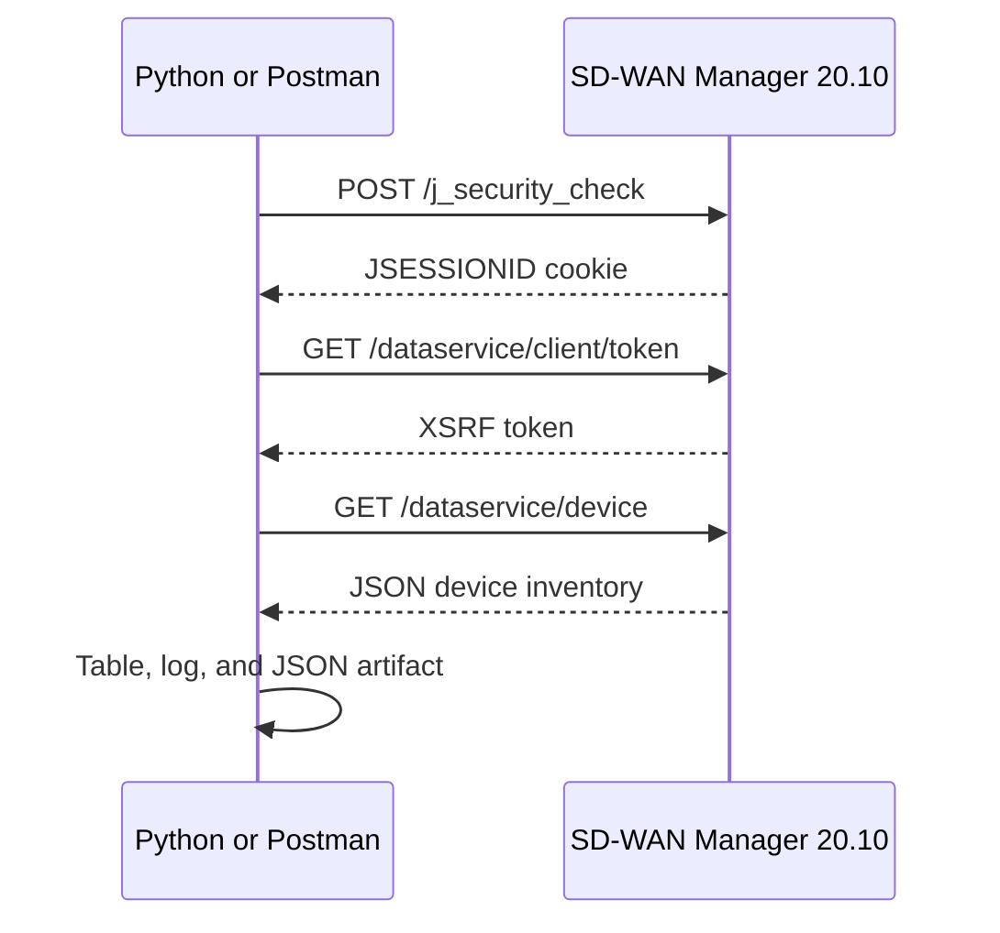

# Optional Lab 21: Explore the Cisco SD-WAN 20.10 API

## Lab Introduction

An enterprise SD-WAN operations team needs a repeatable way to answer basic questions without manually opening several Cisco vManage pages: Which controllers and edge routers are registered? Which software versions are deployed? Which devices are currently reachable? This lab uses the Cisco SD-WAN Manager REST API from release 20.10 to build a read-only inventory report.

Use the **Cisco SD-WAN 20.10 reservable sandbox**. The reservation supplies the current VPN instructions, SD-WAN Manager address, username, and password. Do not substitute examples from a newer SD-WAN API release because authentication and endpoint behavior can change between releases.

## Learning Objectives

- Explain the `/dataservice` API structure used by Cisco SD-WAN Manager 20.10.
- Establish a session through `/j_security_check`.
- Retrieve the anti-CSRF token used with the authenticated session.
- Inspect an API exchange in Postman without exposing credentials or cookies.
- Retrieve the SD-WAN device inventory with Python.
- Interpret controller, edge, reachability, system IP, and software-version fields.
- Preserve timestamped JSON and diagnostic logs.

## Workflow



## Task 1: Reserve and Inspect the Sandbox

1. Sign in to Cisco DevNet Sandbox and reserve **Cisco SD-WAN 20.10**.
2. Wait until the reservation is active, then follow its VPN instructions.
3. Record the SD-WAN Manager address and credentials in your private notes.
4. Open the SD-WAN Manager GUI and confirm the displayed release is 20.10.
5. Do not commit reservation credentials, cookies, tokens, or VPN files.

## Task 2: Create the Lab Repository

Create a private GitLab.com project named `optional_lab21_sdwan_api`. Clone it under `~/ccnpauto-workspace`, then use VS Code to copy and paste the supplied Lab 21 files into the repository.

Create and activate the virtual environment:

```bash
python3 -m venv .venv
source .venv/bin/activate
python -m pip install --upgrade pip
python -m pip install -r requirements.txt
```

Copy the contents of `.env.example` into a new `.env` file and replace the placeholders with reservation values. Keep `SDWAN_VERIFY_TLS=false` for the sandbox’s self-signed certificate.

## Task 3: Understand SD-WAN 20.10 Authentication

Release 20.10 uses a server-side session. The login request submits `j_username` and `j_password` as form data. A successful response establishes a `JSESSIONID` cookie. The client then requests `/dataservice/client/token` and sends the returned value as `X-XSRF-TOKEN` on later requests. Reuse one HTTP session; creating a new session for each request loses the cookie.

An HTTP `200` alone does not prove login succeeded. An unsuccessful login can return an HTML login page, so the supplied client checks both the response body and the session cookie.

## Task 4: Inspect the Exchange in Postman

1. Create a Postman collection named **SD-WAN 20.10** and a private environment containing `base_url`, `username`, and `password`.
2. Send `POST {{base_url}}/j_security_check` with body type **x-www-form-urlencoded** and keys `j_username` and `j_password`.
3. Use Postman’s cookie manager to confirm that the response established `JSESSIONID`. Do not copy the cookie into screenshots.
4. Send `GET {{base_url}}/dataservice/client/token` in the same collection session.
5. Store the returned token in a private environment variable and send it in the `X-XSRF-TOKEN` header.
6. Send `GET {{base_url}}/dataservice/device` with `Accept: application/json`.
7. Confirm the response contains a top-level `data` list. Compare `host-name`, `device-type`, `system-ip`, `reachability`, `version`, and `device-model` across entries.

## Task 5: Review and Run the Python Client

Open `sdwan_inventory.py`. Identify where `requests.Session` preserves the cookie, where the XSRF token is added, and where non-200 responses become meaningful exceptions.

Run:

```bash
python -m py_compile sdwan_inventory.py
python sdwan_inventory.py
```

The table should distinguish controllers from WAN edges and show whether each device is reachable. A new debug log is created in `logs/`, and the complete device response is saved under `artifacts/`. Neither file should contain passwords or authentication tokens.

## Task 6: Interpret the Inventory

Use the evidence to answer:

- How many controllers and WAN edges are returned?
- Are all devices reachable?
- Are multiple software versions present?
- Why is `system-ip` an SD-WAN identity rather than simply a management address?
- Which fields would be suitable for a compliance report?

Do not treat a reachable API as proof that the overlay is healthy. Device inventory is one operational view; control connections, BFD sessions, alarms, and application-aware routing statistics provide other views.

## Task 7: Commit the Work

Confirm `.env`, `logs/`, and `artifacts/` are ignored. Commit the code and guide, push to GitLab.com, and verify no secret appears in the repository.

## Troubleshooting

| Symptom | Likely cause |
|---|---|
| HTTP 200 with HTML content | Authentication failed and the login page was returned |
| HTTP 401 or 403 | Missing session cookie, expired session, or missing XSRF token |
| Connection timeout | VPN disconnected or the reservation address is wrong |
| Empty `data` list | Incorrect endpoint, insufficient permissions, or sandbox state |

## References

- [Cisco SD-WAN API Release 20.10 documentation](https://developer.cisco.com/docs/sdwan/20-10/)
- [SD-WAN 20.10 authentication](https://developer.cisco.com/docs/sdwan/20-10/authentication/)
- [SD-WAN 20.10 API index](https://developer.cisco.com/docs/sdwan/20-10/sd-wan-vmanage-v20-10/)

## Key Takeaways

- SD-WAN 20.10 authentication combines a session cookie and XSRF token.
- One persistent session must be reused across related requests.
- The device endpoint provides controller and edge inventory as structured JSON.
- Operational conclusions should combine inventory with other SD-WAN state APIs.
- Credentials, cookies, tokens, raw logs, and reservation data must remain outside Git.
