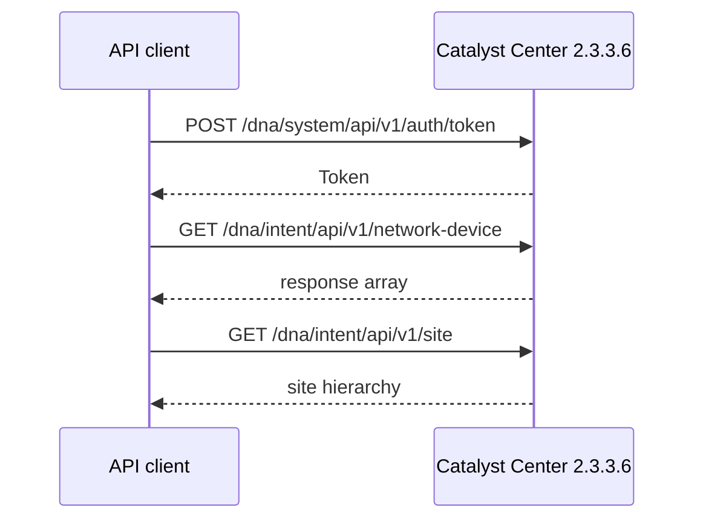

# Optional Lab 22: Explore the Catalyst Center 2.3.3.6 API

## Lab Introduction

A campus operations team needs a controller-derived inventory that can be consumed by reports and automation pipelines. In this lab, learners use the **Catalyst Center Always-On v2.3.3.6 DevNet Sandbox** to obtain an authentication token, retrieve sites and network devices, and compare controller intent with device reachability.

The Always-On environment is shared. This lab is strictly read-only: do not create, update, provision, delete, or initiate discovery jobs.

## Learning Objectives

- Explain the difference between Catalyst Center platform and intent APIs.
- Obtain an `X-Auth-Token` with basic authentication.
- Use Postman to inspect requests and structured responses.
- Retrieve site and device inventory through intent APIs.
- Interpret management IP, family, software version, and reachability.
- Save evidence without exposing credentials or tokens.

## API Flow



## Task 1: Access the Always-On Sandbox

Open the Catalyst Center Always-On v2.3.3.6 sandbox page and use the current credentials shown there. Confirm the controller version in the GUI. Because this is shared infrastructure, remain within GET operations even if the account technically exposes additional capabilities.

## Task 2: Prepare the Repository

Create a private GitLab.com project named `optional_lab22_catalyst_center_api`. Copy the Lab 22 files into it with VS Code. Create `.env` from `.env.example`, then install the supplied requirements in `.venv`.

Never commit `.env`. Do not place the username, password, or token directly in Python.

## Task 3: Obtain a Token in Postman

1. Create a collection named **Catalyst Center 2.3.3.6**.
2. Send `POST {{base_url}}/dna/system/api/v1/auth/token`.
3. Choose **Basic Auth** and enter the sandbox username and password.
4. Add `Accept: application/json`.
5. Confirm the response contains `Token`.
6. Store it in a private Postman environment and use `X-Auth-Token: {{token}}` for subsequent requests.

The token represents the authenticated user’s authority. Do not print it, commit it, or include it in screenshots.

## Task 4: Explore Read-Only Intent APIs

Send these GET requests:

```text
/dna/intent/api/v1/network-device
/dna/intent/api/v1/network-device/count
/dna/intent/api/v1/site
```

Observe that normal data is usually nested under `response`. Compare the returned count with the length of the network-device response. Select one device and identify its `id`, `hostname`, `managementIpAddress`, `family`, `softwareVersion`, and `reachabilityStatus`.

## Task 5: Run the Python Inventory

Review `catalyst_center_inventory.py`, then run:

```bash
python -m py_compile catalyst_center_inventory.py
python catalyst_center_inventory.py
```

The program obtains its own token, requests device and site information, prints a concise table, writes detailed logs to `logs/`, and preserves the combined response in `artifacts/`.

## Task 6: Interpret Controller Data

Explain why Catalyst Center’s device ID is preferable to a hostname as an API identifier. Then compare device reachability with the presence of a management address. A device record can exist even when the controller cannot currently reach it, so inventory presence and operational health are not equivalent.

## Task 7: Close the Lab

Review the timestamped artifact, ensure secrets are absent, commit the source files, and push them to GitLab.com. Do not commit controller responses if the instructor classifies sandbox inventory as restricted.

## Troubleshooting

| Symptom | Interpretation |
|---|---|
| HTTP 401 | Basic credentials are wrong or token is missing/expired |
| HTTP 403 | Authenticated account lacks permission for the operation |
| HTTP 404 | Endpoint does not match controller release or base URL |
| Empty `response` | Valid request with no visible objects or sandbox state issue |

## References

- [Cisco Catalyst Center APIs](https://developer.cisco.com/docs/dna-center/)
- [Cisco DevNet Sandboxes](https://devnetsandbox.cisco.com/)

## Key Takeaways

- Catalyst Center issues a token that clients send through `X-Auth-Token`.
- Intent APIs expose controller-managed sites, devices, and operational attributes.
- Shared Always-On systems must be treated as read-only training environments.
- Device identity, inventory membership, and reachability represent different facts.
