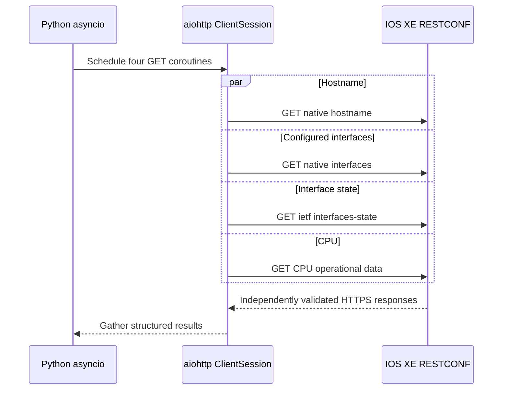

# Optional Lab 22: Make Trusted RESTCONF Requests Asynchronously

## Lab Introduction

Optional Lab 21 created a trusted HTTPS relationship and used `requests` for one RESTCONF operation at a time. A sequential client is easy to understand, but total collection time grows when an automation process must retrieve independent resources from many endpoints.

This standalone enhancement uses `aiohttp` and `asyncio` to retrieve four IOS XE resources concurrently. It retains the local CA trust established in Lab 21; asynchronous execution must not weaken certificate validation. Learners compare concurrency one with concurrency four, inspect per-request outcomes, and preserve a structured JSON result.

## Learning Objectives

- Explain the difference between synchronous and asynchronous I/O.
- Reuse a local CA certificate with an `ssl.SSLContext`.
- Reuse one `aiohttp.ClientSession`.
- Schedule independent RESTCONF GET operations concurrently.
- Bound concurrency with a semaphore and connector limit.
- Handle HTTP, TLS, timeout, transport, and JSON errors per request.
- Compare sequential and concurrent elapsed time.

## Request Flow



## Prerequisites

- Completed Optional Lab 21 or equivalent trusted IOS XE HTTPS configuration.
- `iosxe.lab.local` resolves to the router.
- The local CA public certificate is available.
- RESTCONF credentials with read access.

The local CA private key is not required and must not be copied into this repository. A RESTCONF client needs only the public root certificate.

## Task 1: Create the Repository

Create a private standalone project named `optional_lab22_async_restconf`, clone it under `~/ccnpauto-workspace`, and copy the Lab 22 files into it with VS Code.

## Task 2: Install Dependencies

```bash
python3 -m venv .venv
source .venv/bin/activate
python -m pip install --upgrade pip
python -m pip install -r requirements.txt
python -m py_compile async_restconf.py
```

`aiohttp` provides the asynchronous HTTP client. `asyncio`, `ssl`, and JSON support come from the Python standard library.

## Task 3: Add the Public CA Certificate

Create a `ca` folder in the Lab 22 repository using VS Code. Copy and paste only this file from Lab 21:

```text
Lab21/ca/certs/ccnpauto-root-ca.crt.pem
```

Place it at:

```text
Lab22/ca/ccnpauto-root-ca.crt.pem
```

Do not copy the CA private key, router CSR, or server certificate. The root certificate is sufficient to validate the chain presented by IOS XE.

## Task 4: Configure `.env`

```text
IOSXE_BASE_URL=https://iosxe.lab.local
IOSXE_USERNAME=<restconf-username>
IOSXE_PASSWORD=<restconf-password>
CA_BUNDLE=ca/ccnpauto-root-ca.crt.pem
REQUEST_TIMEOUT=15
```

If RESTCONF uses a nondefault port, add it to the base URL. The DNS name must still match a SAN in the IOS XE certificate.

## Task 5: Review Trusted Asynchronous TLS

The script creates the SSL context:

```python
ssl_context = ssl.create_default_context(cafile=str(ca_bundle))
connector = aiohttp.TCPConnector(
    ssl=ssl_context,
    limit=concurrency,
)
```

It does not use `ssl=False`. Therefore, every connection created by the pool validates the same CA chain and hostname as Lab 21.

One `ClientSession` holds authentication, headers, timeout, connector, and connection pool. Creating a new session for every GET would discard pooling benefits and can exhaust sockets in a larger workflow.

## Task 6: Review Concurrency Control

Each resource is represented by a coroutine:

```python
tasks = [
    fetch_resource(session, semaphore, name, base_url + path)
    for name, path in RESOURCES.items()
]
results = await asyncio.gather(*tasks)
```

`asyncio.gather()` waits for all tasks. The semaphore and connector limit prevent unbounded simultaneous requests. This is essential when a controller or device has session limits.

The code catches request-level failures inside each coroutine, so one unsupported URI does not discard every successful response.

## Task 7: Establish the Sequential Baseline

Concurrency one uses the asynchronous code but permits only one active request:

```bash
python async_restconf.py --concurrency 1
```

Record total and per-resource times. Open the generated JSON file under `results/`. Confirm that certificate validation succeeds and identify any model that the selected IOS XE release does not support.

An HTTP `404` is recorded as a resource failure; it is not a TLS failure. Use Yangsuite or the device module library to validate a URI when necessary.

## Task 8: Run Concurrent Collection

```bash
python async_restconf.py --concurrency 4
```

Compare total elapsed time with concurrency one. Concurrent execution is most beneficial when request waiting time dominates processing time. It does not make IOS XE generate data faster, and a small local lab may show only a modest difference.

## Task 9: Interpret Error Isolation

Temporarily misspell only the `cpu_usage` path in `RESOURCES`, then run the client. The other resources should still succeed while CPU reports `404`. Restore the correct path afterward.

Next, temporarily point `CA_BUNDLE` to an unrelated public certificate. TLS connections should fail. Restore the trusted CA; never replace the SSL context with an unverified connector.

The distinction is operationally important:

| Result | Layer |
|---|---|
| Certificate or hostname error | TLS identity |
| Timeout or connection error | Transport or reachability |
| `401` or `403` | Authentication or authorization |
| `404` | RESTCONF resource/model |
| Invalid JSON | Representation or unexpected server response |

## Task 10: Choose Safe Concurrency

Increase concurrency only within device and policy limits. Hundreds of simultaneous requests can consume HTTPS sessions, CPU, memory, and control-plane resources. For network automation:

- start with a small bound;
- reuse sessions;
- apply total and connection timeouts;
- respect `429` and `Retry-After` where implemented;
- retry only safe operations;
- add jittered backoff;
- measure device impact.

GET is normally safe to retry. Configuration methods require additional idempotency and verification logic.

## Task 11: Commit the Client

`ca/`, `.env`, and `results/` are excluded from Git. Commit only reusable source and documentation:

```bash
git status
git add .
git commit -m "Add trusted asynchronous RESTCONF client"
git push
```

## Key Takeaways

- Asynchronous I/O overlaps waiting time for independent requests.
- A shared `ClientSession` enables connection reuse and consistent policy.
- Concurrency must be bounded to protect the device control plane.
- Each task should preserve its own status, timing, payload, or error.
- Moving from `requests` to `aiohttp` must not remove CA or hostname validation.

## Further Reading

- [aiohttp Client Documentation](https://docs.aiohttp.org/en/stable/client.html)
- [Python asyncio](https://docs.python.org/3/library/asyncio.html)
- [Python SSL Context](https://docs.python.org/3/library/ssl.html#ssl.create_default_context)
- [Cisco IOS XE RESTCONF](https://www.cisco.com/c/en/us/td/docs/ios-xml/ios/prog/configuration/176/b_176_programmability_cg/m_176_prog_restconf.html)
