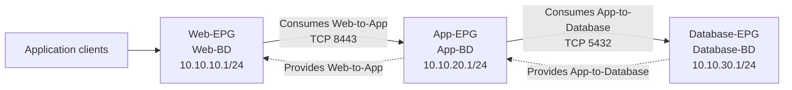

# Optional Lab 25: Build a Three-Tier Application Policy in Cisco ACI

## Lab Introduction

A company is moving a conventional three-tier application into an ACI-managed data center. The application has a Web tier, an application-services tier, and a database tier. The data-center team wants each tier placed in its own bridge domain and endpoint group while contracts permit only the required application flows between tiers.

In this lab, learners use the APIC REST API to create one tenant, one enforced VRF, three bridge domains, three subnets, one application profile, three EPGs, two filters, and two contracts. The policy is applied as one declarative tenant subtree and then retrieved from APIC for verification.

Use the **ACI Simulator 6.0 reservable DevNet sandbox** for all configuration tasks. The **ACI Simulator Always-On** environment may be used only for read-only exploration because it is shared. Never run `--apply` or `--delete` against an Always-On APIC.

## Learning Objectives

- Explain the ACI tenant, VRF, bridge-domain, application-profile, EPG, filter, and contract hierarchy.
- Authenticate to APIC and reuse its session cookie.
- Build a declarative JSON managed-object subtree.
- Associate three bridge domains with a shared enforced VRF.
- Associate Web, App, and Database EPGs with their bridge domains.
- Apply provider and consumer contract relationships correctly.
- Verify observed APIC state rather than assuming a successful POST was sufficient.
- Remove only the learner-owned tenant at the end of the reservation.

## Intended Policy



In ACI terminology, the EPG that initiates a permitted flow consumes a contract, while the destination EPG provides it. Therefore:

- `Web-EPG` consumes `Web-to-App`, and `App-EPG` provides it.
- `App-EPG` consumes `App-to-Database`, and `Database-EPG` provides it.

This lab builds logical policy only. It does not create VLAN pools, domains, attachable entity profiles, static paths, or VMM-domain associations. Consequently, the simulator will contain the policy objects, but no physical or virtual endpoint is deployed into the EPGs.

## Resources Created

| ACI class | Resource |
|---|---|
| `fvTenant` | `CCNPAUTO-ThreeTier-<initials>` |
| `fvCtx` | `ThreeTier-VRF` with policy enforcement enabled |
| `fvBD` | `Web-BD`, `App-BD`, `Database-BD` |
| `fvSubnet` | `10.10.10.1/24`, `10.10.20.1/24`, `10.10.30.1/24` |
| `fvAp` | `ThreeTier-App` |
| `fvAEPg` | `Web-EPG`, `App-EPG`, `Database-EPG` |
| `vzFilter` | `Web-to-App-Filter`, `App-to-Database-Filter` |
| `vzEntry` | TCP destination ports 8443 and 5432 |
| `vzBrCP` | `Web-to-App`, `App-to-Database` |
| `fvRsCons` / `fvRsProv` | Contract consumer/provider relationships |

## Task 1: Reserve ACI Simulator 6.0

1. Reserve **ACI Simulator 6.0** in Cisco DevNet Sandbox.
2. Wait for the reservation to become active and follow its VPN instructions.
3. Use only the APIC address and credentials provided by the current reservation.
4. Open the APIC GUI and confirm that you are working in the dedicated reservable simulator.
5. Do not proceed with configuration when the environment is labeled Always-On or shared.

## Task 2: Create the Repository

Create a private GitLab.com project named `optional_lab25_aci_api`. Clone it under `~/ccnpauto-workspace`, then use VS Code to copy the supplied Lab 25 files into the repository.

```bash
python3 -m venv .venv
source .venv/bin/activate
python -m pip install --upgrade pip
python -m pip install -r requirements.txt
```

Copy the contents of `.env.example` into `.env`. Enter the reservation values and replace `REPLACE_INITIALS` with your initials:

```text
APIC_BASE_URL=https://<reservation-apic-address>
APIC_USERNAME=<reservation-username>
APIC_PASSWORD=<reservation-password>
APIC_VERIFY_TLS=false
ACI_TENANT=CCNPAUTO-ThreeTier-TT
ACI_ALLOW_CHANGES=false
```

Keep `ACI_ALLOW_CHANGES=false` until the read-only inspection and payload review are complete. `.env`, logs, and artifacts are excluded from Git.

## Task 3: Inspect APIC Authentication with Postman

Create a Postman environment containing the APIC base URL, username, and password. Send:

```text
POST {{base_url}}/api/aaaLogin.json
Content-Type: application/json
```

```json
{
  "aaaUser": {
    "attributes": {
      "name": "{{username}}",
      "pwd": "{{password}}"
    }
  }
}
```

Confirm that `imdata` contains an `aaaLogin` object and that Postman stores the APIC session cookie. Do not place the cookie or password in screenshots.

Before making changes, use the same Postman session for read-only class queries:

```text
GET /api/node/class/fvTenant.json
GET /api/node/class/fvCtx.json
GET /api/node/class/fvBD.json
GET /api/node/class/fvAEPg.json
GET /api/node/class/vzBrCP.json
```

Observe that each managed object is wrapped by its class name and exposes properties below `attributes`.

## Task 4: Review the Python Safety Controls

Open `aci_inventory.py` and locate:

- the requirement for tenant names beginning with `CCNPAUTO-ThreeTier-`,
- the rejection of the `REPLACE_INITIALS` placeholder,
- the `ACI_ALLOW_CHANGES` gate,
- the mutually exclusive `--apply` and `--delete` options,
- and the post-change GET used to verify observed state.

Run the syntax check:

```bash
python -m py_compile aci_inventory.py
```

With `ACI_ALLOW_CHANGES=false`, run the script without a change option:

```bash
python aci_inventory.py
```

The script authenticates and checks whether your tenant already exists. It does not create anything without `--apply`.

## Task 5: Study the Declarative Payload

The function `build_three_tier_payload()` returns one `fvTenant` object with nested children. Review how helper functions build bridge domains, filters, contracts, and EPG relationships.

Pay particular attention to these relationships:

- `fvRsCtx` associates every bridge domain with `ThreeTier-VRF`.
- `fvRsBd` associates every EPG with its matching bridge domain.
- `vzRsSubjFiltAtt` associates a contract subject with its filter.
- `fvRsCons` makes an EPG a contract consumer.
- `fvRsProv` makes an EPG a contract provider.

The code sends the complete subtree to the tenant managed-object URL. Re-running the same desired state updates existing named objects rather than intentionally creating duplicate names, which demonstrates the declarative nature of APIC managed-object configuration.

## Task 6: Enable and Apply the Change

Confirm again that the reservation is dedicated and that your tenant name contains your initials. Change only this line in `.env`:

```text
ACI_ALLOW_CHANGES=true
```

Apply the policy:

```bash
python aci_inventory.py --apply
```

The program should authenticate, send the tenant subtree, retrieve the observed tenant, display a resource summary, and save a timestamped JSON artifact under `artifacts/`.

An HTTP success code means APIC accepted the request. The subsequent GET and resource summary provide the stronger verification that the expected managed objects exist.

## Task 7: Verify in the APIC GUI

Open **Tenants** and select your `CCNPAUTO-ThreeTier-<initials>` tenant. Verify:

1. **Networking > VRFs** contains `ThreeTier-VRF`.
2. **Networking > Bridge Domains** contains the three BDs.
3. Each BD references `ThreeTier-VRF` and has the expected subnet.
4. **Application Profiles** contains `ThreeTier-App`.
5. The application profile contains Web, App, and Database EPGs.
6. Each EPG references the correct bridge domain.
7. **Contracts > Filters** contains both TCP filters.
8. **Contracts > Standard** contains both contracts.
9. Web consumes `Web-to-App`; App provides it and consumes `App-to-Database`; Database provides `App-to-Database`.

No domain attachment or static path should appear under the EPGs because endpoint deployment is outside this lab.

## Task 8: Test Repeatability

Run the same apply command a second time:

```bash
python aci_inventory.py --apply
```

Confirm that the observed resource names remain the same. Compare the two timestamped artifacts. A declarative API call can still change attributes if the payload changes, but repeatedly submitting the same intended state should not create a second tenant or second set of named objects.

## Task 9: Interpret the Policy

Explain the expected effect of the enforced VRF and contracts:

- EPG membership classifies endpoints into policy groups.
- Separate bridge domains provide separate Layer 2 and subnet boundaries.
- The shared VRF provides Layer 3 context.
- Contract relationships permit the modeled Web-to-App and App-to-Database services.
- The absence of a Web-to-Database contract means that direct Web-to-Database communication is not intentionally permitted by this policy.

Because no endpoints or domains are attached, this simulator exercise validates policy construction rather than live application forwarding.

## Task 10: Clean Up the Reservable Simulator

Delete only the tenant whose name appears in your `.env`:

```bash
python aci_inventory.py --delete
```

The script accepts deletion only when `ACI_ALLOW_CHANGES=true` and the tenant name has the required learner-lab prefix. Run the read-only check again:

```bash
python aci_inventory.py
```

It should report that the learner tenant does not exist. Never delete `common`, `infra`, `mgmt`, another learner’s tenant, or any tenant not created by this lab.

## Task 11: Commit the Project

Confirm that `.env`, `logs/`, and `artifacts/` are ignored. Commit the guide, Python source, requirements, `.env.example`, and `.gitignore`, then push to GitLab.com.

## Troubleshooting

| Symptom | Likely cause |
|---|---|
| Change disabled | `ACI_ALLOW_CHANGES` is still false, as intended by the safety gate |
| Tenant-name validation failure | Initials were not substituted or the required lab prefix was changed |
| HTTP 403 | The account lacks tenant-write permission or the environment is read-only |
| APIC error references a class/attribute | Payload element is unsupported or malformed for the active APIC release |
| Tenant exists but summary is incomplete | APIC rejected a child object or verification occurred before convergence |
| EPG has no endpoints | Expected: the lab does not attach a domain or path |

## References

- [Cisco ACI programmability and REST API guide](https://developer.cisco.com/docs/aci/)
- [Creating a tenant, VRF, and bridge domain](https://developer.cisco.com/docs/apic-rest-api-configuration-guide/creating-a-tenant-vrf-and-bridge-domain/)
- [Deploying an EPG with APIC](https://developer.cisco.com/docs/apic-rest-api-configuration-guide/deploying-an-epg-on-a-specific-port-with-the-cisco-apic/)
- [APIC REST API configuration procedures](https://developer.cisco.com/docs/apic-rest-api-configuration-guide/)

## Key Takeaways

- ACI expresses application connectivity as managed-object policy rather than device-by-device CLI.
- Bridge domains belong to a VRF, EPGs belong to an application profile, and EPGs reference bridge domains.
- Contract consumers initiate permitted flows toward contract providers.
- A successful POST must be followed by an observed-state GET and GUI verification.
- Configuration and cleanup belong only on the dedicated reservable simulator.
