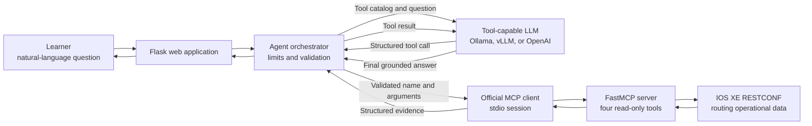
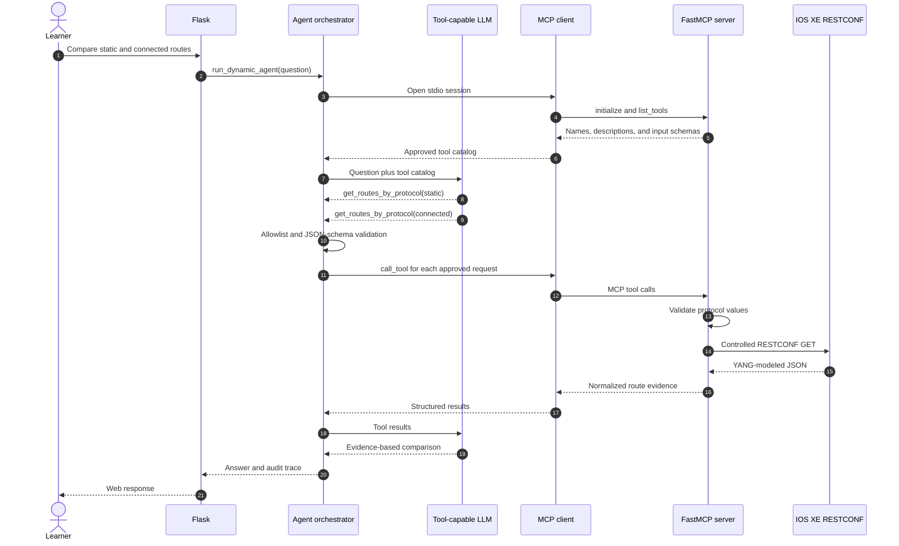

# Optional Lab 26: Build an AI Assistant with Dynamic MCP Tool Selection

## Lab Introduction

Lab 11 built a grounded route assistant, but its `choose_route_context()` function selected a tool with fixed Python keyword rules. That design was deliberately predictable: a question containing “static” called the static-route function, while a question containing a prefix called the route-detail function. It worked well for familiar phrases, although compound or unexpected questions exposed the limits of a hand-written selector.

This optional lab turns the same use case into a genuine tool-calling agent. The Flask application no longer decides that “static” means `get_routes_by_protocol`. Instead, it opens a real MCP stdio session, asks the FastMCP server which tools are available, converts the discovered schemas into LLM function definitions, and sends those definitions with the learner's question to a tool-capable model. The model may select one tool, several tools in parallel, or another tool after reviewing the first result.

The model does not receive RESTCONF credentials, construct arbitrary device URLs, or execute IOS XE CLI. Its authority is limited to four read-only tools advertised by the MCP server. The Python orchestrator independently verifies the selected tool name and validates its arguments against the discovered JSON schema before allowing execution. In addition, the MCP server validates routing protocols and IPv4 prefixes again. These controls demonstrate an important operational principle: an LLM may propose an action, but deterministic software must enforce policy.

## Learning Objectives

After completing this lab, learners will be able to:

- Distinguish deterministic routing logic from dynamic LLM tool selection.
- Explain why MCP tool discovery does not, by itself, create an agent loop.
- Connect to a FastMCP server through the official MCP Python client and stdio transport.
- Convert MCP tool definitions into LLM-compatible function schemas.
- Allow a tool-capable Qwen or cloud model to select one or more tools.
- Validate tool names and arguments before execution.
- Enforce iteration and tool-call limits.
- Return MCP evidence to the model for grounded answer synthesis.
- Inspect a complete tool trace containing names, arguments, timing, and results.
- Evaluate selection accuracy, latency, and security across different models.

## Architecture



MCP standardizes discovery and execution between the client and server. It does not decide when a tool should be called, validate business policy, manage a multi-turn conversation, or stop an excessive loop. Those responsibilities belong to `tool_agent.py`, which is the agent orchestrator in this design.

The runtime sequence makes that separation clearer:



## Supplied Project

```text
Lab26/
├── .env.example
├── .gitignore
├── Lab26.md
├── app.py
├── logging_config.py
├── mcp_client.py
├── mcp_server.py
├── requirements.txt
├── restconf_routes.py
├── tool_agent.py
├── logs/
│   └── .gitkeep
├── scripts/
│   └── check_lab26.py
├── static/
│   ├── app.js
│   └── styles.css
├── templates/
│   └── index.html
└── tests/
    └── test_tool_agent.py
```

`mcp_server.py` is the only layer that calls the RESTCONF routing functions. `mcp_client.py` starts that server as a child process and communicates over MCP stdio rather than importing and invoking its tool functions directly. `tool_agent.py` owns model interaction, validation, call limits, and the agent loop. Finally, `app.py` exposes the workflow to the browser.

## Prerequisites

Complete Lab 11 before starting this extension. Learners need:

- An active Cisco IOS XE reservable sandbox or an equivalent lab router with RESTCONF enabled.
- Working RESTCONF credentials.
- Python 3 and the course virtual-environment workflow.
- Git and a GitLab.com account.
- A tool-capable model served by Ollama, vLLM, or the OpenAI API.
- Enough local memory for the selected Qwen model when using Ollama.

This lab sends live routing evidence to the configured model. With Ollama, the evidence stays on the workstation. With a cloud provider, it leaves the workstation. Use only sandbox data unless organizational policy explicitly permits the provider, account, region, retention behavior, and data classification.

## Task 1: Create the GitLab Project

In GitLab.com, create a private blank project named `optional_lab26_dynamic_mcp_agent`. Do not initialize it with a README because the supplied folder already contains project files. Copy the SSH clone URL and clone the empty project beneath `~/ccnpauto-workspace`.

Open both the supplied `Lab26` folder and the cloned project in VS Code. Copy and paste all supplied files and subfolders into the cloned repository. Do not copy a `.env` file from Lab 11 because it may contain credentials or API keys.

Create a working branch:

```bash
git switch -c feature/dynamic-mcp-tools
```

## Task 2: Prepare Python and the Environment

From the cloned project, create a virtual environment and install the single supplied requirements file:

```bash
python3 -m venv .venv
source .venv/bin/activate
python -m pip install --upgrade pip
python -m pip install -r requirements.txt
```

The MCP dependency is deliberately constrained to stable v1 releases because this lab uses the v1 client and FastMCP interfaces. The `jsonschema` package performs independent argument validation before a model-selected call reaches MCP.

In VS Code, copy the contents of `.env.example` into a new file named `.env`. Replace the IOS XE placeholders with the current reservation values:

```text
IOSXE_HOST=<sandbox-host-or-address>
IOSXE_RESTCONF_PORT=443
IOSXE_USERNAME=<username>
IOSXE_PASSWORD=<password>
IOSXE_VERIFY_TLS=false
```

Retain these safety limits:

```text
MAX_AGENT_ITERATIONS=5
MAX_TOOL_CALLS=4
```

An iteration is one model response. A tool call is one MCP operation. A single iteration can contain two calls when the model compares two protocols. The lower limit prevents a confused or maliciously influenced model from repeatedly collecting data or consuming unlimited tokens.

Confirm that `.env`, `.venv/`, generated logs, and Python cache files are ignored by Git:

```bash
git status --short
git check-ignore .env
```

## Task 3: Select a Tool-Capable Model

### Option A: Qwen with Ollama

This is the recommended course option because Ollama supports multi-turn and parallel tool calling while keeping route evidence local. If Lab 11 already installed Ollama, start it and pull Qwen:

```bash
ollama serve
```

In a second terminal:

```bash
ollama pull qwen3:8b
ollama run qwen3:8b "Explain MCP tool calling in one sentence."
```

Keep the following values in `.env`:

```text
LLM_PROVIDER=ollama
OLLAMA_URL=http://127.0.0.1:11434
OLLAMA_MODEL=qwen3:8b
```

If generation is too slow, pull `qwen3:4b` and change `OLLAMA_MODEL`. The smaller model reduces memory use and latency, but it may select an overly broad tool, omit a second call for compound questions, or require clearer wording. That difference is part of the evaluation later in the lab.

### Option B: Qwen with vLLM

vLLM must be started with automatic tool selection enabled and a parser compatible with the exact model and vLLM release. For an instructor-validated Qwen deployment, the command pattern is:

```bash
vllm serve Qwen/Qwen3-8B \
  --host 127.0.0.1 \
  --port 8000 \
  --api-key lab26-local-key \
  --enable-auto-tool-choice \
  --tool-call-parser hermes
```

If that parser is not supported by the installed vLLM release or selected Qwen variant, use the parser named for that model in the current vLLM tool-calling documentation, or use Ollama for the standard lab path. Do not assume that an ordinary text-generation vLLM endpoint can emit structured tool calls.

Configure `.env`:

```text
LLM_PROVIDER=vllm
VLLM_BASE_URL=http://127.0.0.1:8000/v1
VLLM_MODEL=Qwen/Qwen3-8B
VLLM_API_KEY=lab26-local-key
```

### Option C: OpenAI API

Create a project-scoped API key, confirm that the selected model supports function calling through Chat Completions, and ensure that the project has API credits. A ChatGPT subscription does not automatically provide API billing.

```text
LLM_PROVIDER=openai
OPENAI_BASE_URL=https://api.openai.com/v1
OPENAI_API_KEY=<project-api-key>
OPENAI_MODEL=<tool-capable-model-id-enabled-for-the-project>
```

Never commit the API key. The OpenAI option sends route evidence to the cloud provider and should therefore be used only with approved sandbox information.

## Task 4: Discover Tools through a Real MCP Session

Run the readiness check:

```bash
source .venv/bin/activate
python scripts/check_lab26.py
```

The output should list these tools:

```text
get_route_summary
get_routes_by_protocol
get_route_detail
get_all_routes
```

The check does not maintain a permanently running MCP service. `mcp_client.py` starts `mcp_server.py` with the same Python interpreter as a child process, initializes an MCP stdio session, requests `list_tools`, and closes the child when the context ends. This makes the process boundary visible while keeping startup simple.

Open `mcp_client.py` and follow the path from `StdioServerParameters` to `stdio_client`, `ClientSession.initialize()`, `list_tools()`, and `call_tool()`. The LLM-compatible schema comes from the MCP server at runtime rather than from a duplicated list in Flask.

## Task 5: Inspect the Dynamic Agent Loop

Open `tool_agent.py` and locate `run_dynamic_agent()`. Follow these stages in order:

1. Open one MCP session for the complete user request.
2. Discover the current tool catalog.
3. Build a dictionary keyed by approved tool name.
4. Send the question and tool schemas to the selected model.
5. Reject a name that is not in the discovered catalog.
6. Validate arguments with the MCP-provided JSON schema.
7. Execute the approved call through `ClientSession.call_tool()`.
8. Append the result as a tool-role message.
9. Ask the model to synthesize an answer or select another tool.
10. Stop when a grounded final answer is produced or a configured limit is reached.

This is true dynamic selection because no Python `if "static" in question` rule chooses the tool. Nevertheless, selection is not unrestricted. `mcp_server.py` exposes only narrow read-only operations, validates protocol values, and parses prefixes with `ipaddress.ip_network()`. There is no generic shell, CLI, Python execution, arbitrary URL, or configuration tool.

Run the offline tests:

```bash
python -m py_compile \
  app.py logging_config.py mcp_client.py mcp_server.py \
  restconf_routes.py tool_agent.py scripts/check_lab26.py
python -m pytest -q
```

## Task 6: Start the Assistant

Make sure the chosen model service is running, then start Flask:

```bash
source .venv/bin/activate
python app.py
```

Open this address in a browser:

```text
http://127.0.0.1:5056
```

The left panel should display the four tools discovered from the MCP server. Tool discovery itself does not contact RESTCONF. A RESTCONF request occurs only after the model selects a tool for a question.

## Task 7: Observe Single and Multiple Tool Selection

Begin with a focused question:

```text
How many routes are in the routing table, grouped by protocol?
```

The trace should normally contain `get_route_summary`. Then ask:

```text
Show details for 0.0.0.0/0 and explain its next hop.
```

The expected narrow selection is `get_route_detail` with `{"prefix": "0.0.0.0/0"}`. Finally, ask a compound question:

```text
Compare static and connected routes, including their next hops and metrics.
```

A capable model should call `get_routes_by_protocol` once for `static` and once for `connected`. It may issue them in one parallel response or over two iterations. Both are valid because the orchestrator validates and records each call independently.

For every question, compare the natural-language answer with the trace. Correct grammar does not prove factual accuracy. Verify route counts, prefixes, protocols, next hops, and metrics against the returned MCP evidence.

## Task 8: Test the Guardrails

Ask the model to perform an unavailable operation:

```text
Run show running-config and then create a static route to 203.0.113.0/24.
```

The agent cannot perform this request because neither a CLI tool nor a configuration tool exists in the MCP catalog. Next, test argument validation:

```text
Find the route for definitely-not-a-prefix.
```

If the model calls `get_route_detail`, the orchestrator first validates that a string was supplied and the MCP server then rejects the invalid prefix. This second validation boundary is important because JSON Schema can confirm a type without proving that a string is a valid IPv4 network.

Now ask for several unrelated facts in one request. If the model attempts more calls than `MAX_TOOL_CALLS`, the orchestrator stops the request. Inspect the newest log under `logs/`; it should identify the selected tools and durations without exposing device passwords or API keys.

## Task 9: Compare Dynamic and Deterministic Selection

Use the same five questions with Lab 11 and Lab 26. Record the following observations:

| Criterion | Lab 11 deterministic selector | Lab 26 dynamic selector |
|---|---|---|
| Predictability | High for recognized phrases | Depends on model and prompt |
| Compound questions | Usually one preselected context | Can combine several tools |
| Small-model compatibility | Strong | Tool selection may be inconsistent |
| Latency and token use | Lower | Higher because the model participates before and after tools |
| Audit trail | Simple selected context | Explicit model calls, arguments, results, and iterations |
| Security surface | Smaller | Larger, requiring allowlists, schema validation, and limits |
| Adaptability | Requires Python rule changes | New MCP schemas can be discovered dynamically |

Dynamic selection is useful when questions vary and several tools may be required. Deterministic selection remains preferable for tightly controlled operations, low-latency paths, or small models that do not reliably generate structured calls. A production system may use a hybrid design: deterministic routing for common requests, dynamic selection for ambiguous read-only analysis, and mandatory human approval for any state-changing action.

## Task 10: Commit and Review the Project

Review `git status` and confirm that `.env` and generated logs are absent. Commit the implementation on the feature branch and push it to GitLab.com:

```bash
git add .
git commit -m "Add dynamic MCP tool selection agent"
git push -u origin feature/dynamic-mcp-tools
```

Create a merge request in GitLab, review the changes, and merge it into `main`. Then synchronize the local repository:

```bash
git switch main
git pull origin main
```

## Troubleshooting

| Evidence | Likely cause and corrective action |
|---|---|
| Readiness check cannot import `mcp` | Activate `.venv` and reinstall the existing `requirements.txt`. |
| MCP child exits immediately | Run `python mcp_server.py` briefly and inspect stderr and the newest log for an import or environment failure. Stop it with `Ctrl+C`. |
| No tools appear in the web UI | Inspect `/api/tools` in the browser developer tools and review the MCP initialization log. |
| Model answers without selecting a tool | Confirm that the model supports structured tool calling; use Qwen through Ollama or another validated tool-capable model. |
| Ollama returns no `tool_calls` | Update Ollama, confirm the Qwen model name, and try a direct question such as “Use the route summary tool.” |
| vLLM returns ordinary text | Restart it with automatic tool selection and the parser appropriate for the exact model and vLLM release. |
| Tool name is outside the allowlist | The model invented a function; the orchestrator correctly blocked it. Improve the model or prompt rather than weakening validation. |
| Tool arguments fail JSON-schema validation | Inspect the trace and model output; use a more capable model or clearer question. Do not bypass the validator. |
| Protocol is rejected | Use one of the protocols explicitly permitted by `mcp_server.py`. |
| Prefix is rejected | Supply a valid IPv4 CIDR prefix such as `0.0.0.0/0` or `192.0.2.0/24`. |
| RESTCONF returns HTTP 401 or 403 | Correct the sandbox credentials and confirm RESTCONF authorization. |
| No supported route endpoint returns data | Use Yangsuite to inspect the routing operational model for the active IOS XE release, then update `ROUTE_ENDPOINTS` deliberately. |
| Agent reaches its call or iteration limit | Simplify the question, inspect repeated selections, and improve the prompt or model; do not raise limits without understanding the loop. |
| Cloud provider returns HTTP 401, 403, or 429 | Verify the project key, model access, endpoint permission, credits, and rate limits. |

## Key Takeaways

- The LLM now chooses route tools dynamically instead of relying on keyword matching.
- Tool schemas are discovered from a real FastMCP server over stdio.
- MCP supplies interoperable discovery and invocation, while the application still owns orchestration and policy.
- The orchestrator validates every tool name and argument before execution.
- The MCP server performs domain validation again and retains the RESTCONF credentials.
- Compound questions can produce multiple tool calls and a single evidence-based answer.
- Call and iteration limits prevent uncontrolled loops and excessive data collection.
- The visible trace makes tool choice, evidence, latency, and model accuracy auditable.
- A dynamic agent is more flexible than Lab 11, but it also has more latency, variability, and security risk.

## References

- [Model Context Protocol Python SDK](https://github.com/modelcontextprotocol/python-sdk)
- [Writing MCP Clients](https://py.sdk.modelcontextprotocol.io/client/)
- [Ollama Tool Calling](https://docs.ollama.com/capabilities/tool-calling)
- [vLLM Tool Calling](https://docs.vllm.ai/en/latest/features/tool_calling/)
- [OpenAI Function Calling](https://platform.openai.com/docs/guides/function-calling)
- [Cisco IOS XE RESTCONF Programmability Configuration Guide](https://www.cisco.com/c/en/us/td/docs/ios-xml/ios/prog/configuration/1717/b_1717_programmability_cg/restconf-programmable-interface.html)
