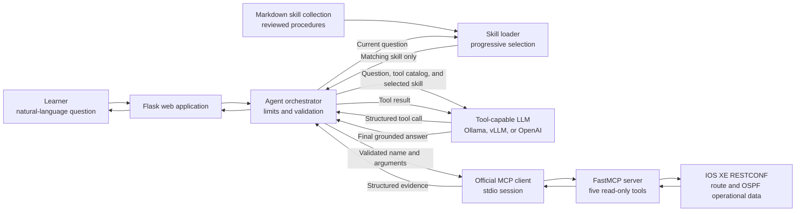
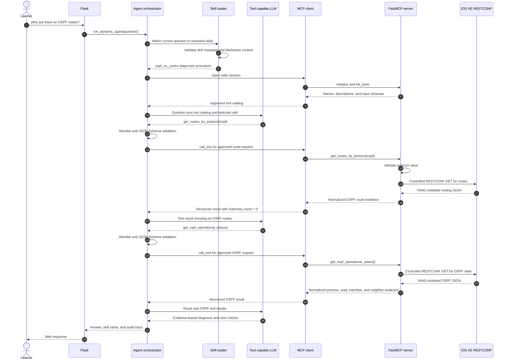
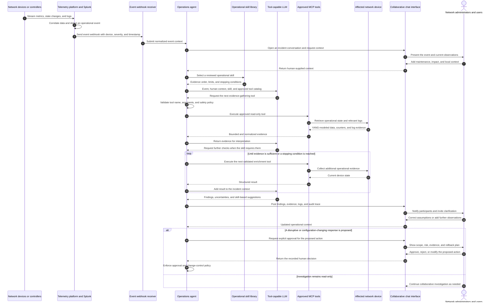

# Optional Lab 27: Add Operational Skills to the MCP Network Assistant

## Lab Introduction

Lab 26 gave the language model a controlled set of read-only MCP tools. That
design allows the model to decide which live evidence it needs, but a tool
description does not teach a complete troubleshooting method. A model might
discover that the routing table has no OSPF routes and immediately guess that
OSPF is not configured. An experienced engineer would gather more evidence:
whether an OSPF process exists, whether interfaces participate in it, whether
neighbors are present, and which adjacency states are reported.

In this lab, you will add a **skill collection** to the assistant. Within this
project, a skill is a trusted Markdown document that describes when a procedure
applies, which MCP tools it requires, the order in which evidence should be
collected, how the evidence should be interpreted, and where the safety boundary
lies. A skill does not execute Python, hold credentials, or contact the router.
It guides the agent, while MCP tools remain the only executable capabilities.

The learner first asks for a normal routing-table summary. If the answer shows
that OSPF contributes no routes, the learner can ask a follow-up question about
that absence. Only then does the first skill activate. The agent proves that the
OSPF route count is zero and calls a new operational-state tool to inspect
processes, areas, interfaces, and neighbors. The final response must distinguish
observed facts from possible causes.

## Learning Objectives

After completing this lab, you will be able to:

- Explain the difference between an agent skill and an MCP tool.
- Store operational procedures as validated Markdown files.
- Load a collection of skills without hard-coding their text in Python.
- Declare which MCP tools a skill depends on.
- Expose bounded IOS XE OSPF operational evidence through FastMCP.
- Guide an LLM through an evidence-based missing-route workflow.
- Verify skill loading, tool execution, stopping conditions, and safety limits.
- Add another skill without changing the skill loader.

## Scenario

The network operations team likes the flexibility of the Lab 26 assistant, but
its diagnoses vary between models. Senior engineers therefore want their proven
troubleshooting procedures captured independently of the model provider. The
procedure must be readable during peer review, versioned in Git, and reusable by
Ollama, vLLM, or a permitted cloud model.

The team starts with a recurring incident: a branch router contains no OSPF
routes. Operations needs the assistant to verify the absence of OSPF routes and
then inspect live OSPF state before suggesting the next investigation step. It
must not make configuration changes.

## Architecture



The Lab 26 control path remains intact. MCP still standardizes tool discovery
and execution, while `tool_agent.py` owns allowlisting, JSON Schema validation,
iteration limits, and tool-call limits. Lab 27 adds a separate skill path. The
loader compares the current question with reviewed trigger metadata and returns
only matching Markdown instructions. A skill guides the LLM but never bypasses
the orchestrator or calls RESTCONF directly.

## Message Flow

The learner first uses the general routing question from Lab 26 and reviews the
protocols that are actually present. If the learner notices that OSPF is absent,
the natural follow-up is to ask why no OSPF routes were found. The following
message flow begins with that follow-up question. It uses the same end-to-end
style as Lab 26 while adding the Lab 27 skill-selection stage.



The important separation is intentional:

| Component | Responsibility | What it cannot do |
|---|---|---|
| Markdown skill | Describes the diagnostic procedure | Contact the router or execute code |
| Skill loader | Validates local metadata and supplies instructions | Create new MCP authority |
| LLM | Chooses the next approved tool and writes the explanation | Bypass the catalog or schema validator |
| MCP server | Executes narrow read-only functions | Perform arbitrary CLI or configuration |
| RESTCONF client | Retrieves YANG-modeled evidence | Decide the diagnosis |

## Prerequisites

- Lab 26 has been completed and tested.
- A Cisco IOS XE reservable sandbox is active and reachable through VPN.
- RESTCONF is available on the sandbox router.
- One tool-capable model option from Lab 26 is available.
- Python 3, Git, and Visual Studio Code are installed.

## Supplied Project Structure

```text
Lab27/
├── .env.example
├── .gitignore
├── Lab27.md
├── app.py
├── logging_config.py
├── mcp_client.py
├── mcp_server.py
├── requirements.txt
├── restconf_routes.py
├── restconf_ospf.py
├── skill_loader.py
├── tool_agent.py
├── skills/
│   ├── README.md
│   └── ospf_no_routes.md
├── scripts/
│   └── check_lab27.py
├── static/
│   ├── app.js
│   └── styles.css
├── templates/
│   └── index.html
├── tests/
│   ├── test_restconf_ospf.py
│   ├── test_restconf_routes.py
│   ├── test_skill_loader.py
│   └── test_tool_agent.py
└── logs/
    └── .gitkeep
```

The `skills/` directory is the extension point. Each additional procedure is a
new Markdown file; the loader, Flask application, and agent do not need another
hard-coded list. A new skill may only reference tools that the MCP server already
advertises.

## Task 1: Create the Lab Repository

Create a new private GitLab.com project named `skilled_route_assistant`. Do not
initialize it with a README because the supplied folder already contains files.
Clone the repository to the learner workspace and open it in Visual Studio Code.

Using the VS Code Explorer, copy the supplied Lab 27 files into the cloned
repository. Confirm that `skills/ospf_no_routes.md` and `logs/.gitkeep` are
visible. Then create a working branch:

```bash
git switch -c feature/markdown-ospf-skill
```

## Task 2: Prepare Python and Environment Values

Create a virtual environment and install the single requirements file:

```bash
python3 -m venv .venv
source .venv/bin/activate
python -m pip install --upgrade pip
python -m pip install -r requirements.txt
```

`PyYAML` is added in this lab because skill metadata is expressed as YAML front
matter. The Markdown body remains ordinary text that instructors and engineers
can review without opening Python.

In VS Code, copy the contents of `.env.example` into a new `.env` file. Enter the
current IOS XE reservation values and retain the model configuration that worked
in Lab 26:

```text
IOSXE_HOST=<sandbox-host-or-address>
IOSXE_RESTCONF_PORT=443
IOSXE_USERNAME=<username>
IOSXE_PASSWORD=<password>
IOSXE_VERIFY_TLS=false
IOSXE_ROUTE_ENDPOINT=

LLM_PROVIDER=ollama
OLLAMA_URL=http://127.0.0.1:11434
OLLAMA_MODEL=qwen3:8b

MAX_AGENT_ITERATIONS=5
MAX_TOOL_CALLS=4
FLASK_PORT=5057
```

Use the vLLM or OpenAI settings from Lab 26 when that provider has already been
validated. Never commit `.env`, generated logs, or model API keys.

## Task 3: Understand the Skill Contract

Open `skills/ospf_no_routes.md`. Its YAML front matter declares five properties:

```yaml
---
name: ospf_no_routes
description: Diagnose why the IPv4 routing table contains no OSPF-learned routes.
triggers:
  - ospf
required_tools:
  - get_routes_by_protocol
  - get_ospf_operational_status
enabled: true
---
```

The `name` is a stable machine-readable identifier. The `description` tells an
engineer what the skill is for. A `trigger` is a phrase that must occur in the
current learner question before the skill body enters the model context.
`required_tools` lists executable dependencies, and `enabled` allows a procedure
to be retained in Git without making it available.

The Markdown body defines the procedure. Notice that it contains activation
conditions, an ordered workflow, interpretation rules, a stopping condition,
and a safety boundary. Those elements prevent a skill from becoming a loose
collection of suggestions.

Open `skill_loader.py` and follow `load_skills()`:

1. It reads only local `*.md` files under `skills/`.
2. It ignores `skills/README.md`.
3. It separates and parses YAML front matter.
4. It validates names, descriptions, dependency lists, and duplicate names.
5. It converts each document into a `Skill` object.
6. It compares the current question with each skill's declared triggers.
7. It renders only selected skill bodies into the trusted system context.

`validate_skill_tools()` compares every declared dependency with tools actually
discovered from MCP. A typographical error such as
`get_ospf_operation_status` therefore stops startup instead of silently leaving
the skill incomplete.

This progressive disclosure is why the first routing-summary question remains
neutral. The OSPF skill is available in the catalog, but its instructions are
not sent to the model until the learner's question contains `ospf`. In a larger
production catalog, semantic retrieval or an LLM-based skill selector could
replace phrase matching, but that additional probabilistic decision would need
its own validation, logging, and accuracy testing.

## Task 4: Inspect the OSPF Operational Model

Use either the locally installed Yangsuite or the Cisco DevNet sandbox
Yangsuite at `http://10.10.20.50:8480`.

1. Open **Setup > Device Profiles** and select or create the current IOS XE
   device profile with its NETCONF and RESTCONF connection information.
2. Synchronize the YANG repository from the router if the model set has not
   already been loaded.
3. Open **Explore** and select `Cisco-IOS-XE-ospf-oper`.
4. Expand `ospf-oper-data`, followed by `ospf-state` and `ospf-instance`.
5. Continue through `ospf-area`, `ospf-interface`, and `ospf-neighbor` where
   those nodes are populated by the active IOS XE release.
6. Observe fields such as process ID, router ID, area ID, interface name,
   network type, neighbor ID, and neighbor state.

The supplied RESTCONF client retrieves the bounded operational root:

```text
/Cisco-IOS-XE-ospf-oper:ospf-oper-data
```

Open `restconf_ospf.py`. The parser accepts the common `ospf-*` and older
`ospfv2-*` node names because IOS XE model revisions differ. It returns counts
and at most 20 compact records per category. This limit prevents a large router
from filling the LLM context with an entire OSPF operational database.

## Task 5: Inspect the New MCP Tool

Open `mcp_server.py` and locate `get_ospf_operational_status`. The function has
no arguments and returns only the summarized data produced by
`restconf_ospf.py`:

- OSPF process count and identifiers
- area count and selected properties
- OSPF interface count and selected properties
- neighbor count and neighbor-state distribution

The tool remains read-only. It does not expose a generic RESTCONF URL, raw CLI,
shell access, or OSPF configuration operation. Consequently, adding diagnostic
knowledge does not expand the agent into an unrestricted device administrator.

## Task 6: Validate the Project Offline

Run syntax checks, unit tests, and the readiness checker:

```bash
python -m py_compile \
  app.py logging_config.py mcp_client.py mcp_server.py \
  restconf_routes.py restconf_ospf.py skill_loader.py tool_agent.py \
  scripts/check_lab27.py
python -m pytest -q
python scripts/check_lab27.py
```

The readiness checker should report five discovered MCP tools and the loaded
`ospf_no_routes` skill. It does not call RESTCONF, so tool and skill discovery
can be verified before a live routing question is submitted.

## Task 7: Start the Skilled Assistant

Start the selected model service when necessary, then run Flask:

```bash
source .venv/bin/activate
python app.py
```

Open `http://127.0.0.1:5057`. The left panel should display five MCP tools and
one available operational skill. The skill card lists both required tools,
making the dependency visible before the agent runs; availability does not mean
that the skill body has already been sent to the model.

## Task 8: Discover the Issue and Ask a Follow-Up Question

Begin with a normal operational question rather than mentioning OSPF:

```text
How many routes are in the routing table, grouped by protocol?
```

The agent should use the route-summary tool and report only the protocols and
counts present in the returned evidence. It must not point out OSPF, speculate
about missing protocols, or recommend further OSPF checks. Inspect the protocol
list yourself. If you notice that OSPF is not represented, ask the follow-up:

```text
Why are there no OSPF routes in the routing table?
```

For the first request, `skills_loaded` should be an empty list. The omission is
something the learner recognizes rather than a conclusion highlighted by the
assistant. In the follow-up request, the word `OSPF` matches the skill trigger;
`skills_loaded` should then contain `ospf_no_routes`, giving the agent the
reviewed procedure for collecting additional read-only evidence.

For the follow-up question, when the router has no OSPF-learned routes, the
trace should show this sequence:

```text
1. get_routes_by_protocol {"protocol": "ospf"}
2. get_ospf_operational_status {}
```

The answer should first state that `matched_count` is zero. It should then quote
the observed process, area, interface, neighbor, and neighbor-state counts. Only
after those facts should it identify plausible next checks.

If OSPF routes exist, the skill deliberately stops the missing-route workflow
after reporting them unless the question explicitly asks for an OSPF health
assessment. A stopping condition reduces unnecessary requests and prevents the
assistant from manufacturing a problem that the evidence does not show.

The trace displays both `skills_loaded` and `skills_completed`. The skill is
considered completed when both declared tools appear in the validated execution
trace. This is an audit indicator, not proof that every sentence in the answer
is correct; compare the explanation with the returned evidence.

## Task 9: Interpret Common Outcomes

Use the result as a diagnostic branch rather than a definitive root-cause claim:

| Observed evidence | Defensible interpretation | Next engineering check |
|---|---|---|
| No process | OSPF is not active in the reported operational model | Review intended routing design and running OSPF configuration |
| Process exists, no interfaces | No interface appears to participate | Review network statements, interface OSPF commands, passive settings, and VRF |
| Interfaces exist, no neighbors | No adjacency is visible | Check peer reachability, subnet, area, timers, authentication, and network type |
| Neighbor exists but is not FULL | Adjacency formation is incomplete | Check the reported state and compare MTU, timers, authentication, and area |
| FULL neighbor, no OSPF routes | Adjacency alone does not provide a remote prefix | Check LSDB, peer advertisements, filtering, summarization, and topology |

An empty neighbor list is not automatically a fault. An OSPF-enabled loopback,
passive interface, or isolated segment may correctly have no neighbor. The
assistant must phrase this as a hypothesis that requires topology context.

## Task 10: Add Another Markdown Skill

To prove that the structure is extensible, create
`skills/default_route_review.md` in VS Code:

```markdown
---
name: default_route_review
description: Review the active IPv4 default route and explain its forwarding evidence.
triggers:
  - default route
required_tools:
  - get_route_detail
enabled: true
---

# Default Route Review

Use this skill when the engineer asks about the IPv4 default route.

1. Call `get_route_detail` with prefix `0.0.0.0/0`.
2. If no route is returned, state that the live evidence contains no default route.
3. If a route is returned, report its protocol, next hop, metric, and active state.
4. Do not infer Internet reachability from the existence of a default route alone.

This skill is read-only and must not request route configuration.
```

Restart Flask because the local development server runs with debug mode disabled.
The new skill should appear automatically. Ask about the default route and inspect
the selected tool. No changes to `skill_loader.py` are required.

## Task 11: Test Failure Boundaries

Temporarily misspell a required tool in the new skill, restart the application,
and request `/api/tools`. The loader should reject the dependency because the MCP
catalog does not contain it. Restore the correct name afterward.

Next, ask the assistant to reset OSPF or add a network statement. It must refuse
because the MCP catalog contains no write tool. The Markdown skill cannot grant
that missing authority.

Finally, inspect the newest timestamped log in `logs/`. It should record skill
loading, MCP discovery, approved tool calls, RESTCONF status codes, and execution
duration without exposing the router password or model API token.

## Task 12: Commit and Merge

Review `git status` and confirm that `.env`, `.venv/`, logs, and Python cache
files are not staged. Commit and push the feature branch:

```bash
git add .
git commit -m "Add Markdown OSPF diagnostic skill"
git push -u origin feature/markdown-ospf-skill
```

Create and review a merge request in GitLab.com. Pay particular attention to
the skill procedure because changes to trusted instructions can change agent
behavior even when Python remains untouched. Merge the request, then synchronize
the local repository:

```bash
git switch main
git pull origin main
```

## Troubleshooting

| Evidence | Likely cause and corrective action |
|---|---|
| `No module named yaml` | Activate `.venv` and reinstall the supplied `requirements.txt`. |
| Skill does not appear in the available catalog | Confirm that the file ends in `.md`, begins with valid YAML front matter, and has `enabled: true`. |
| Available skill is not selected | Confirm that the learner's current question contains one of the declared trigger phrases. |
| Skill dependency is unavailable | Correct `required_tools` or implement and expose the intentionally required MCP tool. Do not bypass validation. |
| OSPF RESTCONF request returns 404 | Confirm in Yangsuite that `Cisco-IOS-XE-ospf-oper` is implemented by the reserved router and that operational data is supported. |
| OSPF result contains zero processes | Verify whether OSPF is actually configured; an empty operational tree may be the correct evidence. |
| Agent stops after finding OSPF routes | This is the skill's intended stopping condition. Ask explicitly for OSPF operational health if further evidence is required. |
| Agent finds zero routes but skips OSPF status | Use a tool-capable model, ask the focused lab question, and confirm the complete skill body is loaded. Smaller models may follow multi-step procedures less reliably. |
| Tool result is very large | Keep bounded summaries and result limits. Do not send the complete operational database to the LLM. |
| Assistant proposes configuration | Treat the proposal as untrusted text. The MCP allowlist prevents execution because this lab exposes no write tool. |

## Key Takeaways

- Tools provide executable capabilities; skills provide reusable procedures.
- Markdown makes operational knowledge readable, reviewable, and version-controlled.
- Skill dependencies are checked against MCP discovery before agent execution.
- The OSPF skill proves route absence before collecting deeper protocol evidence.
- Process, interface, and neighbor evidence supports a reasoned diagnosis but does not replace topology context.
- Stopping conditions reduce unnecessary API calls and false incident narratives.
- Skills cannot bypass tool allowlists, schema validation, call limits, or read-only boundaries.
- A structured folder allows new skills to be added without modifying the loader.
- Model behavior remains probabilistic, so engineers must inspect the tool trace and compare answers with evidence.

## Continue Building the Skill Collection

After completing the lab, use the following workflow whenever you add another
operational skill.

### 1. Define One Specific Operational Outcome

Choose a narrow question that can be answered from approved evidence. Suitable
skills include reviewing a default route, investigating an interface that is
down, examining BGP neighbor state, or checking whether a device is approaching
a resource threshold. Avoid broad skills such as “troubleshoot the network,”
because they have no clear evidence order or stopping condition.

Before writing the skill, identify:

- The explicit phrase that should activate it.
- The evidence needed to reach a useful conclusion.
- The MCP tools that can retrieve that evidence.
- The conditions under which the workflow should stop.
- The actions that must remain outside the skill's authority.

### 2. Confirm That the Required Tools Exist

Start the application and inspect **Available MCP tools**, or run:

```bash
python scripts/check_lab27.py
```

If every required capability already exists, the new skill needs only a
Markdown file. However, many useful skills require evidence that the current
five MCP tools cannot retrieve. In that case, learners must add the required
MCP tools before writing them under `required_tools`. A skill cannot make an
unimplemented function appear, and the dependency validator intentionally
rejects such a reference.

Use this sequence for every new capability:

1. Use Yangsuite to identify the correct operational YANG model, hierarchy,
   list keys, and RESTCONF resource on the actual IOS XE release.
2. Add a focused RESTCONF function in a separate module. Retrieve only the
   resource needed by the skill.
3. Normalize the response into a small, predictable dictionary. Limit lists and
   remove fields the model does not need.
4. Expose that function through a narrowly described `@mcp.tool()` function in
   `mcp_server.py`.
5. Validate every tool argument before constructing the RESTCONF path.
6. Add unit tests for parsing, validation, empty responses, and result limits.
7. Run MCP discovery and confirm that the new tool name and JSON Schema appear.
8. Only then add the exact tool name to the skill's `required_tools` list.

For the `interface_down` skill used later in this section, learners would first
create `restconf_interfaces.py`. The implementation pattern is:

```python
from urllib.parse import quote

from restconf_routes import IosXeRestconfClient


def interface_detail(name: str) -> dict:
    interface_name = name.strip()
    if not interface_name or len(interface_name) > 64:
        raise ValueError("A valid interface name is required")

    encoded_name = quote(interface_name, safe="")
    path = (
        "/Cisco-IOS-XE-interfaces-oper:interfaces/"
        f"interface={encoded_name}"
    )
    payload = IosXeRestconfClient().get(path)

    records = payload.get("Cisco-IOS-XE-interfaces-oper:interface", [])
    if isinstance(records, dict):
        records = [records]
    if not records:
        return {"found": False, "name": interface_name}

    record = records[0]
    return {
        "found": True,
        "name": record.get("name", interface_name),
        "admin_status": record.get("admin-status", "unknown"),
        "oper_status": record.get("oper-status", "unknown"),
        "description": record.get("description", ""),
        "last_change": record.get("last-change", "unknown"),
    }
```

Next, import the function and expose it in `mcp_server.py`:

```python
from restconf_interfaces import interface_detail


@mcp.tool()
def get_interface_detail(name: str) -> dict:
    """Return bounded operational evidence for one exact IOS XE interface."""
    return interface_detail(name)
```

The tool accepts one interface name rather than an arbitrary resource URI. This
keeps RESTCONF credentials and path construction inside deterministic code. It
also prevents a Markdown skill or model-generated argument from turning the
tool into unrestricted access to the entire RESTCONF datastore.

After implementation, run the readiness checker and confirm that
`get_interface_detail` appears in the discovered catalog. The core checker does
not reject additional tools, but learners should read the printed catalog and
verify the new name before linking it to a skill.

### 3. Create One Markdown File

Create a clearly named file under `skills/`, such as
`skills/interface_down.md`. Use this structure:

```markdown
---
name: interface_down
description: Diagnose why a requested IOS XE interface is operationally down.
triggers:
  - interface down
  - port down
required_tools:
  - get_interface_detail
enabled: true
---

# Interface Down

Use this skill only when the learner explicitly asks about a down interface.

## Procedure

1. Call `get_interface_detail` for the interface named by the learner.
2. Report administrative and operational state before proposing a cause.
3. If the interface is administratively down, stop and identify that fact.
4. Otherwise, interpret counters and protocol state from returned evidence.
5. Separate observed facts from possible next checks.

## Safety Boundary

This skill is read-only. It must not enable, disable, or reconfigure an interface.
```

Use lowercase names with underscores. Make trigger phrases explicit enough to
avoid loading the skill for unrelated questions. Every entry under
`required_tools` must exactly match a tool name discovered from MCP. If the
skill needs several evidence sources, implement and test each MCP tool first,
then list all of them so dependency validation can protect the workflow.

### 4. Validate Progressive Selection

Add tests proving both sides of selection: an unrelated question must not load
the skill, while an explicit question must load it. Follow this pattern in
`tests/test_skill_loader.py`:

```python
def test_general_question_does_not_select_interface_skill():
    selected = select_skills("Summarize the routing table", load_skills())
    assert "interface_down" not in [skill.name for skill in selected]


def test_interface_follow_up_selects_interface_skill():
    selected = select_skills("Why is this interface down?", load_skills())
    assert "interface_down" in [skill.name for skill in selected]
```

Then run the full validation:

```bash
python -m py_compile \
  app.py mcp_server.py skill_loader.py tool_agent.py
python -m pytest -q
python scripts/check_lab27.py
```

### 5. Restart and Test the Conversation

Restart Flask after adding or changing a skill:

```bash
python app.py
```

First ask a general question that should not activate the new skill. Confirm
that its name is absent from `skills_loaded`. Next, ask an explicit follow-up
containing one of its triggers. Confirm the following evidence:

1. The correct skill appears under `skills_loaded`.
2. Only declared and discovered MCP tools are called.
3. Arguments pass JSON Schema validation.
4. The trace follows the intended evidence order.
5. The answer distinguishes observations from hypotheses.
6. The workflow stops when its documented stopping condition is reached.

### 6. Review and Version the Skill Like Code

A Markdown skill can materially change agent behavior, so review it with the
same care as Python. Ensure that it contains no credentials, hidden commands,
unrestricted operations, or instructions to trust tool output as executable
content. Commit the skill, tests, and any deliberately added MCP tool on a
feature branch, then use a GitLab merge request for peer review.

## References

- [Model Context Protocol Python SDK](https://github.com/modelcontextprotocol/python-sdk)
- [Cisco IOS XE RESTCONF Programmability Guide](https://www.cisco.com/c/en/us/td/docs/ios-xml/ios/prog/configuration/1715/b_1715_programmability_cg/restconf_protocol.html)
- [Cisco IOS XE OSPF Operational YANG Model](https://www.netconfcentral.org/modules/Cisco-IOS-XE-ospf-oper/2020-07-01/)
- [YAML Specification](https://yaml.org/spec/1.2.2/)

## Further Development: From a Chat Assistant to a Proactive Operations Agent

Lab 27 ends with a conversational assistant that waits for an operator to ask a
question. However, the same architecture can develop into a proactive,
event-driven operations agent. Instead of relying only on chat input, the agent
could continuously receive model-driven telemetry and accept webhooks from
Splunk when a correlation search, threshold, or notable event identifies an
operational problem.

The following message flow illustrates that possible next stage. It is a
future-development pattern rather than a task learners must implement in this
lab.



When an event arrives, the agent could immediately enrich it by selecting an
appropriate operational skill and invoking only the approved MCP tools required
by that procedure. For example, a Splunk webhook reporting repeated interface
flaps could cause the agent to retrieve the current interface state, examine
error counters, collect relevant device logs, identify recent configuration
changes, and check adjacent routing or neighbor state. This additional evidence
would give the original alert useful operational context instead of forwarding
an isolated symptom to the network team.

The operational skill collection would continue to grow as network experts add
and review procedures for common incidents. Each skill could capture the
evidence order, stopping conditions, safety boundaries, and interpretation
guidance that experienced engineers normally apply during troubleshooting.
Because those skills remain version-controlled and the underlying MCP tools
remain narrow and validated, the organization can improve the agent's coverage
without giving the language model unrestricted access to the infrastructure.

After completing its enrichment workflow, the agent could notify the network
operator through an approved channel. The notification would include the
triggering event, timestamps, affected resources, tool-call trace, collected
logs, observed facts, remaining uncertainties, and supporting evidence. It
could also suggest the next investigation or recovery steps derived from the
reviewed skill, while leaving any disruptive or configuration-changing action
subject to explicit operator approval. This progression creates a practical
foundation for human-governed AIOps: observe an event, enrich it quickly,
explain the evidence, recommend a controlled response, and preserve an audit
trail.

Throughout this process, network administrators and affected users remain in
the loop through a collaborative chat interface. They can add information that
telemetry cannot provide, such as an approved maintenance activity, the real
business impact, a recent physical change, or symptoms reported from a remote
site. The agent can use that context to refine its next checks, while clearly
distinguishing human statements from device evidence. In return, the shared
conversation gives every participant a common view of the investigation and
records approvals, corrections, findings, and decisions in one place.

This lab is therefore not the end of the project. It is a starting point for an
automation platform in which telemetry, observability, expert knowledge, MCP
tools, and human judgment work together. New tools and skills can be added over
time as operational experience reveals new failure patterns and better ways to
diagnose them.

Thank you for your hard work, sustained attention, and professional curiosity
throughout the CCNP Automation course. The systems built during these labs are
more than isolated exercises: together, they form the foundations of a modern,
safe, observable, and increasingly intelligent network automation practice.
