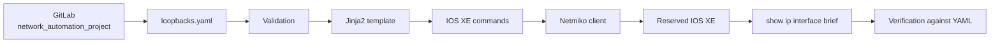

# Lab 3: Let's Start Your Network Automation Project

## Lab Introduction

Lab 2 confirmed that the workstation can retrieve Cisco sandbox IOS XE router information. Lab 3 now begins the durable project that learners will extend through Lab 8. Learners create a separate GitLab repository named `network_automation_project`, define one or more loopback interfaces in YAML, validate the data, render IOS XE commands with a Jinja2 template, configure a reserved router with Netmiko, and verify the resulting interface state.

This first version uses `data/loopbacks.yaml` as a small source of truth. Lab 4 will replace that file as the active data source with NetBox. Lab 5 will replace environment-file device credentials with Vault. Lab 6 will add NETCONF-based OSPF configuration, and Lab 7 will place the complete workflow into GitLab CI/CD.

## Learning Objectives

- Create the cumulative `network_automation_project` GitLab repository.
- Organize Python into reusable scripts and modules.
- Represent one or many loopback interfaces in YAML.
- Validate required fields, datatypes, addresses, and uniqueness.
- Use a loop inside a Jinja2 template.
- Preview configuration before sending it.
- Configure IOS XE with a small object-oriented Netmiko client.
- Verify intended IP addresses and operational state.
- Use a feature branch and merge request for source-of-truth changes.
- Explain the difference between repeatable commands and full reconciliation.

## Estimated Time

Allow approximately **3 hours**.

## Prerequisites

- Labs 1 and 2 completed
- GitLab.com learner account with SSH authentication configured in Lab 1
- Active IOS XE reservable sandbox and VPN
- Python virtual environment from Lab 1

## Project Architecture



## Project Structure

```text
network_automation_project/
├── .env.example
├── .gitignore
├── requirements.txt
├── data/
│   └── loopbacks.yaml
├── inventory/
│   └── devices.yaml
├── scripts/
│   ├── __init__.py
│   ├── apply_loopbacks.py
│   ├── preview_loopbacks.py
│   └── validate_source_of_truth.py
├── src/
│   ├── __init__.py
│   ├── iosxe_cli.py
│   ├── loopback_source.py
│   ├── reporting.py
│   └── settings.py
└── templates/
    └── loopback.j2
```

## Task 1: Create the Main GitLab Repository

In [GitLab.com](https://gitlab.com), create a blank private project in your personal namespace:

- Project name: `network_automation_project`
- Project slug: `network_automation_project`
- Default branch: `main`
- Do not initialize with a README

Before the first push, disable GitLab's automatically generated pipeline for this project:

1. Open `network_automation_project` in GitLab.
2. Select **Settings > CI/CD**.
3. Expand **Auto DevOps**.
4. Clear **Default to Auto DevOps pipeline**.
5. Select **Save changes**.

Do not disable the entire CI/CD project feature. Lab 7 will add the project's intentional `.gitlab-ci.yml`; only Auto DevOps should be disabled. Without this change, GitLab can synthesize build, code-quality, container-scanning, secret-detection, and SAST jobs even though the repository has no CI file.

Clone it:

```bash
cd ~/ccnpauto-workspace
git clone \
  git@gitlab.com:YOUR_USERNAME/network_automation_project.git
cd network_automation_project
```

This repository is separate from `lab2_warm_up` and becomes the only repository extended in Labs 4–8.

## Task 2: Copy the Baseline Project

```bash
LAB3_FILES="/path/to/CCNPAUTO/LAB/Lab3"
cp "$LAB3_FILES/.env.example" "$LAB3_FILES/.gitignore" \
  "$LAB3_FILES/requirements.txt" .
cp -R "$LAB3_FILES/data" "$LAB3_FILES/inventory" \
  "$LAB3_FILES/scripts" "$LAB3_FILES/src" "$LAB3_FILES/templates" .
tree -a -I '.git'
```

Install dependencies:

```bash
source ~/.venvs/ccnpauto/bin/activate
python -m pip install -r requirements.txt
python -m pip check
```

The baseline YAML intentionally contains an empty list. Commit the reusable framework before defining a device change:

```bash
git add .
git commit -m "Initialize network automation project"
git push -u origin main
```

## Task 3: Configure the Reserved Router Connection

```bash
cp .env.example .env
chmod 600 .env
```

Enter the current reservation values. Keep:

```dotenv
SANDBOX_MODE=reserved
ALLOW_CONFIG_CHANGES=false
```

Confirm `.env` is ignored:

```bash
git check-ignore -v .env
```

`Settings.confirm_write_access()` requires both an explicitly reserved environment and an explicit write flag. A missing or false value stops configuration.

## Task 4: Create a Feature Branch for Loopback Intent

```bash
git switch -c feature/add-loopbacks
```

Edit `data/loopbacks.yaml`. One loopback uses:

```yaml
---
loopbacks:
  - id: 101
    description: MANAGED_BY_NETWORK_AUTOMATION_PROJECT
    ipv4: 192.0.2.101
    prefix_length: 32
    enabled: true
```

Several loopbacks use the same list:

```yaml
---
loopbacks:
  - id: 101
    description: MANAGED_BY_NETWORK_AUTOMATION_PROJECT
    ipv4: 192.0.2.101
    prefix_length: 32
    enabled: true
  - id: 102
    description: MANAGED_BY_NETWORK_AUTOMATION_PROJECT
    ipv4: 192.0.2.102
    prefix_length: 32
    enabled: true
```

Use only instructor-approved IDs and documentation addresses. Do not overwrite an existing sandbox interface.

## Task 5: Validate the YAML Contract

Run:

```bash
python -m scripts.validate_source_of_truth
```

Each item must contain exactly:

- `id`: non-negative integer;
- `description`: nonempty, single-line string;
- `ipv4`: valid IPv4 address;
- `prefix_length`: integer;
- `enabled`: Boolean.

The loader also rejects duplicate IDs and duplicate addresses. Correct source data rather than bypassing validation.

## Task 6: Preview the Jinja2 Output

```bash
python -m scripts.preview_loopbacks
```

The template, not Python, contains the loop:

```jinja2

interface Loopback{{ loopback.id }}
 description {{ loopback.description }}
 ip address {{ loopback.ipv4 }} {{ loopback.netmask }}

 no shutdown

 shutdown


```

Python loads and validates the list once. Jinja2 repeats the interface stanza for every item.

## Task 7: Review the Reusable Classes

`LoopbackManager` owns source loading, validation, address normalization, and rendering. `IOSXEDevice` owns connection lifecycle, parsed operational commands, and configuration transport. `reporting.py` owns table presentation.

This separation matters in Lab 4: NetBox will replace the YAML loader, while the template and device adapter remain useful.

## Task 8: Apply and Verify the Loopbacks

Review the preview carefully, confirm the private reservation, and change:

```dotenv
ALLOW_CONFIG_CHANGES=true
```

Run:

```bash
python -m scripts.apply_loopbacks
```

The script:

1. checks the write boundary;
2. validates YAML;
3. connects once with Netmiko;
4. displays interface state before the change;
5. renders and sends commands;
6. retrieves interface state again; and
7. verifies every intended interface and address.

Run it a second time. Reapplying the same interface commands should not create duplicate interfaces or change the intended result. This is operationally repeatable, but it is not complete reconciliation: interfaces omitted from YAML are not deleted automatically.

Return `ALLOW_CONFIG_CHANGES=false` after testing.

## Task 9: Commit Through a Merge Request

```bash
git diff
git add data/loopbacks.yaml
git commit -m "Define managed loopback interfaces"
git push -u origin feature/add-loopbacks
```

Create a merge request into `main`. Include:

- intended interface IDs and addresses;
- validation result;
- rendered-command review;
- verification result;
- rollback command such as `no interface Loopback101`.

Merge after review, then synchronize:

```bash
git switch main
git pull --ff-only
git branch -d feature/add-loopbacks
```

## Task 10: Establish the Project Baseline

Confirm:

```bash
git status --short
git log --oneline --graph --decorate --all
python -m scripts.validate_source_of_truth
```

The repository now contains the first version of the cumulative automation project. `.env` remains local and untracked.

## Troubleshooting

| Symptom | Likely cause | Action |
|---|---|---|
| Validation reports empty list | No loopback was added on the feature branch | Add at least one complete YAML item |
| YAML parser error | Indentation or syntax problem | Correct spacing and list markers |
| TextFSM returns raw text | Missing or incompatible `ntc-templates` | Reinstall requirements and inspect release support |
| Safety check stops change | Write flag false or sandbox mode incorrect | Confirm reservation, then enable changes deliberately |
| SSH timeout | VPN, hostname, port, or reservation expired | Test reachability and reservation details |
| Verification finds wrong address | Existing interface conflict or unintended state | Stop and compare YAML with router configuration |
| A pipeline appears without `.gitlab-ci.yml` | Auto DevOps is enabled for the project, group, or instance | Disable Auto DevOps under **Settings > CI/CD**, then cancel the generated pipeline |
| Auto DevOps jobs remain pending | No runner is eligible for the generated jobs | Cancel them; Lab 3 does not require a runner, and Lab 7 registers the intended runner |

## Key Takeaways

- `network_automation_project` begins in Lab 3 and continues through Lab 8.
- YAML provides a simple first source of truth for one or many loopbacks.
- Validation and preview happen before device access.
- Jinja2 owns iteration and separates intent from IOS XE syntax.
- Reusable modules allow later labs to replace one concern at a time.
- Git branches and merge requests make network intent reviewable.

Lab 4 moves the loopback source of truth from YAML to NetBox while retaining this project's normalized contract, template, device adapter, and verification logic.

## References

- [Jinja documentation](https://jinja.palletsprojects.com/)
- [PyYAML documentation](https://pyyaml.org/wiki/PyYAMLDocumentation)
- [Netmiko documentation](https://ktbyers.github.io/netmiko/docs/netmiko/)
- [GitLab merge requests](https://docs.gitlab.com/user/project/merge_requests/)
