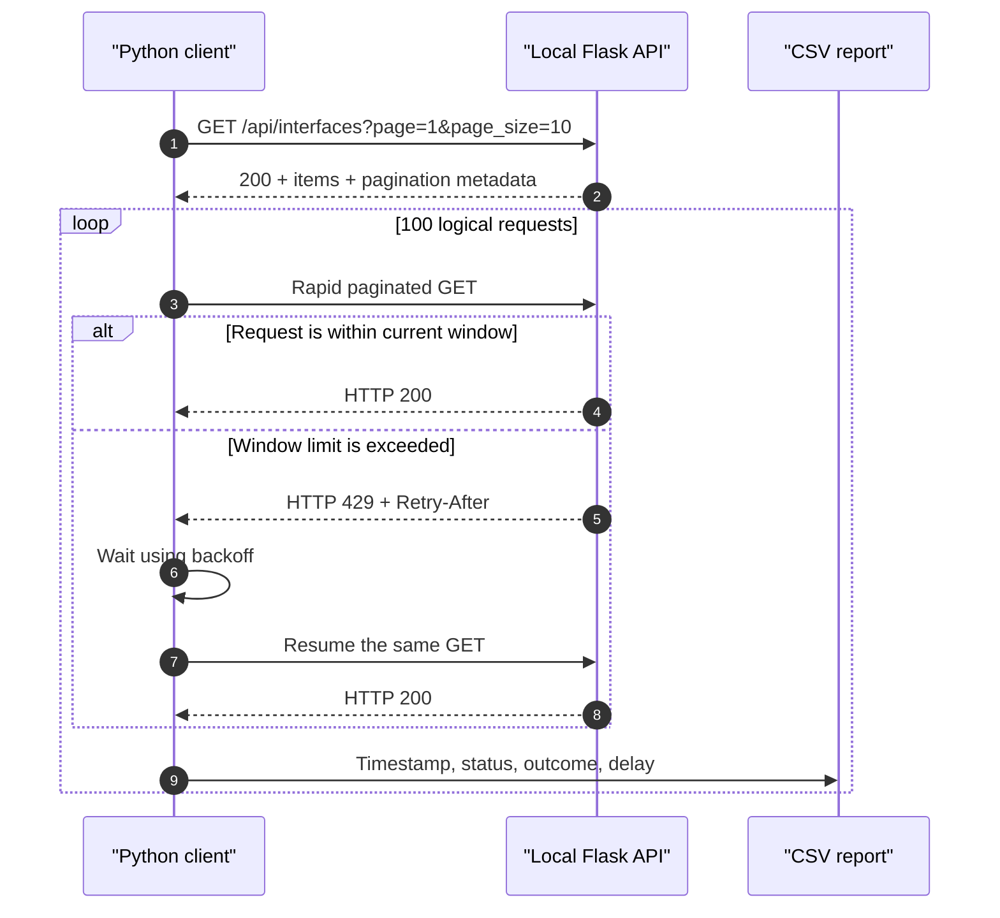

# Lab 3: Pagination, Rate Limiting, and HTTP Backoff

## Lab Introduction

This lab uses a local Flask server on the learner's Ubuntu 26.04 workstation. The server behaves like a small network inventory API: it holds 100 dummy loopback-interface records, returns them in pages, enforces a fixed-window request limit, and supports entity tags for an optional HTTP cache exercise.

The Python client in this lab first retrieves different pages through query parameters. It then performs 100 logical requests rapidly enough to trigger HTTP `429 Too Many Requests`. Each `429` response is recorded, the client honors `Retry-After` or calculates exponential backoff, and the request is resumed. Every HTTP attempt is written to CSV with request and response timestamps, status, outcome, and delay. This arrangement gives every learner repeatable behavior without generating load against Cisco-hosted infrastructure.

## Learning Objectives

After completing this lab, you will be able to:

- Explain page-number and page-size pagination.
- Interpret pagination metadata returned by an API.
- Implement a fixed-window rate limit in Flask.
- Interpret HTTP `429` and `Retry-After`.
- Resume an idempotent GET after bounded backoff.
- Distinguish logical requests from HTTP attempts and retries.
- Record API activity and UTC timestamps in CSV format.
- Use `ETag` and `If-None-Match` for optional cache revalidation.

## Estimated Time

Allow approximately **2 to 3 hours**.

## Prerequisites

- Ubuntu 26.04 workstation prepared in Lab 1, or an equivalent environment
- Python 3, `pip`, Git, and VS Code
- The `ccnpauto` virtual environment
- Local GitLab access when source-control tasks are required

Lab 2 and Lab 3 are independent and may be completed in either order. No Cisco sandbox reservation is required for Lab 3.

## Lab Architecture



## Project Structure

```text
lab3-http-api/
├── .gitignore
├── requirements.txt
├── server.py
├── client.py
└── artifacts/
    └── api_results.csv
```

## Task 1: Create the GitLab Project

Create a private GitLab project named `lab3-http-api`, clone it, and copy the supplied Lab 3 files:

```bash
cd "$HOME/ccnpauto-workspace"
git clone http://gitlab.lab.local:8088/YOUR_USERNAME/lab3-http-api.git
cd lab3-http-api

LAB3_FILES="/path/to/CCNPAUTO/LAB/Lab3"
cp "$LAB3_FILES/server.py" "$LAB3_FILES/client.py" .
cp "$LAB3_FILES/requirements.txt" "$LAB3_FILES/.gitignore" .
```

Activate the environment and install the dependencies:

```bash
source "$HOME/.venvs/ccnpauto/bin/activate"
python -m pip install -r requirements.txt
python -m pip check
```

## Task 2: Understand the Dummy Network Dataset

The `build_dummy_interfaces()` function creates 100 records. Although the records are synthetic, their fields resemble data that a network inventory service might return:

```json
{
  "id": 1,
  "name": "Loopback1",
  "ipv4_address": "198.18.0.1",
  "prefix_length": 32,
  "oper_status": "up",
  "site": "BRANCH-01"
}
```

The server does not return all records blindly. Instead, `page` identifies the requested page and `page_size` controls its maximum number of records. With 100 records and a page size of 10, the API produces 10 pages. The response also includes `total_items`, `total_pages`, `has_next`, and `next_page`, allowing the client to decide whether another call is needed.

## Task 3: Start and Test the Flask Server

Open a terminal, activate the environment, and start the API:

```bash
source "$HOME/.venvs/ccnpauto/bin/activate"
python server.py
```

Keep this terminal open. Flask listens only on `127.0.0.1:5000`, so the training API is not exposed to the external network. In a second terminal, test its health endpoint:

```bash
curl -s http://127.0.0.1:5000/health | python -m json.tool
```

The response should report `status: ok` and 100 records. Now request the second page:

```bash
curl -s "http://127.0.0.1:5000/api/interfaces?page=2&page_size=10" \
  | python -m json.tool
```

The returned records should begin with Loopback11, while the pagination object should report page 2 of 10. Try `page_size=20`; this reduces the total to five pages without changing the underlying dataset.

## Task 4: Examine Server-Side Pagination

In `server.py`, the server calculates the slice as follows:

```python
start = (page - 1) * page_size
records = interfaces[start : start + page_size]
```

For page 3 with 10 records per page, `start` is 20 and the slice returns list positions 20 through 29. Because Python indexes from zero, these positions represent Loopback21 through Loopback30. The server rejects page numbers below 1 and page sizes outside 1 through 50 with HTTP `400`, preventing an invalid or excessively large request.

This is true server-side pagination: only the selected records are serialized into the response. By comparison, client-side pagination first downloads the entire collection and then slices it locally, which improves presentation but does not reduce payload size or server work.

## Task 5: Understand the Simulated Rate Limit

The `FixedWindowRateLimiter` permits eight requests during a one-second window. Every call updates the counter. Once the limit is exceeded, the server returns:

```http
HTTP/1.1 429 TOO MANY REQUESTS
Retry-After: 1
X-RateLimit-Limit: 8
X-RateLimit-Remaining: 0
```

After the one-second window expires, the counter resets. This model is intentionally simple and deterministic enough for study. Production APIs may use token buckets, sliding windows, per-user quotas, distributed counters, or tier-specific policies.

The client treats each desired page retrieval as one **logical request**. A logical request may require several **HTTP attempts**. When an attempt receives `429`, the client records it and waits. A later `200` for the same logical request increments the successful-resume counter.

If `Retry-After` contains seconds, that provider instruction takes precedence. Otherwise, the client uses bounded exponential backoff with jitter:

```text
delay = min(0.5 × 2^(attempt-1) + random jitter, 8 seconds)
```

The maximum retry count prevents an unavailable service from trapping the client in an infinite loop. Repeating GET is appropriate because it is idempotent; retrying a state-changing POST requires additional duplicate-prevention design.

## Task 6: Run 100 Logical Requests

With the Flask server still running, execute the client from the second terminal:

```bash
python client.py --requests 100 --pages 10 --page-size 10
```

The client cycles through pages 1 to 10. Because it makes requests without proactive pacing, the ninth request in a busy one-second window should receive `429`. The client waits, resumes that page, and continues until all 100 logical requests succeed or one exceeds the retry limit.

The final table separates the important measurements:

- **Logical requests** should equal 100.
- **HTTP attempts** includes initial calls and retry attempts, so it is normally greater than 100.
- **Successful responses** counts the 100 completed logical operations.
- **HTTP 429 responses** counts rate-limit rejections.
- **Successful resumes after backoff** counts logical operations that eventually succeeded after at least one `429`.

## Task 7: Interpret the CSV Report

Open `artifacts/api_results.csv` in VS Code. Each row represents one HTTP attempt rather than one logical operation:

| Column | Meaning |
|---|---|
| `logical_request` | Desired operation number from 1 through 100 |
| `attempt` | Attempt number for that logical operation |
| `page` | Requested page |
| `requested_at_utc` | UTC timestamp immediately before the GET |
| `responded_at_utc` | UTC timestamp immediately after the response |
| `status_code` | HTTP `200`, `429`, or another status |
| `outcome` | Success, rate-limited, resumed, or error |
| `backoff_seconds` | Delay selected after that response |

Filter for `status_code=429`. The following row with the same logical request should have a later timestamp and normally report `resumed_after_backoff`. Therefore, the CSV preserves evidence of both the failure-control decision and its successful recovery.

## Task 8: Optional HTTP Cache Revalidation

Successful page responses include `Cache-Control` and `ETag`. The entity tag is a SHA-256 digest of the records on that page. A client can present that validator later through `If-None-Match`; if the page is unchanged, the server returns `304 Not Modified` without another JSON body.

Run the optional demonstration after the rate-limit window has recovered:

```bash
python client.py --cache-demo
```

The expected sequence is HTTP `200` followed by HTTP `304`. The example waits before revalidation so the earlier burst cannot interfere. In production, cache keys must include the URI, query parameters, relevant representation headers, and authorization context. Operational network state should never be cached merely because a response can technically be stored.

## Task 9: Commit the Lab

The generated CSV is ignored because it is runtime evidence rather than source code. Commit the implementation and learner notes:

```bash
git switch -c feature/complete-http-api-lab
git add .
git diff --staged
git commit -m "Complete pagination and rate-limit lab"
git push -u origin feature/complete-http-api-lab
```

Create a merge request, review it, and merge it into `main`.

## Troubleshooting

### Connection refused

Confirm that `python server.py` is still running and listening on `127.0.0.1:5000`. The client and server must run in separate terminals.

### No HTTP 429 responses appear

Confirm that the client uses its defaults and that only one server process is running. Slow debugging, breakpoints, or manually paced calls can allow the one-second window to reset before the ninth request.

### A logical request exceeds the retry limit

Verify that the server returns `Retry-After: 1` and that the client has not been modified to skip `time.sleep()`. Stop additional client processes because they share the same server-side counter.

### CSV contains more than 100 rows

This is expected. The experiment performs 100 logical operations, while every `429` adds an HTTP attempt and CSV row before the resumed attempt succeeds.

## Key Takeaways

- Server-side pagination reduces response size by selecting records before serialization.
- Pagination metadata helps clients traverse a collection safely.
- HTTP `429` indicates temporary rate-limit rejection rather than malformed input.
- `Retry-After` should be preferred when the provider supplies it.
- Exponential backoff with jitter is a fallback, and retries must remain bounded.
- Logical requests and HTTP attempts are different operational measurements.
- UTC timestamps and CSV records make API behavior auditable.
- `ETag` enables conditional revalidation, but cache policy must match data sensitivity and freshness requirements.

Lab 4 returns to the cumulative IOS XE project and moves its loopback source of truth from YAML into NetBox.

## Further Reading

- [Flask documentation](https://flask.palletsprojects.com/)
- [Requests documentation](https://requests.readthedocs.io/)
- [RFC 6585: HTTP 429 Too Many Requests](https://www.rfc-editor.org/rfc/rfc6585)
- [RFC 9110: HTTP Semantics](https://www.rfc-editor.org/rfc/rfc9110)
- [RFC 9111: HTTP Caching](https://www.rfc-editor.org/rfc/rfc9111)
