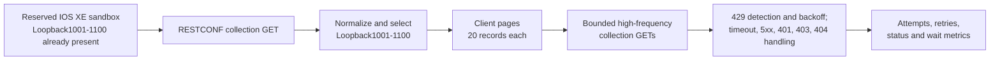

# Lab 3: RESTCONF Pagination and Resilient API Consumption

## Lab Introduction

Collecting IOS XE state through RESTCONF is only the beginning of a reliable automation workflow. A response may contain more records than a person can inspect at once, clients must avoid overwhelming an API, and temporary network or server failures must not produce uncontrolled retries. At the same time, permanent failures such as invalid credentials require the program to stop instead of repeating a request that cannot succeed.

Lab 3 develops those operational behaviors against a Cisco IOS XE reservable sandbox that already contains 100 dedicated interfaces: Loopback1001 through Loopback1100. Learners must create that dataset before starting this lab, using a method approved by the instructor, but Lab 3 does not create or modify it. The client retrieves the RESTCONF interface collection, selects the 100 records, and presents five pages of 20 loopbacks. A second workflow performs individual list-entry requests at a controlled rate, making the cost of repeated API calls visible. Finally, the client is enhanced with bounded retries, backoff, `Retry-After` processing, status-aware flow control, and request metrics. An optional exercise investigates conditional HTTP requests with `ETag` and `Last-Modified` when IOS XE supplies those validators.

Lab 2 and Lab 3 are independent exercises. Lab 2 focuses on CLI collection and source-of-truth configuration, whereas Lab 3 focuses on robust API consumption. Therefore, learners may complete either lab first, provided the required 100-interface dataset exists before Lab 3 begins.

The pagination exercise makes an important standards distinction. RFC 8040 defines RESTCONF query parameters such as `content`, `depth`, and `fields`, but it does not define `limit` and `offset` list pagination. RESTCONF list-pagination work exists as an IETF Internet-Draft, and the IOS XE RESTCONF documentation used for this lab does not advertise that extension. Therefore, the primary exercise uses **client-side pagination** over one retrieved collection. It does not append unsupported parameters and claim that the device paginated the result.

## Learning Objectives

After completing this lab, you will be able to:

- Verify that a known 100-interface dataset is available before API collection begins.
- Explain the difference between server-side and client-side pagination.
- Divide 100 normalized RESTCONF records into pages of 20.
- Explain offset, page-number, and cursor pagination trade-offs.
- Protect an IOS XE management plane with proactive client-side request pacing.
- Interpret HTTP `429 Too Many Requests` and `Retry-After`.
- Distinguish retryable failures from unrecoverable request or authorization errors.
- Implement bounded retries with exponential backoff and jitter.
- Stop application flow safely after authentication or authorization failure.
- Continue collection when one interface disappears between index and detail requests.
- Record request attempts, retries, status codes, and deliberate pacing delay.
- Evaluate whether RESTCONF data can use HTTP conditional requests safely.

## Estimated Time

Allow approximately **2.5 to 3.5 hours**, assuming the 100 loopback interfaces already exist.

## Prerequisites

Before beginning, confirm that:

- The workstation has Python 3, Git, and a working virtual environment, as prepared in Lab 1 or through an equivalent setup.
- The learner has an active IOS XE reservable sandbox.
- The VPN connection, when required, is active.
- The `ccnpauto` Python virtual environment is available.
- The learner can reach RESTCONF over HTTPS.
- The sandbox reservation has enough remaining time for the lab.

Before the lab begins, the learner must have created Loopback1001 through Loopback1100 with addresses `198.18.0.1/32` through `198.18.0.100/32`. The learner may use manual IOS XE CLI commands, an independent automation script, or an instructor-provided bootstrap method. Do not save these temporary interfaces to startup configuration.

## Lab Architecture



## Project Structure

```text
lab3-restconf-resilience/
├── .env.example
├── .gitignore
├── requirements.txt
├── scripts/
│   ├── cache_demo.py
│   ├── paginate_loopbacks.py
│   ├── rate_limited_details.py
│   └── resilient_loopbacks.py
└── src/
    ├── http_cache.py
    ├── interface_utils.py
    ├── pagination.py
    ├── rate_limiter.py
    ├── restconf_client.py
    └── settings.py
```

The class design remains close to the network tasks. `RESTCONFClient` represents a normal API session. `ResilientRESTCONFClient` inherits that session behavior and adds retries and counters. `Paginator` divides a list into pages, `BurstRateLimitExperiment` runs the bounded `429` exercise, and `RateLimiter` provides conservative pacing for the normal resilient collector. `HTTPCache` stores HTTP validators. Interface normalization and table printing remain ordinary functions because they do not need object state. Each script surrounds these objects with `try/except` blocks so the operational response to a failure is easy to find.

## Task 1: Verify the Standalone Lab Dataset

Open the DevNet reservation and confirm that it is still active. Reconnect the VPN if required, then verify HTTPS reachability using the host and port from the reservation:

```bash
nc -vz <IOSXE_HOST> <HTTPS_PORT>
```

Activate the course environment:

```bash
source "$HOME/.venvs/ccnpauto/bin/activate"
python --version
```

Connect to the router with SSH and inspect the first and last entries in the required range:

```bash
ssh -p <SSH_PORT> <USERNAME>@<IOSXE_HOST>
show ip interface brief | include Loopback1001|Loopback1100
```

The expected addresses are `198.18.0.1/32` on Loopback1001 and `198.18.0.100/32` on Loopback1100. Use `show ip interface brief | include Loopback1` to inspect the complete range if necessary. If any interface is absent or uses a different address, stop and prepare the dataset before continuing. Dataset creation is a prerequisite, not a task within this lab, so Lab 3 never sends configuration commands to the router.

## Task 2: Create the Lab 3 GitLab Repository

In the learner's local GitLab, create a private project named `lab3-restconf-resilience` and initialize it with a README. Clone it:

```bash
cd "$HOME/ccnpauto-workspace"
git clone http://gitlab.lab.local:8088/YOUR_USERNAME/lab3-restconf-resilience.git
cd lab3-restconf-resilience
```

Copy the Lab 3 files directly into the repository:

```bash
LAB3_FILES="/path/to/CCNPAUTO/LAB/Lab3"
cp "$LAB3_FILES/requirements.txt" "$LAB3_FILES/.env.example" \
  "$LAB3_FILES/.gitignore" .
cp -R "$LAB3_FILES/scripts" "$LAB3_FILES/src" .
tree -a -I '.git'
```

Commit the initial project:

```bash
git add .
git commit -m "Add RESTCONF resilience lab project"
git push origin main
```

## Task 3: Configure the Python Environment

Keep the Lab 1 virtual environment active and install missing packages:

```bash
source "$HOME/.venvs/ccnpauto/bin/activate"
python -m pip install -r requirements.txt
python -m pip check
```

Create the local environment file:

```bash
cp .env.example .env
chmod 600 .env
code .env
```

Enter the HTTPS host, port, username, and password supplied with the active reservation. The initial operational settings are deliberately conservative:

```dotenv
REQUESTS_PER_SECOND=5
IOSXE_CONNECT_TIMEOUT=10
IOSXE_READ_TIMEOUT=45
IOSXE_MAX_RETRIES=3
```

Confirm that secrets remain ignored:

```bash
git check-ignore -v .env
```

## Task 4: Retrieve Five Pages of 20 Loopbacks

Pagination divides a large result set into bounded units. Common API designs include:

| Model | Client input | Strength | Weakness |
|---|---|---|---|
| Page number | `page=3&page_size=20` | Easy for people to understand | Inserts or deletions can shift later pages |
| Offset | `offset=40&limit=20` | Simple random access | Large offsets can be expensive and data can drift |
| Cursor | Opaque continuation token | Stable and efficient for changing datasets | Cannot usually jump directly to an arbitrary page |
| Client-side | Slice a retrieved collection | Works when the server lacks pagination | Does not reduce server payload or client memory |

The IOS XE exercise uses the last model. `paginate_loopbacks.py` sends one collection GET to:

```text
/restconf/data/Cisco-IOS-XE-interfaces-oper:interfaces
```

It normalizes the response, selects Loopback1001 through Loopback1100, sorts by numeric interface ID, and slices the in-memory list into pages.

Run it interactively:

```bash
python -m scripts.paginate_loopbacks
```

The program displays 20 interfaces and waits for Enter before showing the next page. Five pages should represent all 100 lab interfaces. To print continuously without prompts, use:

```bash
python -m scripts.paginate_loopbacks --page-size 20 --no-prompt
```

Try a different presentation size:

```bash
python -m scripts.paginate_loopbacks --page-size 25 --no-prompt
```

This produces four pages but still performs only one RESTCONF GET. Changing page size affects client presentation, not device workload.

### Why Unsupported Query Parameters Are Not Used

A URI such as `?limit=20&offset=0` is common in web APIs, but it is not part of RFC 8040. A server might reject unknown parameters with `400`, ignore them and return the full collection, or implement a vendor extension. Code must discover documented capability rather than infer support from a successful HTTP connection. As of this lab's publication, RESTCONF list pagination is still being developed by the IETF and must not be assumed on the IOS XE sandbox.

Client-side pagination has a consistency advantage: every displayed page comes from one response snapshot. However, it does not reduce response size, memory use, or device work. The next task intentionally performs multiple requests so rate protection becomes visible.

## Task 5: Trigger and Recover from an API Rate Limit

Rate limiting controls how quickly a consumer may call a provider. It protects CPU, session capacity, bandwidth, downstream systems, and fairness among consumers. APIs may enforce limits per credential, source address, tenant, method, or time window. In this task, the client deliberately removes proactive pacing and sends repeated RESTCONF collection requests as quickly as each response completes. The aim is to observe an actual HTTP `429`, not to estimate the limit from an arbitrary requests-per-second value.

When a provider rejects excess traffic, HTTP `429 Too Many Requests` communicates the condition. The optional `Retry-After` response header tells the client how long to wait. This lab handles a numeric delay in seconds. If the header is absent, the client calculates exponential backoff with a small random jitter. After waiting, it resumes the same idempotent GET request.

Because a reservable sandbox is still shared infrastructure, the experiment has three independent safety boundaries. It stops after 200 requests, 30 seconds, or three backoff events. Reaching a boundary without receiving `429` is a valid result: it means only that the IOS XE image did not expose its rate threshold under the permitted test conditions. Learners must not remove the boundaries or run several copies concurrently.

Review the controls in `.env`:

```dotenv
BURST_MAX_REQUESTS=200
BURST_MAX_SECONDS=30
BURST_MAX_BACKOFFS=3
```

The `BurstRateLimitExperiment` class repeatedly sends an idempotent GET to the operational interface collection. Every status code is printed. On `429`, `_backoff_seconds()` first checks `Retry-After`; otherwise, it uses approximately `0.5 × 2^(backoff-1)` seconds plus jitter, capped at eight seconds. Run the experiment only once:

```bash
python -m scripts.rate_limited_details
```

The summary reports:

- The safety condition that stopped the experiment
- Total RESTCONF requests sent
- Number of HTTP `429` responses followed by backoff

If IOS XE returns `429`, confirm that the script waits and then prints `Backoff completed; resuming the RESTCONF request.` A later successful `200` demonstrates recovery. If every request returns `200`, record that no server-side rate limit was observed within the bounded window. Do not increase the limits to force a particular outcome; the script must not become an open-ended load generator.

### Pagination and Rate Limiting Solve Different Problems

Pagination bounds how many records the application presents in one logical page. Rate limiting bounds how quickly requests reach a provider. A page size of 20 does not imply a particular request frequency, while a burst of collection GETs does not change the number of records in each response. Treat them as separate controls.

## Task 6: Add Error Handling and Controlled Flow

The `RESTCONFClient` class handles normal GET requests. `ResilientRESTCONFClient` inherits from it and replaces `get_json()` with a bounded retry loop. The shared connection behavior remains in the parent class, while the child class adds retry policy and counters. The loop is still visible in `src/restconf_client.py`, so learners can follow each decision.

| Condition | Retry the same request? | Application action |
|---|---|---|
| Connection reset or timeout | Yes, within a small bound | Back off, retry, then fail clearly |
| HTTP 429 | Yes, when delay is acceptable | Honor `Retry-After` or use backoff |
| HTTP 500/502/503/504 | Usually for idempotent GET | Exponential backoff with jitter |
| HTTP 400 | No | Correct request syntax or data |
| HTTP 401 | No | Stop and correct credentials |
| HTTP 403 | No | Stop and correct authorization |
| HTTP 404 collection path | No | Correct model or resource path |
| HTTP 404 one interface | Do not retry that item | Record disappearance and continue |
| Invalid JSON after HTTP success | No automatic retry by default | Preserve evidence and investigate |

### Bounded Exponential Backoff

For retryable failures, the client uses approximately:

```text
delay = min(8 seconds, 0.5 × 2^(attempt-1)) + random jitter
```

Jitter prevents many clients from retrying at exactly the same moment. `IOSXE_MAX_RETRIES=3` means at most four attempts: the original request plus three retries. The client retries only idempotent GET operations in this lab. Blindly retrying a POST or another non-idempotent operation could create duplicate state.

For `429`, a numeric `Retry-After` takes precedence over calculated backoff and is capped at 60 seconds. After the configured attempts are exhausted, the client raises `APIError`, which the script catches and reports.

### Run the Resilient Collector

```bash
python -m scripts.resilient_loopbacks
```

Unlike the deliberate burst in Task 5, this normal collector applies proactive pacing and prints metrics after collection. Under normal sandbox conditions, retries should remain zero.

Generate one safe, real `404` without changing the router:

```bash
python -m scripts.resilient_loopbacks --demo-not-found
```

The script requests a deliberately nonexistent `Loopback999999`. The client raises `NotFoundError`; an inner `except` block reports it and continues with the real collection. This demonstrates that “unrecoverable for one request” does not always mean “terminate the entire job.”

Authentication and authorization are different. If the collection receives `401` or `403`, the workflow stops immediately. Repeating invalid credentials can lock accounts, create audit noise, and never correct the cause.

### Optional Timeout Observation

To observe bounded transport handling, temporarily set a very small read timeout:

```dotenv
IOSXE_READ_TIMEOUT=0.001
IOSXE_MAX_RETRIES=2
```

Run the resilient collector once. Depending on local latency, it should print each retry and eventually raise a controlled `APIError`. Restore the normal values immediately:

```dotenv
IOSXE_READ_TIMEOUT=45
IOSXE_MAX_RETRIES=3
```

Do not remove timeouts entirely. A request without a timeout can wait indefinitely and hold worker, connection, and queue capacity.

## Task 7: Optional HTTP Conditional Request Exercise

HTTP caching must be approached carefully for network state. RFC 8040 says RESTCONF datastore contents change unpredictably, so responses generally should not be cached blindly. Servers must communicate cache policy through `Cache-Control`. Where a server maintains validators, clients can send `If-None-Match` with an `ETag` or `If-Modified-Since` with `Last-Modified`. An unchanged resource may return `304 Not Modified` without repeating the response body.

The optional script targets the **configuration** loopback resource rather than rapidly changing operational counters:

```text
/restconf/data/Cisco-IOS-XE-native:native/interface/Loopback?content=config
```

Run:

```bash
python -m scripts.cache_demo
python -m scripts.cache_demo
```

Interpret the result:

- If IOS XE returns `ETag` or `Last-Modified`, the first run stores the payload and validator under `.cache`.
- The second run sends the saved validator. If the resource is unchanged and the server supports the condition, it may return `304`.
- If the server returns `Cache-Control: no-store`, the script does not retain the payload.
- If no validator is present, the script reports that conditional caching is unavailable and does not invent one.
- If this IOS XE image does not expose the native configuration resource at that path, treat the resulting controlled error as “feature unavailable” and skip the optional task.

`Cache-Control: no-cache` does not mean “never store.” It means a stored representation must be revalidated before reuse. `no-store` prohibits storage. Even with validators, access-control changes can alter what a user is allowed to see without necessarily changing the underlying resource validator, so cache use must remain identity-aware.

## Task 8: Commit the Lab 3 Work

The supplied project contains no credentials or generated cache. Confirm ignored files:

```bash
git status --short --ignored
git check-ignore -v .env .cache/ artifacts/ || true
```

Commit any learner notes or deliberate code enhancements on a feature branch:

```bash
git switch -c feature/complete-restconf-resilience
git add .
git diff --staged
git commit -m "Complete RESTCONF pagination and resilience lab"
git push -u origin feature/complete-restconf-resilience
```

Create a GitLab merge request, review the diff for secrets, and merge it into `main`. This lab does not add a CI test stage; later labs will automate validation after the fundamental API behaviors are understood.

## Final Validation

Run the normal workflows with the safe settings restored:

```bash
source "$HOME/.venvs/ccnpauto/bin/activate"
python -m pip check
python -m scripts.paginate_loopbacks --page-size 20 --no-prompt
python -m scripts.rate_limited_details
python -m scripts.resilient_loopbacks --demo-not-found
```

Confirm that:

- Exactly 100 Lab 3 loopbacks are selected.
- Five pages contain 20 records each.
- The bounded burst either observes and recovers from `429` or stops at a configured safety limit.
- The controlled 404 does not terminate the valid collection.
- Normal collection completes with zero or a small bounded number of retries.
- `.env`, `.cache`, and artifacts remain outside Git.

## Expected Evidence

Retain evidence without passwords, tokens, or full unredacted payloads:

- Pre-lab verification showing Loopback1001 through Loopback1100 are present
- Five pagination tables of 20 loopbacks
- Bounded burst summary showing requests sent and HTTP `429` backoffs
- Backoff and resumed-request output, or evidence that no `429` occurred within the safety limits
- Controlled 404 output and continued collection
- Resilient-client attempt, retry, status, and pacing metrics
- Cache headers and `304` result, or evidence that validators were unavailable
- Clean Git status on the merged `main` branch

## Troubleshooting

### Fewer than 100 loopbacks are returned

Connect to the reserved router and inspect the configured range:

```bash
ssh -p <SSH_PORT> <USERNAME>@<IOSXE_HOST>
show ip interface brief | include Loopback1
```

Confirm that Loopback1001 through Loopback1100 exist and use the expected addresses. A sandbox reset removes temporary configuration, so the learner must recreate the prerequisite dataset using the original independent preparation method before resuming Lab 3.

### Individual interface GET returns 404

Confirm the interface name and IOS XE URI syntax. The client percent-encodes the list key and uses:

```text
.../interfaces/interface=Loopback1001
```

If the collection contains the interface but the list-instance resource is not exposed by that image, retain the client-side collection pagination task and ask the instructor before changing endpoints.

### The burst stops without receiving HTTP 429

This is a valid result. IOS XE may not enforce a visible threshold for this endpoint, identity, or software release. Record the configured boundaries and observed status codes. Do not increase the limits or start concurrent copies merely to force `429`.

### HTTP 429 continues after retries

Do not extend the experiment. Let the client honor `Retry-After` or its calculated exponential delay. If the backoff limit is reached, stop and allow the provider window to recover before performing ordinary API work.

### HTTP 401 or 403 stops the program

This is intentional. Correct the credentials or sandbox privileges. Do not add a loop that repeats the same rejected identity.

### Very small timeout does not fail

The response may be fast enough to finish inside the artificial timeout. The purpose is to understand bounded handling, not to force the sandbox to fail. Restore the normal timeout and inspect the implementation instead of generating load.

### Cache exercise never returns 304

The IOS XE resource may omit validators, change between requests, or decline conditional behavior. Conditional caching is optional in this lab. Read the returned `Cache-Control`, `ETag`, and `Last-Modified` values and document what the server actually supports.

## Cleanup and Reservation End

Do not save the loopbacks to startup configuration. End the DevNet reservation normally; the sandbox reset removes the temporary interface dataset.

If the same reservation will be reused for another exercise, coordinate cleanup with the instructor rather than sending an unreviewed bulk deletion. The known range, Loopback1001 through Loopback1100, identifies the interfaces belonging to the pagination dataset.

## Key Takeaways

- RESTCONF does not automatically imply server-side pagination; clients must use capabilities that the specific server documents.
- Client-side pagination improves presentation but does not reduce the original response size or server work.
- Page size and request rate are separate design controls.
- Proactive pacing protects the device, while `429` and `Retry-After` provide reactive provider feedback.
- Retries must be bounded and limited to operations that are safe to repeat.
- Exponential backoff and jitter reduce retry storms during shared failures.
- Authentication and authorization failures require corrected input, not repetition.
- A missing item may be skipped, while a missing collection path should stop the workflow.
- Request metrics make delay, retry, and status behavior observable.
- RESTCONF operational state should not be cached blindly; conditional requests are useful only when server policy and validators support them.

The next lab can extend this resilient client into concurrent and asynchronous workflows while preserving the rate, timeout, and failure boundaries established here.

## Further Reading and Official References

- [Cisco IOS XE RESTCONF configuration guide](https://www.cisco.com/c/en/us/td/docs/ios-xml/ios/prog/configuration/1713/b_1713_programmability_cg/m_1713_prog_restconf.html)
- [Cisco IOS XE programmability](https://developer.cisco.com/iosxe/)
- [RFC 8040: RESTCONF Protocol](https://www.rfc-editor.org/rfc/rfc8040)
- [IETF RESTCONF list-pagination Internet-Draft](https://datatracker.ietf.org/doc/draft-ietf-netconf-list-pagination-rc/)
- [RFC 6585: Additional HTTP Status Codes](https://www.rfc-editor.org/rfc/rfc6585)
- [RFC 9110: HTTP Semantics](https://www.rfc-editor.org/rfc/rfc9110)
- [RFC 9111: HTTP Caching](https://www.rfc-editor.org/rfc/rfc9111)
- [Requests documentation](https://requests.readthedocs.io/)
- [Python monotonic clock](https://docs.python.org/3/library/time.html#time.monotonic)
- [Cisco DevNet Sandbox documentation](https://developer.cisco.com/docs/sandbox/getting-started/)
