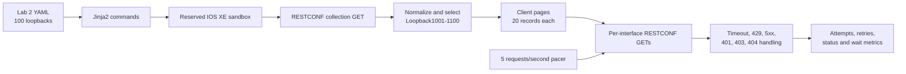

# Lab 3: RESTCONF Pagination and Resilient API Consumption

## Lab Introduction

Lab 2 proved that a Python application could collect IOS XE state through RESTCONF and transform YANG-modeled JSON into a table. Real applications must do more than complete one successful request. A response may contain more records than a person can inspect at once, clients must avoid overwhelming an API, and temporary network or server failures must not produce uncontrolled retries. At the same time, permanent failures such as invalid credentials require the program to stop instead of trying the same request repeatedly.

Lab 3 develops those operational behaviors against the same Cisco IOS XE reservable sandbox used in Lab 2. First, the Lab 2 source-of-truth workflow creates 100 dedicated loopback interfaces. The Lab 3 client then retrieves the RESTCONF interface collection, selects those 100 records, and presents five pages of 20 loopbacks. A second workflow performs individual list-entry requests at a controlled rate, making the cost of repeated API calls visible. Finally, the client is enhanced with bounded retries, backoff, `Retry-After` processing, status-aware flow control, and request metrics. An optional exercise investigates conditional HTTP requests with `ETag` and `Last-Modified` when the IOS XE server supplies those validators.

The pagination exercise makes an important standards distinction. RFC 8040 defines RESTCONF query parameters such as `content`, `depth`, and `fields`, but it does not define `limit` and `offset` list pagination. RESTCONF list-pagination work exists as an IETF Internet-Draft, and the IOS XE RESTCONF documentation used for this lab does not advertise that extension. Therefore, the primary exercise uses **client-side pagination** over one retrieved collection. It does not append unsupported parameters and claim that the device paginated the result.

## Learning Objectives

After completing this lab, you will be able to:

- Generate 100 loopback records for the Lab 2 YAML source of truth.
- Apply a large but controlled configuration through the reusable Lab 2 workflow.
- Explain the difference between server-side and client-side pagination.
- Divide 100 normalized RESTCONF records into pages of 20.
- Explain offset, page-number, and cursor pagination trade-offs.
- Protect an IOS XE management plane with proactive client-side request pacing.
- Interpret HTTP `429 Too Many Requests` and `Retry-After`.
- Distinguish retryable failures from unrecoverable request or authorization errors.
- Implement bounded retries with exponential backoff and jitter.
- Stop application flow safely after authentication or authorization failure.
- Continue collection when one interface disappears between index and detail requests.
- Record request attempts, retries, status codes, and deliberate pacing delay.
- Evaluate whether RESTCONF data can use HTTP conditional requests safely.

## Estimated Time

Allow approximately **3 to 4 hours**. Creating and verifying 100 interfaces can take several minutes because configuration and show-command processing are intentionally serialized in controlled batches.

## Prerequisites

Before beginning, confirm that:

- Lab 1 and Lab 2 are complete.
- The learner has an active IOS XE reservable sandbox.
- The VPN connection, when required, is active.
- The Lab 2 GitLab repository and local clone are available.
- The `ccnpauto` Python virtual environment is available.
- The learner can reach RESTCONF over HTTPS.
- The sandbox reservation has enough remaining time for the lab.

Do not save the 100 loopbacks to startup configuration. The interfaces exist only to create a predictable pagination dataset and should disappear when the sandbox resets.

## Lab Architecture



## Project Structure

```text
lab3-restconf-resilience/
├── .env.example
├── .gitignore
├── requirements.txt
├── scripts/
│   ├── cache_demo.py
│   ├── generate_lab2_loopbacks.py
│   ├── paginate_loopbacks.py
│   ├── rate_limited_details.py
│   └── resilient_loopbacks.py
└── src/
    ├── http_cache.py
    ├── interface_utils.py
    ├── pagination.py
    ├── rate_limiter.py
    ├── restconf_client.py
    └── settings.py
```

The class design remains close to the network tasks. `RESTCONFClient` represents a normal API session. `ResilientRESTCONFClient` inherits that session behavior and adds retries and counters. `Paginator` divides a list into pages, `RateLimiter` controls request timing, and `HTTPCache` stores HTTP validators. Interface normalization and table printing remain ordinary functions because they do not need object state. Each script surrounds these objects with `try/except` blocks so the operational response to a failure is easy to find.

## Task 1: Reconnect to the Reserved Sandbox

Open the DevNet reservation and confirm that it is still active. Reconnect the VPN if required, then verify HTTPS reachability using the host and port from the reservation:

```bash
nc -vz <IOSXE_HOST> <HTTPS_PORT>
```

Activate the course environment:

```bash
source "$HOME/.venvs/ccnpauto/bin/activate"
python --version
```

Open the Lab 2 project and confirm that it is on a clean `main` branch:

```bash
cd "$HOME/ccnpauto-workspace/lab2-iosxe-warmup"
git switch main
git pull --ff-only
git status
```

The Lab 2 `.env` file should still describe the active reserved sandbox. Leave `ALLOW_CONFIG_CHANGES=false` until immediately before the approved change.

## Task 2: Generate 100 Loopbacks Through the Lab 2 Source of Truth

Create a feature branch in the Lab 2 repository:

```bash
git switch -c feature/prepare-lab3-pagination
```

The Lab 3 generator creates Loopback1001 through Loopback1100 with addresses `198.18.0.1/32` through `198.18.0.100/32`. The `198.18.0.0/15` range is reserved for benchmark testing and avoids using real organizational addressing in this disposable environment.

Set the path to the course Lab 3 folder and run the generator from the Lab 2 project root:

```bash
LAB3_FILES="/path/to/CCNPAUTO/LAB/Lab3"
python "$LAB3_FILES/scripts/generate_lab2_loopbacks.py" \
  --output data/loopbacks.yaml \
  --count 100 \
  --start-id 1001 \
  --network 198.18.0.0/24
```

The generator uses a straightforward `for` loop to build 100 dictionaries and writes them as YAML. Validate the result with the Lab 2 validator:

```bash
python -m scripts.validate_source_of_truth
```

The expected message is:

```text
PASS: data/loopbacks.yaml contains 100 valid loopback(s).
```

Inspect a small sample rather than scrolling through the complete file:

```bash
python - <<'PY'
from pathlib import Path
from src.loopback_source import load_loopbacks

items = load_loopbacks(Path("data/loopbacks.yaml"))
print("Total:", len(items))
print("First:", items[0])
print("Last:", items[-1])
PY
```

Review the change:

```bash
git diff --stat
git diff -- data/loopbacks.yaml | sed -n '1,80p'
```

### Apply the Dataset

Confirm that the reservation belongs to the learner, then change the Lab 2 `.env` write gate temporarily:

```dotenv
SANDBOX_MODE=reserved
ALLOW_CONFIG_CHANGES=true
```

Apply the source of truth:

```bash
python -m scripts.apply_loopbacks
```

The enhanced Lab 2 script sends loopbacks in batches of 20. Batching avoids entering and leaving configuration mode 100 times while keeping each command group bounded. After configuration, the script retrieves `show ip interface brief` and verifies every Loopback ID, address, and up/up state.

Immediately return the write gate to its safe value:

```dotenv
ALLOW_CONFIG_CHANGES=false
```

If verification succeeds, commit and push the Lab 2 source-of-truth branch:

```bash
git add data/loopbacks.yaml
git commit -m "Create loopback dataset for RESTCONF pagination lab"
git push -u origin feature/prepare-lab3-pagination
```

Create and merge a GitLab merge request into `main`, then update the local clone:

```bash
git switch main
git pull --ff-only
git branch -d feature/prepare-lab3-pagination
```

## Task 3: Create the Lab 3 GitLab Repository

In the learner's local GitLab, create a private project named `lab3-restconf-resilience` and initialize it with a README. Clone it:

```bash
cd "$HOME/ccnpauto-workspace"
git clone http://gitlab.lab.local:8088/YOUR_USERNAME/lab3-restconf-resilience.git
cd lab3-restconf-resilience
```

Copy the Lab 3 files directly into the repository:

```bash
LAB3_FILES="/path/to/CCNPAUTO/LAB/Lab3"
cp "$LAB3_FILES/requirements.txt" "$LAB3_FILES/.env.example" \
  "$LAB3_FILES/.gitignore" .
cp -R "$LAB3_FILES/scripts" "$LAB3_FILES/src" .
tree -a -I '.git'
```

Commit the initial project:

```bash
git add .
git commit -m "Add RESTCONF resilience lab project"
git push origin main
```

## Task 4: Configure the Python Environment

Keep the Lab 1 virtual environment active and install missing packages:

```bash
source "$HOME/.venvs/ccnpauto/bin/activate"
python -m pip install -r requirements.txt
python -m pip check
```

Create the local environment file:

```bash
cp .env.example .env
chmod 600 .env
code .env
```

Enter the same HTTPS host, port, username, and password used in Lab 2. The initial operational settings are deliberately conservative:

```dotenv
REQUESTS_PER_SECOND=5
IOSXE_CONNECT_TIMEOUT=10
IOSXE_READ_TIMEOUT=45
IOSXE_MAX_RETRIES=3
```

Confirm that secrets remain ignored:

```bash
git check-ignore -v .env
```

## Task 5: Retrieve Five Pages of 20 Loopbacks

Pagination divides a large result set into bounded units. Common API designs include:

| Model | Client input | Strength | Weakness |
|---|---|---|---|
| Page number | `page=3&page_size=20` | Easy for people to understand | Inserts or deletions can shift later pages |
| Offset | `offset=40&limit=20` | Simple random access | Large offsets can be expensive and data can drift |
| Cursor | Opaque continuation token | Stable and efficient for changing datasets | Cannot usually jump directly to an arbitrary page |
| Client-side | Slice a retrieved collection | Works when the server lacks pagination | Does not reduce server payload or client memory |

The IOS XE exercise uses the last model. `paginate_loopbacks.py` sends one collection GET to:

```text
/restconf/data/Cisco-IOS-XE-interfaces-oper:interfaces
```

It normalizes the response, selects Loopback1001 through Loopback1100, sorts by numeric interface ID, and slices the in-memory list into pages.

Run it interactively:

```bash
python -m scripts.paginate_loopbacks
```

The program displays 20 interfaces and waits for Enter before showing the next page. Five pages should represent all 100 lab interfaces. To print continuously without prompts, use:

```bash
python -m scripts.paginate_loopbacks --page-size 20 --no-prompt
```

Try a different presentation size:

```bash
python -m scripts.paginate_loopbacks --page-size 25 --no-prompt
```

This produces four pages but still performs only one RESTCONF GET. Changing page size affects client presentation, not device workload.

### Why Unsupported Query Parameters Are Not Used

A URI such as `?limit=20&offset=0` is common in web APIs, but it is not part of RFC 8040. A server might reject unknown parameters with `400`, ignore them and return the full collection, or implement a vendor extension. Code must discover documented capability rather than infer support from a successful HTTP connection. As of this lab's publication, RESTCONF list pagination is still being developed by the IETF and must not be assumed on the IOS XE sandbox.

Client-side pagination has a consistency advantage: every displayed page comes from one response snapshot. However, it does not reduce response size, memory use, or device work. The next task intentionally performs multiple requests so rate protection becomes visible.

## Task 6: Apply a Client-Side Rate Limit

Rate limiting controls how quickly a consumer may call a provider. It protects CPU, session capacity, bandwidth, downstream systems, and fairness among consumers. APIs may enforce limits per credential, source address, tenant, method, or time window.

When a provider rejects excess traffic, HTTP `429 Too Many Requests` communicates the condition. The optional `Retry-After` response header tells the client how long to wait, expressed either as seconds or an HTTP date. A well-behaved client combines reactive handling of `429` with proactive request pacing so it does not create the overload in the first place.

The `RateLimiter` class stores the most recent request time and the total deliberate delay. Its `wait()` method calculates the minimum gap between requests. At five requests per second, each request begins at least 0.2 seconds after the previous request.

`rate_limited_details.py` first obtains the interface index. It then requests each list entry individually and prints a page after every 20 details. Run it:

```bash
python -m scripts.rate_limited_details
```

One hundred detail requests at five requests per second should require approximately 20 seconds, plus network and device processing. The summary reports:

- Number of detail requests
- Configured maximum request rate
- Total elapsed time
- Observed average request rate
- Time deliberately spent waiting

Reduce the rate to two requests per second in `.env` and repeat:

```dotenv
REQUESTS_PER_SECOND=2
```

The run should take close to 50 seconds. Restore the value to five afterward. Do not increase the rate to discover the sandbox's failure threshold. A shared training platform is not a load-testing target.

### Pagination and Rate Limiting Solve Different Problems

Pagination bounds how many records the application presents or requests in one logical page. Rate limiting bounds how quickly requests reach a provider. A page size of 20 does not mean 20 requests per second, and a five-request-per-second limit does not determine page size. Treat them as separate controls.

## Task 7: Add Error Handling and Controlled Flow

The `RESTCONFClient` class handles normal GET requests. `ResilientRESTCONFClient` inherits from it and replaces `get_json()` with a bounded retry loop. The shared connection behavior remains in the parent class, while the child class adds retry policy and counters. The loop is still visible in `src/restconf_client.py`, so learners can follow each decision.

| Condition | Retry the same request? | Application action |
|---|---|---|
| Connection reset or timeout | Yes, within a small bound | Back off, retry, then fail clearly |
| HTTP 429 | Yes, when delay is acceptable | Honor `Retry-After` or use backoff |
| HTTP 500/502/503/504 | Usually for idempotent GET | Exponential backoff with jitter |
| HTTP 400 | No | Correct request syntax or data |
| HTTP 401 | No | Stop and correct credentials |
| HTTP 403 | No | Stop and correct authorization |
| HTTP 404 collection path | No | Correct model or resource path |
| HTTP 404 one interface | Do not retry that item | Record disappearance and continue |
| Invalid JSON after HTTP success | No automatic retry by default | Preserve evidence and investigate |

### Bounded Exponential Backoff

For retryable failures, the client uses approximately:

```text
delay = min(8 seconds, 0.5 × 2^(attempt-1)) + random jitter
```

Jitter prevents many clients from retrying at exactly the same moment. `IOSXE_MAX_RETRIES=3` means at most four attempts: the original request plus three retries. The client retries only idempotent GET operations in this lab. Blindly retrying a POST or another non-idempotent operation could create duplicate state.

For `429`, a numeric `Retry-After` takes precedence over calculated backoff and is capped at 60 seconds. After the configured attempts are exhausted, the client raises `APIError`, which the script catches and reports.

### Run the Resilient Collector

```bash
python -m scripts.resilient_loopbacks
```

The client applies the same proactive pacing as Task 6 and prints metrics after collection. Under normal sandbox conditions, retries should remain zero.

Generate one safe, real `404` without changing the router:

```bash
python -m scripts.resilient_loopbacks --demo-not-found
```

The script requests a deliberately nonexistent `Loopback999999`. The client raises `NotFoundError`; an inner `except` block reports it and continues with the real collection. This demonstrates that “unrecoverable for one request” does not always mean “terminate the entire job.”

Authentication and authorization are different. If the collection receives `401` or `403`, the workflow stops immediately. Repeating invalid credentials can lock accounts, create audit noise, and never correct the cause.

### Optional Timeout Observation

To observe bounded transport handling, temporarily set a very small read timeout:

```dotenv
IOSXE_READ_TIMEOUT=0.001
IOSXE_MAX_RETRIES=2
```

Run the resilient collector once. Depending on local latency, it should print each retry and eventually raise a controlled `APIError`. Restore the normal values immediately:

```dotenv
IOSXE_READ_TIMEOUT=45
IOSXE_MAX_RETRIES=3
```

Do not remove timeouts entirely. A request without a timeout can wait indefinitely and hold worker, connection, and queue capacity.

## Task 8: Optional HTTP Conditional Request Exercise

HTTP caching must be approached carefully for network state. RFC 8040 says RESTCONF datastore contents change unpredictably, so responses generally should not be cached blindly. Servers must communicate cache policy through `Cache-Control`. Where a server maintains validators, clients can send `If-None-Match` with an `ETag` or `If-Modified-Since` with `Last-Modified`. An unchanged resource may return `304 Not Modified` without repeating the response body.

The optional script targets the **configuration** loopback resource rather than rapidly changing operational counters:

```text
/restconf/data/Cisco-IOS-XE-native:native/interface/Loopback?content=config
```

Run:

```bash
python -m scripts.cache_demo
python -m scripts.cache_demo
```

Interpret the result:

- If IOS XE returns `ETag` or `Last-Modified`, the first run stores the payload and validator under `.cache`.
- The second run sends the saved validator. If the resource is unchanged and the server supports the condition, it may return `304`.
- If the server returns `Cache-Control: no-store`, the script does not retain the payload.
- If no validator is present, the script reports that conditional caching is unavailable and does not invent one.
- If this IOS XE image does not expose the native configuration resource at that path, treat the resulting controlled error as “feature unavailable” and skip the optional task.

`Cache-Control: no-cache` does not mean “never store.” It means a stored representation must be revalidated before reuse. `no-store` prohibits storage. Even with validators, access-control changes can alter what a user is allowed to see without necessarily changing the underlying resource validator, so cache use must remain identity-aware.

## Task 9: Commit the Lab 3 Work

The supplied project contains no credentials or generated cache. Confirm ignored files:

```bash
git status --short --ignored
git check-ignore -v .env .cache/ artifacts/ || true
```

Commit any learner notes or deliberate code enhancements on a feature branch:

```bash
git switch -c feature/complete-restconf-resilience
git add .
git diff --staged
git commit -m "Complete RESTCONF pagination and resilience lab"
git push -u origin feature/complete-restconf-resilience
```

Create a GitLab merge request, review the diff for secrets, and merge it into `main`. This lab does not add a CI test stage; later labs will automate validation after the fundamental API behaviors are understood.

## Final Validation

Run the normal workflows with the safe settings restored:

```bash
source "$HOME/.venvs/ccnpauto/bin/activate"
python -m pip check
python -m scripts.paginate_loopbacks --page-size 20 --no-prompt
python -m scripts.rate_limited_details
python -m scripts.resilient_loopbacks --demo-not-found
```

Confirm that:

- Exactly 100 Lab 3 loopbacks are selected.
- Five pages contain 20 records each.
- The configured request rate is not exceeded.
- The controlled 404 does not terminate the valid collection.
- Normal collection completes with zero or a small bounded number of retries.
- `.env`, `.cache`, and artifacts remain outside Git.

## Expected Evidence

Retain evidence without passwords, tokens, or full unredacted payloads:

- Lab 2 source-of-truth count of 100 loopbacks
- Successful Lab 2 configuration verification
- Five pagination tables of 20 loopbacks
- Rate-limiter summary at five requests per second
- Optional comparison at two requests per second
- Controlled 404 output and continued collection
- Resilient-client attempt, retry, status, and pacing metrics
- Cache headers and `304` result, or evidence that validators were unavailable
- Clean Git status on the merged `main` branch

## Troubleshooting

### Fewer than 100 loopbacks are returned

Run the Lab 2 CLI collector and inspect the configured range:

```bash
cd "$HOME/ccnpauto-workspace/lab2-iosxe-warmup"
python -m scripts.collect_cli
```

Confirm that Loopback1001 through Loopback1100 exist. If the reservation reset after Task 2, reapply the Lab 2 source of truth to the new assigned instance.

### The generator overwrote earlier Lab 2 loopbacks

The Lab 3 preparation intentionally replaces `data/loopbacks.yaml` with the 100-interface dataset. Git preserves the earlier state on `main` and in history. If earlier loopbacks must remain, merge them into the generated list with unique IDs and addresses before validation.

### Individual interface GET returns 404

Confirm the interface name and IOS XE URI syntax. The client percent-encodes the list key and uses:

```text
.../interfaces/interface=Loopback1001
```

If the collection contains the interface but the list-instance resource is not exposed by that image, retain the client-side collection pagination task and ask the instructor before changing endpoints.

### Rate-limited collection is slower than expected

The configured rate is a maximum, not a performance guarantee. TLS processing, device response time, VPN latency, and printing add to the deliberate delay. The observed average should be at or below the configured maximum.

### HTTP 429 continues after retries

Do not raise the request rate. Reduce `REQUESTS_PER_SECOND`, wait for the provider window to recover, and honor `Retry-After`. A final `APIError` means the bounded retry loop stopped as designed.

### HTTP 401 or 403 stops the program

This is intentional. Correct the credentials or sandbox privileges. Do not add a loop that repeats the same rejected identity.

### Very small timeout does not fail

The response may be fast enough to finish inside the artificial timeout. The purpose is to understand bounded handling, not to force the sandbox to fail. Restore the normal timeout and inspect the implementation instead of generating load.

### Cache exercise never returns 304

The IOS XE resource may omit validators, change between requests, or decline conditional behavior. Conditional caching is optional in this lab. Read the returned `Cache-Control`, `ETag`, and `Last-Modified` values and document what the server actually supports.

## Cleanup and Reservation End

Leave `ALLOW_CONFIG_CHANGES=false` in the Lab 2 `.env`. Do not save the loopbacks to startup configuration. End the DevNet reservation normally; the sandbox reset removes the temporary interface dataset.

If the same reservation will be reused for another exercise, coordinate cleanup with the instructor rather than sending an unreviewed bulk deletion. The Lab 2 Git history identifies exactly which interfaces belong to the pagination dataset.

## Key Takeaways

- RESTCONF does not automatically imply server-side pagination; clients must use capabilities that the specific server documents.
- Client-side pagination improves presentation but does not reduce the original response size or server work.
- Page size and request rate are separate design controls.
- Proactive pacing protects the device, while `429` and `Retry-After` provide reactive provider feedback.
- Retries must be bounded and limited to operations that are safe to repeat.
- Exponential backoff and jitter reduce retry storms during shared failures.
- Authentication and authorization failures require corrected input, not repetition.
- A missing item may be skipped, while a missing collection path should stop the workflow.
- Request metrics make delay, retry, and status behavior observable.
- RESTCONF operational state should not be cached blindly; conditional requests are useful only when server policy and validators support them.

The next lab can extend this resilient client into concurrent and asynchronous workflows while preserving the rate, timeout, and failure boundaries established here.

## Further Reading and Official References

- [Cisco IOS XE RESTCONF configuration guide](https://www.cisco.com/c/en/us/td/docs/ios-xml/ios/prog/configuration/1713/b_1713_programmability_cg/m_1713_prog_restconf.html)
- [Cisco IOS XE programmability](https://developer.cisco.com/iosxe/)
- [RFC 8040: RESTCONF Protocol](https://www.rfc-editor.org/rfc/rfc8040)
- [IETF RESTCONF list-pagination Internet-Draft](https://datatracker.ietf.org/doc/draft-ietf-netconf-list-pagination-rc/)
- [RFC 6585: Additional HTTP Status Codes](https://www.rfc-editor.org/rfc/rfc6585)
- [RFC 9110: HTTP Semantics](https://www.rfc-editor.org/rfc/rfc9110)
- [RFC 9111: HTTP Caching](https://www.rfc-editor.org/rfc/rfc9111)
- [Requests documentation](https://requests.readthedocs.io/)
- [Python monotonic clock](https://docs.python.org/3/library/time.html#time.monotonic)
- [Cisco DevNet Sandbox documentation](https://developer.cisco.com/docs/sandbox/getting-started/)
