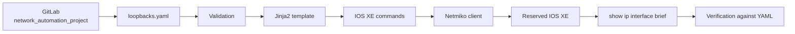

# Lab 3: Let's Start Your Network Automation Project

## Lab Introduction

Lab 2 confirmed that the workstation can retrieve Cisco sandbox IOS XE router information. Lab 3 now begins the durable project that learners will extend through Lab 8. Learners create a separate GitLab repository named `network_automation_project`, define one or more loopback interfaces in YAML, validate the data, render IOS XE commands with a Jinja2 template, configure a reserved router with Netmiko, and verify the resulting interface state.

This first version uses `data/loopbacks.yaml` as a small source of truth. Lab 4 will replace that file as the active data source with NetBox. Lab 5 will replace environment-file device credentials with Vault. Lab 6 will add NETCONF-based OSPF configuration, and Lab 7 will place the complete workflow into GitLab CI/CD.

## Learning Objectives

- Create the cumulative `network_automation_project` GitLab repository.
- Organize Python into reusable scripts and modules.
- Represent one or many loopback interfaces in YAML.
- Validate required fields, datatypes, addresses, and uniqueness.
- Use a loop inside a Jinja2 template.
- Preview configuration before sending it.
- Configure IOS XE with a small object-oriented Netmiko client.
- Verify intended IP addresses and operational state.
- Use a feature branch and merge request for source-of-truth changes.
- Explain the difference between repeatable commands and full reconciliation.

## Estimated Time

Allow approximately **3 hours**.

## Prerequisites

- Labs 1 and 2 completed
- GitLab.com learner account with SSH authentication configured in Lab 1
- Active IOS XE reservable sandbox and VPN
- Python virtual environment from Lab 1

The project still uses YAML rather than NetBox and does not require Vault, TIG, local YANG Suite, or GitLab Runner. Stop those services if they are running:

```bash
test -d "$HOME/lab-services/netbox-docker" && \
  (cd "$HOME/lab-services/netbox-docker" && docker compose stop)
test -d "$HOME/lab-services/tig" && \
  (cd "$HOME/lab-services/tig" && docker compose stop)
test -d "$HOME/lab-services/yangsuite/docker" && \
  (cd "$HOME/lab-services/yangsuite/docker" && docker compose stop)
sudo systemctl stop gitlab-runner
```

## Project Architecture


```mermaid
flowchart LR
    G["GitLab<br/>network_automation_project"] --> Y["loopbacks.yaml"]
    Y --> V["Validation"]
    V --> J["Jinja2 template"]
    J --> C["IOS XE commands"]
    C --> N["Netmiko client"]
    N --> R["Reserved IOS XE"]
    R --> S["show ip interface brief"]
    S --> Q["Verification against YAML"]
```

## Project Structure

```text
network_automation_project/
├── .env
├── .gitignore
├── requirements.txt
├── logs/
│   └── .gitkeep
├── data/
│   └── loopbacks.yaml
├── inventory/
│   └── devices.yaml
├── scripts/
│   ├── __init__.py
│   ├── apply_loopbacks.py
│   ├── preview_loopbacks.py
│   └── validate_source_of_truth.py
├── src/
│   ├── __init__.py
│   ├── iosxe_cli.py
│   ├── logging_config.py
│   ├── loopback_source.py
│   ├── reporting.py
│   └── settings.py
└── templates/
    └── loopback.j2
```

## Diagnostic Logging Used Throughout the Project

This lab introduces the shared logging component that remains in the cumulative project through Lab 13. Each executable Python script initializes logging before it reads intent or contacts a device. Console messages remain concise at `INFO` level, while optional file logging preserves detailed `DEBUG` evidence for study and troubleshooting.

Retain these controls in the existing `.env` file:

```text
ENABLE_FILE_LOGGING=false
ENABLE_CONSOLE_LOGGING=true
LOG_LEVEL=DEBUG
LOG_CONSOLE_LEVEL=INFO
LOG_DIR=logs
```

Set `ENABLE_FILE_LOGGING=true` when detailed evidence is required. Every invocation creates a separate text file, such as `logs/apply_loopbacks_20260726_143512_382104.log`. The timestamp includes microseconds, so rerunning a script does not overwrite earlier evidence. A record can include the application, module, function, source line, severity, decision, operation, elapsed time, and exception stack.

Passwords and tokens must never be passed deliberately to a logging call. The supplied redaction filter provides an additional safeguard for secret values loaded from environment variables. The `logs/.gitkeep` file preserves the directory, while `.gitignore` prevents generated logs from entering source control.

## Task 1: Create the Main GitLab Repository

In [GitLab.com](https://gitlab.com), create a blank private project in your personal namespace:

- Project name: `network_automation_project`
- Project slug: `network_automation_project`
- Default branch: `main`
- Do not initialize with a README

Before the first push, disable GitLab's automatically generated pipeline for this project:

1. Open `network_automation_project` in GitLab.
2. Select **Settings > CI/CD**.
3. Expand **Auto DevOps**.
4. Clear **Default to Auto DevOps pipeline**.
5. Select **Save changes**.

Do not disable the entire CI/CD project feature. Lab 7 will add the project's intentional `.gitlab-ci.yml`; only Auto DevOps should be disabled. Without this change, GitLab can synthesize build, code-quality, container-scanning, secret-detection, and SAST jobs even though the repository has no CI file.

Clone it:

```bash
cd ~/ccnpauto-workspace
git clone \
  git@gitlab.com:YOUR_USERNAME/network_automation_project.git
cd network_automation_project
```

This repository is separate from `lab2_warm_up` and becomes the only repository extended in Labs 4–8.

## Task 2: Copy the Baseline Project

Using the VS Code Explorer, copy and paste `.env`, `.gitignore`, `requirements.txt`, `data/`, `inventory/`, `logs/`, `scripts/`, `src/`, and `templates/` from `CCNPAUTO/LAB/Lab3/` into the root of `network_automation_project/`. Preserve the supplied hierarchy and use these same files throughout Labs 3–13.

```bash
tree -a -I '.git'
```

Install dependencies:

```bash
source ~/.venvs/ccnpauto/bin/activate
python -m pip install -r requirements.txt
python -m pip check
```

The baseline YAML intentionally contains an empty list. Commit the reusable framework before defining a device change:

```bash
git add .
git commit -m "Initialize network automation project"
git push -u origin main
```

## Task 3: Configure the Reserved Router Connection

Open the existing `.env` file, enter the current reservation values, save it, and restrict its permissions:

```bash
chmod 600 .env
```

Confirm `.env` is ignored:

```bash
git check-ignore -v .env
```

Before running a configuration script, confirm in the Cisco DevNet portal that the reservation belongs to you and that its host, ports, and credentials match `.env`.

## Task 4: Create a Feature Branch for Loopback Intent

```bash
git switch -c feature/add-loopbacks
```

Edit `data/loopbacks.yaml`. One loopback uses:

```yaml
---
loopbacks:
  - id: 101
    description: MANAGED_BY_NETWORK_AUTOMATION_PROJECT
    ipv4: 192.0.2.101
    prefix_length: 32
    enabled: true
```

Several loopbacks use the same list:

```yaml
---
loopbacks:
  - id: 101
    description: MANAGED_BY_NETWORK_AUTOMATION_PROJECT
    ipv4: 192.0.2.101
    prefix_length: 32
    enabled: true
  - id: 102
    description: MANAGED_BY_NETWORK_AUTOMATION_PROJECT
    ipv4: 192.0.2.102
    prefix_length: 32
    enabled: true
```

Use only instructor-approved IDs and documentation addresses. Do not overwrite an existing sandbox interface.

## Task 5: Validate the YAML Contract

Run:

```bash
python -m scripts.validate_source_of_truth
```

Each item must contain exactly:

- `id`: non-negative integer;
- `description`: nonempty, single-line string;
- `ipv4`: valid IPv4 address;
- `prefix_length`: integer;
- `enabled`: Boolean.

The loader also rejects duplicate IDs and duplicate addresses. Correct source data rather than bypassing validation.

## Task 6: Preview the Jinja2 Output

```bash
python -m scripts.preview_loopbacks
```

The template, not Python, contains the loop:

```jinja2

interface Loopback{{ loopback.id }}
 description {{ loopback.description }}
 ip address {{ loopback.ipv4 }} {{ loopback.netmask }}

 no shutdown

 shutdown


```

Python loads and validates the list once. Jinja2 repeats the interface stanza for every item.

## Task 7: Review the Reusable Classes

`LoopbackManager` owns source loading, validation, address normalization, and rendering. `IOSXEDevice` owns connection lifecycle, parsed operational commands, and configuration transport. `reporting.py` owns table presentation.

This separation matters in Lab 4: NetBox will replace the YAML loader, while the template and device adapter remain useful.

## Task 8: Apply and Verify the Loopbacks

Review the preview carefully, confirm that the private reservation is active, and then run:

```bash
python -m scripts.apply_loopbacks
```

The script:

1. checks the write boundary;
2. validates YAML;
3. connects once with Netmiko;
4. displays interface state before the change;
5. renders and sends commands;
6. retrieves interface state again; and
7. verifies every intended interface and address.

Run it a second time. Reapplying the same interface commands should not create duplicate interfaces or change the intended result. This is operationally repeatable, but it is not complete reconciliation: interfaces omitted from YAML are not deleted automatically.

For a diagnostic run, set `ENABLE_FILE_LOGGING=true` in `.env`, run the command again, and open the newest `logs/apply_loopbacks_*.log` file in VS Code. Confirm that another execution creates a different filename and that no password appears in either file. Return the setting to `false` when continuous debug files are not required.

## Task 9: Commit Through a Merge Request

```bash
git diff
git add data/loopbacks.yaml
git commit -m "Define managed loopback interfaces"
git push -u origin feature/add-loopbacks
```

Create a merge request into `main`. Include:

- intended interface IDs and addresses;
- validation result;
- rendered-command review;
- verification result;
- rollback command such as `no interface Loopback101`.

Merge after review, then synchronize:

```bash
git switch main
git pull --ff-only
git branch -d feature/add-loopbacks
```

## Task 10: Establish the Project Baseline

Confirm:

```bash
git status --short
git log --oneline --graph --decorate --all
python -m scripts.validate_source_of_truth
```

The repository now contains the first version of the cumulative automation project. `.env` remains local and untracked.

## Troubleshooting

| Symptom | Likely cause | Action |
|---|---|---|
| Validation reports empty list | No loopback was added on the feature branch | Add at least one complete YAML item |
| YAML parser error | Indentation or syntax problem | Correct spacing and list markers |
| TextFSM returns raw text | Missing or incompatible `ntc-templates` | Reinstall requirements and inspect release support |
| SSH timeout | VPN, hostname, port, or reservation expired | Test reachability and reservation details |
| Verification finds wrong address | Existing interface conflict or unintended state | Stop and compare YAML with router configuration |
| A pipeline appears without `.gitlab-ci.yml` | Auto DevOps is enabled for the project, group, or instance | Disable Auto DevOps under **Settings > CI/CD**, then cancel the generated pipeline |
| Auto DevOps jobs remain pending | No runner is eligible for the generated jobs | Cancel them; Lab 3 does not require a runner, and Lab 7 registers the intended runner |

## Key Takeaways

- `network_automation_project` begins in Lab 3 and continues through Lab 8.
- YAML provides a simple first source of truth for one or many loopbacks.
- Validation and preview happen before device access.
- Jinja2 owns iteration and separates intent from IOS XE syntax.
- Reusable modules allow later labs to replace one concern at a time.
- Git branches and merge requests make network intent reviewable.

Lab 4 moves the loopback source of truth from YAML to NetBox while retaining this project's normalized contract, template, device adapter, and verification logic.

## References

- [Jinja documentation](https://jinja.palletsprojects.com/)
- [PyYAML documentation](https://pyyaml.org/wiki/PyYAMLDocumentation)
- [Netmiko documentation](https://ktbyers.github.io/netmiko/docs/netmiko/)
- [GitLab merge requests](https://docs.gitlab.com/user/project/merge_requests/)
