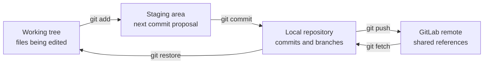

# Lab 4: Git from Fundamentals to Advanced Operations

## Lab Introduction

Network automation turns configuration, inventory, policy, templates, and validation logic into software artifacts. Once these artifacts influence production devices, engineers need to know who changed them, why they changed, how competing work was combined, and how a defective change can be traced or reversed. Git provides that history locally, while GitLab adds controlled collaboration through protected branches, merge requests, review, and release metadata.

This lab develops Git skills in layers. Learners first work with the working tree, staging area, commits, branches, and remotes. They then resolve a realistic inventory conflict and use GitLab for review. The later tasks introduce stash, revert, reset, rebase, cherry-pick, tags, bisect, reflog, worktrees, and a local validation hook. All potentially destructive operations remain inside a disposable training repository.

## Learning Objectives

After completing this lab, you will be able to:

- Explain Git's working tree, staging area, local repository, and remote repository.
- Configure identity, default-branch, line-ending, and pull behavior.
- Create focused commits and inspect differences at each Git layer.
- Create, switch, merge, rename, and delete branches.
- Resolve a merge conflict without discarding valid intent.
- Connect a local repository to GitLab and use merge requests.
- Use `.gitignore` without treating it as a secret-management control.
- Temporarily preserve unfinished work with stash.
- Select correctly among `restore`, `reset`, `revert`, and `reflog`.
- Reorganize private history with interactive rebase.
- Apply a selected commit with cherry-pick.
- Mark releases with annotated tags.
- Locate a regression with binary search through `git bisect`.
- Recover apparently lost work with reflog.
- Work on two branches simultaneously with worktrees.
- Add a local pre-commit validation hook.
- Interpret commit graphs, authorship, ancestry, and line history.

## Estimated Time

Allow approximately **4 to 6 hours**. The lab may be divided into a fundamentals session and an advanced-operations session.

## Prerequisites

- Ubuntu 26.04 workstation prepared in Lab 1
- Git and VS Code
- Local GitLab available at `http://gitlab.lab.local:8088`
- A normal GitLab learner account and personal access token
- The `ccnpauto` Python virtual environment
- PyYAML and Tabulate, installed from the supplied requirements file if missing

Lab 4 does not require a Cisco sandbox. The inventory uses documentation addresses and does not connect to devices.

## Git Data Flow



Git does not continuously save every edit. Instead, the working tree contains current files, while the staging area holds the exact snapshot proposed for the next commit. A commit records that staged snapshot and points to its parent commit. Branch names are movable references to commits, and remote-tracking names such as `origin/main` record the last fetched view of the remote.

## Task 1: Verify Git and Configure the Learner Identity

Confirm the installation:

```bash
git --version
git config --list --show-origin
```

Configure a real learner identity. These values become commit metadata and should identify the author rather than the workstation:

```bash
git config --global user.name "YOUR FULL NAME"
git config --global user.email "YOUR_GITLAB_EMAIL"
git config --global init.defaultBranch main
git config --global core.autocrlf input
git config --global pull.ff only
git config --global fetch.prune true
```

`pull.ff only` prevents an accidental merge commit during a routine pull. When histories have diverged, Git stops and requires the learner to choose a merge or rebase deliberately. `fetch.prune` removes stale remote-tracking references after their remote branches are deleted; it does not delete local branches.

Verify the effective values:

```bash
git config --global --get-regexp '^(user|init|core.autocrlf|pull|fetch)\.'
```

## Task 2: Create the Local Repository

Create the project and copy the supplied files:

```bash
mkdir -p "$HOME/ccnpauto-workspace/lab4-git-workflow"
cd "$HOME/ccnpauto-workspace/lab4-git-workflow"

LAB4_FILES="/path/to/CCNPAUTO/LAB/Lab4/files"
cp "$LAB4_FILES/network_inventory.yaml" .
cp "$LAB4_FILES/render_inventory.py" .
cp "$LAB4_FILES/requirements.txt" .
cp "$LAB4_FILES/gitignore.txt" .gitignore

git init
git status
```

Activate the course environment and install missing dependencies:

```bash
source "$HOME/.venvs/ccnpauto/bin/activate"
python -m pip install -r requirements.txt
python render_inventory.py
```

Before the first commit, inspect untracked files and ignore rules:

```bash
git status --short
git check-ignore -v .env || true
```

`.gitignore` prevents normal accidental staging, but it does not encrypt a secret or remove a secret already committed. Credentials belong in Vault, protected CI variables, or another approved secret store.

## Task 3: Build the First Commit

Stage only the inventory and inspect the proposed commit:

```bash
git add network_inventory.yaml
git status
git diff
git diff --staged
```

`git diff` compares the working tree with the staging area. At this point it is empty because the inventory is already staged. `git diff --staged` compares the staging area with the current commit and displays the file that will enter history.

Commit the inventory:

```bash
git commit -m "Add initial IOS XE inventory"
```

Stage and commit the application separately:

```bash
git add render_inventory.py requirements.txt .gitignore
git commit -m "Add inventory table renderer"
git status
```

Two focused commits preserve the reason for each change more clearly than one commit named “initial files.” Inspect the history:

```bash
git log --oneline --decorate
git show --stat HEAD
git show HEAD:network_inventory.yaml
```

## Task 4: Examine Git Objects and References

Display the commit graph and resolve symbolic names:

```bash
git log --graph --oneline --decorate --all
git rev-parse HEAD
git rev-parse main
git cat-file -t HEAD
git cat-file -p HEAD
```

The commit object contains a tree identifier, parent identifier, author, committer, timestamps, and message. The tree identifies the repository snapshot. Git content is addressed by hashes, while names such as `main` make those hashes usable by people.

## Task 5: Develop on a Feature Branch

Create a branch for a new distribution switch:

```bash
git switch -c feature/add-distribution-switch
git branch --show-current
git branch -vv
```

Open `network_inventory.yaml` and append this record beneath the existing list:

```yaml
  - hostname: campus-dist1
    platform: iosxe
    role: distribution-switch
    management_ip: 192.0.2.30
```

Review and commit the change:

```bash
python render_inventory.py
git diff --check
git diff -- network_inventory.yaml
git add network_inventory.yaml
git commit -m "Add campus distribution switch"
```

Return to `main` and observe that the new record disappears because the working tree now represents another commit:

```bash
git switch main
python render_inventory.py
git merge --no-ff feature/add-distribution-switch \
  -m "Merge distribution switch inventory"
git log --graph --oneline --decorate --all
```

The explicit `--no-ff` creates a merge commit even though a fast-forward was possible. This makes the feature boundary visible for teaching. Teams may instead prefer fast-forward or squash policies.

## Task 6: Create and Resolve a Merge Conflict

Conflicts occur when Git cannot combine changes automatically. They are not necessarily mistakes; they indicate that human intent is required.

Create two branches from the same starting point:

```bash
git switch -c feature/rename-branch-role
```

On this feature branch, change the role of `branch-r1` from `branch-router` to `wan-edge-router`, then commit:

```bash
git add network_inventory.yaml
git commit -m "Classify branch router as WAN edge"
git switch main
git switch -c fix/standardize-router-role
```

On the fix branch, change the same value from `branch-router` to `site-edge-router`, commit it, and merge the fix into `main`:

```bash
git add network_inventory.yaml
git commit -m "Standardize branch router role"
git switch main
git merge --no-ff fix/standardize-router-role \
  -m "Merge router role standardization"
```

Now merge the feature branch:

```bash
git merge feature/rename-branch-role
git status
git diff --name-only --diff-filter=U
```

Open the conflicted YAML. Git marks the competing regions with `<<<<<<<`, `=======`, and `>>>>>>>`. Discuss the intended taxonomy and select one agreed value, such as `wan-edge-router`. Remove every conflict marker, validate the application, and complete the merge:

```bash
python render_inventory.py
git diff --check
git add network_inventory.yaml
git commit
git log --graph --oneline --decorate --all
```

Use `git merge --abort` only when the merge should be abandoned completely. Do not solve conflicts by automatically choosing “ours” or “theirs” without understanding which operational intent each side represents.

## Task 7: Publish the Repository to GitLab

Sign in with the learner account and create a blank private project named `lab4-git-workflow`. Do not initialize it with a README. Copy the exact **Clone with HTTP** URL, then configure the remote:

```bash
git remote add origin \
  http://gitlab.lab.local:8088/ACTUAL_USERNAME/lab4-git-workflow.git
git remote -v
git push -u origin main
```

When prompted, use the learner username and a personal access token with repository-write permission. Never embed the token in the remote URL.

Publish the feature branches for comparison:

```bash
git push -u origin feature/rename-branch-role
git push -u origin feature/add-distribution-switch
git branch -r
```

`origin` is only a conventional remote name. `origin/main` is a local remote-tracking reference; it is updated by fetch and push and is not the remote branch itself.

## Task 8: Use a Merge Request Workflow

Create a branch for a wireless controller record:

```bash
git switch main
git pull --ff-only
git switch -c feature/add-wireless-controller
```

Add the following record:

```yaml
  - hostname: campus-wlc1
    platform: iosxe
    role: wireless-controller
    management_ip: 192.0.2.40
```

Validate, commit, and push:

```bash
python render_inventory.py
git add network_inventory.yaml
git commit -m "Add campus wireless controller"
git push -u origin feature/add-wireless-controller
```

Create a GitLab merge request into `main`. Review the diff, commit message, and absence of secrets before merging. Then synchronize locally:

```bash
git switch main
git pull --ff-only
git fetch --prune
git branch -d feature/add-wireless-controller
```

If GitLab deleted the remote feature branch, pruning removes the stale `origin/feature/add-wireless-controller` reference.

## Task 9: Preserve Unfinished Work with Stash

Begin editing `render_inventory.py` by changing a table heading, but do not commit. Add an untracked notes file named `design-notes.md`, then inspect the state:

```bash
git status --short
git stash push -u -m "WIP: improve inventory headings"
git status
git stash list
git stash show --patch stash@{0}
```

The `-u` option includes untracked files. Switch branches or inspect an urgent issue, then restore the work:

```bash
git stash apply stash@{0}
git status --short
git stash drop stash@{0}
```

`apply` preserves the stash until it is explicitly dropped, which is safer while learning than `pop`. A stash is local and temporary; it is not a substitute for a meaningful commit when work must be shared or retained.

Discard the experimental edits before continuing:

```bash
git restore render_inventory.py
rm design-notes.md
```

## Task 10: Undo Changes at the Correct Layer

Git offers several undo mechanisms because “undo” can mean different things.

Modify `network_inventory.yaml` without staging it, inspect the diff, and discard only that working-tree edit:

```bash
git diff
git restore network_inventory.yaml
```

Modify it again and stage it. Remove it from the next commit while preserving the working-tree edit:

```bash
git add network_inventory.yaml
git restore --staged network_inventory.yaml
git status --short
git restore network_inventory.yaml
```

Create a harmless commit on a temporary branch and reverse it with a new commit:

```bash
git switch -c exercise/revert-change
```

Change one role description, commit it, and then run:

```bash
git revert HEAD
git log --oneline -3
```

`revert` preserves shared history and records an explicit inverse change, making it the usual choice for a defective commit already pushed to a team branch.

Now create another harmless local commit and compare reset modes in this disposable branch:

```bash
git reset --soft HEAD~1
git status --short
git commit -m "Recreate temporary role edit"
git reset --mixed HEAD~1
git status --short
git restore network_inventory.yaml
```

`--soft` moves the branch while leaving changes staged. The default mixed reset leaves changes unstaged. A hard reset also overwrites tracked working-tree content and is intentionally omitted from the normal workflow. Never rewrite a shared branch merely to make its history look cleaner.

Return to the main branch:

```bash
git switch main
```

## Task 11: Create an Annotated Release Tag

Tags give a stable name to an important commit. Create an annotated tag for the validated inventory baseline:

```bash
git tag -a v1.0.0 -m "Validated inventory baseline"
git show v1.0.0
git push origin v1.0.0
git ls-remote --tags origin
```

An annotated tag stores a tagger, date, message, and target. In a mature release workflow, signed tags and protected release rules can provide stronger provenance.

## Task 12: Reorganize Private History with Interactive Rebase

Rebase changes commit ancestry and therefore commit hashes. Use it only on a private feature branch whose published history other people do not depend on.

Create three small commits:

```bash
git switch -c feature/inventory-documentation
```

Create `INVENTORY.md` with a brief purpose statement and commit it. Add a field-description section and commit again. Correct a typo and make a third commit. Then inspect and reorganize the last three commits:

```bash
git log --oneline -4
git rebase -i HEAD~3
```

In the editor, leave the first line as `pick`, change the second to `reword`, and change the typo-fix commit to `fixup`. Save, provide the improved message, and inspect the result:

```bash
git log --oneline --decorate -4
git reflog -6
```

If a private branch had already been pushed, update it with:

```bash
git push --force-with-lease origin feature/inventory-documentation
```

`--force-with-lease` refuses to overwrite remote work that the local repository has not observed. It is safer than `--force`, although branch protection may correctly prohibit both.

## Task 13: Apply a Selected Fix with Cherry-Pick

Create a maintenance branch from `v1.0.0`:

```bash
git switch -c maintenance/v1.0 v1.0.0
```

On `main`, create a small independent fix to `render_inventory.py`, commit it, and copy its hash:

```bash
git switch main
# Make and validate one small renderer correction.
git add render_inventory.py
git commit -m "Correct inventory table heading"
FIX_COMMIT=$(git rev-parse HEAD)
echo "$FIX_COMMIT"
```

Apply only that fix to the maintenance line:

```bash
git switch maintenance/v1.0
git cherry-pick "$FIX_COMMIT"
git log --oneline --decorate -3
```

Cherry-pick creates a new commit with a new hash because its parent differs. It is useful for targeted backports, but routinely copying commits among long-lived branches can make history difficult to reason about.

## Task 14: Locate a Regression with Git Bisect

Return to `main` and create a short controlled history in which one commit breaks the renderer. For example, make several valid documentation commits, then change `devices = data.get("devices", [])` to use the incorrect key `device`, commit the defect, and add two more harmless commits.

Confirm the current command fails or produces an empty inventory, then identify the known good tag and bad current commit:

```bash
git switch main
git bisect start
git bisect bad HEAD
git bisect good v1.0.0
```

At each selected commit, run:

```bash
python render_inventory.py
```

Mark a correct result with `git bisect good` and a defective result with `git bisect bad`. Git repeatedly halves the search space until it identifies the first bad commit. Finish by restoring the original branch position:

```bash
git bisect reset
```

For automation, a command returning zero for success and nonzero for failure can drive the search:

```bash
git bisect start HEAD v1.0.0
git bisect run python render_inventory.py
git bisect reset
```

## Task 15: Recover Work with Reflog

Reflog records where local references and `HEAD` have recently pointed. Create a disposable commit, record its short hash, and move the branch back one commit:

```bash
git switch -c exercise/reflog-recovery main
# Create and commit a harmless RECOVERY.md file.
git log --oneline -2
git reset --mixed HEAD~1
git restore .
rm -f RECOVERY.md
git status
git reflog -8
```

Find the lost commit in the reflog and preserve it with a new branch:

```bash
git branch recovered-work LOST_COMMIT_HASH
git show --stat recovered-work
```

Reflog is local and expires eventually. It is an excellent recovery tool, but it is not a remote backup or a reason to use destructive commands casually.

## Task 16: Work on Two Branches with Git Worktree

A worktree provides another directory attached to the same repository, allowing two branches to be checked out simultaneously:

```bash
git switch main
git worktree add ../lab4-maintenance maintenance/v1.0
git worktree list
```

The original directory remains on `main`, while `../lab4-maintenance` contains the maintenance branch. Inspect and validate both without repeatedly switching:

```bash
git -C ../lab4-maintenance status
git -C ../lab4-maintenance log --oneline -3
(cd ../lab4-maintenance && python render_inventory.py)
```

Run the Python command from the worktree directory if relative inventory lookup requires it. When finished:

```bash
git worktree remove ../lab4-maintenance
git worktree prune
```

Worktrees are useful when an urgent production fix interrupts feature development, but one branch cannot be checked out in two worktrees simultaneously.

## Task 17: Add a Local Pre-Commit Hook

Git hooks can prevent an invalid YAML file from entering local history. Create `.git/hooks/pre-commit` with this content:

```bash
#!/usr/bin/env bash
set -e

python - <<'PY'
from pathlib import Path
import yaml

data = yaml.safe_load(Path("network_inventory.yaml").read_text())
devices = data.get("devices", [])
names = [device["hostname"] for device in devices]

if len(names) != len(set(names)):
    raise SystemExit("Duplicate hostnames are not allowed")

print(f"Validated {len(devices)} inventory records")
PY
```

Make it executable:

```bash
chmod +x .git/hooks/pre-commit
```

Introduce a duplicate hostname, stage the YAML, and attempt a commit. The hook should reject it. Correct the data and commit successfully.

Hooks under `.git/hooks` are not committed, so they do not provide centralized enforcement. A production project should place the validation in GitLab CI and may use a framework that installs version-controlled hook definitions.

## Task 18: Investigate History Efficiently

Use Git's inspection tools to answer operational questions:

```bash
git log --graph --oneline --decorate --all
git log -- network_inventory.yaml
git log -p -- network_inventory.yaml
git blame network_inventory.yaml
git show v1.0.0:network_inventory.yaml
git diff v1.0.0..main -- network_inventory.yaml
git branch --merged main
git branch --no-merged main
git merge-base main maintenance/v1.0
```

`blame` identifies the last commit that changed each line; it does not establish personal fault. Follow the commit into its review and operational context before drawing conclusions.

## Task 19: Clean Up Branches Safely

List merged branches before deleting anything:

```bash
git switch main
git fetch --prune
git branch --merged main
```

Delete only branches whose work is merged or intentionally disposable:

```bash
git branch -d feature/add-distribution-switch
git branch -d fix/standardize-router-role
```

Git refuses `-d` when commits would become unreferenced. The uppercase `-D` bypasses that safety check and should be reserved for deliberately abandoned work after reviewing the branch and reflog.

## Final Validation

Confirm the repository and remote are coherent:

```bash
git status
git remote -v
git branch -vv
git tag --list
git log --graph --oneline --decorate --all --max-count=25
python render_inventory.py
```

The working tree should be clean. The graph should show feature, merge, rebase, cherry-pick, tag, and recovery activity produced during the exercises. Exact hashes will differ because commit content, authors, parents, and timestamps differ.

## Expected Evidence

- Git identity and configuration output
- Focused initial commits
- Feature branch and merge graph
- Resolved YAML merge conflict
- GitLab project and merged merge request
- Stash creation and restoration
- Revert commit and reset comparison
- Annotated `v1.0.0` tag
- Interactive rebase result
- Cherry-picked maintenance fix
- Bisect identification of the first defective commit
- Reflog recovery branch
- Worktree listing
- Rejected invalid commit from the pre-commit hook
- Clean final working tree

## Troubleshooting

### Git reports “Author identity unknown”

Set `user.name` and `user.email`, then retry the commit. Do not use `sudo git`, because root has a different home directory and Git configuration.

### Push redirects to `/users/sign_in`

Copy the exact HTTP clone URL from the project. A guessed namespace—especially `/admin`—may address a web route rather than the repository. Use the learner username and a personal access token when prompted.

### Pull refuses because fast-forward is impossible

This is the intended effect of `pull.ff only`. Run `git fetch`, inspect `git log --graph --oneline --all`, and choose a merge or rebase based on team policy rather than creating an accidental merge.

### A conflict remains after editing

Search for conflict markers and inspect unmerged paths:

```bash
rg -n '^(<<<<<<<|=======|>>>>>>>)' .
git diff --name-only --diff-filter=U
```

After resolving and validating the file, stage it to mark the conflict resolved.

### Rebase or cherry-pick stops on a conflict

Resolve the file, stage it, and continue with `git rebase --continue` or `git cherry-pick --continue`. Use the corresponding `--abort` command to restore the pre-operation state when continuation is inappropriate.

### A commit appears to be lost

Stop changing references and inspect `git reflog`. Preserve the desired hash immediately with `git branch recovery HASH` before performing more cleanup.

## Key Takeaways

- Git records snapshots through a deliberate working-tree, staging, and commit workflow.
- Small commits with clear intent are easier to review, test, revert, and reuse.
- Branches are lightweight commit references, while merges record combined ancestry.
- Conflicts require design judgment, not merely removal of marker lines.
- Merge requests add review and policy around Git's distributed history.
- `restore`, `reset`, `revert`, and reflog solve different recovery problems.
- Rebase is appropriate for reorganizing private work but dangerous on shared history.
- Cherry-pick copies a selected change; tags identify release points.
- Bisect turns regression search into a logarithmic process.
- Worktrees support simultaneous maintenance and feature work.
- Local hooks provide fast feedback, while CI must enforce shared validation.

The next lab can build on this disciplined history by introducing automated testing and GitLab CI/CD gates, so every proposed network automation change is validated before merge.

## Further Reading

- [Pro Git book](https://git-scm.com/book/en/v2)
- [Git reference documentation](https://git-scm.com/docs)
- [Git branching and merging](https://git-scm.com/about/branching-and-merging)
- [GitLab merge requests](https://docs.gitlab.com/user/project/merge_requests/)
- [GitLab protected branches](https://docs.gitlab.com/user/project/repository/branches/protected/)
- [Git hooks](https://git-scm.com/docs/githooks)
