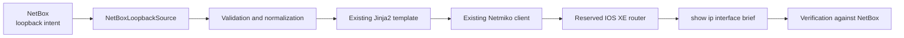

# Lab 4: Move the Source of Truth to NetBox

## Lab Introduction

Lab 3 stored intent for loopback management in `data/loopbacks.yaml`. That approach made the first automation workflow easy to understand, but a flat file provides few relationships, limited search, and no built-in API or object history. In this lab, learners keep the same `network_automation_project` repository and move the authoritative loopback data to NetBox.

NetBox will model the Cisco IOS XE sandbox as a device. Each managed loopback will be a virtual interface with exactly one IPv4 `/32` address and the tag `automation-managed`. The Python project will query those objects through the NetBox REST API, validate them, render the existing Jinja2 template, configure Cisco IOS XE router with the existing Netmiko class, and verify the result.

The YAML file remains in Git as evidence of Lab 3, but it is no longer the active source of truth after this lab.

## Learning Objectives

- Explain why NetBox is more suitable than a flat YAML file for shared network intent.
- Model a router, virtual interfaces, tags, and IP assignments in NetBox.
- Create a restricted NetBox API token.
- Retrieve and validate loopback intent with `pynetbox`.
- Reuse the existing Jinja2 and Netmiko workflow.

## Prerequisites

- Labs 1–3 completed
- NetBox installed and running from the updated Lab 1
- Active Cisco IOS XE reservable sandbox and VPN connection
- Existing local clone at `~/ccnpauto-workspace/network_automation_project`
- Loopback automation from Lab 3 working successfully

## Cumulative Architecture



## Task 1: Continue the Existing Repository

Do not create another GitLab.com project. Update the existing clone and create a focused branch:

```bash
cd ~/ccnpauto-workspace/network_automation_project
git switch main
git pull --ff-only
git switch -c feature/netbox-source-of-truth
```

Copy the Lab 4 additions into the existing repository:

```bash
LAB4_FILES="/path/to/CCNPAUTO/LAB/Lab4"
cp "$LAB4_FILES/requirements-additions.txt" .
cp "$LAB4_FILES/src/netbox_source.py" "$LAB4_FILES/src/loopback_renderer.py" src/
cp "$LAB4_FILES/scripts/validate_netbox.py" \
  "$LAB4_FILES/scripts/sync_loopbacks_from_netbox.py" scripts/
python -m pip install -r requirements-additions.txt
```

Add `pynetbox>=7.4,<8` to the main `requirements.txt` so later CI jobs install the complete dependency set.

## Task 2: Start and Verify NetBox

Start the NetBox Docker Compose project installed in Lab 1:

```bash
cd ~/lab-services/netbox-docker
docker compose up -d
docker compose ps
curl -I http://127.0.0.1:8000
```

Open `http://127.0.0.1:8000` and sign in with the administrator created in Lab 1.

## Task 3: Model the Cisco IOS XE Sandbox Router

NetBox objects depend on one another. A device requires a device type, role, and site, while a device type requires a manufacturer. Create the supporting objects in the following order. In NetBox 4.x, use the left navigation menu; if the browser window is narrow, select the menu icon first.

### 3.1 Create the Site

1. Select **Organization > Sites**.
2. Select **Add** in the upper-right corner.
3. Enter:

   | Field | Value |
   |---|---|
   | Name | `DEVNET-SANDBOX` |
   | Slug | `devnet-sandbox` |
   | Status | Active |

4. Leave region, tenant, facility, ASN, and physical-address fields empty unless the instructor supplies values.
5. Select **Create**.

Return to **Organization > Sites** and confirm that `DEVNET-SANDBOX` appears.

### 3.2 Create the Manufacturer

1. Select **Devices > Manufacturers**.
2. Select **Add**.
3. Enter name `Cisco` and slug `cisco`.
4. Select **Create**.

If `Cisco` already exists, reuse it rather than creating a duplicate with different capitalization.

### 3.3 Create the Device Type

1. Select **Devices > Device Types**.
2. Select **Add**.
3. Enter:

   | Field | Value |
   |---|---|
   | Manufacturer | Cisco |
   | Model | `IOS-XE-SANDBOX` |
   | Slug | `ios-xe-sandbox` |
   | Default platform | Leave blank for now if the platform has not been created |

4. Leave part number, height, airflow, and physical chassis properties at their defaults. This object represents a logical sandbox router, not a rack installation.
5. Select **Create**.

### 3.4 Create the Device Role

1. Select **Devices > Device Roles**.
2. Select **Add**.
3. Enter name `Router` and slug `router`.
4. Choose any visible color, such as blue.
5. Leave **VM role** disabled because this role is being assigned to a NetBox device object.
6. Select **Create**.

### 3.5 Create the Platform

1. Select **Devices > Platforms**.
2. Select **Add**.
3. Enter:

   | Field | Value |
   |---|---|
   | Name | `Cisco IOS XE` |
   | Slug | `cisco-ios-xe` |
   | Manufacturer | Cisco |

4. Leave NAPALM driver fields empty; this project communicates through its own Python adapters.
5. Select **Create**.

### 3.6 Create the Automation Tag

1. Select **Customization > Tags**. On some layouts this menu appears under **Other** or can be located with NetBox's navigation search.
2. Select **Add**.
3. Enter:

   | Field | Value |
   |---|---|
   | Name | `Automation Managed` |
   | Slug | `automation-managed` |
   | Color | Choose a noticeable color |
   | Description | `Objects managed by network_automation_project` |

4. Select **Create**.

The Python client filters interfaces using the slug, so it must be exactly `automation-managed`.

### 3.7 Create the Router Device

1. Select **Devices > Devices**.
2. Select **Add**.
3. Complete the form:

   | Field | Value |
   |---|---|
   | Name | `iosxe-sandbox` |
   | Device type | Cisco / IOS-XE-SANDBOX |
   | Role | Router |
   | Platform | Cisco IOS XE |
   | Site | DEVNET-SANDBOX |
   | Status | Active |

4. Leave location, rack, position, tenant, cluster, and serial number empty.
5. Do not place the changing DevNet hostname or password in comments or configuration context.
6. Select **Create**.

Open **Devices > Devices > iosxe-sandbox** and confirm that its summary shows the expected site, role, type, platform, and Active status.

The completed object set should be:

| NetBox object | Value |
|---|---|
| Site | `DEVNET-SANDBOX` |
| Manufacturer | `Cisco` |
| Device type | `IOS-XE-SANDBOX` |
| Device role | `Router` |
| Platform | `Cisco IOS XE` |
| Device | `iosxe-sandbox` |
| Tag | Name `Automation Managed`, slug `automation-managed` |

The NetBox device represents the reserved router logically. The connection hostname and credentials remain outside NetBox because reservation endpoints and passwords change.

## Task 4: Move the Existing Loopbacks into NetBox

First, inspect the current source data in the project:

```bash
cd ~/ccnpauto-workspace/network_automation_project
cat data/loopbacks.yaml
```

For each YAML item, create one interface and one assigned address. Do not delete the YAML file yet; it provides the migration checklist and remains historical evidence after NetBox becomes authoritative.

### 4.1 Create the First Virtual Interface

1. Select **Devices > Devices**.
2. Select `iosxe-sandbox`.
3. Open the **Interfaces** tab.
4. Select **Add Interfaces**. Depending on the NetBox layout, this may appear under **Add Components > Interfaces**. The equivalent global path is **Devices > Interfaces > Add**.
5. Enter the values from the first YAML item:

   | Field | Required value |
   |---|---|
   | Device | `iosxe-sandbox` if the global form asks for it |
   | Name | `Loopback<number>`, for example `Loopback101` |
   | Type | Virtual |
   | Enabled | Selected when YAML says `enabled: true` |
   | Description | The YAML description, on one line |
   | Tags | Automation Managed |

6. Leave parent interface, bridge, LAG, VRF, VLAN, MAC address, speed, duplex, and wireless fields empty.
7. Select **Create**.

The name is case-sensitive for this lab and must match the regular expression `Loopback<number>`. Do not use `Lo101`, `loopback101`, or a name containing spaces.

### 4.2 Create and Assign the IPv4 Address

NetBox assigns an IP address to an interface, not directly to a device.

1. Select **IPAM > IP Addresses**.
2. Select **Add**.
3. Enter the YAML address with `/32`, for example `192.0.2.101/32`.
4. Set **Status** to Active.
5. Locate **Assignment** or **Assigned object**.
6. Select object type **DCIM > Interface** when the form requests an object type.
7. Select device `iosxe-sandbox` and interface `Loopback101`.
8. Leave VRF empty for the global routing table.
9. Optionally enter description `Managed loopback address`.
10. Select **Create**.

A parent prefix does not need to be created for this isolated lab address. The important relationship is the `/32` IP address assigned to the correct interface.

### 4.3 Verify the Relationship

1. Return to **Devices > Devices > iosxe-sandbox**.
2. Open **Interfaces** and select `Loopback101`.
3. Confirm:

   - Type is Virtual.
   - Enabled state matches YAML.
   - Tag is Automation Managed.
   - The intended `/32` appears under assigned IP addresses.

4. Select the IP address link and confirm its assigned object is `iosxe-sandbox / Loopback101`.

### 4.4 Repeat for Every YAML Loopback

Repeat interface creation, address assignment, and verification for every item in `data/loopbacks.yaml`. Use this worksheet:

| YAML interface | NetBox interface created | `/32` assigned | Tag applied | Verified |
|---|---|---|---|---|
| Loopback101 | | | | |
| Loopback102, if present | | | | |

When finished, open **Devices > Interfaces**, filter by device `iosxe-sandbox`, and then filter by tag `automation-managed`. The result should contain only project-owned loopbacks.

Each interface must meet this contract:

| Field | Required value |
|---|---|
| Name | `Loopback<number>` |
| Type | Virtual |
| Enabled | Yes unless intentionally shut down |
| Description | One-line IOS XE description |
| Tag | `automation-managed` |

NetBox stores the relationship between address and interface; the script does not infer an address from the interface number.

Do not tag the management interface or any interface not owned by this project. The tag defines the automation boundary.

## Task 5: Create a NetBox API Token

For this single-user training installation, create a read-only token under the administrator account. The account can view all objects, but disabling writes on the token prevents the Python client from changing NetBox.

### 5.1 Create the Token

1. Select the username or user icon in the upper-right corner.
2. Select **API Tokens**. If it is not shown directly, open **Profile**, then select the **API Tokens** tab.
3. Select **Add a Token**.
4. Complete the form:

   | Field | Value |
   |---|---|
   | Name or description | `network_automation_project read only` |
   | Write enabled | **Disabled / not selected** |
   | Expires | Optional for the lab; use an instructor-defined date when provided |

5. Select **Create**.
6. Copy the token immediately and store it temporarily in an approved password manager. NetBox may not display the complete token again.

The client needs to read:

- DCIM devices
- DCIM interfaces
- IPAM IP addresses
- Extras tags

For a production design, create a dedicated automation user and an object permission granting only the `view` action for those object types. Do not run production automation with a superuser-owned token.

### 5.2 Test the Token Before Editing Python

In a terminal, enter the token without saving it in shell history when possible:

```bash
read -rsp "NetBox token: " NETBOX_TOKEN
echo

curl --fail --silent \
  -H "Authorization: Token $NETBOX_TOKEN" \
  "http://127.0.0.1:8000/api/dcim/devices/?name=iosxe-sandbox" \
  | python -m json.tool
```

The response should contain one result named `iosxe-sandbox`. Test the managed-interface filter:

```bash
curl --fail --silent \
  -H "Authorization: Token $NETBOX_TOKEN" \
  "http://127.0.0.1:8000/api/dcim/interfaces/?device=iosxe-sandbox&tag=automation-managed" \
  | python -m json.tool
```

Confirm that the result count equals the number of migrated loopbacks. Then remove the temporary shell variable:

```bash
unset NETBOX_TOKEN
```

HTTP 401 means the token is incorrect or malformed. HTTP 403 means the authenticated token's user lacks permission. A successful response with zero results usually means the device name, interface tag, or filter value does not match the created objects.

### 5.3 Add the Token to the Untracked Project Environment

Copy `.env.additions.example` values into the repository's untracked `.env`:

```dotenv
NETBOX_URL=http://127.0.0.1:8000
NETBOX_TOKEN=<token>
NETBOX_DEVICE=iosxe-sandbox
NETBOX_TAG=automation-managed
```

Never commit the token. Confirm:

```bash
git check-ignore -v .env
```

Finally, run `git status --short` and verify that `.env` does not appear. The token must not be placed in `requirements.txt`, a Python source file, a GitLab issue, or a screenshot.

## Task 6: Extend the Shared Settings Class

Open `src/settings.py` from Lab 3 and add the four attributes shown in `settings-netbox-addition.txt` inside `Settings.__init__`. Keep the existing IOS XE attributes and safety controls unchanged.

This is an incremental change to one settings object. Existing Lab 3 scripts should continue to work.

## Task 7: Validate NetBox Without Changing the Router

Run:

```bash
python -m scripts.validate_netbox
```

The validator requires:

- an exact `Loopback<number>` name;
- NetBox interface type `virtual`;
- the `automation-managed` tag;
- exactly one assigned IPv4 address;
- `/32` prefix length;
- unique interface numbers and addresses.

Correct invalid records in NetBox rather than weakening validation in Python.

## Task 8: Preview the Existing Jinja2 Workflow

The new source adapter returns the same normalized keys used in Lab 3: `id`, `description`, `ipv4`, `prefix_length`, `netmask`, and `enabled`. Therefore, the existing `templates/loopback.j2` does not need to change.

Temporarily keep `ALLOW_CONFIG_CHANGES=false` and run the validation again. Then inspect `scripts/sync_loopbacks_from_netbox.py`. It loads all managed intent once, renders one command list, and reuses `IOSXEDevice` for configuration and verification.

## Task 9: Reconcile NetBox to Cisco IOS XE sandbox router

Enable changes only for the active reservation:

```dotenv
SANDBOX_MODE=reserved
ALLOW_CONFIG_CHANGES=true
```

Run:

```bash
python -m scripts.sync_loopbacks_from_netbox
```

The script is additive. It creates or updates tagged NetBox loopbacks, but it does not delete router interfaces absent from NetBox. Automatic deletion is deliberately deferred because absence may represent incomplete data rather than approved removal.

After successful verification, return `ALLOW_CONFIG_CHANGES=false`.

## Task 10: Commit and Merge the Migration

```bash
git add requirements.txt requirements-additions.txt src scripts
git commit -m "Use NetBox as loopback source of truth"
git push -u origin feature/netbox-source-of-truth
```

Create a merge request into `main`. Include validation output and the number of reconciled loopbacks, but do not include tokens, passwords, or full sensitive inventory responses. Merge, then synchronize locally.

## Key Takeaways

- NetBox now owns managed loopback intent; the Lab 3 YAML file is historical rather than authoritative.
- Tags define a narrow automation scope.
- Validation occurs before device access.
- A normalized internal contract lets the data source change without rewriting the template or device client.
- NetBox state remains intent and must be verified against IOS XE operational state.

Lab 5 keeps this NetBox workflow but moves the IOS XE username and password from `.env` into HashiCorp Vault.

## References

- [NetBox documentation](https://netboxlabs.com/docs/netbox/)
- [NetBox REST API](https://netboxlabs.com/docs/netbox/integrations/rest-api/)
- [pynetbox documentation](https://pynetbox.readthedocs.io/)
