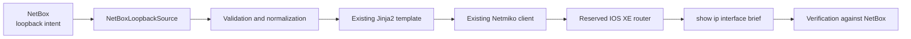

# Lab 4: Move the Source of Truth to NetBox

## Lab Introduction

Lab 3 stored intent for loopback management in `data/loopbacks.yaml`. That approach made the first automation workflow easy to understand, but a flat file provides few relationships, limited search, and no built-in API or object history. In this lab, learners keep the same `network_automation_project` repository and move the authoritative loopback data to NetBox.

NetBox will model the Cisco IOS XE sandbox as a device. Each managed loopback will be a virtual interface with exactly one IPv4 `/32` address and the tag `automation-managed`. The Python project will query those objects through the NetBox REST API, validate them, render the existing Jinja2 template, configure Cisco IOS XE router with the existing Netmiko class, and verify the result.

The YAML file remains in Git as evidence of Lab 3, but it is no longer the active source of truth after this lab.

## Learning Objectives

- Explain why NetBox is more suitable than a flat YAML file for shared network intent.
- Model a router, virtual interfaces, tags, and IP assignments in NetBox.
- Create a restricted NetBox API token.
- Retrieve and validate loopback intent with `pynetbox`.
- Reuse the existing Jinja2 and Netmiko workflow.

## Prerequisites

- Labs 1–3 completed
- NetBox installed and running from the updated Lab 1
- Active Cisco IOS XE reservable sandbox and VPN connection
- Existing local clone at `~/ccnpauto-workspace/network_automation_project`
- Loopback automation from Lab 3 working successfully

## Cumulative Architecture



## Task 1: Continue the Existing Repository

Do not create another GitLab project. Update the existing clone and create a focused branch:

```bash
cd ~/ccnpauto-workspace/network_automation_project
git switch main
git pull --ff-only
git switch -c feature/netbox-source-of-truth
```

Copy the Lab 4 additions into the existing repository:

```bash
LAB4_FILES="/path/to/CCNPAUTO/LAB/Lab4"
cp "$LAB4_FILES/requirements-additions.txt" .
cp "$LAB4_FILES/src/netbox_source.py" "$LAB4_FILES/src/loopback_renderer.py" src/
cp "$LAB4_FILES/scripts/validate_netbox.py" \
  "$LAB4_FILES/scripts/sync_loopbacks_from_netbox.py" scripts/
python -m pip install -r requirements-additions.txt
```

Add `pynetbox>=7.4,<8` to the main `requirements.txt` so later CI jobs install the complete dependency set.

## Task 2: Start and Verify NetBox

Start the NetBox Docker Compose project installed in Lab 1:

```bash
cd ~/lab-services/netbox-docker
docker compose up -d
docker compose ps
curl -I http://127.0.0.1:8000
```

Open `http://127.0.0.1:8000` and sign in with the administrator created in Lab 1.

## Task 3: Model the Cisco IOS XE Sandbox Router

Create these objects through the NetBox interface. Existing equivalent objects may be reused.

| NetBox object | Value |
|---|---|
| Site | `DEVNET-SANDBOX` |
| Manufacturer | `Cisco` |
| Device type | `IOS-XE-SANDBOX` |
| Device role | `Router` |
| Platform | `Cisco IOS XE` |
| Device | `iosxe-sandbox` |
| Tag | Name `Automation Managed`, slug `automation-managed` |

The NetBox device represents the reserved router logically. The connection hostname and credentials remain outside NetBox because reservation endpoints and passwords change.

## Task 4: Move the Existing Loopbacks into NetBox

For every loopback currently defined in `data/loopbacks.yaml`, create a NetBox interface on `iosxe-sandbox`:

| Field | Required value |
|---|---|
| Name | `Loopback<number>` |
| Type | Virtual |
| Enabled | Yes unless intentionally shut down |
| Description | One-line IOS XE description |
| Tag | `automation-managed` |

Then create one IPv4 address with `/32` prefix length and assign it to the interface. NetBox stores the relationship between address and interface; the script does not infer an address from the interface number.

Do not tag the management interface or any interface not owned by this project. The tag defines the automation boundary.

## Task 5: Create a NetBox API Token

Create a token for the learner or a dedicated automation user. It requires read access to:

- DCIM devices
- DCIM interfaces
- IPAM IP addresses
- Extras tags

Copy `.env.additions.example` values into the repository's untracked `.env`:

```dotenv
NETBOX_URL=http://127.0.0.1:8000
NETBOX_TOKEN=<token>
NETBOX_DEVICE=iosxe-sandbox
NETBOX_TAG=automation-managed
```

Never commit the token. Confirm:

```bash
git check-ignore -v .env
```

## Task 6: Extend the Shared Settings Class

Open `src/settings.py` from Lab 3 and add the four attributes shown in `settings-netbox-addition.txt` inside `Settings.__init__`. Keep the existing IOS XE attributes and safety controls unchanged.

This is an incremental change to one settings object. Existing Lab 3 scripts should continue to work.

## Task 7: Validate NetBox Without Changing the Router

Run:

```bash
python -m scripts.validate_netbox
```

The validator requires:

- an exact `Loopback<number>` name;
- NetBox interface type `virtual`;
- the `automation-managed` tag;
- exactly one assigned IPv4 address;
- `/32` prefix length;
- unique interface numbers and addresses.

Correct invalid records in NetBox rather than weakening validation in Python.

## Task 8: Preview the Existing Jinja2 Workflow

The new source adapter returns the same normalized keys used in Lab 3: `id`, `description`, `ipv4`, `prefix_length`, `netmask`, and `enabled`. Therefore, the existing `templates/loopback.j2` does not need to change.

Temporarily keep `ALLOW_CONFIG_CHANGES=false` and run the validation again. Then inspect `scripts/sync_loopbacks_from_netbox.py`. It loads all managed intent once, renders one command list, and reuses `IOSXEDevice` for configuration and verification.

## Task 9: Reconcile NetBox to Cisco IOS XE sandbox router

Enable changes only for the active reservation:

```dotenv
SANDBOX_MODE=reserved
ALLOW_CONFIG_CHANGES=true
```

Run:

```bash
python -m scripts.sync_loopbacks_from_netbox
```

The script is additive. It creates or updates tagged NetBox loopbacks, but it does not delete router interfaces absent from NetBox. Automatic deletion is deliberately deferred because absence may represent incomplete data rather than approved removal.

After successful verification, return `ALLOW_CONFIG_CHANGES=false`.

## Task 10: Commit and Merge the Migration

```bash
git add requirements.txt requirements-additions.txt src scripts
git commit -m "Use NetBox as loopback source of truth"
git push -u origin feature/netbox-source-of-truth
```

Create a merge request into `main`. Include validation output and the number of reconciled loopbacks, but do not include tokens, passwords, or full sensitive inventory responses. Merge, then synchronize locally.

## Key Takeaways

- NetBox now owns managed loopback intent; the Lab 3 YAML file is historical rather than authoritative.
- Tags define a narrow automation scope.
- Validation occurs before device access.
- A normalized internal contract lets the data source change without rewriting the template or device client.
- NetBox state remains intent and must be verified against IOS XE operational state.

Lab 5 keeps this NetBox workflow but moves the IOS XE username and password from `.env` into HashiCorp Vault.

## References

- [NetBox documentation](https://netboxlabs.com/docs/netbox/)
- [NetBox REST API](https://netboxlabs.com/docs/netbox/integrations/rest-api/)
- [pynetbox documentation](https://pynetbox.readthedocs.io/)
