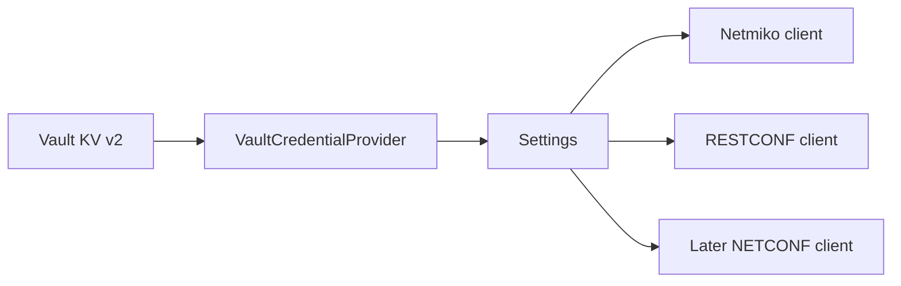

# Lab 5: Manage Credentials with HashiCorp Vault

## Lab Introduction

The cumulative project now reads loopback intent from NetBox, but its IOS XE username and password still live in `.env`. Ignoring that file in Git prevents an accidental commit, yet the secret remains a plain-text file on the workstation. In this lab, learners move the device credentials into HashiCorp Vault and change only the shared settings layer. Netmiko, RESTCONF, NetBox, Jinja2, and reporting code continue to consume `settings.username` and `settings.password` without knowing where those values originated.

Vault development mode is used because the course runs on one workstation. It is intentionally unsuitable for production: it uses HTTP, starts unsealed, stores data only in memory, and grants a root token. The lab makes that limitation explicit while teaching the correct application boundary.

## Learning Objectives

- Explain why `.gitignore` is not a complete secret-management strategy.
- Start and authenticate to a local Vault development server.
- Store IOS XE credentials in the KV version 2 secrets engine.
- Retrieve credentials through the `hvac` Python client.
- Avoid printing or logging secret values.
- Replace the settings implementation without rewriting device clients.
- Describe stronger production authentication such as AppRole or workload identity.

## Prerequisites

- Labs 1, 3, and 4 completed
- Existing `network_automation_project` repository
- HashiCorp Vault installed in Lab 1
- Active reservable IOS XE sandbox when running the final verification

## Task 1: Continue the Same Repository

```bash
cd ~/ccnpauto-workspace/network_automation_project
git switch main
git pull --ff-only
git switch -c feature/vault-credentials
```

Copy the additions:

```bash
LAB5_FILES="/path/to/CCNPAUTO/LAB/Lab5"
cp "$LAB5_FILES/src/vault_credentials.py" src/
cp "$LAB5_FILES/src/settings.py" src/settings.py
cp "$LAB5_FILES/scripts/verify_vault.py" scripts/
cp "$LAB5_FILES/requirements-additions.txt" .
python -m pip install -r requirements-additions.txt
```

Add `hvac>=2.3,<3` to the cumulative `requirements.txt`.

## Task 2: Start Vault Development Mode

Open a dedicated terminal:

```bash
vault server -dev \
  -dev-listen-address="127.0.0.1:8200" \
  -dev-root-token-id="lab-root-token"
```

Leave it running. In another terminal:

```bash
export VAULT_ADDR="http://127.0.0.1:8200"
vault login token=lab-root-token
vault status
```

`vault login` writes the token to `~/.vault-token` with restrictive permissions. The Python provider reads that file for an interactive workstation session. The IOS XE password is not placed in `.env`.

## Task 3: Write the IOS XE Secret

Use the current reservation credentials:

```bash
vault kv put secret/ccnpauto/iosxe \
  username='<sandbox-username>' \
  password='<sandbox-password>'
```

Verify keys without displaying the password:

```bash
vault kv get -field=username secret/ccnpauto/iosxe
vault kv metadata get secret/ccnpauto/iosxe
```

Shell history can still retain the `vault kv put` command. For a less exposed entry, write a temporary JSON file with mode 600, load it with Vault, and securely remove it according to organizational policy. Production workflows should obtain secrets through controlled provisioning rather than manual shell history.

## Task 4: Remove Device Credentials from `.env`

Replace `.env` with the Lab 5 structure. Preserve host, port, NetBox, and safety values, but remove:

```text
IOSXE_USERNAME
IOSXE_PASSWORD
```

Add:

```dotenv
VAULT_ADDR=http://127.0.0.1:8200
VAULT_MOUNT=secret
VAULT_IOSXE_PATH=ccnpauto/iosxe
```

Search tracked files for the actual username or a known password fragment before committing. Never print the real value merely to perform the search.

## Task 5: Understand the Credential Provider

`VaultCredentialProvider` authenticates with `VAULT_TOKEN` when CI supplies one; otherwise it reads the token created by `vault login`. It then calls the KV v2 API and requires both `username` and `password` keys.

`Settings` still exposes the same public attributes. This dependency inversion is the key design choice:



Transport clients do not need Vault-specific code.

## Task 6: Verify Without Revealing Credentials

```bash
python -m scripts.verify_vault
```

The script reports only character counts. It must never print the credential values.

Stop Vault and repeat the command. It should fail clearly instead of falling back to an old `.env` password. Restart Vault and rewrite the secret because development-mode data disappears after shutdown.

## Task 7: Re-run Existing Project Functions

Read-only project validation should work while the settings layer retrieves credentials from Vault:

```bash
python -m scripts.validate_netbox
```

With an active reservation and explicit approval:

```dotenv
ALLOW_CONFIG_CHANGES=true
```

```bash
python -m scripts.sync_loopbacks_from_netbox
```

Return the flag to false after verification.

## Task 8: Commit and Merge

```bash
git add requirements.txt requirements-additions.txt src/settings.py \
  src/vault_credentials.py scripts/verify_vault.py
git commit -m "Retrieve IOS XE credentials from Vault"
git push -u origin feature/vault-credentials
```

Review the merge request carefully. The diff must not contain credentials, Vault tokens, or `.env`.

## Production Considerations

Development mode is useful only for learning. A production Vault design requires persistent encrypted storage, TLS, initialization and unseal procedures, backups, audit devices, restrictive policies, token expiry, and an application authentication method. A CI job should normally use a short-lived identity such as AppRole, JWT/OIDC, or a platform workload identity rather than a static root token.

## Key Takeaways

- Device credentials are now stored in Vault rather than `.env`.
- The settings layer isolates secret retrieval from transport code.
- Secret values must remain absent from logs, Git history, screenshots, and artifacts.
- Vault availability and authentication failures must stop automation safely.
- Development-mode Vault is not a production deployment.

Lab 6 adds NETCONF and uses Cisco IOS XE native YANG to place every NetBox-managed loopback into OSPF area 0.

## References

- [Vault KV version 2](https://developer.hashicorp.com/vault/docs/secrets/kv/kv-v2)
- [Vault authentication methods](https://developer.hashicorp.com/vault/docs/auth)
- [hvac documentation](https://python-hvac.org/)
