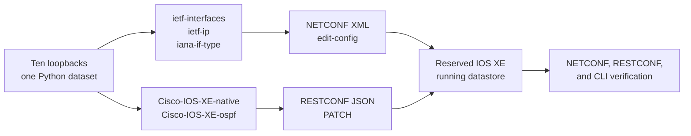
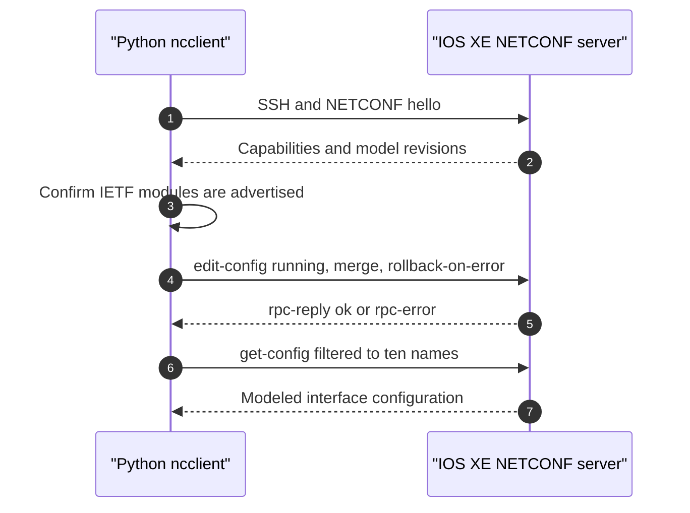

# Lab 5: Model-Driven Configuration with NETCONF and RESTCONF

## Lab Introduction

Traditional network automation often begins by sending CLI commands, but model-driven interfaces expose configuration as structured data governed by YANG schemas. The schema defines node names, hierarchy, datatypes, list keys, constraints, and namespaces. NETCONF and RESTCONF then provide different protocol operations over that modeled data. As a result, success depends on understanding both the protocol and the model rather than translating CLI lines mechanically into XML or JSON.

In this lab, learners use Cisco YANG Suite to investigate the models advertised by a reservable IOS XE sandbox. The first configuration task creates ten loopback interfaces through NETCONF using `ietf-interfaces`, `ietf-ip`, and `iana-if-type`. The second task uses RESTCONF and the Cisco IOS XE native OSPF model to place the ten loopback host addresses into OSPF process 10, area 0. Python scripts generate the same payloads examined in YANG Suite, apply them only after an explicit safety gate is enabled, and retrieve the resulting configuration for verification.

## Learning Objectives

After completing this lab, you will be able to:

- Explain the relationship among YANG, NETCONF, RESTCONF, XML, and JSON.
- Read module namespaces, prefixes, containers, lists, keys, and leaf datatypes.
- Use YANG Suite to discover models from an IOS XE NETCONF server.
- Confirm whether IOS XE advertises the required IETF and Cisco native modules.
- Build a NETCONF `<edit-config>` payload from IETF interface models.
- Configure ten loopback interfaces in one transaction.
- Interpret `<rpc-reply>`, `<ok/>`, and `<rpc-error>` results.
- Build a RESTCONF URI and RFC 7951 JSON payload from Cisco IOS XE native YANG.
- Configure OSPF network statements for the loopback addresses in area 0.
- Interpret RESTCONF HTTP status codes and YANG error bodies.
- Retrieve and compare intended and observed configuration.
- Explain why model revisions and namespaces must be discovered rather than assumed.
- Remove only the resources owned by the lab.

## Estimated Time

Allow approximately **4 to 5 hours**, including YANG Suite model discovery and payload analysis.

## Prerequisites

- Ubuntu 26.04 workstation prepared in Lab 1
- Cisco YANG Suite installed and tested in Lab 1
- Active `ccnpauto` Python virtual environment
- Local GitLab and GitLab Runner
- A Cisco IOS XE **reservable** DevNet Sandbox instance
- NETCONF access, normally TCP 830
- RESTCONF access over the HTTPS port supplied with the reservation
- SSH access for independent CLI verification

The lab changes router configuration and must not use an Always-On shared instance. Confirm that the reservation belongs to the learner and that its remaining duration is sufficient. Do not save the changes to startup configuration.

## Addressing and Ownership

The supplied defaults reserve these resources for the exercise:

| Resource | Lab value |
|---|---|
| Interfaces | Loopback501 through Loopback510 |
| IPv4 addresses | `198.18.10.1/32` through `198.18.10.10/32` |
| Descriptions | `LAB5_IETF_NETCONF` |
| OSPF process | 10 |
| OSPF area | 0 |
| OSPF wildcard | `0.0.0.0` for each host address |

The `198.18.0.0/15` block is reserved for benchmark testing. It is suitable for this isolated, disposable exercise, but it must not be introduced into a real routed environment without an approved addressing design. Before proceeding, verify that the selected loopback IDs and OSPF process do not already carry sandbox configuration that the lab does not own.

## Model and Protocol Architecture



The IETF interface model describes portable interface intent. The IOS XE native OSPF model follows Cisco's native configuration hierarchy more closely. Using both in one workflow illustrates an important engineering reality: an application may combine standards-based models with vendor-native models when feature coverage differs.

## Project Structure

```text
lab5-model-driven-iosxe/
├── .env.example
├── .gitignore
├── requirements.txt
├── artifacts/
│   ├── netconf-loopbacks.xml
│   └── restconf-ospf.json
├── scripts/
│   ├── preview_payloads.py
│   ├── configure_loopbacks_netconf.py
│   ├── configure_ospf_restconf.py
│   └── cleanup_lab5.py
└── src/
    ├── settings.py
    ├── payloads.py
    ├── netconf_client.py
    └── restconf_client.py
```

## Task 1: Create the GitLab Project

Create a blank private GitLab project named `lab5-model-driven-iosxe`, copy its exact HTTP clone URL, and clone it:

```bash
cd "$HOME/ccnpauto-workspace"
git clone \
  http://gitlab.lab.local:8088/ACTUAL_USERNAME/lab5-model-driven-iosxe.git
cd lab5-model-driven-iosxe
```

Copy the supplied files directly into the repository:

```bash
LAB5_FILES="/path/to/CCNPAUTO/LAB/Lab5"
cp "$LAB5_FILES/.env.example" "$LAB5_FILES/.gitignore" .
cp "$LAB5_FILES/requirements.txt" .
cp -R "$LAB5_FILES/scripts" "$LAB5_FILES/src" .
```

Install missing dependencies in the course environment:

```bash
source "$HOME/.venvs/ccnpauto/bin/activate"
python -m pip install -r requirements.txt
python -m pip check
```

Commit the initial project:

```bash
git add .
git commit -m "Add model-driven IOS XE lab"
git push -u origin main
```

## Task 2: Configure the Reserved Sandbox Connection

Copy and protect the environment file:

```bash
cp .env.example .env
chmod 600 .env
code .env
```

Enter the host, assigned ports, username, and password from the active reservation. Keep the write gate disabled:

```dotenv
ALLOW_CONFIG_CHANGES=false
```

Confirm that Git ignores the secret-bearing file:

```bash
git check-ignore -v .env
```

Test the protocol ports without sending configuration:

```bash
nc -vz "$IOSXE_HOST" 830
nc -vz "$IOSXE_HOST" 443
```

Because variables stored in `.env` are not automatically exported to the shell, substitute the actual reservation host and assigned ports if the commands above do not expand. The Python application loads `.env` directly through `python-dotenv`.

## Task 3: Start YANG Suite and Create the Device Profile

Start the YANG Suite installation created in Lab 1:

```bash
cd "$HOME/lab-services/yangsuite/docker"
docker compose up -d
docker compose ps
```

Open the YANG Suite URL established in Lab 1, normally:

```text
https://localhost:8443
```

In **Setup**, create an IOS XE device profile using the reserved host, NETCONF port, username, and password. Select the option appropriate for an IOS XE NETCONF device and test connectivity. A successful profile proves SSH transport and NETCONF subsystem access; it does not yet prove that every desired model is writable.

YANG Suite labels vary slightly by release. Use the areas for device profiles, YANG module repositories, model sets, exploration, NETCONF, and RESTCONF rather than relying only on the position of a button in a screenshot.

## Task 4: Retrieve and Organize the YANG Models

Use YANG Suite to retrieve the device capability list and download modules with NETCONF `<get-schema>` where supported. Create a repository and model set for the active IOS XE release. At minimum, locate:

- `ietf-interfaces`
- `ietf-ip`
- `iana-if-type`
- `ietf-netconf`
- `Cisco-IOS-XE-native`
- `Cisco-IOS-XE-ospf`
- Imported Cisco type modules reported by YANG Suite

Record the module revisions advertised by the device. A filename or online example from another IOS XE release is not sufficient evidence. The server's `<hello>` capability list is the contract for the active session.

In the YANG tree explorer, locate this IETF hierarchy:

```text
interfaces
└── interface [name]
    ├── name
    ├── description
    ├── type
    ├── enabled
    └── ipv4
        └── address [ip]
            ├── ip
            └── prefix-length
```

Then locate the Cisco native OSPF hierarchy:

```text
native
└── router
    └── router-ospf
        └── ospf
            └── process-id [id]
                ├── id
                └── network [ip wildcard]
                    ├── ip
                    ├── wildcard
                    └── area
```

Notice that the OSPF `network` list has two keys: `ip` and `wildcard`. The `area` leaf is data associated with that keyed entry. These schema details explain both the JSON structure and the RESTCONF list-instance URI.

## Task 5: Compare Namespaces and Encodings

The same YANG data node is represented differently in XML and JSON. XML uses namespace URIs:

| Module | XML namespace |
|---|---|
| `ietf-interfaces` | `urn:ietf:params:xml:ns:yang:ietf-interfaces` |
| `ietf-ip` | `urn:ietf:params:xml:ns:yang:ietf-ip` |
| `iana-if-type` | `urn:ietf:params:xml:ns:yang:iana-if-type` |
| `Cisco-IOS-XE-native` | `http://cisco.com/ns/yang/Cisco-IOS-XE-native` |
| `Cisco-IOS-XE-ospf` | `http://cisco.com/ns/yang/Cisco-IOS-XE-ospf` |

RFC 7951 JSON uses module names to qualify members when the namespace changes. Therefore, the native `router` member is named `Cisco-IOS-XE-native:router`, while the augmented child is named `Cisco-IOS-XE-ospf:router-ospf`. Descendants remain unqualified while they stay in the OSPF module's namespace.

This is not cosmetic syntax. A payload with the correct leaf names but incorrect namespaces targets different—or nonexistent—schema nodes.

## Task 6: Generate and Review Both Payloads

Create a feature branch:

```bash
git switch -c feature/model-driven-loopbacks
python -m scripts.preview_payloads
```

The script generates two ignored files:

```text
artifacts/netconf-loopbacks.xml
artifacts/restconf-ospf.json
```

Format and inspect them:

```bash
python - <<'PY'
from xml.dom import minidom
from pathlib import Path

path = Path("artifacts/netconf-loopbacks.xml")
print(minidom.parseString(path.read_text()).toprettyxml(indent="  "))
PY

python -m json.tool artifacts/restconf-ospf.json
```

The NETCONF payload contains a NETCONF `config` wrapper and ten `interface` list entries. Each entry uses its interface name as the key, the `softwareLoopback` identity from `iana-if-type`, and an IPv4 address from `ietf-ip`. The OSPF payload contains one process with ten network entries. A wildcard of `0.0.0.0` matches exactly one address, which allows the lab to select each loopback explicitly.

## Task 7: Validate the NETCONF Payload in YANG Suite

Open YANG Suite's NETCONF area, choose the reserved device, and construct an `<edit-config>` operation against the running datastore. Use `merge` as the default operation and request `rollback-on-error` if the server advertises that capability.

Paste the generated payload into YANG Suite or use the tree to generate the equivalent `<config>` content. Validate it against the active model set before sending. Check these details carefully:

- The root is `interfaces` in the `ietf-interfaces` namespace.
- `interface` is keyed by `name`.
- The interface type is `ianaift:softwareLoopback` with the identity namespace declared.
- `ipv4` and its address children use the `ietf-ip` namespace.
- `prefix-length` is the integer `32`.
- Exactly Loopback501 through Loopback510 are present.

Keep the write gate in `.env` disabled during this inspection. YANG Suite validation catches many schema problems, but it cannot decide whether the selected IDs and addresses are operationally safe.

## Task 8: Configure Ten Loopbacks with NETCONF

Perform an independent CLI pre-check:

```text
show ip interface brief | include Loopback50
show running-config | section ^interface Loopback50
```

If any owned identifier already contains unrelated configuration, stop and select an instructor-approved range. Otherwise, enable the write gate:

```dotenv
ALLOW_CONFIG_CHANGES=true
```

Run the NETCONF workflow:

```bash
python -m scripts.configure_loopbacks_netconf
```

The application performs the following sequence:



`rollback-on-error` requests that the server undo the entire edit when one element fails, provided the server supports the capability. This is preferable to leaving an unknown partial result. The script prints the filtered `get-config` response so learners can compare the configured address, type, description, and enabled state with the source data.

An `<ok/>` reply means the server accepted the requested edit. It does not prove that the interfaces are operationally useful, that routing is correct, or that a later system process did not alter the state. Verification remains a separate step.

## Task 9: Verify the Loopbacks Through Three Views

First, use YANG Suite NETCONF with a subtree filter for one interface:

```xml
<interfaces xmlns="urn:ietf:params:xml:ns:yang:ietf-interfaces">
  <interface>
    <name>Loopback501</name>
  </interface>
</interfaces>
```

Next, retrieve the IETF interface data with RESTCONF if the active image exposes the corresponding resource:

```bash
curl --insecure --user 'USERNAME:PASSWORD' \
  -H 'Accept: application/yang-data+json' \
  'https://IOSXE_HOST:HTTPS_PORT/restconf/data/ietf-interfaces:interfaces/interface=Loopback501'
```

Finally, verify through CLI:

```text
show ip interface brief | include Loopback50
show running-config interface Loopback501
show running-config interface Loopback510
```

The three views serve different purposes. NETCONF and RESTCONF show modeled configuration, while CLI provides a familiar operational cross-check. The expected result is ten loopbacks with addresses `198.18.10.1` through `198.18.10.10`, each using a /32 prefix.

## Task 10: Validate the Cisco Native OSPF Payload in YANG Suite

In YANG Suite, select `Cisco-IOS-XE-native` and `Cisco-IOS-XE-ospf`. Follow the tree from `native/router` into the OSPF augmentation. Compare the generated JSON with the exact active model revision.

The lab sends an HTTP PATCH to:

```text
/restconf/data/Cisco-IOS-XE-native:native/router
```

The body merges this logical structure beneath the native router container:

```json
{
  "Cisco-IOS-XE-native:router": {
    "Cisco-IOS-XE-ospf:router-ospf": {
      "ospf": {
        "process-id": [
          {
            "id": 10,
            "network": [
              {
                "ip": "198.18.10.1",
                "wildcard": "0.0.0.0",
                "area": 0
              }
            ]
          }
        ]
      }
    }
  }
}
```

The actual generated file contains ten network entries. PATCH is chosen because the router container may already contain other routing protocol configuration. Replacing the complete container with PUT would require a complete intended representation and could remove omitted data.

Use YANG Suite's RESTCONF function to perform a read-only GET of the router or OSPF resource first. Confirm the path and inspect existing OSPF processes. Do not send the PATCH from both YANG Suite and Python unless you intentionally want to demonstrate idempotent merge behavior.

## Task 11: Configure OSPF Area 0 with RESTCONF

Run the RESTCONF workflow:

```bash
python -m scripts.configure_ospf_restconf
```

The expected success code for an edit of an existing resource is usually HTTP `204 No Content`; server behavior can also return another successful 2xx response. The script accepts `200`, `201`, or `204` and then performs a GET of the OSPF container.

Interpret the result rather than stopping at the status code. The returned process should have ID 10, and its network list should contain ten composite keys consisting of each loopback address and wildcard `0.0.0.0`. Every entry should have area 0.

Common failure meanings include:

| Result | Likely interpretation |
|---|---|
| `400 Bad Request` | JSON syntax, namespace, datatype, or YANG constraint problem |
| `401 Unauthorized` | Invalid or missing authentication |
| `403 Forbidden` | Authenticated account lacks permission |
| `404 Not Found` | Resource path or model is unavailable on this image |
| `409 Conflict` | Requested state conflicts with existing datastore state |
| `415 Unsupported Media Type` | Incorrect RESTCONF content type |
| `500` series | Server-side processing failure; inspect the YANG error body and logs |

IOS XE commonly returns a structured `ietf-restconf:errors` body. Preserve that body in troubleshooting evidence because its `error-tag`, `error-path`, and message are more useful than the HTTP code alone.

## Task 12: Verify OSPF Behavior

Use CLI to verify the native configuration:

```text
show running-config | section ^router ospf 10
show ip protocols
show ip ospf interface brief
show ip ospf interface Loopback501
show ip route ospf
```

With only one router, no OSPF neighbors are expected. That is not a lab failure. The goal is to activate OSPF on the ten loopbacks and place their host routes into the local link-state database. IOS XE normally advertises a loopback as a /32 in OSPF regardless of a broader configured interface mask; this lab already uses /32 addresses, so intended and advertised prefix lengths align.

Also use YANG Suite or Python to GET the OSPF configuration. Compare four layers:

1. The Python loopback dataset
2. The generated JSON payload
3. The RESTCONF GET response
4. The CLI running configuration

A mature automation workflow treats disagreement among these layers as drift or a failed change, even when the original PATCH returned success.

## Task 13: Examine Idempotence

Run each configuration script a second time:

```bash
python -m scripts.configure_loopbacks_netconf
python -m scripts.configure_ospf_restconf
```

Because NETCONF uses merge semantics and the RESTCONF PATCH supplies the same keyed list entries, the intended state should remain unchanged. Retrieve the configuration again and confirm that IOS XE did not create duplicate interfaces or OSPF network statements.

Idempotence does not mean every repeated operation is free. Each call still consumes a session, authentication work, parsing, validation, logging, and device CPU. Applications should avoid unnecessary writes even when the resulting configuration is stable.

## Task 14: Review the Code and Commit the Lab

The class boundaries are deliberately small:

- `Settings` owns environment validation and the ten-interface dataset.
- `NETCONFClient` owns NETCONF session and RPC operations.
- `RESTCONFClient` owns the HTTP session, headers, and response checks.
- `payloads.py` translates the shared intent into XML and JSON.
- Scripts provide visible `try/except/finally` control flow.

Review the branch without staging generated artifacts or secrets:

```bash
git status --short --ignored
git check-ignore -v .env artifacts/netconf-loopbacks.xml
git diff
```

Commit learner notes or deliberate enhancements:

```bash
git add .
git diff --staged
git commit -m "Complete NETCONF and RESTCONF configuration lab"
git push -u origin feature/model-driven-loopbacks
```

Create a merge request, review it for credentials and device output, and merge it into `main`.

## Task 15: Clean Up the Reserved Router

Cleanup first removes OSPF process 10 through RESTCONF and then deletes the ten interface list entries through NETCONF:

```bash
python -m scripts.cleanup_lab5
```

Verify through CLI:

```text
show running-config | section ^router ospf 10
show ip interface brief | include Loopback50
```

The expected output contains neither the lab OSPF process nor Loopback501 through Loopback510. If cleanup returns an error after partially completing, retrieve actual state before retrying. Never broaden a DELETE request merely to make cleanup faster.

Return the local safety gate to its default:

```dotenv
ALLOW_CONFIG_CHANGES=false
```

End the sandbox reservation normally. Do not issue `write memory` or copy the running configuration to startup configuration.

## Troubleshooting

### YANG Suite cannot connect to NETCONF

Confirm the VPN, assigned host and port, credentials, and reservation status. Test TCP reachability, then inspect whether the device profile selected NETCONF over SSH rather than ordinary CLI SSH.

### A required module is not advertised

Do not force a payload copied from another release. Record the device version and capability list, refresh the YANG Suite repository, and confirm whether the sandbox image implements a different revision or feature model. Ask the instructor before substituting a native interface model for the required IETF exercise.

### NETCONF returns unknown-element or unknown-namespace

Compare every element with the namespace in YANG Suite. In particular, `ipv4`, `address`, `ip`, and `prefix-length` belong to `ietf-ip`, even though they appear beneath an interface from `ietf-interfaces`.

### NETCONF returns data-exists

One of the loopback keys may already exist, or an explicit create operation may have replaced merge semantics. Retrieve the interface before deciding whether the lab owns it. Do not delete an existing interface merely to make the exercise pass.

### RESTCONF returns 404

Verify that the URI begins with `/restconf/data`, that module and node names use the correct case, and that `Cisco-IOS-XE-ospf` is advertised. Use YANG Suite to generate or test the path against the active image.

### RESTCONF returns 400 with an error-path

Follow the `error-path` into the YANG tree. Check whether the local model revision uses the expected `router-ospf/ospf/process-id` hierarchy and whether `area` accepts an integer or dotted area identifier.

### OSPF has no neighbors

This single-router exercise does not create another OSPF speaker. Verify interface participation and local OSPF state rather than expecting a neighbor adjacency.

### Cleanup reports 404

For cleanup, 404 can mean the resource is already absent. Confirm actual state. The supplied OSPF cleanup treats 404 as an acceptable no-op, while interface deletion may report an RPC error if the interfaces have already been removed.

## Key Takeaways

- YANG defines the structure and constraints; NETCONF and RESTCONF transport operations over that model.
- The device capability list and active model revisions are authoritative for a session.
- XML namespaces and JSON module qualification determine which schema nodes a payload addresses.
- IETF interface models provide portable intent, while Cisco native YANG exposes IOS XE-specific OSPF structure.
- One NETCONF `<edit-config>` can apply multiple keyed list entries as a transaction-like operation.
- `rollback-on-error` reduces partial configuration when the server supports it.
- RESTCONF PATCH is appropriate for merging selected state into an existing container.
- HTTP success confirms protocol acceptance, not end-to-end routing correctness.
- OSPF network statements select interfaces by matching their addresses; they do not directly create routes or neighbors.
- Verification must compare intended, modeled, and operational state.
- Idempotent operations remain operationally expensive and should not be repeated without reason.
- Cleanup must be scoped to resources the lab owns.

The next lab can build on these modeled operations by expressing the same intended state through a configuration-management system, where inventory, templates, idempotence, drift detection, and secret retrieval are coordinated across multiple devices.

## Further Reading

- [Cisco IOS XE programmability](https://developer.cisco.com/iosxe/)
- [Cisco YANG Suite documentation](https://developer.cisco.com/docs/yangsuite/)
- [Cisco IOS XE YANG models](https://github.com/YangModels/yang/tree/main/vendor/cisco/xe)
- [RFC 6241: NETCONF Protocol](https://www.rfc-editor.org/rfc/rfc6241)
- [RFC 8040: RESTCONF Protocol](https://www.rfc-editor.org/rfc/rfc8040)
- [RFC 7950: YANG 1.1](https://www.rfc-editor.org/rfc/rfc7950)
- [RFC 7951: JSON Encoding of YANG Data](https://www.rfc-editor.org/rfc/rfc7951)
- [RFC 8343: Interface Management YANG](https://www.rfc-editor.org/rfc/rfc8343)
- [ncclient documentation](https://ncclient.readthedocs.io/)
- [Requests documentation](https://requests.readthedocs.io/)
