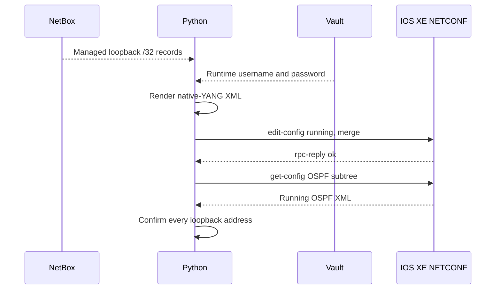

# Lab 6: Configure Network Device Using NETCONF with YANG Payload

## Lab Introduction

The project currently creates loopback interfaces through Netmiko. In this lab, learners add a second southbound method: NETCONF. The application reads the same loopbacks from NetBox, retrieves credentials through Vault, renders a Cisco IOS XE native-YANG XML payload, and merges OSPF network statements into the running datastore. Every managed loopback is advertised in OSPF area 0 with a host wildcard of `0.0.0.0`.

Cisco YANG Suite is central to the exercise. Learners must inspect the model revision exposed by their reserved router and use YANG Suite to build and test the payload before Python sends it. The supplied Jinja2 template represents a common IOS XE native model hierarchy, but the device-advertised model remains authoritative.

## Learning Objectives

- Verify NETCONF capabilities on IOS XE.
- Inspect Cisco IOS XE native and OSPF YANG modules in YANG Suite.
- Build an `<edit-config>` payload from the device model.
- Render one OSPF network element for every NetBox loopback.
- Use `ncclient` with credentials obtained from Vault.
- Merge configuration into the running datastore.
- Retrieve OSPF configuration through NETCONF for verification.
- Interpret NETCONF RPC errors rather than hiding them.

## Prerequisites

- Labs 1 and 3–5 completed
- Existing `network_automation_project`
- YANG Suite installed in Lab 1
- NetBox and Vault running
- Active IOS XE reservable sandbox and VPN
- NETCONF enabled by the sandbox

## Task 1: Continue the Existing Repository

```bash
cd ~/ccnpauto-workspace/network_automation_project
git switch main
git pull --ff-only
git switch -c feature/netconf-ospf
```

Copy the additions:

```bash
LAB6_FILES="/path/to/CCNPAUTO/LAB/Lab6"
cp "$LAB6_FILES/src/iosxe_netconf.py" "$LAB6_FILES/src/ospf_renderer.py" src/
cp "$LAB6_FILES/scripts/configure_ospf.py" scripts/
cp "$LAB6_FILES/templates/ospf_native.xml.j2" templates/
cp "$LAB6_FILES/requirements-additions.txt" .
cp "$LAB6_FILES/pytest.ini" .
cp -R "$LAB6_FILES/tests" .
python -m pip install -r requirements-additions.txt
```

Add `ncclient>=0.7,<1` and `pytest>=8,<9` to `requirements.txt`.

## Task 2: Add NETCONF Settings

Add this attribute inside `Settings.__init__`:

```python
self.netconf_port = int(os.getenv("IOSXE_NETCONF_PORT", "830"))
```

Add these nonsecret values to `.env`:

```dotenv
IOSXE_NETCONF_PORT=830
OSPF_PROCESS_ID=1
OSPF_AREA=0
```

The NETCONF client receives the username and password from the same Vault-backed settings used by Netmiko.

## Task 3: Verify NETCONF Reachability

Test TCP reachability:

```bash
nc -vz "$IOSXE_HOST" 830
```

On IOS XE, confirm NETCONF-YANG is enabled:

```text
show running-config | include netconf-yang
show netconf-yang sessions
```

If permitted and required on the reserved instance:

```text
configure terminal
 netconf-yang
end
```

Do not modify AAA, management routing, or unrelated services.

## Task 4: Use YANG Suite to Discover the OSPF Model

Start YANG Suite and open its web interface:

```bash
cd ~/lab-services/yangsuite/docker
docker compose up -d
```

Create or refresh the IOS XE device profile. Retrieve the advertised schemas and locate:

- `Cisco-IOS-XE-native`
- `Cisco-IOS-XE-ospf`
- `ietf-netconf`

In the tree viewer, follow the OSPF hierarchy under native configuration. Record the exact module revisions and confirm the structure leading to:

```text
native
└── router
    └── router-ospf
        └── ospf
            └── process-id
                ├── id
                └── network
                    ├── ip
                    ├── wildcard
                    └── area
```

Use YANG Suite's NETCONF plugin to retrieve the current OSPF subtree. Then build a minimal `<edit-config>` request for one lab loopback. Do not send it until the payload preview matches the active model.

## Task 5: Understand the Rendered Payload

The supplied template loops over the normalized NetBox records:

```xml

<network>
  <ip>{{ loopback.ipv4 }}</ip>
  <wildcard>0.0.0.0</wildcard>
  <area>{{ area }}</area>
</network>

```

A loopback uses a `/32`, so `0.0.0.0` matches exactly one interface address. All entries use area 0 as required by the course design.

Run the local renderer test:

```bash
pytest -q tests/test_ospf_renderer.py
```

Next, preview without allowing a change. Temporarily add a print-only call in a Python shell if desired:

```bash
python - <<'PY'
from src.netbox_source import NetBoxLoopbackSource
from src.ospf_renderer import OSPFRenderer
from src.settings import Settings

s = Settings()
items = NetBoxLoopbackSource(s.netbox_url, s.netbox_token, s.netbox_device, s.netbox_tag).load()
print(OSPFRenderer().render(items, process_id=1, area=0))
PY
```

Compare the result with the YANG Suite payload. If the reserved IOS XE release advertises a different hierarchy, update the Jinja2 template and the test together.

## Task 6: Ensure Loopbacks Exist First

OSPF should reference interfaces already present on IOS XE. Reconcile NetBox loopbacks before the OSPF task:

```dotenv
ALLOW_CONFIG_CHANGES=true
```

```bash
python -m scripts.sync_loopbacks_from_netbox
```

This explicit order becomes a CI dependency in Lab 7.

## Task 7: Configure OSPF Through NETCONF

Run:

```bash
python -m scripts.configure_ospf
```

The workflow is:



The script prints the payload for study, sends `edit-config` with merge semantics, retrieves the OSPF subtree, and confirms that every NetBox address is present.

## Task 8: Verify Operationally

Use read-only IOS XE commands:

```text
show ip ospf interface brief
show ip protocols
show running-config | section router ospf
```

A loopback can be included in OSPF even when no neighbor forms on it. The objective is to place each loopback's address under process 1, area 0—not to create an OSPF adjacency on a loopback.

## Task 9: Observe an RPC Error Safely

With changes disabled, make a temporary local copy of the template and misspell one modeled leaf. Preview it and compare it with YANG Suite. If the instructor permits sending the invalid payload in the reserved sandbox, IOS XE should return an `rpc-error` with an error tag, path, and message. Restore the valid template immediately.

The application catches `RPCError` and stops. It must not silently continue to verification after the device rejects configuration.

## Task 10: Commit and Merge

Return `ALLOW_CONFIG_CHANGES=false`, then:

```bash
git add requirements.txt requirements-additions.txt pytest.ini src scripts templates tests
git commit -m "Configure loopback OSPF through NETCONF"
git push -u origin feature/netconf-ospf
```

Merge after reviewing the exact XML template and successful verification evidence.

## Key Takeaways

- YANG Suite reveals the payload structure supported by the active IOS XE release.
- NETCONF transports modeled XML and returns structured RPC errors.
- NetBox remains the single loopback source of truth.
- Vault supplies credentials to both CLI and NETCONF clients.
- Jinja2 creates one area 0 network statement for every managed `/32`.
- Configuration success must be followed by retrieved-state and operational verification.

Lab 7 places the same validation, loopback, OSPF, and verification steps into a NetBox-triggered GitLab pipeline.

## References

- [NETCONF RFC 6241](https://www.rfc-editor.org/rfc/rfc6241)
- [Cisco YANG Suite](https://developer.cisco.com/docs/yangsuite/)
- [Cisco IOS XE YANG models](https://github.com/YangModels/yang/tree/main/vendor/cisco/xe)
- [ncclient documentation](https://ncclient.readthedocs.io/)
